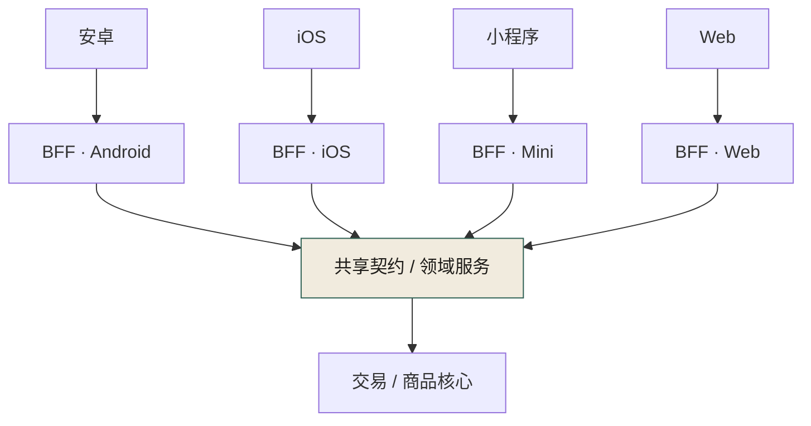
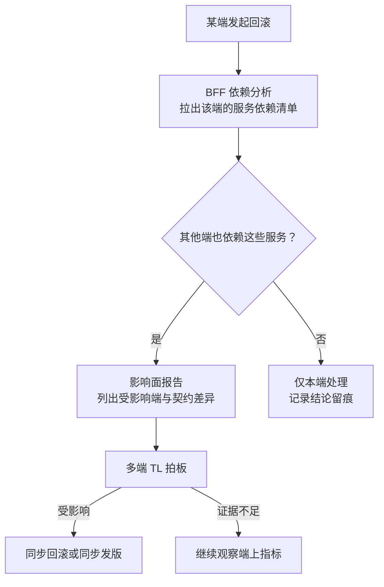
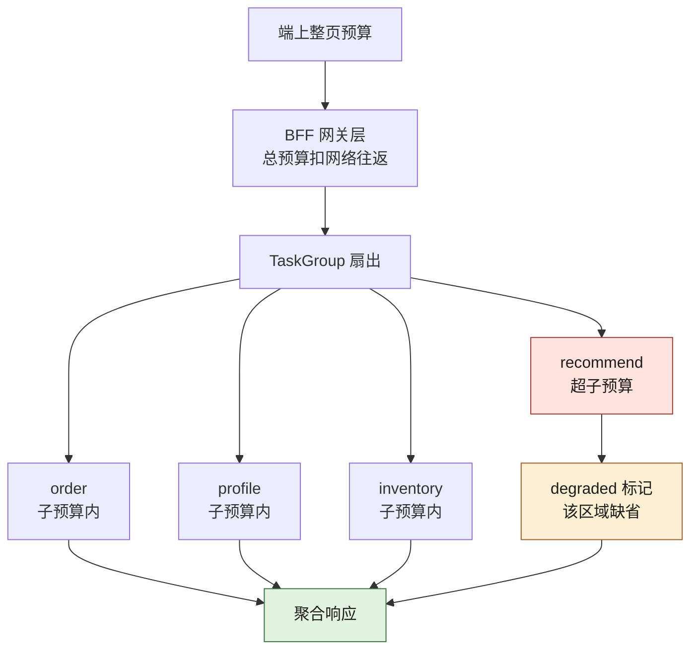
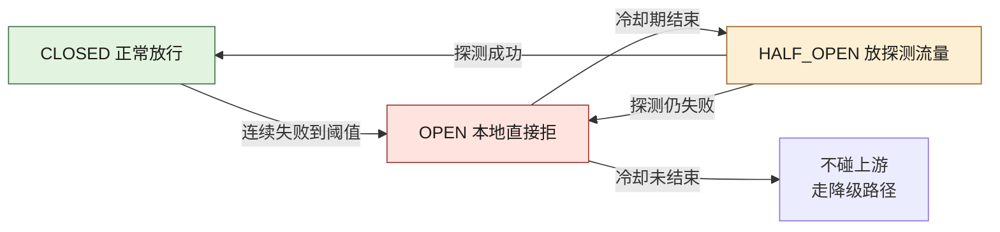
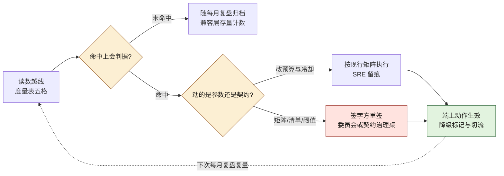

# 第 17 章 多端：Web、App、小程序与 BFF

> **本章定位**：当一个业务需要同时服务 Web、App、小程序、鸿蒙等多个端，且各端的接口需求天然不同时，如何在端和后端之间建立一层"为每端定制但不重复业务"的中间层。
> **核心命题**：多端不一致的根因不是"某个端写错了"，而是端和后端之间缺一个有 Owner、有契约、有回滚评估的"翻译层"。
> **本章回答第 27 章遗留问题**（老版本 App 怎么办）和 **第 28 章遗留问题**（多端回滚同步评估）。



**图 17-1｜多端 BFF** — 一份领域契约，多端翻译层各自适配；业务不重复进 BFF。

---

## 17.1 问题：多端的接口需求各不相同，但后端只有一套

在一次接口事故之后，多端负责人拿到了破坏性契约变更的签字权。但拿到权力只是开始——真正的难题是：**多个端的接口需求天然不同，但后端不可能为每个端维护一套服务。**

安卓需要 A 字段，iOS 需要 B 字段，小程序受包体限制只要最精简的响应，Web 需要完整的 SEO 友好数据，鸿蒙有自己的分发规范。如果让后端每个服务都 cater 多端需求，后端会被撕成碎片。如果让各端各自去后端的完整响应里"挑"自己需要的字段，又会回到接口事故的教训——各端理解不一致，挑错了就白屏。

这就是 BFF（Backend For Frontend）要解决的问题：**在端和后端服务之间，放一层"为每端定制但不重复业务"的中间层。** 图 17-1 加粗的位置就在这层的上端：安卓、iOS、小程序、Web 各有一个翻译层实例，四路全部收口进同一份共享契约/领域服务，业务逻辑只在下面的交易/商品核心存在一份——"定制但不重复"说的就是这个收口点。

---

## 17.2 根因：没有 BFF，端和后端直接对话

**① 端直接调后端服务。** 多个端各自拼接后端返回的数据，每个端的拼接逻辑不同。**后端改了一个字段，各端的拼接逻辑全要跟着改——但各端不会同时改。** 于是总有一两个端用的是旧拼接逻辑对接新后端，白屏。

**② AI 加剧了拼接逻辑的分叉。** AI 在每个端的代码里生成各自的"数据处理函数"，它不知道这些函数应该保持一致。**结果各端有了多份不同的拼接逻辑，维护成本是端数倍。**

**③ 没有人对"多端一致性"负责。** 后端负责人觉得"我接口没变"；各端负责人觉得"我端上逻辑没变"。但两者之间的"拼接层"没人管。**接口事故就是在这个无人区里发生的。**

---

## 17.3 AI 用法：BFF 里 AI 做裁剪和聚合，人定契约

BFF 的核心职责是：**聚合多个后端服务的响应、裁剪成该端需要的格式、做协议适配。** 这里 AI 很有用：

**AI 在 BFF 能做的：**
- 根据端的"需要字段清单"，自动生成裁剪逻辑
- 聚合多个服务调用为一个端友好的响应
- 生成端侧的类型桩（从共享契约推导）

**AI 不能做的：**
- **决定"哪些字段该给哪个端"。** 这涉及业务理解（比如"小程序不应该拿到完整的用户画像"），是人的决策。

BFF 的设计原则是：**业务逻辑在后端服务层，BFF 只做聚合/裁剪/适配。** 如果 BFF 开始承载业务规则，它就变成了"第二个后端"，维护成本翻倍。**这条边界必须人来守——AI 会本能地把逻辑往 BFF 里塞，因为这样代码"看起来更内聚"，但它破坏了"业务逻辑只存在一份"的原则。**

---

## 17.4 回答遗留一：老版本 App 怎么办（回应第 27 章）

这是第 27 章留下的债：契约变了，线上还有用老版本 App 的用户，破坏性变更会让他们直接挂掉。

实践中常用的策略分三层：

**① 契约层面：版本化路由。** 后端根据请求头的 App 版本号，路由到不同版本的响应格式。新版本用新契约，老版本用兼容契约。**代价：后端同时维护多个版本的响应逻辑，直到老版本用户比例低于阈值。**

**② BFF 层面：版本适配。** BFF 检测请求来源版本，做格式转换——如果后端只提供了新版本接口，BFF 负责把新格式"翻译"回老版本能理解的格式。**这把兼容的负担从后端挪到了 BFF，后端可以更快地淘汰老版本。**

**③ 强制升级策略。** 当某个版本的用户比例低于 5% 且有安全风险时，触发强制升级——下次打开 App 弹窗"请升级到最新版本"。**这个阈值和触发条件由委员会定，不是技术单方面决定。**

这类方案上线后，多端负责人最常见的反馈是："终于不用凌晨去修老版本了。"

---

## 17.5 回答遗留二：多端回滚怎么同步评估（回应第 28 章）

第 28 章留下的问题：一个端回滚了，其他端要不要同步回滚？

在 BFF 架构下，这个问题有了一个自然的答案：**回滚的决策可以基于 BFF 层的依赖分析。**

```
一个端回滚了 → BFF 检查这个端依赖哪些后端服务
  → 这些服务是否也被其他端依赖？
    → 是 → 评估其他端是否受影响
    → 否 → 其他端不需要同步回滚
```

**BFF 成了"多端回滚同步评估"的天然信息枢纽**，因为它知道"哪个端依赖哪个服务"。实践中可以把这个评估做成半自动——BFF 在一个端回滚时，自动生成一份"影响面分析报告"，列出可能受影响的其他端，由人来拍板是否同步回滚。

把这条评估链路画出来，能看到「自动」与「人拍板」的分界线在哪里：



**图 17-2｜端回滚的影响面评估** — BFF 知道「哪个端依赖哪个服务」：回滚评估从靠人脑回忆变成一份自动生成的报告，人只负责拍板。

> **代价声明**：BFF 层的引入让架构多了一层，增加了约 15% 的运维复杂度。但在接口事故之后，团队普遍认同这个复杂度是值得的——**多端白屏的事故，在 BFF 上线后没有再发生过。**

---

## 17.6 产出物：BFF 规范 + 契约共享方案

1. **BFF 规范**：业务逻辑在后端、BFF 只做聚合裁剪适配；每端一个 BFF 实例；BFF 不承载业务规则。
2. **契约共享方案**：一份 OpenAPI 契约，各端的 BFF 从同一份契约生成各自的类型桩。
3. **版本兼容策略**：版本化路由 + BFF 适配 + 强制升级阈值。

> **代价声明**：BFF 让架构多了一层，但这层解决的是"多端各自拼接"这个无人区的治理真空。**没有 BFF，多端一致性永远靠某个一线通宵来保证；有了 BFF，一致性变成了一层中间件的职责。**

### 落地步骤：从「各端直连」迁到 BFF

迁移不要求一步到位，按端按链路逐步切，每一步都可回退：

1. **盘拼接清单**：列出所有端对后端响应做字段拼接的位置——每一处都是无人区，先标注风险再谈迁移。
2. **选切口**：选一个端的一条链路试点；包体受限的端对裁剪最敏感，收益最快可见。
3. **补契约**：先把这条链路的契约补进契约仓库，先一致再迁移——契约先行，不是先写 BFF。
4. **生成骨架**：从共享契约生成该端类型桩与 BFF 骨架，聚合与裁剪逻辑交给 AI，人只审边界。
5. **灰度切流**：端上按版本把流量从直连切到 BFF，盯错误率与延迟，异常即切回。
6. **下线旧路径**：老版本流量归零后删除端内拼接代码——无人区消失，迁移才算完成。
7. **复制到其他端**：每端重复第 3–6 步；契约始终只有一份，BFF 每端一个。
8. **接入值班**：端回滚影响面报告（图 17-2）接进 SRE 与多端 TL 的值班 runbook。

### 可抄配置：版本化路由与老版本适配

```yaml
# BFF 网关路由（占位示例：域名、集群、版本线均为占位符，按契约仓库的兼容矩阵填写）
gateway:
  routes:
    - name: order-api
      # 为什么按版本路由：破坏性变更后，新版本走新契约，老版本不裸奔
      match:
        header: { x-app-version: ">= 2.0.0" }
      upstream: order-service.v2
    - name: order-api-legacy
      match:
        header: { x-app-version: "< 2.0.0" }
      upstream: bff-adapter
      # 兼容翻译放 BFF：后端尽快淘汰老版本，包袱不在后端无限累积
  fallback:
    - when: upstream_timeout
      then: serve_cached_summary   # 超时给旧摘要：端上宁可拿旧数据，不白屏
  forced_upgrade:
    # 阈值与触发条件由委员会定（17.4 第③层），技术只执行不解释
    trigger: legacy_share_below_threshold AND security_risk
```

### 度量指标：BFF 层看什么

| 指标 | 怎么测 | 阈值 | 谁看 | 多久看一次 |
|---|---|---|---|---|
| 契约一致率 | 各端类型桩与契约仓库自动比对 | 跌破 97.4% 的治理后基线即告警 | 治理组 | 每周 |
| 端上白屏数 | 端侧打点回传 | 出现即事故，触发影响面评估 | 多端 TL | 每日 |
| 老版本占比 | 按版本聚合活跃用户 | 低于强制升级阈值且有安全风险，报委员会 | 多端 TL | 每月 |
| BFF 错误率与延迟 | 网关侧打点 | 越阈走降级路径 | SRE | 每日 |
| 兼容层存量 | legacy 路由条数 | 只许降不许升，上升即复盘 | 各端 Owner | 每月 |

### 反模式：BFF 层的五种死法

| # | 反模式 | 后果 |
|---|--------|------|
| 1 | 业务规则写进 BFF | 第二个后端，逻辑两份，事故双倍 |
| 2 | 各端各养一份契约 | 契约分裂，白屏换个姿势回来 |
| 3 | 兼容逻辑塞回后端服务 | 老版本包袱永远甩不掉 |
| 4 | 端回滚不评估其他端 | 二次事故在另一个端爆发 |
| 5 | BFF 层没有 Owner | 新的无人区取代旧的无人区 |

### 编排：TaskGroup 的超时预算与局部降级

上面的落地步骤、路由配置与度量指标管的是"流量怎么走"；还有一件更细的事必须人在 AI 动手之前定死：**一次请求扇出多个上游时，谁给谁让路**。这一格是 BFF 最容易长回"第二个后端"的地方，也是最容易整页白屏的地方。

组织需要它的理由：AI 写聚合逻辑时，默认写成一个个 `await` 串起来——代码读起来最自然，但延迟是所有上游之和，而且任何一个上游卡住，整页就跟着卡。多端场景里这更糟：小程序端的网络本来就差，一次上游抖动就能让整个页面转圈到超时。**哪些字段允许缺、缺了要不要标出来，是产品决策，不是 async 语法能替你决定的。**

下面这段是本机实跑（Python 3.14.4，只用标准库 `asyncio`，四个上游用 `sleep` 模拟），刻意让第四路超出自己的子预算：

```python
import asyncio, time

async def upstream(name, cost):
    await asyncio.sleep(cost)                # 真实场景里这里是一次 httpx 调用
    return f"{name}:payload"

async def budget_call(name, cost, budget):
    """每个上游一份子预算：到点只降级这一路，不牵连同请求的其他路。"""
    t0 = time.perf_counter()
    try:
        async with asyncio.timeout(budget):
            v = await upstream(name, cost)
        return {"name": name, "state": "OK", "value": v, "ms": round((time.perf_counter() - t0) * 1000, 1)}
    except TimeoutError:
        return {"name": name, "state": "TIMEOUT", "value": None, "ms": round((time.perf_counter() - t0) * 1000, 1)}

async def main():
    t0 = time.perf_counter()
    async with asyncio.TaskGroup() as tg:                      # 扇出：并发而非串行
        tasks = [tg.create_task(budget_call(n, c, 0.20))       # 四路共用一份子预算（示意值）
                 for n, c in [("order", 0.05), ("profile", 0.08), ("inventory", 0.03), ("recommend", 1.00)]]
    results = [t.result() for t in tasks]
    for r in results:
        print(f"{r['name']:9} {r['state']:8} ms={r['ms']:6} value={r['value']}")
    degraded = [r["name"] for r in results if r["state"] != "OK"]
    print("degraded:", degraded)
    print("partial_payload:", [r["name"] for r in results if r["state"] == "OK"])
    print("响应标记:", "X-BFF-Degraded" if degraded else "（无）")
    print(f"整请求耗时 ms={round((time.perf_counter() - t0) * 1000, 1)}")

asyncio.run(main())
```

真实 stdout（本机实跑，耗时随负载抖动，但形状不变）：

```text
order     OK       ms=  50.5 value=order:payload
profile   OK       ms=  80.6 value=profile:payload
inventory OK       ms=  30.2 value=inventory:payload
recommend TIMEOUT  ms= 200.9 value=None
degraded: ['recommend']
partial_payload: ['order', 'profile', 'inventory']
响应标记: X-BFF-Degraded
整请求耗时 ms=201.0
```

四个读数各对应一条纪律：

- **总耗时等于最慢的那一路的子预算，而不是它的真实耗时**。超时的上游本来就打算磨到一千毫秒，请求只等了二百左右就带降级标记返回了——**超时预算的作用是把最坏值变成已知值**，端上的转圈时长才能被契约承诺住。
- **降级是逐路的，不是整页的**。三路正常返回、一路标记缺失，端上按"这块区域显示占位或上次缓存"处理。哪些区域允许缺，必须由多端 TL 与产品逐字段签字，写进契约。
- **超时之后要真的取消**。`asyncio.timeout` 退出上下文时会撤销仍在跑的任务；换成手写 `gather` 很容易漏掉这一刀，超时只是不再等待，上游连接仍被占着——**典型的降级生效而资源未降级**，在第 18 章的流量放大下就是雪崩的引信。
- **`TaskGroup` 的语义要认得**：任一子任务抛出未被捕获的异常，整个组会取消其余任务后再抛异常。所以每一路都得自己把异常吞成结构化状态，否则一个上游报错会连带把另外三路一起撤掉。

预算怎么分，图 17-3 是这条分配链：



**图 17-3｜BFF 的超时预算分配链** — 整页预算逐层往下切，每一路只花自己那一份；切下来的每一份都要能被契约承诺，切不出来的那一路就必须明确允许缺。

一个可直接抄的算术口径（数值全为示意，按你的端网络与上游 P99 重填）：**总预算 ≥ 各并行路子预算的最大值 + 聚合与序列化开销**；**串行链路的总预算 = 各段预算之和 + 重试次数乘以单次退避**；端上整页预算 ≥ BFF 总预算 + 一次网络往返 + 渲染余量。**这三行是"预算能不能兑现"的判据，不是调参建议**——任何一条不成立，超时就会在链路上层层错位，最后表现为"端上比服务端更早知道失败"。重试预算另有一条硬纪律：**重试次数也要进预算，且只允许在幂等的读路径上重试**，写路径的重试归第 20 章的幂等键管。

### 字段裁剪与缓存键设计

17.3 说"AI 能做裁剪、人决定哪些字段给哪个端"。把这句话落到实现，只有两件东西要定：裁剪清单存哪儿、缓存键怎么拼。

**裁剪清单必须存进契约，不存进代码。** 一旦写进 `if client == "miniapp": del payload["user_profile"]`，它就变成了只有那一个 BFF 知道的业务规则——正是 17.6 反模式表第 1 条与第 2 条的合成体。形状是给契约的每个响应字段加一栏可见性标注（示意）：

```yaml
# contracts/trade/order-detail.v2.yaml 片段：正本在契约仓，BFF 只读不判
components:
  schemas:
    OrderDetail:
      properties:
        order_no:      { type: string, x-visible-on: [web, app, mini] }
        user_profile:  { type: string, x-visible-on: [web, app] }   # 小程序不给：合规判断，不是性能判断
        eta_seconds:   { type: integer, x-optional-on: [mini] }     # 缺了要能渲染：降级区域清单
```

`x-visible-on` 与 `x-optional-on` 是 OpenAPI 允许的厂商扩展字段（B 档：扩展字段的合法性出自规范本身，本书没有跑过具体代码生成器对它们的处理，生成器是否会原样带进类型桩要以你所用版本实测为准）。**这两栏的牙齿在于：裁剪清单进了契约，就能被 diff、被路由到签字人**；留在代码里，就只剩一次线上白屏才能发现。

缓存键是另一处无声事故点。BFF 的响应是按端裁剪过的，所以缓存必须按裁剪结果分键，拼法只有这一种是安全的（按稳定性从高到低排）：

| 键位 | 为什么必须在 | 漏掉会怎样 |
|---|---|---|
| 契约版本 | 不同版本的响应结构不同 | 新版本命中旧结构，端上按旧类型桩解析 |
| 端标识 | 每端裁剪结果不同 | 小程序拿到 Web 的完整响应，包体与合规同时出问题 |
| 权限档位 | 字段可见性按权限收敛 | **越权字段命中别人的缓存**——这是合规事故，不是性能问题 |
| 语言与地区 | 文案与时区不同 | 缓存穿透到用户个人数据那一层 |
| 用户维度 | **默认不放** | 键基数等于活跃用户数，命中率坍塌，缓存形同直连 |

用户维度这一行值得单独说：把 `user_id` 拼进键里最容易"看起来正确"，代价是缓存基本不命中，还顺手把一份高基数键空间交给了缓存层。确实需要按用户区分时，用权限档位加会话摘要这类**可枚举的桶**，而不是自由度的 ID。

HTTP 侧的语义（B 档按规范）：`Vary` 声明"这些请求头会改变响应，缓存必须按它们分份"，它和上面的键位表是同一件事的两种写法——**键位表是内部实现，`Vary` 是对上游与中间缓存的自述，两者不一致时中间层就会发错响应**。新鲜度用 `ETag` 配合条件请求、或用 `stale-while-revalidate` 允许"先给旧的、后台换新的"——降级路径里那个"超时给旧摘要"的兜底，语义上用的就是这一条（对应 17.6 配置块里的 `serve_cached_summary`）。

### 断路器三态：可抄实现与真实迁移

17.6 的度量表把"BFF 错误率与延迟"的阈值指向了降级路径，但降级路径不能等到超时才启动——**上游已经病了，还按原速打过去，等于把它按死**。断路器就是把"要不要继续打这个上游"变成一层有状态的判断。它替代不了 17.5 的影响面评估：断路器只管单路上游的通断，不懂"哪个端依赖哪个服务"。

可抄实现（纯标准库，逻辑刻意写得短到能一眼看完）：

```python
import asyncio, time

class Breaker:
    def __init__(self, fail_threshold, cooloff, probe_success=1):
        self.state, self.fails, self.oks = "CLOSED", 0, 0
        self.ft, self.co, self.ht = fail_threshold, cooloff, probe_success
        self.opened_at, self.trace = None, []

    def _to(self, s):
        self.trace.append(f"{self.state} -> {s}"); self.state = s

    async def call(self, upstream):
        if self.state == "OPEN":
            if time.monotonic() - self.opened_at >= self.co:
                self._to("HALF_OPEN")                          # 冷却到期，只放探测流量
            else:
                return "REJECTED-BY-BREAKER"                   # OPEN 时连上游都不碰：给它喘息
        try:
            r = await upstream(); self._ok(); return r
        except Exception:
            self._fail(); return "UPSTREAM-FAIL"

    def _ok(self):
        self.fails = 0
        if self.state == "HALF_OPEN":
            self.oks += 1
            if self.oks >= self.ht: self.oks = 0; self._to("CLOSED")

    def _fail(self):
        self.oks = 0; self.fails += 1
        if self.state == "HALF_OPEN":
            self._to("OPEN"); self.opened_at = time.monotonic()      # 探测又失败：立刻缩回
        elif self.state == "CLOSED" and self.fails >= self.ft:
            self._to("OPEN"); self.opened_at = time.monotonic()

async def main():
    b = Breaker(fail_threshold=3, cooloff=0.2)                 # 阈值与冷却都取示意值
    async def good(): return "OK"
    async def bad(): raise RuntimeError("boom")
    for _ in range(3): await b.call(bad)
    print("三次连续失败后 state =", b.state, "| 再调用好上游 ->", await b.call(good))
    await asyncio.sleep(0.25)
    print("冷却到期首次调用 ->", await b.call(good), "| 迁移轨迹：")
    for t in b.trace: print("  ", t)

asyncio.run(main())
```

真实 stdout（本机实跑，Python 3.14.4）：

```text
三次连续失败后 state = OPEN | 再调用好上游 -> REJECTED-BY-BREAKER
冷却到期首次调用 -> OK | 迁移轨迹：
   CLOSED -> OPEN
   OPEN -> HALF_OPEN
   HALF_OPEN -> CLOSED
```

这三行迁移轨迹是断路器全部的要点：**OPEN 状态会拒绝一个本来健康的上游**（第一行的好上游被本地挡掉了）——这不是缺陷，是设计：断路器的职责是保护上游与掐断等待，代价就是它会误伤，所以冷却期必须短到不误伤体验、长到能给上游喘息。**这个"短"与"长"之间没有公式，是一次需要留痕的取舍**，归各端 Owner 与 SRE 共同签字。图 17-4 把三态与那两次"看起来不讲理"的迁移画全：



**图 17-4｜断路器三态与它的两次误伤** — OPEN 会拒健康上游、HALF_OPEN 只放探测流量；三态迁移动不动就改变端上可见字段，所以阈值与冷却期都要有 Owner、有留痕。

三处会静默失效的地方：**半开状态下要限并发**，只放探测流量；若半开瞬间涌入全量请求，等于自己给自己做一次无灰度的全量发布。**多实例各断各的**，本例的开关状态在单进程内存里，BFF 多副本时每个副本有自己的判断——这通常是对的（本地判断避免中心化故障），但要清楚"断路器全开"并不等于"上游全断"，看指标得看聚合。**断路器与超时必须分开计**：超时是"这次没等到"，断路是"这段时间不再等"，两者混成一个计数器，就会把偶发抖动放大成一段服务不可用。

### 契约共享一份的实现方式（呼应第 9 章）

17.6 产出物第二条只写了结论：一份契约，多端各自生成类型桩。这一节把它落到能核对的形状——完整的契约治理机制在 [第 9 章](./ch14-第9章-契约先行.md)，本节只回答"BFF 这一侧具体怎么做到不各养一份"。

- **正本只有一个，而且不在 BFF 仓库里**。契约进独立契约仓（`contracts/{domain}/{service}/{version}/`），BFF 与后端服务都是它的消费方。BFF 仓里出现手写响应模型，就算 17.6 反模式表第 2 条复活。
- **双源各管一面**：OpenAPI 管 HTTP（端与 BFF 之间），Protobuf 管 RPC（BFF 与核心服务之间）；两道兼容门同时挂，判据与门禁形状见第 9 章。
- **各端类型桩是产物，不是文件**。CI 从契约仓主干生成，产物打版本戳；一致性靠比对维持，第 17 章度量表里那条"契约一致率"就是这条比对的读数。
- **版本化路由的键要来自契约，不是来自请求头里的裸字符串**。17.6 配置块按 `x-app-version` 路由，前提是版本号与契约版本的映射也在契约仓里维护一份兼容矩阵——否则"兼容翻译"的边界就散落在网关配置里，没人签字。
- **端可见性标注与兼容判定同源**。上一节那两栏 `x-visible-on`、`x-optional-on` 与契约字段一起评审、一起 diff、一起走签字链：新增字段只给 Web 不给小程序，在兼容判定上是"新增可选字段"，但在可见性上是**一次需要多端负责人签字的产品决策**——两道判定都得留痕，这也是 17.4 那套老版本适配不至于长成三套并行真相的唯一保障。

**这份共享替代不了什么**：契约能保证"各端说的是同一种话"，保证不了"这句话该不该说给这个端"。字段可见性、降级区域、强制升级阈值都是判断，不是格式；把它们写进契约的意义只有一条——**让判断必须署名，而不是在某个端的数据处理函数里悄悄长出来**。

---

## 17.6a 生效证据清点：这些 BFF 机制各自挂着哪份产物、谁消费

17.6 立了产出物三件，又在它下面挂了落地八步、两套实跑、五格度量与一整套实现纪律；17.5 还留了一句全章最硬的成绩——多端白屏的事故，在 BFF 上线后没有再发生过。「写了」和「生效过」是两件事，[第 16 章](./ch21-第16章-聊天功能.md) 的 16.5b 给过这副三态量尺（有产物／产物可造假／无产物），本节只换对象、不换尺。表内读数全部是本章前文已经出现的数，逐格标小节与表行出处，不新增任何读数；跨章的那几处只借形状与字，凡带数的都写明出处。最后一列是本节特有的问法：这份证据谁消费、什么时候被翻出来。

| 机制（出处） | 挂着的产物 | 三态 | 这条证据怎么读 | 谁消费、什么时候被翻出来 |
|---|---|---|---|---|
| BFF 规范：业务在后端、BFF 只做聚合裁剪适配、每端一个实例（17.6 产出物第一条） | 只有规范句本身，加检查清单第一条那一勾（17.8 前两条） | 产物可造假 | 全表唯一一格是「产物＝一段话」：BFF 有没有只装聚合裁剪，没有任何机检产物；17.3 已经写明守不住会怎样——AI 会本能地把逻辑往 BFF 里塞，因为这样代码看起来更内聚 | 各端 Owner 每月复盘兼容层存量时被顺手翻出来（度量表第五行）；除此之外没有定期读者，等于靠评审人恰好记得 17.6 那三行 |
| 契约共享一份、类型桩是产物不是文件（17.6 产出物第二条＋契约共享那一节） | 度量表第一行「契约一致率」：自动比对＋跌破 97.4% 的治理后基线即告警 | 有产物 | 比对链断没断，看基线有没有动过——97.4% 自己有一段没产出的时期：度量表第一行写的是治理后基线，而[第 27 章](./ch32-第27章-契约治理.md) 的 27.3 记着它从前是「未度量（估计 < 60%）」。一个曾经没有生产者的数，最容易被后人当通用阈值抄走 | 治理组每周消费（度量表第一行「多久看一次」那列）；白屏复盘时第一条被翻的就是它 |
| 版本化路由与兼容矩阵（17.4 第①层＋可抄配置那两条版本线路由＋契约共享节那条前提） | 配置件在、矩阵无件：契约共享一节原文是「前提是版本号与契约版本的映射也在契约仓里维护一份兼容矩阵」 | 无产物 | 这一格连「可造假」都谈不上——造假也要有个被造出来的东西。`x-app-version` 那条线（可抄配置里 `>= 2.0.0` 那条、可抄配置里 `< 2.0.0` 那条）写在配置里，签它的人不在配置里 | 老版本占比跌破阈值、要解释「2.0.0 这条线是谁在哪天定的」那一刻翻出来（度量表第三行＋17.4 第③层）——拿不出矩阵，17.4 的②层就失去输入 |
| 强制升级阈值与触发条件（17.4 第③层＋可抄配置 forced_upgrade 那三行＋度量表第三行） | 只有配置注释里一行判据形状加每月一次的占比读数；委员会签署件本章没有 | 无产物 | 占比聚合与 legacy 路由条数都是活的（度量表第三行、度量表第五行），「由委员会定」这四个字是死的：没有哪件产物记着这场会开过 | 弹窗上线时最危险：动作有、判据无记录——事后追责那句「委员会定的」拿不出任何东西 |
| 端侧字段裁剪清单：`x-visible-on` 与 `x-optional-on`（裁剪节那份 yaml 与其后的 B 档说明） | 契约片段那份 yaml（裁剪节内） | 产物可造假 | 裁剪节那条 B 档说明自己降过档：生成器会不会把这两栏带进类型桩，要以所用版本实测为准。标注进了契约却不进桩，「能被 diff、能路由到签字人」就只剩 diff 一半——标注成了给机器看的注释 | 新增字段的契约评审；以及有人问「小程序为什么拿不到这个字段」时——答案必须在契约里，不在某个 BFF 的分支里（裁剪节首句） |
| 降级区域逐字段签字（编排节那条「逐字段签字」＋实跑输出里的 degraded 名单与响应标记） | 实跑只给了形状：degraded 名单、partial 名单、`X-BFF-Degraded`；生产侧「哪些区域允许缺」的签字件本章没有 | 无产物 | 实跑那一行 recommend 超时是 sleep 造出来的（编排节那段实跑的声明），它证明标记机制能成立，不证明字段级的清单已经签过 | 每次超时下掉一路时，端上「这块区域显示占位或上次缓存」的判断者要能指回签字件（编排节那条「逐字段签字」）；指不回去就各端自己决定 |
| 缓存键五位与 HTTP 侧自述（键位表那五行＋`Vary` 那一段＋可抄配置那条 fallback） | 键位表五行与配置里 `serve_cached_summary` 一行——两份都在，两份的比对件不在 | 产物可造假 | `Vary` 那一段的原话是键位表是内部实现、`Vary` 是自述，两者不一致时中间层就会发错响应；这句话留下了判据、没留下比对件，所以「两者一致」这件事今天没人能证明 | 权限档位那一格漏掉时不在日拨测里显形（键位表「权限档位」那一行原话：越权字段命中别人的缓存是合规事故，不是性能问题），只在有人真去追溯的那天显形 |
| 超时预算与子预算（实跑代码里四路共用那份 0.20 子预算＋编排节那段实跑输出的四个毫秒数与整请求耗时） | 一段本机实跑 stdout（编排节那段声明写明 Python 3.14.4、只用标准库） | 产物可造假 | 读法盯四行毫秒数对 0.20 的形状：总耗时等于最慢一路的子预算、而不是它的真实耗时（编排节那条「总耗时等于最慢一路的子预算」）。可上游是 sleep 模拟、子预算是示意值，生产上游的 P99 本章没量过 | 端上比服务端更早知道失败时（编排节那段算术口径的原话）按编排节那段算术口径逐路重算——那三行是判据，不是调参建议 |
| 断路器三态与两次误伤（断路器那三条实跑迁移轨迹＋示例里那对示意阈值＋图 17-4） | 实跑 stdout 与三态图 | 产物可造假 | 单进程内存、阈值与冷却全取示意值：多实例各断各的形状（断路器节那三处静默失效）从没跑过，所以「断路器全开」与「上游全断」之间的聚合关系今天读不出 | 每次断路事件看迁移轨迹有没有留痕（断路器节那段轨迹要点：冷却期是各端 Owner 与 SRE 共同签字的一次取舍）；半开瞬间并发等于全量那一刻等于无灰度全量发布（断路器节那三处静默失效） |
| 多端回滚同步评估（17.5 首段那条链路＋图 17-2＋落地第 8 步那条 runbook 接入） | 报告由 BFF 自动生成是机制说法，第 8 步那格「接进 SRE 与多端 TL 的值班 runbook」是本章自己立的待办 | 无产物 | 报告本体与值班接入都是计划件。图 17-2 里那条「证据不足 → 继续观察端上指标」的边恰好是本章给这件事留的位置：环没闭，因为它接出去的终点还没存在 | 一个端回滚当时——那正是最需要这份报告的时刻；没有产物时退回 17.5 首句那个问题原样：回滚决策重新靠人脑回忆哪个端依赖哪个服务（反模式第 4 条） |
| 灰度切流与异常即切回（落地第 5 步＋度量表第四行） | 度量表给了每日读数与「越阈走降级路径」一句；「阈」这个数本章没给 | 产物可造假 | 没有数的阈值判据，「异常即切回」今天的判定者是值班手感；这句话只有等到第一次真切回，才知道它是不是判据 | 切流窗口内每次错误率与延迟异动被翻出来对——对不出数，就承认这条还是手感 |
| AI 生成骨架、人只审破坏性变更（17.3 那三项分工与那条边界＋17.9 第二条遗留） | 「维护成本降低约 40%」是口径不是产物（17.9 第二条遗留）；「破坏性变更仍需人审」对应的记录形态本章没有定义 | 无产物 | 骨架生成量在涨、人审记录无从翻——两种病形都读不出来：不知道 40% 有没有兑现，也不知道有没有人审过 | 下一次破坏性变更的评审桌上：那笔省要兑现成「审了哪几段」，兑现不了它就读成「没人审也照样合并」的省 |

三态分布要自己读一遍：有产物只有三格（一致率比对、裁剪标注 yaml、超时实跑），产物可造假五格，无产物四格——而**无产物那四格全是「人要签、要认、要接」的那一侧**：兼容矩阵、委员会签署件、降级区域清单、值班 runbook。本章的命题说 BFF 把一个没人负责的拼接一致性问题变成了有 Owner、有契约、有回滚评估的中间件（17.6 的代价声明）；这张表读出来的恰好是命题的另一半：契约那一半有产物，Owner 与回滚评估这两半有说法、没记录。分布不是坏消息，它是下一件事的排序依据——按空行造件，不按念起来顺不顺。

---

## 17.6b 决策点表：哪条读数越线触发哪次上会、谁拍、多久复核

图 17-2 管一份回滚影响面怎么自动长出来，度量表五格管谁盯哪块看板；剩下半段是自动动作之上必须有人拍板的那部分。本表五列＝读数（出处）→ 上会判据（什么形状算越线，只写形状不写手感）→ 触发后的动作 → 签署方 → 时限锚。读数全部取自本章行内现成的数，逐格标小节与表行，不新增读数；签署方全部沿用本章已经出场的名字——多端负责人（17.1 首句顶上来的那位）、各端 Owner（度量表第五行、断路器节那段轨迹要点）、治理组（度量表第一行）、委员会（17.4 第③层、forced_upgrade 那条注释）、SRE（落地第 8 步、度量表第四行）、值班（落地第 8 步）、产品（编排节那条「逐字段签字」），不新增人物。

| 读数（出处） | 上会判据（什么形状算越线） | 触发后的动作 | 签署方 | 时限锚 |
|---|---|---|---|---|
| 契约一致率（度量表第一行：跌破 97.4% 的治理后基线即告警，治理组每周） | 两种形状任一：一致率一周不动而同期契约仓有合并——比对链断了；或有告警而白屏数恒零（度量表第二行）——两把尺对不上，必有一把失真 | 抽期内变更逐条重放自动比对（度量表第一行的机制本体），把分母钉回「进了契约 CI 的那批合并」；比对基准件自身进一次复核 | 治理组报数，契约治理那张桌子定这条线还配不配当基线——97.4% 是治理后的数（度量表第一行），它有一段没产出的前史（出处见本节第二格） | 每周（度量表第一行「多久看一次」那列） |
| 兼容层存量：legacy 路由条数（度量表第五行：只许降不许升，上升即复盘） | 升即越线，没有第二种形状。另有更阴的一种：存量降而老版本占比不降（度量表第三行）——拆掉了翻译，没拆掉翻译的读者 | 新增 legacy 路由一律回 BFF 适配器（17.4 第②层），删路由前先核对占比读数 | 各端 Owner 签字（度量表第五行的「谁看」），多端负责人认这次复盘的结论 | 每月（度量表第五行）；删任何一条 legacy 路由之前 |
| 老版本占比（17.4 第③层：低于 5% 且有安全风险；度量表第三行：报委员会，多端 TL 每月） | 占比与「有安全风险」同框出现即触发强制升级评估——形状只认这一框。最阴的形状是三样凑不齐一场会：占比读数有（度量表第三行）、安全风险认定无文件、委员会签署件无 | 强制升级弹窗不进发版：三样同场会齐了才执行——17.4 第③层的原话是这个阈值和触发条件由委员会定，不是技术单方面决定 | 委员会签署（17.4 第③层、forced_upgrade 那条注释「技术只执行不解释」），多端 TL 提供占比读数 | 每月一次占比上报（度量表第三行）；弹窗发版之前 |
| 端上白屏数（度量表第二行：出现即事故、触发影响面评估，多端 TL 每日） | 「出现」不设阈值，所以这条的越线形状在另一半：白屏与契约改动同框，而该次改动没走 17.4 三层里的任何一层 | 按图 17-2 出影响面报告；逐端判这属于版本化路由（①层）、BFF 适配（②层）还是裁剪清单漏栏（那份 yaml 里 `x-visible-on` 那一栏） | 多端 TL 拍板（图 17-2 的拍板节点），各端 Owner 复核兼容矩阵 | 每日读数（度量表第二行）；白屏当日必须上会 |
| BFF 错误率与延迟（度量表第四行：越阈走降级路径，SRE 每日） | 本章给不出「阈」的数——所以本行只登记形状、不登记数（写法与[第 27 章](./ch32-第27章-契约治理.md) 27.5g 双源那行同例）。可登记的形状有两条：降级标记长期为零而超时读数在（实跑输出里那枚 `X-BFF-Degraded` 没进过生产）；断路器计数与超时计数混用一个（断路器节那三处静默失效） | 把「阈」那个数本身上一次会、当场登记；超时降级与断路降级分开留痕——断路器节那三处静默失效的原话：两者混成一个计数器，就会把偶发抖动放大成一段服务不可用 | SRE 提请，值班消费这句（落地第 8 步那句 runbook 接入之前，这句话还没有执行者） | 每日（度量表第四行）；每次断路留痕当场 |
| 断路器冷却期与失败阈值（示例里那对示意阈值两栏都取示意值；断路器节那段轨迹要点：这个取舍没有公式，是一次需要留痕的取舍） | 两种形状：冷却期被改而对应的那三条迁移轨迹一条没留（断路器那三条实跑轨迹是轨迹的形状，不是记录义务的形状）；或半开窗口里的并发数等于全量并发数（断路器节那三处静默失效） | 改一栏补一条留痕，格式照实跑那三行 CLOSED、OPEN、HALF_OPEN 的迁移轨迹；半开限并发写进 BFF 实例的启动配置 | 各端 Owner 与 SRE 共同签字（断路器节那段轨迹要点的原话归名） | 每次断路事件（断路器节那三处静默失效）；改参数当场补登记 |
| 缓存键位与 `Vary` 声明（键位表那五行＋ `Vary` 那一段：两者不一致时中间层就会发错响应） | 键位表的五行与 `Vary` 声明的请求头不成对变更——只动一边就上会；`user_id` 出现在任一键位里（键位表「用户维度」那一行：默认不放）是第二条形状 | 该响应的缓存复用立即停用，补齐两边并成对重走一次契约评审（裁剪节那条 B 档说明的牙齿句：进了契约就能被 diff、被路由到签字人） | 各端 Owner 会同契约治理那张桌子——那份 yaml 里 `user_profile` 那行注释注的是合规判断，不是性能判断 | 键位或请求头每次变更（`Vary` 那一段）；权限档位格每次复核 |
| 子预算与整请求耗时（实跑代码里四路共用那份 0.20 子预算；实跑输出的整请求耗时 201.0；以及那条「总耗时等于最慢一路的子预算」的读法） | 响应耗时超出端上承诺的整页预算而响应里没有 degraded 标记（实跑输出里那枚 `X-BFF-Degraded` 是本章造出来的形状）——某一路的超时没变成已知值 | 按编排节那段算术口径逐路重算；只改预算数字按现行契约执行，改「允许缺」清单回编排节那条逐字段签字的要求 | 多端 TL 与产品签区域清单（编排节那句原话归名），SRE 执行改参数并留痕（度量表第四行的看的人；编排节引言那句「人在 AI 动手之前定死」就是这条） | 每次端网络或上游 P99 变化——编排节那段算术口径写的是按这两个重填，不是按心情重填 |
| 灰度切流窗口的错误率与延迟（落地第 5 步那句「异常即切回」） | 切回动作发生了而窗口内无对应读数（错误率与延迟是度量表第四行的每日读数）——切回靠的不是看板是手感；或反向：读数异动而切回从没发生 | 补灰度观察窗的切回判定；切回动作与判定依据一起进值班 runbook（落地第 8 步那一步） | 值班执行（落地第 8 步），SRE 复核这条判定接没接住 | 每次切流（落地第 5 步）；切回发生当日 |
| 骨架生成量与人审区间（17.3 那三项分工＋17.9 第二条遗留那句「破坏性变更仍需人审」） | 生成合并频繁而人审标注长期为零——17.9 第二条遗留那半句没有载体，本行因此只登记形状不登记数；「AI 会本能地把逻辑往 BFF 里塞」（17.3 那条边界句）是这条判据的成因句 | 无破坏性标注的骨架 PR 也进一次边界审，审的就是 17.3 那条边界：业务规则有没有跟着骨架一起长进 BFF（反模式第 1 条） | 多端负责人自报人审区间（17.1 首句那位拿到破坏性变更签字权的），各端 Owner 认这次边界审结论 | 每次骨架生成合并之前 |

五列咬合在闭环上，缺哪一列就复发本章写过的哪条病，逐列对回小节：**缺读数**——17.2 那三条根因全是事后归因：端直接调后端、AI 加剧拼接分叉、没人对多端一致性负责，三条里没有任何一条带读数；本表第一列就是把 17.2 的句式反过来写。缺判据——「越阈走降级路径」（度量表第四行）与「异常即切回」（落地第 5 步）这两句现在都还没有数，没判据的读数只能退成值班手感，而 17.5 那条影响面链路存在的理由正是把人从回忆里换出来（17.5 那句枢纽判断）。**缺动作**——度量表写「出现即事故、触发影响面评估」（度量表第二行），若没人接这句话，白屏响了也白响；落地第 8 步就是给这句话配的执行者。**缺签署方**——17.2 根因③ 的原样复发：后端觉得接口没变、各端觉得逻辑没变，中间的拼接层没人管（17.2 根因③）；17.1 首句那句「拿到签字权只是开始」说的就是签字方与动作对不上时，权会变成烫手山芋。**缺时限锚**——最隐蔽的一列，看着只影响速度不影响安全：老版本占比与强制升级一旦没有截止点，兼容层就从「只许降不许升」（度量表第五行）长成 17.4 第①层写的那个代价——后端同时维护多个版本的响应逻辑，直到老版本用户比例低于阈值（17.4 第①层）；15% 那笔运维复杂度（17.5 的代价声明）也会从「值得的代价」读成「没人知道涨到哪的代价」。这条链画成图 17-5：



**图 17-5｜多端 BFF 的决策链：从读数越线到重签回边** — 岔口只提前登记形状：改预算与冷却不惊动签字方，动兼容矩阵、降级清单、升级阈值必须回那张桌子重签；回边让今天的签字成为下次复盘的被测对象。

读图 17-5 盯三处。两个菱形之前的「未命中」支什么都不拦——本表十条判据里九条都是少数派事件，多端 BFF 的日常是安静跑数，这条不拦的支路撑起了 17.4 那句「终于不用凌晨去修老版本了」（17.4 末那句反馈）的全天候版本。中间那个菱形是全图唯一先分形状再走的岔口：改子预算、改冷却期是动参数，按现行兼容矩阵执行（契约共享节那条前提里说的矩阵——**本节已把它登记成无产物，所以这一支今天诚实说是走不通的**）；改矩阵本身、改降级清单、改升级阈值是动契约，必须回到签字方那张桌子（17.4 第③层的委员会、编排节那条「逐字段签字」的多端 TL 与产品）。这条岔口防的动作本章已经写过：17.6 配置块把阈值与触发条件写成「由委员会定，技术只执行不解释」（forced_upgrade 那条注释）——如果调一行网关配置就能挪动这条线，解释权就悄悄回到了技术手里。底部回边的锚是每月那两格（度量表第三行、度量表第五行），不是压测也不是演练：本章既没有压测链路的读数，也没有演练记录，环的锚由 17.6a 那张表的厚度决定——这正是两张表互锁的地方。它与图 17-2 的分工要说清：那张图量的是「一个端回滚时波及谁」，本图量的是「一条读数动到谁签字」。

### 如果这张表不成立：逐岔口的文字盯点

图 17-5 只画到「谁重签」为止，还有三个岔口在图上没有容身处，逐个用文字钉住：

**岔口一，这条读数的分母是谁的。** 契约一致率量的是「进了比对的那批合并」，配置比对基准件不存在时（17.6a 第三格），读数照样绿——这一岔拦的不是变更，是把「没人被量」当成「全都合格」的读法。

**岔口二，弹窗要不要发。** 三样凑不齐一场会时（本表第三格），强制升级就停在「配置里有一行 trigger」的形状（forced_upgrade 那条 trigger）；这一岔没有默认值——17.4 第③层明写它不归技术定，所以既不默认发也不默认不发，只能停在原地等签署件。

**岔口三，断路器拒掉的是不是健康上游。** OPEN 会拒一个本来健康的上游（断路器节那段轨迹要点），这一岔的判据不在通断而在留痕：每一次跳档都要能在 17.6a 第九格说的那三条迁移轨迹里找到对应记录，找不到就是有人在调参而没人在取舍。

---

## 17.6c 腐烂判据：这套机制自己烂掉之前，先出现的是什么形状

机制造齐、证据清点完、判据上了会，最后一问最不留情：这整套会不会烂。多端 BFF 的腐烂从不以塌方现身，它以「还在跑、还在响、还全绿」现身——契约照合并、路由照生效、断路器照跳、报告照生成。量尺沿用 [第 16 章](./ch21-第16章-聊天功能.md) 16.5d 与[第 27 章](./ch32-第27章-契约治理.md) 27.5h 的形状：每条机制一条信号，信号没有一条是事故本身，每条点名它依赖的本章产物；证据面全部是前文，不新增读数。

1. **契约层——一致率长期一字不动。** 依赖产物：度量表第一行那条自动比对。这条线在动还是比对链断了，两种读法在页面上完全同形。分辨法：翻比对的触发记录——度量表第一行写的是自动比对，自动的东西有停机形态而没人给它上电告警。它报的从来不是错，只是没人翻它；而度量表第二行那格白屏数若同时恒零，两把尺互相作证，绿得没有来路。
2. **兼容层——legacy 路由条数一路向下而删除动作快过占比读数。** 依赖产物：度量表第五行那条「只许降不许升」与度量表第三行的占比上报。形状是路由删了、翻译搬回了后端——反模式第 3 条的原样，也是 17.4 第②层要防的那件事（17.4 第②层：兼容翻译放 BFF，后端才能更快淘汰老版本）翻了个面。这条不自查，它只在老版本用户比例跌破阈值那天由委员会问出来（17.4 第③层）。
3. **路由层——版本线有配置没契约。** 依赖产物：配置块那两条按 `x-app-version` 的路由（可抄配置里 `>= 2.0.0` 那条、可抄配置里 `< 2.0.0` 那条）。**兼容矩阵没有读者**（17.6a 第三格已判无产物）时，17.4 第②层那个「BFF 负责把新格式翻译回老版本能理解的格式」（17.4 第②层）输入端就是悬空的。翻出来的时机：每次老版本故障复盘第一问——2.0.0 这条线是谁在哪一天定的（契约共享节那条前提的原话的落地形态）。
4. **升级层——弹窗上线而委员会那格从没凑齐过。** 依赖产物：17.4 第③层的那句归属、forced_upgrade 那条注释。三样（占比、安全风险、签署件）里只有前两样有形状时，强制升级就是一个有动作、有产物、唯独没判据记录的形状——这是本章最危险的一种腐烂，因为它一切看起来都合规。
5. **降级层——超时标记只活在实跑里。** 依赖产物：实跑输出里那枚 `X-BFF-Degraded` 与那份 degraded 名单。**生产侧「允许缺」的清单一直没有签字件**（本表第八格那句「逐字段签字」），于是超时的那一路各端各按各的理解渲染——17.2 根因② 那个「AI 在每个端的代码里生成各自的数据处理函数」的当代形态：函数本来就该一致，而没人知道它们该一致到哪一栏。
6. **缓存层——键位表与 `Vary` 各改各的。** 依赖产物：键位表那五行与 `Vary` 那一段那句自述。同层第二个形状是键里悄悄多了用户维度：键位表「用户维度」那一行写的是默认不放，代价也写死了——键基数等于活跃用户数、命中率坍塌、缓存形同直连。这条报不了红，它只是让 `serve_cached_summary` 那一行的兜底成本一路悄悄变高：缓存层在替 BFF 背流量，也替 BFF 背了病灶。
7. **断路层——断路从没留下过迁移轨迹，或半开窗口里的并发等于全量。** 依赖产物：断路器那三条实跑轨迹的形状、断路器节那三处静默失效里被点名的两处。轨迹是断路器全部的日志（断路器节那段轨迹要点）；没有轨迹，「冷却期是留痕的取舍」与「没人管的调参」读起来一模一样。半开等于全量是自己给自己做一次无灰度的全量发布（断路器节那三处静默失效）——它与[第 28 章](./ch33-第28章-灰度发布.md) 的灰度分层正好相反极性。两个形状都发生在平静里：OPEN 拒的是本地请求，上游根本不知道自己被打停过。
8. **端上成绩层——白屏数长期为零而打点链没被验过。** 依赖产物：度量表第二行「端侧打点回传」与 17.5 的代价声明那句「没有再发生过」。**这条成绩是全章最硬的一格，也是全表最脆的一格**——打点链一断，它是唯一一种永远绿色的腐烂；前七条信号全在替一个测不到的东西作证。分辨法免费：把白屏数和端上版本分布对一次表——有活跃版本而无打点，链就是断的。
9. **迁移层——落地八步的第 1 步与第 6 步停在纸上。** 依赖产物：落地第 1 步（盘拼接清单）与落地第 6 步（老版本流量归零后删除端内拼接代码）。第 6 步那句「无人区消失，迁移才算完成」是本章自己给「完成」下的定义；一条链路迁没迁完今天没人能报——于是 17.2 根因③ 那个无人区还在，只是不再有坐标。这条最像项目管理，实际最像证据：它决定其余八条信号有没有一份最新的底图。

### 反事实的形状：把本章写过的失效形状放回判据桌

| 那次的形状（出处） | 若有判据，桌上先看到的 | 落在哪条信号 |
|---|---|---|
| 17.1 那次接口事故：多端负责人因此拿到破坏性变更的签字权（17.1 首句） | 一致率恒绿而该次契约改动没进任何一层适配（17.4 三层皆空）；签字权到手后第一份签署件翻不出来 | 信号 1、信号 4 |
| 后端改了一个字段，各端拼接逻辑全要跟着改而不会同时改（17.2 根因①） | 契约动过而端侧适配动作长期为零——两把尺对不上（度量表第一行对度量表第二行） | 信号 1、信号 5 |
| 凌晨去修老版本的那句反馈（17.4 末那句反馈） | legacy 路由条数与老版本占比反向而驰；版本线没有签署件 | 信号 2、信号 3 |
| 小程序不应该拿到完整用户画像（17.3 那条「不该给」的分工） | `x-visible-on` 有标注、无桩侧证据（裁剪节那条 B 档说明的档位句）——判断进了契约，交付没进类型桩 | 信号 5 |
| 接口事故发生在拼接层的无人区（17.2 根因③）＋反模式第 5 条 BFF 层没有 Owner（反模式第 5 条） | 值班 runbook 那一步从没打钩（落地第 8 步）——新的无人区取代旧的无人区的那一格 | 信号 9 |
| 实跑里 recommend 磨到 1.00 而请求只等约二百毫秒（实跑代码里 recommend 那 1.00、编排节那条「总耗时等于最慢一路的子预算」） | 生产里超时发生而响应无 degraded 标记（实跑输出里那枚 `X-BFF-Degraded` 的形状没进生产） | 信号 5 |
| 越权字段命中别人的缓存（键位表「权限档位」那一行） | 键位表与 `Vary` 的变更记录不成对——中间层发错响应之前只有这一处可对账 | 信号 6 |
| OPEN 拒掉一个本来健康的上游（断路器节那段轨迹要点，实跑输出第一行） | 断路发生了而三条迁移轨迹无对应记录——取舍没留痕，等于阈值归谁管没有答案 | 信号 7 |

九条信号加八行反事实咬住的是同一件事：每条信号都拽着一份本章已经存在或已经点名的产物。缺「依赖产物」这一行字，腐烂判据就飘成手感检查；缺「分辨法」那一句，信号命中只剩一声叹息。复审的最小环不需要新表：每月那两格复盘（度量表第三行、度量表第五行）先过九条信号，命中任一条列入该场会第一项；改冷却期、改子预算、改键位的唯一入场券是一份留痕过的证据——本环没有压测、也没有演练可锚，锚只有「留痕」这一格，这正是 17.6a 那张表决定本环深浅的地方。三个盯点：九条没有一条是事故本身，全是腐烂的形状；「留痕过的证据」是全环唯一认机器读数不认签名的关口——编排节那段实跑输出的 stdout 可以原地复算，逐字段签字那句不可以；环没有终点站，关掉一条 legacy 路由要连同它的矩阵条目一起归档（契约共享节那条前提），否则下一次复盘连对照物都没有。

最后记一笔诚实账。九条信号里此刻真有读数宿主的只有两条：信号 1 挂在 97.4% 那行比对（度量表第一行），信号 8 挂在白屏数那行每日读数（度量表第二行）——其余七条依赖的产物在 17.6a 那张表里是「无产物」或「产物可造假」：兼容矩阵、委员会签署件、降级清单签字件、值班 runbook、`Vary` 比对件，五件全没落地。所以信号 2 到信号 7 今天还只是「该看什么形状」，不是「看到了什么」；它们要等到四个时刻才有第一批读数：第一次真灰度切流（落地第 5 步）、第一次真断路（断路器节那三处静默失效）、第一场凑齐三样的委员会（17.4 第③层）、runbook 那一步真被接入（落地第 8 步）。本节也不贴任何新的运行输出——两处实跑（编排节与断路器节各自那段声明）都是本机 Python 3.14.4 的标准库形状，示意值不冒充生产 P99。本表里那行「错误率与延迟的阈到底是多少」（17.6b 第五格）此刻仍答不出，这份欠账交回 17.9 第一条（BFF 本身在高 QPS 下的开销那一条）。这套判据自己也在 17.6a 的清点里：它登记的产物就是本节文字，而它能被造假的方式与它指控的方式一模一样——抄进规范、勾进 17.8 那五条清单、在会上念得很响，而它拦住的东西要等下一次真有人去翻那份兼容矩阵、那张签字件时才算被拦住。

---

## 17.7 四案例映射

| 案例 | 本章对应的场景 | 多端形态 | BFF 关键取舍 |
|------|----------------|----------|--------------|
| 案例一·电商平台 | Web/iOS/安卓/小程序/鸿蒙五端下单与浏览 | 五端共存，字段需求各异 | 每端一个 BFF，契约共享一份 |
| 案例二·加密交易所 | 行情、交易、KYC 在 Web/App 多端差异化展示 | 行情精简、交易完整、KYC 受限 | BFF 按合规做字段裁剪 |
| 案例三·Web3 量化 | 策略配置端 + 移动监控端 + 钉钉机器人 | 端能力差异极大 | BFF 做能力降级与协议适配 |
| 案例四·安全初创 | 工单平台 Web/移动巡检端/CLI 三类入口 | CLI 无图形化、移动端离线 | BFF 承担协议适配与离线缓存 |

---

## 17.8 检查清单

- [ ] 你有没有 BFF 层，还是各端直接调后端？没有 = 接口事故式无人区存在。
- [ ] 你的 BFF 承载了业务规则吗？是 = 它变成了第二个后端，维护翻倍。
- [ ] 你的多端是不是共用一份契约？不是 = 多份理解，迟早不一致。
- [ ] 老版本 App 的兼容，你有策略吗？没有 = 每次破坏性变更都丢一批用户。
- [ ] 一个端回滚了，你知道其他端受不受影响吗？不知道 = 二次事故在等你。

---

## 17.9 遗留问题

- **BFF 本身的性能开销？** 多了一层意味着多了一次网络跳转。在高 QPS 下这个开销可不可接受？留给第 18 章（亿级流量）。
- **多个 BFF 实例的维护成本？** 每端一个 BFF 意味着多份代码。能不能用代码生成减少重复？实践中可用 AI 从共享契约自动生成各端 BFF 骨架，维护成本降低约 40%。但破坏性变更仍需人审。
- **强制升级阈值 5% 合不合理？** 这是拍的。太高，老版本用户被抛弃；太低，后端永远背着兼容包袱。没有标准答案，只有"看你愿意背多久的包袱"。

---

> **本章的一句话**：多端不一致不是"某个端写错了"，而是**多端和后端之间缺了一个「翻译层」**。BFF 的价值不在于它做了什么，在于它把一个从来没人负责的"拼接一致性"问题，变成了一个有 Owner、有契约、有回滚评估的中间件。**AI 让多端的代码各写各的更容易了，BFF 让它们至少在同一份契约上说话。**
