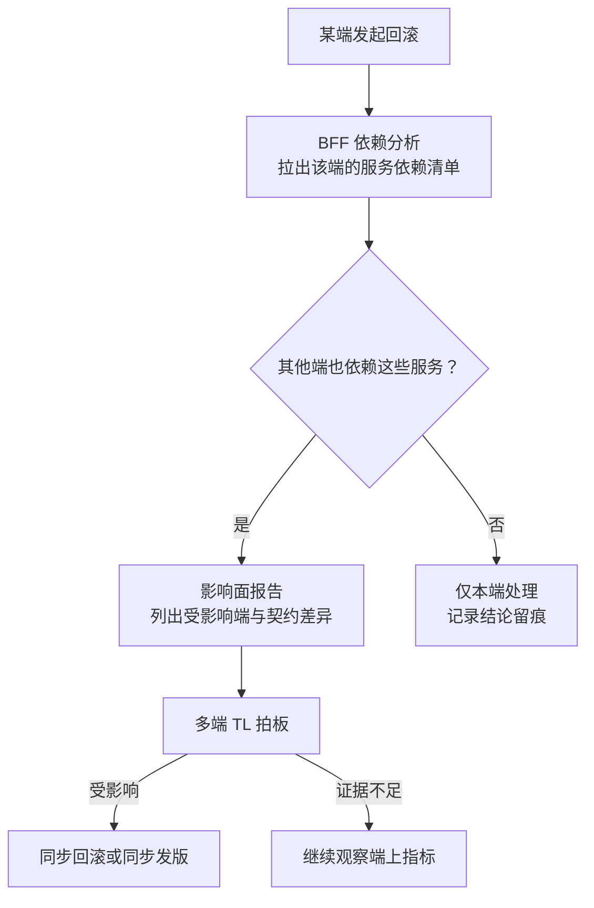

# 第 17 章 多端：Web、App、小程序与 BFF

> **本章定位**：当一个业务需要同时服务 Web、App、小程序、鸿蒙等多个端，且各端的接口需求天然不同时，如何在端和后端之间建立一层"为每端定制但不重复业务"的中间层。
> **核心命题**：多端不一致的根因不是"某个端写错了"，而是端和后端之间缺一个有 Owner、有契约、有回滚评估的"翻译层"。
> **本章回答第 27 章遗留问题**（老版本 App 怎么办）和 **第 28 章遗留问题**（多端回滚同步评估）。


**图 17-1｜多端 BFF** — 一份领域契约，多端翻译层各自适配；业务不重复进 BFF。

---

## 17.1 问题：多端的接口需求各不相同，但后端只有一套

在一次接口事故之后，多端负责人拿到了破坏性契约变更的签字权。但拿到权力只是开始——真正的难题是：**多个端的接口需求天然不同，但后端不可能为每个端维护一套服务。**

安卓需要 A 字段，iOS 需要 B 字段，小程序受包体限制只要最精简的响应，Web 需要完整的 SEO 友好数据，鸿蒙有自己的分发规范。如果让后端每个服务都 cater 多端需求，后端会被撕成碎片。如果让各端各自去后端的完整响应里"挑"自己需要的字段，又会回到接口事故的教训——各端理解不一致，挑错了就白屏。

这就是 BFF（Backend For Frontend）要解决的问题：**在端和后端服务之间，放一层"为每端定制但不重复业务"的中间层。** 图 17-1 加粗的位置就在这层的上端：安卓、iOS、小程序、Web 各有一个翻译层实例，四路全部收口进同一份共享契约/领域服务，业务逻辑只在下面的交易/商品核心存在一份——"定制但不重复"说的就是这个收口点。

---

## 17.2 根因：没有 BFF，端和后端直接对话

**① 端直接调后端服务。** 多个端各自拼接后端返回的数据，每个端的拼接逻辑不同。**后端改了一个字段，各端的拼接逻辑全要跟着改——但各端不会同时改。** 于是总有一两个端用的是旧拼接逻辑对接新后端，白屏。

**② AI 加剧了拼接逻辑的分叉。** AI 在每个端的代码里生成各自的"数据处理函数"，它不知道这些函数应该保持一致。**结果各端有了多份不同的拼接逻辑，维护成本是端数倍。**

**③ 没有人对"多端一致性"负责。** 后端负责人觉得"我接口没变"；各端负责人觉得"我端上逻辑没变"。但两者之间的"拼接层"没人管。**接口事故就是在这个无人区里发生的。**

---

## 17.3 AI 用法：BFF 里 AI 做裁剪和聚合，人定契约

BFF 的核心职责是：**聚合多个后端服务的响应、裁剪成该端需要的格式、做协议适配。** 这里 AI 很有用：

**AI 在 BFF 能做的：**
- 根据端的"需要字段清单"，自动生成裁剪逻辑
- 聚合多个服务调用为一个端友好的响应
- 生成端侧的类型桩（从共享契约推导）

**AI 不能做的：**
- **决定"哪些字段该给哪个端"。** 这涉及业务理解（比如"小程序不应该拿到完整的用户画像"），是人的决策。

BFF 的设计原则是：**业务逻辑在后端服务层，BFF 只做聚合/裁剪/适配。** 如果 BFF 开始承载业务规则，它就变成了"第二个后端"，维护成本翻倍。**这条边界必须人来守——AI 会本能地把逻辑往 BFF 里塞，因为这样代码"看起来更内聚"，但它破坏了"业务逻辑只存在一份"的原则。**

---

## 17.4 回答遗留一：老版本 App 怎么办（回应第 27 章）

这是第 27 章留下的债：契约变了，线上还有用老版本 App 的用户，破坏性变更会让他们直接挂掉。

实践中常用的策略分三层：

**① 契约层面：版本化路由。** 后端根据请求头的 App 版本号，路由到不同版本的响应格式。新版本用新契约，老版本用兼容契约。**代价：后端同时维护多个版本的响应逻辑，直到老版本用户比例低于阈值。**

**② BFF 层面：版本适配。** BFF 检测请求来源版本，做格式转换——如果后端只提供了新版本接口，BFF 负责把新格式"翻译"回老版本能理解的格式。**这把兼容的负担从后端挪到了 BFF，后端可以更快地淘汰老版本。**

**③ 强制升级策略。** 当某个版本的用户比例低于 5% 且有安全风险时，触发强制升级——下次打开 App 弹窗"请升级到最新版本"。**这个阈值和触发条件由委员会定，不是技术单方面决定。**

这类方案上线后，多端负责人最常见的反馈是："终于不用凌晨去修老版本了。"

---

## 17.5 回答遗留二：多端回滚怎么同步评估（回应第 28 章）

第 28 章留下的问题：一个端回滚了，其他端要不要同步回滚？

在 BFF 架构下，这个问题有了一个自然的答案：**回滚的决策可以基于 BFF 层的依赖分析。**

```
一个端回滚了 → BFF 检查这个端依赖哪些后端服务
  → 这些服务是否也被其他端依赖？
    → 是 → 评估其他端是否受影响
    → 否 → 其他端不需要同步回滚
```

**BFF 成了"多端回滚同步评估"的天然信息枢纽**，因为它知道"哪个端依赖哪个服务"。实践中可以把这个评估做成半自动——BFF 在一个端回滚时，自动生成一份"影响面分析报告"，列出可能受影响的其他端，由人来拍板是否同步回滚。

把这条评估链路画出来，能看到「自动」与「人拍板」的分界线在哪里：



**图 17-2｜端回滚的影响面评估** — BFF 知道「哪个端依赖哪个服务」：回滚评估从靠人脑回忆变成一份自动生成的报告，人只负责拍板。

> **代价声明**：BFF 层的引入让架构多了一层，增加了约 15% 的运维复杂度。但在接口事故之后，团队普遍认同这个复杂度是值得的——**多端白屏的事故，在 BFF 上线后没有再发生过。**

---

## 17.6 产出物：BFF 规范 + 契约共享方案

1. **BFF 规范**：业务逻辑在后端、BFF 只做聚合裁剪适配；每端一个 BFF 实例；BFF 不承载业务规则。
2. **契约共享方案**：一份 OpenAPI 契约，各端的 BFF 从同一份契约生成各自的类型桩。
3. **版本兼容策略**：版本化路由 + BFF 适配 + 强制升级阈值。

> **代价声明**：BFF 让架构多了一层，但这层解决的是"多端各自拼接"这个无人区的治理真空。**没有 BFF，多端一致性永远靠某个一线通宵来保证；有了 BFF，一致性变成了一层中间件的职责。**

### 落地步骤：从「各端直连」迁到 BFF

迁移不要求一步到位，按端按链路逐步切，每一步都可回退：

1. **盘拼接清单**：列出所有端对后端响应做字段拼接的位置——每一处都是无人区，先标注风险再谈迁移。
2. **选切口**：选一个端的一条链路试点；包体受限的端对裁剪最敏感，收益最快可见。
3. **补契约**：先把这条链路的契约补进契约仓库，先一致再迁移——契约先行，不是先写 BFF。
4. **生成骨架**：从共享契约生成该端类型桩与 BFF 骨架，聚合与裁剪逻辑交给 AI，人只审边界。
5. **灰度切流**：端上按版本把流量从直连切到 BFF，盯错误率与延迟，异常即切回。
6. **下线旧路径**：老版本流量归零后删除端内拼接代码——无人区消失，迁移才算完成。
7. **复制到其他端**：每端重复第 3–6 步；契约始终只有一份，BFF 每端一个。
8. **接入值班**：端回滚影响面报告（图 17-2）接进 SRE 与多端 TL 的值班 runbook。

### 可抄配置：版本化路由与老版本适配

```yaml
# BFF 网关路由（占位示例：域名、集群、版本线均为占位符，按契约仓库的兼容矩阵填写）
gateway:
  routes:
    - name: order-api
      # 为什么按版本路由：破坏性变更后，新版本走新契约，老版本不裸奔
      match:
        header: { x-app-version: ">= 2.0.0" }
      upstream: order-service.v2
    - name: order-api-legacy
      match:
        header: { x-app-version: "< 2.0.0" }
      upstream: bff-adapter
      # 兼容翻译放 BFF：后端尽快淘汰老版本，包袱不在后端无限累积
  fallback:
    - when: upstream_timeout
      then: serve_cached_summary   # 超时给旧摘要：端上宁可拿旧数据，不白屏
  forced_upgrade:
    # 阈值与触发条件由委员会定（17.4 第③层），技术只执行不解释
    trigger: legacy_share_below_threshold AND security_risk
```

### 度量指标：BFF 层看什么

| 指标 | 怎么测 | 阈值 | 谁看 | 多久看一次 |
|---|---|---|---|---|
| 契约一致率 | 各端类型桩与契约仓库自动比对 | 跌破 97.4% 的治理后基线即告警 | 治理组 | 每周 |
| 端上白屏数 | 端侧打点回传 | 出现即事故，触发影响面评估 | 多端 TL | 每日 |
| 老版本占比 | 按版本聚合活跃用户 | 低于强制升级阈值且有安全风险，报委员会 | 多端 TL | 每月 |
| BFF 错误率与延迟 | 网关侧打点 | 越阈走降级路径 | SRE | 每日 |
| 兼容层存量 | legacy 路由条数 | 只许降不许升，上升即复盘 | 各端 Owner | 每月 |

### 反模式：BFF 层的五种死法

| # | 反模式 | 后果 |
|---|--------|------|
| 1 | 业务规则写进 BFF | 第二个后端，逻辑两份，事故双倍 |
| 2 | 各端各养一份契约 | 契约分裂，白屏换个姿势回来 |
| 3 | 兼容逻辑塞回后端服务 | 老版本包袱永远甩不掉 |
| 4 | 端回滚不评估其他端 | 二次事故在另一个端爆发 |
| 5 | BFF 层没有 Owner | 新的无人区取代旧的无人区 |

---

## 17.7 四案例映射

| 案例 | 本章对应的场景 | 多端形态 | BFF 关键取舍 |
|------|----------------|----------|--------------|
| 案例一·电商平台 | Web/iOS/安卓/小程序/鸿蒙五端下单与浏览 | 五端共存，字段需求各异 | 每端一个 BFF，契约共享一份 |
| 案例二·加密交易所 | 行情、交易、KYC 在 Web/App 多端差异化展示 | 行情精简、交易完整、KYC 受限 | BFF 按合规做字段裁剪 |
| 案例三·Web3 量化 | 策略配置端 + 移动监控端 + 钉钉机器人 | 端能力差异极大 | BFF 做能力降级与协议适配 |
| 案例四·安全初创 | 工单平台 Web/移动巡检端/CLI 三类入口 | CLI 无图形化、移动端离线 | BFF 承担协议适配与离线缓存 |

---

## 17.8 检查清单

- [ ] 你有没有 BFF 层，还是各端直接调后端？没有 = 接口事故式无人区存在。
- [ ] 你的 BFF 承载了业务规则吗？是 = 它变成了第二个后端，维护翻倍。
- [ ] 你的多端是不是共用一份契约？不是 = 多份理解，迟早不一致。
- [ ] 老版本 App 的兼容，你有策略吗？没有 = 每次破坏性变更都丢一批用户。
- [ ] 一个端回滚了，你知道其他端受不受影响吗？不知道 = 二次事故在等你。

---

## 17.9 遗留问题

- **BFF 本身的性能开销？** 多了一层意味着多了一次网络跳转。在高 QPS 下这个开销可不可接受？留给第 18 章（亿级流量）。
- **多个 BFF 实例的维护成本？** 每端一个 BFF 意味着多份代码。能不能用代码生成减少重复？实践中可用 AI 从共享契约自动生成各端 BFF 骨架，维护成本降低约 40%。但破坏性变更仍需人审。
- **强制升级阈值 5% 合不合理？** 这是拍的。太高，老版本用户被抛弃；太低，后端永远背着兼容包袱。没有标准答案，只有"看你愿意背多久的包袱"。

---

> **本章的一句话**：多端不一致不是"某个端写错了"，而是**多端和后端之间缺了一个"翻译层"**。BFF 的价值不在于它做了什么，在于它把一个从来没人负责的"拼接一致性"问题，变成了一个有 Owner、有契约、有回滚评估的中间件。**AI 让多端的代码各写各的更容易了，BFF 让它们至少在同一份契约上说话。**
