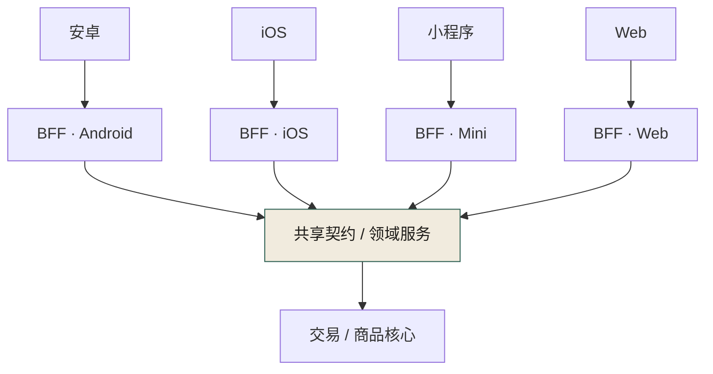
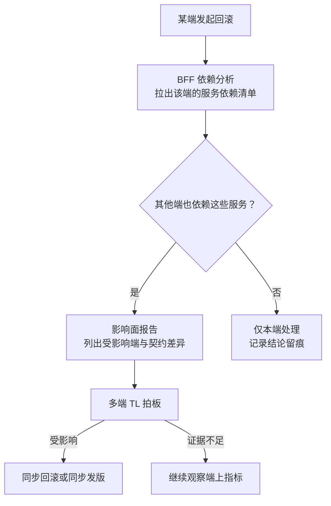
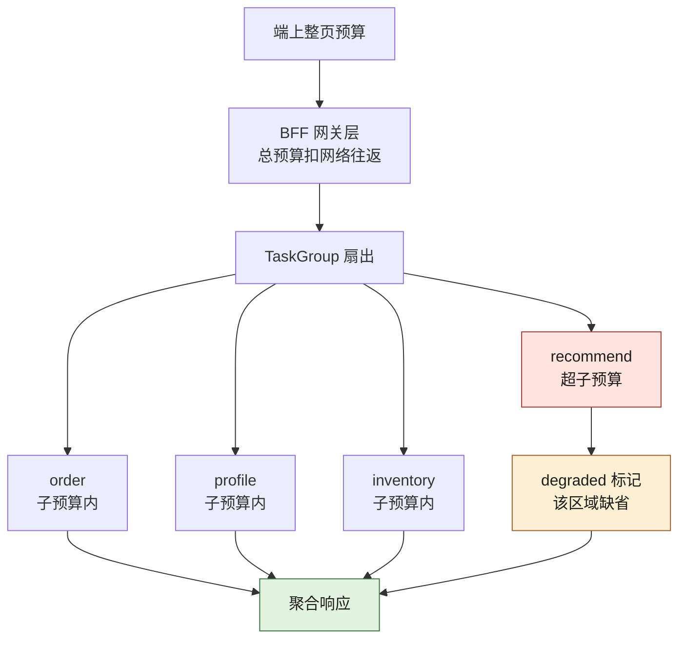
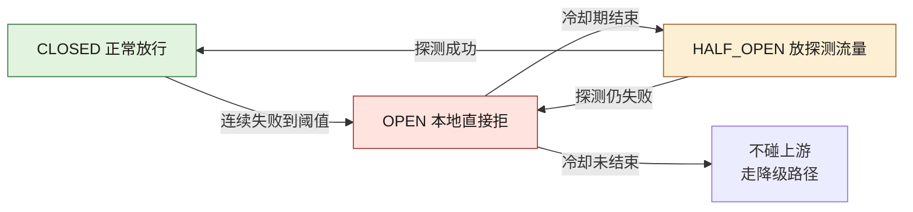

# 第 17 章 多端：Web、App、小程序与 BFF

> **本章定位**：当一个业务需要同时服务 Web、App、小程序、鸿蒙等多个端，且各端的接口需求天然不同时，如何在端和后端之间建立一层"为每端定制但不重复业务"的中间层。
> **核心命题**：多端不一致的根因不是"某个端写错了"，而是端和后端之间缺一个有 Owner、有契约、有回滚评估的"翻译层"。
> **本章回答第 27 章遗留问题**（老版本 App 怎么办）和 **第 28 章遗留问题**（多端回滚同步评估）。



**图 17-1｜多端 BFF** — 一份领域契约，多端翻译层各自适配；业务不重复进 BFF。

---

## 17.1 问题：多端的接口需求各不相同，但后端只有一套

在一次接口事故之后，多端负责人拿到了破坏性契约变更的签字权。但拿到权力只是开始——真正的难题是：**多个端的接口需求天然不同，但后端不可能为每个端维护一套服务。**

安卓需要 A 字段，iOS 需要 B 字段，小程序受包体限制只要最精简的响应，Web 需要完整的 SEO 友好数据，鸿蒙有自己的分发规范。如果让后端每个服务都 cater 多端需求，后端会被撕成碎片。如果让各端各自去后端的完整响应里"挑"自己需要的字段，又会回到接口事故的教训——各端理解不一致，挑错了就白屏。

这就是 BFF（Backend For Frontend）要解决的问题：**在端和后端服务之间，放一层"为每端定制但不重复业务"的中间层。** 图 17-1 加粗的位置就在这层的上端：安卓、iOS、小程序、Web 各有一个翻译层实例，四路全部收口进同一份共享契约/领域服务，业务逻辑只在下面的交易/商品核心存在一份——"定制但不重复"说的就是这个收口点。

---

## 17.2 根因：没有 BFF，端和后端直接对话

**① 端直接调后端服务。** 多个端各自拼接后端返回的数据，每个端的拼接逻辑不同。**后端改了一个字段，各端的拼接逻辑全要跟着改——但各端不会同时改。** 于是总有一两个端用的是旧拼接逻辑对接新后端，白屏。

**② AI 加剧了拼接逻辑的分叉。** AI 在每个端的代码里生成各自的"数据处理函数"，它不知道这些函数应该保持一致。**结果各端有了多份不同的拼接逻辑，维护成本是端数倍。**

**③ 没有人对"多端一致性"负责。** 后端负责人觉得"我接口没变"；各端负责人觉得"我端上逻辑没变"。但两者之间的"拼接层"没人管。**接口事故就是在这个无人区里发生的。**

---

## 17.3 AI 用法：BFF 里 AI 做裁剪和聚合，人定契约

BFF 的核心职责是：**聚合多个后端服务的响应、裁剪成该端需要的格式、做协议适配。** 这里 AI 很有用：

**AI 在 BFF 能做的：**
- 根据端的"需要字段清单"，自动生成裁剪逻辑
- 聚合多个服务调用为一个端友好的响应
- 生成端侧的类型桩（从共享契约推导）

**AI 不能做的：**
- **决定"哪些字段该给哪个端"。** 这涉及业务理解（比如"小程序不应该拿到完整的用户画像"），是人的决策。

BFF 的设计原则是：**业务逻辑在后端服务层，BFF 只做聚合/裁剪/适配。** 如果 BFF 开始承载业务规则，它就变成了"第二个后端"，维护成本翻倍。**这条边界必须人来守——AI 会本能地把逻辑往 BFF 里塞，因为这样代码"看起来更内聚"，但它破坏了"业务逻辑只存在一份"的原则。**

---

## 17.4 回答遗留一：老版本 App 怎么办（回应第 27 章）

这是第 27 章留下的债：契约变了，线上还有用老版本 App 的用户，破坏性变更会让他们直接挂掉。

实践中常用的策略分三层：

**① 契约层面：版本化路由。** 后端根据请求头的 App 版本号，路由到不同版本的响应格式。新版本用新契约，老版本用兼容契约。**代价：后端同时维护多个版本的响应逻辑，直到老版本用户比例低于阈值。**

**② BFF 层面：版本适配。** BFF 检测请求来源版本，做格式转换——如果后端只提供了新版本接口，BFF 负责把新格式"翻译"回老版本能理解的格式。**这把兼容的负担从后端挪到了 BFF，后端可以更快地淘汰老版本。**

**③ 强制升级策略。** 当某个版本的用户比例低于 5% 且有安全风险时，触发强制升级——下次打开 App 弹窗"请升级到最新版本"。**这个阈值和触发条件由委员会定，不是技术单方面决定。**

这类方案上线后，多端负责人最常见的反馈是："终于不用凌晨去修老版本了。"

---

## 17.5 回答遗留二：多端回滚怎么同步评估（回应第 28 章）

第 28 章留下的问题：一个端回滚了，其他端要不要同步回滚？

在 BFF 架构下，这个问题有了一个自然的答案：**回滚的决策可以基于 BFF 层的依赖分析。**

```
一个端回滚了 → BFF 检查这个端依赖哪些后端服务
  → 这些服务是否也被其他端依赖？
    → 是 → 评估其他端是否受影响
    → 否 → 其他端不需要同步回滚
```

**BFF 成了"多端回滚同步评估"的天然信息枢纽**，因为它知道"哪个端依赖哪个服务"。实践中可以把这个评估做成半自动——BFF 在一个端回滚时，自动生成一份"影响面分析报告"，列出可能受影响的其他端，由人来拍板是否同步回滚。

把这条评估链路画出来，能看到「自动」与「人拍板」的分界线在哪里：



**图 17-2｜端回滚的影响面评估** — BFF 知道「哪个端依赖哪个服务」：回滚评估从靠人脑回忆变成一份自动生成的报告，人只负责拍板。

> **代价声明**：BFF 层的引入让架构多了一层，增加了约 15% 的运维复杂度。但在接口事故之后，团队普遍认同这个复杂度是值得的——**多端白屏的事故，在 BFF 上线后没有再发生过。**

---

## 17.6 产出物：BFF 规范 + 契约共享方案

1. **BFF 规范**：业务逻辑在后端、BFF 只做聚合裁剪适配；每端一个 BFF 实例；BFF 不承载业务规则。
2. **契约共享方案**：一份 OpenAPI 契约，各端的 BFF 从同一份契约生成各自的类型桩。
3. **版本兼容策略**：版本化路由 + BFF 适配 + 强制升级阈值。

> **代价声明**：BFF 让架构多了一层，但这层解决的是"多端各自拼接"这个无人区的治理真空。**没有 BFF，多端一致性永远靠某个一线通宵来保证；有了 BFF，一致性变成了一层中间件的职责。**

### 落地步骤：从「各端直连」迁到 BFF

迁移不要求一步到位，按端按链路逐步切，每一步都可回退：

1. **盘拼接清单**：列出所有端对后端响应做字段拼接的位置——每一处都是无人区，先标注风险再谈迁移。
2. **选切口**：选一个端的一条链路试点；包体受限的端对裁剪最敏感，收益最快可见。
3. **补契约**：先把这条链路的契约补进契约仓库，先一致再迁移——契约先行，不是先写 BFF。
4. **生成骨架**：从共享契约生成该端类型桩与 BFF 骨架，聚合与裁剪逻辑交给 AI，人只审边界。
5. **灰度切流**：端上按版本把流量从直连切到 BFF，盯错误率与延迟，异常即切回。
6. **下线旧路径**：老版本流量归零后删除端内拼接代码——无人区消失，迁移才算完成。
7. **复制到其他端**：每端重复第 3–6 步；契约始终只有一份，BFF 每端一个。
8. **接入值班**：端回滚影响面报告（图 17-2）接进 SRE 与多端 TL 的值班 runbook。

### 可抄配置：版本化路由与老版本适配

```yaml
# BFF 网关路由（占位示例：域名、集群、版本线均为占位符，按契约仓库的兼容矩阵填写）
gateway:
  routes:
    - name: order-api
      # 为什么按版本路由：破坏性变更后，新版本走新契约，老版本不裸奔
      match:
        header: { x-app-version: ">= 2.0.0" }
      upstream: order-service.v2
    - name: order-api-legacy
      match:
        header: { x-app-version: "< 2.0.0" }
      upstream: bff-adapter
      # 兼容翻译放 BFF：后端尽快淘汰老版本，包袱不在后端无限累积
  fallback:
    - when: upstream_timeout
      then: serve_cached_summary   # 超时给旧摘要：端上宁可拿旧数据，不白屏
  forced_upgrade:
    # 阈值与触发条件由委员会定（17.4 第③层），技术只执行不解释
    trigger: legacy_share_below_threshold AND security_risk
```

### 度量指标：BFF 层看什么

| 指标 | 怎么测 | 阈值 | 谁看 | 多久看一次 |
|---|---|---|---|---|
| 契约一致率 | 各端类型桩与契约仓库自动比对 | 跌破 97.4% 的治理后基线即告警 | 治理组 | 每周 |
| 端上白屏数 | 端侧打点回传 | 出现即事故，触发影响面评估 | 多端 TL | 每日 |
| 老版本占比 | 按版本聚合活跃用户 | 低于强制升级阈值且有安全风险，报委员会 | 多端 TL | 每月 |
| BFF 错误率与延迟 | 网关侧打点 | 越阈走降级路径 | SRE | 每日 |
| 兼容层存量 | legacy 路由条数 | 只许降不许升，上升即复盘 | 各端 Owner | 每月 |

### 反模式：BFF 层的五种死法

| # | 反模式 | 后果 |
|---|--------|------|
| 1 | 业务规则写进 BFF | 第二个后端，逻辑两份，事故双倍 |
| 2 | 各端各养一份契约 | 契约分裂，白屏换个姿势回来 |
| 3 | 兼容逻辑塞回后端服务 | 老版本包袱永远甩不掉 |
| 4 | 端回滚不评估其他端 | 二次事故在另一个端爆发 |
| 5 | BFF 层没有 Owner | 新的无人区取代旧的无人区 |

### 编排：TaskGroup 的超时预算与局部降级

上面的落地步骤、路由配置与度量指标管的是"流量怎么走"；还有一件更细的事必须人在 AI 动手之前定死：**一次请求扇出多个上游时，谁给谁让路**。这一格是 BFF 最容易长回"第二个后端"的地方，也是最容易整页白屏的地方。

组织需要它的理由：AI 写聚合逻辑时，默认写成一个个 `await` 串起来——代码读起来最自然，但延迟是所有上游之和，而且任何一个上游卡住，整页就跟着卡。多端场景里这更糟：小程序端的网络本来就差，一次上游抖动就能让整个页面转圈到超时。**哪些字段允许缺、缺了要不要标出来，是产品决策，不是 async 语法能替你决定的。**

下面这段是本机实跑（Python 3.14.4，只用标准库 `asyncio`，四个上游用 `sleep` 模拟），刻意让第四路超出自己的子预算：

```python
import asyncio, time

async def upstream(name, cost):
    await asyncio.sleep(cost)                # 真实场景里这里是一次 httpx 调用
    return f"{name}:payload"

async def budget_call(name, cost, budget):
    """每个上游一份子预算：到点只降级这一路，不牵连同请求的其他路。"""
    t0 = time.perf_counter()
    try:
        async with asyncio.timeout(budget):
            v = await upstream(name, cost)
        return {"name": name, "state": "OK", "value": v, "ms": round((time.perf_counter() - t0) * 1000, 1)}
    except TimeoutError:
        return {"name": name, "state": "TIMEOUT", "value": None, "ms": round((time.perf_counter() - t0) * 1000, 1)}

async def main():
    t0 = time.perf_counter()
    async with asyncio.TaskGroup() as tg:                      # 扇出：并发而非串行
        tasks = [tg.create_task(budget_call(n, c, 0.20))       # 四路共用一份子预算（示意值）
                 for n, c in [("order", 0.05), ("profile", 0.08), ("inventory", 0.03), ("recommend", 1.00)]]
    results = [t.result() for t in tasks]
    for r in results:
        print(f"{r['name']:9} {r['state']:8} ms={r['ms']:6} value={r['value']}")
    degraded = [r["name"] for r in results if r["state"] != "OK"]
    print("degraded:", degraded)
    print("partial_payload:", [r["name"] for r in results if r["state"] == "OK"])
    print("响应标记:", "X-BFF-Degraded" if degraded else "（无）")
    print(f"整请求耗时 ms={round((time.perf_counter() - t0) * 1000, 1)}")

asyncio.run(main())
```

真实 stdout（本机实跑，耗时随负载抖动，但形状不变）：

```text
order     OK       ms=  50.5 value=order:payload
profile   OK       ms=  80.6 value=profile:payload
inventory OK       ms=  30.2 value=inventory:payload
recommend TIMEOUT  ms= 200.9 value=None
degraded: ['recommend']
partial_payload: ['order', 'profile', 'inventory']
响应标记: X-BFF-Degraded
整请求耗时 ms=201.0
```

四个读数各对应一条纪律：

- **总耗时等于最慢的那一路的子预算，而不是它的真实耗时**。超时的上游本来就打算磨到一千毫秒，请求只等了二百左右就带降级标记返回了——**超时预算的作用是把最坏值变成已知值**，端上的转圈时长才能被契约承诺住。
- **降级是逐路的，不是整页的**。三路正常返回、一路标记缺失，端上按"这块区域显示占位或上次缓存"处理。哪些区域允许缺，必须由多端 TL 与产品逐字段签字，写进契约。
- **超时之后要真的取消**。`asyncio.timeout` 退出上下文时会撤销仍在跑的任务；换成手写 `gather` 很容易漏掉这一刀，超时只是不再等待，上游连接仍被占着——**典型的降级生效而资源未降级**，在第 18 章的流量放大下就是雪崩的引信。
- **`TaskGroup` 的语义要认得**：任一子任务抛出未被捕获的异常，整个组会取消其余任务后再抛异常。所以每一路都得自己把异常吞成结构化状态，否则一个上游报错会连带把另外三路一起撤掉。

预算怎么分，图 17-3 是这条分配链：



**图 17-3｜BFF 的超时预算分配链** — 整页预算逐层往下切，每一路只花自己那一份；切下来的每一份都要能被契约承诺，切不出来的那一路就必须明确允许缺。

一个可直接抄的算术口径（数值全为示意，按你的端网络与上游 P99 重填）：**总预算 ≥ 各并行路子预算的最大值 + 聚合与序列化开销**；**串行链路的总预算 = 各段预算之和 + 重试次数乘以单次退避**；端上整页预算 ≥ BFF 总预算 + 一次网络往返 + 渲染余量。**这三行是"预算能不能兑现"的判据，不是调参建议**——任何一条不成立，超时就会在链路上层层错位，最后表现为"端上比服务端更早知道失败"。重试预算另有一条硬纪律：**重试次数也要进预算，且只允许在幂等的读路径上重试**，写路径的重试归第 20 章的幂等键管。

### 字段裁剪与缓存键设计

17.3 说"AI 能做裁剪、人决定哪些字段给哪个端"。把这句话落到实现，只有两件东西要定：裁剪清单存哪儿、缓存键怎么拼。

**裁剪清单必须存进契约，不存进代码。** 一旦写进 `if client == "miniapp": del payload["user_profile"]`，它就变成了只有那一个 BFF 知道的业务规则——正是 17.6 反模式表第 1 条与第 2 条的合成体。形状是给契约的每个响应字段加一栏可见性标注（示意）：

```yaml
# contracts/trade/order-detail.v2.yaml 片段：正本在契约仓，BFF 只读不判
components:
  schemas:
    OrderDetail:
      properties:
        order_no:      { type: string, x-visible-on: [web, app, mini] }
        user_profile:  { type: string, x-visible-on: [web, app] }   # 小程序不给：合规判断，不是性能判断
        eta_seconds:   { type: integer, x-optional-on: [mini] }     # 缺了要能渲染：降级区域清单
```

`x-visible-on` 与 `x-optional-on` 是 OpenAPI 允许的厂商扩展字段（B 档：扩展字段的合法性出自规范本身，本书没有跑过具体代码生成器对它们的处理，生成器是否会原样带进类型桩要以你所用版本实测为准）。**这两栏的牙齿在于：裁剪清单进了契约，就能被 diff、被路由到签字人**；留在代码里，就只剩一次线上白屏才能发现。

缓存键是另一处无声事故点。BFF 的响应是按端裁剪过的，所以缓存必须按裁剪结果分键，拼法只有这一种是安全的（按稳定性从高到低排）：

| 键位 | 为什么必须在 | 漏掉会怎样 |
|---|---|---|
| 契约版本 | 不同版本的响应结构不同 | 新版本命中旧结构，端上按旧类型桩解析 |
| 端标识 | 每端裁剪结果不同 | 小程序拿到 Web 的完整响应，包体与合规同时出问题 |
| 权限档位 | 字段可见性按权限收敛 | **越权字段命中别人的缓存**——这是合规事故，不是性能问题 |
| 语言与地区 | 文案与时区不同 | 缓存穿透到用户个人数据那一层 |
| 用户维度 | **默认不放** | 键基数等于活跃用户数，命中率坍塌，缓存形同直连 |

用户维度这一行值得单独说：把 `user_id` 拼进键里最容易"看起来正确"，代价是缓存基本不命中，还顺手把一份高基数键空间交给了缓存层。确实需要按用户区分时，用权限档位加会话摘要这类**可枚举的桶**，而不是自由度的 ID。

HTTP 侧的语义（B 档按规范）：`Vary` 声明"这些请求头会改变响应，缓存必须按它们分份"，它和上面的键位表是同一件事的两种写法——**键位表是内部实现，`Vary` 是对上游与中间缓存的自述，两者不一致时中间层就会发错响应**。新鲜度用 `ETag` 配合条件请求、或用 `stale-while-revalidate` 允许"先给旧的、后台换新的"——降级路径里那个"超时给旧摘要"的兜底，语义上用的就是这一条（对应 17.6 配置块里的 `serve_cached_summary`）。

### 断路器三态：可抄实现与真实迁移

17.6 的度量表把"BFF 错误率与延迟"的阈值指向了降级路径，但降级路径不能等到超时才启动——**上游已经病了，还按原速打过去，等于把它按死**。断路器就是把"要不要继续打这个上游"变成一层有状态的判断。它替代不了 17.5 的影响面评估：断路器只管单路上游的通断，不懂"哪个端依赖哪个服务"。

可抄实现（纯标准库，逻辑刻意写得短到能一眼看完）：

```python
import asyncio, time

class Breaker:
    def __init__(self, fail_threshold, cooloff, probe_success=1):
        self.state, self.fails, self.oks = "CLOSED", 0, 0
        self.ft, self.co, self.ht = fail_threshold, cooloff, probe_success
        self.opened_at, self.trace = None, []

    def _to(self, s):
        self.trace.append(f"{self.state} -> {s}"); self.state = s

    async def call(self, upstream):
        if self.state == "OPEN":
            if time.monotonic() - self.opened_at >= self.co:
                self._to("HALF_OPEN")                          # 冷却到期，只放探测流量
            else:
                return "REJECTED-BY-BREAKER"                   # OPEN 时连上游都不碰：给它喘息
        try:
            r = await upstream(); self._ok(); return r
        except Exception:
            self._fail(); return "UPSTREAM-FAIL"

    def _ok(self):
        self.fails = 0
        if self.state == "HALF_OPEN":
            self.oks += 1
            if self.oks >= self.ht: self.oks = 0; self._to("CLOSED")

    def _fail(self):
        self.oks = 0; self.fails += 1
        if self.state == "HALF_OPEN":
            self._to("OPEN"); self.opened_at = time.monotonic()      # 探测又失败：立刻缩回
        elif self.state == "CLOSED" and self.fails >= self.ft:
            self._to("OPEN"); self.opened_at = time.monotonic()

async def main():
    b = Breaker(fail_threshold=3, cooloff=0.2)                 # 阈值与冷却都取示意值
    async def good(): return "OK"
    async def bad(): raise RuntimeError("boom")
    for _ in range(3): await b.call(bad)
    print("三次连续失败后 state =", b.state, "| 再调用好上游 ->", await b.call(good))
    await asyncio.sleep(0.25)
    print("冷却到期首次调用 ->", await b.call(good), "| 迁移轨迹：")
    for t in b.trace: print("  ", t)

asyncio.run(main())
```

真实 stdout（本机实跑，Python 3.14.4）：

```text
三次连续失败后 state = OPEN | 再调用好上游 -> REJECTED-BY-BREAKER
冷却到期首次调用 -> OK | 迁移轨迹：
   CLOSED -> OPEN
   OPEN -> HALF_OPEN
   HALF_OPEN -> CLOSED
```

这三行迁移轨迹是断路器全部的要点：**OPEN 状态会拒绝一个本来健康的上游**（第一行的好上游被本地挡掉了）——这不是缺陷，是设计：断路器的职责是保护上游与掐断等待，代价就是它会误伤，所以冷却期必须短到不误伤体验、长到能给上游喘息。**这个"短"与"长"之间没有公式，是一次需要留痕的取舍**，归各端 Owner 与 SRE 共同签字。图 17-4 把三态与那两次"看起来不讲理"的迁移画全：



**图 17-4｜断路器三态与它的两次误伤** — OPEN 会拒健康上游、HALF_OPEN 只放探测流量；三态迁移动不动就改变端上可见字段，所以阈值与冷却期都要有 Owner、有留痕。

三处会静默失效的地方：**半开状态下要限并发**，只放探测流量；若半开瞬间涌入全量请求，等于自己给自己做一次无灰度的全量发布。**多实例各断各的**，本例的开关状态在单进程内存里，BFF 多副本时每个副本有自己的判断——这通常是对的（本地判断避免中心化故障），但要清楚"断路器全开"并不等于"上游全断"，看指标得看聚合。**断路器与超时必须分开计**：超时是"这次没等到"，断路是"这段时间不再等"，两者混成一个计数器，就会把偶发抖动放大成一段服务不可用。

### 契约共享一份的实现方式（呼应第 9 章）

17.6 产出物第二条只写了结论：一份契约，多端各自生成类型桩。这一节把它落到能核对的形状——完整的契约治理机制在 [第 9 章](./ch14-第9章-契约先行.md)，本节只回答"BFF 这一侧具体怎么做到不各养一份"。

- **正本只有一个，而且不在 BFF 仓库里**。契约进独立契约仓（`contracts/{domain}/{service}/{version}/`），BFF 与后端服务都是它的消费方。BFF 仓里出现手写响应模型，就算 17.6 反模式表第 2 条复活。
- **双源各管一面**：OpenAPI 管 HTTP（端与 BFF 之间），Protobuf 管 RPC（BFF 与核心服务之间）；两道兼容门同时挂，判据与门禁形状见第 9 章。
- **各端类型桩是产物，不是文件**。CI 从契约仓主干生成，产物打版本戳；一致性靠比对维持，第 17 章度量表里那条"契约一致率"就是这条比对的读数。
- **版本化路由的键要来自契约，不是来自请求头里的裸字符串**。17.6 配置块按 `x-app-version` 路由，前提是版本号与契约版本的映射也在契约仓里维护一份兼容矩阵——否则"兼容翻译"的边界就散落在网关配置里，没人签字。
- **端可见性标注与兼容判定同源**。上一节那两栏 `x-visible-on`、`x-optional-on` 与契约字段一起评审、一起 diff、一起走签字链：新增字段只给 Web 不给小程序，在兼容判定上是"新增可选字段"，但在可见性上是**一次需要多端负责人签字的产品决策**——两道判定都得留痕，这也是 17.4 那套老版本适配不至于长成三套并行真相的唯一保障。

**这份共享替代不了什么**：契约能保证"各端说的是同一种话"，保证不了"这句话该不该说给这个端"。字段可见性、降级区域、强制升级阈值都是判断，不是格式；把它们写进契约的意义只有一条——**让判断必须署名，而不是在某个端的数据处理函数里悄悄长出来**。

---

## 17.7 四案例映射

| 案例 | 本章对应的场景 | 多端形态 | BFF 关键取舍 |
|------|----------------|----------|--------------|
| 案例一·电商平台 | Web/iOS/安卓/小程序/鸿蒙五端下单与浏览 | 五端共存，字段需求各异 | 每端一个 BFF，契约共享一份 |
| 案例二·加密交易所 | 行情、交易、KYC 在 Web/App 多端差异化展示 | 行情精简、交易完整、KYC 受限 | BFF 按合规做字段裁剪 |
| 案例三·Web3 量化 | 策略配置端 + 移动监控端 + 钉钉机器人 | 端能力差异极大 | BFF 做能力降级与协议适配 |
| 案例四·安全初创 | 工单平台 Web/移动巡检端/CLI 三类入口 | CLI 无图形化、移动端离线 | BFF 承担协议适配与离线缓存 |

---

## 17.8 检查清单

- [ ] 你有没有 BFF 层，还是各端直接调后端？没有 = 接口事故式无人区存在。
- [ ] 你的 BFF 承载了业务规则吗？是 = 它变成了第二个后端，维护翻倍。
- [ ] 你的多端是不是共用一份契约？不是 = 多份理解，迟早不一致。
- [ ] 老版本 App 的兼容，你有策略吗？没有 = 每次破坏性变更都丢一批用户。
- [ ] 一个端回滚了，你知道其他端受不受影响吗？不知道 = 二次事故在等你。

---

## 17.9 遗留问题

- **BFF 本身的性能开销？** 多了一层意味着多了一次网络跳转。在高 QPS 下这个开销可不可接受？留给第 18 章（亿级流量）。
- **多个 BFF 实例的维护成本？** 每端一个 BFF 意味着多份代码。能不能用代码生成减少重复？实践中可用 AI 从共享契约自动生成各端 BFF 骨架，维护成本降低约 40%。但破坏性变更仍需人审。
- **强制升级阈值 5% 合不合理？** 这是拍的。太高，老版本用户被抛弃；太低，后端永远背着兼容包袱。没有标准答案，只有"看你愿意背多久的包袱"。

---

> **本章的一句话**：多端不一致不是"某个端写错了"，而是**多端和后端之间缺了一个「翻译层」**。BFF 的价值不在于它做了什么，在于它把一个从来没人负责的"拼接一致性"问题，变成了一个有 Owner、有契约、有回滚评估的中间件。**AI 让多端的代码各写各的更容易了，BFF 让它们至少在同一份契约上说话。**
