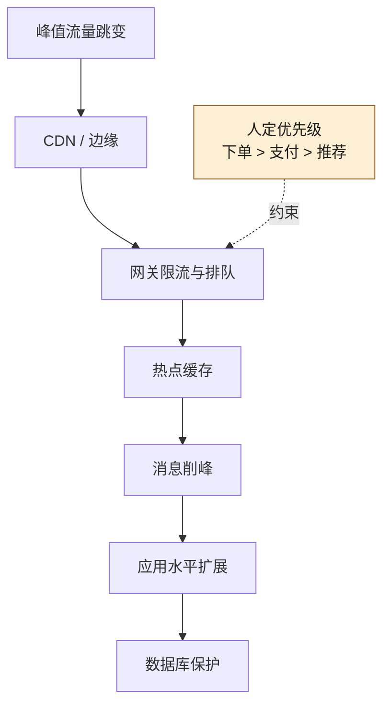
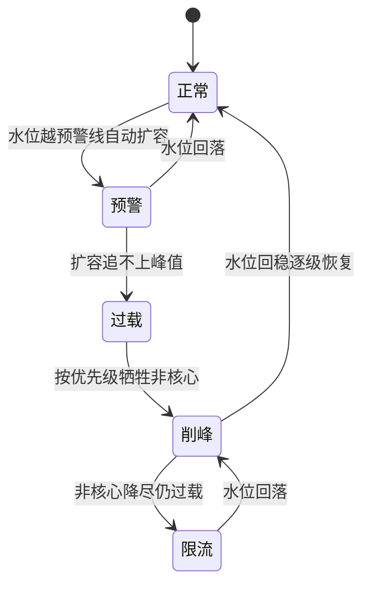
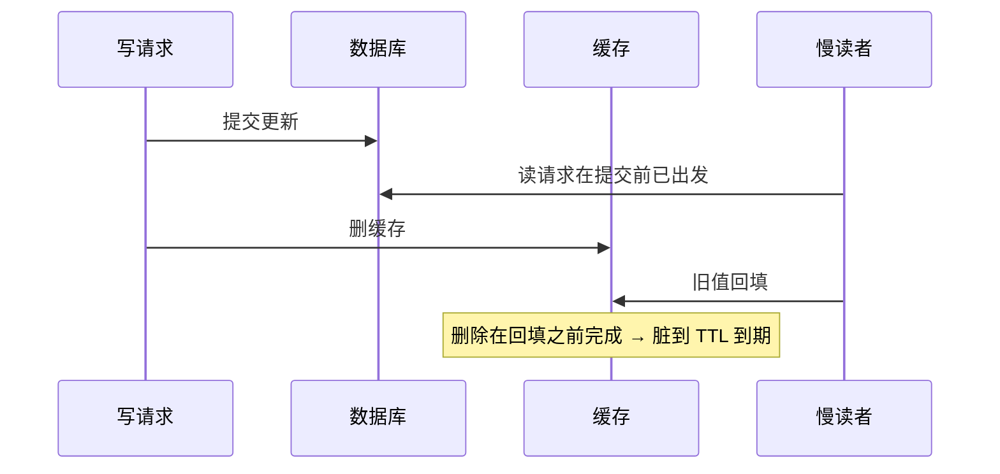
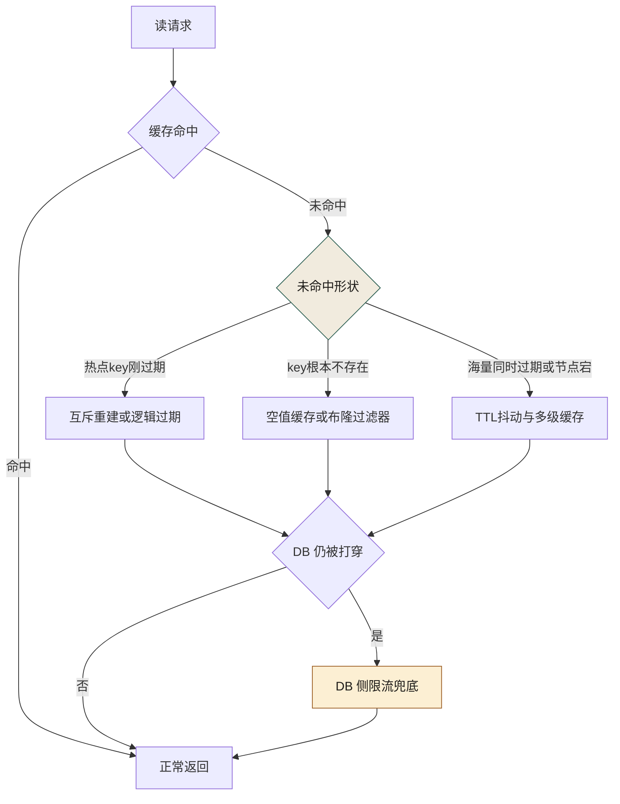
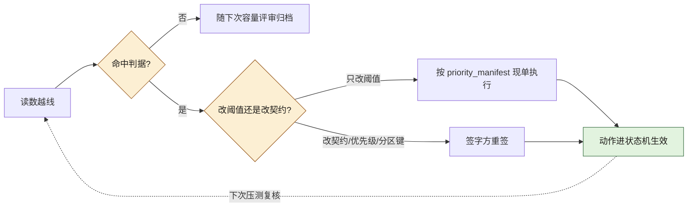

# 第 18 章 亿级流量：CDN、网关、缓存、异步、多活

> **本章定位**：当业务进入"亿级 DAU / 突发峰值远超日常均值"的量级时，容量规划与削峰架构如何分层落地，以及 AI 在容量计算中能辅助到什么程度。
> **核心命题**：突发流量是非线性跳变，AI 基于历史均值的预测会平滑掉尖峰；削峰是分层的、优先级是人定的、多活的成本-风险账是人来拍的。
> **本章的 AI 失灵点**：AI 生成的容量规划总是偏乐观——它不理解"突发流量"的非线性特征。
> **本章的人介入点**：人定削峰策略和多活方案，AI 做容量计算辅助。



**图 18-1｜分层削峰** — 均值预测会抹平尖峰；哪层先挡、挡谁，是人定的业务优先级。

---

## 18.1 问题：峰值 QPS 打过来，你的架构有几秒能反应？

大促前的容量评审会上，SRE 负责人把一张图拍在桌上——去年大促的峰值 QPS 曲线。**曲线在最头部有一个近乎垂直的跳变：30 秒内从十余万 QPS 蹿到了数十万量级。**

"你们的架构，在这个跳变里有几秒能反应？" SRE 负责人问全场。

没人答得上来。

他接着说："缓存层如果 3 秒内没建立好，峰值 QPS 直接打穿到数据库，数据库 5 秒内连接池耗尽，全平台不可用。网关如果限流配置没提前算好，要么限流太松打穿下游、要么限流太紧把正常用户挡在外面。**这些东西，不是大促当天调一调就行的——它们必须提前算清楚、提前压测过、提前知道'峰值来了我扛不扛得住'。**"

有人问："那 AI 能帮我们做容量规划吗？"

SRE 负责人的回答很有意思："能算，但别全信。AI 给的容量规划总是偏乐观——它拿历史数据推算，但突发流量的非线性跳变，历史数据里可能只出现过一次，AI 会把它当噪音平滑掉。**容量规划最怕的就是'被平滑掉的尖峰'。**"

---

## 18.2 根因：容量规划靠经验拍脑袋，没有系统化方法

**① "亿级"是一个模糊的概念。** 大家都说"我们是亿级 DAU"，但亿级到底意味着多少 QPS、多少并发连接、多少缓存命中率要求？没有人把这个翻译成具体的资源数字。

**② 突发流量是非线性的，历史数据会骗你。** 正常时段的流量曲线相对平滑，AI 基于这段数据做预测会很准。但大促的流量跳变是非线性的——**它不遵循历史趋势线，它是"黑天鹅"式的尖峰。** AI 的预测模型天然偏向均值，会把尖峰平滑掉，导致规划偏乐观。

**③ 削峰是分层的，不是某一层的事。** 很多人以为"加个缓存就好了"——但峰值 QPS 不可能靠一层消化。它需要 CDN 挡静态、网关限流挡突发、缓存挡读、异步队列削峰填谷、多活分散物理风险。**五层缺任何一层，峰值都会从缺口灌进来。** 图 18-1 沿请求路径把削峰手段串成一列（峰值 → CDN → 网关 → 缓存 → 消息队列 → 应用 → 数据库），但全图唯一不在这条线上的，是那根"约束"虚线：人定的优先级（下单 > 支付 > 推荐）只指向网关一层——哪层先挡、挡谁，从来不是技术参数，是业务决策。

---

## 18.3 AI 用法：AI 算容量辅助，人定削峰策略

容量规划里 AI 和人的分工：

**AI 做的：**
- 基于历史数据 + 业务预测，给出每层的基准容量需求
- 生成压测脚本和场景
- 辅助生成限流/缓存/超时的配置参数

**人做的（AI 替不了）：**
- **定义"尖峰场景"。** AI 会平滑掉尖峰，人必须显式地把"大促 30 秒峰值 QPS"作为一个独立场景喂给 AI，让它对这个极端场景做容量计算，而不是基于均值。
- **定削峰策略和优先级。** 峰值来了，先牺牲什么？（异步非核心请求可以排队）、绝对不能牺牲什么？（支付链路必须同步）。这些是业务判断。
- **定多活方案。** 几个机房、怎么分流、切换条件是什么。这是架构决策和成本权衡。

---

## 18.4 五层削峰

这是在大促前落地的架构方案：

| 层 | 职责 | AI 辅助 | 人定 |
|----|------|--------|------|
| CDN | 静态资源就近返回 | 生成缓存规则 | 哪些资源可缓存 |
| 网关 | 限流、超时、灰度 | 生成限流配置 | 限流阈值（基于业务容忍度）|
| 缓存 | 挡读请求 | 生成缓存策略 | 缓存一致性方案 |
| 异步 | 削峰填谷 | 生成消息队列配置 | 哪些请求可异步、SLA 多少 |
| 多活 | 分散物理风险 | 生成流量分配脚本 | 机房数量、切换条件 |

**五层咬合的关键是"优先级"：当峰值来了扛不住时，按什么顺序牺牲？** 一个常见的优先级：支付/交易链路绝对保障 → 核心浏览保障 → 推荐降级 → 营销活动降级 → 非核心功能直接返回降级页。**这个优先级表由决策层与风控负责人共同敲定——技术团队提方案，但"什么最重要"是业务决策。**

把这张优先级表再往下沉一层，就是大促当天各层自动执行的「过载处置状态机」——支付与交易链路在任何一个状态里都不降级，它们是状态机的地板，不是某一档：



**图 18-2｜过载处置状态机** — 峰值是状态跳变不是数字：从预警到限流每一档触发什么动作，必须在大促前写死成剧本，而不是当天临场发挥。

图 18-2 里的边分两类：预警 → 过载 → 削峰 → 限流是水位触发的正向跳档，限流退回削峰、削峰逐级恢复正常、预警直接回正常是同样写死的反向恢复边——图上没有任何一条边通向"当天临场决定"。

---

## 18.5 角色博弈：多活的成本，谁批

多活（多机房异地部署）是最贵的削峰手段。**每多一个机房，服务器成本翻倍、数据同步复杂度翻倍、运维成本翻倍。**

决策层的回答很务实："先算账——不上多活，大促挂了的损失是多少？上多活，每年多花多少？"

这笔账：不上多活，一次大促全平台不可用 30 分钟，按交易额估算损失量级可观；上双活，每年多花一笔固定的服务器成本。**决策层拍板："双活。每年多花这笔钱，买的是'大促不至于全军覆没'。值。"**

**这是一个纯粹的成本-风险权衡，AI 给不了答案——它不知道"一次大促挂了对公司的品牌损失"有多大，因为品牌损失不在历史数据里。**

> **代价声明**：双活上线后，服务器年成本显著增加。数据同步的复杂度让 SRE 团队多了约 2 人/月的持续运维投入。**但双活上线后的大促，即使一个机房出了波动，流量自动切到另一个机房，用户无感。SRE 负责人的反馈是："这是我几年来睡得最踏实的一次大促。"**

---

## 18.6 可抄骨架：限流配置与压测纪律

**网关限流的最小可读配置**（以声明式路由为例，阈值全部占位，由容量计算填入）：

```yaml
# gateway/ratelimit/<大促代号>.yaml —— 进仓库、走评审，不是控制台里的手调参数
routes:
  - path: /api/order/create        # 核心链路：优先保
    limits:
      per_user_qps: ${ORDER_USER_QPS}      # 单用户防脚本
      global_rps:   ${ORDER_GLOBAL_RPS}    # 全链路上限 = 下游容量 × 0.8
      queue: { max_wait_ms: 2000, max_pending: ${QUEUE_DEPTH} }
      on_exceed: queue-then-reject          # 排队吸收毛刺，超出快速拒绝
  - path: /api/recommend/feed      # 非核心：最先让路
    limits:
      global_rps: ${FEED_RPS}
      on_exceed: degrade-to-cache           # 降级返回缓存/兜底内容
priority_manifest: [order, payment, cart, search, recommend]
```

这份配置里最重要的不是阈值，而是最后一行的 **priority_manifest（业务优先级清单）**：限流触发时谁先保、谁先让。AI 可以生成前一半，但优先级清单必须由业务方签字——它本质是一份"事故时准备牺牲谁"的契约，第 2 章说的"不承担后果"在这里最具体。

**压测纪律四条：**

1. **压测按跳变曲线，不按均值曲线**。爬坡模型（ramp-up）只能验容量下限，验不出削峰：真实大促是"平时流量 → 零点尖峰"的阶跃，压测脚本必须复刻阶跃 + 持续高位两段。
2. **从第一跳压到溢出为止**。每层单独压（CDN 回源、网关排队、MQ 堆积、DB 连接池），记录每一层"开始变坏的信号"——第 18.4 节状态机的每一档阈值，都应来自这条曲线而不是会议室。
3. **降级路径必须在压测里真实走一遍**。`degrade-to-cache` 生效时缓存命中率会突变，没验过的降级等于没写。
4. **AI 可以生成压测脚本，但跳变曲线的形状是人定的**。AI 默认拿历史流量做外推——它做回归很强，做"从没发生过的尖峰"没有信息源，这正是"不验证只推断"的容量版。

**容量侧的四个度量：**

| 指标 | 度量什么 | 失真信号 |
|------|----------|---------|
| 预测覆盖率 | 预测峰值 ÷ 压测溢出点 | < 1 即容量计划乐观，须重算 |
| 排队 P99 等待 | 排队策略是否吸收住毛刺 | 逼近 max_wait_ms = 快速拒绝将至 |
| 降级命中率 | 非核心链路让路是否按清单执行 | 核心链路被挤 = 优先级配错 |
| 预案触发次数 | 状态机各档在大促当天被触发的分布 | 全部集中在最后一档 = 预警档位失效 |

---

## 18.6b 三层缓存与一致性：把「丢多久」写成一张表

18.4 那张五层表把「缓存一致性方案」写在人定列，可人定要有定据。缓存的物理形态是三层：边缘 / CDN、分布式缓存（Redis 类）、进程内本地缓存。每一层各有自己的失效窗口，所以一次脏读的存活上限，是把各层窗口加起来的——这笔加法在容量评审里几乎没人算过：说"缓存最终一致"，很多时候真正的意思是「最终是多久，没算」。

先把三个最容易混的策略和它们的丢失窗口分开摆（表内时间参数均为示例口径，按你的 TTL 配置代入）：

| 策略 | 写路径动作 | 丢失窗口在哪 | 什么情况下、丢多久 |
|------|-----------|-------------|-------------------|
| cache-aside（更 DB 后删缓存） | 提交数据库，再删缓存 | 删除与并发回填的竞态 | 慢读者在提交前读到旧值、又比删除更晚地回填：该 key 脏到下次写或 TTL 到期；不设 TTL 就一直脏 |
| cache-aside + 延迟双删 | 删 → 更 DB → 延迟再删一次 | 第二次删之前 | 竞态被压缩没被消除；延迟参数小于慢读者回填耗时，就照旧脏 |
| write-through | 同步写穿缓存再写 DB（或反向） | 两写之间进程崩溃 | 只落成一侧：缓存新 DB 旧（或反过来），脏到 TTL 或下次覆盖——丢的不只是读，还有写 |
| write-behind | 只写缓存，异步刷 DB | 整个刷盘窗口 | 不是脏读是真丢：缓存或其队列副本丢失，DB 永远缺这一段，时长等于余下刷盘窗口且不可恢复 |
| 空值 / 负缓存 | 查不到也写一个短 TTL 空标记 | 空标记的 TTL | 数据刚插入仍被读成不存在，时长 = 空值 TTL |

失效式策略（前两种）最阴的竞态不在"忘了删"，在删完之后旧值被回填：



**图 18-3｜cache-aside 失效竞态** — 删除挡不住已经在途的旧读；延迟双删与 binlog 订阅都只压缩这个窗口，谁也没消灭它。

图 18-3 这根时序里没有任何一步是错的，脏却是必然的——这就是为什么一致性方案必须人定。人定的判据是三问：窗口在什么条件下出现、存活多久、业务是否容忍这个时长，三问的答案写进容量规划，不留在写缓存代码的人的脑子里。两条派生纪律：

- **资金链路不读普通缓存**。18.10 里支付域选了主从单写；对账兜底见 [第 21 章](./ch26-第21章-对账灰度回滚监控.md)。缓存给不了"刚提交即可见"的保证，那是事务层的职责，不是调 TTL 能换出来的。
- **多级缓存的失效要显式跨层**。本地缓存的失效靠发布订阅广播，广播丢了本地层就脏到 TTL。发布订阅通常允许丢，但"通常允许丢 × 每个实例"就是脏读时长上限，要写进上表而不是默认没事。

binlog 订阅失效（把数据库提交转成事件流驱动删除）能把竞态从"谁先到"压成"失效必在提交之后"，其延迟与保序依赖事件管道的契约口径（字段见 [第 9 章](./ch14-第9章-契约先行.md)）。本节全部为规范语义（B 档）：本机未装任何缓存服务与 binlog 管道工具，不声称跑过任何一条相关命令。

---

## 18.6c 击穿、雪崩、穿透：三种失效三套防线

三次事故的共同形状是"缓存没挡住，流量下去了"；区别在"没挡住"的成因——成因不同，防线就不通用。图 18-4 把三条防线和最后的 DB 限流兜底接成一张图，判据的顺序本身就是排障顺序：先判未命中的形状，再上对应的药。



**图 18-4｜三种失效各自的防线** — 未命中先分形状：单点过期走互斥、不存在走空值与布隆、海量同秒走抖动；三层都漏了，DB 侧限流是最后一条命。

**击穿：单个热点 key 到期的瞬间。** 几千个并发同时查同一个爆款商品详情，全部落库。防线三件套：互斥重建（只让持锁者回源，其余等待或直接返回旧值）、逻辑过期（值里自带过期时间戳，过期先回旧值、后台异步刷新）、热点 key 永不过期 + 定时主动刷新。防线自己的静默面：重建耗时超过互斥锁的自动释放时间，锁先没了、二波并发跟着打穿；互斥做成了进程内锁——跨实例等于裸奔，锁必须放在共享组件上，而共享组件自己也会挂。

**雪崩：大量 key 同一瞬间到期，或缓存节点宕机。** 批量任务写缓存时 TTL 配了同一个数，就注定在同一秒一起过期；节点宕机等效于它承载的全部 key 同秒失效。防线：TTL 加抖动把峰值错开、多级缓存让一层塌了还有下一层、客户端熔断加兜底页、DB 侧限流当最后一道——限流器本身的形状见 18.6d。静默面：抖动范围小于批量回源自身耗时，错峰还是收敛回同一个尖。

**穿透：查一个根本不存在的 key。** 缓存对不存在的 id 永远是空的，每个请求都全速打到库。防线：空值缓存（即 18.6b 表的最后一行）、布隆过滤器（只回答"肯定不存在"，回答"可能存在"的照常走缓存回库）、网关侧参数校验闸——明显构造出来的非法 id 直接 4xx，不进查询链路。静默面：布隆过滤器不支持删除，新键要等重建周期才进过滤器，那个周期就是放行窗口；空值 TTL 配长了，刚插入的真实数据会被"缓存说不存在"掩盖到 TTL 到期。

本机没有缓存服务端可装可跑，本节三套防线全部是 B 档机制叙述，没有一段输出声称实跑。

---

## 18.6d 限流算法：同一股流量打三种闸（本机实跑）

> **档位声明（限流三算法）**：**A 档 · 本机实跑：跑的是纯 Python 标准库（collections）写的三种限流器模拟实现与示例到达流，本机 Python 3.14.4 可复跑出正文放行读数，不依赖任何外部限流组件**

18.6 的网关配置把 `global_rps` 写成了一个数，可"放行长什么样"由算法决定——同一阈值，三种算法给出三种完全不同的形状，保护的对象也不同。组织必须在限流配置里显式选算法，因为 AI 生成的限流配置通常只写数字不写形状，和契约草稿漏错误码是同一类缺陷。

三种限流器的最小实现（纯标准库；到达流与配额都是示例参数：背景 30 req/s，t=1.10s 瞬间涌入 80 条，配额 50 req/s，统计窗口 0.5s）：

```python
import collections
RATE = 50.0
arrivals = sorted([0.02 + i / 30.0 for i in range(90)] + [1.10] * 80)

toks, last, bucket_admit = RATE, 0.0, []        # 令牌桶：闲置攒令牌，容量=1秒配额
for t in arrivals:
    toks = min(RATE, toks + (t - last) * RATE); last = t
    if toks >= 1: toks -= 1; bucket_admit.append(t)

queue, leaky_out = [], []                        # 漏桶：恒定间隔排出，超出排队
for t in arrivals:
    start = max(t, queue[-1] if queue else t)
    queue.append(start + 1 / RATE); leaky_out.append(queue[-1])

win, slide_admit = collections.deque(), []       # 滑动窗口：任意 1 秒窗口内 <= 配额
for t in arrivals:
    while win and win[0] <= t - 1.0: win.popleft()
    if len(win) < RATE: win.append(t); slide_admit.append(t)
```

实测读数（本机实跑，Python 3.14.4，模拟时钟保证可比性）：

```text
令牌桶(桶容量=1秒配额) 每0.5s放行: [15, 15, 64, 15, 15, 15] | 合计 139 / 170
漏桶(恒定50/s放行,超出排队) 每0.5s放行: [14, 15, 23, 25, 25, 25] | 合计 127 / 170
滑动窗口日志(任意1s<=50) 每0.5s放行: [15, 15, 35, 15, 15, 15] | 合计 110 / 170
固定窗口(每秒重置) [15, 15, 50, 0, 15, 15] | 合计 110 | 边界秒内瞬时速率可翻倍
```

三个形状各自为什么长这样：

- **令牌桶**：突发段所在窗口放行 64 条，超配额近三成——桶容量就是 burst 预算，前 1.1 秒没打满配额时令牌攒下来了。它限的是长期平均速率，明确允许短窗超额。下游能吃突发（比如连接池有余量的应用层）就选它。
- **漏桶**：任何 0.5s 窗都不超过 25 条，输出被整成恒定速率——代价是 burst 里的 43 条被推到了统计窗之外还在排队。它保护的是按固定速率消费的下游：DB 连接池、第三方配额接口、消息队列消费端节流。
- **滑动窗口**：burst 到达瞬间只放了 35 条，因为"最近 1 秒已用额度"必须实时清算——它对速率本身立约，最严格，也最会错杀合法突发（大促零点那一脚本来就该放的量，它也拒）。
- **固定窗口对照**：窗口前半放满 50、后半归 0，且跨两个窗口的边界可以连续吃满两份配额——瞬时速率翻倍。从固定窗进化到滑动窗，就是为了这两条病。

一句话选型：要允许突发选令牌桶，要平滑出口选漏桶，要锁死速率选滑动窗。**阈值只是限流配置的一半，形状是另一半**；哪一半都不许只留在代码里，要写进 18.6 那份进评审的 YAML。

---

## 18.6e Kafka 分区键与顺序语义（B 档）

> **档位声明（Kafka 分区键与顺序语义）**：**B 档 · 文档逐字：本机无 Kafka 集群，分区规则、消费组与顺序语义均按 Kafka 文档规范口径书写，本节未声称跑过任何 producer/consumer 命令**

本机没有 Kafka 集群，本节全部按规范语义写，不声称跑过任何 producer/consumer 命令——但这一节的判据决定了"削峰填谷"填进去的谷，消费端能不能拼回正确的形状。

- **分区规则**：生产者按消息 key 哈希（默认分区器用 murmur2）选分区，同 key 终身同分区；分区内按偏移量追加，所以"有序"这个词的准确射程是**分区内有序，跨分区无序**。想对某个业务实体保序，就把该实体的 ID 当分区键——这是对 Kafka 立的契约，不是实现细节。
- **消费端**：一个消费组内，同一分区同时只会分给一个消费者，于是**并行上限 = 分区数**；再平衡时位点按保守策略提交，at-least-once 下重复投递是常态，去重靠消费端幂等键——与 [第 16 章](./ch21-第16章-聊天功能.md) 的 outbox 同源同纪律。
- **三条最容易静默的坑**：不设 key = 轮询分区，顺序保证为零，而"不设 key"恰恰是客户端默认值——"以为有序"的最大静默面；换 key（包括加盐、加 shard 后缀）等于重划顺序域，消费端基于顺序建的去重与状态机不能无缝迁移，必须双写加切换窗口；顺序语义的字段口径该钉进事件契约本体，写法见 [第 9 章](./ch14-第9章-契约先行.md)，不该只活在生产者代码里。
- **与热点的接口**：单个爆款实体的 key 会把流量钉死在一个分区上，分区数再多也白搭——拆法见 18.6f，但那不是纯技术优化，见下节的语义代价。

---

## 18.6f 热点 key 的拆法

热点分读热点与写热点，拆开方式各一种，且都会付一种语义税。

**读热点（单个爆款详情）**：
- **副本键拆分**：`item:{id}` 扩成 `item:{id}#0..N`，读随机选一片，写失效时逐片删。代价：失效要扇出 N 次，漏删一片，那片就脏到 TTL——回到 18.6b 那张表的最后一列，窗口时长 = 剩余 TTL。
- **本地缓存 + 广播失效**：把读热点挡在进程内，跨节点一致性交给广播。同上，广播丢失窗口就是脏读窗口，必须写进失效时间表。
- **请求合并**：同 key 的并发回源合成一次查询（就是 18.6c 的互斥重建在单进程内的廉价形态）。

**写热点（大账户行锁、单分片计数）**：
- **子桶拆分**：一个行拆成 16 个子账户，聚合读求和，写走子桶加预留桶。子桶数是容量决策：单桶可承受的写 QPS × 桶数要盖过峰值，这个乘法该出现在 18.6 的容量表里，不该出现在写代码的人的直觉里。
- **流式热点**：Kafka 的 key 从 `item:{id}` 改成 `item:{id}:{shard}`——顺序语义随之从"对实体有序"降级成"对实体乘分片有序"。拆 key 不是免费的性能优化，**是与所有消费者重新谈判顺序契约**：去重状态机、按序聚合的下游必须能感知 shard 维度，这该走一次 第 9 章的变更签字，而不是运维悄悄改配置。
- **热点识别本身有 cardinality 问题**：per-key QPS 直方图在高基数下测不全，工程上用 heavy hitter 类采样（count-min sketch 一族，B 档语义）。判据定成一句可审计的话：单 key 请求速率超过单机缓存读能力，或超过单库连接池余量，即热点，即进拆。

---

## 18.6g 压测判据：p50/p99 为什么不能相加平均（本机实跑）

> **档位声明（p50/p99 分位算术）**：**A 档 · 本机实跑：跑的是纯 Python 标准库（math）实现的最近秩法分位数函数与固定 seed 生成的示例样本，本机 Python 3.14.4 复算得正文各窗读数，未使用任何压测平台或监控工具（`histogram_quantile` 口径一句为 B 档文档引用）**

压测报告常见两个动作：把各时间窗的 p99 取平均贴进总表，把各接口的分位数按接口平均贴进大盘。分位数不是线性统计量——均值可以按样本数加权合并，p99 不行。一个最小可抄的分位数实现（纯标准库，最近秩法）：

```python
import math
def pct(xs, q):                       # 分位数 = 排序后取第 ceil(q%*n) 个样本
    s = sorted(xs)
    i = min(len(s) - 1, math.ceil(q / 100 * len(s)) - 1)
    return s[i]
```

用它跑两个窗（本机实跑，Python 3.14.4，固定 seed 可复现；A 窗 9900 个平稳样本，B 窗 100 个整体劣化样本，模拟一段短时尖刺）：

```text
平稳窗(9900样本): p50=40.0 p99=51.5
尖刺窗(100样本):  p50=889.3 p99=1008.5
直接平均两个p99 = 530.0
合并真值:        p50=40.1 p99=58.4 p99.9=942.5
均值可以平均: meanA=40.0 meanB=893.8 合并=48.6 两窗平均=466.9
```

三条读数，每条都对应压测大盘上一种真实错法：

1. **平均会无中生有**：两个 p99 直接平均得 530.0，合并真值 p99 只有 58.4——报表上那条五百多毫秒的延迟，没有任何一个用户见过。
2. **平均也会埋葬事故**：尖刺窗已经整体劣化（p50 就是 889.3），可在 1% 的权重下，合并 p99 几乎不动；它只出现在 p99.9 档（942.5）。所以判据是两条：SLO 按合并原始样本算，且**尾档（p99.9）单独盯**——"p99 全绿而用户骂声不断"，多半是尾档没上看板。
3. **连均值都要加权**：两窗简单平均 466.9，按样本数加权的合并真值 48.6。窗口样本数不等时，简单平均连线性统计量都算错。

工程含义：压测平台通常不保留原始样本，只留直方图桶，跨窗合并要在桶上重新分桶再取分位（PromQL 的 `histogram_quantile` 就是这个口径，插值误差随桶稀疏变大，B 档）；SLO 与错误预算的完整算术在 [第 21 章](./ch26-第21章-对账灰度回滚监控.md)。AI 可以生成压测脚本，但**这套合并判据必须人写进压测纪律**——这是继 18.6 纪律第四条"曲线形状人定"之后，同一个分工原则的第二次落地。

---

## 18.6h 削峰预案的生效证据清点：五层各自挂着哪份演练产物

18.4 给了五层的职责分工，18.6 到 18.6f 逐层造好了机制，压测纪律第三条写下了「没验过的降级等于没写」。这一节把五层表翻成证据面：每层的预案在峰值里该自动做哪件事、挂着哪份演练产物或告警读数、这条证据怎么读、没有产物时它是「失效」还是「无法证明生效」。表内读数全部来自本章前文，不新增任何读数。

| 层（出处） | 预案动作（峰值时该自动做什么） | 生效证据（演练产物 / 告警读数） | 怎么读这条证据 | 没有产物时怎样 |
|---|---|---|---|---|
| CDN | 静态资源就近返回，顶住 18.1 那条「30 秒内从十余万 QPS 蹿到数十万量级」跳变的大部分 | 分压点里的回源专项曲线（纪律第二条列了四个压点：回源、网关排队、MQ 堆积、DB 连接池） | 回源率读数在尖峰段有没有变坏记录——静态没挡住的部分最终落在数据库头上 | 「就近返回」退回假设：尖峰的剩余量直接砸向网关，评审没人答得出 CDN 实际挡了几成 |
| 网关 | 排队吸收毛刺、超限快速拒绝、按清单让路 | 进仓库走评审的 YAML 变更记录（18.6：阈值不是控制台里的手调参数）＋ priority_manifest 的业务方签字件 | 签字时间戳必须早于预案生效日；每次改阈值有无对应变更评审记录 | 2000ms 的 max_wait_ms 变成某次大促前夜的手调数——出事时没人答得出「这个数是当时的谁拍的」 |
| 缓存 | 挡读请求；降级链路 degrade-to-cache 生效 | 18.6b 的「丢多久」表逐行填齐＋降级在压测里真实走一遍的记录（纪律第三条）＋三问判据（窗口什么条件出现、存活多久、业务是否容忍）的书面答案 | 有没有空格行——空格不是漏填，是那一行的脏读时长至今没人算过 | 「缓存最终一致」退回它的原形：「最终是多久，没人算」 |
| 异步 | 削峰填谷：突发写进队列，消费端按自己能力排空 | MQ 堆积曲线（纪律第二条压点）＋分区数与消费端并行上限的核对记录（18.6e：并行上限 = 分区数）＋消费端幂等键的去重依据（outbox 纪律见第 16 章） | 堆积峰值有没有被消费组按恒定速率排干净，还是靠事后「追数据」糊过去 | 峰被削进了一条没人签过顺序契约的 topic——填谷填掉的只是曲线形状，语义债全额记给消费端 |
| 多活 | 一个机房波动，流量自动切到另一个机房 | 切换演练记录＋18.5 那笔成本-风险账的年度复核＋18.10 支付域主从边界的评审记录 | 最近一次演练里用户是否真的无感；那笔「约 2 人/月」的运维投入里有没有演练工时 | 18.5「睡得最踏实」的那一次成为唯一一次演练——切换条件停留在成立会决议里，第一次真实切换就是第一次演练 |

每条证据只有三种状态：有证据、证据可造假、无证据。无证据的那类最该被点名，但按纪律第三条，它至少还会在大促前暴露一次——真正的暗面是「证据可造假」：一份 ramp-up 曲线跑出来的全绿压测报告（纪律第一条：爬坡模型只能验容量下限，验不出削峰），什么预案都没证明，却比没有报告更挡审计。priority_manifest 的签字件是表里最硬的一格，因为它有时间戳和名字；但也正因它是签字件，「签过之后再没改过」在业务形态已经换过一轮之后，本身就该被当成腐烂读数来读——那是 18.6j 五层腐烂信号要交叉抓的事。

---

## 18.6i 容量决策点表：哪条读数越线触发哪层动作、谁拍、多久复核

图 18-2 的状态机管自动触发的档位怎么走，这一节管自动动作之上必须有人拍板的那部分。读数全部现成：18.6 的容量侧四度量、18.6f 的热点判据、18.6d 的形状判据。每行挂上上会判据、触发动作、签署方、时限锚；签署方全部沿用本章已出场角色——SRE 负责人（18.1 拍曲线的人、18.5 算账的验收人）、决策层（18.4/18.5 的拍板人）、风控负责人（18.4 优先级表的共同敲定人、18.10 支付域拍板人）、业务方（18.6 priority_manifest 的签字方）、技术团队（18.4「提方案」的一方）。不新增人物，不新增读数。

| 读数（出处） | 上会判据（什么形状算越线） | 触发后的动作 | 签署方 | 时限锚 |
|---|---|---|---|---|
| 预测覆盖率 = 预测峰值 ÷ 压测溢出点（18.6 四度量） | < 1 即容量计划乐观；或恒 ≥ 1 而预案触发次数同时集中在最后一档——两个读数互证，必有一个在撒谎 | 按跳变曲线重压溢出点、重算容量；五层表「人定」列逐格复审 | SRE 负责人提请重算，决策层批重算范围 | 大促前的容量评审会（18.1 的那张桌子） |
| 排队 P99 等待（18.6 四度量） | 逼近 max_wait_ms = 2000ms，快速拒绝将至 | 先核对限流器实际形状与 YAML 声明是否一致（18.6d：换算法是换契约，改阈值不是等效修改），再动阈值 | 技术团队提方案，业务方确认哪些链路配排队、哪些只能被拒 | 状态机削峰 ↔ 限流来回跳档期间即时（图 18-2 那条唯一的往返边） |
| 降级命中率（18.6 四度量） | 核心链路被挤 = 优先级配错，出现一次即上会 | 修执行或改 priority_manifest；改清单即重签——这份「事故时准备牺牲谁」的契约没有笔误豁免 | 业务方签字，风控负责人会同敲定（18.4 的共同敲定形状） | 即时生效、限期补签；下一次大促评审前清账 |
| 预案触发次数分布（18.6 四度量） | 全部集中在最后一档 = 预警档位失效 | 各档阈值回到压测「每层从第一跳压到溢出」的曲线重钉（纪律第二条）——阈值该来自那条曲线而不是会议室 | SRE 负责人 | 下次大促前的压测计划评审 |
| 热点 key 清单（18.6f 判据：单 key 速率超单机缓存读能力或单库连接池余量，即热点，即进拆） | 有新条目进表属正常流入；长期零条目而 18.6c 击穿事故照旧重演，即识别器失效 | 副本键 / 子桶按 18.6f 拆法处置；凡改 Kafka 分区键（加 shard 后缀），走第 9 章变更签字，不许运维悄悄改配置 | 技术团队提拆法，SRE 负责人核容量乘法（18.6f：单桶写 QPS × 桶数要盖过峰值） | 每次大促评审重钉判据基线 |

四列咬合，缺一个就退回一种熟悉的病：有读数没判据，峰值当天值班的手感成了阈值判据——正是 18.1 那句「不是大促当天调一调就行的」当场反驳过的东西；有判据没动作，度量表退化成一墙仪表盘；有动作没签署方，「什么最重要」回到嗓门比大小，18.4 的优先级白敲定；有签署方没时限，契约停在签字那天，而业务形状早就换了。图 18-2 说全图没有一条边通向「当天临场决定」——前提是每条边都写死了触发与恢复，这一节补上写死之前那一半：每一次从自动跳档升级到人的拍板，都得有名字、有会期。这条链画成图 18-5：



**图 18-5｜容量决策链：从读数越线到动作生效** — 岔口提前登记在判据上，只认形状不认手感；最右那条回边让一次拍板不是终点，而是下一次被量开始的锚。

读图 18-5 盯三处。两个菱形之前的「否」分支都不拦任何事——没命中判据就安静随会归档、契约没动就按现单执行，容量决策的提速全靠这两个「不拦」；中间那个黄菱形是全图唯一必须分形状再走的地方——「只改阈值」与「改契约」两条出口，前者业务方签过的清单原样管用，后者必须让签字方重签，这条岔口防的就是「用调参的名义改契约」，18.6d 说阈值只是限流配置的一半、形状是另一半，图上的岔口就是这「另一半」的权力含义；底部回边不产生新动作——动作生效后押过的读数，下次压测复核还要再量它一遍，环上没有终点站。

---

## 18.6j 腐烂判据：容量规划退回拍脑袋之前，先出现的是什么形状

机制造齐了，最后一问最不留情：这套判据自己会不会烂。容量规划的失败形态从来不是「没做过」，是「还在做，但做的事和桌上的读数已经对不上」——换个说法：重新拍脑袋，只是手里多了几份看起来很绿的报告。量尺就用本章的骨架五层：每层一条腐烂信号，证据面全是前文产物，不新增读数。

1. **CDN 层——回源专项没有新读数。** 纪律第二条的四个压点里，回源那一行的曲线长期不更新，而大促照旧「安全通过」——要么真挡住了，要么回源率根本没上看板。十余万到数十万量级的 30 秒跳变从不消失，它只会改落在你没在看的那一层。
2. **网关层——告警长期不响，放行形状却和声明的算法对不上。** 18.6d 三种闸的形状互斥：滑动窗口不会冒出 64 条的 0.5s 窗，漏桶不会给出忽高忽低的放行序列。阈值告警长期不响只有两种解释——容量真的富余，或限流器被换过一种而没人记；拿实际放行形状对一下 YAML 声明就能分辨，分辨不了即是已经腐烂。
3. **缓存层——判据基线漂移。** 18.6f 的热点判据押在两样东西上：单机缓存读能力、单库连接池余量。换机型、扩缩容都会挪动这两格，判据那句可审计的话没有跟着重钉，于是清单长期零条目既可能是「都不热」也可能是「尺子坏了」；同族静默面见 18.6c——批量回源自身耗时随容量变长而 TTL 抖动参数不动，错峰会重新收敛回同一个尖。
4. **异步层——触发分布全在最后一档，或全零而排队读数不零。** 18.6 度量表的原话是「全部集中在最后一档 = 预警档位失效」；对称的形状是全零加排队 P99 逼近 max_wait_ms——水位已经到门口、状态机却从没跳过档，说明触发读数根本没回流看板。两种形状共享一个病根：各档阈值早已没人对回压测溢出点曲线（纪律第二条）。
5. **多活层——「用户无感」变成回忆。** 18.5 那句「流量自动切到另一个机房，用户无感」是上一次演练的读数，不是常任属性。该翻的评审记录是 18.10 的支付域主从边界，和那笔约 2 人/月的持续运维投入里有没有演练工时——2 人/月的工时表里演练记录为零，多活就只是一笔账面成本加一种心理安慰。

### 反事实的形状：如果这些判据当时在场，桌上会先看到什么

把 18.8 四案例映射里的那些峰值形状放回判据桌上，归因就从「人不配合」换成「缺了哪一步可核对」：

| 那次的形状（18.8 映射） | 若有判据，桌上先看到的 | 现在该做的动作 |
|---|---|---|
| 案例一·电商：大促峰值容量规划与五层削峰 | 排队 P99 与降级命中率交叉异动先于全平台不可用——18.1 早就点过「限流太紧把正常用户挡在外面」，这个形状在度量表里有条目，只是没人对回状态机档位 | 各档阈值按纪律第二条回到压测曲线重钉，图 18-2 的恢复边走一遍 |
| 案例二·交易所：行情暴涨引发交易尖峰，行情读双活、资金写主从 | 热点清单的判据基线先漂移——行情的读热点与资金的写热点用同一套 18.6f 尺子，一侧尺子坏了另一侧照样引用 | 每次扩缩容重钉单机读能力与连接池余量，进评审记录 |
| 案例三·量化：多策略并发下单洪峰 | 限流形状不匹配——策略洪峰不是零点那一脚合法突发，若网关按 18.6d 的「锁死速率选滑动窗」立约，合法下单被错杀的形状会先在放行日志里显形 | 算法字段与阈值同进出评审 YAML，形状选型挂进 18.6i 决策点表 |
| 案例四·安全初创：客户批次任务瞬时涌入，单活起步按需扩容 | 预测覆盖率没有分母——「按需扩容」意味着没有压测溢出点可除，这个度量要么空转要么根本没上表 | 无压测链路时把该度量显式标「未核实」，而不是留白让人以为满格 |

复审的最小环可以直接跑：每次大促前的容量评审，先过五条信号，命中任一条列入该会第一项；改预案的唯一入场券是一次复跑通过的压测读数——「提前算清楚、提前压测过」这十个字，在和平年代的续命版就是它。这个环有三个盯点：信号格上没有一条是事故本身，五条全是腐烂的形状——容量工程的坏状态从不以出事现身，18.7 那句「不出事就没人注意」反过来读就是它的病征；「复跑压测通过」是全环唯一认机器读数不认签名的关口，压测没过的修订，签齐所有名字也不许进生效列；环没有终点站——废止一条防线要连同它的演练产物一起归档，那些产物正是下次判据基线漂移时（信号第三条那种「尺子坏了」）唯一可翻的对照，没人翻它，环照样烂。

最后记一笔诚实账：这一节和 18.6h 用的是同一把尺——五条信号与这个环自己也得上证据清点，否则「防腐烂」这一节就是全章最后那张纸。一套容量机制的健康度不体现在大促有多平静：一条防线从没废止过、热点清单从没进过空洞，读数干净得就像 18.6g 那张把 58.4 平均成 530.0 的报表——不是好，是没量过。

---

## 18.7 产出物：容量规划 + 多活方案

1. **容量规划模板**：每层的基准容量 + 尖峰场景容量 + 降级阈值，按大促/日常两套配置。
2. **多活方案**：双机房部署、流量分配比例、切换条件、数据同步策略。

> **代价声明**：容量规划本身不产生业务价值，它是一项"不出事就没人注意"的工程。**但不出事，恰恰是它最大的价值——大促那天峰值 QPS 打过来，用户无感、交易正常、风控在线，就是这份规划的全部回报。**

---

## 18.8 四案例映射

| 案例 | 本章对应的场景 | 峰值特征 | 多活取舍 |
|------|----------------|----------|----------|
| 案例一·电商平台 | 大促峰值容量规划与五层削峰 | 30 秒内 QPS 数倍跳变 | 双活，支付域走主从 |
| 案例二·加密交易所 | 极端行情下的行情与交易洪峰 | 行情暴涨引发交易尖峰 | 行情读双活、资金写主从 |
| 案例三·Web3 量化 | 策略密集触发下的下单洪峰 | 多策略并发下单尖峰 | 主策略热备、回测只读 |
| 案例四·安全初创 | 客户突发扫描任务与汇报洪峰 | 客户批次任务瞬时涌入 | 单活起步，按需扩容 |

---

## 18.9 检查清单

- [ ] 你能说出"亿级"对应的具体 QPS、连接数、缓存命中率要求吗？说不出来 = 亿级是模糊概念。
- [ ] 你的容量规划，有没有包含"尖峰场景"？没有 = AI 会帮你把尖峰平滑掉。
- [ ] 你的削峰是分层的吗？只有一层 = 峰值会从缺口灌进来。
- [ ] 大促来了扛不住时，你知道先牺牲什么吗？不知道 = 要么全挂要么瞎降级。
- [ ] 你算过多活的成本-风险账吗？没算 = 要么过度投入要么裸奔。

---

## 18.10 遗留问题

- **缓存一致性怎么做？** 这是五层削峰里最难的部分——缓存和数据库的一致性在高并发下极难保证。本书不深入展开，标注为分布式系统的经典难题，推荐读者参考"最终一致性 + 缓存击穿防护"的工程实践。
- **AI 的容量预测能不能更准？** 实践经验是：对均值预测准，对尖峰预测不可靠。除非历史数据里有足够多的尖峰样本。留给读者探索。
- **双活的数据同步延迟在资金链路上可接受吗？** 支付域对数据一致性要求极高，双活同步的毫秒级延迟可能影响对账。风控负责人最终拍板：支付域走"主从"而非"双活"——主写入只走一个机房，另一个机房只读。**这是"一致性 vs 可用性"的权衡，每个域的选择可能不同。**

---

> **本章的一句话**：亿级流量不是一个数字，是一连串"扛不扛得住"的工程决策。**AI 能帮你算出"均值下需要多少资源"，但"尖峰来了先牺牲什么"和"值不值得花大价钱上多活"——这些问题永远需要人来拍板。** 容量规划做对了，大促那天用户什么都不会感觉到——而这正是它最大的功劳：让灾难变成一次无感。
