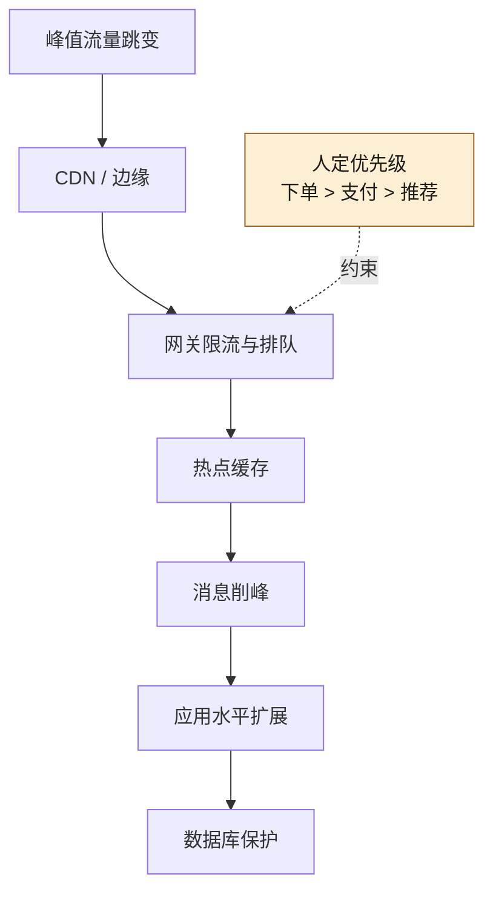
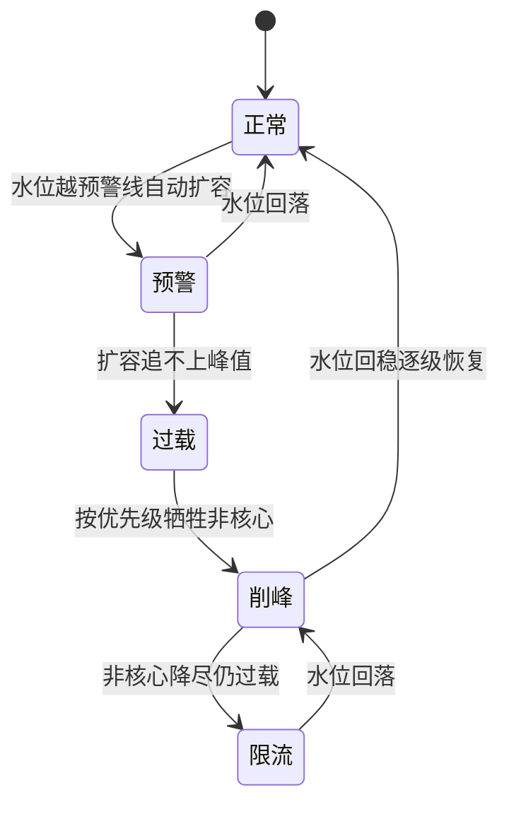

# 第 18 章 亿级流量：CDN、网关、缓存、异步、多活

> **本章定位**：当业务进入"亿级 DAU / 突发峰值远超日常均值"的量级时，容量规划与削峰架构如何分层落地，以及 AI 在容量计算中能辅助到什么程度。
> **核心命题**：突发流量是非线性跳变，AI 基于历史均值的预测会平滑掉尖峰；削峰是分层的、优先级是人定的、多活的成本-风险账是人来拍的。
> **本章的 AI 失灵点**：AI 生成的容量规划总是偏乐观——它不理解"突发流量"的非线性特征。
> **本章的人介入点**：人定削峰策略和多活方案，AI 做容量计算辅助。



**图 18-1｜分层削峰** — 均值预测会抹平尖峰；哪层先挡、挡谁，是人定的业务优先级。

---

## 18.1 问题：峰值 QPS 打过来，你的架构有几秒能反应？

大促前的容量评审会上，SRE 负责人把一张图拍在桌上——去年大促的峰值 QPS 曲线。**曲线在最头部有一个近乎垂直的跳变：30 秒内从十余万 QPS 蹿到了数十万量级。**

"你们的架构，在这个跳变里有几秒能反应？" SRE 负责人问全场。

没人答得上来。

他接着说："缓存层如果 3 秒内没建立好，峰值 QPS 直接打穿到数据库，数据库 5 秒内连接池耗尽，全平台不可用。网关如果限流配置没提前算好，要么限流太松打穿下游、要么限流太紧把正常用户挡在外面。**这些东西，不是大促当天调一调就行的——它们必须提前算清楚、提前压测过、提前知道'峰值来了我扛不扛得住'。**"

有人问："那 AI 能帮我们做容量规划吗？"

SRE 负责人的回答很有意思："能算，但别全信。AI 给的容量规划总是偏乐观——它拿历史数据推算，但突发流量的非线性跳变，历史数据里可能只出现过一次，AI 会把它当噪音平滑掉。**容量规划最怕的就是'被平滑掉的尖峰'。**"

---

## 18.2 根因：容量规划靠经验拍脑袋，没有系统化方法

**① "亿级"是一个模糊的概念。** 大家都说"我们是亿级 DAU"，但亿级到底意味着多少 QPS、多少并发连接、多少缓存命中率要求？没有人把这个翻译成具体的资源数字。

**② 突发流量是非线性的，历史数据会骗你。** 正常时段的流量曲线相对平滑，AI 基于这段数据做预测会很准。但大促的流量跳变是非线性的——**它不遵循历史趋势线，它是"黑天鹅"式的尖峰。** AI 的预测模型天然偏向均值，会把尖峰平滑掉，导致规划偏乐观。

**③ 削峰是分层的，不是某一层的事。** 很多人以为"加个缓存就好了"——但峰值 QPS 不可能靠一层消化。它需要 CDN 挡静态、网关限流挡突发、缓存挡读、异步队列削峰填谷、多活分散物理风险。**五层缺任何一层，峰值都会从缺口灌进来。** 图 18-1 沿请求路径把削峰手段串成一列（峰值 → CDN → 网关 → 缓存 → 消息队列 → 应用 → 数据库），但全图唯一不在这条线上的，是那根"约束"虚线：人定的优先级（下单 > 支付 > 推荐）只指向网关一层——哪层先挡、挡谁，从来不是技术参数，是业务决策。

---

## 18.3 AI 用法：AI 算容量辅助，人定削峰策略

容量规划里 AI 和人的分工：

**AI 做的：**
- 基于历史数据 + 业务预测，给出每层的基准容量需求
- 生成压测脚本和场景
- 辅助生成限流/缓存/超时的配置参数

**人做的（AI 替不了）：**
- **定义"尖峰场景"。** AI 会平滑掉尖峰，人必须显式地把"大促 30 秒峰值 QPS"作为一个独立场景喂给 AI，让它对这个极端场景做容量计算，而不是基于均值。
- **定削峰策略和优先级。** 峰值来了，先牺牲什么？（异步非核心请求可以排队）、绝对不能牺牲什么？（支付链路必须同步）。这些是业务判断。
- **定多活方案。** 几个机房、怎么分流、切换条件是什么。这是架构决策和成本权衡。

---

## 18.4 五层削峰

这是在大促前落地的架构方案：

| 层 | 职责 | AI 辅助 | 人定 |
|----|------|--------|------|
| CDN | 静态资源就近返回 | 生成缓存规则 | 哪些资源可缓存 |
| 网关 | 限流、超时、灰度 | 生成限流配置 | 限流阈值（基于业务容忍度）|
| 缓存 | 挡读请求 | 生成缓存策略 | 缓存一致性方案 |
| 异步 | 削峰填谷 | 生成消息队列配置 | 哪些请求可异步、SLA 多少 |
| 多活 | 分散物理风险 | 生成流量分配脚本 | 机房数量、切换条件 |

**五层咬合的关键是"优先级"：当峰值来了扛不住时，按什么顺序牺牲？** 一个常见的优先级：支付/交易链路绝对保障 → 核心浏览保障 → 推荐降级 → 营销活动降级 → 非核心功能直接返回降级页。**这个优先级表由决策层与风控负责人共同敲定——技术团队提方案，但"什么最重要"是业务决策。**

把这张优先级表再往下沉一层，就是大促当天各层自动执行的「过载处置状态机」——支付与交易链路在任何一个状态里都不降级，它们是状态机的地板，不是某一档：



**图 18-2｜过载处置状态机** — 峰值是状态跳变不是数字：从预警到限流每一档触发什么动作，必须在大促前写死成剧本，而不是当天临场发挥。

图 18-2 里的边分两类：预警 → 过载 → 削峰 → 限流是水位触发的正向跳档，限流退回削峰、削峰逐级恢复正常、预警直接回正常是同样写死的反向恢复边——图上没有任何一条边通向"当天临场决定"。

---

## 18.5 角色博弈：多活的成本，谁批

多活（多机房异地部署）是最贵的削峰手段。**每多一个机房，服务器成本翻倍、数据同步复杂度翻倍、运维成本翻倍。**

决策层的回答很务实："先算账——不上多活，大促挂了的损失是多少？上多活，每年多花多少？"

这笔账：不上多活，一次大促全平台不可用 30 分钟，按交易额估算损失量级可观；上双活，每年多花一笔固定的服务器成本。**决策层拍板："双活。每年多花这笔钱，买的是'大促不至于全军覆没'。值。"**

**这是一个纯粹的成本-风险权衡，AI 给不了答案——它不知道"一次大促挂了对公司的品牌损失"有多大，因为品牌损失不在历史数据里。**

> **代价声明**：双活上线后，服务器年成本显著增加。数据同步的复杂度让 SRE 团队多了约 2 人/月的持续运维投入。**但双活上线后的大促，即使一个机房出了波动，流量自动切到另一个机房，用户无感。SRE 负责人的反馈是："这是我几年来睡得最踏实的一次大促。"**

---

## 18.6 可抄骨架：限流配置与压测纪律

**网关限流的最小可读配置**（以声明式路由为例，阈值全部占位，由容量计算填入）：

```yaml
# gateway/ratelimit/<大促代号>.yaml —— 进仓库、走评审，不是控制台里的手调参数
routes:
  - path: /api/order/create        # 核心链路：优先保
    limits:
      per_user_qps: ${ORDER_USER_QPS}      # 单用户防脚本
      global_rps:   ${ORDER_GLOBAL_RPS}    # 全链路上限 = 下游容量 × 0.8
      queue: { max_wait_ms: 2000, max_pending: ${QUEUE_DEPTH} }
      on_exceed: queue-then-reject          # 排队吸收毛刺，超出快速拒绝
  - path: /api/recommend/feed      # 非核心：最先让路
    limits:
      global_rps: ${FEED_RPS}
      on_exceed: degrade-to-cache           # 降级返回缓存/兜底内容
priority_manifest: [order, payment, cart, search, recommend]
```

这份配置里最重要的不是阈值，而是最后一行的 **priority_manifest（业务优先级清单）**：限流触发时谁先保、谁先让。AI 可以生成前一半，但优先级清单必须由业务方签字——它本质是一份"事故时准备牺牲谁"的契约，第 2 章说的"不承担后果"在这里最具体。

**压测纪律四条：**

1. **压测按跳变曲线，不按均值曲线**。爬坡模型（ramp-up）只能验容量下限，验不出削峰：真实大促是"平时流量 → 零点尖峰"的阶跃，压测脚本必须复刻阶跃 + 持续高位两段。
2. **从第一跳压到溢出为止**。每层单独压（CDN 回源、网关排队、MQ 堆积、DB 连接池），记录每一层"开始变坏的信号"——第 18.4 节状态机的每一档阈值，都应来自这条曲线而不是会议室。
3. **降级路径必须在压测里真实走一遍**。`degrade-to-cache` 生效时缓存命中率会突变，没验过的降级等于没写。
4. **AI 可以生成压测脚本，但跳变曲线的形状是人定的**。AI 默认拿历史流量做外推——它做回归很强，做"从没发生过的尖峰"没有信息源，这正是"不验证只推断"的容量版。

**容量侧的四个度量：**

| 指标 | 度量什么 | 失真信号 |
|------|----------|---------|
| 预测覆盖率 | 预测峰值 ÷ 压测溢出点 | < 1 即容量计划乐观，须重算 |
| 排队 P99 等待 | 排队策略是否吸收住毛刺 | 逼近 max_wait_ms = 快速拒绝将至 |
| 降级命中率 | 非核心链路让路是否按清单执行 | 核心链路被挤 = 优先级配错 |
| 预案触发次数 | 状态机各档在大促当天被触发的分布 | 全部集中在最后一档 = 预警档位失效 |

---

## 18.7 产出物：容量规划 + 多活方案

1. **容量规划模板**：每层的基准容量 + 尖峰场景容量 + 降级阈值，按大促/日常两套配置。
2. **多活方案**：双机房部署、流量分配比例、切换条件、数据同步策略。

> **代价声明**：容量规划本身不产生业务价值，它是一项"不出事就没人注意"的工程。**但不出事，恰恰是它最大的价值——大促那天峰值 QPS 打过来，用户无感、交易正常、风控在线，就是这份规划的全部回报。**

---

## 18.8 四案例映射

| 案例 | 本章对应的场景 | 峰值特征 | 多活取舍 |
|------|----------------|----------|----------|
| 案例一·电商平台 | 大促峰值容量规划与五层削峰 | 30 秒内 QPS 数倍跳变 | 双活，支付域走主从 |
| 案例二·加密交易所 | 极端行情下的行情与交易洪峰 | 行情暴涨引发交易尖峰 | 行情读双活、资金写主从 |
| 案例三·Web3 量化 | 策略密集触发下的下单洪峰 | 多策略并发下单尖峰 | 主策略热备、回测只读 |
| 案例四·安全初创 | 客户突发扫描任务与汇报洪峰 | 客户批次任务瞬时涌入 | 单活起步，按需扩容 |

---

## 18.9 检查清单

- [ ] 你能说出"亿级"对应的具体 QPS、连接数、缓存命中率要求吗？说不出来 = 亿级是模糊概念。
- [ ] 你的容量规划，有没有包含"尖峰场景"？没有 = AI 会帮你把尖峰平滑掉。
- [ ] 你的削峰是分层的吗？只有一层 = 峰值会从缺口灌进来。
- [ ] 大促来了扛不住时，你知道先牺牲什么吗？不知道 = 要么全挂要么瞎降级。
- [ ] 你算过多活的成本-风险账吗？没算 = 要么过度投入要么裸奔。

---

## 18.10 遗留问题

- **缓存一致性怎么做？** 这是五层削峰里最难的部分——缓存和数据库的一致性在高并发下极难保证。本书不深入展开，标注为分布式系统的经典难题，推荐读者参考"最终一致性 + 缓存击穿防护"的工程实践。
- **AI 的容量预测能不能更准？** 实践经验是：对均值预测准，对尖峰预测不可靠。除非历史数据里有足够多的尖峰样本。留给读者探索。
- **双活的数据同步延迟在资金链路上可接受吗？** 支付域对数据一致性要求极高，双活同步的毫秒级延迟可能影响对账。风控负责人最终拍板：支付域走"主从"而非"双活"——主写入只走一个机房，另一个机房只读。**这是"一致性 vs 可用性"的权衡，每个域的选择可能不同。**

---

> **本章的一句话**：亿级流量不是一个数字，是一连串"扛不扛得住"的工程决策。**AI 能帮你算出"均值下需要多少资源"，但"尖峰来了先牺牲什么"和"值不值得花大价钱上多活"——这些问题永远需要人来拍板。** 容量规划做对了，大促那天用户什么都不会感觉到——而这正是它最大的功劳：让灾难变成一次无感。
