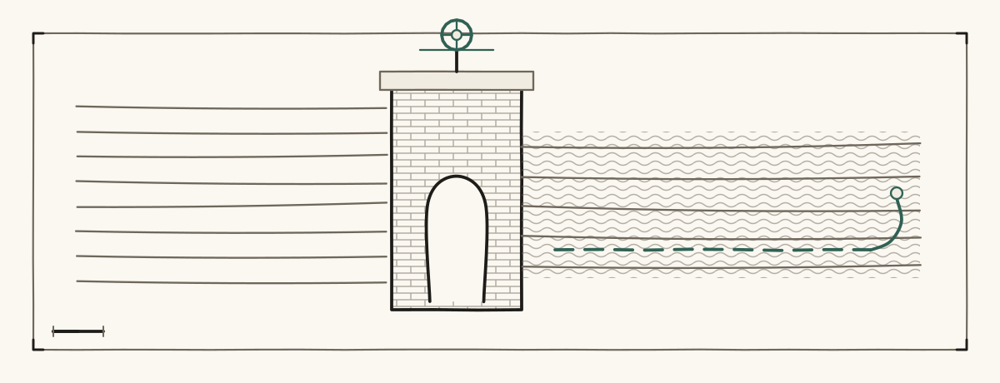
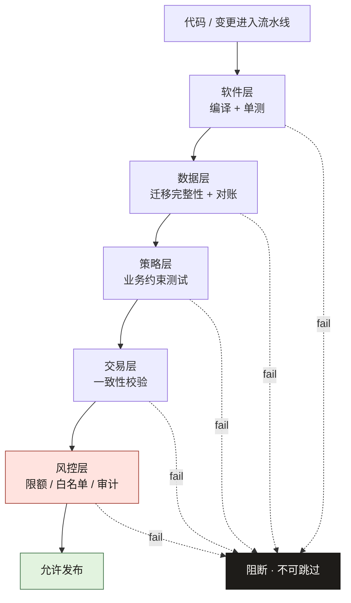
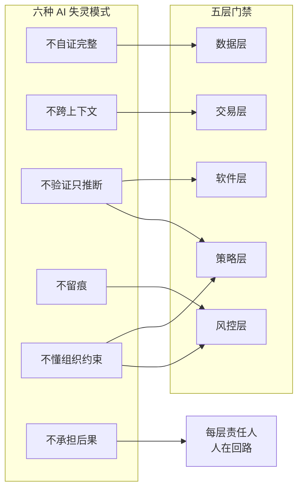
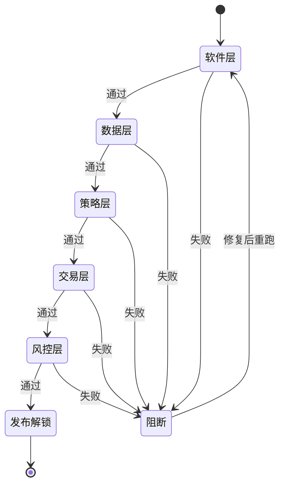
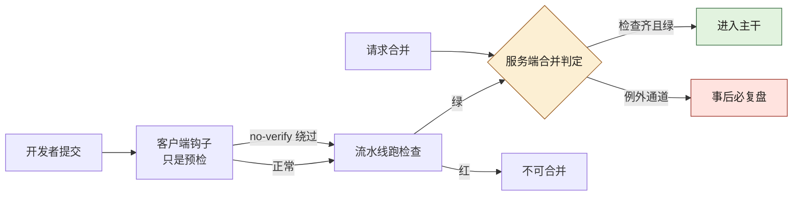
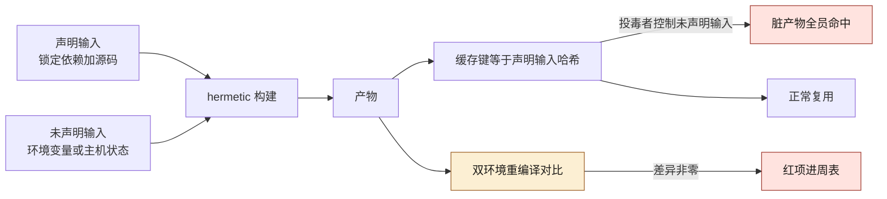

# 第 19 章 测试五层门禁：软件、数据、策略、交易、风控

> **本章定位**：上线体系统一化——五层门禁成为全平台发布标准。
> **核心命题**：门禁不可绕过（靠技术手段保证），每层有明确的通过标准和责任人；AI 生成代码让门禁意识更脆弱，必须用系统约束替代人的自觉。

<figure class="chapter-plate">
  
  <figcaption>题图 · 水闸：过闸的口径是定出来的，不是涨出来的</figcaption>
</figure>

---

## 19.1 问题：门禁太多没人守，门禁太少等于没有

在一次支付对账事故的复盘之后，一个核心问题被摆到桌面："那笔对账迁移上线前，过了几道门禁？"

答案是：只过了"软件层"门禁（代码编译通过 + 单测过）。**数据层有没有漏字段、策略层有没有限额缺失、交易层有没有对账不一致、风控层有没有资金风险——一道都没过。** 不是这些门禁不存在，是它们从来没被"系统化"地接进上线流程。有些门禁靠人记得去查，有些门禁纯粹靠运气。

另一次促销规则事故则是另一个极端——促销规则引擎上线前过了软件层和策略层，但"满减不能叠加"这个业务约束没有对应的门禁。它是"策略层门禁不完善"的典型。

这两件事指向同一个问题：**上线门禁是碎片化的、靠人记忆的、没有统一标准的。** 一次事故漏了数据层，另一次事故漏了策略层——漏的不同，但漏的原因一样：**没有人把"上线前应该过哪些门禁"做成一个不可绕过的清单。**

---

## 19.2 根因：门禁靠自觉，自觉有波动

**① 每层门禁分散在不同人手里。** 软件层在开发手里，数据层在 DBA 手里，风控层在风控负责人手里。**没有人把这些门禁串成一条流水线。** 于是上线的人只过自己知道的那几道，其余的碰运气。

**② 门禁是"建议"不是"强制"。** "建议上线前做对账验证"和"不做对账验证就不让上线"，效果差着一个银河系。**只要门禁可以被绕过，赶时间的人一定会绕过。**

**③ AI 生成代码进一步削弱了门禁意识。** 当代码是 AI 写的，开发者对它的信心会偏高（"AI 生成的，应该没问题吧"），于是更倾向于跳过他觉得"多余"的门禁。**AI 没有降低门禁的必要性，但降低了人执行门禁的意愿。**

---

## 19.3 五层门禁

全平台的上线门禁被统一成五层，每层有职责、标准、责任人和技术强制手段：



**图 19-1｜五层门禁** — 五全过才能上线；任何一层失败，发布按钮不可用。

| 门禁层 | 守什么 | 通过标准 | 责任人 | 技术强制 |
|--------|--------|---------|--------|---------|
| 软件层 | 代码质量 | 编译通过 + 单测覆盖率 ≥ 80% | 开发 | CI 自动 |
| 数据层 | 数据完整性 | 迁移脚本无字段遗漏 + 对账无差异 | DBA + 开发 | 迁移对账脚本自动跑 |
| 策略层 | 业务规则正确 | 关键业务约束有对应测试 | 域 TL | 策略测试自动跑 |
| 交易层 | 交易一致性 | 订单-支付-库存一致 | 交易域 TL | 交易一致性测试 |
| 风控层 | 资金安全 | 限额/白名单/审计接入验证 | 风控负责人 | 风控接口存在性测试 |

**五层的关系不是"五选一"，是"五全过才能上线"。** 任何一层不过，发布流程卡住，不允许跳过。图 19-1 用边的汇合方式印证了这句话：五层的 fail 虚线全部指向同一个"阻断"节点，而"允许发布"在图上只有风控层通过这一种走法。

### 五层与六失灵：每层兜哪种失灵

五层门禁不是为了「AI 写得差」兜底，而是给第 2 章归纳的六种 AI 失灵模式各指定一个承接层。把失灵模式和门禁层摆成一张对应矩阵，「为什么恰好是五层」就有了出处：



**图 19-2｜五层对六失灵的承接矩阵** — 前五种失灵都能指定门禁层兜住；唯独「不承担后果」没有任何一层能自动拦截，只能落在每层的责任人身上——这就是门禁表里必须有责任人栏的原因。

图 19-2 的读法是按门禁层数进边：「不验证只推断」和「不懂组织约束」各伸出两条边，策略层因此承接了两种失灵——这正是 19.6 的代价声明单独点名"新的业务约束出现时，策略层要加新测试"的原因；其余失灵各落一层，"不自证完整"给数据层，"不留痕"给风控层。

配套的对应关系可直接抄进 RFC 的评审依据：

| 失灵模式 | 主要承接层 | 承接方式 |
|---|---|---|
| 不自证完整 | 数据层 | 迁移完整性 + 对账 |
| 不跨上下文 | 交易层 | 订单-支付-库存一致性校验 |
| 不验证只推断 | 软件层 + 策略层 | 单测 + 业务约束测试 |
| 不留痕 | 风控层 | 审计接入存在性验证 |
| 不懂组织约束 | 策略层 + 风控层 | 约束测试 + 限额/白名单 |
| 不承担后果 | 每层责任人 | 人在回路签字 |

---

## 19.4 门禁不可绕过的技术保证

门禁如何"不可绕过"？靠的不是写规范，是**把门禁嵌进发布流水线**——不过门禁，部署按钮就点不了。

```
PR 合并 → 触发五层门禁流水线
  → 软件层 CI → 过？
  → 数据层对账 → 过？
  → 策略层测试 → 过？
  → 交易层一致性 → 过？
  → 风控层接入验证 → 过？
    → 全过 → 解锁灰度部署
    → 任何一层不过 → 部署不可用，须修复后重跑
```

**关键在于"解锁"机制：部署权限与门禁结果绑定。** 不是"你过了门禁但可以手动部署"，而是"系统只有在你过了全部门禁后，才把部署按钮解锁给你"。**门禁不再是人的自觉，而是系统的约束。**

把「解锁」画成状态机，「发布按钮不可用」就不再是一句口号，而是一个可验证的系统状态：



**图 19-3｜门禁解锁状态机** — 门禁不是「检查记录」而是「解锁条件」：任何一层失败，发布按钮保持不可用；修复后从流水线重跑，没有「只补失败那层」的捷径。

图 19-3 里"阻断"节点只有一条出边，落点还回到第一层软件层——这就是 19.5 那笔"一次发布约 40 分钟"的效率税没法靠"只重跑失败层"摊薄的原因。

---

## 19.5 角色博弈：风控层门禁的例外审批

五层门禁里，最难推的不是技术实现，是"**风控层门禁能不能有例外**"。

一线的诉求："有些改动和资金完全无关（比如改一个文案），也要过风控层门禁？太浪费时间了。"

风控负责人的态度很硬："你怎么确定一个改动'和资金完全无关'？那次对账事故的迁移脚本，当时也以为只是个数据搬运。"

最后妥协：**风控层门禁有一个"适用性判定"步骤——由风控团队自动扫描变更内容，判断是否涉及资金链路。涉及则全量过风控门禁；不涉及则标记"风控豁免"并记录原因。** 但"风控豁免"不是自己声明，是风控系统判的——**一线不能自己说"这不涉及资金"来跳过门禁。**

> **代价声明**：五层门禁上线后，一次发布的平均门禁耗时从"几乎为零"（因为以前根本不全过）变成了约 40 分钟。**这 40 分钟是一笔实打实的效率税。但事故复盘告诉我们：少过一道门禁省下的时间，远不够赔一次事故的钱。**

---

## 19.6 产出物：五层门禁标准

一份标准文档，覆盖每层的定义、通过标准、责任人、技术实现方式、例外审批流程。门禁结果与部署权限绑定的技术规范。

> **代价声明**：五层门禁最大的隐性成本不是时间，而是"**门禁本身的维护**"——每一层的判定规则需要持续更新（新的业务约束出现时，策略层要加新测试）。门禁是活的系统，不是写完就不用管的文档。

### 落地步骤：把门禁焊进流水线

1. **先统一清单**：五层的定义、通过标准、责任人写成一份文档，逐条签字——先有共识，再谈工具。
2. **每层找机判抓手**：编译与覆盖率、迁移对账脚本、策略测试、一致性校验、接口存在性；机判不了的先设人工卡点，但卡点结果必须留痕进门禁面板。
3. **串成流水线**：串行起步，先保证「不可绕过」，再优化时长——并行化是优化，不是前提。
4. **权限绑定**：解锁逻辑写在发布系统里，不写在规范文档里；按钮不解锁，谁都发不了。
5. **例外通道单建**：风控适用性判定走自动扫描并记录原因，一线没有自我豁免权。
6. **联动灰度**：门禁解锁只到灰度档位，全量仍由第 21 章的监控与自动刹车守着。
7. **门禁自身也走门禁**：判定规则的变更同样要评审留痕，防止门禁被悄悄放松。

### 可抄配置：五层门禁流水线

```yaml
# 五层门禁流水线（占位示例：runner 与脚本路径按各域实际替换）
stages: [software, data, policy, trade, risk]

software:
  run: ./ci/unit-test.sh
  coverage_min: 80          # 第 19.3 节既定标准：低于即失败，不进下一层
data:
  run: ./ci/migration-recon.sh
  require_field_manifest: true   # 为什么：字段清单缺失是漏字段事故的前兆
policy:
  run: ./ci/policy-tests.sh
  fail_owner: domain_tl     # 策略层失败只有域 TL 能判定放过还是修复
trade:
  run: ./ci/trade-consistency.sh
risk:
  run: ./ci/risk-hooks-check.sh
  exemption: auto_scan      # 豁免只能由风控系统判定，不接受自我声明

deploy_unlock:
  needs: [software, data, policy, trade, risk]   # 解锁条件：五层全部成功
  on_failure: block         # 任何一层失败，部署按钮保持不可用
```

### 度量指标：门禁本身也要度量

门禁是活系统，不度量它就会悄悄失效：

| 指标 | 怎么测 | 口径 | 谁看 | 多久看一次 |
|---|---|---|---|---|
| 门禁全过率 | 流水线结果统计 | 趋势看，突降即查规则是否被放松 | 治理组 | 每周 |
| 平均门禁耗时 | 流水线打点 | 对照本章代价声明的量级持续压降 | 各域 CI Owner | 每月 |
| 失败层分布 | 按失败层聚合 | 长期集中在某层，说明该层上游质量差 | 域 TL | 每月 |
| 豁免误判率 | 豁免样本抽查复核 | 对照遗留问题的已知误判量级，只许降 | 风控 | 每周 |
| 门禁有效性 | 人工注入缺陷样例 | 漏拦一次即红项 | 治理组 | 每季度 |

### 反模式：门禁的六种变形记

| # | 反模式 | 后果 |
|---|--------|------|
| 1 | 门禁是文档不是流水线 | 靠人记得，赶时间一定漏 |
| 2 | 门禁留了手动跳过口 | 「不可绕过」四个字当场失效 |
| 3 | 只自动化软件层 | 数据层与策略层事故照发 |
| 4 | 责任人栏空着 | 拦下了没人认领，门禁空转 |
| 5 | 判定规则常年不动 | 一线学会「刷题」过门禁 |
| 6 | 拿门禁耗时考核一线 | 一线开始绕路，门禁变成博弈场 |

---

## 19.6b 策略即代码：门禁判定式的可抄形状（B 档）

> **档位声明（策略即代码：门禁判定式）**：**B 档 · 文档逐字：Rego 判定式按 OPA 规范语法书写，本机未安装 OPA、未跑过 opa eval，活体验证（一正一反喂输入）留给读者环境执行**

上面那份可抄配置里，每层的判定还藏在 `./ci/*.sh` 的分支逻辑里——那是"策略住在 shell 里"：不可评审（diff 一整段脚本）、不可回放（上周的输入配不上这周的规则）、不可复用（五个仓五份拷贝）。策略即代码把"该不该放行"抽成数据文件上的纯函数，换来的正是这三件事：策略有自己的 PR、规则变更有自己的 diff、历史输入能在新规则下重跑一遍看判定翻转在哪。

以风控层那条"涉资金目录的变更必须有风控签字"为例，判定式按 OPA/Rego 规范的形状写：

```rego
# policies/gates/risk.rego —— 判定式按规范书写，本机未装未跑（B 档）
package gates.risk

import rego.v1

default allow := false

has_risk_sign if "risk-officer" in input.approvals

deny contains msg if {
    some p in input.paths
    startswith(p, "src/pay/")        # 涉资金目录前缀，与 CODEOWNERS 同源维护
    not has_risk_sign                # 缺风控签 → 产出一条拒绝理由
    msg := sprintf("资金路径 %s 缺风控签字", [p])
}

allow if count(deny) == 0
```

输入是评审系统喂的 JSON（`paths`、`approvals`、变更元数据），输出是 deny 集合——**门禁第一次有了"为什么拦"的结构化返回值**，而不是一行 exit code。三个必须写进策略仓 README 的静默面：

- **最贵的是默认那一行。** `default allow := false` 若写成 true，所有没被任何规则覆盖的输入都从默认分支静默放行——规则覆盖率之外的世界全是口子。
- **Rego 里"没判出来"不等于"判了放行"。** 未绑定变量会让规则体静默不触发，deny 集合为空可能只是规则没跑起来。区分这两件事靠策略测试：给定输入集与期望 deny 条数，测挂了就是策略本身坏了——这与第 10 章"测试要有牙齿"同一条纪律。
- 本机未安装 OPA，上面是规范语法（B 档）；合入 CI 前必须在你的环境用 `opa eval` 喂一正一反两个输入、看见红绿各一次，才算门禁活着——照 [第 9 章](./ch14-第9章-契约先行.md) 9.5d 的话说，没被故意触发过的门禁和设成 warning 的门禁是同一件事。

---

## 19.6c Conftest：它在 CI 里挡的是配置形状（B 档）

> **档位声明（Conftest / OPA）**：**B 档 · 文档逐字：本机未安装 Conftest，Rego 形状判据按 Conftest/OPA 文档书写，未跑过 conftest test，输出格式与参数以读者环境 conftest --help 为准**

OPA 在运行时回答"这个请求放行吗"；Conftest 把同一套 Rego 策略搬到 CI，回答"这份配置文件允许被合并吗"。它的对象是 YAML/JSON/TOML 这类结构化配置——恰好是五层门禁自己的定义文件、部署清单、策略文件。CI 里挡的形状，举三条判据：部署清单缺资源 limits、镜像 tag 写成 latest、门禁流水线自己被人改了解锁条件。最后一条最值得机器化——**防的就是「门禁被悄悄放松」**（落地步骤第 7 条）：

```rego
# policies/pipeline/gate_shape.rego —— 对上面那份五层 YAML 的形状判定（示意）
package ci.pipeline

deny contains msg if {
    count(input.deploy_unlock.needs) != 5
    msg := "deploy_unlock.needs 必须含全部五层，缺层即红"
}

deny contains msg if {
    input.risk.exemption != "auto_scan"
    msg := "风控豁免只许系统判定，exemption 字段被改动"
}
```

Conftest 挡得住"形状不合规"，挡不住三件事：字段存在但语义错（`coverage_min: 80` 改成 `8` 是形状合规的坏——所以要配 19.6b 的策略测试与 CODEOWNERS 强审）；运行时行为（它只看文件不看世界）；以及**压根没跑它的合并**——CI 绿灯只证明跑了流水线的提交没事，挡不住绕过流水线的人，这就是下一节。本机未安装 Conftest，以上为规范形状（B 档），输出格式与参数以你环境的 `conftest --help` 为准。

---

## 19.6d required checks 与分支保护的绕过面：逐条（含本机实跑对照）

> **档位声明（required checks 与分支保护绕过面）**：**A 档 · 本机实跑（两半档位不同）：客户端钩子 --no-verify 与服务端 pre-receive 的拒绝/留痕对照为本机 git 2.53.0 临时裸仓实跑（A 档）；托管平台分支保护与 required checks 的服务端实现那半按各平台文档归类、本机未碰（B 档 · 文档逐字）**

门禁表里"技术强制：CI 自动"一格藏着一个追问：CI 绿了，**合并这个动作保证发生在这份绿之后吗？谁能把不绿的合并进去？留下了什么痕？** 逐个绕过面过一遍（对象是托管平台的分支保护，口径按各平台文档归类，B 档框架 + 一处本机实跑）：

| 绕过面 | 谁能绕 | 留什么痕 | 兜法 |
|--------|--------|---------|------|
| 客户端钩子（pre-commit / pre-push） | 每个提交者，一条 `--no-verify` | **不留痕**（见下方实跑：log 里没有任何"曾绕过"的记号） | 客户端钩子只当本地预检，永不登记为门禁 |
| 管理员直推保护分支 | 仓库 admin | 平台审计日志一条 bypass 事件 | 分支保护勾选对管理员生效；bypass 报表进周会 |
| 合并队列 / auto-merge | 持有合并权的人 | PR 事件流有时间戳差 | 开 strict 模式：合并时基线变了就重跑检查 |
| force-push 改历史 | 有写权限者 | reflog 与平台事件 API | 禁 force-push；require last push approval——过审的提交与被合并的提交必须是同一份 |
| Bot / CI token 自批自合 | workflow 权限过宽的仓 | actor 字段是 bot | 分支保护覆盖 bot actor；最小权限 token |
| 紧急 break-glass | 被授权的那几个人 | 审计事件 + 例外记录 | 例外通道单建（落地步骤第 5 条），事后逐条复盘 |
| 直接改保护规则本身 | 有 admin 权限者 | 规则的变更历史 | 把保护规则当代码纳管：改规则走 PR + 双人 |

客户端钩子可以绕，不是推测——本机 git 2.53.0 搭一个临时裸仓实跑对照（裸仓 + 钩子模拟的是"服务端钩子机制"，**托管平台 required checks 的服务端实现本机没碰过，不声称验证过**）：

```text
CI-LOCAL: pre-commit check FAILED
EXIT=1 (pre-commit 拦住,未产生提交)
NO-VERIFY: 提交成功
pre-push check FAILED
error: 无法推送一些引用到 '/tmp/gate_demo/remote.git'
EXIT=1 (pre-push 拦住)
NO-VERIFY PUSH: 远端已收下被绕过钩子的提交
d6768b3 bypassed commit
cd2ad79 baseline
```

```text
remote: REMOTE: commit 缺 gate:passed 尾注,拒绝
 ! [remote rejected] main -> main (pre-receive hook declined)
EXIT=1 (服务端 pre-receive 拒绝,--no-verify 无效)
带 gate:passed 尾注的提交通过服务端钩子
```

三条读数：**① 客户端钩子不是门。** 同一次提交，`--no-verify` 一下就过，而且远端历史里只有 "bypassed commit" 这个标题，没有任何一条记录写着它绕过硬检查——绕过面表第一行的"留痕"栏填"不留痕"就是这次实跑。**② 服务端 pre-receive 绕不过**，`--no-verify` 对它无效，拒绝发生在对端。**③ 但本例的服务端钩子只判「提交尾注在不在」**，它不知道 CI 是否真的绿过——真正的强绑定是托管平台把检查状态作为合并前置条件，那一半以平台文档与服务端审计为准（B 档）。图 19-4 把两条线的分工画出来：



**图 19-4｜客户端预检与服务端合并闸的分界** — 客户端的钩子与流水线绿，都只是给服务端判定递证据；真正把合并拦下来的是服务端那一格，而它的例外口全部要求事后可复盘。

这一节对 19.4 的补强是一句话：**门禁表"技术强制"列的每一格都必须写明强制侧**——客户端、CI、还是服务端；凡只写"CI 自动"而不落服务端合并条件的，都是上表没兜住的口子。审批链的平台侧治理在第 2 章（`./ch07-第2章-人在回路.md`）。

---

## 19.6e hermetic 构建与缓存投毒

上一节拦"没过检查的进去"，这一节拦"进去的产物不是构建出来的那个"。hermetic（封闭）构建的定义：输出只由**声明过的输入**决定——同样的输入哈希必须得到字节级同样的输出，构建过程不联网、不读宿主机状态、不吃隐式环境变量。组织需要它的理由很直白：**产物不可复现，CI 绿灯证明的就只是"流水线眼前那份东西没事"，上线的却是另一个东西**——五层门禁检查的对象就漂了。

投毒的机制形状（B 档，本机无 docker/bazel，不声称跑过任何构建对照）：远程构建缓存的键是声明输入的哈希，于是任何**影响了输出却没进声明**的东西都是投毒面——宿主机工具链版本、构建时拉取的可变依赖、烤进产物的时间戳与路径。攻击者不需要收买任何人的审批，只要控制一个"构建会读、缓存键不含"的输入（公共基础镜像的可变 tag、依赖镜像源的浮动版本），预先污染共享缓存——**一处污染被全员命中，比污染一台机器高效得多**，而每个命中它的 CI 都是绿的。图 19-5 是这条路径和两道探针：



**图 19-5｜hermetic 缺口与缓存投毒** — 缓存键只数声明输入；凡影响输出又不在声明里的东西，都是给全组织投毒的入口，只有随机重编译对比能把它照出来。

判据两条，都可例行走查（频率与阈值以各域容量与机时为例定）：

1. **复现性抽测**：同一提交在两台干净环境各构建一次，规范化（剥掉路径、build-id、时间戳）后 diff 产物，非零差异即红项；红项不回滚缓存就停用——先让脏缓存无处命中，再查污染源。
2. **输入声明完备性**：lockfile 不入库、构建期联网拉可变依赖、保护分支不含构建定义文件，三种形状都判"构建不封闭"，归数据层与软件层门禁的联合检查项。产物的成分清单与签名核验（SBOM、签名链）是供应链的活，在第 22 章（`./ch27-第22章-安全合规公开仓库.md`）展开，本节只认它的前置：**没有 hermetic 输入，签名签的是一份说不清组成的产物**。

静默放行形状最刁钻的一个：**缓存命中率进了团队 KPI，就没有人愿意触发重编译**——判据必须写成"随机抽样的发布必须走全量重建"，而不是看整体命中率数字。

---

## 19.6f 五层各自「静默放行」的形状与判据

19.6 度量表里已经埋了两条心跳（门禁有效性、豁免误判率），这一节把它们展开成逐层探针。要点先说死：**每层的"静默"长得都不一样，因为每层的绿信号来自不同的省略**——所以一种探针管不了五层。图 19-2 的承接矩阵说每层兜一种失灵，这张表说的是每层先兜住自己的假绿：

| 层 | 静默放行的典型形状 | 为什么会静默 | 该层探针判据 |
|----|-------------------|-------------|-------------|
| 软件层 | 测试收集到 0 个仍绿；增量覆盖门只看 diff 行，AI 把测试文件连同源文件一起删了也绿 | 绿信号来自"没有失败"，不是"验证过什么" | 空测试集判红；每周向受门文件注入一个必失败断言，没拦住即红项 |
| 数据层 | 对账脚本的基线表是空的，零差异通过 | 空集与一致在一条返回里无法区分 | 先断言行数大于零、表存在，再对账；空表是红不是绿 |
| 策略层 | 新业务约束没有对应用例，约束的存在使"全过"包含"没测" | 通过率和覆盖率都数不到"不存在的测试" | 约束清单与测试名建映射表，缺行判红——图 19-2 里策略层两条进边的代价 |
| 交易层 | 只比总额不比明细，借贷成对同错时总额恰好平了 | 判据选错，结果再对也白搭 | 正反两个方向的差额都要查，金额精度单独断言 |
| 风控层 | 适用性判定扫不到新增的资金目录，整单被标豁免 | 扫描规则永远比目录演化慢一步 | 豁免理由必须含机验依据（哪条规则命中了哪些路径）；豁免样本周查，对照 19.9 的既定误判率量级只许降 |

收尾一条纪律，接住 19.6b 说的策略测试：**每季度对五层各做一次"故意违规走完全程"的演练**——注入一条该拦的变更，看它停在哪一层。某层连续一个季度没红过一次，先怀疑探针，再表扬团队；一个只见过绿灯的门禁，和 19.6 反模式第 2 条那个手动跳过口，是同一个东西的两种长相。至于"拦下之后谁裁决放行"——那是例外审批与签字链的活，第 2 章与第 20 章（`./ch25-第20章-风控不可绕过.md`）分别管两层。

---

## 19.7 四案例映射

| 案例 | 五层门禁的核心挑战 | 门禁侧重 | 典型失守层 |
|------|-------------------|---------|-----------|
| 案例一·电商平台 | 支付对账迁移跨多层域，门禁需串起软件/数据/交易/风控 | 五层全覆盖，重点是数据层与风控层 | 数据层（漏字段）、风控层（未介入） |
| 案例二·加密交易所 | 充提转链路资金属性强，风控层门禁权重最高 | 风控层为主，策略层与交易层并重 | 风控层（限额缺失）、策略层（规则漂移） |
| 案例三·Web3 量化 | 策略迭代快、合约高频部署，策略层门禁最易被绕过 | 策略层为主，软件层与交易层并重 | 策略层（策略无对应测试） |
| 案例四·安全初创 | 工程人力薄、合规要求高，门禁自动化程度要求高 | 软件层与风控层为主，自动化优先 | 软件层（覆盖率不足）、风控层（人力不足） |

---

## 19.8 检查清单

- [ ] 你的上线门禁，是一份统一清单还是分散在各人脑子里？分散 = 一定有遗漏。
- [ ] 你的门禁是"建议"还是"强制"？建议 = 赶时间一定被绕过。
- [ ] 门禁结果和部署权限绑定了吗？没有 = 人可以手动跳过。
- [ ] 五层里，你覆盖了几层？只有软件层 = 数据层和策略层事故在等你。
- [ ] 风控层门禁能不能被一线自己豁免？能 = 等于没有风控层。

---

## 19.9 遗留问题

- **门禁流水线跑 40 分钟，能不能加速？** 可以通过并行化（五层同时跑而不是串行）和增量测试（只跑变更影响的层）。留给各域 CI 优化。
- **"适用性判定"会不会误判？** 风控系统的自动判定有约 5% 的误判率——要么误判为"涉及资金"导致白跑全量门禁，要么误判为"不涉及"导致跳过了该过的门禁。前者浪费、后者危险。**误判的处理仍需人工复核。** 留给第 24 章（AI 评审与幻觉）。
- **门禁会不会变成"刷题"？** 一线可能学会"怎么写代码才能最快过门禁"而不是"怎么写代码才真正安全"。这个博弈永远存在，解药是"门禁内容持续更新"和"抽查门禁的有效性"。

---

> **本章的一句话**：门禁的价值不在"拦住了多少发布"，而在"**让每一次发布都过了同样多的检查，不依赖于当天谁在岗、谁记得查、谁有空审**"。AI 让代码生成变快了，门禁必须变得更系统——否则你放行的速度越快，放进去的风险就越大。
