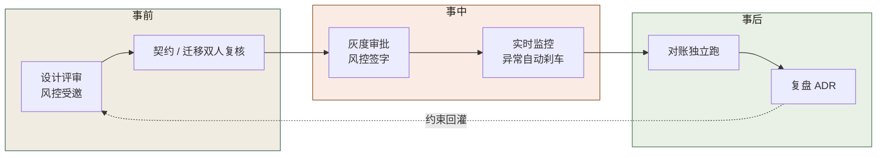
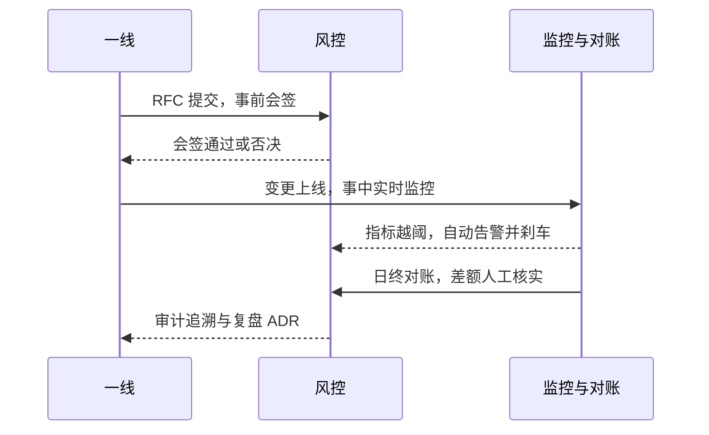
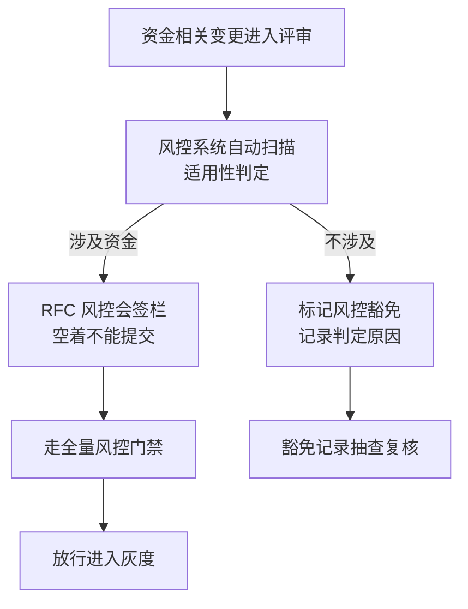

# 第 20 章 风控不可绕过：事前、事中、事后

> **本章定位**：风控接入规范化——从"事后审计"升级为"事前、事中、事后三层防线"。
> **核心命题**：风控必须在事前接入设计、事中监控、事后对账，三者缺一不可；AI 让代码生成变快，于是"风控有没有被邀请"必须从"建议"升级为"不可绕过的强制"。



**图 20-1｜风控三道防线** — 风控不是事后审计角色；设计阶段没被邀请就是流程失败。

---

## 20.1 问题：一次事故的复盘会上，风控负责人说"风控根本没被邀请"

那次支付对账事故的复盘会，是参与过的人记忆里最沉默的一次会。

SRE 负责人先讲了事故经过——对账差额累积、告警晚到、回滚 3.5 小时。然后风控负责人发言，只有一句话：

> "这次迁移，从设计到上线，**风控根本没被邀请参与。** 迁移脚本是 AI 生成的，审的人只看了'能不能跑'，没有一个人问过'这笔钱对不对'。等风控知道出了事，已经是告警响了 11 分钟之后。"

每一个字都是事实。那笔迁移从提案到上线，经过了软件层门禁（代码能跑）、数据层门禁（DBA 签了字），**但从来没有过风控层**——因为当时的风控接入是"可选的"，资金相关的变更"建议"通知风控。**建议 = 没通知。**

那天会后，风控负责人留下了一句话，后来被写进了治理章程：

> "风控不能是'你们想起来就叫一下我'。它必须是'你想不想要，我都会在场'。"

---

## 20.2 根因：风控是事后审计，不是事前介入

**① 风控被当成"出事之后才需要的角色"。** 大多数团队对风控的理解是"出了问题找风控"，而不是"做之前先问风控"。**这种理解让风控永远晚一步——等风控介入，钱已经错了。**

**② AI 生成代码时完全没有风控意识。** AI 不知道"这段迁移涉及资金""这个接口改动会影响对账"——它的上下文里没有风控规则。**如果人也不主动把风控拉进来，那整条链路上没有任何一个环节在"看钱"。**

**③ 风控介入是"建议"而不是"强制"。** 这是最根本的——只要风控介入可以被跳过，赶时间的人一定会跳过。那场事故不是因为有人恶意绕过风控，是因为"风控介入"这件事没有被做成不可绕过的强制环节。

---

## 20.3 事前、事中、事后：三层防线

风控被重新定义为三层防线，**三层都必须存在，缺任何一层就是裸奔**：

**事前 · 设计阶段。**
- 资金相关的任何变更，设计阶段必须通知风控。
- 风控审查"这个变更是否影响资金完整性、是否有对账风险"。
- **强制手段：资金相关变更的 RFC 必须有风控会签栏，空着不让提交。**

**事中 · 运行阶段。**
- 关键资金指标（对账差额、异常交易率）实时监控。
- 超过阈值自动告警 + 自动触发限流或熔断。
- **强制手段：资金指标接入实时告警，告警延迟 < 5 分钟。**

**事后 · 审计阶段。**
- 每日对账：系统自动对账，差额 > 0 必须人工核实。
- 审计追溯：每笔资金变动可追溯到来源 PR 和审批人。
- **强制手段：日终对账不过关，次日业务暂停上线。**

**三层的顺序很重要：事前拦不住的，事中要发现；事中发现不了的，事后要对账。** 那次对账事故的问题是三层全失守——事前风控没被邀请、事中告警晚了 11 分钟、事后对账差额已经累计到 ¥86 万才发现。**三层防线要一起建，不能只建事后。** 图 20-1 沿实线链从"设计评审风控受邀"一路走到"复盘 ADR"，但全图唯一的虚线是反方向的"约束回灌"：复盘的结论要喂回设计评审。第 20.1 节那次事故断掉的不只是这条链的第一环，是这个环本身。

把三层防线放到一次资金变更的完整时间线上，三道闸的接力关系一目了然：



**图 20-2｜三层防线的完整时序** — 事前会签、事中刹车、事后对账是同一条时间线上的三道闸；任何一层失守，下一层就是最后的兜底——三层一起建，才算防线。

图 20-2 把上一节三段落的强制手段钉在时间轴上：第一道闸在 DEV→RK 的 RFC 提交处，第二道闸在 OPS→RK 的越阈告警处——刹车这个动作由机器执行、人只负责确认，第三道闸在日终对账后最后一条回到一线的审计追溯。

---

## 20.4 AI 用法：AI 不碰风控决策，但可以做风控的"眼睛"

风控环节里，AI 的位置很克制：

**AI 可以做的：**
- 辅助生成对账脚本和差额检测规则
- 辅助识别异常交易模式（给风控团队提供候选，人确认）
- 辅助审计追溯（从一笔资金变动反查到 PR 和审批链）

**AI 绝对不能做的：**
- **判定"这笔交易是否允许"。** 这是风控的核心决策，涉及资金安全，必须人做或确定性的规则引擎做，不能由概率性的 AI 做。
- **设定风控阈值。** "对账差额多少算异常"是风控的业务判断，不是 AI 从数据里推断的。

风控负责人的一句话终结了所有关于"能不能让 AI 做风控"的讨论："风控出错的时候，用户不会找 AI，会找我。所以这个决策，必须在我手里。"

---

## 20.5 角色博弈：风控介入的成本谁来担

风控全量介入后，资金相关的变更周期明显变长——因为多了"风控会签"这一步。

一线的反馈："以前一个资金相关的修复，半天能上线；现在等风控会签，最快也要一天半。"

风控负责人的回应很直接："那次事故多拖的 3.5 小时，你们觉得半天和一天半哪个贵？"

**这不是一个能靠讲道理赢的争论——一线的 KPI 是速度，风控的 KPI 是零损失。两者的代价不在同一个度量衡上。** 最终的解决方案是第 19 章提到的"适用性判定"——风控自动判定变更是否涉及资金，不涉及的不走风控会签，涉及的必须走。**这让非资金的变更不受影响，资金的变更必须等风控。**

把「适用性判定」画成流程，关键是豁免权在系统手里，不在一线手里：



**图 20-3｜风控适用性判定** — 「涉不涉及资金」由风控系统判定并留痕，一线不能自我声明豁免；被豁免的记录还要接受抽查复核——豁免通道本身也是被治理的对象。

图 20-3 的两条分支终点不同，判据就在终点里：涉及资金的分支，会签栏从"空"变"签"之后才有通往放行灰度的边；不涉及的分支走到抽查复核就止步，不再并回主流程——豁免是终结状态，不是另一条捷径。

> **代价声明**：风控全量介入后，资金相关变更的平均周期从 0.5 天延长到 1.5 天。**这笔时间成本的受益者是"不会再出现同类事故"，付出者是"所有做资金相关变更的一线"。** 风控负责人说："我没有办法让你们快，我只能让你们安全。你们选哪个？"

---

## 20.6 产出物：风控接入规范

1. **三层防线标准**：事前会签、事中监控、事后对账，各自的触发条件、责任人、时限。
2. **资金变更识别规则**：什么样的变更被判定为"资金相关"，走风控全量流程。
3. **对账体系**：日终自动对账 + 差额人工核实 + 审计追溯链。

> **代价声明**：风控接入规范最大的代价不是时间，是"**风控团队本身的承载力**"——更多的会签、更多的监控、更多的对账，都需要风控团队投入人力。事故之后，风控团队从 5 人扩到了 8 人——决策层的判断是"这 3 个人头的钱，是从'可能再出一次同类事故'的预算里省出来的"。

---

## 20.6b 控制点在哪：一次"没绕过"的尝试

会签栏只能保证"提交时有人看过"，挡不住"提交之后换条路"。风控接入规范发布后的第三周，就发生了这样一次未遂：

- **16:40** 一线工程师提交一个商户余额修正变更。RFC 风控会签栏已填——规范要求填了才能提交——但风控当日排队，没签。
- **18:20** 距当日截单还有一小时，一线找到运维，问"能不能用脚本直接调账务接口把这笔改了，明天补会签"。运维没答应——不是流程提醒了他，是他想起同事曾在账务库上手工改数，次晨被对账系统揪出。这条"抄近路"的念头死在了个人记忆里。**靠记忆的防线，换一批人就没了。**
- **次日 09:10** 风控完成会签，变更走正常链路上线，无事发生。

真正的结论是：**如果当晚运维敲了回车，那次余额变更会经过谁？答案是没有任何一个控制点。** 事后的复盘没有处分任何人，而是回答了另一个问题——"余额写入"这个动作，在系统里到底有几个入口？查下来：账务服务接口 1 个、内部报表服务带写接口 1 个、运维工具箱脚本 2 个、从库切主库的应急直连 1 个。**五个入口，会签栏只守住了一个。**

从这以后，风控接入规范的措辞从"必须通知风控"改成了：**凡能改余额的进程，出口必须收敛到唯一账务网关，网关之外没有写权限。** 控制从"每个调用方的自觉"变成"唯一闸门的强制"。

---

## 20.6c 可抄工件：唯一闸门的规则文件与绕过日志

规则文件进风控系统仓库，由风控发布，网关启动时加载。**一份写在共享文档里的规范不是控制，一份被运行时加载的配置才是。**

```yaml
# risk-control-gate.yml —— 余额写入口唯一化规则（示意，字段名替换为你系统的）
choke_point:
  service: ledger-gateway
  api: /internal/ledger/adjust
  require_on_every_write:
    - risk_signoff_id      # 事前会签记录号，风控系统签发，一次性，用过即废
    - dual_review_id       # 双人复核记录号
  on_missing_or_invalid: reject(403) + alert(risk-on-duty)   # 拒绝，同时叫醒值班风控
  exemption: none          # 熔断与应急也不例外：走一次性限时应急签，事后 24 小时内复核
                             # （24 小时是经验阈值，用于起手，不是标准）
entry_convergence:
  ledger_db: 只授予 ledger-gateway 写权限，其余账号一律降为只读
  batch_migration: 必须复用上述 API 且带 risk_signoff_id
  ops_toolbox: 禁止直连账务库
audit_stream:
  每一条余额写入与每一次被拒尝试，带 risk_signoff_id 落不可变日志
```

下面是闸门真实拦住一次未遂绕过的日志（示意）：

```text
16:22:07 ledger.access  service=ops-tool  path=/internal/ledger/adjust  risk_signoff_id=<missing>                action=reject(403)
16:22:09 risk.alert     channel=sms      target=risk-on-duty            reason=unsigned-write-attempt              count=1/10min
16:31:44 ledger.access  service=ops-tool  path=/internal/ledger/adjust  risk_signoff_id=RK-2025-0917-XXXX          action=reject(403)  reason=signoff-not-found
16:31:45 risk.alert     channel=sms      target=risk-on-duty            reason=forged-or-stale-signoff             escalated=committee
```

日志读法就两条：**被拒尝试必须出现在风控的告警里**——被拒不告警，等于这次尝试从未发生；**带号但号查无此据**，说明有人在复用或编造会签号，这比不带号更值得升级——它是有意的绕过，处置走第 20.5 节的角色博弈，不留给网关管理员个人判断。

---

## 20.6d 度量与反例：闸门怎么知道自己还活着

| 指标 | 怎么测 | 阈值 | 谁看 | 多久看一次 |
|------|--------|------|------|-----------|
| 闸门外余额写入数 | 账务库写入账号清单 vs 网关白名单求差集 | 必须为零（这是架构事实，不是努力方向） | 风控 + DBA | 月 |
| 未签尝试次数 | 网关 403 拒绝计数 | 长期为零要警惕：不是没人想绕，就是日志没接告警 | 风控 | 周 |
| 会签号一次性使用率 | 被使用超过一次的会签号数量 | 必须为零 | 风控 | 周 |
| 应急签过期未复核数 | 超 24 小时仍挂着的一次性应急签 | 必须为零 | 风控 + 治理委员会 | 周 |
| 豁免误判率 | 抽查"不涉及资金"的豁免记录，看是否真不涉及 | 经验阈值：抽查发现率超过一成即重训判定规则——这条线是拍的，用于起手，不是标准 | 风控 | 月 |

**闸门最常见的死法不是被攻破，是被合法旁路。** 大促前夜，值班群里一句"先直连把这笔平了，明早补会签"，没人愿意为"明早"负责——绕过一次没出事，第二次就有人主动提。所以**应急通道必须同样过闸门，只是签发更快、有效期更短**。"临时通道不走风控"的每一个例外，都是下一个 D-0114 的伏笔。

第二个反例：**规则文件没人当它是代码。** 风控改一行 YAML、提 PR 自己 merge，没有任何复核——**风控自己成了唯一不受门禁的角色**。会签栏管不住写网关的人，就永远管不住想绕网关的人。风控规则的变更必须吃本章自己开出的药：双人复核、版本留痕。

---

## 20.7 四案例映射

| 案例 | 风控介入的关键节点 | 三层防线侧重 | 典型风险类型 |
|------|-------------------|------------|------------|
| 案例一·电商平台 | 支付对账迁移、限额规则变更 | 事后对账为主，事前会签补齐 | 数据层漏字段导致资金差额 |
| 案例二·加密交易所 | 充提转链路、冷热钱包调度 | 事中监控为主，事前会签为重 | 提现延迟、地址白名单缺失 |
| 案例三·Web3 量化 | 合约部署、策略参数调整 | 事前会签为主，事后审计为辅 | 策略异常导致持仓敞口失控 |
| 案例四·安全初创 | 数据合规、客户数据处理 | 事前会签与事后审计并重 | 合规边界外扩、敏感数据处理 |

---

## 20.8 检查清单

- [ ] 你的风控是事前介入还是事后救火？事后 = 已经晚了。
- [ ] 资金相关的变更，风控有没有强制会签？没有 = 对账事故在等你。
- [ ] 你有没有实时资金指标监控？告警延迟多久？>5 分钟 = 同类事故重演。
- [ ] 你有日终对账吗？没有 = 差额可能滚了好几天才发现。
- [ ] 你的风控阈值是业务定的还是 AI 推断的？AI 推断 = 风控负责人会反对。

---

## 20.9 遗留问题

- **风控团队会不会成为瓶颈？** 全量介入后，风控团队确实成了资金相关变更的瓶颈。这个问题在第 26 章的委员会机制里被部分缓解（时限否决——风控必须在 X 天内回应，否则视为同意）。**但风控团队的人力扩张是必然的，治理不能只加流程不加人。**
- **AI 辅助识别异常交易的准确率够不够？** 已有的尝试中，AI 的异常交易候选有约 30% 是误报。**30% 的误报意味着风控团队要花额外时间排除误报。** 准确率的提升留给第 24 章。
- **风控规范会不会过度？** 这条线永远在拉锯——风控强一度，效率降一分。**没有"恰到好处"，只有"当前的平衡点"。** 这个平衡点需要定期复盘调整。

---

> **本章的一句话**：风控最怕的不是"出事了风控没做好"，而是"**出事的时候才发现风控根本不在场**"。风控不是事故后的审计员，它必须在设计的第一天就在桌边。AI 让代码生成变快了，于是"风控有没有被邀请"这件事，必须从"建议"升级为"不可绕过的强制"——否则你生成得越快，错得就越快。
