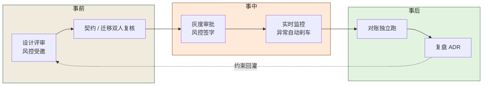
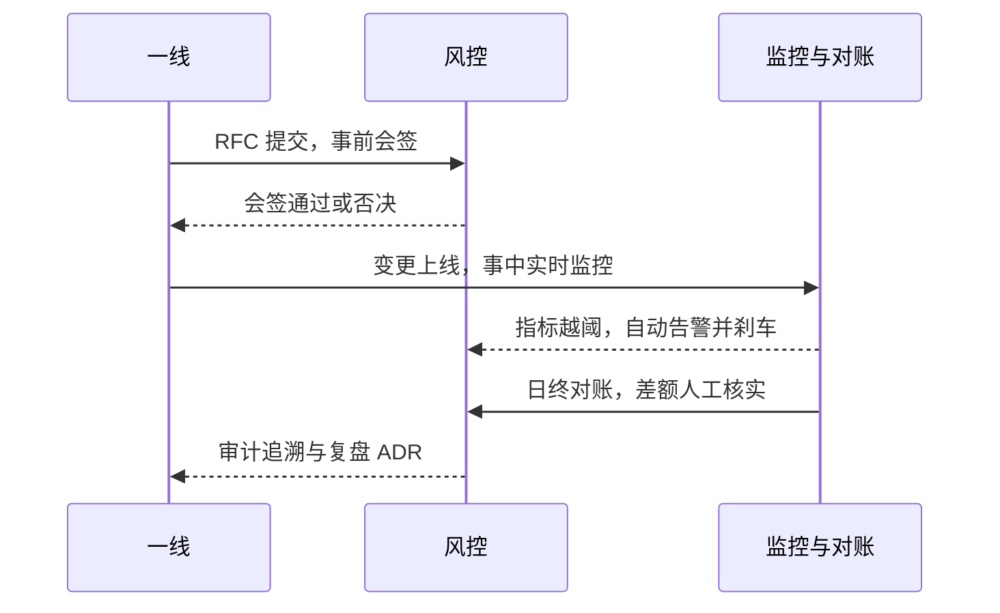
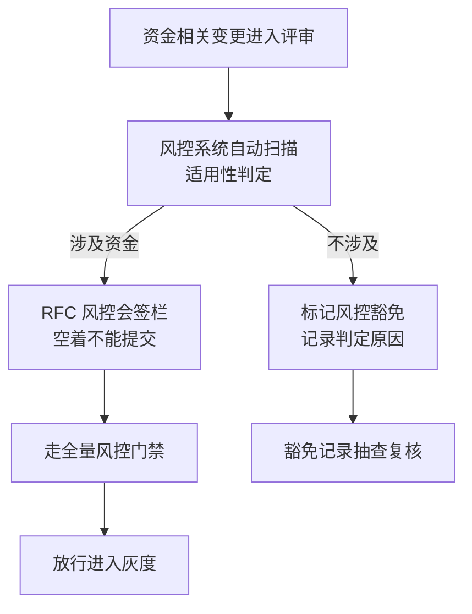
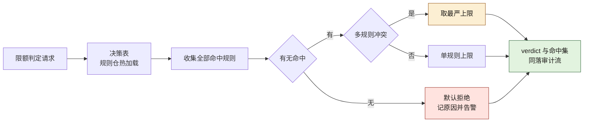
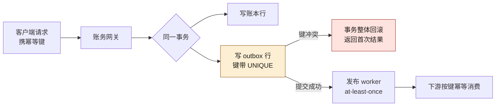

# 第 20 章 风控不可绕过：事前、事中、事后

> **本章定位**：风控接入规范化——从"事后审计"升级为"事前、事中、事后三层防线"。
> **核心命题**：风控必须在事前接入设计、事中监控、事后对账，三者缺一不可；AI 让代码生成变快，于是"风控有没有被邀请"必须从"建议"升级为"不可绕过的强制"。



**图 20-1｜风控三道防线** — 风控不是事后审计角色；设计阶段没被邀请就是流程失败。

---

## 20.1 问题：一次事故的复盘会上，风控负责人说"风控根本没被邀请"

那次支付对账事故的复盘会，是参与过的人记忆里最沉默的一次会。

SRE 负责人先讲了事故经过——对账差额累积、告警晚到、回滚 3.5 小时。然后风控负责人发言，只有一句话：

> "这次迁移，从设计到上线，**风控根本没被邀请参与。** 迁移脚本是 AI 生成的，审的人只看了'能不能跑'，没有一个人问过'这笔钱对不对'。等风控知道出了事，已经是告警响了 11 分钟之后。"

每一个字都是事实。那笔迁移从提案到上线，经过了软件层门禁（代码能跑）、数据层门禁（DBA 签了字），**但从来没有过风控层**——因为当时的风控接入是"可选的"，资金相关的变更"建议"通知风控。**建议 = 没通知。**

那天会后，风控负责人留下了一句话，后来被写进了治理章程：

> "风控不能是'你们想起来就叫一下我'。它必须是'你想不想要，我都会在场'。"

---

## 20.2 根因：风控是事后审计，不是事前介入

**① 风控被当成"出事之后才需要的角色"。** 大多数团队对风控的理解是"出了问题找风控"，而不是"做之前先问风控"。**这种理解让风控永远晚一步——等风控介入，钱已经错了。**

**② AI 生成代码时完全没有风控意识。** AI 不知道"这段迁移涉及资金""这个接口改动会影响对账"——它的上下文里没有风控规则。**如果人也不主动把风控拉进来，那整条链路上没有任何一个环节在"看钱"。**

**③ 风控介入是"建议"而不是"强制"。** 这是最根本的——只要风控介入可以被跳过，赶时间的人一定会跳过。那场事故不是因为有人恶意绕过风控，是因为"风控介入"这件事没有被做成不可绕过的强制环节。

---

## 20.3 事前、事中、事后：三层防线

风控被重新定义为三层防线，**三层都必须存在，缺任何一层就是裸奔**：

**事前 · 设计阶段。**
- 资金相关的任何变更，设计阶段必须通知风控。
- 风控审查"这个变更是否影响资金完整性、是否有对账风险"。
- **强制手段：资金相关变更的 RFC 必须有风控会签栏，空着不让提交。**

**事中 · 运行阶段。**
- 关键资金指标（对账差额、异常交易率）实时监控。
- 超过阈值自动告警 + 自动触发限流或熔断。
- **强制手段：资金指标接入实时告警，告警延迟 < 5 分钟。**

**事后 · 审计阶段。**
- 每日对账：系统自动对账，差额 > 0 必须人工核实。
- 审计追溯：每笔资金变动可追溯到来源 PR 和审批人。
- **强制手段：日终对账不过关，次日业务暂停上线。**

**三层的顺序很重要：事前拦不住的，事中要发现；事中发现不了的，事后要对账。** 那次对账事故的问题是三层全失守——事前风控没被邀请、事中告警晚了 11 分钟、事后对账差额已经累计到 ¥86 万才发现。**三层防线要一起建，不能只建事后。** 图 20-1 沿实线链从"设计评审风控受邀"一路走到"复盘 ADR"，但全图唯一的虚线是反方向的"约束回灌"：复盘的结论要喂回设计评审。第 20.1 节那次事故断掉的不只是这条链的第一环，是这个环本身。

把三层防线放到一次资金变更的完整时间线上，三道闸的接力关系一目了然：



**图 20-2｜三层防线的完整时序** — 事前会签、事中刹车、事后对账是同一条时间线上的三道闸；任何一层失守，下一层就是最后的兜底——三层一起建，才算防线。

图 20-2 把上一节三段落的强制手段钉在时间轴上：第一道闸在 DEV→RK 的 RFC 提交处，第二道闸在 OPS→RK 的越阈告警处——刹车这个动作由机器执行、人只负责确认，第三道闸在日终对账后最后一条回到一线的审计追溯。

---

## 20.4 AI 用法：AI 不碰风控决策，但可以做风控的"眼睛"

风控环节里，AI 的位置很克制：

**AI 可以做的：**
- 辅助生成对账脚本和差额检测规则
- 辅助识别异常交易模式（给风控团队提供候选，人确认）
- 辅助审计追溯（从一笔资金变动反查到 PR 和审批链）

**AI 绝对不能做的：**
- **判定"这笔交易是否允许"。** 这是风控的核心决策，涉及资金安全，必须人做或确定性的规则引擎做，不能由概率性的 AI 做。
- **设定风控阈值。** "对账差额多少算异常"是风控的业务判断，不是 AI 从数据里推断的。

风控负责人的一句话终结了所有关于"能不能让 AI 做风控"的讨论："风控出错的时候，用户不会找 AI，会找我。所以这个决策，必须在我手里。"

---

## 20.5 角色博弈：风控介入的成本谁来担

风控全量介入后，资金相关的变更周期明显变长——因为多了"风控会签"这一步。

一线的反馈："以前一个资金相关的修复，半天能上线；现在等风控会签，最快也要一天半。"

风控负责人的回应很直接："那次事故多拖的 3.5 小时，你们觉得半天和一天半哪个贵？"

**这不是一个能靠讲道理赢的争论——一线的 KPI 是速度，风控的 KPI 是零损失。两者的代价不在同一个度量衡上。** 最终的解决方案是第 19 章提到的"适用性判定"——风控自动判定变更是否涉及资金，不涉及的不走风控会签，涉及的必须走。**这让非资金的变更不受影响，资金的变更必须等风控。**

把「适用性判定」画成流程，关键是豁免权在系统手里，不在一线手里：



**图 20-3｜风控适用性判定** — 「涉不涉及资金」由风控系统判定并留痕，一线不能自我声明豁免；被豁免的记录还要接受抽查复核——豁免通道本身也是被治理的对象。

图 20-3 的两条分支终点不同，判据就在终点里：涉及资金的分支，会签栏从"空"变"签"之后才有通往放行灰度的边；不涉及的分支走到抽查复核就止步，不再并回主流程——豁免是终结状态，不是另一条捷径。

> **代价声明**：风控全量介入后，资金相关变更的平均周期从 0.5 天延长到 1.5 天。**这笔时间成本的受益者是"不会再出现同类事故"，付出者是"所有做资金相关变更的一线"。** 风控负责人说："我没有办法让你们快，我只能让你们安全。你们选哪个？"

---

## 20.6 产出物：风控接入规范

1. **三层防线标准**：事前会签、事中监控、事后对账，各自的触发条件、责任人、时限。
2. **资金变更识别规则**：什么样的变更被判定为"资金相关"，走风控全量流程。
3. **对账体系**：日终自动对账 + 差额人工核实 + 审计追溯链。

> **代价声明**：风控接入规范最大的代价不是时间，是"**风控团队本身的承载力**"——更多的会签、更多的监控、更多的对账，都需要风控团队投入人力。事故之后，风控团队从 5 人扩到了 8 人——决策层的判断是"这 3 个人头的钱，是从'可能再出一次同类事故'的预算里省出来的"。

---

## 20.6b 控制点在哪：一次"没绕过"的尝试

会签栏只能保证"提交时有人看过"，挡不住"提交之后换条路"。风控接入规范发布后的第三周，就发生了这样一次未遂：

- **16:40** 一线工程师提交一个商户余额修正变更。RFC 风控会签栏已填——规范要求填了才能提交——但风控当日排队，没签。
- **18:20** 距当日截单还有一小时，一线找到运维，问"能不能用脚本直接调账务接口把这笔改了，明天补会签"。运维没答应——不是流程提醒了他，是他想起同事曾在账务库上手工改数，次晨被对账系统揪出。这条"抄近路"的念头死在了个人记忆里。**靠记忆的防线，换一批人就没了。**
- **次日 09:10** 风控完成会签，变更走正常链路上线，无事发生。

真正的结论是：**如果当晚运维敲了回车，那次余额变更会经过谁？答案是没有任何一个控制点。** 事后的复盘没有处分任何人，而是回答了另一个问题——"余额写入"这个动作，在系统里到底有几个入口？查下来：账务服务接口 1 个、内部报表服务带写接口 1 个、运维工具箱脚本 2 个、从库切主库的应急直连 1 个。**五个入口，会签栏只守住了一个。**

从这以后，风控接入规范的措辞从"必须通知风控"改成了：**凡能改余额的进程，出口必须收敛到唯一账务网关，网关之外没有写权限。** 控制从"每个调用方的自觉"变成"唯一闸门的强制"。

---

## 20.6c 可抄工件：唯一闸门的规则文件与绕过日志

规则文件进风控系统仓库，由风控发布，网关启动时加载。**一份写在共享文档里的规范不是控制，一份被运行时加载的配置才是。**

```yaml
# risk-control-gate.yml —— 余额写入口唯一化规则（示意，字段名替换为你系统的）
choke_point:
  service: ledger-gateway
  api: /internal/ledger/adjust
  require_on_every_write:
    - risk_signoff_id      # 事前会签记录号，风控系统签发，一次性，用过即废
    - dual_review_id       # 双人复核记录号
  on_missing_or_invalid: reject(403) + alert(risk-on-duty)   # 拒绝，同时叫醒值班风控
  exemption: none          # 熔断与应急也不例外：走一次性限时应急签，事后 24 小时内复核
                             # （24 小时是经验阈值，用于起手，不是标准）
entry_convergence:
  ledger_db: 只授予 ledger-gateway 写权限，其余账号一律降为只读
  batch_migration: 必须复用上述 API 且带 risk_signoff_id
  ops_toolbox: 禁止直连账务库
audit_stream:
  每一条余额写入与每一次被拒尝试，带 risk_signoff_id 落不可变日志
```

下面是闸门真实拦住一次未遂绕过的日志（示意）：

```text
16:22:07 ledger.access  service=ops-tool  path=/internal/ledger/adjust  risk_signoff_id=<missing>                action=reject(403)
16:22:09 risk.alert     channel=sms      target=risk-on-duty            reason=unsigned-write-attempt              count=1/10min
16:31:44 ledger.access  service=ops-tool  path=/internal/ledger/adjust  risk_signoff_id=RK-2025-0917-XXXX          action=reject(403)  reason=signoff-not-found
16:31:45 risk.alert     channel=sms      target=risk-on-duty            reason=forged-or-stale-signoff             escalated=committee
```

日志读法就两条：**被拒尝试必须出现在风控的告警里**——被拒不告警，等于这次尝试从未发生；**带号但号查无此据**，说明有人在复用或编造会签号，这比不带号更值得升级——它是有意的绕过，处置走第 20.5 节的角色博弈，不留给网关管理员个人判断。

---

## 20.6d 度量与反例：闸门怎么知道自己还活着

| 指标 | 怎么测 | 阈值 | 谁看 | 多久看一次 |
|------|--------|------|------|-----------|
| 闸门外余额写入数 | 账务库写入账号清单 vs 网关白名单求差集 | 必须为零（这是架构事实，不是努力方向） | 风控 + DBA | 月 |
| 未签尝试次数 | 网关 403 拒绝计数 | 长期为零要警惕：不是没人想绕，就是日志没接告警 | 风控 | 周 |
| 会签号一次性使用率 | 被使用超过一次的会签号数量 | 必须为零 | 风控 | 周 |
| 应急签过期未复核数 | 超 24 小时仍挂着的一次性应急签 | 必须为零 | 风控 + 治理委员会 | 周 |
| 豁免误判率 | 抽查"不涉及资金"的豁免记录，看是否真不涉及 | 经验阈值：抽查发现率超过一成即重训判定规则——这条线是拍的，用于起手，不是标准 | 风控 | 月 |

**闸门最常见的死法不是被攻破，是被合法旁路。** 大促前夜，值班群里一句"先直连把这笔平了，明早补会签"，没人愿意为"明早"负责——绕过一次没出事，第二次就有人主动提。所以**应急通道必须同样过闸门，只是签发更快、有效期更短**。"临时通道不走风控"的每一个例外，都是下一个 D-0114 的伏笔。

第二个反例：**规则文件没人当它是代码。** 风控改一行 YAML、提 PR 自己 merge，没有任何复核——**风控自己成了唯一不受门禁的角色**。会签栏管不住写网关的人，就永远管不住想绕网关的人。风控规则的变更必须吃本章自己开出的药：双人复核、版本留痕。

---

## 20.6e 限额判定：决策表与规则 DSL 的可抄形状

前面几节一直在说「限额走网关」，这一节回答两个更硬的问题：**规则长什么样，判定怎么执行。** 组织要把限额做成外置规则表，因为限额是风控规则里改动频率最高的一种——写死在代码里，改一条规则就是一次发版，而发版就把绕过诱因带了回来：深夜赶那「只改一行限额」的人，最容易想起 20.6b 那晚的「明天补会签」。做成规则表之后，改规则是一次**被门禁的数据变更**：双人复核、版本留痕、回放审计，本章已有的机器全都能直接套上去。

判定引擎从零建起有三条铁律，少一条都会静默失效：

1. **冲突时取最严**：一次请求命中多条规则时，生效上限取命中规则里的最小 ceiling。放宽规则永远救不回被严格规则收紧的请求——放宽的唯一合法路径是「把严格规则删掉」，而那个删除本身走双人复核。
2. **无命中默认拒绝**：请求匹配不到任何规则（新维度、未知渠道）本身就是异常，fail-closed 的代价是多拦一次，fail-open 的代价是钱。
3. **判定结果全量落审计**：命中规则集合、生效上限、动作，三件一起进不可变日志——回放时必须能回答「当时为什么放行这一笔」。

规则表的可抄形状（示意 DSL，按规范口径书写，字段名替换为你系统的）：

```yaml
# limits.d/*.yaml —— 网关加载的规则表；每条规则一个具名 owner，与第 9 章契约 Owner 同纪律
- rule: BASE-KNOWN
  when: { merchant_tier: [A, B], channel: [app, web] }
  ceiling_cents: 200000        # 金额一律整数分；「元/分」单位漂移是限额静默绕过的经典来源
  on_exceed: review            # 三档动作：pass / review（转人工）/ reject
  owner: 风控值班组
- rule: NEW-MERCH-30D
  when: { merchant_age_days_max: 30 }
  ceiling_cents: 50000
  on_exceed: reject            # 新商户走最严档：即使同时命中更宽的档位规则
  owner: 风控值班组
```

配套的 40 行最小判定器，**本机实跑（Python 3.14）**，示例金额一律以分为单位的整数：

```python
LIMIT_RULES = [   # 规则表：数据，不是代码
    {"rule": "BASE-KNOWN",   "when": {"tier_in": ["A", "B"], "channel_in": ["app", "web"]},
     "ceiling_cents": 2000_00, "on_exceed": "review"},
    {"rule": "TIER-A-RAISE", "when": {"merchant_tier": "A"},
     "ceiling_cents": 8000_00, "on_exceed": "review"},
    {"rule": "NEW-MERCH-30D","when": {"merchant_age_max": 30},
     "ceiling_cents": 500_00,  "on_exceed": "reject"},   # 最严的一条，示例：500 元
    {"rule": "EMAIL-CHANNEL","when": {"channel": "email"},
     "ceiling_cents": 1000_00, "on_exceed": "review"},
]
def matched(rule, req):
    w = rule.get("when", {})
    if "merchant_tier" in w and req.get("merchant_tier") != w["merchant_tier"]: return False
    if "tier_in" in w and req.get("merchant_tier") not in w["tier_in"]: return False
    if "channel_in" in w and req.get("channel") not in w["channel_in"]: return False
    if "merchant_age_max" in w and not (0 <= req.get("merchant_age_days", -1) <= w["merchant_age_max"]): return False
    if "channel" in w and req.get("channel") != w["channel"]: return False
    return True
def decide(req):
    hits = [r for r in LIMIT_RULES if matched(r, req)]
    if not hits:
        return "DENY", "no-rule-matched: default-deny"       # 铁律二：无命中 = 拒绝
    s = min(hits, key=lambda r: r["ceiling_cents"])          # 铁律一：冲突取最严
    tag = "+".join(r["rule"] for r in hits)
    if req["amount_cents"] <= s["ceiling_cents"]:
        return "PASS", f"hits={tag} ceiling={s['ceiling_cents']}"
    return s["on_exceed"].upper(), f"hits={tag} ceiling={s['ceiling_cents']} amount={req['amount_cents']}"
```

四条样例请求的真实读数（本机实跑）：

```text
r1 常规商户     ->  PASS   | hits=BASE-KNOWN ceiling=200000
r2 新商户+邮件  ->  REJECT | hits=TIER-A-RAISE+NEW-MERCH-30D+EMAIL-CHANNEL ceiling=50000 amount=80000
r3 未知渠道     ->  DENY   | no-rule-matched: default-deny
r4 A档老商户    ->  REVIEW | hits=BASE-KNOWN+TIER-A-RAISE ceiling=200000 amount=600000
```

四条读数正好各对一个主张：r2 是取最严——`TIER-A-RAISE` 给了 800000，`NEW-MERCH-30D` 只给 50000，判决归后者；r3 是默认拒绝——金额不大，但 `fax` 这个渠道没人声明过，引擎不替风控猜；r4 是「放宽规则救不了你」——命中 A 档放宽照样按 BASE 上限转人工。图 20-4 把这三条铁律画成判定的骨架：三条分支各有各的出口，但出口都汇进同一条审计流。



**图 20-4｜限额判定流水线** — 决策表热加载、冲突取最严、无命中默认拒绝；三条分支的出口都汇进同一条审计流，判定不落痕等于没判定。

这套东西的三个静默失效面，第二个最常见：

- **规则表只在启动时加载。** 配置是新的、行为是旧的——改了规则没重启网关，线上还按旧表判，日志上一切表现为「规则不生效」。对策：网关把已加载规则表的版本号暴露成指标，风控控制台并排显示「期望版本 / 运行版本」，两数不一致即告警。
- **判定异常被吞。** 规则表达式求值出错，被外层 try/except 吞掉后走了默认放行——fail-open 藏在错误处理里，不在规则里。判定必须 fail-closed：任何求值失败的请求按 DENY 记录并告警。
- **精度与单位。** 金额用浮点存，`200000` 分与 `2000.00` 元在边界上差一个最小单位就是静默放行；单位写进规则字段名（`ceiling_cents`），不靠注释和约定。

---

## 20.6f 钥匙的保管：KMS 与密钥轮换（规范口径，未本机实跑）

20.6c 的日志证明了「会签号经过了校验」，但校验这件事本身凭什么可信？`risk_signoff_id` 是风控系统用它私钥签出来的。**网关防线的强度，等于验证它签名的那把公钥所属体系的强度**——私钥若躺在配置文件、代码仓库或镜像层里，攻击者不需要攻破网关，签一个「合法的」会签号就够了。这一节按规范写机制形状：本机没有 vault 或任何云 KMS 客户端，**以下没有任何一条声称跑过**。

- **签名与验证分离（信封模型）。** 根私钥不出 KMS 边界；网关侧只持有验证公钥或验签能力，签发权留在风控系统内部。这样即使网关整机沦陷，拿到的也只是「能验」不能「能签」。
- **轮换走双活窗口。** 新旧密钥并行一段时间，验证端按密钥标识（kid 一类字段）在公钥集里选，而不是「只认一把当前钥」。轮换的核心不是换上新钥，是**让旧钥如期退休**：没有退休动作的轮换，一年后你会面对十把还都能验签的钥匙，泄露面只增不减。
- **应急吊销。** 私钥疑似泄露时，必须能让所有由它签出的会签号即时作废——这要求校验是实时或近实时查 KMS 公钥集，而不是启动时缓存一份用到重启。「签发后永久有效、只靠过期时间兜」的会签号，泄露时你只能等它过期。

它替代不了什么：KMS 管得住密钥，管不住**授权**——持合法 SVID 的进程配上合法会签号，密码学全程绿灯，而那可能正是一次该拦的批量调整。密钥体系的供应链侧治理（制品签名、密钥与人的绑定）在第 22 章展开，见 [第 22 章](./ch27-第22章-安全合规公开仓库.md)。

---

## 20.6g 调用者是谁：mTLS 与 SPIFFE 身份模型（规范口径，未本机实跑）

会签号回答「这件事被允许了吗」；还有一个同样硬的问题没人回答：**我正在跟谁说话？** 20.6c 日志里的 `service=ops-tool` 若是调用方自报的，日志本身就是可伪造的。20.6b 的结论是五个入口收敛为一个网关，而网关授权的前提是它能独立、不可抵赖地识别调用者——在没有人盯屏的环境里，**工作负载身份就是审计链的地板**。以下按 SPIFFE/SPIRE 与 mTLS 的规范形状书写，本机没有 service mesh，未实跑。

- **身份是一个名字加一张短命证书。** SPIFFE ID 形如 `spiffe://<信任域>/<工作负载路径>`（示意），是工作负载的名字；X509-SVID 是证明「我就是这个名字」的短周期证书，小时级自动轮换。mTLS 在握手期双向出示、互验 SVID，通道身份由平台签发，不来自请求载荷。
- **身份与授权正交，缺一不可。** 只有身份没有授权：任何内部工作负载都能发起余额写入，且「合法身份 + 编造会签号」正是 20.6c 里 `forged-or-stale-signoff` 那条告警的猎物——两个体系交叉才抓得住它：「工作负载 A 带会签号 B」必须同时通过身份验证与授权校验两条线。只有授权没有身份：会签号可以被人肉转发给任何进程执行。
- **网关授权按身份白名单，不按网络地址。** 收敛到唯一网关之后，放行清单列 SVID 而不是 IP——弹性环境里 IP 会漂移，身份不漂。

静默失效面：身份粒度太粗（整个运维工具箱共用一个服务账号，与四人共用一把钥匙同病——审计回溯到「角色」而不是「工作负载」，20.6b 那五个入口的教训重演）；SVID 有效期配得过长，短命身份名存实亡；签发 CA 的私钥归基础设施团队，风控对它既无可见性也无会签位——那就把本章的规矩送回去：CA 的轮换与吊销，按 20.6f 的纪律双人复核。

---

## 20.6h 双人复核写成判定式

20.3 的强制手段里有「双人复核」，20.6d 的反例又要求风控规则自己也得过双人复核。要让它不可绕过，得把「两个人」从表单上的两个签名变成机器可判的谓词：

**存在两笔签名 a、b：role(a)=propose ∧ role(b)=approve ∧ person(a) ≠ person(b)。**

关键词是 `person`，不是 `account`——整个难点就在这一格上。**「两把钥匙同一人」为什么能发生：** 系统看到的从来只有账号，而账号从来不是人。一个人可以持有多个账号（主账号加镜像、个人加测试邮箱），账号可以外借（值班室里替同事点一下 approve 是高频场景），服务账号更把人机边界抹平。只要复核权限按「账号 + 角色表」授权而不是「唯一 person id」授权，这个谓词就能被廉价满足——**账号是攻击面，person 才是问责单位；谓词只查账号，绕过的成本就是注册第二个账号。**

机检要点：`person_id` 必须取自独立身份源（SSO / HR 目录，与 20.6g 的工作负载身份同源），**绝不取自请求载荷**——载荷里写什么都行。谓词形状的判定器**本机实跑（Python 3.14）**，`person_of` 即身份源的查询替身：

```python
def dual_review_ok(signs, person_of):
    """signs: [(账号, 角色)]；person_of: 账号 -> 唯一 person id（取自 SSO，不取自载荷）"""
    need = {"propose", "approve"}
    got = {role for _, role in signs}
    if not need <= got:
        return False, f"missing-role: {sorted(need - got)}"
    persons = {person_of.get(acct, "unknown") for acct, _ in signs}
    if len(persons) < 2:
        return False, f"same-person: {persons.pop()}"          # 两把钥匙、同一个人
    return True, f"persons={sorted(persons)}"
```

```text
c1 正常双人    ->  (True, "persons=['person-07', 'person-19']")
c2 同账号双签  ->  (False, 'same-person: person-07')
c3 一人两账号  ->  (False, 'same-person: person-07')
c4 缺复核角色  ->  (False, "missing-role: ['approve']")
```

c3 就是「两把钥匙同一人」的现形记：两个不同账号，同一个 `person-07`，谓词把它当一次签名。**机检也查不住的一种情况**：账号确实是两个自然人，但复核人没看 diff 就签（人借了登录态，也借了注意力）——那一格归流程：复核窗口绑定变更 diff 快照、时限否决（第 26 章委员会机制），机器负责「必须是两个人」，不负责「第二个人睁着眼」。

---

## 20.6i 事务 outbox + 幂等键：让重复提交失败

网关超时不等于请求没执行。资金写入链路上任何一次重试都在回答同一个问题：**同一个请求提交三次，余额应该动几次？** 答案必须是「一次」，而实现不能靠「先查后写」——并发下查与写之间有竞态窗口，两个重试可以同时通过「还没执行过」的检查。正确的形状是把裁决交给数据库的**唯一约束**，再让账本行与「要通知下游」的意图在**同一事务**里原子落库：

- 账本行：钱真的动了；
- outbox 行：这笔变动的下游通知意图，键上带 UNIQUE 约束；
- 第二次提交撞键 → 约束报错 → 事务整体回滚，账本一行都不多。

**本机实跑**（经 Python 的 `sqlite3` 模块——本机没有 `sqlite3` 命令行客户端，引擎版本读数 3.46.1；示例键值为占位）：

```python
import sqlite3
con = sqlite3.connect(":memory:")
con.executescript("""
CREATE TABLE ledger_entry (account TEXT NOT NULL, amount_cents INTEGER NOT NULL);
CREATE TABLE payment_outbox (
  idem_key TEXT NOT NULL PRIMARY KEY,          -- UNIQUE 约束：重复提交的机检点
  payload  TEXT NOT NULL,
  status   TEXT NOT NULL DEFAULT 'pending'
);
""")
def submit(idem_key, account, amount_cents):
    try:
        with con:                               # 账本行 + outbox 行：同一事务，原子
            con.execute("INSERT INTO payment_outbox (idem_key, payload) VALUES (?, ?)",
                        (idem_key, f"pay:{account}:{amount_cents}"))
            con.execute("INSERT INTO ledger_entry (account, amount_cents) VALUES (?, ?)",
                        (account, amount_cents))
        return "APPLIED"
    except sqlite3.IntegrityError as e:
        return f"DUPLICATE-REJECTED ({e})"      # 第二次：约束报错，事务整体回滚
```

```text
第一次提交: APPLIED
原样重放  : DUPLICATE-REJECTED (UNIQUE constraint failed: payment_outbox.idem_key)
换键新请求: APPLIED
账本行数  : 2
outbox 行数: 2
余额(分)  : 17600
```

读数怎么讲：三次提交、两行账本（17600 = 2 × 8800），重放那一次被数据库约束原话顶回——括号里就是真实报错原文，不是代码逻辑判断的结果。**工程口径补一句**：生产网关不该把这异常抛给调用方，撞键的正确响应是「返回首次执行结果」（对客户端而言重试与查询等价）；约束是机检点，不是客户体验。换键的第三笔是真新请求，照常生效——键识别的是「同一件事」，不是「同一账户」。

outbox 的后半段是发布 worker 扫 `status=pending` 行向下游投递、投递成功后置 `sent`——worker 崩在投递之后、置位之前，重启必然重发，所以下游消费是 at-least-once，**下游也必须按同一个键做幂等**。键要一路穿透，「业务效果至多一次」才在整条链上成立；第 16 章聊天域对消息序用的是同一条纪律（见 [第 16 章](./ch21-第16章-聊天功能.md)）。图 20-5 是这条链：



**图 20-5｜outbox + 幂等键的重放防线** — 账本行与 outbox 行同事务落库，UNIQUE 键是重复提交的机检点；worker 只管 at-least-once 投递，「至多一次」由一路穿透的幂等键兜住。

三个静默失效面：

- **幂等键由调用方生成且寿命太长。** 拿「当天批次号」当键，同一批次内的第二笔合法请求就被静默吞掉——比重复扣款更隐蔽。键应绑定请求语义（内容哈希 + 时间前缀），且**同键不同载荷必须可校验拒绝**：撞键时比对 payload，不同则报警而不是返回首次结果。
- **UNIQUE 建了，两笔写不在同一事务。** 账本写成功、outbox 写失败，重试时账本已有一行而键是新的——双倍生效。原子性靠事务，不靠「先写 outbox 再写账本」的顺序自觉。
- **键到下游就断了。** 网关幂等、下游不幂等，at-least-once 在链尾照样双倍生效。对账（第 21 章，见 [第 21 章](./ch26-第21章-对账灰度回滚监控.md)）是这条链最后的照妖镜。

---

## 20.7 四案例映射

| 案例 | 风控介入的关键节点 | 三层防线侧重 | 典型风险类型 |
|------|-------------------|------------|------------|
| 案例一·电商平台 | 支付对账迁移、限额规则变更 | 事后对账为主，事前会签补齐 | 数据层漏字段导致资金差额 |
| 案例二·加密交易所 | 充提转链路、冷热钱包调度 | 事中监控为主，事前会签为重 | 提现延迟、地址白名单缺失 |
| 案例三·Web3 量化 | 合约部署、策略参数调整 | 事前会签为主，事后审计为辅 | 策略异常导致持仓敞口失控 |
| 案例四·安全初创 | 数据合规、客户数据处理 | 事前会签与事后审计并重 | 合规边界外扩、敏感数据处理 |

---

## 20.8 检查清单

- [ ] 你的风控是事前介入还是事后救火？事后 = 已经晚了。
- [ ] 资金相关的变更，风控有没有强制会签？没有 = 对账事故在等你。
- [ ] 你有没有实时资金指标监控？告警延迟多久？>5 分钟 = 同类事故重演。
- [ ] 你有日终对账吗？没有 = 差额可能滚了好几天才发现。
- [ ] 你的风控阈值是业务定的还是 AI 推断的？AI 推断 = 风控负责人会反对。

---

## 20.9 遗留问题

- **风控团队会不会成为瓶颈？** 全量介入后，风控团队确实成了资金相关变更的瓶颈。这个问题在第 26 章的委员会机制里被部分缓解（时限否决——风控必须在 X 天内回应，否则视为同意）。**但风控团队的人力扩张是必然的，治理不能只加流程不加人。**
- **AI 辅助识别异常交易的准确率够不够？** 已有的尝试中，AI 的异常交易候选有约 30% 是误报。**30% 的误报意味着风控团队要花额外时间排除误报。** 准确率的提升留给第 24 章。
- **风控规范会不会过度？** 这条线永远在拉锯——风控强一度，效率降一分。**没有"恰到好处"，只有"当前的平衡点"。** 这个平衡点需要定期复盘调整。

---

> **本章的一句话**：风控最怕的不是"出事了风控没做好"，而是"**出事的时候才发现风控根本不在场**"。风控不是事故后的审计员，它必须在设计的第一天就在桌边。AI 让代码生成变快了，于是"风控有没有被邀请"这件事，必须从"建议"升级为"不可绕过的强制"——否则你生成得越快，错得就越快。
