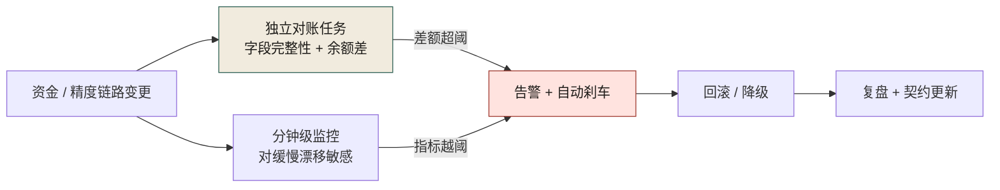
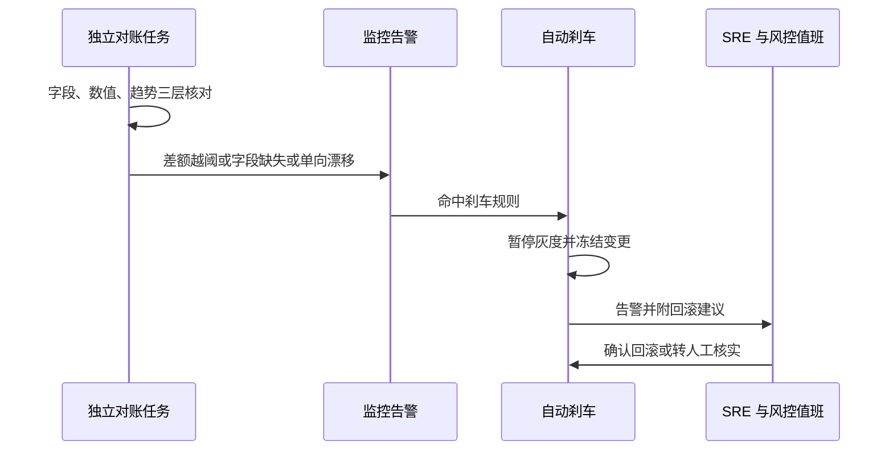
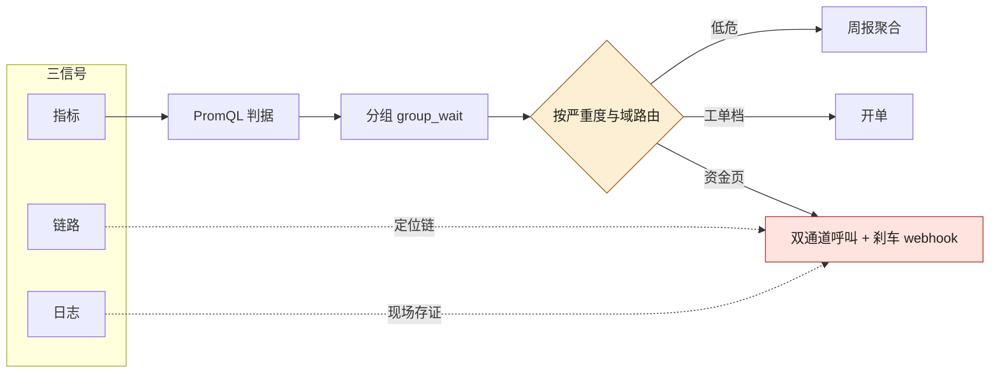
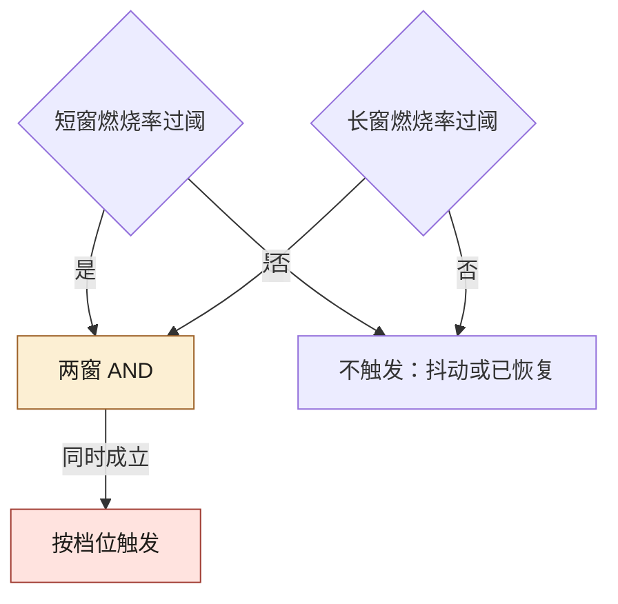
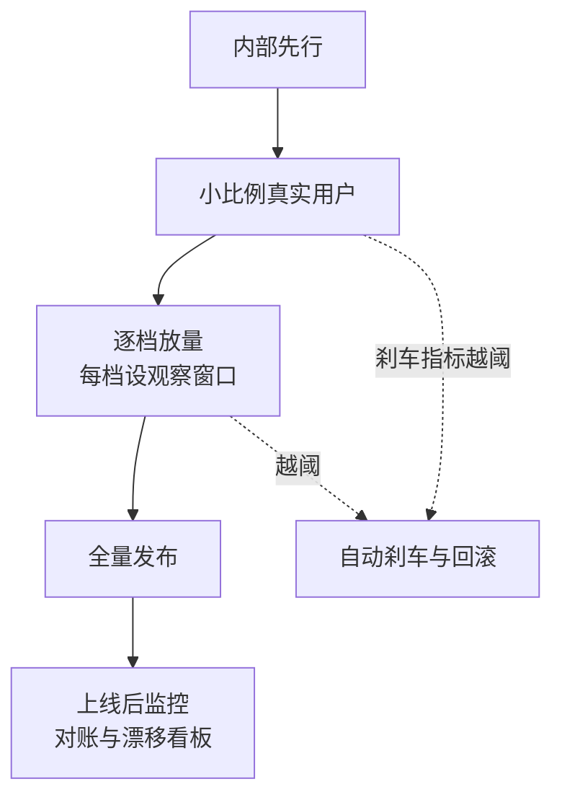

# 第 21 章 对账、灰度、回滚、监控

> **本章定位**：上线体系的总览章；灰度/回滚的细节已在第 28 章深入，本章补充对账与监控两条防线。
> **核心命题**：对账是资金系统的生命线；监控覆盖"AI 可能引入的盲区"。两者都必须从"事后发现"前置为"实时感知"。



**图 21-1｜对账与监控闭环** — 对账必须独立于发布链路；只对「有的字段」算差额会漏掉字段级事故。

---

## 21.1 问题：那次事故当天，对账和监控同时失明

那次对账事故的复盘结论里，有一句话被反复引用："**那天晚上，对账系统和监控系统同时失明。**"

对账失明：迁移脚本漏了字段，但对账系统没有"字段完整性检查"——它只对"有的字段"算差额，漏掉的字段它压根不知道该对。于是差额在悄悄积累，对账系统说"正常"。

监控失明：告警阈值是按"历史正常波动"设的，而这次的差额增长虽然异常，但初期幅度没超阈值——**监控系统的阈值是均值导向的，它对"缓慢但持续的增长"天然不敏感。**

两个系统同时失明的结果是：**从迁移上线到告警响起，过了 47 分钟。** 这 47 分钟里差额从 0 累计到了 ¥86 万。图 21-1 是修好之后这两条路的地图：资金/精度链路变更并行伸出两条边，一条进"字段完整性 + 余额差"的独立对账，一条进"对缓慢漂移敏感"的分钟级监控，两条边都必须汇进同一个告警与刹车节点才走得到回滚与复盘——并行的两条边，各自对准的正是上面两种失明。

---

## 21.2 根因：对账和监控都在"事后"工作，且都有盲区

**① 对账只查"已有的东西"。** 传统对账是"两边数据对不对得上"。但如果一边的数据根本没产生（字段漏了），对账无从对起。**对账需要"预期完整性检查"——不只对数值，还要对"应该有的字段有没有缺失"。**

**② 监控阈值是均值导向的。** 绝大多数告警阈值是"历史 P99 的 N 倍"。这对突发尖峰有效，但对"温水煮青蛙式的缓慢漂移"无效。**那次对账事故的差额增长就是缓慢漂移——每个时间点的增幅都不大，但持续累积就成了灾难。**

**③ AI 生成的代码引入了新的监控盲区。** AI 生成的迁移脚本、配置、规则，它们的行为模式可能和人工写的不一样——但监控的基线是按人工代码的行为建立的。**AI 的输出偏离了监控的"正常基线"，但偏离得不够大，没触发告警。**

---

## 21.3 对账：资金系统的生命线

对账不是"可选的验证步骤"，它是资金系统的生命线。**一个不做对账的资金系统，不是"可能有错"，而是"一定有错但你不知道"。**

对账体系被升级为三层：

**① 字段完整性对账（事故后新增）。** 对账不只对数值，先检查"两边应该有的字段是否都在"。缺任何一个，立刻告警。**这一层专门防"漏字段"式的事故。**

**② 数值精确对账。** 两边对应字段的值必须精确相等（金额领域不存在"近似"）。差额 > 0 立刻标记。

**③ 趋势对账（事故后新增）。** 即使当前差额为 0，如果"过去 30 分钟的差额变化趋势"异常（比如持续单向小额漂移），也触发预警。**这一层专门防"温水煮青蛙"。**

三层对账的产出不只是一份报表，它直接驱动刹车。把「对账不平」到「自动刹车」的链路画成时序，就能看到黄金时间花在哪里：



**图 21-2｜对账不平到自动刹车** — 对账必须独立于发布链路：差额越阈先冻结再找人，黄金时间花在止损上，而不是花在「要不要先开会」上。

图 21-2 的第一条消息就是"独立"的自证：REC 在自己泳道内完成字段、数值、趋势三层核对，越阈、缺字段或单向漂移三种情况任一发生才上报监控；冻结灰度的动作由刹车在值班介入之前自己完成，轮到 SRE 与风控值班时，选项只剩"确认回滚"或"转人工核实"。

### 可抄 SQL：三层对账的最小骨架

```sql
-- 三层对账最小骨架（表名与字段均为占位，按业务替换）
-- 第一层：字段完整性——先对「应该有的字段」，再对数值
SELECT 'field_integrity' AS layer, COUNT(*) AS bad_rows
FROM order_payment o
JOIN payment_ledger p ON p.order_id = o.order_id
WHERE p.refund_amount IS NULL          -- 为什么先查缺失：漏字段的事故对账系统「看不见」
  AND o.has_refund = 1;

-- 第二层：数值精确——金额领域不存在「近似相等」
SELECT 'amount_diff' AS layer, COUNT(*) AS bad_rows
FROM order_payment o
JOIN payment_ledger p ON p.order_id = o.order_id
WHERE ABS(o.pay_amount - p.pay_amount) > 0;   -- 差额大于零即标记，不设容差

-- 第三层：趋势——当前差额为零也可能在「温水煮青蛙」
SELECT 'drift' AS layer, direction, COUNT(*) AS streak
FROM recon_diff_minute
WHERE ts >= now() - interval '30 minutes'     -- 连续同号小额漂移，比绝对阈值更早报警
GROUP BY direction;
```

### 落地步骤：三层对账从零接入

1. **先补「应有什么」**：与业务 Owner 一起列资金链路两侧的字段清单，入契约仓库——没有清单，完整性对账无从谈起。
2. **第一层先上线**：字段完整性对账独立部署、独立告警，不挂在发布流水线里。
3. **第二层接数值**：精确相等口径，差额大于零即标记人工核实。
4. **第三层加趋势**：分钟级差额快照落表，配单向漂移告警。
5. **刹车接进灰度**：对账告警进第 28 章的自动刹车指标清单，告警即冻结。
6. **runbook 落地**：用本章值班摘录模板，演练一次「告警到止血」全流程。
7. **对账系统本身也要查**：它也是系统，也会失明——按季度抽查它的告警是否真的会响。

---

## 21.4 监控：覆盖 AI 的盲区

监控系统升级，新增了对"AI 特有风险"的覆盖：

**① 留痕率监控。** 每次 AI 生成的代码上线，监控它的 prompt 留痕是否完整。留痕率下降 = 有人跳过了留痕流程。

**② 契约一致率监控。** 接口和契约仓库的一致率，低于阈值即告警。**这一层防契约漂移式的事故。**

**③ 回滚速度监控（MTTR）。** 从告警到回滚完成的时长，作为 SRE 的核心指标。那次对账事故的 3.5 小时是一个反面基准——目标是把 MTTR 压到 30 分钟以内。

**④ 灰度刹车触发率。** 自动刹车的触发频率——太高说明阈值太敏感，太低说明可能在漏拦。

起步阈值（需按系统调参，不是标准答案）：

| 指标 | 起步建议 | 说明 |
|---|---|---|
| 对账差额 | 业务定义绝对阈值 + 相对阈值 | 只用相对阈值会漏小单大面 |
| 单向漂移 | 连续 N 分钟同号差额 | N 先取 15，再按误报调 |
| 留痕率 | 周环比下降 >10% 告警 | 治理组看趋势，不看单日 |
| MTTR | P50 ≤30min / P95 ≤2h | 写进 SRE 值班 runbook |
| 刹车触发率 | 周均 0–3 次较健康 | 长期 0 可能阈值过松 |

值班摘录模板（事故当晚可直接改）：

```text
1) 确认告警对象与影响面（资金/用户/合规）
2) 先止血：降级 / 冻结 / 回滚按钮权限人是谁
3) 存档现场：镜像、日志、对账快照
4) 通知矩阵：SRE → 风控/合规 → 业务 Owner → 决策层
5) 未获授权前禁止「顺手再改一段」
```

### 可抄配置：监控告警规则

把上面这些监控落到监控系统里，就是一份告警规则。写规则时有一条纪律：**每条告警必须绑定一个动作**——只往群里发消息的告警，等于把「发现」和「止损」之间又塞回了一次人工转述。动作分四档：`brake`（直接刹车）、`freeze_rollout`（冻结灰度）、`block_deploy`（拦下一次发布）、`ticket`（开单跟踪）。

```yaml
# 监控告警规则骨架（指标名、数据源、阈值为占位，按监控系统与业务替换）
rules:
  - name: recon_field_missing        # 字段完整性：缺一个字段就是事故，不是嫌疑
    expr: recon_field_missing_count > 0
    severity: critical
    action: brake                    # 为什么直接刹车：这一层对应那次 47 分钟失明的事故
    notify: [sre, 风控值班]

  - name: recon_amount_diff          # 数值对账：绝对 + 相对双阈值，只用相对会漏「小单大面」
    expr: recon_diff_abs > <ABS_THRESHOLD> or recon_diff_ratio > <RATIO_THRESHOLD>
    severity: critical
    action: brake                    # 金额领域差额只有零和非零，没有「近似正常」
    notify: [sre, 业务Owner]

  - name: recon_one_way_drift        # 单向漂移：连续 15 分钟同号差额（N 起步值，按误报调）
    expr: recon_diff_sign_streak >= 15
    severity: high
    action: freeze_rollout           # 先冻结灰度再查原因——趋势告警的定位是「提前量」
    notify: [sre]

  - name: trace_retention_drop       # 留痕率：周环比降逾 10% 告警，看趋势不看单日
    expr: trace_retention_rate_wow < -0.10
    severity: high
    action: ticket                   # 为什么只开单：这层的病根在流程执行，不在线上代码
    notify: [治理组]

  - name: contract_consistency       # 契约一致率：跌破治理后 97.4% 基线即告警
    expr: contract_consistency_rate < 0.974
    severity: high
    action: block_deploy             # 拦的是下一次发布，不是线上流量
    notify: [sre]

  - name: rollback_mttr_regression   # MTTR：回滚时长变长 = 兜底在悄悄失效
    expr: rollback_mttr_p95 > 2h     # 为什么盯 P95：平均值会把长尾藏掉
    severity: high
    action: ticket
    notify: [sre负责人]
```

维护约定只有一条：**阈值每次调参都留 ADR**——谁改的、依据哪次误报或漏报、改成多少。否则半年后没人说得清「15 分钟」是怎么来的。

### 工具落地卡：上面这份骨架要接进的真系统

案例章里点过名的那套栈（案例一的订单簿缓存与 Kafka 3.6、案例二的 Redis Cluster + Prometheus + Grafana + Sentry，见两章开头的技术栈交代）在本书里一直停在名字。名字不是门禁——这一节把它们补成能抄、能看出成败的形状。

> **取证口径（先说，因为它决定这些行你该信几分）**：下面这几张卡的**版本与输出行逐字引自各项目官方文档或项目源码，本机未安装这些服务、没有复跑**——和第 9 章的 OpenAPI / protoc、第 13 章的 nginx 那三张「装好实跑、连报错串都抄回来」的卡不是同一种证据。文档给的样例输出会随版本漂移，所以每张卡都留了一行「未核实」，那一行就是你自己复跑时要补的空。这恰好是本章反复在说的那件事：**转述过的验证不算验证。**

**Prometheus —— 这份 `rules:` 骨架的真实落点是 `prometheus.yml` 的 `rule_files`**

- **版本口径**：3.x 线。官方 Releases 页把 3.14.0 标为 Latest、3.13.0 标为 Long Term Support；书中案例未写版本。
- **配置落点**：主配置 `prometheus.yml`（官方入门页逐字给出 `--config.file=prometheus.yml`）；告警规则文件经 `rule_files:` 段的**文件路径通配符**挂进来。
- **最小可抄配置**：

```yaml
# prometheus.yml —— 每一行都能在官方 getting started / configuration 页逐字找到
global:
  scrape_interval: 15s          # 官方示例行；schema 缺省是 1m，AI 栈要更快发现端点挂掉
scrape_configs:
  - job_name: 'prometheus'      # 先让它监控自己：链路最短、最快能验证的一根线
    static_configs:
      - targets: ['localhost:9090']
rule_files:                     # 上面那份骨架的落点在这里
  - alerts.yml
```

```yaml
# alerts.yml —— 官方告警规则文档的示例规则，字段集合就是这些
- alert: InstanceDown
  expr: up == 0
  for: 5m                       # 持续 5 分钟才触发：抗抖动
  labels:
    severity: page
```

**这里必须交代一处落差**：21.4 那份骨架里的 `action: brake` / `notify: [sre, 风控值班]` 在 Prometheus 里**不是合法字段**。规则文件只承载 `expr` / `for` / `labels` / `annotations`；「绑什么动作、发给谁」属于 Alertmanager 的 route 树——案例一那套「AlertManager → 飞书机器人 → 值班群」说的就是这一段（本书没有给 Alertmanager 的配置文件，它也不在第 4 章那张"正文点名工具"台账的名单里——那张表按正文实际点名的工具逐条列、逐条标证据档位，所以名单会随正文变，这里刻意不写它是几件）。**从「示意配置」到「能跑的配置」，差的往往就是这一步——把字段交给真正拥有它的组件。** 照抄一份带自造字段的规则，`prometheus` 起不来还是小事，以为门禁存在才是大事。

- **跑完看哪条输出**：`curl http://localhost:9090/api/v1/alerts`——官方 Query API 页的示例响应逐字含有 `"state": "firing"` 与 `"labels": { "alertname": "my-alert" }`。可 grep 的是 `firing` 与 `alertname`；示例里的 `my-alert` 是文档占位名，自己部署时应 grep 规则里写的那条告警名。`state` 的全部取值枚举**未核实**（抓到的示例只出现 `firing`）。
- **它替代不了什么**：`expr` 只能表达「已经埋进指标里的事实」。案例一那 47 分钟失明，缺的是根本没上报的字段，不是没写的规则——监控栈再全也看不见没有信号的东西，这正是第 21.4 节要单独列「字段完整性告警」的理由。

**Grafana —— 面板进仓库的唯一好处，就是它在 UI 里改不动**

- **版本口径**：13.x 线（官方 Releases 当前 Latest v13.2.2）；书中只写「Prometheus + Grafana」。
- **配置落点**：`grafana.ini` 的 `[paths] provisioning` 目录；官方 Docker 部署下该目录固定为 `/etc/grafana/provisioning`。
- **最小可抄配置**（`provisioning/datasources/` 下一个 YAML；结构逐字取自官方 Provisioning 页的示例，把 `type`/`url` 换成自家 Prometheus 地址属同 schema 改写，**非官方逐字的 Prometheus 示例**）：

```yaml
apiVersion: 1
datasources:
  - name: metrics
    type: prometheus
    access: proxy          # 浏览器经后端代理，不直连数据源
    url: http://localhost:9090
```

官方对这类面板有一条行为约束，逐字是：「When you try to save changes to a provisioned dashboard, Grafana brings up a Cannot save provisioned dashboard dialog box.」——**面板以代码形式进仓库，UI 里保存不了。这不是限制，这就是「可回溯」想要的性质**：谁改了曲线，diff 里看得见。

- **跑完看哪条输出**：`curl -s localhost:3000/api/health`——官方 API 参考页的示例响应逐字是 `"database": "ok"`（同段的 `commit` / `version` 值是文档快照，别照抄预期）。数据库故障时返回什么码**未核实**。
- **它替代不了什么**：它保证「人看得见」，拦不住「人看见了不判断」。案例四那晚的曲线就贴在屏上，把事故喊出来的是值班的对讲机，不是面板。

**Redis —— 缓存实例的容量线只有两行，但第三行决定它是缓存还是真相**

- **版本口径**：书中三处写 Redis 7.x Cluster。官方 Releases 显示在维护的是 8.x 各补丁线（8.10.2 为最新，另见 8.2 / 8.4 / 8.6 / 8.8），8.6 起新增 `allkeys-lrm` / `volatile-lrm` 淘汰策略。淘汰策略的键名在 7.x / 8.x 同形，下面三行不随版本变。
- **配置落点**：发行版根目录的 `redis.conf`（官方文档直接给出该文件的链接）；源码部署时官方建议复制成 `/etc/redis/6379.conf`——**以端口命名**，一机多实例就靠这个区分。
- **最小可抄配置**：

```conf
maxmemory 100mb                  # 官方原文示例即「to configure a memory limit of 100 megabytes」
                                 # 不设上限时官方警告它会 (gradually) eat up all your free memory
maxmemory-policy allkeys-lru     # 官方称这是"a good default option if you have no
                                 # reason to prefer any others"——纯缓存的缺省答案
# 同一实例既做缓存又存不可丢状态时，官方建议改成：
# maxmemory-policy noeviction    # 到上限就让写命令直接报 OOM，官方理由是
                                 # "will not render the whole machine dead because of memory starvation"
```

- **跑完看哪条输出**：`redis-cli ping` → 官方文档逐字示例输出 `PONG`。再看两行诊断：`redis-cli INFO memory | grep -E "used_memory_human|maxmemory_policy"` 与 `redis-cli INFO stats | grep evicted_keys`。**字段名**（`used_memory_human`、`maxmemory_policy`、`evicted_keys`、以及命中率用的 `keyspace_hits` / `keyspace_misses`）在官方 INFO 页逐个核实；`key:value` 整行样例输出未见于所抓页面，**这一处要你本地跑一次再落死**。读法：`evicted_keys` 持续上涨 + 命中率下滑 = 容量线正在咬业务线，此时该扩容而不是把阈值调高。
- **它替代不了什么**：这两行只保证一件事——不把机器撑死。它拦不住淘汰策略选错引发的缓存击穿，更拦不住一件更贵的事：**把订单簿当成缓存**。案例二写的是「Redis Cluster 存订单簿和缓存」——同一个实例里，一半数据是可重算的缓存、一半是不可丢的状态，而 `maxmemory-policy` 是实例级的，它分不清这两半。**给这种实例选 `allkeys-lru`，等于把「允许淘汰」写进了撮合状态的生命周期里**，而配置全绿、启动无警告。

**Kafka —— 「不丢」和「不重」是两行必须成对出现的属性**

- **版本口径**：书中写 Kafka 3.6。核实的是 4.1 文档线：`acks` 缺省 `all`、`enable.idempotence` 缺省 `true`。**3.6 线的缺省值本次未核实**——所以别赌版本，显式写出来。
- **配置落点**：broker 端 `config/server.properties`（官方 quickstart 逐字命令 `bin/kafka-server-start.sh config/server.properties`）；可靠性在生产端，靠 producer 属性。经 `--producer.config` 注入 console 工具的用法**未在一手来源核实**。
- **最小可抄配置**（三行键名与缺省值逐字取自官方 4.1 Producer Configs 页）：

```properties
acks=all                    # 官方逐字：leader 会等全量 in-sync 副本确认这条记录，
                            # "This is the strongest available guarantee."（等价于 acks=-1）
enable.idempotence=true     # 官方逐字：producer 会保证流里每条消息只有一份副本；
                            # 且官方注明 "enabling idempotence requires this config value to be 'all'"
                            # —— 两行必须成对；显式开启幂等又配了冲突值时，官方写明抛 ConfigException
retries=<按 delivery.timeout.ms 收敛>   # 官方逐字：请求会重试到成功、遇到非瞬时错误，或 delivery.timeout.ms 到期
                            # 缺省数字本轮未取到读数，别照抄一个"看起来对"的天文数
```

- **跑完看哪条输出**：`bin/kafka-topics.sh --describe --topic quickstart-events --bootstrap-server localhost:9092`，官方 quickstart 页的逐字输出：

```text
Topic: quickstart-events        TopicId: NPmZHyhbR9y00wMglMH2sg PartitionCount: 1       ReplicationFactor: 1      Configs:
Topic: quickstart-events Partition: 0    Leader: 0   Replicas: 0 Isr: 0
```

可 grep 的是 `PartitionCount`、`ReplicationFactor`、`Isr`。**注意这份样例的 `ReplicationFactor: 1` 本身就是坑**：quickstart 的建 topic 命令不带副本因子，单副本时 `acks=all` 形同虚设——全量 in-sync 集合只有一台机器。加副本的 flag 精确拼法未逐字核实，抄的时候以官方建 topic 文档为准。**判据不是「命令没报错」，是「输出里那几个值真的对」。**
- **它替代不了什么**：`acks` + 幂等只保证「不丢、不重」。案例二那 12 万笔精度偏差撮合（台账 X-0719），Kafka 忠实地把污染数据一条不丢、一条不重地送给了下游——**投递可靠性和内容正确性是两条完全独立的线**，这也是本章坚持对账要独立于发布链路的原因（图 21-1 画的就是这条独立性）。

**Sentry —— 案例二那句「Sentry 追踪错误」，判据行只在源码里，文档没有**

> 这张卡本轮从第 4 章台账的 **C 档（不出卡）** 升到了 **B 档**——升档的唯一理由是判据行终于取到了一手出处。取到的位置本身值得记一句：官方文档对 `sentry-cli info` **只给了一句用途说明，没有给任何输出样例**（逐字："To make sure everything works you can run `sentry-cli info` and it should print out some basic information about the Sentry installation you connect to as well as some authentication information."），可 grep 的字面量只能在源码 `src/commands/info.rs` 里找到。**文档没写不等于取不到，但取到的位置必须标注：那是源码不是文档。**

- **版本口径**：PyPI `sentry-sdk` 当前 **2.70.0**（本机从 `pypi.org/pypi/sentry-sdk/json` 取回），且 `3.x` 只有 `3.0.0a1…3.0.0a7` 预发布——**所以 2.x 才是那条能抄的维护线**。`sentry-cli` 的版本本轮没取到一手读数，卡里不留数字。
- **配置落点**：CLI 侧逐字："The `sentry-cli` tool can be configured with a config file named `.sentryclirc` as well as environment variables and `.env` files. The config file is looked for **upwards from the current path** and defaults from `~/.sentryclirc` are always loaded."、"The config file uses standard INI syntax."——**向上查找 + 家目录兜底**这两条合起来意味着：仓库里那份不是唯一配置源。SDK 侧在应用入口初始化，DSN 之类可用环境变量 `SENTRY_AUTH_TOKEN` 注入（官方给的形状是 `export SENTRY_AUTH_TOKEN=<token>`，并提示可改用 `sentry-cli login --auth-token`）。
- **最小可抄配置**：

```bash
# 一次性：把 CLI 接到要连的那一站
export SENTRY_AUTH_TOKEN=<组织令牌>      # 官方形状；不要提交进仓库
sentry-cli login --auth-token "$SENTRY_AUTH_TOKEN"
```

- **跑完看哪条输出**：`sentry-cli info`。可 grep 的行名逐字取自 `src/commands/info.rs`：`Sentry Server: `、`Default Organization: `（同段）、`Default Project: `、`Authentication Info:`、`  Method: `、`  User: `、`  Scopes:`、`    - `。**判据是 `Method:` 那一行**——源码里在没有凭据时它的取值就是字符串 `Unauthorized`，而**其余各行照样打印**。所以"`info` 跑通了、看到 Sentry Server 那行了"完全不代表接得上：**看到 `Method: Unauthorized` 才算看到真相**，这是本书那条老纪律的又一个实例——判据要落在会因它而改变结论的那一格上。
- **它替代不了什么**：Sentry 收的是**抛出来的异常**。案例二那 12 万笔精度偏差撮合（X-0719）不抛异常——撮合引擎按被污染的输入算出了一个"语法完全正确"的结果，Sentry 那边一条事件都不会有。**错误追踪、指标告警、独立对账是三双不同的眼**：21.4 那份骨架里 `recon_field_missing` 与 `recon_amount_diff` 走的是第三双，Sentry 走第一双，Prometheus 走第二双。少任何一双，剩下的两双都会在自己的仪表盘上一本正经地全绿。

---

## 21.4b 可观测栈：OpenTelemetry 的三信号与资源属性（规范口径，未本机实跑）

上面几张卡回答「接进哪个系统」，这一节回答更前置的一格：**信号从哪来、系统怎么知道「这是谁、哪个版本」发出来的。** 三信号的分工早已固定——metric 是数值时序，管聚合与告警；trace 是单次请求的路径，管定位；log 是离散事件，管存证——Sentry 卡里「三双眼」的说法，机器侧的对应物就是这个。OpenTelemetry 的实际贡献不是发明三信号，是**让三者挂同一组资源属性（resource attributes）**，同一份标签能在三个信号之间互跳。

给本书场景的最小属性集（按规范口径写形状；本机未装 collector，**本节目击为零，没有一条声称跑过**）：

| 属性 | 它回答的问题 | 缺了会怎样 |
|------|--------------|------------|
| `service.name` | 这条数据属于哪个服务 | 告警路由不到责任人与值班组 |
| `service.version` + `deployment.environment` | 哪个版本、哪套环境 | 新旧版本混进同一条时间序列，灰度直接失明 |

最后一行是治理章存在的理由：第 20 章要求「每笔资金变动可追溯到来源 PR 和审批人」，机器侧的连接键就是版本与环境属性；21.5 的自动刹车说「刹车指标动了」，前提是能把指标按版本拆开——**AI 变更进灰度后，「哪边是新」必须是一个属性，不是一份记忆**（留痕字段与提示版本怎么进 trace，第 23 章展开，见 [第 23 章](./ch28-第23章-提示词工程与归档.md)）。静默失效面三条：属性靠环境变量手抄注入，抄漏一份，那批实例的数据**静默并入基线**——看板依旧全绿，只是两条曲线混成了一条，这是三信号时代最阴的失效；头部采样不为错误留证据，出事的 trace 恰好被采掉（要按「错误必留」配尾部策略）；collector 与导出管线是单点，采集链路挂掉的当晚，正好是事故最需要数据的当晚。

---

## 21.4c 三条可抄的 PromQL 判据与告警路由（规范口径，未本机实跑）

21.4 骨架里那句「每条告警必须绑定一个动作」，落进 Prometheus 就是每条 PromQL。**本机没有 Prometheus 与 Alertmanager，本节整体按规范写形状，没有实跑读数**；指标名按 OpenTelemetry HTTP 语义约定经 Prometheus 导出后的常见形状书写，一律以你们导出器实际吐出的名字替换，版本敏感项以自己环境的 `--version` 为准。

```yaml
# 判据三条：错误率 / p99 延迟 / 饱和度（expr 形状按 Prometheus 规则规范）
- alert: HighErrorRatio
  expr: |
    sum(rate(http_server_request_duration_seconds_count{http_response_status_code=~"5.."}[5m]))
      / sum(rate(http_server_request_duration_seconds_count[5m]))
  for: 5m                          # 持续 5m 才触发：抖动不算事
  labels: { severity: page, domain: funds }
- alert: HighP99Latency
  expr: |
    histogram_quantile(0.99, sum by (le) (
      rate(http_server_request_duration_seconds_bucket[5m])))
  for: 10m
  labels: { severity: ticket }
- alert: ResourceSaturation
  expr: max(process_open_fds / process_max_fds) > 0.9   # 饱和度：用比率不用绝对数
  for: 15m
  labels: { severity: ticket }
```

三条各有一个必须写对的点：错误率的分子分母必须是**同一来源、同一窗口**的 rate——不带分母的「5xx 计数」是绝对阈值陷阱，大促流量翻倍就误报；分位表达式里 `sum by (le)` 的 `le` 一旦丢了，`histogram_quantile` 会照样吐一个数、但没有任何意义——**监控系统自己的监控盲区，常常是这种「看起来是判据」的形状**；饱和度用比值不用绝对数，阈值 0.9 是示例起手，不是标准。判据触发只是发出事件，**发给谁、压不压、多久再发**归 Alertmanager 的路由树——这正是上面 Prometheus 卡说过的那处落差的承接面：

```yaml
# alertmanager.yml 路由形状（按规范书写，非实跑配置）
route:
  receiver: default-ticket
  group_by: [alertname, domain]
  routes:
    - matchers: [ severity="page", domain="funds" ]
      receiver: risk-oncall-pager     # 资金页：SRE 与风控值班双通道，对应第 20 章闸门
      group_wait: 15s                 # 资金错误不等合并——多等 15 秒是实打实的差额
    - matchers: [ severity="page" ]
      receiver: sre-pager
    # 落到父路由的进 default-ticket；brake 动作挂在 webhook receiver 上，指向第 28 章的自动刹车端点（见 ./ch33-第28章-灰度发布.md）
```

图 21-3 把三信号到动作画成一条链：



**图 21-3｜三信号到刹车的路由链** — 判据只产生事件，路由树决定它叫醒谁；链路和日志不参与触发，但决定呼叫之后的人能不能五分钟定位到现场。

路由面的静默失效：`matchers` 写错一个标签，critical 静默落到默认工单——**不呼叫的 critical 比没写规则更危险**，因为台账上它存在；抑制规则配反，衍生告警把唯一有效的主告警压掉。这两格都能用「发一条假告警、确认真的有人被呼叫」的演练抓到——判据同 20.6d：没被故意触发过的门禁，等于不知道存不存在。

---

## 21.4d SLO 与错误预算：BurnRate 两档窗口的算术（本机实跑）

MTTR 目标要有牙齿，先得有一套记账法。SLO 不是「不许出错」，是**出错有额度**：可用率目标乘窗口时长，剩下的就是这段时间允许不可用的预算；预算烧完，发布冻结——**冻结从账户里来，不从会议室里来**，这也正是灰度刹车「谁来按」的合法性出处（第 28 章）。下面是一段示例算术（SLO 取 99.9% 为例），**本机实跑（Python 3.14），全是算术不是任何系统读数**：

```python
slo = 0.999                                   # 示例目标：三个九
bad = 1 - slo
w30 = 30 * 24 * 60                            # 30 天窗口，分钟
budget = w30 * bad
print(f"30 天错误预算 = {w30} x {bad:.3f} = {budget:.1f} 分钟不可用")
tiers = [("page-快档", 60, 5, 14.4), ("page-中档", 360, 30, 6.0), ("ticket-慢档", 4320, 6, 1.0)]
print("档位         长窗m 短窗m 燃烧率 | 长窗烧掉预算 | 隐含错误率 | 短窗侧等价全灭分钟")
for name, long_m, short_m, br in tiers:
    consumed = long_m * bad * br              # 长窗按该燃烧率烧满时的实际不可用分钟
    pct = consumed / budget * 100             # 占 30 天总预算的百分比
    err = bad * br                            # 该燃烧率对应的错误率水位
    short_dead = short_m * err                # 短窗视角：等价于多少分钟彻底挂掉
    print(f"{name:11} {long_m:5} {short_m:4} {br:6}x | {consumed:6.2f}m={pct:4.0f}% | {1-err:.4f}  | {short_dead:.3f}")
```

```text
30 天错误预算 = 43200 x 0.001 = 43.2 分钟不可用
档位         长窗m 短窗m 燃烧率 | 长窗烧掉预算 | 隐含错误率 | 短窗侧等价全灭分钟
page-快档        60    5   14.4x |   0.86m=   2% | 0.9856  | 0.072
page-中档       360   30    6.0x |   2.16m=   5% | 0.9940  | 0.180
ticket-慢档    4320    6    1.0x |   4.32m=  10% | 0.9990  | 0.006
```

三档各回答一个时间尺度：快档「大出血，几分钟内必须有人」，中档「持续漏，一小时内到场」，慢档「慢性烧预算，开工单修」。档位不是拍的，是从预算反推的：快档每次触发烧 2% 预算，把全月预算烧穿的上限就是五十次满额出血——**预算把「叫人的频率」和「允许的失血量」绑成了同一个数**。

**两档窗口为什么必须成对**，跑一个反例（同段脚本，本机实跑）：

```python
def burn(dead_min, win_min):                  # 窗口内经历 dead_min 分钟全灭时的等效燃烧率
    return (dead_min / win_min) / bad         # bad = 上面同一段里的 1 - SLO
d = 0.5                                       # 一次发布抖动：半分钟全灭
print(f"抖动反例：0.5 分钟全灭 -> 5m 窗读数 {burn(d,5):.0f}x（过 14.4x 短窗门），"
      f"1h 窗读数 {burn(d,60):.1f}x（不过长窗门）-> AND 不呼叫")

def tail_after(dead, win, th):                # 只挂长窗时，事件结束后读数还压着门限多久
    t = 0.0
    while burn(max(0.0, dead - t), win) >= th:
        t += 0.001
    return t

d2, lag = 5.0, tail_after(5.0, 60, 14.4)      # 5 分钟全灭，长窗 1h、门限 14.4x
print(f"滞后反例：5 分钟全灭，只挂 1h 长窗（门限 14.4x）-> 事件结束后读数仍过阈 {lag:.2f} 分钟，"
      f"合计呼叫 {d2+lag:.2f} 分钟；短窗侧事件一结束读数立刻归零")
```

```text
抖动反例：0.5 分钟全灭 -> 5m 窗读数 100x（过 14.4x 短窗门），1h 窗读数 8.3x（不过长窗门）-> AND 不呼叫
滞后反例：5 分钟全灭，只挂 1h 长窗（门限 14.4x）-> 事件结束后读数仍过阈 4.14 分钟，合计呼叫 9.14 分钟；短窗侧事件一结束读数立刻归零
```

读数讲完，成对的理由就讲完了：**长窗回答「烧了多少预算」（严重度），挡住抖动误报；短窗回答「此刻还在不在烧」（在场性），挡住给已经灭掉的火保留呼叫资格。** 单挂任何一个，另一类错必来。机检形状就是 AND（图 21-4）：



**图 21-4｜两窗口 AND 触发** — 长窗定严重度、短窗定在场性，同时过阈才算事故信号；少任何一窗，误报或漏报必占一头。

这套算术同样适用于差额：把「请求失败率」换成「差额出现率」、把可用性预算换成「可核销差额额度」，21.3 的趋势层就从「看着不对」变成「烧过几档」——烧法不同，读表法相同。预算超支后解不解除冻结，是签字权问题不是指标问题，路由给谁，接 21.4c 那张路由树与第 20 章的会签纪律。

---

## 21.4e 对账 SQL 本机真跑：窗口函数的趋势层，兼论方言差异

21.3 三层骨架的第三段是 PostgreSQL 示意形状。同一个思想**在本机跑通一遍**（经 Python 的 `sqlite3` 模块——本机没有 `sqlite3` 命令行客户端，引擎读数 3.46.1；数据为示例）：造一张分钟级差额快照 `recon_diff_minute`，30 个分钟桶、三类账户——`acc-slow` 每分钟 +1 分单向缓慢漂移，`acc-noisy` 正负 5 分双向抖动，`acc-ok` 恒为零。判据用窗口函数写成：`LAG` 比较相邻分钟差额符号、变号即断点、前缀和给断点编号成块，`HAVING` 留下同号连续 10 分钟以上的块：

```sql
WITH flagged AS (
  SELECT ts, account, diff_cents,
         CASE WHEN SIGN(diff_cents) <> LAG(SIGN(diff_cents)) OVER
                   (PARTITION BY account ORDER BY ts)
              THEN 1 ELSE 0 END AS brk        -- 符号一变断开一块：切「同号连续段」
  FROM recon_diff_minute
), blocked AS (
  SELECT *, SUM(brk) OVER (PARTITION BY account ORDER BY ts) AS blk
  FROM flagged                                 -- 断点前缀和 = 块编号
)
SELECT account,
       MIN(ts) AS streak_start, MAX(ts) AS streak_end,
       COUNT(*) AS streak_minutes, SUM(ABS(diff_cents)) AS abs_drift_cents
FROM blocked
WHERE diff_cents <> 0                          -- 零差不参与切块
GROUP BY account, blk
HAVING COUNT(*) >= 10                          -- 「连续 N 分钟同号」的 N，示例取 10 起步
ORDER BY account;
```

真实读数（本机实跑，返回行按元组原样）：

```text
sqlite 引擎版本: 3.46.1
('acc-slow', '2026-01-01 09:00:00', '2026-01-01 09:29:00', 30, 465)
```

一行命中，正是要的效果：`acc-noisy` 每分钟变号被切成三十个 1 分钟小块，`HAVING` 全部滤掉；`acc-ok` 被 `WHERE` 滤掉；30 分钟的单向慢漂移连块带总额（累计 465 分）现形——**21.2 说的「温水煮青蛙」，机器形状就是「切块之后数块长」**。注意最后一列用 `SUM(ABS(diff_cents))`：绝对值累计与净额 `SUM(diff_cents)` 并排看，才能把「抖动但净漂移」和「纯抖动」分开——只报净额，正负抵消的大抖动会装成零。

同一份查询在两个引擎上写法并不等价（下面这张对照表按两边官方文档核对，属规范口径）：

| 口径 | PostgreSQL | sqlite |
|------|------------|--------|
| 相对时间窗 | `now() - interval '30 minutes'`（21.3 原样） | 无 interval 类型，写作 `datetime('now', '-30 minutes')` |
| 窗口函数 | 早已支持 | 官方自 3.25 起支持；上面读数跑在 3.46.1 |
| 精确小数 | `NUMERIC`/`DECIMAL` | 无精确十进制类型——金额一律整数最小单位，与第 20 章限额同一条纪律 |

结论级的纪律一句话：**对账 SQL 本身也是代码**，跨引擎的查询要在两侧各跑一遍才算对——只在一台引擎上验过的对账查询，换库那天会安静地变成恒真或恒假，那是比漏字段更阴的「对账系统自己失明」。取数侧的引擎分工（谁是交易库谁是分析库）在第 12 章已定界，见 [第 12 章](./ch17-第12章-数据与日志分家.md)。

---

## 21.5 灰度与回滚：引用第 28 章

灰度分层方案、自动刹车、回滚决策矩阵的完整内容已在第 28 章给出，本章不重复。这里只补充一个视角：

**灰度和回滚不只是"发布技术"，它们是"AI 失灵时的组织兜底"。** AI 让代码上线变快了，灰度和回滚就是"上线后发现不对时，能多快撤回来"的保障。**生成的速度和回滚的速度必须匹配——否则你放出去多快，收不回来就有多惨。**

把第 28 章的分层灰度画成漏斗，每一档都是一道闸——各档比例与观察窗口以第 28 章为准，这里看的是闸的结构：



**图 21-5｜灰度发布漏斗** — 每一档都是闸：越阈即自动刹车回滚，不越阈才许进下一档；漏斗收窄的节奏由刹车指标说了算，不由排期说了算。

第 28 章的核心产出"前进必带后退"——任何变更必须有回滚脚本、刹车指标、演练记录——是对这个原则的落地。

### 反模式：对账、灰度与监控的若干死法

| 反模式 | 长什么样 | 死法 | 解法 |
|---|---|---|---|
| 对账挂进发布流水线 | 对账任务作为流水线的一个 stage | 流水线一失败就整体跳过，对账跟着失明 | 对账独立部署、独立告警（21.3） |
| 只对数值 | 对账只比对金额字段 | 漏字段的事故对账「看不见」 | 第一层字段完整性（21.3） |
| 阈值均值导向 | 告警按历史波动的 N 倍设 | 缓慢漂移永远不响，响时已是灾难 | 趋势对账 + 单向漂移告警（21.4） |
| 告警不接动作 | 告警只往群里发消息 | 值班看到消息时，差额已经累计完了 | 每条告警绑定 brake / freeze / block（本章告警骨架） |
| 灰度按排期放量 | 每档停留多久由排期定 | 指标没稳就进下一档，灰度名存实亡 | 漏斗节奏由刹车指标说了算（图 21-5） |
| 清单填着玩 | 上线检查清单过一遍但没人拦 | 形式主义，出事时清单成了免责道具 | 门禁化：不过清单不让上（21.8） |

---

## 21.5b 回滚脚本成对性的机检形状

21.5 说「前进必带后退」，21.6 的清单里也有一行「回滚脚本存在且演练过」。这一行如果靠人打勾，就是上一张反模式表里「清单填着玩」的下一个宿主。成对性恰好是**最便宜的一种机检**：按命名约定配对、双向查孤儿——前向迁移没有对应回滚脚本，发布 PR 红灯；回滚脚本找不到对应的前向（改名、删除后残留），说明它在给一个不存在的变更兜底，同样要处理。一个最小检查器，**本机实跑**（夹具目录为示例，Python 3.14）：

```python
import glob, os
forward = sorted(glob.glob("[0-9]*.sql"))            # 前向迁移：NNN_名字.sql
missing = [f for f in forward                        # 约定：回滚放 rollback/ 下
           if not os.path.exists(os.path.join("rollback",
               f.removesuffix(".sql") + ".rollback.sql"))]
for f in forward:
    print(("OK   " if f not in missing else "ORPHAN") + "  " + f)
extra = {os.path.basename(p) for p in glob.glob("rollback/*.rollback.sql")} - \
        {f.removesuffix(".sql") + ".rollback.sql" for f in forward}
for e in sorted(extra):
    print("EXTRA-ROLLBACK  " + e)                     # 反向孤儿：回滚找不到前向
raise SystemExit(1 if missing or extra else 0)        # 任一孤儿 = CI 红灯
```

```text
OK     001_create_ledger.sql
ORPHAN  002_add_currency_col.sql
EXIT=1
```

夹具里 `001` 有配对、`002` 没有，检查器把后者标成 ORPHAN 并以退出码 1 结束——把这个脚本挂进发布流水线的 required check，「回滚脚本存在」就从清单条目变成架构事实，与第 20 章「一份被运行时加载的配置才是控制」同一句式。而三个机检管不着的面，要明写在检查脚本的注释里：**成对不等于能跑**——回滚脚本从没执行过，配对只是两个文件名互相安慰，兜底是季度演练（第 28 章的演练记录要求）；**有些变更语义上不可逆**——`DROP COLUMN` 的「回滚脚本」能把列加回来、不能把数据找回来，命名机检对此全绿，这类变更必须在契约层被判破坏性、走弃用双跑窗口（第 9 章），或按 expand-contract 拆成两步各自可回滚；**内容与前向脱钩**——回滚只写了新表没写回填的旧表，文件名全对、演练才暴露。机检把「有没有」变成零成本，「好不好」仍然归演练与对账。

---

## 21.6 产出物：上线检查清单（附录 B）

一份可勾选的上线检查清单，每次发布前过一遍：

- [ ] 五层门禁全过？（第 19 章）
- [ ] 风控会签完成？（第 20 章，资金相关）
- [ ] 字段完整性 + 数值 + 趋势三层对账配置就绪？
- [ ] 回滚脚本存在且演练过？（第 28 章）
- [ ] 自动刹车阈值已设？（第 28 章）
- [ ] 灰度比例方案已定？（第 28 章）
- [ ] 留痕完整？（第 23 章）
- [ ] 多端影响已评估？（第 17 章）

> **代价声明**：一份完整的上线检查清单意味着"每次发布的准备时间变长了"。从"写完就上"到"过完清单才上"，平均增加约 1 小时的准备时间。**但这 1 小时买的是"对账事故不再重演"。**

---

## 21.7 四案例映射

| 案例 | 对账的关键对象 | 监控的关键指标 | 回滚的核心约束 |
|------|---------------|--------------|--------------|
| 案例一·电商平台 | 订单-支付-库存三方对账 | 对账差额、异常交易率 | 灰度比例 + 数据回滚脚本 |
| 案例二·加密交易所 | 链上流水 vs 账本对账 | 充提转延迟、地址白名单命中率 | 资产隔离 + 冷热钱包切换 |
| 案例三·Web3 量化 | 持仓敞口 vs 策略预期 | 策略 PnL 漂移、滑点异常 | 合约暂停 + 策略回滚 |
| 案例四·安全初创 | 客户数据访问日志 vs 合规策略 | 留痕率、契约一致率 | 配置回滚 + 权限回收 |

---

## 21.8 检查清单（关于上线体系本身）

- [ ] 你的对账是只对数值还是也查字段完整性？只对数值 = 漏字段事故在等你。
- [ ] 你的监控有没有覆盖"缓慢漂移"（趋势告警）？没有 = 温水煮青蛙。
- [ ] 你的 MTTR 目标是多少？>1 小时 = 不可接受。
- [ ] 你有留痕率监控吗？没有 = 有人偷偷跳过留痕。
- [ ] 你的上线检查清单是"填着玩"还是"不过不让上"？前者 = 形式主义。

---

## 21.9 遗留问题

- **对账系统本身的可靠性怎么保证？** 对账系统成了资金系统的生命线，那谁来对"对账系统"？这是一个无限套娃的问题。实践中需要对对账系统做独立的高可用部署和独立的告警——但它终究也需要人来信任。留给读者。
- **趋势告警的阈值怎么设？** "持续单向漂移多少分钟算异常"是一个需要调参的问题。太敏感会误报，太迟钝会漏报。没有标准答案，只有持续调优。
- **AI 能不能帮着做对账？** 可以辅助生成对账规则，但"什么算异常"的判定必须人定或确定性规则定——不能让概率性 AI 来判定"这笔钱对不对"。

---

> **本章的一句话**：上线不是一个动作，是一条从"代码写完"到"用户无感"的防线。**对账守的是钱的完整，监控守的是异常的可见，灰度守的是错误的可控，回滚守的是损失的封顶。** AI 让代码上线变快了，于是这条防线的每一环都必须比以前更灵敏——否则你放出去的每一个"快"，都是在赌"这次不出事"。
