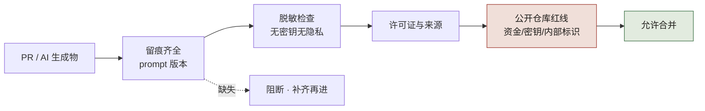
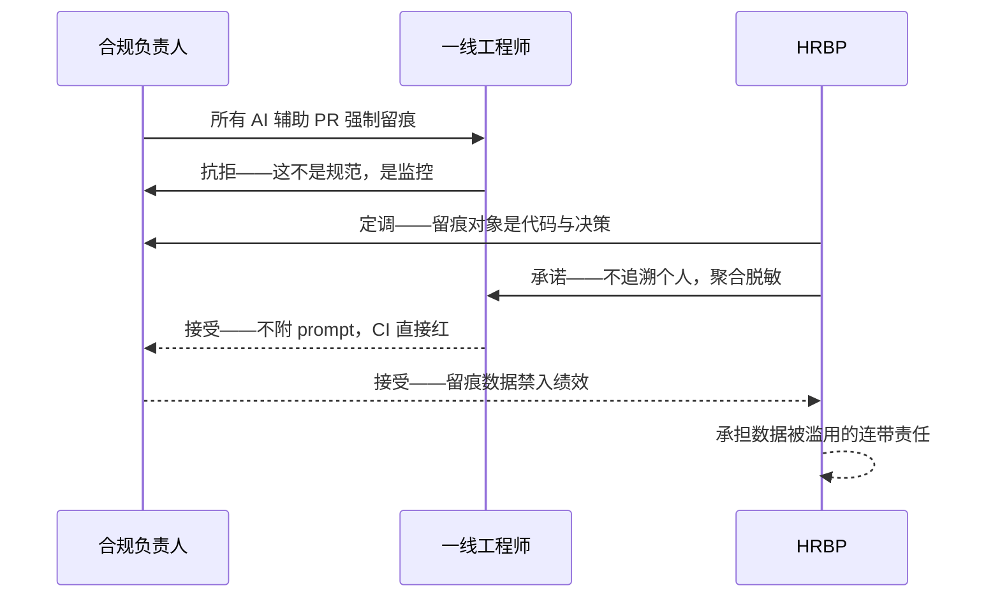

# 第 22 章 安全、合规与公开仓库治理

> **本章定位**：上线体系最后一道闸门——留痕、脱敏、公开仓库红线、许可证治理。
> **核心命题**：合规不是"上线后再补"，是"代码进仓库前的硬门槛"；AI 让代码来源变模糊，于是让来源变清晰就成了新的工程刚需。



**图 22-1｜合规硬门槛** — 合规是上线前的疫苗；留痕缺失直接阻断合并。

---

## 22.1 问题：一次年度审计，卡在了 AI 代码的留痕上

某年外部审计师进场做年度数据合规审计。他们要看的核心证据之一是：**"你们所有用 AI 生成的代码，能不能追溯到当时的输入和决策？"**

合规负责人向各团队发了一封邮件："请把过去 6 个月所有 AI 辅助生成的 PR 附上当时的 prompt 记录。"

三天后回收的结论让会议室陷入沉默：**只有 23% 的 AI 辅助 PR 附了 prompt 留痕。** 剩下的要么没记、要么记了但丢了、要么记的格式不统一无法检索。

**审计师给出的结论是："无法证明决策可追溯，本次审计不予通过，需补齐留痕后重新进场。"** 公司因此错过了一个重要的合规备案窗口，直接后果是某项跨境业务被监管要求暂停，预计影响季度营收约 ¥1,200 万。

事后整理补齐留痕方案时，合规负责人留下了一句话：**"你以为合规是上线后的体检，其实它是上线前的疫苗。体检发现问题已经晚了，疫苗是提前打好的。"**

---

## 22.2 根因：留痕被当成"可选附件"，而非"准入凭证"

**① 留痕没有强制入口。** 组织里有过"建议附 prompt"的规范，但没有"不附 prompt 的 PR 直接被 CI 拒掉"的硬约束。**软规范在进度压力下会被一致地绕过——这不是某个人偷懒，是组织把方便留给了绕过。** 图 22-1 把这条硬约束压成一个分支：留痕关卡判"缺失"时唯一的去向是"阻断 · 补齐再进"，后面三道闸一概不予放行——这条分支的价值，恰恰在于图上不存在"先合并、后补录"的通路。

**② 留痕格式不统一。** 有的团队贴在 PR 描述里，有的存到独立文档，有的口口相传。**格式不统一 = 无法检索 = 审计时等于没有。**

**③ 公开仓库的泄密风险被忽视。** 组织里有一部分仓库是公开的（开源组件、SDK 示例）。在引入 AI 辅助后，出现过两次险情：一次是 AI 把测试环境的真实密钥写进了示例代码并提交到了公开仓库；一次是 AI 把一段包含真实用户手机号脱敏算法的代码当成了"通用工具函数"提交。**两次都被代码评审在最后一秒拦下，但都只差一步就进了公开仓库。** 如果进了，就是不可逆的泄露。

---

## 22.3 AI 用法：留痕、脱敏、扫描——AI 能帮，但不能放行

**① AI 能帮的：**
- 自动扫描 PR 是否包含疑似密钥、凭证、PII（个人识别信息），命中即打标阻止合并。
- 自动从对话记录里提取当次生成用的 prompt 并填充到留痕模板。
- 自动给每个 AI 辅助提交打标（`ai-assisted: true` + prompt 引用 ID）。

**② AI 不能做的：**
- **判断"这段代码能不能进公开仓库"。** AI 的脱敏扫描是"基于模式匹配"，但有些信息是不是敏感，需要人结合业务判断。一个手机号正则可能既用于脱敏工具（可公开）也用于真实数据处理（不可公开），AI 分不清上下文。
- **判定留痕是否"足够"。** 形式上有没有附 prompt 可以自动查，但"这个 prompt 是否真的反映了当时的决策"无法自动判定——只能靠抽样人审。

---

## 22.4 角色博弈：留痕监控到底画在哪条线

这场博弈的主线是：**留痕监控的边界画在哪里。**

**合规负责人的立场**：所有 AI 辅助 PR 必须强制留痕，留痕率纳入团队 KPI。"宁可慢，不能丢证据。"

**一线工程师的立场**："强制留痕是在监控我们每一次调用。今天记 prompt，明天是不是要记我每次和 AI 聊了多久？" 这代表了一线对"被监控"的本能抗拒——一线的恐惧是写在脸上的："怕被监控、怕被替代、怕背锅。"

**HRBP 的介入**：这场冲突差点升级成劳资问题。一线工程师在组会上说"这不是工程规范，这是绩效考核工具"，引来几个老员工附和。HRBP 拉了一次三方会谈，最后定的调子是：**"留痕的对象是代码和决策，不是人。任何对个人的留痕调用统计必须脱敏聚合，且只用于流程改进，不得用于绩效。"** 这条被写进了第 26 章的治理章程。

**最终妥协（没有人全额赢）**：
- 合规负责人拿到了强制留痕——但要接受"留痕数据不得反向追溯到个人绩效"。
- 一线工程师拿到了"不追溯个人"的承诺——但要接受"每个 AI 辅助 PR 必须附 prompt，不附 CI 直接红"。
- HRBP 调和了双方——但要承担后续如果留痕数据被滥用的连带责任。
- 治理负责人拿到了一套可落地的机制——但要背"这套机制上线后留痕率必须从 23% 涨到 95% 以上"的硬指标。

把这场会谈收敛成时序，能看清边界是怎么谈出来的：
图 22-2 的让步全在两条虚线上：工程师交出"不附 prompt，CI 直接红"、合规交出"留痕数据禁入绩效"，一出一入互为对价；中间的实线只是对抗与定调。最后落在 HRBP 泳道上的那个自环——承担数据被滥用的连带责任——说明调和者自己也要留下一笔代价。



**图 22-2｜留痕边界的三方会谈** — 妥协的支点是「对象收窄」：留痕管代码与决策、不管人——这条线一划，强制留痕从一线的对抗变成了双方的共识。

---

## 22.5 公开仓库的红线

针对公开仓库泄密的两次险情，组织立了四条不可越的红线：

| 红线 | 规则 | 强制手段 |
|------|------|---------|
| 密钥凭证 | 任何疑似密钥/凭证不得进入任何仓库（含私有），只能走环境变量或密钥管理服务 | pre-commit hook + CI 双重扫描，命中即拒 |
| PII 数据 | 公开仓库不得包含任何真实 PII；测试数据必须用脱敏生成数据 | 专门的脱敏数据集 + 公开仓库合并前人工二次审 |
| 业务敏感算法 | 公开仓库只放通用工具，不放带有业务语义的算法 | 公开仓库的合并需要额外一级评审（不是普通的两人 review） |
| AI 生成代码的许可证 | AI 生成的代码需标注来源和潜在许可证冲突，公开仓库尤其严 | AI 辅助提交自动打标，公开仓库合并检查该标签 |

**合规负责人对最后一条的强调**："AI 生成代码的许可证风险是目前法律最灰的地带。你以为 AI 给你的是免费代码，但它的训练数据来源不清，万一里面包含了 GPL 代码的逻辑，你一旦开源出去就可能构成侵权。公开仓库宁可多审，不能少审。"

---

## 22.6 产出物：安全合规规范（附录 C）

- **强制留痕规范**：每个 AI 辅助 PR 必须附 prompt ID + 决策记录，CI 自动校验。
- **脱敏聚合规则**：留痕数据按团队聚合，禁止按个人检索（HRBP 的承诺落地）。
- **公开仓库四红线**：如上表。
- **AI 生成代码许可证声明模板**：合并到公开仓库前必须填。

> **代价声明**：强制留痕让每个 AI 辅助 PR 的提交准备时间平均增加 5-8 分钟（填留痕模板）；公开仓库的合并周期从平均 1 天延长到 2-3 天（多一级评审）。**这些时间买的是"合规事故不再发生"和"公开仓库不泄密"。** 合规负责人的话值得重复一遍：合规是疫苗不是体检——疫苗的成本是提前打的针，体检的成本是查出病时已经晚了。

---

## 22.6b 操作步骤：一份材料公开出去，这一个月在审什么

拿案例一时间线上记下的那件事当样本：**白皮书内部版 2025-07-09 发布，公开版被法务卡到了 8 月。** 被卡的东西里除了文档，还有几个要随白皮书一起开源的示例与工具仓库。评审单上的退回记录，就是这一章所有条目的出处。

| 轮次 | 谁查 | 退回理由 | 这一轮真正在防什么 |
|---|---|---|---|
| 第 1 轮 | 安全 | 示例代码里出现了内部服务域名和真实主机名 | 内部拓扑泄露——改法不是删掉，是全量换成占位符，并确认历史提交里也没有 |
| 第 2 轮 | 合规负责人 | 一段脱敏算法带业务语义（命中了内部字段命名） | 22.5 的第三条红线：公开仓库只放通用工具，不放带业务语义的算法 |
| 第 3 轮 | 法务 | AI 辅助生成的片段拿不出逐文件来源与许可证声明 | 22.5 第四条：来源不清的代码开源出去可能构成侵权，这是法律最灰的地带 |
| 第 4 轮 | 治理组 + 业务 Owner | 一个纯工具库坚持要公开，但当时无法满足"额外一级评审"的人力 | 走例外（22.6c 的签署单），限一个仓库、限一个季度 |

这四轮退回真正花掉的是时间，不是人力：**每退一轮，公开仓的合并就要重排一次队列**——22.6 代价里那句"合并周期从 1 天延长到 2-3 天"是单 PR 的口径，一个仓库从零到首次公开，量级是周不是天。摩擦集中在三处：

1. **改 HEAD 不等于改干净。** 密钥、内部域名一旦进过提交历史，删掉文件也还在历史里。**做法只有两条：新建一个只导入当前快照的公开仓，或者用 filter-repo 重写历史并同步轮换全部凭证。** 后者慢，且改完仍然要按"已泄露"处理。
2. **业务语义 AI 看不出、人能看出来。** 第 2 轮那条，AI 的脱敏扫描全程绿灯——它匹配的是模式，不是含义（22.3 已经说过）。**所以"额外一级评审"必须是一个具名的人，不是多一个 approve 按钮。**
3. **例外不是压缩灰，是有期限的授权。** 第 4 轮那次如果谈成"先公开、以后补评审"，22.5 的四条红线就当众作废了。**接受例外的一方必须签字，例外必须带到期日**——这就是下面那张签署单存在的全部理由。

---

## 22.6c 可抄工件：发布评审单 + 例外签署 + 阻断式 CI

**发布评审单**（每个进公开仓的仓库填一份，逐条留证据路径；**证据放不进仓库的，视为未查**）：

| # | 检查项 | 谁来查 | 拿什么当证据 | 不放行条件 |
|---|--------|--------|--------------|------------|
| 1 | 密钥与凭证 | 安全 | 全历史扫描报告（含已删除文件与全部历史提交），存档进评审单 | 命中即拒；**且视同已泄露，凭证立即轮换** |
| 2 | 内部标识 | 治理组 | 内部标识清单（域名 / 主机名 / 项目代号 / 工号 / 客户名）+ 命中数 0 的扫描输出 | 命中未清零；清单超过一个季度没更新 |
| 3 | PII 与真实样本 | 合规 | 测试数据全部来自脱敏生成集的声明 + 抽样人审记录 | 出现任何真实样本，含"已脱敏的真实数据" |
| 4 | 业务语义算法 | 业务 Owner + 合规 | 逐文件"通用性说明"（这函数换个行业还成立吗） | 说不清通用性；命中内部字段或流程命名 |
| 5 | AI 生成来源与许可证 | 治理组 + 法务 | `ai-assisted` 标签 + 逐文件许可证声明（模板见下）+ SBOM | AI 参与范围留空；声明写"未知" |
| 6 | 提交历史 | 安全 | 新仓快照导入记录，或 filter-repo 后的历史哈希对照 | 直接把内部仓推成公开仓（禁止） |
| 7 | 额外一级评审 | 非本仓的日常评审人 | 一级评审人的具名 approve + 至少一条实质意见 | approve 无意见（这一级就是橡皮章） |
| 8 | 维护承诺 | 公开仓 Owner | 谁答 issue、响应窗口多长、不响应谁来接 | Owner 不是具名的人 |

**AI 生成代码许可证声明**（进公开仓前逐文件填，不许按目录批量）：

```yaml
path: src/internal_token/normalize.py
ai_assisted: true              # false 也要写明依据
human_reviewer: <人名>         # 不是"评审组"
ai_scope: 生成实现 / 生成测试 / 仅解释（多选）
prompt_ref: <留痕系统里的 prompt ID>   # 与 22.6 强制留痕规范同一套 ID
known_similarity: <是否命中已知许可证片段，无则写"未见">
license_intended: <本仓库拟用许可证>
legal_signoff: <法务签名 / EXC-编号>   # 二者必居其一，空白不受理
```

**例外签署单**（红线例外只有一种形状：一仓、一条红线、一个到期日）：

```yaml
id: EXC-<年>-<序号>
repo: <公开仓库名>
redline: 密钥 / PII / 业务语义 / 许可证     # 四选一，写"整体豁免"直接退回
why_needed: <一句话：不用公开仓库会怎样>
blast_radius: <出去之后最坏会发生什么>       # 不许写"风险可控"
compensating: <替代闸门：什么监控、多久内补做>
expires: <默认一个季度；无到期日委员会不受理>
sign:
  合规负责人:
  安全负责人:
  业务_Owner:
  登记人: <治理组>        # 进第 26 章章程的例外台账，季度复核
```

**合规、安全、业务 Owner 三方缺一不受理**，登记人只进台账不参与裁定；续期要重新走一次全签，同一个例外续到第三次就得回委员会改红线本身（见 22.6d 反例 ③）。

**CI 阻断骨架**（公开仓与内部仓不同流：`warn` 不算闸）：

```yaml
# 公开仓库合并前置作业，任一红即不可合并
jobs:
  secret-scan-history:      # 扫全部历史而不是只扫 HEAD：历史里的密钥同样不可逆
  internal-token-scan:      # 读上面评审单第 2 项的内部标识清单，命中即红；清单由治理组月度维护
  pii-scan:
  ai-provenance:            # 检查 ai-assisted 标签与 prompt_ref 存在（形式校验）
  license-declaration:      # 声明文件缺失或 legal_signoff 为空即红
  second-tier-review:       # 校验审批人不是日常评审人（防止自己批自己）
```

---

### 工具落地卡：Semgrep 与 Trivy —— 上面那六个 job 里，只有两件有现成的开源执行体

22.6c 的 CI 骨架给了六个 job 名，其中 `internal-token-scan`（内部标识）与镜像依赖这一层，案例四那家十人团队是真拿开源工具跑的：**Wazuh 当 SIEM、Trivy 扫容器、Semgrep 扫代码**。其余四项（历史密钥、PII、许可证声明、二级评审）没有可抄的开源执行体，得自研——**这正好说明"合规闸门"里能白嫖的只是一小半，大部分是自研的脏活**。

> **取证口径**：本节的**退出码常量、摘要行字面量、忽略文件名是从两个项目的源码逐字核对**（2026-09-24 本机从 raw 源文件取回），版本号一份从 PyPI 官方接口取回、一份从 `releases.atom` 取回；Semgrep 的退出码另与官方 `cli-reference` 页的码表对过一遍（两边在"7"上语义不一致，卡里如实并列、不裁决）。工具**未在本机安装、命令未复跑**。

**Semgrep —— 「扫出问题了」和「CI 红了」是两个不同的开关**

- **版本口径**：1.x 线。本机从 PyPI 官方接口取到当前版 **1.178.0**（2026-09-24）。案例四用的是开源版扫描，未写版本。
- **配置落点**：规则不靠固定文件名——`--config` 一个参数同时接受 YAML 文件、`.yml/.yaml` 文件目录、URL 与 registry 条目名。**不传 `--config` 时源码回退成 `["auto"]`**（`config_strs=(config or ["auto"])`，`cli/src/semgrep/commands/scan.py`），也就是"把目标代码上传去问云端要规则"——**内网仓 / 客户代码仓上这条会直接把代码发出去**，这是本章最该警惕的一条默认值。忽略文件叫 `.semgrepignore`，语法镜像 `.gitignore`，放仓库根或工作目录。
- **最小可抄配置**（`rules/internal-token.yaml`，用于评审单第 2 项「内部标识」）：

```yaml
rules:
  - id: internal-hostname-leak     # 必需键之一：规则 ID，命中报告会原样回显它
    languages: [python]            # 按语言收窄，不在列表里的文件不解析
    severity: ERROR                # ERROR 计为 blocking，INFO/WARNING 不计——见下面的 (M blocking)
    message: "内部主机名进入待公开仓库"
    pattern-regex: "(?i)internal-[a-z0-9.-]+\\.example\\.internal"
```

  必需键集合与 `pattern` 族（`pattern` / `patterns` / `pattern-either` / `pattern-regex` 四选一）出自官方 rule-syntax 页的 Schema 表；**该页本机抓取超时，键名按转述登记**，落盘前以官方页为准。
- **跑完看哪条输出**：摘要四行是源码里的字面量（`cli/src/semgrep/output.py`），逐字为 ` • Findings: {n} ({m} blocking)`、` • Rules run: {n}`、` • Targets scanned: {n}`、` • Parsed lines: {pct}`，末行 `Ran {N} rules on {M} files: {K} findings.`。可 grep 的是 `Findings:` 与 `blocking`。退出码两份口径（本机都取到一手）：源码 `cli/src/semgrep/error.py` 里的常量是 `OK=0`、`FINDINGS=1`、`FATAL=2`、`TARGET_PARSE_FAILURE=3`、`RULE_PARSE_FAILURE=4`、`UNPARSEABLE_YAML=5`、`MISSING_CONFIG=7`、`INVALID_LANGUAGE=8`、`INVALID_API_KEY=13`；官方 `docs.semgrep.dev/cli-reference` 的退出码表写的是同一批数字但**语义措辞不同**（`3` 写作"被扫语言语法非法，仅 `--strict` 时出现"、`5` "配置不是合法 YAML"、`7` "配置里至少有一条规则非法"、`8` "不认识指定语言"）。**5 与 8 两边对得上，7 对不上**：源码那个常量名叫 `MISSING_CONFIG_EXIT_CODE`，文档却说 7 表示"有规则非法"。**本轮不裁决谁对**（要看调用点才知道哪个常量被拿去当 7 用），但这条差异本身就是判据的一部分：**CI 里只判"退出码等于几"是不够的，要么把码表钉在自己的 runbook 上复跑校准，要么把判据落在摘要行上。****坑在这里**：`--error/--no-error` 在源码里映射到 `error_on_findings`，而 `FINDINGS_EXIT_CODE` 只在该开关为真时启用——**默认扫出 finding 仍退出 0**。CI 里写 `semgrep scan --config rules/` 而不加 `--error`，等于买了一台不接红灯的报警器。第二个判据行是 `Parsed lines`：它是"代码真的进了解析器"的证据，比例异常低（或 `Targets scanned: 0`）说明规则在跑、代码没被看。
- **它替代不了什么**：官方 README 有一句自我设限的话，逐字是「in security contexts, Semgrep Community Edition will miss many true positives as it can only analyze code within the boundaries of a single function or file」——**跨函数、跨文件的数据流漏洞，社区版结构上就看不见**。第二条更常见：`# nosemgrep` 注释可以逐行静音一条命中，权限在人手里；评审单第 2 项要求"命中数 0"，就得连带检查有没有 `nosemgrep`。第三件是它只检查你写了规则的东西——"内部标识清单"每季度不更新，扫描器就永远绿。

**Trivy —— 默认退出 0 的门禁不是门禁**

- **版本口径**：最新稳定版 `v0.74.0`（`2026-08-14T11:48:42Z`；上一条 `v0.73.0` 是 2026-08-03）——**这一行本轮从"未复核"补上了读数**：先前记的是"GitHub API 限流取不到"，改走 `github.com/aquasecurity/trivy/releases.atom` 一次就拿到（`api.github.com` 会 403，atom 不需要鉴权、也没有那层速率限制）。0.x 线意味着**次版本号就是破坏性变更的边界**，抄配置前先 `trivy --version` 对一次。案例四只写「Trivy 扫容器」。
- **配置落点**：官方配置文档逐字是「Trivy can be customized by tweaking a `trivy.yaml` file」，路径可由 `--config` 覆盖，源码里该 flag 的默认值就是字符串 `trivy.yaml`（`pkg/flag/global_flags.go`，本机核对）。豁免文件默认名 `.trivyignore`（源码常量 `DefaultIgnoreFile = ".trivyignore"`，`pkg/result/filter.go`）。结构化的 `.trivyignore.yaml` 官方挂着 **EXPERIMENTAL** 警告，且原文要求「you must explicitly specify the YAML file path using the `--ignorefile` flag」。
- **最小可抄配置**（仓库根 `trivy.yaml`，键名与注释均照官方配置参考页）：

```yaml
exit-code: 1          # 官方原文示例值是 0；文档逐字：默认「exits with code 0 even when security issues are detected」
severity:             # 与 --severity 等价；公开仓只放行 CRITICAL 之外的组合要写进例外单
  - HIGH
  - CRITICAL
ignorefile: ".trivyignore"
```

```text
# .trivyignore —— 逐字照官方过滤文档示例的形状
CVE-2018-14618
CVE-2019-14697 exp:2023-01-01    # 带到期日的豁免：这正是本书第 22 章「一仓一条一到期日」的形状
```

- **跑完看哪条输出**：官方文档给的命令形状是 `trivy image --exit-code 1 python:3.4-alpine3.9`，其示例结果块逐字含三行——日志行 `INFO Detecting Alpine vulnerabilities...`（**扫描器真的跑了**的证据）、汇总表头 `| LIBRARY | VULNERABILITY ID | SEVERITY | INSTALLED VERSION | FIXED VERSION | TITLE |`、合计行 `Total: 1 (UNKNOWN: 0, LOW: 0, MEDIUM: 1, HIGH: 0, CRITICAL: 0)`。**判据是 `Total:` 那一行的括号内分布 + 进程退出码**，两者缺一不可：只看退出码会在忘配 `--exit-code 1` 时永远绿，只看 `Total:` 又可能在扫描器根本没跑（镜像不在支持列表）时读到"0 个漏洞"。另有一条对公开仓直接相关：`--scanners` 可取 `vuln` / `misconfig` / `secret` / `license`，而官方写明"容器镜像扫描默认已启用 vulnerability 与 secret"——**评审单第 1 项的密钥扫描，Trivy 顺手能做一半（当前镜像层），做不了另一半（全部 git 历史）**。
- **它替代不了什么**：官方文档自己给了三条边界，逐字分别是「Trivy prioritizes precision in vulnerability detection, aiming to minimize false positives while potentially accepting some false negatives」（**它的默认取向是漏报而不是误报**——公开仓门禁要的是反过来，所以阈值宁严不松）；「When a package version cannot be uniquely determined (e.g. `package-a: ">=3.0"`), Trivy typically skips vulnerability detection for that package」（**锁文件缺失＝直接盲区**，一条 range 依赖就整包不查）；以及它的扫描面只有 OS 包 / 依赖 SBOM / CVE / IaC / secrets / license——**自研代码的逻辑漏洞它一概不管，那是 Semgrep 那一侧的事**。最后仍是 `.trivyignore`：一行 CVE 号就能永久静音，所以豁免文件必须进评审、必须带 `exp:` 到期日、必须与例外签署单（EXC 编号）对账。

---

## 22.6d 度量指标：闸门在不在响，例外有没有烂掉

| 指标 | 怎么测 | 阈值 | 谁看 | 多久看一次 |
|------|--------|------|------|-----------|
| AI 辅助 PR 留痕率 | 留痕系统按 PR 统计 | 目标线 95% 以上（22.4 治理负责人背的硬指标）；数字清单记的治理后实际值是 94%，**没到线的那点是长期豁免的仓库造成的，要单列出来，不许从分母里抹掉** | 合规 + 治理组 | 周 |
| 无 prompt 被 CI 拒的 PR 数 | 门禁拒绝数 | **非零才说明闸在响**；长期为零先怀疑被绕过（与第 6 章"新增环拦截数稳定非零"同一条判断） | 治理组 | 周 |
| 事后外部扫描命中数 | 已合并进公开仓之后被外部发现的密钥 / PII 数 | **大于零就是事故**，不是运维指标 | 安全 | 月 |
| 有效例外数 / 到期未处置数 | 例外台账 | 只减不增；出现"续到第三次"的例外，改红线而不是继续签 | 治理委员会 | 季度 |
| 公开仓合并中位时长 | PR open → merge | 2-3 天（22.6 代价）；**持续变短先查是不是有人跳过了那一级评审**，不当效率提升看 | 合规 | 月 |
| 泄密演练恢复时长 | 每季度往镜像公开仓推一个假密钥：多久发现、多久轮换完成 | 发现窗口小于一轮 CI 周期，轮换写进 runbook（分钟、小时数按你链路定，是拍的） | SRE + 安全 | 季度 |

五种具体坏法：

**① 扫描器的清单过期。** 内部标识清单里写着旧域名，新域名换了半年没人补——闸还在，只是瞎了。**症状**：清单最后更新日期远早于最后一次基础设施变更。这就是 22.6c 把"清单由治理组月度维护"写进作业的原因。

**② 留痕靠补录刷上来。** 合并之后批量回填 prompt，数字达标，审计要的那句话（"当时的输入和决策"）一条都没拿到。**识别方式很机械：留痕时间戳晚于合并时间戳的比例**——这个比例高，说明留痕率越好看越不可信。22.3 说的"只能靠抽样人审"，抽的就是这一条。

**③ 例外变默认。** 台账越滚越长、每条都写着"一次性"、到期自动续期。**例外数量止跌回升的那一个季度，就该把评审资源问题拿到委员会上，而不是继续加签。**

**④ 公开仓被当成内部仓的镜像。** 有人写了反向同步图省事，四条红线一次同步全废。**做法：同步只能由 CI 单向出包，公开仓不接受人手推送，白名单之外的目录不存在。**

**⑤ 一级评审变成同一批人互签。** 退回次数长期为零的"额外一级"就是没有这一级——22.6b 那几轮退回恰恰是这一级在工作的证据。**一级评审的 approve 必须带实质意见，且评审人不得是日常评审人**（CI 那一行 `second-tier-review` 就校验这件事）。

---

## 22.7 四案例映射

| 案例 | 合规的关键约束 | 公开仓库的主要风险 | 留痕的核心对象 |
|------|--------------|------------------|--------------|
| 案例一·电商平台 | 数据合规审计、跨境业务备案 | 业务算法（脱敏/对账逻辑）泄露 | AI 辅助迁移脚本与策略变更 |
| 案例二·加密交易所 | AML/KYC 合规、资金流向审计 | 冷热钱包调度算法泄露 | AI 辅助合约代码与风控规则 |
| 案例三·Web3 量化 | 链上可追溯性、策略知识产权 | 策略参数与套利逻辑泄露 | AI 辅助策略生成与回测脚本 |
| 案例四·安全初创 | 客户数据处理合规、行业认证 | 客户数据处理代码泄露 | AI 辅助安全工具与配置生成 |

---

## 22.8 检查清单（关于安全合规本身）

- [ ] 你的 AI 辅助 PR 留痕是强制的还是建议的？建议的 = 合规事故在等你。
- [ ] 留痕数据能不能按个人检索？能 = 一线式的抗拒迟早爆发，且你有合规风险。
- [ ] 公开仓库有 pre-commit 的密钥扫描吗？没有 = 一次推送就不可逆泄密。
- [ ] 公开仓库的合并是不是和私有仓库同一套流程？是 = 业务算法迟早泄露。
- [ ] AI 生成代码进公开仓库前有许可证声明吗？没有 = 法律灰区裸奔。
- [ ] 你的留痕率现在是多少？<90% = 审计不过的风险。

---

## 22.9 遗留问题

- **留痕数据的保留多久合适？** 留太短审计要时找不到，留太长有隐私和存储成本。常见做法是 3 年，但这个数字缺乏监管明确指引。留给后续迭代。
- **AI 生成的脱敏数据够安全吗？** 用 AI 生成脱敏测试数据替代真实 PII，但"AI 生成的假数据会不会反向泄露真实数据的分布特征"是一个尚未充分研究的问题。标记为风险点持续观察。
- **跨公司的 AI 代码溯源怎么办？** 组织内部能管自己的 AI 辅助流程，但开源依赖里别人用 AI 生成的代码，怎么追溯？目前无解，只能靠许可证声明和 SBOM（软件物料清单）。这个开放问题留给行业。

---

> **本章的一句话**：合规不是上线后的体检报告，是上线前的疫苗。**留痕不是为了证明你没犯错，是为了在审计来的那天你能证明"我做过什么"。** 公开仓库的红线不是为了让你慢，是为了让你在"一次推送就不可逆"的地方，永远多一道闸门。AI 让代码的来源变得模糊，于是让来源变得清晰就成了新的工程刚需。
