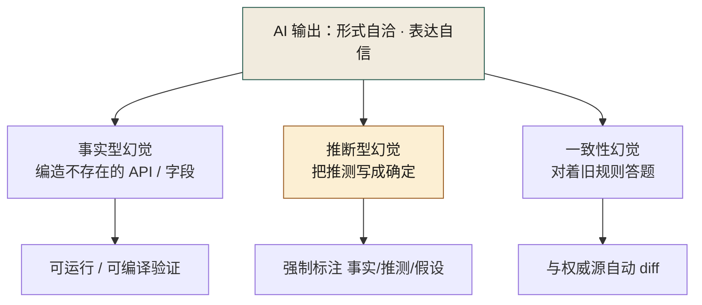
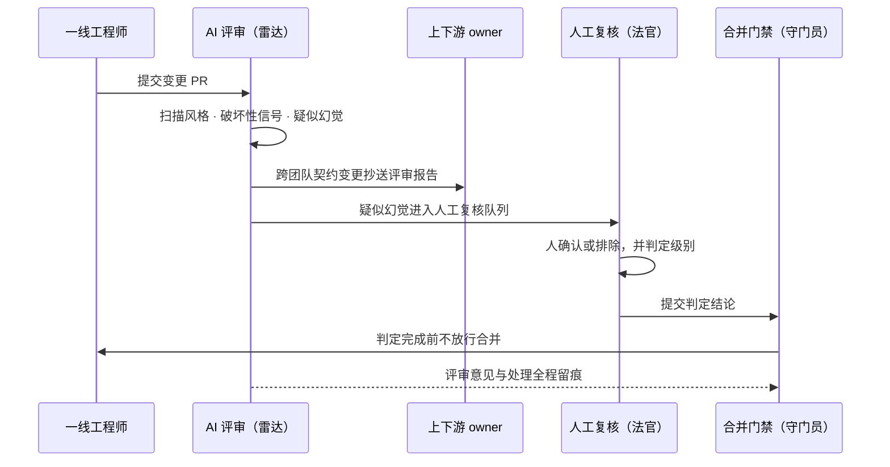
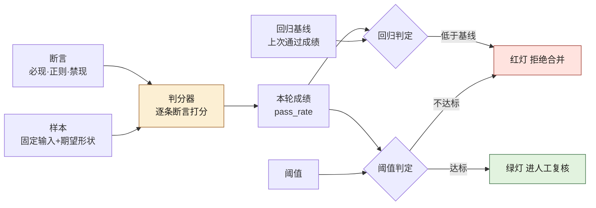

# 第 24 章 AI 评审与幻觉处理

> **本章定位**：治理篇的认知核心。本章是全书被点名的最大债务章——正面回答第 2 章、第 11 章、第 27 章三处遗留问题，并提出全书最重要的概念框架：幻觉的三种类型与"AI 能提醒但不能判定"的责任边界。
> **核心命题**：AI 能提醒、能扫描、能生成候选，但不能判定、不能负责、不能替你签字。雷达和法官是两个角色。

---

## 24.1 问题：三个遗留问题，其实是同一个问题

第 2 章结尾问："**AI 能不能自己识别什么时候该叫人？**"
第 11 章结尾问："**AI 会不会自己留对缝？**"
第 27 章结尾问："**破坏性变更的分级，能不能让 AI 辅助判定？**"

这三章是不同团队、不同阶段、不同场景下提出的，但把它们摆在一起看，会发现它们是同一个问题的三种问法：**AI 生成的产物（代码、契约、留痕、判断）看起来都对，但"对不对"这件事，AI 自己说了不算。**

在一次对账事故中是这样：AI 生成的迁移脚本看起来对，跑起来也对，对账也对——但它漏了一个字段，而它不知道自己漏了。**它不是在骗人，它是真的不知道。**

在一次契约事故中是这样：AI 生成的接口看起来和契约一致，但它对的是"它记忆里的旧契约"，而不是"契约仓库里的最新契约"。**它不是在违约，它是不知道契约已经变了。**

在一次合规事故中是这样：AI 辅助生成的 PR 看起来合规，但它"合规"的判断依据是形式（有没有附文件），而不是实质（文件内容是否真的反映了决策）。**它不是在造假，它是把"形式合规"当成了"实质合规"。**

这三类失灵的共同特征，叫做**幻觉（hallucination）**：AI 生成的内容在形式上自洽、在表达上自信，但在事实上可能错——而且它不会主动告诉你它不确定。

---

## 24.2 幻觉的三种类型

在大量实践中，AI 幻觉可以分成三类，应对方式各不相同：



**图 24-1｜幻觉三类型** — 用同一种手段抓三类幻觉，必然漏网；雷达与法官角色不可混。

图 24-1 提示了三类幻觉共用同一个上游——那张"形式自洽 · 表达自信"的卡，这正是从表面分不出三类的原因；往下三条竖线彼此不共边，每条只挂自己那道检验卡。

**① 事实型幻觉（"编造事实"）。** AI 编造一个不存在的 API、一个不存在的字段、一个不存在的库版本。**典型表现**：生成的代码引用了一个看似合理但实际不存在的函数。**应对**：一切 AI 引用的外部符号必须过可运行验证（CI 跑通才算数）。**这类幻觉最容易抓——因为代码跑不起来。**

**② 推断型幻觉（"把推测写成确定"）。** AI 面对不确定的信息时，倾向于给出一个"看起来合理"的答案，而不是说"我不知道"。**典型表现**：考古式重构时 AI 把推测的祖传代码逻辑写成了确定结论；架构梳理时 AI 把不确定的仓库硬塞进某个业务域以求整齐。**应对**：要求 AI 在输出中显式标注"这是事实/这是推测/这是假设"，且"事实"必须附证据引用。**这类幻觉最难抓——因为输出本身是自洽的，只有对照真实世界才知道哪错了。**

**③ 一致性幻觉（"对的是旧版本的对"）。** AI 的输出和它自己记忆里的某套规则一致，但那套规则已经不是当前规则。**典型表现**：契约事故里 AI 对的契约是它训练数据里见过的旧版本；对账事故里 AI 漏掉的字段是它"觉得不重要"的字段。**应对**：任何"应该和某个权威源一致"的产物（契约、配置、schema），必须和权威源做自动 diff，不一致即拒。**这类幻觉最隐蔽——因为 AI 不是在错，它是在"对着一本旧书答题"。**

> **三类型的核心价值在于把"AI 不靠谱"这种模糊的担忧，拆成了三种可识别、可分别应对的工程问题。** 抓不住幻觉，往往不是因为幻觉多，而是因为把三类当成一类来治——用抓事实型幻觉的 CI 去抓一致性幻觉，必然漏网。

把三道应对机制叠成一条漏斗，就能看清"哪类幻觉被哪一层拦下、漏网的交给谁"：


**图 24-2｜幻觉拦截漏斗** — 三层自动化拦截各对一类幻觉，漏网的进人工复核队列由人兜底——自动化负责收窄范围，人只判残留。

图 24-2 的读法是分清主线与分支：主线是"可运行验证 → 标注 → 与权威源 diff"逐级下探的漏斗，"CI 拒掉""打回补证据""拒掉重对源"三张红卡全在分支上、不带走漏斗下游；最终进人工复核队列的，只是穿透三层之后的残留——人接的是自动化收窄后的剩余，不是全量。

---

## 24.3 回答三个遗留问题

现在正面回答三章的债务。

**① 第 2 章问："AI 能不能自己识别什么时候该叫人？"**
答：**不能判定，但能提醒。** 提示词库里的"must_intervene"字段——凡是涉及到资金、合规、删除、权限提升的操作，AI 必须在输出里显式打出"此处需人介入"的标记。**但这个标记是提示词强制的，不是 AI "自己想到要叫人"。** 换句话说：**「叫人」的动作可以被自动化，但「该不该叫人」的判断规则是人定的、写死在提示词里的。** AI 不会自己学会什么时候该叫人——它只会忠实执行你告诉它的"叫人触发条件"。如果触发条件没覆盖到的场景，它就不会叫——对账事故就是触发条件没覆盖"字段完整性"这个场景。

**② 第 11 章问："AI 会不会自己留对缝？"**
答：**能生成"看起来像缝"的结构，但不能判断"对不对缝"。** 留缝五步法里，AI 可以帮你生成扩展点的代码骨架（abstract method、plugin interface、配置占位符），这些在形式上都"像缝"。但"这个缝留得对不对、会不会被用到、将来会不会成为包袱"——这是架构判断，AI 做不了。**实践中的做法是：AI 生成缝的候选，由人决定留不留、留多大。** import-linter 这类自动化检查只能验证"已留的缝有没有被违规穿过"，但不能验证"该留的缝都留了"——后者仍然是人的判断。

**③ 第 27 章问："破坏性变更的分级，能不能让 AI 辅助判定？"**
答：**能辅助识别信号，不能做最终分级。** AI 可以扫一个 diff 然后指出"这里改了公共接口签名、这里删了一个字段、这里改了返回类型"——这些是"破坏性变更的信号"。但"这个破坏是重大的还是可接受的"取决于下游有没有人在用、用在什么场景——这是组织判断，AI 看不到下游的真实使用情况。**做法是：AI 列信号，人定级别。** AI 说"这里有 3 个破坏性信号"，级别（L1 不通知 / L2 通知 / L3 强制会签）由人或确定性规则根据信号数量和类型裁定。

**三问的统一回答**：**AI 能提醒、能辅助识别、能生成候选，但不能做最终判定。** 判定的责任永远在人——这不是技术限制会随模型进步解决，这是责任归属的固有边界。**即使有一天 AI 准确率到 99.99%，那 0.01% 的错谁来负责？答案如果不是"AI"（AI 不能被开除也不能坐牢），那就只能是"人"。既然人是最终责任主体，人就必须是最终判定主体。**

---

## 24.4 AI 评审能做什么：一份能力边界清单

| AI 评审能力 | 能做 | 不能做 |
|------------|------|--------|
| 代码风格检查 | ✅ 自动化，比人快 | — |
| 识别"破坏性变更信号" | ✅ 列出信号 | ❌ 判定破坏的严重程度 |
| 识别疑似幻觉 | ✅ 标记"无引用的断言""与已知不一致" | ❌ 确认这就是幻觉 |
| 安全漏洞扫描 | ✅ 模式匹配已知漏洞 | ❌ 判断业务逻辑层面的安全风险 |
| 性能问题提示 | ✅ 标记明显的 O(n²)、N+1 查询 | ❌ 判断在你的数据量级下这是不是真问题 |
| 架构合理性 | ✅ 对照规范指出偏离 | ❌ 判断偏离是不是有正当理由 |
| 契约一致性 | ✅ 做 diff | ❌ 判断 diff 是 bug 还是有意变更 |
| 合规性 | ✅ 检查形式（有没有留痕） | ❌ 检查实质（留痕是否真实） |

**一句话总结**：AI 评审是"发现信号的雷达"，不是"做决策的法官"。雷达负责扫，法官负责判。**让雷达当法官，就是让对账事故再来一次。**

---

## 24.5 跨团队 AI 评审机制

一开始各团队自己搞 AI 评审，结果标准不一、力度不一、有的团队形同虚设。第 27 章契约治理定了"跨团队契约必须跨团队评审"的原则后，AI 评审也做了统一：

**① 组织级 AI 评审规则集。** 一份全公司统一的"AI 评审检查项"，所有团队的 AI 评审工具必须覆盖。防止"有的团队在认真审，有的团队在走过场"。

**② 跨团队交叉评审。** 涉及跨团队契约的变更，AI 评审报告同时发给上下游团队的 owner。**防止"自己审自己"——对账事故就是迁移团队自己审自己，漏掉的对账需求他们根本不知道存在。**

**③ 幻觉标记的人工复核流程。** AI 评审标记的"疑似幻觉"，进入一个专门的人工复核队列，必须在合并前由人确认或排除。**标记可以被 AI 自动产生，但"这是不是真的幻觉"必须人定。**

**④ 评审报告本身也要留痕。** AI 给了什么评审意见、人怎么处理的，全部记录。**防止"AI 说了但人没看"——如果出了事，要能追溯"当时的评审意见是什么、谁忽略了它"。**

这四条机制落到一次真实变更上，就是三个角色接力、谁也不能越位的时序：



**图 24-3｜雷达、法官、守门员三角色时序** — AI 扫描出信号、人做判定、门禁拦住未判定的合并——提醒、判定、放行三权分立，谁也不能越位。

图 24-3 里 AI 的权限被关在第二条泳道内：它的动作止步于扫描自环和两条分别发往上下游 owner、人工复核的出向线，没有任何一条线直指合并；决定放行的唯一消息是守门员发给工程师的"判定完成前不放行合并"。全图唯一的虚线是评审意见留痕——出了事，"AI 说了但人没看"要靠这条线追责。

---

## 24.5b 可抄实现件：评测即门禁与四道机检

24.4 划的是能力边界，24.5 立的是角色分工。读者合上这一章之前一定会问：**这些分工怎么落到 CI 的退出码上？** 这一节给答案的机器形态——四道会把合并拦停的门：运行门（代码跑不跑得起）、接地门（断言带不带出处）、引用门（出处指不指得到实物）、评测回归门（雷达自己有没有变笨）。四道门各自对着 24.2 一类幻觉的可机检形状；门后仍然是人，但人到场的范围，被门收窄了。

### 评测集的最小结构：样本、断言、阈值、回归门

组织需要评测集，是因为 **AI 评审工具自己会漂**：模型换版本、提示词改版（[第 23 章](./ch28-第23章-提示词工程与归档.md)）、规则集背后的知识源退役——没有回归评测，"雷达瞎了"这件事在全公司不产生任何信号。评测集是雷达的雷达，本章意义上的"门禁的门禁"。

一份评测集不是"一堆问答对"。最小结构四件，缺一件都不成门：

- **样本**：一条固定输入（一段 diff、一句提问），连带期望输出形状。样本进版本库、走 PR——改样本就是改门禁，必须留痕。
- **断言**：对输出的机器判据。只写"看得见形状"的三类：必现串、正则命中、正则禁现。不写"语义相近"——那是拿模型审模型，正是本章要拦的回路。
- **阈值**：本轮样本过多少算绿。写进配置文件，不写在值班人的记忆里。
- **回归门**：比阈值更狠的一件——拿本轮成绩对"上一次通过时的基线"，**低于基线一律红，哪怕过了阈值**。阈值防"本来就不行"，回归门防"曾经行、现在不行"。

一份最小评测集（示意值，抄回去替换成你的域）：

```yaml
# eval/review-bot.v1.yaml —— AI 评审助手的回归评测集（示意）
suite: review-bot
baseline: baseline.json                       # 回归门靶子：上一次通过时的成绩
threshold:
  pass_rate: 1.0                              # 阈值（示意）：全过才许进人工复核
gate:
  on_regression: block_merge                  # 回归即拒绝合并，不是 warning
samples:
  - id: S01
    input: "评审这段 diff：新增必填字段且无默认值"
    assertions:
      - { kind: contains, value: "破坏性" }       # 断言①：结论必须出现
      - { kind: regex,    pattern: "见 9\\.5c" }  # 断言②：结论必须带出处
      - { kind: forbid,   pattern: "通常.*兼容" } # 断言③：禁止安慰式无接地断言
  - id: S02
    input: "评审这段 diff：枚举新增一个值"
    assertions:
      - { kind: contains, value: "兼容" }
      - { kind: regex,    pattern: "见 9\\.5c" }
```

四件结构在 CI 里各管一刀，先后有序（见图 24-4）：



**图 24-4｜评测门四件结构** — 样本喂断言、断言计成绩、阈值与回归基线各判一刀，任何一刀落下都是退出码 1；评测集扩充却不重刷基线时红得莫名其妙——不是工具变笨，是拿旧靶子量新卷子。

### 判分器：一条断言不过，退出码 1

判分器只吃两样东西：上面那份 YAML，和一份候选答案文本。接模型的那一步在你的 CI 里换成真实调用；先拿手写答案把判分器本身验一遍——**门禁也要被门禁**。

```python
import json, re, sys, pathlib
import yaml                                      # 本机 pyyaml 6.0.3

def check(a, out):                               # 只认"看得见形状"的三类断言
    k = a["kind"]
    if k == "contains": return a["value"] in out
    if k == "regex":    return re.search(a["pattern"], out) is not None
    if k == "forbid":   return re.search(a["pattern"], out) is None
    raise ValueError(f"unknown kind: {k}")       # 断言类型写错必须炸，不许静默放行

def run(path, outputs):
    spec = yaml.safe_load(pathlib.Path(path).read_text(encoding="utf-8"))
    rows, passed = [], 0
    for s in spec["samples"]:
        bad = [a["kind"] for a in s["assertions"] if not check(a, outputs[s["id"]])]
        passed += not bad
        rows.append((s["id"], not bad, bad))
    rate = passed / len(spec["samples"])
    print(f"suite={spec['suite']}  pass_rate={rate:.2f}  threshold={spec['threshold']['pass_rate']:.2f}")
    for sid, ok, bad in rows:
        print(f"  {'PASS' if ok else 'FAIL'}  {sid}" + ("" if ok else f"  未过断言: {','.join(bad)}"))
    rc = 0 if rate >= spec["threshold"]["pass_rate"] else 1
    bl = pathlib.Path(spec["baseline"])
    if bl.exists() and rate < json.loads(bl.read_text())["pass_rate"]:
        print(f"REGRESSION  {rate:.2f} < baseline {json.loads(bl.read_text())['pass_rate']:.2f}")
        rc = 1                                   # 回归门：低于上次通过的成绩，过了阈值也红
    return rc

sys.exit(run(sys.argv[1], json.loads(pathlib.Path(sys.argv[2]).read_text(encoding="utf-8"))))
```

先喂一份坏输出——S01 的候选答案是教科书式的推断型幻觉："通常向后兼容，问题不大"；再喂一份好输出（本机实跑，Python 3.14.4 / pyyaml 6.0.3）：

```bash
$ python3 eval_gate.py suite.yaml out_bad.json ; echo "EXIT=$?"
suite=review-bot  pass_rate=0.50  threshold=1.00
  FAIL  S01  未过断言: contains,regex,forbid
  PASS  S02
REGRESSION  0.50 < baseline 1.00
EXIT=1

$ python3 eval_gate.py suite.yaml out_good.json ; echo "EXIT=$?"
suite=review-bot  pass_rate=1.00  threshold=1.00
  PASS  S01
  PASS  S02
EXIT=0
```

CI 里看两行就够：`FAIL` 行告诉你哪条样本断在哪类断言，`REGRESSION` 行告诉你这一版比上一版笨了多少。退出码 1 接上 `on_regression: block_merge`，合并就地拦住。

这套门什么时候会静默放行：

- 断言只查字符串在场，模型会学会复读魔法词。对策：往样本里掺同义改写与陷阱样本——该说"破坏性"的场景换成"新增可选字段"，复读机当场红。
- 基线腐烂。改样本必须同时改基线，且这一改要人来批；否则新样本的差成绩永久压红门禁，人们开始"忽略那行红"，门退化回第 9 章 9.5d 批判过的 warning。
- 生成不确定。单次成绩不是铁判：锁采样参数、按样本取通过率，把"这次没抽好"和"真的退化了"分开。

### 接地门：没有出处，就不许断言

24.2 说推断型幻觉"最难抓——输出本身自洽"。自洽说的是语义层；形状层它有个藏不住的破绽：**断言句后面没有出处**。要把"没有出处就不许断言"机检，先把两样东西约减成可正则的形状：

```python
import re, sys
CITE   = re.compile(r"(见 \d+\.\d+|契约仓|第 \d+ 章|见图)")     # 出处标记的形状
ASSERT = re.compile(r"(破坏性|兼容|必须|禁止|一定会|不支持)")   # 断言词的形状
def audit(text: str) -> list:
    return [s.strip() for s in re.split(r"[。！？]", text)
            if ASSERT.search(s) and not CITE.search(s)]         # 有断言没出处 = 未接地
if __name__ == "__main__":
    draft = sys.stdin.read()
    viol = audit(draft)
    for v in viol:
        print(f"RED  未接地断言: {v}")
    print(f"checked={len(re.split(r'[。！？]', draft))} ungrounded={len(viol)}")
    sys.exit(1 if viol else 0)
```

跑一份含两句无出处断言的评审草稿（本机实跑；另一份每条断言都带"见 9.5c"的草稿读数 `checked=3 ungrounded=0`、EXIT=0，放行）：

```bash
$ echo '这个字段是破坏性变更。枚举加值通常向后兼容，问题不大。删除必填字段是破坏性变更，见 9.5c。' | python3 grounding.py ; echo "EXIT=$?"
RED  未接地断言: 这个字段是破坏性变更
RED  未接地断言: 枚举加值通常向后兼容，问题不大
checked=4 ungrounded=2
EXIT=1
```

注意放行那份也没要求出处"语义对得上"——只要形状里有"见 9.5c"。**接地门保证每个断言都拖着一条链；链那头是不是实物，是引用门的活。** 两道门必须串联：只装接地门，模型可以凭空写"见 9.5c"；只装引用门，正文里大段无出处的断言句它根本不看。

### 引用门：不存在的文件与小节，就该报红

引用核验管"链子那头有没有实物"，三条判据：本地链接的目标文件必须存在；被引 .md 文件的小节号收进可引用面；正文里"见 N.x"句法点名的节号必须落在可引用面里。

```python
import re, sys, pathlib

LINK = re.compile(r"\[([^\]]*)\]\(([^)\s]+)\)")           # 链接句法
HEAD = re.compile(r"^#{2,3}\s+(\d+\.\d+[a-z]?)\s", re.M)  # 小节号形状
REF  = re.compile(r"(?:见|详见|参见|如)\s+(\d+\.\d+[a-z]?)")  # "见 N.x" 引用句法

def sections(md):
    return set(HEAD.findall(pathlib.Path(md).read_text(encoding="utf-8")))

path = pathlib.Path(sys.argv[1])
text = path.read_text(encoding="utf-8")
known, bad = sections(path), 0
for label, target in LINK.findall(text):
    if target.startswith(("http://", "https://", "mailto:", "#")):
        continue                                          # 外链不归这道门管
    f = (path.parent / target.split("#")[0]).resolve()
    if not f.exists():
        print(f"RED  引用了不存在的文件: {target}   ← [{label}]"); bad += 1
    elif f.suffix == ".md":
        known |= sections(f)                              # 被引文件的小节进可引用面
for ref in REF.findall(text):
    if ref not in known:
        print(f"RED  引用了不存在的小节: {ref}"); bad += 1
if bad == 0:
    print(f"GREEN  {path}: 链接与节号引用全部可解析")
sys.exit(1 if bad else 0)
```

拿一份故意写坏的草稿跑——里面有个编造的附录文件和一个编造的节号（示意草稿正文：`判定表第 2 条的出处见 9.5c。评审规范模板见 24.9b。模板文件在 [附录 D](./appendix-D-ai-review-template.md)，契约判定表在 [第 9 章](./ch14-第9章-契约先行.md)。`）：

```bash
$ python3 check_refs.py draft.md ; echo "EXIT=$?"
RED  引用了不存在的文件: ./appendix-D-ai-review-template.md   ← [附录 D]
RED  引用了不存在的小节: 24.9b
EXIT=1
```

两条红各归一条判据。而草稿里的"见 9.5c"没报红——判分器顺着那条真链接读进第 9 章，把它的节号收进了可引用面（第 9 章确实有 9.5c，见 [第 9 章](./ch14-第9章-契约先行.md)）。把坏引用改对之后，拿本书真实章节跑一遍，门是绿的（本机实跑，在仓库根目录）：

```bash
$ python3 check_refs.py docs/manuscript/ch14-第9章-契约先行.md ; echo "EXIT=$?"
GREEN  docs/manuscript/ch14-第9章-契约先行.md: 链接与节号引用全部可解析
EXIT=0
```

引用门的静默失效面要写进 README：它只认"链接句法"和"见 N.x"两种形状。AI 写"业内普遍认为""某篇研究表明"——没有可解析的指向，形状上无从判起；那类话归人工复核队列，与 24.8 "公开参照必须可核实"的口径同根。**机器让假引用现形，真引用内容对不对仍是人的活。**

### 幻觉三类的可机检形状：一张总表，外加运行门的最小实例

| 幻觉类型 | 可机检形状 | 落在哪道门 | 判不了什么（兜底归谁） |
|---------|-----------|-----------|----------------------|
| 事实型 | 引用的外部符号解析不到 | 运行门：编译 / import 解析 | 符号存在但用法错——归测试（第 10 章） |
| 推断型 | 断言句没有出处标记 | 接地门 + 引用门串联 | 出处内容对不对——归复核队列 |
| 一致性 | 与权威源的文本 diff 非空 | 契约自动 diff（第 9 章） | 权威源自己过期——归第 27 章 + 人的巡检 |

事实型里最便宜的可机检实例是"import 一个不存在的包"：一个纯标准库小脚本，用 `ast` 收集待审代码的顶层 import，凡不在标准库、又在锁定环境里 `importlib.util.find_spec` 解析不到的，判一条幻觉依赖、退出码 1。跑一份 AI 生成的样例（本机实跑，`sample_ai.py` 第三行 import 了一个查无此名的包）：

```bash
$ python3 imp_scan.py sample_ai.py ; echo "EXIT=$?"
RED  幻觉依赖: 第 3 行 import paywaller_sdk 在本机环境解析不到
EXIT=1

$ python3 imp_scan.py sample_ok.py ; echo "EXIT=$?"
EXIT=0
```

口径要诚实：这条门判的是"**在你的环境**解析不到"——同一份代码在装了另一个包的 CI 镜像里可能合法，所以环境版本必须锁进评测工件。它也只是运行门的一种最小形状；正经仓库里这一格由"编译 + 依赖解析 + 装包干跑"三件共同填。

### AI 生成代码的额外扫描规则（B 档：本机没有 semgrep，只给规则形状）

诚实声明在前：semgrep 本机未安装，下面只按"规则即 YAML"的公开形状给判据思路，**不写任何报错原文与命中条数**；接进 CI 前在你自己的版本上先跑一遍再定。给 AI 生成物加的专属规则，各自对着本章一种失灵：

- **占位密钥形状**：`api_key`、`secret` 类变量被赋字面量字符串——"形式合规、实质空转"在代码里的变体，看着有配置，实际是编造值。
- **吞异常**：裸 `except` 后仅 `pass` 或只打日志不重抛——"不自证完整"的代码形态，跑错了也装没事。
- **拼接执行**：`os.system` 一类 shell 入口吃 f-string 或 `+` 拼接——AI 生成工具代码最常给出的注入面。

这些规则对人写的代码同样成立，但 AI 生成物是成规模出现的，所以必须按 24.5 的组织级规则集统一挂到所有团队；规则集自身的版本变更也要进评测集管理：**改规则 = 改门禁 = 走 PR**。

### 收口：四道门是一条流水线，不是四件摆设

四道门按"判据便宜在前"串联——形状判便宜，真调模型最贵——任何一道红都直通退出码 1，全绿的残留才进 24.5 的人工复核队列：图 24-2 那张漏斗，从这里开始每一层有了文件名。最后一条组织纪律：四道门都不得设成 warning。第 9 章 9.5d 说过"设成 warning 的门禁等于没有"，评测门的红是概率性的、自带"样本波动"的借口，退化得比别的门快——**没被故意写坏触发过一次的评测门，默认当作没在跑。**

---

## 24.6 产出物：AI 评审规范（附录 D）

- **AI 评审能力边界清单**（如 24.4 表格）
- **幻觉三类型识别手册**（事实型/推断型/一致性幻觉的识别信号与应对）
- **人工复核队列标准**（哪些 AI 标记必须人确认）
- **跨团队交叉评审触发条件**（涉及跨团队契约即触发）

> **代价声明**：AI 评审上线后，约 15% 的 PR 会进入人工复核队列，平均每个多花 20 分钟。**这意味着每天全公司大约多出 40 小时的人工复核工作量——相当于 5 个全职工程师。** 这是实打实的人力成本。但风控负责人在评审会上的算法是绕不开的："**对账事故那 47 分钟，花了约 ¥86 万。算一算 5 个工程师一年多少钱，然后判断这笔账划不划算。**"

---

## 24.7 四案例映射

本章的幻觉三类型与"AI 能提醒但不能判定"的责任边界，在四个案例中分别对应不同的失灵形态：

| 案例 | 主要失灵形态 | 幻觉类型 | 角色映射 | 应对机制 |
|------|------------|---------|---------|---------|
| 案例一·电商平台 | 形式合规但实质未留痕 | 一致性幻觉 | 决策层、治理负责人、一线、合规 | must_intervene 焊死、人工复核队列、评审报告留痕 |
| 案例二·海星交易所 | 迁移漏字段且 AI 不自知 | 一致性 + 事实型 | 风控总监、CTO、SRE、合规总监 | CI 可运行验证、交叉评审、契约自动 diff |
| 案例三·暗流资本 | 把策略推测写成确定 | 推断型幻觉 | 首席风控、策略主管、审计工程师、CFO | 事实/推测/假设标注、证据引用、人工分级 |
| 案例四·守夜人科技 | 对着旧契约答题 | 一致性幻觉 | CTO、安全负责人、运维 | 与权威源自动 diff、破坏性变更人定级 |

---

## 24.8 公开参照（可核实）

[DORA Insights（2025-06-30）](https://dora.dev/insights/concerns-beyond-accuracy-of-ai-output/) 基于 8 次深度访谈指出：开发者对 gen AI 的顾虑**远不止准确率**，半数以上参与者至少提到数据隐私、技能退化、岗位替代、恶意使用、开发文化中的某一类。DORA 给出的工程应对包括**加强评审与自动化测试**，以及**在部署前用沙箱隔离运行 AI 生成代码**。

这与本章「雷达 / 法官」分工一致：**幻觉是必要但不充分的风险清单**；评审体系必须同时覆盖「说错」与「说对了却做错权限、泄数据、留下不可逆变更」。

[NIST AI RMF 1.0（2023-01-26）](https://www.nist.gov/itl/ai-risk-management-framework) 的 Govern–Map–Measure–Manage 可作为本章机制的外部对照语言。

---

## 24.9 检查清单（关于 AI 评审与幻觉处理本身）

- [ ] 你有没有一份"AI 能做什么不能做什么"的明确清单？没有 = 全公司在盲目信任或盲目排斥。
- [ ] 你的 AI 评审标记有没有人工复核闭环？没有 = 标记了等于没标记。
- [ ] 你的 AI 评审能识别三类幻觉吗？只能抓事实型的 = 推断型和一致性幻觉在漏网。
- [ ] 跨团队的变更有交叉评审吗？没有 = "自己审自己"在等你。
- [ ] 评审报告留痕了吗？没有 = 出事后没法追溯谁忽略了什么。
- [ ] 你有没有把"判定权"交给了 AI？有 = 你把责任交给了不能负责的东西。

---

## 24.9 遗留问题

- **幻觉率能不能降到 0？** 不能。幻觉是当前大模型架构的固有特性（基于概率的生成必然有偏离事实的概率）。能做的是"提高发现率"和"降低依赖单次输出的风险"，但不能消除。**接受幻觉的存在，是使用 AI 的前提。**
- **AI 评审的评审（元评审）谁来做？** 用 AI 审 AI 生成的代码，那审 AI 评审工具本身的规则集是不是合理，谁来做？目前是人——但这意味着防线最终依赖的是人对规则集的维护，规则集一旦过时，整条防线就过时了。这是一个需要持续投入的运维负担，不是一次性建设。
- **不同模型的幻觉特征不同，规范要不要按模型分？** 目前是模型无关的规范，但实际上不同模型的幻觉高发区域不一样。是否要做"模型 × 场景"的精细化幻觉图谱，是一个待研究的课题。留给后续。

---

> **本章的一句话**：AI 能提醒、能扫描、能生成候选，但不能判定、不能负责、不能替你签字。**雷达和法官是两个角色，把雷达当法官用，就是把发现问题的工具当成了解决问题的工具——而前述三类事故已经告诉我们，这条路通向哪里。** 承认 AI 有做不到的事，不是贬低 AI，是终于诚实地划清了"工具"和"同事"的边界。
