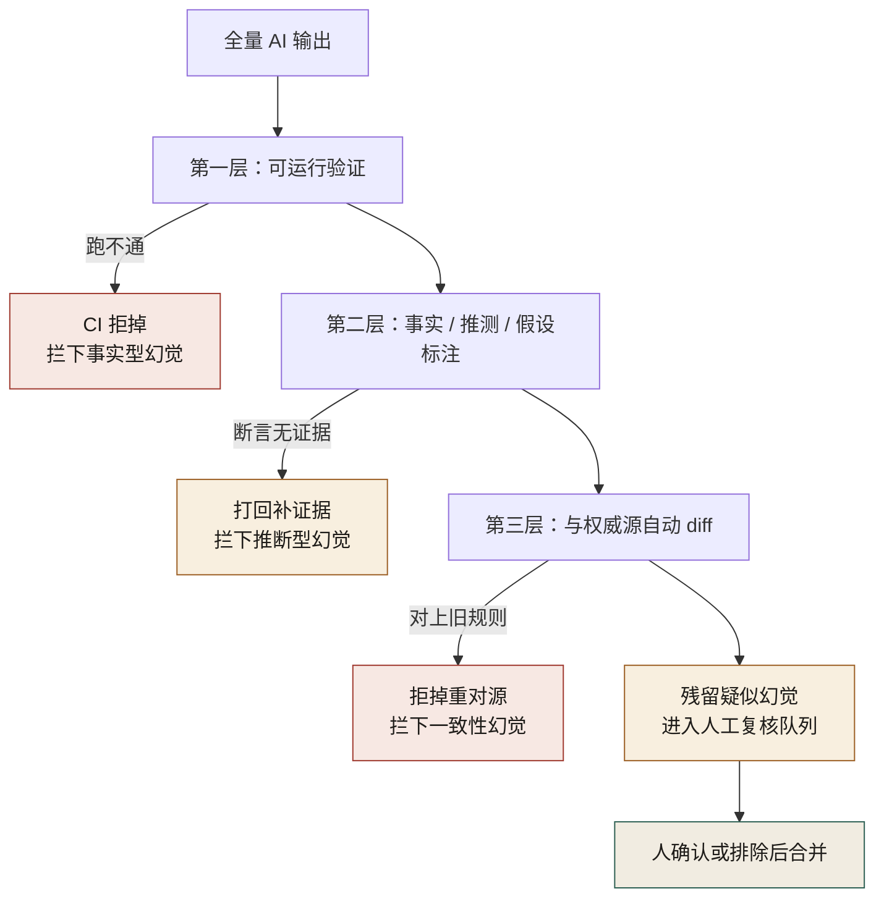
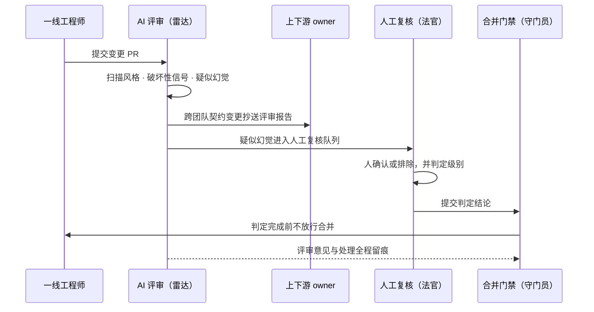

# 第 24 章 AI 评审与幻觉处理

> **本章定位**：治理篇的认知核心。本章是全书被点名的最大债务章——正面回答第 2 章、第 11 章、第 27 章三处遗留问题，并提出全书最重要的概念框架：幻觉的三种类型与"AI 能提醒但不能判定"的责任边界。
> **核心命题**：AI 能提醒、能扫描、能生成候选，但不能判定、不能负责、不能替你签字。雷达和法官是两个角色。

---

## 24.1 问题：三个遗留问题，其实是同一个问题

第 2 章结尾问："**AI 能不能自己识别什么时候该叫人？**"
第 11 章结尾问："**AI 会不会自己留对缝？**"
第 27 章结尾问："**破坏性变更的分级，能不能让 AI 辅助判定？**"

这三章是不同团队、不同阶段、不同场景下提出的，但把它们摆在一起看，会发现它们是同一个问题的三种问法：**AI 生成的产物（代码、契约、留痕、判断）看起来都对，但"对不对"这件事，AI 自己说了不算。**

在一次对账事故中是这样：AI 生成的迁移脚本看起来对，跑起来也对，对账也对——但它漏了一个字段，而它不知道自己漏了。**它不是在骗人，它是真的不知道。**

在一次契约事故中是这样：AI 生成的接口看起来和契约一致，但它对的是"它记忆里的旧契约"，而不是"契约仓库里的最新契约"。**它不是在违约，它是不知道契约已经变了。**

在一次合规事故中是这样：AI 辅助生成的 PR 看起来合规，但它"合规"的判断依据是形式（有没有附文件），而不是实质（文件内容是否真的反映了决策）。**它不是在造假，它是把"形式合规"当成了"实质合规"。**

这三类失灵的共同特征，叫做**幻觉（hallucination）**：AI 生成的内容在形式上自洽、在表达上自信，但在事实上可能错——而且它不会主动告诉你它不确定。

---

## 24.2 幻觉的三种类型

在大量实践中，AI 幻觉可以分成三类，应对方式各不相同：

**图 24-1｜幻觉三类型** — 用同一种手段抓三类幻觉，必然漏网；雷达与法官角色不可混。

图 24-1 提示了三类幻觉共用同一个上游——那张"形式自洽 · 表达自信"的卡，这正是从表面分不出三类的原因；往下三条竖线彼此不共边，每条只挂自己那道检验卡。

**① 事实型幻觉（"编造事实"）。** AI 编造一个不存在的 API、一个不存在的字段、一个不存在的库版本。**典型表现**：生成的代码引用了一个看似合理但实际不存在的函数。**应对**：一切 AI 引用的外部符号必须过可运行验证（CI 跑通才算数）。**这类幻觉最容易抓——因为代码跑不起来。**

**② 推断型幻觉（"把推测写成确定"）。** AI 面对不确定的信息时，倾向于给出一个"看起来合理"的答案，而不是说"我不知道"。**典型表现**：考古式重构时 AI 把推测的祖传代码逻辑写成了确定结论；架构梳理时 AI 把不确定的仓库硬塞进某个业务域以求整齐。**应对**：要求 AI 在输出中显式标注"这是事实/这是推测/这是假设"，且"事实"必须附证据引用。**这类幻觉最难抓——因为输出本身是自洽的，只有对照真实世界才知道哪错了。**

**③ 一致性幻觉（"对的是旧版本的对"）。** AI 的输出和它自己记忆里的某套规则一致，但那套规则已经不是当前规则。**典型表现**：契约事故里 AI 对的契约是它训练数据里见过的旧版本；对账事故里 AI 漏掉的字段是它"觉得不重要"的字段。**应对**：任何"应该和某个权威源一致"的产物（契约、配置、schema），必须和权威源做自动 diff，不一致即拒。**这类幻觉最隐蔽——因为 AI 不是在错，它是在"对着一本旧书答题"。**

> **三类型的核心价值在于把"AI 不靠谱"这种模糊的担忧，拆成了三种可识别、可分别应对的工程问题。** 抓不住幻觉，往往不是因为幻觉多，而是因为把三类当成一类来治——用抓事实型幻觉的 CI 去抓一致性幻觉，必然漏网。

把三道应对机制叠成一条漏斗，就能看清"哪类幻觉被哪一层拦下、漏网的交给谁"：

**图 24-2｜幻觉拦截漏斗** — 三层自动化拦截各对一类幻觉，漏网的进人工复核队列由人兜底——自动化负责收窄范围，人只判残留。

图 24-2 的读法是分清主线与分支：主线是"可运行验证 → 标注 → 与权威源 diff"逐级下探的漏斗，"CI 拒掉""打回补证据""拒掉重对源"三张红卡全在分支上、不带走漏斗下游；最终进人工复核队列的，只是穿透三层之后的残留——人接的是自动化收窄后的剩余，不是全量。

---

## 24.3 回答三个遗留问题

现在正面回答三章的债务。

**① 第 2 章问："AI 能不能自己识别什么时候该叫人？"**
答：**不能判定，但能提醒。** 提示词库里的"must_intervene"字段——凡是涉及到资金、合规、删除、权限提升的操作，AI 必须在输出里显式打出"此处需人介入"的标记。**但这个标记是提示词强制的，不是 AI "自己想到要叫人"。** 换句话说：**「叫人」的动作可以被自动化，但「该不该叫人」的判断规则是人定的、写死在提示词里的。** AI 不会自己学会什么时候该叫人——它只会忠实执行你告诉它的"叫人触发条件"。如果触发条件没覆盖到的场景，它就不会叫——对账事故就是触发条件没覆盖"字段完整性"这个场景。

**② 第 11 章问："AI 会不会自己留对缝？"**
答：**能生成"看起来像缝"的结构，但不能判断"对不对缝"。** 留缝五步法里，AI 可以帮你生成扩展点的代码骨架（abstract method、plugin interface、配置占位符），这些在形式上都"像缝"。但"这个缝留得对不对、会不会被用到、将来会不会成为包袱"——这是架构判断，AI 做不了。**实践中的做法是：AI 生成缝的候选，由人决定留不留、留多大。** import-linter 这类自动化检查只能验证"已留的缝有没有被违规穿过"，但不能验证"该留的缝都留了"——后者仍然是人的判断。

**③ 第 27 章问："破坏性变更的分级，能不能让 AI 辅助判定？"**
答：**能辅助识别信号，不能做最终分级。** AI 可以扫一个 diff 然后指出"这里改了公共接口签名、这里删了一个字段、这里改了返回类型"——这些是"破坏性变更的信号"。但"这个破坏是重大的还是可接受的"取决于下游有没有人在用、用在什么场景——这是组织判断，AI 看不到下游的真实使用情况。**做法是：AI 列信号，人定级别。** AI 说"这里有 3 个破坏性信号"，级别（L1 不通知 / L2 通知 / L3 强制会签）由人或确定性规则根据信号数量和类型裁定。

**三问的统一回答**：**AI 能提醒、能辅助识别、能生成候选，但不能做最终判定。** 判定的责任永远在人——这不是技术限制会随模型进步解决，这是责任归属的固有边界。**即使有一天 AI 准确率到 99.99%，那 0.01% 的错谁来负责？答案如果不是"AI"（AI 不能被开除也不能坐牢），那就只能是"人"。既然人是最终责任主体，人就必须是最终判定主体。**

---

## 24.4 AI 评审能做什么：一份能力边界清单

| AI 评审能力 | 能做 | 不能做 |
|------------|------|--------|
| 代码风格检查 | ✅ 自动化，比人快 | — |
| 识别"破坏性变更信号" | ✅ 列出信号 | ❌ 判定破坏的严重程度 |
| 识别疑似幻觉 | ✅ 标记"无引用的断言""与已知不一致" | ❌ 确认这就是幻觉 |
| 安全漏洞扫描 | ✅ 模式匹配已知漏洞 | ❌ 判断业务逻辑层面的安全风险 |
| 性能问题提示 | ✅ 标记明显的 O(n²)、N+1 查询 | ❌ 判断在你的数据量级下这是不是真问题 |
| 架构合理性 | ✅ 对照规范指出偏离 | ❌ 判断偏离是不是有正当理由 |
| 契约一致性 | ✅ 做 diff | ❌ 判断 diff 是 bug 还是有意变更 |
| 合规性 | ✅ 检查形式（有没有留痕） | ❌ 检查实质（留痕是否真实） |

**一句话总结**：AI 评审是"发现信号的雷达"，不是"做决策的法官"。雷达负责扫，法官负责判。**让雷达当法官，就是让对账事故再来一次。**

---

## 24.5 跨团队 AI 评审机制

一开始各团队自己搞 AI 评审，结果标准不一、力度不一、有的团队形同虚设。第 27 章契约治理定了"跨团队契约必须跨团队评审"的原则后，AI 评审也做了统一：

**① 组织级 AI 评审规则集。** 一份全公司统一的"AI 评审检查项"，所有团队的 AI 评审工具必须覆盖。防止"有的团队在认真审，有的团队在走过场"。

**② 跨团队交叉评审。** 涉及跨团队契约的变更，AI 评审报告同时发给上下游团队的 owner。**防止"自己审自己"——对账事故就是迁移团队自己审自己，漏掉的对账需求他们根本不知道存在。**

**③ 幻觉标记的人工复核流程。** AI 评审标记的"疑似幻觉"，进入一个专门的人工复核队列，必须在合并前由人确认或排除。**标记可以被 AI 自动产生，但"这是不是真的幻觉"必须人定。**

**④ 评审报告本身也要留痕。** AI 给了什么评审意见、人怎么处理的，全部记录。**防止"AI 说了但人没看"——如果出了事，要能追溯"当时的评审意见是什么、谁忽略了它"。**

这四条机制落到一次真实变更上，就是三个角色接力、谁也不能越位的时序：

**图 24-3｜雷达、法官、守门员三角色时序** — AI 扫描出信号、人做判定、门禁拦住未判定的合并——提醒、判定、放行三权分立，谁也不能越位。

图 24-3 里 AI 的权限被关在第二条泳道内：它的动作止步于扫描自环和两条分别发往上下游 owner、人工复核的出向线，没有任何一条线直指合并；决定放行的唯一消息是守门员发给工程师的"判定完成前不放行合并"。全图唯一的虚线是评审意见留痕——出了事，"AI 说了但人没看"要靠这条线追责。

---

## 24.6 产出物：AI 评审规范（附录 D）

- **AI 评审能力边界清单**（如 24.4 表格）
- **幻觉三类型识别手册**（事实型/推断型/一致性幻觉的识别信号与应对）
- **人工复核队列标准**（哪些 AI 标记必须人确认）
- **跨团队交叉评审触发条件**（涉及跨团队契约即触发）

> **代价声明**：AI 评审上线后，约 15% 的 PR 会进入人工复核队列，平均每个多花 20 分钟。**这意味着每天全公司大约多出 40 小时的人工复核工作量——相当于 5 个全职工程师。** 这是实打实的人力成本。但风控负责人在评审会上的算法是绕不开的："**对账事故那 47 分钟，花了约 ¥86 万。算一算 5 个工程师一年多少钱，然后判断这笔账划不划算。**"

---

## 24.7 四案例映射

本章的幻觉三类型与"AI 能提醒但不能判定"的责任边界，在四个案例中分别对应不同的失灵形态：

| 案例 | 主要失灵形态 | 幻觉类型 | 角色映射 | 应对机制 |
|------|------------|---------|---------|---------|
| 案例一·电商平台 | 形式合规但实质未留痕 | 一致性幻觉 | 决策层、治理负责人、一线、合规 | must_intervene 焊死、人工复核队列、评审报告留痕 |
| 案例二·海星交易所 | 迁移漏字段且 AI 不自知 | 一致性 + 事实型 | 风控总监、CTO、SRE、合规总监 | CI 可运行验证、交叉评审、契约自动 diff |
| 案例三·暗流资本 | 把策略推测写成确定 | 推断型幻觉 | 首席风控、策略主管、审计工程师、CFO | 事实/推测/假设标注、证据引用、人工分级 |
| 案例四·守夜人科技 | 对着旧契约答题 | 一致性幻觉 | CTO、安全负责人、运维 | 与权威源自动 diff、破坏性变更人定级 |

---

## 24.8 公开参照（可核实）

[DORA Insights（2025-06-30）](https://dora.dev/insights/concerns-beyond-accuracy-of-ai-output/) 基于 8 次深度访谈指出：开发者对 gen AI 的顾虑**远不止准确率**，半数以上参与者至少提到数据隐私、技能退化、岗位替代、恶意使用、开发文化中的某一类。DORA 给出的工程应对包括**加强评审与自动化测试**，以及**在部署前用沙箱隔离运行 AI 生成代码**。

这与本章「雷达 / 法官」分工一致：**幻觉是必要但不充分的风险清单**；评审体系必须同时覆盖「说错」与「说对了却做错权限、泄数据、留下不可逆变更」。

[NIST AI RMF 1.0（2023-01-26）](https://www.nist.gov/itl/ai-risk-management-framework) 的 Govern–Map–Measure–Manage 可作为本章机制的外部对照语言。

---

## 24.9 检查清单（关于 AI 评审与幻觉处理本身）

- [ ] 你有没有一份"AI 能做什么不能做什么"的明确清单？没有 = 全公司在盲目信任或盲目排斥。
- [ ] 你的 AI 评审标记有没有人工复核闭环？没有 = 标记了等于没标记。
- [ ] 你的 AI 评审能识别三类幻觉吗？只能抓事实型的 = 推断型和一致性幻觉在漏网。
- [ ] 跨团队的变更有交叉评审吗？没有 = "自己审自己"在等你。
- [ ] 评审报告留痕了吗？没有 = 出事后没法追溯谁忽略了什么。
- [ ] 你有没有把"判定权"交给了 AI？有 = 你把责任交给了不能负责的东西。

---

## 24.9 遗留问题

- **幻觉率能不能降到 0？** 不能。幻觉是当前大模型架构的固有特性（基于概率的生成必然有偏离事实的概率）。能做的是"提高发现率"和"降低依赖单次输出的风险"，但不能消除。**接受幻觉的存在，是使用 AI 的前提。**
- **AI 评审的评审（元评审）谁来做？** 用 AI 审 AI 生成的代码，那审 AI 评审工具本身的规则集是不是合理，谁来做？目前是人——但这意味着防线最终依赖的是人对规则集的维护，规则集一旦过时，整条防线就过时了。这是一个需要持续投入的运维负担，不是一次性建设。
- **不同模型的幻觉特征不同，规范要不要按模型分？** 目前是模型无关的规范，但实际上不同模型的幻觉高发区域不一样。是否要做"模型 × 场景"的精细化幻觉图谱，是一个待研究的课题。留给后续。

---

> **本章的一句话**：AI 能提醒、能扫描、能生成候选，但不能判定、不能负责、不能替你签字。**雷达和法官是两个角色，把雷达当法官用，就是把发现问题的工具当成了解决问题的工具——而前述三类事故已经告诉我们，这条路通向哪里。** 承认 AI 有做不到的事，不是贬低 AI，是终于诚实地划清了"工具"和"同事"的边界。
