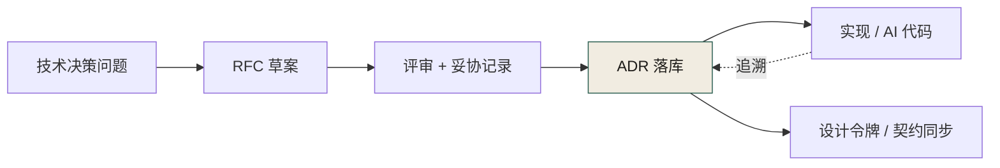
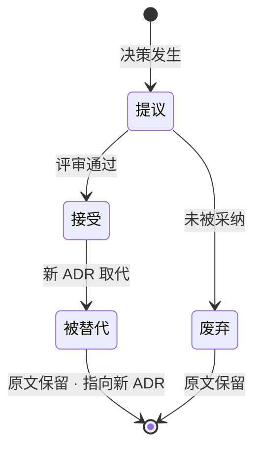

# 第 25 章 文档：ADR、RFC 与设计令牌治理

> **本章定位**：治理篇的文档层基石。本章回答"决策为什么留不下来"这个组织顽疾，并把文档从"事后补的附件"重新定义为"事前定的契约"。
> **核心命题**：文档不是"写完代码后补的附件"，是"写代码前先定的契约"；代码是今天的资产，文档是明天的保险。

**图 25-1｜文档治理环** — 决策先于实现；没有 ADR 的代码在事故复盘时无法回答「谁定的」。

---

## 25.1 问题：一次对账事故复盘时——决策根本无处可查

在一次对账事故的复盘进行到第三天时，调查组问了一个问题："**当初决定不做字段完整性检查，是谁定的？为什么定的？有没有讨论记录？**"

问了五个人，得到五个版本的答案。有人说"是迁移团队自己决定的"，有人说"是评审会上口头同意的"，有人说"根本没人决定，就是漏了"，还有人不记得有过这个讨论。

**最终的结论是：这个决策根本就没有被记录过。它可能发生在某次站会上的口头讨论里，可能发生在某个人的脑子里，但它没有落在任何地方。** 于是当它出问题时，既不能追溯"当初为什么这么定"，也不能判断"这个决定是错的还是执行出了问题"。

这件事暴露了一个比事故本身更深的漏洞：**代码有版本管理，提示词（在第 23 章后）有了版本管理，但决策没有。** 决策散落在会议纪要、聊天记录、个人笔记、口头共识里——一旦人走了（一线工程师的流动率不低），决策的"为什么"就跟着走了。

图 25-1 里那条"追溯"虚线就是为这种复盘时刻准备的：它是全图唯一的反向边，从实现折回 ADR；"谁定的、为什么定"只能由这条边回答，前提是链路前方确实立着 ADR 那张卡，而不是直接从评审跳到了实现。

决策层在复盘会上的概括值得所有组织记下来："**代码丢了你还能重新生成，决策丢了你连为什么这么写都不知道。前者是技术债，后者是认知债——后者比前者贵十倍。**"

---

## 25.2 根因：文档是"事后补的"，不是"事前定的"

**① 文档是"交付物"，不是"准入物"。** 在多数组织的流程里，文档长期是"代码写完之后补的"——这导致文档永远滞后于代码，永远优先级最低，永远在排期里被挤掉。**结果就是：重要的"为什么"没人记，因为大家都去赶"做什么"了。**

**② 没有"决策"和"说明"的区分。** 文档把所有东西混在一起——架构说明、API 文档、决策记录、会议纪要都在一个 wiki 里堆着。**但"我们为什么选 A 不选 B"（决策）和"这个接口怎么用"（说明）是两种完全不同的东西，生命周期不同、读者不同、重要性不同。** 混在一起的结果是决策被说明淹没，没人能从 wiki 里捞出"关键决策有哪些"。

**③ 设计意图没有载体。** 前端多端设计系统统一时，会发现一个惊人的事实：**同一个颜色值，五个端各自在自己的代码里硬编码，谁都不知道"为什么是这个值"——它可能是某个设计师三年前在某次评审上拍板的，但那次评审没有任何记录。** 设计令牌（design token）只是一个值，但"为什么是这个值"是决策，两者必须绑定存在。

---

## 25.3 三类文档，三种治理

把文档分成三类，分别治理：

**① ADR（Architecture Decision Record）——决策记录。**
格式极简：标题、日期、状态（提议/接受/废弃/被替代）、背景、决定、后果。**每条不超过一页。** 关键是"决定"和"后果"——前者记录"我们选了什么"，后者记录"我们知道这会带来什么代价"。

ADR 的核心原则：**不可删除，只能标记为"被替代"。** 哪怕这个决策后来被推翻了，原始 ADR 仍然保留，并指向取代它的新 ADR。**因为"我们曾经这么想，后来改了"本身就是重要的历史。**

ADR 进 git，和代码同一个仓库（或紧邻的文档仓库），每次决策一个 `.md` 文件，编号递增（`ADR-042-对账增加字段完整性检查.md`）。

"不可删除，只能标记为被替代"这条原则，画成状态机最清楚：

**图 25-2｜ADR 生命周期状态机** — ADR 只进不退：状态可以流转、决策可以被推翻，但记录永不删除——被替代的旧 ADR 正是"我们曾经这么想"的历史。

图 25-2 的关键在于没有任何一条箭头指向"删除"这样的状态："被替代"与"废弃"都带着"原文保留"的标注走向终点，前者还要指向取代它的新 ADR——状态流转的是判定，不动的是记录，这就是 ADR 与 wiki 的区别。

**② RFC（Request for Comments）——大改动先讨论。**
当一个改动涉及跨团队、跨域、或属于"不可逆变更"时，不直接写代码，先提 RFC。RFC 格式：标题、作者、背景、提案、替代方案、影响面、反对意见。**RFC 必须挂出来征集评论至少 N 天（典型值是跨团队 3 天、跨域 5 天），过了冷冻期才能进入实施。**

RFC 的灵魂是"替代方案"和"反对意见"——**前者证明"我们考虑过别的路"，后者让反对者留下记录（万一他们是对的，将来复盘能找到）。**

**③ 设计令牌文档——审美也是契约。**
前端多端统一后，所有设计令牌（颜色、间距、字号、圆角、动效时长……）集中在一份设计令牌文档里，每个令牌附 ADR 引用——**「为什么主色是这个值」指向某条 ADR。** 令牌变了，要么更新 ADR，要么新开一条。**设计令牌不是"参考值"，是"有决策背景的契约"。**

---

## 25.4 回答第 11 章遗留：留缝取舍写进 ADR

第 11 章结尾问："**留缝取舍要不要写进 ADR？**"

本章正面回答：**必须写。每一条留的缝，都必须有一条对应的 ADR。**

为什么？因为"留缝"本质上是一个**预测性决策**——你在预测"将来这里会需要扩展"。预测可能对也可能错，但不管对错，**「当初为什么这么预测」必须留下来。** 因为：

- 如果将来真的扩展了，这条 ADR 帮助接手的人理解"这个缝是为谁留的、预期是什么场景"。
- 如果将来没扩展到，这条 ADR 帮助评审的人判断"这个缝要不要填掉（它可能在引入不必要的复杂度）"。
- 如果出了 bug 和这个缝有关，这条 ADR 帮助调查者理解"这是有意留的还是无意漏的"。

**ADR 的模板里加了一个可选字段：`seam-rationale`（留缝理由）。如果一条 ADR 涉及到留缝，这个字段必填。** 内容包括：预期扩展场景、预计多久会扩展、如果不扩展的废弃条件。

这和 import-linter 自动化检查形成闭环——**linter 检查"缝有没有被违规穿过"，ADR 记录"缝为什么在这、该不该留着"。** 前者是机器能做的，后者是人必须做的。

---

## 25.5 角色博弈：文档谁写、谁维护、谁负责

这场博弈比想象中激烈。文档治理涉及多方，各自的立场天然冲突：

**多端负责人的立场**："RFC 冷冻期太长了，5 天等不起。互联网速度就是生命，一个改动等 5 天讨论，黄花菜都凉了。" 他的 KPI 是交付速度。

**合规负责人的立场**："没有 RFC 冷冻期，跨域改动出了事谁负责？我需要冷冻期来保证'反对意见有机会被听到'。" 她的 KPI 是合规零事故。

**一线工程师的立场**："ADR 一条一页纸我都嫌多，让我每个留缝都写 ADR，我一天写 10 个缝光写文档了。" 这代表了一线对"文档负担"的真实抗拒。

**最终妥协（没有人全额赢）**：
- 多端负责人拿到了"紧急通道"——标记为"紧急"的 RFC 可以把冷冻期压到 24 小时，但紧急 RFC 必须在事后补一份"为什么紧急"的说明，且滥用紧急通道（季度紧急率 >20%）会被治理委员会质询。**速度让步了，但有问责。**
- 合规负责人拿到了冷冻期和反对意见留痕，但接受紧急通道的存在——前提是滥用有惩罚。**合规让了一步，但加了护栏。**
- 一线工程师拿到了"ADR 一页纸"的承诺——每条 ADR 不超过一页，超过说明你在写小说不在写决策。此外，**AI 可以辅助起草 ADR（根据 diff 和讨论记录自动生成初稿），人只需要审和改。** 这把文档负担从"30 分钟手写"降到了"5 分钟审改"。**负担让步了，但 ADR 的存在不可商量。**
- 治理负责人拿到一套可执行的文档治理规范——但要背"RFC 冷冻期的执行率"和"ADR 覆盖率"两个指标。

---

## 25.6 AI 在文档治理中的角色

**① AI 能做的：**
- 根据 PR 的 diff 和关联的讨论（聊天、会议纪要），自动起草 ADR 初稿。
- 检测"有决策但没 ADR"的场景——比如一个涉及架构的 PR 没有关联任何 ADR，自动提醒。
- 根据代码变更自动更新 API 文档（说明类文档）。
- 检测 ADR 之间的冲突——如果新 ADR 和某条未废弃的旧 ADR 矛盾，提醒作者处理。

**② AI 不能做的：**
- **判断"这个决策值不值得写 ADR"。** 什么算"重要决策"需要人定，AI 只能识别"这看起来像架构变更"的信号。
- **写"后果"和"替代方案"。** 这两个字段需要对未来的预判和对历史的了解——AI 能列候选项，但"我们为什么不选 B"的判断是人做的。
- **判断 ADR 写得好不好。** 形式上有没有填全可以自动查，但"这条 ADR 是否真的反映了决策的核心纠结"无法自动判定。

---

## 25.7 产出物：文档治理规范（附录 F）

- **ADR 模板与规则**（一页纸、不可删只可替代、留缝必填 `seam-rationale`）
- **RFC 流程**（冷冻期、紧急通道、滥用惩罚）
- **设计令牌治理规范**（令牌集中管理、每条令牌附 ADR 引用）
- **AI 辅助文档生成的边界清单**（能起草不能判定）

> **代价声明**：文档治理规范上线后，涉及架构的 PR 从"提了就合"变成"先提 RFC → 过冷冻期 → 写 ADR → 再合"，平均周期增加 3-5 天。一线工程师每星期大约多花 2 小时在文档上（含 AI 辅助起草后的审改）。**这笔代价买的是"决策层概括的那种认知债不再积累——人走了，决策的'为什么'还在。"** 评审会上的结束语值得反复回味："**代码是你今天的资产，文档是你明天的保险。你现在觉得保险费贵，等你出险那天就知道值不值了。**"

---

## 25.8 四案例映射

本章的 ADR / RFC / 设计令牌三件套，在四个案例中以不同形态出现：

| 案例 | 主要触发场景 | 角色映射 | 落地重点 |
|------|------------|---------|---------|
| 案例一·电商平台 | 对账事故复盘时发现决策无处可查 | 决策层（老陈）、一线工程师（阿杰）、合规负责人（Lily）、多端负责人（小王） | ADR 一页纸不可删、RFC 冷冻期与紧急通道、留缝必填 `seam-rationale` |
| 案例二·加密交易所 | 资金链路架构决策随人走而流失 | 风控负责人（林工）、决策层、一线工程师 | ADR 进 git 与代码同仓、跨团队 RFC 强制 3 天冷冻期、AI 辅助起草降低负担 |
| 案例三·Web3 量化 | 策略扩展点留缝无记录、复盘追不到意图 | 一线工程师、SRE 负责人、决策层 | 每条留缝对应一条 ADR、import-linter 与 ADR 双闭环、设计意图显式化 |
| 案例四·安全初创 | 多端设计令牌硬编码、审美黑洞 | 多端负责人、合规负责人、一线工程师 | 设计令牌集中文档、每令牌附 ADR 引用、AI 辅助检测"有决策没 ADR" |

---

## 25.9 公开参照（可核实）

ADR 的经典公开出处是 [Michael Nygard《Documenting Architecture Decisions》（2011-11-15）](https://cognitect.com/blog/2011/11/15/documenting-architecture-decisions)：短文进仓库，固定 Title / Context / Decision / Status / Consequences；决策被取代时保留旧文并标记 superseded。本章的「事前契约式文档」与该形态同源，并额外要求与 AI 生成物、契约仓库、设计令牌互相引用。

[NIST AI RMF](https://www.nist.gov/itl/ai-risk-management-framework) 可作为治理侧的外部语言：Map 决策与风险，Measure 文档与留痕完整度，Manage 变更与废弃。

---

## 25.10 检查清单（关于文档治理本身）

- [ ] 你的关键架构决策有没有 ADR？没有 = 你在积累认知债。
- [ ] 你的 ADR 能不能追溯到代码变更？不能 = 文档和代码脱节了。
- [ ] 你的留缝有没有写 ADR？没有 = 第 11 章的债没还。
- [ ] 你的跨团队改动有没有 RFC 冷冻期？没有 = 反对意见没机会被听到。
- [ ] 你的设计令牌有没有"为什么是这个值"的记录？没有 = 审美黑洞。
- [ ] 你的文档是"事后补"还是"事前定"？事后 = 永远滞后永远被挤掉。
- [ ] 你的 ADR 是不可删的还是可以随手删？可删 = 你没有真正的决策历史。

---

## 25.11 遗留问题

- **ADR 的数量会不会爆炸？** 如果每个小决策都写 ADR，几年下来可能有上千条。检索和"哪条还有效"会成为问题。应对方式是编号 + 状态标签 + 定期归档（废弃的统一移入 `superseded/` 目录），但长期来看需要更好的工具。留待迭代。
- **RFC 的冷冻期在不同文化里怎么调？** 典型值是 3-5 天，但有的组织可能觉得太长或太短。这没有标准答案，只有"反对意见实际需要多久才能被看到"的实证调参。
- **文档治理本身的治理？** 有了规范，但"规范有没有被执行"谁来查？目前靠治理委员会季度抽查，但抽查有盲区。这是一个元问题——治理的治理——可能永远没有完美解，只有持续的 vigilance。

---

> **本章的一句话**：代码是今天的资产，文档是明天的保险——而决策记录是保险里最贵的那一份。**ADR 守的是"为什么"，RFC 守的是"有没有人反对"，设计令牌守的是"审美也能被追溯"。** 三者合在一起，回答的是一个根本问题：当人走了，组织的记忆怎么留下来。AI 能帮你起草，但"这值不值得记下来"的判断永远是人做的——因为只有人知道，哪些决定会在三年后被翻出来追问。
