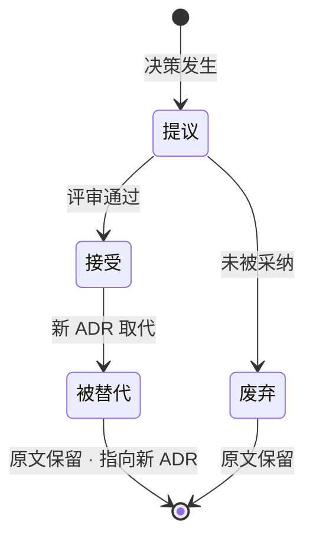
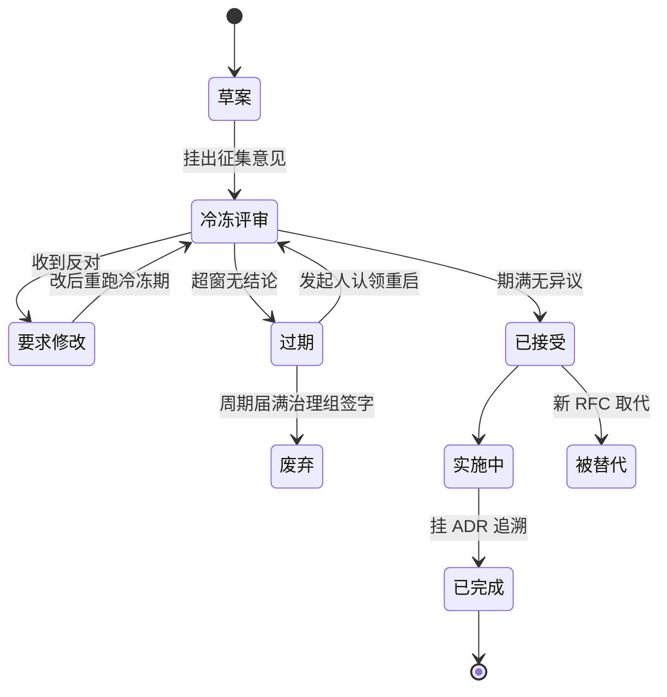
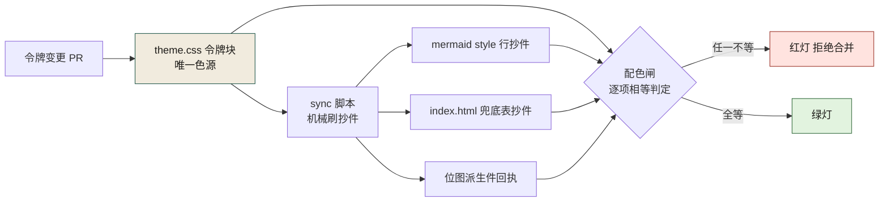
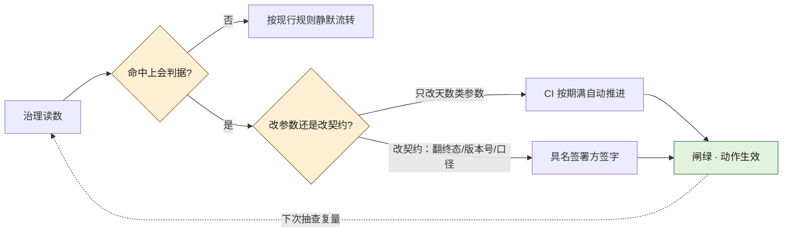

# 第 25 章 文档：ADR、RFC 与设计令牌治理

> **本章定位**：治理篇的文档层基石。本章回答"决策为什么留不下来"这个组织顽疾，并把文档从"事后补的附件"重新定义为"事前定的契约"。
> **核心命题**：文档不是"写完代码后补的附件"，是"写代码前先定的契约"；代码是今天的资产，文档是明天的保险。


**图 25-1｜文档治理环** — 决策先于实现；没有 ADR 的代码在事故复盘时无法回答「谁定的」。

---

## 25.1 问题：一次对账事故复盘时——决策根本无处可查

在一次对账事故的复盘进行到第三天时，调查组问了一个问题："**当初决定不做字段完整性检查，是谁定的？为什么定的？有没有讨论记录？**"

问了五个人，得到五个版本的答案。有人说"是迁移团队自己决定的"，有人说"是评审会上口头同意的"，有人说"根本没人决定，就是漏了"，还有人不记得有过这个讨论。

**最终的结论是：这个决策根本就没有被记录过。它可能发生在某次站会上的口头讨论里，可能发生在某个人的脑子里，但它没有落在任何地方。** 于是当它出问题时，既不能追溯"当初为什么这么定"，也不能判断"这个决定是错的还是执行出了问题"。

这件事暴露了一个比事故本身更深的漏洞：**代码有版本管理，提示词（在第 23 章后）有了版本管理，但决策没有。** 决策散落在会议纪要、聊天记录、个人笔记、口头共识里——一旦人走了（一线工程师的流动率不低），决策的"为什么"就跟着走了。

图 25-1 里那条"追溯"虚线就是为这种复盘时刻准备的：它是全图唯一的反向边，从实现折回 ADR；"谁定的、为什么定"只能由这条边回答，前提是链路前方确实立着 ADR 那张卡，而不是直接从评审跳到了实现。

决策层在复盘会上的概括值得所有组织记下来："**代码丢了你还能重新生成，决策丢了你连为什么这么写都不知道。前者是技术债，后者是认知债——后者比前者贵十倍。**"

---

## 25.2 根因：文档是"事后补的"，不是"事前定的"

**① 文档是"交付物"，不是"准入物"。** 在多数组织的流程里，文档长期是"代码写完之后补的"——这导致文档永远滞后于代码，永远优先级最低，永远在排期里被挤掉。**结果就是：重要的"为什么"没人记，因为大家都去赶"做什么"了。**

**② 没有"决策"和"说明"的区分。** 文档把所有东西混在一起——架构说明、API 文档、决策记录、会议纪要都在一个 wiki 里堆着。**但"我们为什么选 A 不选 B"（决策）和"这个接口怎么用"（说明）是两种完全不同的东西，生命周期不同、读者不同、重要性不同。** 混在一起的结果是决策被说明淹没，没人能从 wiki 里捞出"关键决策有哪些"。

**③ 设计意图没有载体。** 前端多端设计系统统一时，会发现一个惊人的事实：**同一个颜色值，五个端各自在自己的代码里硬编码，谁都不知道"为什么是这个值"——它可能是某个设计师三年前在某次评审上拍板的，但那次评审没有任何记录。** 设计令牌（design token）只是一个值，但"为什么是这个值"是决策，两者必须绑定存在。

---

## 25.3 三类文档，三种治理

把文档分成三类，分别治理：

**① ADR（Architecture Decision Record）——决策记录。**
格式极简：标题、日期、状态（提议/接受/废弃/被替代）、背景、决定、后果。**每条不超过一页。** 关键是"决定"和"后果"——前者记录"我们选了什么"，后者记录"我们知道这会带来什么代价"。

ADR 的核心原则：**不可删除，只能标记为"被替代"。** 哪怕这个决策后来被推翻了，原始 ADR 仍然保留，并指向取代它的新 ADR。**因为"我们曾经这么想，后来改了"本身就是重要的历史。**

ADR 进 git，和代码同一个仓库（或紧邻的文档仓库），每次决策一个 `.md` 文件，编号递增（`ADR-042-对账增加字段完整性检查.md`）。

"不可删除，只能标记为被替代"这条原则，画成状态机最清楚：



**图 25-2｜ADR 生命周期状态机** — ADR 只进不退：状态可以流转、决策可以被推翻，但记录永不删除——被替代的旧 ADR 正是"我们曾经这么想"的历史。

图 25-2 的关键在于没有任何一条箭头指向"删除"这样的状态："被替代"与"废弃"都带着"原文保留"的标注走向终点，前者还要指向取代它的新 ADR——状态流转的是判定，不动的是记录，这就是 ADR 与 wiki 的区别。

**② RFC（Request for Comments）——大改动先讨论。**
当一个改动涉及跨团队、跨域、或属于"不可逆变更"时，不直接写代码，先提 RFC。RFC 格式：标题、作者、背景、提案、替代方案、影响面、反对意见。**RFC 必须挂出来征集评论至少 N 天（典型值是跨团队 3 天、跨域 5 天），过了冷冻期才能进入实施。**

RFC 的灵魂是"替代方案"和"反对意见"——**前者证明"我们考虑过别的路"，后者让反对者留下记录（万一他们是对的，将来复盘能找到）。**

**③ 设计令牌文档——审美也是契约。**
前端多端统一后，所有设计令牌（颜色、间距、字号、圆角、动效时长……）集中在一份设计令牌文档里，每个令牌附 ADR 引用——**「为什么主色是这个值」指向某条 ADR。** 令牌变了，要么更新 ADR，要么新开一条。**设计令牌不是"参考值"，是"有决策背景的契约"。**

---

## 25.3b 可抄实现件：ADR 模板、RFC 状态机与 docs-as-code 门禁

25.3 说了三类文档"各管什么"；这一节给"长什么样、CI 里哪一行拒绝"。组织需要它们，是因为"决策进 git"这句话如果落不到模板与门禁上，最后只会得到一个没人看的 `docs/adr/` 目录。四件可抄工件加一条从本书站点提炼的通用纪律。

### ADR 模板：MADR 字段逐项，一份完整可抄示例

社区事实标准 MADR 的字段骨架（B 档，按模板规范口径）：**Status / Context / Decision drivers / Considered options / Pros and cons of considered options / Decision outcome / Consequences**。对照 25.3 的承诺：`Considered options` 就是"替代方案"，`Pros and cons` 就是"反对意见的位置"——**一页纸不是排版要求，是每个字段都只许写决策本身**。各字段与复盘之问的对位：

| MADR 字段 | 回答复盘之问 | 机器判据 |
|-----------|-------------|---------|
| Status | 这条还算数吗 | 枚举值，CI 可判（见下节同款） |
| Context | 当时世界长什么样 | 必填非空 |
| Considered options | 为什么不选 B | 条数下限（不许"无备胎"决策） |
| Consequences | 我们知道代价是什么 | 必填非空 |
| Links | 谁替代了谁、哪条缝为它而留 | 引用可解析（第 24 章 24.5b 引用门同款形状） |

一份完整可抄的 ADR（内容全部取自本书既有机制——那次对账事故、第 9 章契约仓、第 24 章机检门——不引入任何新事实）：

```markdown
# ADR-042 对账链路增加字段完整性检查

## 状态
已接受（事故复盘后补记：原决策从未被记录，本条为追认——见 25.1）

## 背景
迁移把订单结算字段并入对账链路时，AI 生成的迁移脚本漏掉一个对账字段；
它"对的"是自己记忆里的旧表结构，不是权威源。复盘时没人说得出
"字段完整性检查做不做"是谁定的——因为它从没被写下来。

## 决策驱动
- 对账差异要机器发现，不能等人工核对
- 约束要长期在位，不能藏在一次性脚本里
- AI 产物不享有"看起来跑通了"的豁免

## 考虑的选项
1. 人工定期核对——否：人不会自证完整（第 1 章）
2. 迁移脚本内置一次性核对——否：脚本跑完，约束就死了
3. 对账服务常驻"字段完整性检查" + 契约自动 diff——选

## 决策
采用选项 3：字段清单以契约仓为唯一正本，实现与契约做自动 diff（第 9 章），
检查逻辑作为常态不变量进测试面（第 10 章）；AI 生成的迁移脚本必须过
第 24 章的四道机检门。

## 后果
正面：漏字段从"事后发现"变成"CI 里发现"。
负面：字段变更多一道契约 diff 评审，迁移周期变长；这个代价要认，
不接受"零代价"话术。

## 关联
- 取代：无（新增）
- 留缝：无，seam-rationale 不适用（25.4 口径）
```

它什么时候失效：**ADR 写出来那天最可信，一年后最危险**——背景字段里的世界已经变了，决策还在被引用。所以 ADR 必须配时效核验（下节的第二道判据），过期 ADR 的 Status 翻不动，就是 25.2 说的"认知债换了个仓库继续积累"。

### RFC 评审状态机：状态是门禁字段，不是标签

25.3 给 RFC 定了冷冻期，但"冷冻期"想可执行，得先把状态做成机器读得懂的字段（示意值）：

```yaml
# rfc/0042-field-completeness.md 的 front matter（示意）
rfc: "0042"
title: "对账链路增加字段完整性检查"
author: 结算域-工程师甲        # 具名发起人：过期认领判据挂在这个人身上
status: in_review              # 枚举见下表，CI 只认这七个值
cooling_days: 3                # 冷冻期（示意），跨团队 3 天 / 跨域 5 天口径见 25.3
emergency: false               # 紧急通道按 25.5：压到 24 小时 + 事后补说明
reviewers: [交易域-TL, 风控负责人]
decided_on: null               # 进终态时由 CI 写入，人不手填
```

状态表（谁能翻、翻了 CI 干什么）：

| status | 允许停留 | 谁能翻走 | 翻动条件与 CI 动作 |
|--------|---------|---------|-------------------|
| draft | 不限 | 发起人 | 挂出即转 in_review，冷冻计时开始 |
| in_review | cooling_days | 任一点名 reviewer | 反对 → changes_requested；期满无异议 → accepted |
| changes_requested | 重新计时 | 发起人 | 改后回 in_review，**冷冻期重跑** |
| accepted | 一个发版周期 | 系统 | 无实现挂接即停发版号（下下节） |
| implemented | — | 系统 | 必须携带所依据 ADR 的路径，否则门禁拒绝 |
| stale | 一个评审周期 | author 或治理组 | 认领 → 回 in_review；到期无认领 → abandoned |
| abandoned / superseded | 终态 | 见过期判据 | 原文保留，只翻状态（25.3 ADR 同款纪律） |

**过期 RFC 谁来关**——这条判据必须写成一句可判的话：关闭权归发起人，但"变成 stale"归 CI：冷冻期满再加一个无动作窗口（示意取 30 天），机器自动翻 stale、点名 author 与 reviewers、PR 变红；stale 再挂一个评审周期无人认领，治理组有权翻 abandoned，**但必须留一条署名 commit——作废要人签字，机器只负责把"没人签字"这件事喊出来。** 状态流转画出来：



**图 25-3｜RFC 评审状态机** — 冷冻期重跑、过期自动点名、作废必须签字：状态字段的每一次翻动都有具名主语和机器判据。

图 25-3 和图 25-2 是同一套纪律的两个半径：ADR 状态机管"定了之后"，RFC 状态机管"定之前"；两条机器线——期满自动推进、超窗自动打红——是 25.5 那场"冷冻期太长了"博弈能收口的原因：让步落在参数（天数）上，不落在这条线在不在。

### docs-as-code 的 CI 判据：链接、时效、示例可编译

25.7 的产出物叫"文档治理规范"，规范想不被挤掉，得像代码一样有红灯。三类判据各一条，形状示意（B 档：判据本身在第 24 章 24.5b 本机实跑过，这里只给接进 CI 的摆法）：

```yaml
# .github/workflows/docs-ci.yml 的 steps（形状示意）
- name: 链接与节号核验           # 判据①：假链接、编造的小节号当场红
  run: python3 scripts/check_refs.py docs/
- name: 时效核验                 # 判据②：超窗文档路由 Owner，不许悄悄挂着
  run: python3 scripts/check_freshness.py docs/adr --window 180
- name: 示例可编译               # 判据③：抽 python 围栏块过 py_compile
  run: python3 scripts/check_examples.py docs/ --lang python
```

三条判据各自的要害一行：

```python
# 时效判据的核心（示意）：防"盖章续时效"
age = (today - last_verified).days
stale = age > window_days                                   # 超窗 = 红，路由 Owner 复验
wash  = (last_verified == today) and not body_changed_in_pr # 正文没改、时间戳却前移 = 也是红
```

- **链接**：目标文件与"见 N.x"小节号必须解析得到实物——第 24 章 24.5b 引用门的原样复用。本书站自己的同款是 `scripts/check_links.py`（第二条守卫）。
- **时效**：`last_verified` 只许在正文确有变更的同一 PR 里前进——否则过期文档靠盖章续命，判据形同虚设。
- **示例可编译**：抽围栏块真编译，最低档 `python3 -m py_compile`；其他语言的示例按各自工具链在 CI 镜像里验，**本仓库没装的语言工具一律不声称跑过**，宁可把该语言的判据降成 warning 并注明原因，也别放假绿灯。

**这套判据替代不了什么**：它查得出"链到不存在的小节"，查不出"存在的小节写错了"——语义仍然是人的活，与 25.6 的边界清单同一条线。

### CHANGELOG 与 semver：版本号的下界是机器判的

semver 三个位的语义（B 档，规范本身）：**MAJOR** 不兼容变更、**MINOR** 向下兼容的新增、**PATCH** 向下兼容的修复。Keep a Changelog 给叙事侧的六个段落：Added / Changed / Deprecated / Removed / Fixed / Security。两者的关系是这本书反复用惯的那句口径的发布版：**semver 是机器可判的下界，CHANGELOG 是人写的叙事**——版本号步长不是发版人拍脑袋，是兼容性判定的输出：

| 判定输入（第 9 章 / 第 27 章的兼容 diff） | 版本号必须 | CHANGELOG 必须 |
|------------------------------------------|-----------|----------------|
| 存在破坏性变更 | MAJOR +1 | Removed / Changed 段有条目 |
| 仅新增兼容能力 | MINOR +1 | Added 段有条目 |
| 仅修复 | PATCH +1 | Fixed 段有条目 |

发版门的拒绝行形状：CHANGELOG 写着 `### Added` 而版本号只动 PATCH → 红；兼容性 diff 判了 breaking 而版本号没升 MAJOR → 红。**两个信号不一致时，以 diff 判定为准、版本号回改**——叙事服从判据，不是反过来。

### 令牌治理：以本书站点自己为样本——"抄件要登记"

25.2 根因③的病灶是"同一个颜色值，五个端各自硬编码"。治法本书站点自己就是活样本，三件（可逐一到仓库里核对）：

- `docs/theme.css` 的令牌块是**唯一色源**——文件自己的注释写着"颜色的唯一出处就是这里两个块（`:root` 与深档）"，图版令牌 `--c-plate*` 系列住在这里。
- `scripts/check_palette.py`（第八条守卫）把抄件管起来：令牌块之外不许出现字面量色值；**例外只许以"抄件"身份存在**——书稿 mermaid 的 style 行、站点 JS 的兜底色，逐个必须等于令牌现值，等于才放行。
- `index.html` 的兜底表注释明写"必须与读走的令牌一一对应"——漏一个名字，取不到值时页面就掉色。

现值怎么读，一条命令（**本章故意不抄条数与色值清单——抄了，这段正文就成了第四份抄件；以命令打印的那一行为准**）：

```bash
python3 -c "import importlib.util as u,pathlib;\
s=u.spec_from_file_location('cp','scripts/check_palette.py');\
m=u.module_from_spec(s);s.loader.exec_module(m);\
print(m.parse_tokens(pathlib.Path('docs/theme.css').read_text())[0])"
```

对账与改值的分工也在仓库里：守卫只判"字面值不等于令牌值"，把抄件对齐的活交给同步脚本 `scripts/sync_plate_literals.py`——**改令牌的正路是"改正本 → 跑同步 → 守卫复检"，谁直接编辑抄件谁就是在造第二个事实源。** 这条链画出来：



**图 25-4｜单一色源与抄件登记链** — 派生件可以存在，但每一张都要登记在册、由脚本刷新、被守卫逐项对账；手抄的瞬间就是第二个事实源诞生的瞬间。

图 25-4 的读法：左半张是"值怎么流"（正本 → 同步 → 抄件），右半张是"账怎么对"（正本与全部抄件同送配色闸）——两条线都从令牌块出发，意味着任何绕过同步脚本直接写进抄件的改动，都过不了右半张那个菱形。把这套机制蒸馏成通用纪律，三句话，任何"一处正本、N 处抄件"的场景（版本号、契约快照、配置模板）都适用：

1. **正本清单化**：每个事实域承认恰好一个正本，其余同值内容一律自我标注为抄件。
2. **抄件必须登记**：守卫逐条核对"抄件值 = 正本现值"；未登记的抄件等于未登记的依赖。
3. **对齐是脚本的活**：改正本 → 跑同步 → 复检；人的手不碰抄件，碰抄件的 PR 直接红。

设计令牌与视觉回归基线的完整治理（构建期展开、运行期 `var()` 的失效面）在 [第 15 章](./ch20-第15章-前端解耦多端设计系统.md)，本节只取"抄件要登记"这一刀，不重复。

**这套纪律什么时候会失效**：正本和抄件同时被人改、守卫还没来得及跑——所以同步与对账必须挂在合并门禁上而不是夜里跑批；挂夜里的闸，赌的是没人白天出事。

---

## 25.4 回答第 11 章遗留：留缝取舍写进 ADR

第 11 章结尾问："**留缝取舍要不要写进 ADR？**"

本章正面回答：**必须写。每一条留的缝，都必须有一条对应的 ADR。**

为什么？因为"留缝"本质上是一个**预测性决策**——你在预测"将来这里会需要扩展"。预测可能对也可能错，但不管对错，**「当初为什么这么预测」必须留下来。** 因为：

- 如果将来真的扩展了，这条 ADR 帮助接手的人理解"这个缝是为谁留的、预期是什么场景"。
- 如果将来没扩展到，这条 ADR 帮助评审的人判断"这个缝要不要填掉（它可能在引入不必要的复杂度）"。
- 如果出了 bug 和这个缝有关，这条 ADR 帮助调查者理解"这是有意留的还是无意漏的"。

**ADR 的模板里加了一个可选字段：`seam-rationale`（留缝理由）。如果一条 ADR 涉及到留缝，这个字段必填。** 内容包括：预期扩展场景、预计多久会扩展、如果不扩展的废弃条件。

这和 import-linter 自动化检查形成闭环——**linter 检查"缝有没有被违规穿过"，ADR 记录"缝为什么在这、该不该留着"。** 前者是机器能做的，后者是人必须做的。

---

## 25.5 角色博弈：文档谁写、谁维护、谁负责

这场博弈比想象中激烈。文档治理涉及多方，各自的立场天然冲突：

**多端负责人的立场**："RFC 冷冻期太长了，5 天等不起。互联网速度就是生命，一个改动等 5 天讨论，黄花菜都凉了。" 他的 KPI 是交付速度。

**合规负责人的立场**："没有 RFC 冷冻期，跨域改动出了事谁负责？我需要冷冻期来保证'反对意见有机会被听到'。" 她的 KPI 是合规零事故。

**一线工程师的立场**："ADR 一条一页纸我都嫌多，让我每个留缝都写 ADR，我一天写 10 个缝光写文档了。" 这代表了一线对"文档负担"的真实抗拒。

**最终妥协（没有人全额赢）**：
- 多端负责人拿到了"紧急通道"——标记为"紧急"的 RFC 可以把冷冻期压到 24 小时，但紧急 RFC 必须在事后补一份"为什么紧急"的说明，且滥用紧急通道（季度紧急率 >20%）会被治理委员会质询。**速度让步了，但有问责。**
- 合规负责人拿到了冷冻期和反对意见留痕，但接受紧急通道的存在——前提是滥用有惩罚。**合规让了一步，但加了护栏。**
- 一线工程师拿到了"ADR 一页纸"的承诺——每条 ADR 不超过一页，超过说明你在写小说不在写决策。此外，**AI 可以辅助起草 ADR（根据 diff 和讨论记录自动生成初稿），人只需要审和改。** 这把文档负担从"30 分钟手写"降到了"5 分钟审改"。**负担让步了，但 ADR 的存在不可商量。**
- 治理负责人拿到一套可执行的文档治理规范——但要背"RFC 冷冻期的执行率"和"ADR 覆盖率"两个指标。

---

## 25.6 AI 在文档治理中的角色

**① AI 能做的：**
- 根据 PR 的 diff 和关联的讨论（聊天、会议纪要），自动起草 ADR 初稿。
- 检测"有决策但没 ADR"的场景——比如一个涉及架构的 PR 没有关联任何 ADR，自动提醒。
- 根据代码变更自动更新 API 文档（说明类文档）。
- 检测 ADR 之间的冲突——如果新 ADR 和某条未废弃的旧 ADR 矛盾，提醒作者处理。

**② AI 不能做的：**
- **判断"这个决策值不值得写 ADR"。** 什么算"重要决策"需要人定，AI 只能识别"这看起来像架构变更"的信号。
- **写"后果"和"替代方案"。** 这两个字段需要对未来的预判和对历史的了解——AI 能列候选项，但"我们为什么不选 B"的判断是人做的。
- **判断 ADR 写得好不好。** 形式上有没有填全可以自动查，但"这条 ADR 是否真的反映了决策的核心纠结"无法自动判定。

---

## 25.6b 治理产物的生效证据清点：哪几件是真闸，哪几件是纸

25.3 定下三类文档的形态，25.3b 把模板、状态机、CI 判据造了出来，25.6 画完人机分工的边界。这一节把本章全部产物翻回证据面：每件产物登记它处于三态中的哪一态——**有产物**（实物在、读数可取）、**产物可造假**（实物在，但它的绿灯可以在机制没生效的情况下照样亮）、**无产物**（机制的说法还在，载体已经不在，这一态最容易被当成"本来就不需要"）。表内读数全部引自本章前文，逐格标出处，不新增任何读数。

| 治理产物（出处） | 职责（现场该拦什么） | 证据三态 | 这条证据怎么读 | 没有产物时退回什么 |
|---|---|---|---|---|
| ADR 模板与 MADR 字段（25.3b） | 复盘之问"谁定的、为什么定、有没有记录"要能在一页纸里答上 | 产物可造假 | `Considered options` 条数是否触到下限——"无备胎"决策是模板形状、复盘内容零（字段对位表原判据）；`Status` 在窗口内翻过没有、正文在同 PR 改过没有（时效判据的两半） | 退回 25.1：问了五个人得到五个版本，复盘进行到第三天才发现决策从没被写下来 |
| RFC 冷冻期与状态字段（25.3 / 25.3b） | 反对意见有被听到的保底窗口（跨团队 3 天、跨域 5 天） | 产物可造假 | `decided_on` 是 CI 写入还是人手填（front matter 明写"人不手填"）；`changes_requested` 回 `in_review` 后冷冻期重跑没有（状态表原条款）；紧急率逼近 20% 质询线而冷冻期执行率同时满格——两个读数互证，必有一个在撒谎（25.5） | 冷冻期退回纸面参数：反对意见仍然可能存在，只是不再保证有人听到 |
| `seam-rationale` 字段（25.4） | 每条缝带着"为谁而留"的预测记录 | 无产物是常态 | import-linter 只答"缝有没有被违规穿过"（机器侧），"缝为什么在这"只存在于 ADR（人侧）——代码里有缝而仓里无对应 ADR，这一格就是无产物，而且 linter 全绿不会替你喊 | 退回 25.10 检查清单点名的那笔债：评审者判不了"缝该不该填掉"，调查者分不清"有意留还是无意漏" |
| 设计令牌表与单一色源（25.3b） | 每个值附 ADR 引用，全部抄件等于现值 | 有产物（本书站点即样本），但有特有的造假形 | 本章故意不抄条数与色值清单，以那条命令打印的一行为准（25.3b 原口径）；暗面是"表的内容正确但已与代码漂移"：同步与对账没挂在合并门禁、挂在夜里跑批，漂移窗口就在两次夜批之间打开 | 退回 25.2 根因③：同一个颜色值五个端各自硬编码，三年前拍板的那次评审没有任何记录 |
| CHANGELOG 与 semver 发版门（25.3b） | 版本号步长来自兼容性 diff 判定，不是拍脑袋 | 产物可造假 | 两种不一致是否真被拒：写着 Added 而版本号只动 PATCH、diff 判了 breaking 而没升 MAJOR——闸不挂发版流水线，判定表就是永远空转的文本 | 退回"叙事服从拍脑袋"：版本号的可信度死在它第一次被人情改动那天 |
| 附录 F 文档治理规范（25.7） | 四条规则（ADR 规则、RFC 流程、令牌治理、AI 边界清单）各自可执行 | 有产物，但执行读数待登记 | 治理负责人背的两个指标（RFC 冷冻期执行率、ADR 覆盖率，25.5）有没有逐季读数、读数有没有生产者——答不出生产者，这格只能降级为"产物可造假" | 退回 25.11 元问题："规范有没有被执行"只剩季度抽查一种手段，而抽查有盲区 |
| AI 辅助起草与边界清单（25.5 / 25.6） | 文档负担降到"5 分钟审改"，但值不值得记、后果、替代方案三样仍归人 | 产物可造假 | 「后果」与「替代方案」两字段有没有人署名认领——这两样恰是 25.6② 判 AI 不能做的，AI 起草后无人认领的 ADR 是"模板齐全、内容空"的标准形态；再核"有决策没 ADR"提醒（25.6①）有没有读者 | 退回 25.5 那笔"30 分钟手写"的旧负担——或者更糟：ADR 数量涨上去（25.11 点名的上千条量级），可捞出来的"为什么"一条没多 |

上表"怎么读"一列全部用同一种读法：**不看产物在不在，看它有没有在它该动的地方动过**。文档治理特有的两种暗面各要点名。第一种是"写了但没人读的 ADR"——模板、字段、编号俱全，与真决策记录唯一的区别是没有人在复盘时把它捞出来；上表的格子读不出这件事，只有复盘之问本身能读（25.1），所以这一列的判据只能挂在"本季复盘是否又问过一次'这谁定的'"——问过一次，说明该期的 ADR 面有写了没读的存货。第二种是"内容正确但已与代码漂移的令牌表"——漂移不是表的病，是更新路径的病：正本 → 同步 → 复检这条链（25.3b 三句纪律）里任何一环没挂上合并门禁、只挂在夜里，表就会长期保持"内容正确"的读数、并在发版那一刻实际错误。缺哪一列会复发什么病：没有三态列，"有产物"和"产物能用"混为一谈，25.2 说的"文档是交付物不是准入物"换个形态复发；没有怎么读列，三态就是手感标签；没有退回列，就没人知道闸红时拦下的到底是什么——那笔账 25.7 代价声明已经写了：架构相关 PR 平均周期增加 3-5 天、一线每星期多花约 2 小时在文档上（25.7），这一节整张表买的就是这些工时不烂成形式。

---

## 25.6c 文档治理决策点表：哪条读数越线走哪道闸、谁签、限多久

25.3b 把超窗、过期、抄件不等做成了 CI 红灯，但红灯只管机器那一半：凡状态字段要翻进终态、契约要改、发版要拒的升级动作，都得有人的名字。这一节把这些升级登记成表：每行 = 读数（标出处）→ 上会判据（什么形状算越线，只写形状不写手感）→ 触发后的动作 → 签署方 → 时限锚。签署方全部沿用本章已出场角色——发起人 / author、治理组、多端负责人、合规负责人、一线工程师、治理负责人、决策层、治理委员会（25.3b / 25.5 / 25.11）；不新增人物，不新增读数。

| 读数（出处） | 上会判据（什么形状算越线） | 触发后的动作 | 签署方 | 时限锚 |
|---|---|---|---|---|
| 季度紧急率（25.5） | 紧急率 >20%；或连续逼近质询线而冷冻期执行率同时满格——两读数互证即有一假 | 治理委员会质询；凡未附事后"为什么紧急"说明的紧急 RFC，逐条补完说明才计入滥用账 | 合规负责人受质询，多端负责人（紧急通道受益方）签补说明 | 季度（治理委员会抽查同框，25.11） |
| RFC 状态停留时长（25.3b 状态表） | `in_review` 超 `cooling_days` 未翻；或 `accepted` 超一个发版周期无实现挂接；或翻 `stale` 后一个评审周期无人认领 | 期满由机器推进；`stale` 被点名后认领即回 `in_review` 重跑冷冻期；到期无认领由治理组翻 `abandoned`，必须留一条署名 commit——作废要人签字，机器只负责把"没人签字"喊出来（25.3b 原文） | 认领由 author（发起人）签，作废由治理组签 | 冷冻期（3 天 / 5 天口径，25.3）＋ 无动作窗口（示意 30 天）＋ 一个评审周期（均 25.3b） |
| 时效窗口与盖章读数（25.3b） | 超 `--window 180` 的窗口线；或 `last_verified` 前移而同 PR 正文未变——"盖章续时效"与超窗同判红 | 路由文档 Owner 复验、PR 变红；复验通过的标志是正文变更与时间戳前移同 PR 出现，缺一不算 | 文档 Owner 签复验结论，治理负责人背执行指标（25.5） | 窗口线 180 天（25.3b 示意值） |
| 版本号与叙事一致性（25.3b） | CHANGELOG 写 Added 而版本号只动 PATCH；或兼容性 diff 判 breaking 而版本号未升 MAJOR——不一致时以 diff 判定为准（原口径） | 发版门拒绝合入版本号；版本号回改、叙事重写，不是反过来 | 发起人重报，治理负责人核这盏红灯没有被绕开 | 每次发版（与 `accepted` 停留"一个发版周期"同框，25.3b） |
| ADR 覆盖率与"有决策没 ADR"提醒（25.5 / 25.6） | 覆盖率读数常绿，而同期的架构相关 PR 仍触发 AI 提醒——分母疑似缩水；或一线审改负担明显偏离"5 分钟审改"基准、ADR 开始成批生成而没人看 | 重算"什么算架构相关 PR"——值不值得记的判断本来就是人的（25.6②）；AI 可起草，但后果与替代方案两字段必须有人署名认领（25.6②） | 一线工程师签真实审改，决策层批"哪类决策算"的口径 | 季度（与抽查同框，25.11） |

这张表的列序不可交换，咬合关系在闭环上：读数先给形状、判据再给动作、动作最后押名字和时限。缺判据列，越线就成了临场手感——正是 25.5 三方立场里每一方都想避免的事；缺签署方列，25.3b 那句分工就断了一条腿——"机器只负责把'没人签字'这件事喊出来"，喊是机器的活，签必须是人的，两者落在同一行的不同列才成立；缺时限锚列，"事后补一份为什么紧急的说明"（25.5）的"事后"永远不到场。这条链画成图 25-5：



**图 25-5｜文档治理决策链** — 上不上会、要不要签字，两个岔口都提前钉在形状上；底部回边让每一次签字成为下一次被量的起点，而不是终点。

读图 25-5 盯三处。第一个菱形之前的"否"分支什么都不拦——没命中判据就按现行规则静默流转，文档治理的提速全靠这一支；中间的黄菱形是全图唯一必须分形状的地方——"只改参数"出口归机器（期满自动推进，25.3b 的两条机器线），"改契约"出口归签字（作废要署名 commit、版本号回改要重报），这条岔口防的是"用调参的名义改契约"；底部回边不产生新动作——签过字的读数下个季度抽查还要再量一遍，环上没有终点站，这与图 25-3 的两条机器线互为表里：线上跑的是自动流转，岔口上方站着的是拍板的人。

---

## 25.6d 文档治理的腐烂判据：规范变成纸之前，先出现的是什么形状

治理章的最后一问最难留给机制本身：这套 ADR / RFC / 令牌三件套的失败形态从来不是"没做过"，是"还在做，但做的事和现场该拦的东西已经对不上"——换个说法：决策记录照常生产，只是不再为复盘而生产。量尺就用本章的产物清单，一件产物一条腐烂信号，证据面全部是前文，不新增读数。

1. **ADR 面——覆盖率与复盘次数反着走。** 覆盖率（25.5 治理负责人的指标）是"挂了 ADR 的架构相关 PR ÷ 架构相关 PR"，分母口径若缩水，分子分母同步缩小、读数只会变好看。免费的交叉核对只有一个：本季复盘桌上"这个当初谁定的"被问了几次——每被问一次（25.1 的形态），该期覆盖率就虚一次；覆盖率涨而复盘追问也涨，两个读数必有一个没在量同一件事。
2. **RFC 面——冷冻期执行率满格，紧急率逼近质询线。** 25.5 的妥协里紧急通道压到 24 小时、季度紧急率 >20% 会被质询。执行率满格而紧急占比逼近线，说明冷冻期只是换了壳：改动都走了快速道，合规负责人要的那句"反对意见有机会被听到"名存实亡——这正是 25.6c 表头一行钉住的互证形状。
3. **令牌面——守卫常绿，但同步与对账不在同一道闸上。** 25.3b 的收束原话："同步与对账必须挂在合并门禁上而不是夜里跑批；挂夜里的闸，赌的是没人白天出事。"腐烂的形状不是抄件报红——挂在夜里时它当场永远绿——而是出现过"守卫还没来得及跑就合了"的 PR：正本与抄件同时被改的那个窗口（25.3b 点名的失效条件），只在夜批口径下才能安静存在。
4. **时效面——所有文档都新鲜，正文却从没改过。** 盖章续时效（25.3b 的 wash 判据）是最高明的腐烂：`last_verified` 永远在窗口内、正文一年一字未动。分辨只需 wash 那行判据真被执行——若它只是示意、没进 CI，全绿的时效读数就是时效列的"仪表盘墙"。
5. **规范面——指标有持有人、没有生产者。** 附录 F 规则俱在（25.7）、两个指标有人背（25.5），但追问"读数由谁生成、多久生成一次"时，答案只剩季度抽查（25.11）——治理的治理停在元问题。这条信号直接点名 25.11 第三条遗留；把它收进腐烂判据表，是为了防它拿"本来就没有完美解"当免检牌。

### 反事实的形状：如果这些判据当时在场，桌上会先看到什么

把本章（及本书点名过的）出现过的漂移与失更形状放回判据桌上，归因就从"人不上心"换成"缺了哪一步可核对"：

| 那次的形状（出处） | 若有判据，桌上先看到的 | 落在哪条信号 |
|---|---|---|
| 复盘到第三日、问五个人得到五个版本（25.1） | "有决策但没 ADR"的提醒（25.6①）在那次迁移 PR 上当场变红——不是事故之后三天补问，是合并当天就拦 | 信号 1（覆盖率的真负对照） |
| 同一个颜色值五个端各自硬编码、三年前拍板无记录（25.2 根因③） | 抄件登记守卫在令牌块之外出现字面量色值的每个 PR 上就红（25.3b）——第一个端可以将就，往后的端一个都进不来 | 信号 3 |
| "ADR 写出来那天最可信，一年后最危险"（25.3b） | 时效判据在正文未变而窗口线（180 天，示意值）到位那天就把文档路由回 Owner——"一年"不再靠人的记性 | 信号 4 |
| 留缝要不要写 ADR，悬到第 11 章结尾、直到本章 25.4 才正面回答 | `seam-rationale` 必填判据挂在引入缝的 PR 上，而不是等一本治理章来"还债"（25.10 检查清单同款之问） | 信号 1（分母口径） |
| 案例二·交易所：资金链路架构决策随人走而流失（25.8 映射） | "不可删除、只能标记被替代"加 ADR 进 git 与代码同仓（25.3）——关键人员办交接那天，git 历史里翻不出"为什么"的条目，本身就是一条看得见的失更读数，而不是离职之后才靠回忆 | 信号 1（写了没人读面） |
| 规范上线后 PR 周期增加 3-5 天、一线每周多花约 2 小时（25.7） | 这两笔代价读数若与执行率、覆盖率同表逐季刷新——代价与收益同桌，质询会才有秤；只刷代价不刷产出，治理会被判"贵"而无对照 | 信号 5 |

这张表咬合在末列上：缺"落在哪条信号"这一列，前四行就只是四个旧案重述，判据表没有回到现在的入口；缺"先看到什么"这一列，反事实就写成对当时人的指责——本列的作用是把归因从人换回缺失的步骤。复审的最小环与 25.6c 同一条：每季度治理委员会抽查开桌先过这五条信号，命中任一条列入议程第一项；而任何一条判据要修订，入场券是同一次抽查里能说出它的证据产物归哪一态——判据自己改自己，改完也要有人签字，这与 25.3b 对 RFC 作废立的规矩是同一款。

最后记一笔诚实账：这一节和 25.6b 用的是同一把尺，五条信号自己也得上那张三态表。本节全部读数引自本章前文，没有引入任何新实跑证据——25.3b 那三条 CI 判据里"本仓库没装的语言工具一律不声称跑过"的口径，同样约束这一节：凡是本章只立了判据、还没有生产者的读数（规范面那条最典型），在 25.6b 的表里就只配"产物可造假"甚至"无产物"一态。如果"判据要有会因它而拒绝执行的读者"这个标准（25.3b 三条判据的形状）哪天在本节缺席，"防腐烂"这一节就是全章最后那张没人读的纸——而附录 F 就当场多出一条没人执行的规则。

---

## 25.7 产出物：文档治理规范（附录 F）

- **ADR 模板与规则**（一页纸、不可删只可替代、留缝必填 `seam-rationale`）
- **RFC 流程**（冷冻期、紧急通道、滥用惩罚）
- **设计令牌治理规范**（令牌集中管理、每条令牌附 ADR 引用）
- **AI 辅助文档生成的边界清单**（能起草不能判定）

> **代价声明**：文档治理规范上线后，涉及架构的 PR 从"提了就合"变成"先提 RFC → 过冷冻期 → 写 ADR → 再合"，平均周期增加 3-5 天。一线工程师每星期大约多花 2 小时在文档上（含 AI 辅助起草后的审改）。**这笔代价买的是"决策层概括的那种认知债不再积累——人走了，决策的'为什么'还在。"** 评审会上的结束语值得反复回味："**代码是你今天的资产，文档是你明天的保险。你现在觉得保险费贵，等你出险那天就知道值不值了。**"

---

## 25.8 四案例映射

本章的 ADR / RFC / 设计令牌三件套，在四个案例中以不同形态出现：

| 案例 | 主要触发场景 | 角色映射 | 落地重点 |
|------|------------|---------|---------|
| 案例一·电商平台 | 对账事故复盘时发现决策无处可查 | 决策层（老陈）、一线工程师（阿杰）、合规负责人（Lily）、多端负责人（小王） | ADR 一页纸不可删、RFC 冷冻期与紧急通道、留缝必填 `seam-rationale` |
| 案例二·加密交易所 | 资金链路架构决策随人走而流失 | 风控负责人（林工）、决策层、一线工程师 | ADR 进 git 与代码同仓、跨团队 RFC 强制 3 天冷冻期、AI 辅助起草降低负担 |
| 案例三·Web3 量化 | 策略扩展点留缝无记录、复盘追不到意图 | 一线工程师、SRE 负责人、决策层 | 每条留缝对应一条 ADR、import-linter 与 ADR 双闭环、设计意图显式化 |
| 案例四·安全初创 | 多端设计令牌硬编码、审美黑洞 | 多端负责人、合规负责人、一线工程师 | 设计令牌集中文档、每令牌附 ADR 引用、AI 辅助检测"有决策没 ADR" |

---

## 25.9 公开参照（可核实）

ADR 的经典公开出处是 [Michael Nygard《Documenting Architecture Decisions》（2011-11-15）](https://cognitect.com/blog/2011/11/15/documenting-architecture-decisions)：短文进仓库，固定 Title / Context / Decision / Status / Consequences；决策被取代时保留旧文并标记 superseded。本章的「事前契约式文档」与该形态同源，并额外要求与 AI 生成物、契约仓库、设计令牌互相引用。

[NIST AI RMF](https://www.nist.gov/itl/ai-risk-management-framework) 可作为治理侧的外部语言：Map 决策与风险，Measure 文档与留痕完整度，Manage 变更与废弃。

---

## 25.10 检查清单（关于文档治理本身）

- [ ] 你的关键架构决策有没有 ADR？没有 = 你在积累认知债。
- [ ] 你的 ADR 能不能追溯到代码变更？不能 = 文档和代码脱节了。
- [ ] 你的留缝有没有写 ADR？没有 = 第 11 章的债没还。
- [ ] 你的跨团队改动有没有 RFC 冷冻期？没有 = 反对意见没机会被听到。
- [ ] 你的设计令牌有没有"为什么是这个值"的记录？没有 = 审美黑洞。
- [ ] 你的文档是"事后补"还是"事前定"？事后 = 永远滞后永远被挤掉。
- [ ] 你的 ADR 是不可删的还是可以随手删？可删 = 你没有真正的决策历史。

---

## 25.11 遗留问题

- **ADR 的数量会不会爆炸？** 如果每个小决策都写 ADR，几年下来可能有上千条。检索和"哪条还有效"会成为问题。应对方式是编号 + 状态标签 + 定期归档（废弃的统一移入 `superseded/` 目录），但长期来看需要更好的工具。留待迭代。
- **RFC 的冷冻期在不同文化里怎么调？** 典型值是 3-5 天，但有的组织可能觉得太长或太短。这没有标准答案，只有"反对意见实际需要多久才能被看到"的实证调参。
- **文档治理本身的治理？** 有了规范，但"规范有没有被执行"谁来查？目前靠治理委员会季度抽查，但抽查有盲区。这是一个元问题——治理的治理——可能永远没有完美解，只有持续的 vigilance。

---

> **本章的一句话**：代码是今天的资产，文档是明天的保险——而决策记录是保险里最贵的那一份。**ADR 守的是"为什么"，RFC 守的是"有没有人反对"，设计令牌守的是"审美也能被追溯"。** 三者合在一起，回答的是一个根本问题：当人走了，组织的记忆怎么留下来。AI 能帮你起草，但"这值不值得记下来"的判断永远是人做的——因为只有人知道，哪些决定会在三年后被翻出来追问。
