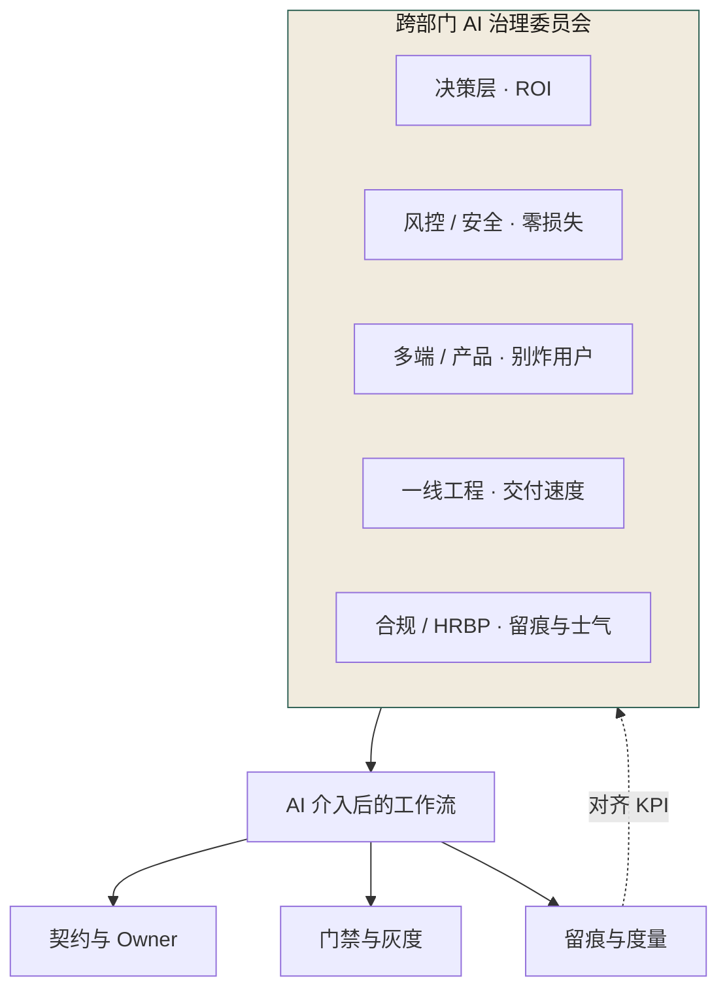
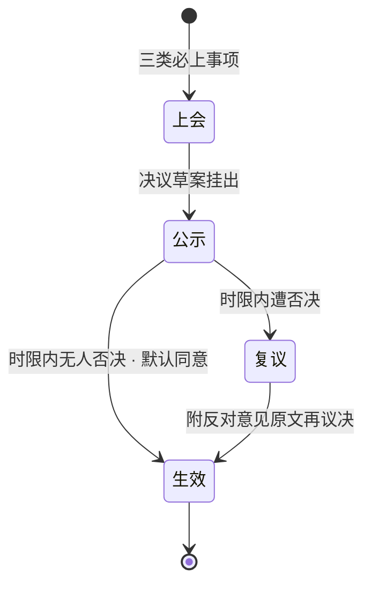
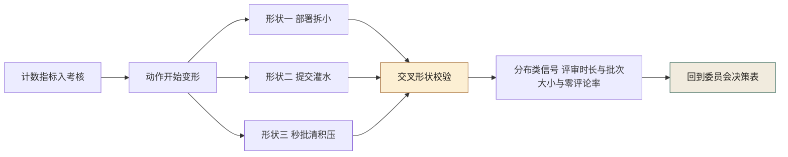
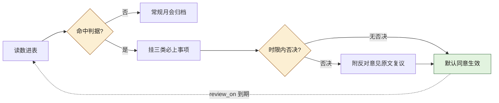
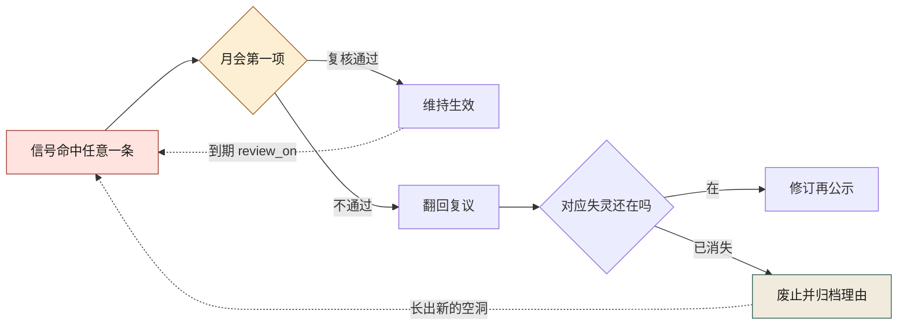

# 第 26 章 组织级 AI 治理：委员会、流程、KPI

> **本章定位**：治理篇的组织层。本章回答"治理责任谁来扛、权力从哪来、KPI 怎么设才不变成监控"三个组织级问题，提出"跨部门 AI 治理委员会"这一组织形态。
> **核心命题**：治理失败的根是"权力不对等"和"激励不对齐"；委员会不是多一层审批，是把散在各角色手里相互打架的决策权收拢到一个能对齐的地方。

---

## 26.1 问题：治理组一个人扛不动八个域的博弈

许多组织在推进 AI 治理时都会撞到同一堵墙：治理责任落在一个人或一个小团队身上，而他要面对的是八个各怀 KPI 的部门。每一次推进都要单独谈、单独让、单独扛。

这种结构天然不对等——**治理者一个人，没有合法的决策权去切别人的蛋糕**。风控的否决权是合法的（风控职责），多端的签字权是有据可查的让渡，而治理者的治理权如果只来自某位高层的一句话授权，**这授权不够硬，撑不住跨部门的博弈。**

一线的反弹往往是压垮骆驼的最后一根稻草——它证明了一件事：**治理如果只在工程线内部转，永远绕不开"被当成监控"这个坎，因为工程线没有解决人（士气、绩效、公平）的合法机构。** 那是 HRBP 的地盘。

所以治理的下一步必然是：**成立一个跨部门的 AI 治理委员会。** 不是因为治理者想要权力，是因为**没有这个机构，每一次博弈都得一个人去打，而有打不动的一天。**

---

## 26.2 根因：治理失败的根，是"权力不对等"和"激励不对齐"

复盘所有推不动的事，根因通常只有两条，但这两条几乎解释了一切。

**根因一：治理权与被治理对象的权力不对等。**
治理者有治理责任，没有治理权力。要让风控让出资金链路，风控有否决权，治理者没有反制。要一线接受留痕，一线的 KPI 在交付量上，留痕降低交付量，治理者没有任何机制补偿。**一个有责无权的治理者，必然被架空，必然变成事故后的替罪羊。**

**根因二：各角色的激励不对齐，且没有一个机构来对齐它们。**
决策层要 ROI，风控要零损失，多端要多端一致，一线要交付量，合规要留痕，HRBP 要士气。**这六个 KPI 天然冲突，没有任何一个角色能同时满足它们。** 于是每个角色都在局部最优解上使劲，全局必然次优——这就是为什么事故会重演：不是谁坏，是没人有动机去管全局。

**委员会的本质，就是给"全局最优"一个合法的、跨部门的决策机构。** 它不是多一层审批，是把原本散在各角色手里的、相互打架的决策权，收拢到一个能对齐的地方。

---

## 26.3 AI 用法：治理的对象是"工作流"，不是"AI 本身"



**图 26-1｜治理结构** — 治理对象是工作流；委员会用来对齐打架的 KPI，不是多盖一个章。

很多人以为 AI 治理是"管 AI"。**不是。AI 治理是管"AI 介入后的工作流"。** AI 只是工作流里的一个环节，真正要治理的是：契约、留痕、介入点、门禁、灰度、回滚。图 26-1 为此把"AI"这张卡彻底放在了委员会大框之外：框的唯一出向箭头落在"AI 介入后的工作流"上，再由它分岔到契约、门禁、留痕三张卡；框的左下方那条"对齐 KPI"虚线是全图唯一的回边——打架的 KPI 就是从这里被收拢进委员会的。

委员会对 AI 本身只管三件事：

- **工具准入**：全平台统一一个 AI 平台，不再多种并存（收敛掉人均多个工具的混乱）。
- **链路边界**：哪些链路禁 AI，由委员会签字定，不再由风探单方面说。
- **留痕标准**：留什么、留多细、匿名到什么程度，由委员会定，不再由治理者单方面推。

**剩下的，委员会管的都是人、流程、KPI，不是 AI。** 这一点要反复讲清楚——决策层一开始也以为治理者要"加一层 AI 审批"，实际上要的是"把已经在发生的博弈，搬到一个有结论的地方"。

---

## 26.4 角色博弈：谁出人，谁出权，谁出预算

成立委员会最难的不是章程，是**让所有利益相关方把自己的权力交一块进来**。这一节是全书最"政治"的部分，只能写实话。

**决策层出"合法性"。** 以 CTO 名义牵头，给委员会背书。代价：要承担"委员会决策失误"的政治风险，所以委员会的决议都要留签字。

**治理者出"治理设计"和原有的部分审批权。** 代价：把契约审批的部分权力让给多端负责人，把治理覆盖的最终签字权让给委员会。**治理者往往是委员会里让权最多的人——这很反直觉，但治理者必须先让权，别人才肯进委员会。**

**风控负责人出"否决权的约束"。** 保留资金链路否决权，但接受"否决必须在 X 天内行使、过期视为同意"的时限约束。代价：不能再无限期拖着不表态。

**多端负责人出"契约签字权的约束"。** 保留破坏性契约签字权，但接受"非破坏性变更不需要签字"的边界。代价：签字负担被框死在破坏性变更。

**合规负责人出"合规否决的标准化"。** 保留合规一票否决，但接受"否决必须给出可执行的补救路径，不能只说不行"。代价：要多干活，给出方案。

**SRE 负责人出"应急权"。** 拿到"事故时 SRE 可越过委员会一键回滚"的授权。代价：要为误回滚负责。

**HRBP 出"KPI 的边界"。** 保住"治理 KPI 不进个人绩效"的红线。代价：要帮委员会设计团队级 KPI，不能只挡不建。

**一线代表出"声音"。** 委员会必须有一个一线席位，否则治理永远是"上面定、下面扛"。代价：这个席位的人要承担"代表一线被问责"的压力。

> **关键认知：委员会不是"大家一起管"，是"每个人都交出一块权力，换来一个能对齐的地方"。** 没有人全额赢，每个人交一点。

---

## 26.5 产出物：AI 治理章程 + 委员会运作机制 + 三类 KPI

可落地的三件：

### 1. 《AI 治理章程 v1.0》（附录 H）

核心条款：
- 委员会 8 人，季度轮值主席，决策采用"默认同意 + 时限否决"。
- 三类事项必须上委员会：跨域契约破坏性变更、资金链路 AI 准入、合规否决。
- 违规处理：第一次约谈、第二次通报、第三次停 AI 权限。

### 2. 委员会运作机制

- **月会**：例行业务复盘 + KPI 评审。
- **应急会**：事故触发，2 小时内召集，SRE 有临时回滚权。
- **议事规则**：每项决议必须附"反对意见"原文（禁止写成"达成一致"）。

把"默认同意 + 时限否决"这条议事规则画成状态机，就是一项决议在委员会手里的完整流转：



**图 26-2｜委员会决议状态机** — 默认同意让治理不卡在等待上，时限否决让权力有期限、反对意见留原文——提速靠规则，不靠信任。

图 26-2 把分岔全押在"公示"这一站：时限内无人否决直达生效，遭否决进复议；而复议回到生效的唯一出口标注着"附反对意见原文再议决"——否决杀不死一项决议，只能逼它带着反对意见再走一遍。

### 3. 三类 KPI（团队级聚合，不进个人绩效）

| 类别 | 指标 | 目标 | 谁背 |
|------|------|------|------|
| 效率 | 评审积压、人均交付 | 积压 ≤ 1 天 | 治理组 |
| 质量 | 事故率、契约一致率、回滚率 | 事故率 -70%、一致率 ≥ 95% | 各域 TL |
| 治理 | 留痕率、边界清单覆盖率 | 留痕 ≥ 90% | 委员会 |

> **代价声明**：KPI 上线后，事故率真的降了，但一线反弹也真的大。HRBP 会再次介入，提醒“再往个人头上压，离职就不会是一个人了”。最后能守住“团队级聚合”这条线——**这是治理者用“治理力度”换来的“留人”。**

---

## 26.5b 四指标的机器形态：在自托管 git 仓库上，部署频率到底怎么算

26.5 那张 KPI 表管的是意图，本节管的是算式。DORA 四指标（部署频率、变更前置时间、变更失败率、服务恢复时间）被平台包装成一键报表之后，很多组织其实不知道数字从哪来。把口径拉回一个没有平台的自托管 git 仓库，先看清一件事：**四指标里三件，`git log` 单独算不出来**。

| 指标 | 真正需要的原料 | 只有 git 仓库时 |
|------|----------------|-----------------|
| 部署频率 | 每次“进入生产环境”的事件时刻 | 只能算提交/合入主干频率，做代理；部署事件不在 git 里 |
| 变更前置时间 | 提案/PR 创建时刻 + 部署成功时刻，两个时间戳源 | 算不出。git 只有提交时刻，给不出提案时刻与部署时刻 |
| 变更失败率 | 部署事件与事后故障标注的关联 | 算不出，要接故障台账 |
| 服务恢复时间 | 故障开始与结束时刻 | 算不出，同样是故障台账的活（[第 21 章](./ch26-第21章-对账灰度回滚监控.md)） |

所以拿一条 `git log` 就报出“DORA 四指标”的做法，是拿第一件的形状冒充四件。能算的那一件，要诚实地算。本书仓库实跑如下（**本机实跑，统计对象是本书仓库自己——一个写文档的仓库，不是任何案例组织的部署节奏，读数不得当作案例事实引用**）：

```bash
$ git log --no-merges --pretty='%ad' --date=format:'%G-W%V' | sort | uniq -c
     13 2026-W37
     15 2026-W39

$ git log --reverse --pretty='%ad %h' --date=short | head -1   # 最早提交
2026-09-11 480a6a3
$ git log -1 --pretty='%ad %h' --date=short                     # 最新提交
2026-09-25 35989ea
```

两条桶计数相加是 28，与 `git log --oneline | wc -l` 一致；作者分布（同一条 `--pretty='%aN' | sort | uniq -c`）是 27 + 1 两个名字。这个读数本身就是口径课：一个几乎单人推进的仓库，“频率”度量的是一个人的写作节律，离 DORA 想回答的“组织多久能安全地交付一次”很远——**读数先问统计对象，再谈好坏。**

入会前必须钉死的三条口径（钉进度量仓 README，不是钉在某个人的记忆里）：

1. **`--no-merges` 排除合并提交。** 这一刀改变数字的方向，第一次读数之前定，之后不再中途换口径；本书仓库无合并提交，这次两种口径同数——同数是巧合，口径是规则。
2. **`%G-W%V` 是 ISO 周编号**，跨年周的归属与本地日历分桶不一致，跨季度聚合前先确认桶的方言。
3. **作者维度用 `%aN` 还是 `%aE`（邮箱）要选边。** 同一人多拼写会被算成两个人，污染一切人均指标；用邮箱则引入可识别信息——对外汇报用哪个、谁有权看映射表，第一次读数之前定（呼应 26.5 的“留痕匿名到什么程度由委员会定”）。

代理指标只能回答“多久动一次手”，回答不了“多久安全地上一次线”。补全第二件的最小接法：PR 创建时间戳从代码平台 API 拉（见 26.5c 的 `jq` 形状），部署成功时刻从部署系统事件流拉，两边按变更单号 join——join 不上的部署，就是门禁之外的手工操作，它本身要进异常清单。

---

## 26.5c 评审负载与代码所有权：两条 awk 的读数

所有权度量回答“谁改得动”，评审负载度量“谁扛得住”。都是委员会谈 KPI 之前该摆在桌上的形状量。

代码所有权：对 `git log --numstat` 建“文件 × 作者”集合（**本机实跑，统计对象是本书仓库 `docs/manuscript/` 下的全部书稿文件**）：

```bash
$ git log --no-merges --numstat --format='A %aN' -- docs/manuscript \
  | awk '/^A /{a=substr($0,3); next} NF==3{seen[$3"|"a]=1}
         END{for(k in seen){split(k,p,"|"); c[p[1]]++} for(f in c) print c[f], f}' \
  | sort | awk '{s[$1]++} END{for(n in s) printf "作者数=%s 的文件数=%s\n", n, s[n]}'
作者数=1 的文件数=102
```

读数即诊断：书稿 102 个文件，每一个的生涯作者都只有一个人——整仓是 bus factor 1 的形状。这在单人写作场景是自然产物，放到工程组织里就是 ownership 债的经典形态：**文件的修改史里凑不出第二个人，评审就永远找不到“懂这块的别人”**。这条 awk 换个目录照样跑，跑出来的“作者数=1”文件占比，就是该目录的独掌率。

评审负载在没有评审平台的仓库里只能用“改动批次”做代理（同一条 `git log --numstat` 换聚合维度，**本机实跑，统计对象仍是本书仓库**）：

```bash
$ git log --no-merges --numstat --format='C %ad' --date=short -- docs/manuscript \
  | awk '/^C /{d=$2;next} NF==3{s[d]+=$1+$2; c[d]++} END{for(k in s) printf "%s 文件改动=%d 行=%d\n", k, c[k], s[k]}' | sort
2026-09-11 文件改动=91 行=9956
2026-09-12 文件改动=43 行=1464
2026-09-24 文件改动=122 行=4538
2026-09-25 文件改动=85 行=653

$ git log --no-merges --numstat --format='COMMITX %ae' -- docs/manuscript \
  | awk '/^COMMITX/{if(seen)print n; n=0; seen=1; next} NF==3{n+=$1+$2} END{if(seen)print n}' \
  | sort -n | awk 'BEGIN{c=0}{v[c++]=$1} END{printf "commits=%d min=%d p50=%d p90=%d max=%d\n", c, v[0], v[int(c*0.5)], v[int(c*0.9)], v[c-1]}'
commits=16 min=17 p50=343 p90=2723 max=4382
```

单日最高近千个文件次、单提交触达行数的 P50 与 P90 差一个数量级——写作可以攒批，评审不行：**评审质量对“单批行数”敏感，攒批正是 26.5d 要讲的博弈形状之一。** 第一行命令里的“文件改动”是提交-文件对计数，不是去重文件数——口径写进注释，别让读表人猜。

评审数据真正的主场在代码平台 API 一侧。下面这条是形状（**B 档：字段按你所用平台的 PR 接口文档对齐，本书未在本机跑过任何托管平台 API，不贴任何未经实跑的“输出”**）：

```bash
# 形状示例：从平台导出的 PR JSON 聚合“人均评审负载 + 秒批率”，字段名以你的接口文档为准
jq -r '.[] | select(.merged_at != null)
       | [.number, .user.login, .created_at, .merged_at, (.review_comments // 0)] | @tsv' pulls.json \
  | awk -F'\t' '{per[$2]++; if ($5 == 0) zero[$2]++}
                END{for (a in per) printf "%s 合并PR=%d 零评论PR=%d\n", a, per[a], zero[a]+0}'
```

两个口径提醒：`review_comments` 只数公开行内评论，批准按钮不是评审，光看它会低估；而“零评论 PR 占比”恰好是 26.5d 第三类博弈形状的现形信号。这些 awk/jq 是尺子不是法官——同一把尺子，在复盘会上量是证据，在问责会上量就成了指控，工具不区分这两场会，区分它的还是 26.5 那条“团队级聚合”红线。

---

## 26.5d 指标被博弈的三种形状，和每种形状的可核对信号

26.5 的 KPI 表一旦生效，博弈就开始了——这不是人心问题，是度量结构问题：**任何单一计数指标，进入考核的那一刻就不再测它原本要测的东西。** 先给形状图：



**图 26-3｜指标博弈的三种形状与交叉校验** — 计数指标被动作变形钻空，分布类信号把它拽回来；反博弈不靠加更多指标，靠给每个计数配一个博弈者没法一起满足的形状。

图 26-3 的关键走线是所有红色分支最后都汇进“交叉形状校验”这一格：博弈者能让一个计数好看，很难让一整个分布同时好看。三种形状各自的配方与信号：

| 博弈形状 | 钻的是哪个指标 | 动作 | 可核对信号（口径先行，数值以你仓库实跑为准） |
|----------|----------------|------|----------------------------------------------|
| 形状一 | 部署频率 | 一次变更拆成 N 次空壳部署、重跑部署 | 每次部署的有效 diff 分布：近零 diff 占比；频率上升而前置时间同步上升 = 分母注水 |
| 形状二 | 提交量、人均产出 | `git commit` 级拆提交、一条消息改十个文件反着凑 | 单提交触达行数分布（26.5c 那条 P50/P90 命令）；提交与变更单号的映射率 |
| 形状三 | 评审积压 | 秒批清积压：不看的 approve | 评审时长分布（approve 时刻减 PR 创建时刻，近零处的质量）；26.5c 那条“零评论 PR 占比” |

委员会对这张表的正确用法：**每季度对着三种信号问一遍“有没有变好”，而不是问“指标有没有变好”**——指标永远在变好，形状信号不配合撒谎，因为它没有单一的分子可以被操纵。反过来，一个从没为任何一种形状补过口径的度量体系，说明它还没被博弈过，或者刚被博弈完而没人发现。

---

## 26.5e 委员会决策的留痕工件：机器可读的纪要

26.5 议事规则要求“每项决议必须附反对意见原文，禁止写成达成一致”。口头纪要执行不了这条——原文要有锚点，时限要有表，到期要有人被提醒。所以纪要必须是结构化工件，YAML 形状（示意，落进委员会仓的 `decisions/` 目录）：

```yaml
# 机器可读纪要（字段可抄；取值全是示意）
decision_id: aigov-2026-09-001        # 内部流水号；命名不与任何编号体系撞形
agenda_item: 资金链路AI准入            # 三类必上事项之一
proposed_by: 治理组
status: effective                     # draft / 公示 / 复议 / effective / vetoed
publicized_at: "2026-09-20"
veto_deadline: "2026-10-08"           # 默认同意 + 时限否决：到点无人动作即同意
vote:
  chair: 签字
  risk:                               # 风控这一票要能进机器检查
    position: veto
    reason_ref: meetings/2026-09#item-3   # 反对意见原文锚点，空着 = CI 红灯
  sre: { position: agree }
  front_line: { position: veto, reason_ref: meetings/2026-09#item-3b }
effective_on: "2026-10-09"
review_on: "2027-04-09"               # 生命周期与 AI 失灵频率绑定：到期强制复议
linked_metrics: [契约一致率, 评审积压]  # 决议押在哪块度量上，复议时看同一块
```

三段纪律，对应委员会里三个不愿干的活：

1. **谁写**：轮值秘书起草，但 `reason_ref` 只有否决人自己有权填和改——反对意见的原文归反对人，任何“润色”都是复议事由。
2. **谁关**：`status` 进入 effective 需要两项绿灯——veto 票的 `reason_ref` 非空、时限内否决动作已作出或已过期；轮值主席的签字是最后一格，不是第一格。
3. **关不掉怎样**：委员会仓的 CI 只查两条硬线——有 veto 而 `reason_ref` 为空，红灯；`review_on` 已过而 `status` 仍是 effective，黄灯并列入下次月会第一项。查不完美的部分（反对意见被稀释、复议被拖）由 `linked_metrics` 的持有方在会上点名——机器盯字段，人盯字段后面的权力。

这个工件替代不了的：它只证明决策发生过、反对被登记过，**不证明决策是对的**——26.9 第二条遗留问题（委员会会不会变新官僚层）的解药不在 YAML 里，在“生命周期绑定失灵频率”那条 `review_on` 有没有被真的执行。

---

## 26.5f 决策点表：表上的读数各自坐哪把椅子、谁签、到什么时候

图 26-3 的最后一个节点写着「回到委员会决策表」，这张表本章一直没给。26.5 的 KPI 表管目标，决策表管动作：每个读数要挂上判据、签署方和时限，否则它只是周报里的一行字。这一节把三类 KPI 与 26.5b、26.5c、26.5d 造好的信号逐个挂上动作——读数全部是前文已有的，本表不新增任何读数。

| 读数（出处） | 上会判据（什么形状才算触发） | 触发后的动作 | 签署方 | 时限锚 |
|---|---|---|---|---|
| 评审积压（效率类，目标 ≤ 1 天） | 越线未回落，且秒批与零评论 PR 占比同向（26.5c、26.5d 形状三） | 不先加人，先做口径复核：积压下降是清掉了积压，还是清掉了评审 | 治理组出具口径说明，轮值主席记入月会纪要 | 月会第一项 |
| 契约一致率（质量类，目标 ≥ 95%） | 跌破目标且破坏性签字计数同向下滑 | 按「判界移动」处置：期内变更逐条重裁破坏性与非破坏性，上会重定边界 | 多端负责人裁边界 | 三类必上事项：跨域契约破坏性变更 |
| 边界清单覆盖（治理类） | 清单出现空洞，且空洞链路仍有 AI 活动 | 空洞二选一：放进准入或划入禁入，两个选择都必须签字 | 风控行使否决，行使窗口即 26.4 那条 X 天时限 | 三类必上事项：资金链路 AI 准入 |
| 留痕率（治理类，目标 ≥ 90%） | 某团队聚合口径骤降 | 告警发团队负责人、不发个人（第 23 章的三条线）；合规核查是否复现 F-0515 那类归档缺失 | 合规给可执行补救路径，不许只说不行 | 月会 KPI 评审 |
| 事故率（质量类，目标 -70%） | 同类事故再演 | 应急会按时限召齐，SRE 的一键回滚先斩后奏；复盘会必须附双方反对票原文 | 主席裁复盘结论，SRE 为误回滚担责 | 2 小时内召集（26.5 应急会） |

四列是咬合的，缺一列就退化成一种熟悉的病：有读数没判据，会上变成各凭记忆讲故事；有判据没动作，变成记录习惯；有动作没签署方，变成责任悬空；有签署方没时限，就是反模式七的否决权无时限——这张表本身就是那七条反模式的逐条反向工程。

表上没有「一线」这一行——不是遗漏：一线不是签署方，一线是被这些决议作用的人。他的位置在别处：委员会里的那把票（26.4）和留痕的聚合口径（26.5 红线）。把他写成签署方，等于让交付量替治理背书，那是假对齐。

「X 天」这一格故意保留 26.4 的占位写法。否决时限的具体数值是每个组织签章程时的本地标定，本书不给样板答案；可判定的部分不在 X 多大，在这个数有没有被填——章程里它还是字母，决议件（26.5e 的 YAML）里它就必须在 `veto_deadline` 上落成一个日期，两处对不上，CI 第一个抓到。

这条链从读数走到归档、再从归档走回读数，画成图 26-4：



**图 26-4｜决策链：从读数到归档再回到读数** — 两个菱形的岔口都提前登记在章程上，只认形状不认手感；末端的回边让生效不是终点，而是下一次被量开始的锚。

读图 26-4 盯三处。进菱形的每个「否」分支都不拦任何事——命中不了判据就安静归档、时限内无人动手就默认同意，治理的提速全靠这两个「不拦」；「是」分支必须留下一个具名签署动作才能往下走，这是反模式三「只讨论不决议」的机器防线；最底那条虚线回边是全图唯一不产生新决议的走线——决议生效不是退场，它押过的读数到期还要再量它一遍。有了这条回边，本节开头那句「KPI 表管目标、决策表管动作」才闭环。

---

## 26.5g 生效证据清点：章程的哪一条挂在哪个产物上

26.5 的章程给了条款，26.4 给了每个人让出的那块权。条款会不会生效，不靠成立大会上的掌声判定，靠它挂不挂得住一个可复查的产物。逐条清点，每条只有三种状态：有证据、证据可造假、无证据——第三种最该被点名，它不是条款失效，是条款变得无法被证明生效。

| 条款（出处） | 生效证据（产物与落点） | 怎么读这条证据 | 没有产物时怎样 |
|---|---|---|---|
| 默认同意加时限否决（26.5） | 决议件的 `publicized_at`、`veto_deadline` 与 `status` 流转记录（26.5e） | 「到期同意」的件有没有真实走过公示与到期两步 | 条款无证据：它平时不产生任何动作，审计只能反证——任抽一件到期同意的决议，问「若有人否决，截止在第几步还赶得上」，答不出流程在哪一步接住，这条就是纸面条款 |
| 决议附反对意见原文（26.5） | 每票 `reason_ref` 非空，CI 红灯记录 | 红灯出现过是条款活着；长期零红灯只有两种解释——真没人反对，或反对改走走廊了，用否决票总数分辨这两者 | 议事规则退回「达成一致」，反模式四原地复活 |
| 三类事项必须上会（26.5） | 决议件 `agenda_item` 只许取那三类枚举值 | 跑一遍枚举外议程：月会纪要里混进了多少类「顺带议一议」 | 清单在膨胀，委员会向清谈馆滑，反模式三 |
| 8 人逐票签字、季度轮值主席（26.5） | 每份决议 `vote` 下八格齐全，主席格随季度换人 | 八格里有无长期空挂或代签；签字格有没有随季度真的换过人 | 委员会塌回发起人独签，「收拢决策权」变成「集中责任」 |
| 风控否决有时限（26.4） | 章程正文的 X 天数与 `veto_deadline` 推算天数一致 | 两处数值对不上，即条款已分叉 | 否决权回到无限期，反模式七 |
| 破坏性签字边界（26.4） | 破坏性与非破坏性的判定记录与签字计数 | 两类计数同涨是判界在移动，不是人在变懒（见 26.5f 第二行） | 全量申报或全量免签，边界条款名存实亡 |
| 治理 KPI 不进个人绩效（26.4、26.5） | 留痕系统只允许聚合维度查询——第 23 章三条线在存储层的落地 | 查询日志里有没有按个体检索的记录 | 最重的一格：能按个人查，条款不是「没执行」，是「已被破」，按数据违规处理 |
| 一线席位（26.4） | `vote` 里 `front_line` 具名格 | 空位时长与代签次数 | 治理回到「上面定、下面扛」，反模式六 |

「无证据」状态的条款该怎么办？本表不替组织做裁决，只给一条本章反复用过的纪律：**条款挂进产物才算生效，挂不住就移进「待补产物」清单并允许任何人引用它**——比默许大家继续引用一条无法证明生效的条款诚实。第 25 章 ADR 的 Status 翻不动是这个病的文档版，26.5b「join 不上的部署要进异常清单」是它的度量版；治理章程不能给自己豁免这条纪律。

清点要定期跑：至少每次章程改版之前过一遍右两列，产出那份「有证据、证据可造假、无证据」的三态清单，附进章程附录。还有一格要点破：**证据可造假的条款比无证据的更危险**——它自带合法外衣。`reason_ref` 事后补写成一句无关痛痒的话，字段非空、CI 绿灯、一切合规，唯一能抓它的是时序：原文锚点必须早于否决动作。「反对意见的原文归反对人」（26.5e）这条纪律防的就是这里——伪造留时序痕迹的前提，是机器先记住了真实的那一次。

---

## 26.5h KPI 冲突对照表：谁的「最优」踩了谁，冲突时先看哪两个读数

26.2 说那几个 KPI 天然冲突，26.5 把三类指标分给三类人背。两边合成一张对照表：委员会每把椅子，他的 KPI 奖励什么、治理多要了他什么、谁的局部最优正在让他亏、真出冲突时桌上摆哪两个读数——椅子沿用 26.4 的八格，立场沿用各角色卡与数字清单，不新增人物，也不新增读数。

| 席位 | KPI 奖励什么 | 治理多要了什么 | 冲突面：谁的「最优」让他亏 | 冲突时的对照读数（全部本章已有） |
|---|---|---|---|---|
| 决策层 | ROI | 替委员会决议背政治责任 | 治理在报表上是成本，事故在董事会上才是成本 | 事故率与提交量：同降说明治理在失血而非止血 |
| 治理组 | 治理覆盖 | 把审批权让进委员会 | 覆盖上去、速度下来，板子先打他 | 效率类由治理组自己背——全局唯一一把尺也量裁判自己 |
| 风控 | 资金零损失 | 无限期不表态的选项被收走 | 交付侧每快一分，他要盯的洞每多一处 | 准入上会次数与清单空洞数：前者降而后者不降，否决权可能已移到桌下 |
| 多端 | 多端一致 | 非破坏性不再签字，签字框死在破坏性 | 契约被过度申报破坏性，签字变成橡皮章 | 一致率与签字计数（26.5g 那格）：同涨即判界移动 |
| 一线 | 交付量 | 留痕、归档、过闸全占交付量的时间 | 治理的每一分留痕成本都直接从他产量里扣 | 积压与零评论占比、留痕率与提交量：两组同向性对上 26.5d 三形状 |
| 合规 | 审计零缺口 | 否决必须附补救路径，多写一份方案 | 拦得越准，业务侧越把他当路障 | 只否决无补救的件数：有否决记录而补救路径全空，条款在空转 |
| SRE | 可用性与恢复时间 | 误回滚要他个人担责 | 别人的局部最优全变成他的告警与回滚 | 应急会触发数与真实事故数之比：长期为零，应急权在萎缩 |
| HRBP | 士气与公平 | 帮委员会设计团队级 KPI，不能只挡不建 | 治理力度与留人相撞时，她永远站损失侧 | 留痕率与离职面：前者升、后者升，红线只剩纸面 |

这张表的用法不是月会逐行过一遍，是**任一收紧或瘦身动作表决之前，先看「冲突面」列确认谁在付钱，再看「对照读数」列确认付钱的样子**。动作发生而读数不动，多半不是没有代价，是代价还没被这双眼睛看见——它不会消失，只会沉到别处，等一场事故或一封辞职信再浮出来。26.5 那条代价声明（KPI 上线、一线反弹、HRBP 再次介入）就是这条规律的现形记录：表上 HRBP 一行的对照读数，正是那次被拍上桌的东西。

这张表也拦不住一种情况：某席位本人就不认这套框架——他可以每次都出勤、按表签字、让对照读数漂得好看。表拦的是形状失衡，不拦立场；立场部分靠的是 26.4 那句「每个人都交一点」背后的机器记忆——他交进委员会的那块权，有没有在每份决议的票格里被逐次登记。

---

## 26.5i 复审与失效判据：治理机制自己会不会腐烂，怎么先看见

反模式表拦的是「一开始就建错」，这一节拦的是「建对之后慢慢烂掉」。靠共识启动的规矩有个共同的病：不出事时看不见，出事时已经晚了。判腐烂不问「委员会还开会吗」——开会是最不花钱的姿态——问五条信号，全部拿本章已有的产物当证据面：

1. **议事已死**：决议件里的反对意见字段连续整季为空，且没有否决票。`reason_ref` 的 CI 红灯长期不响，只有两种解释——**要么真没人反对，要么反对改走走廊了**；后者才会杀死这个委员会。
2. **否决权回到桌下**：该上会的三类事项改在会下「先沟通好、再上会追认」。机器的痕迹是 `agenda_item` 的枚举外议程变多而决议总数不变——事没少，只是不再留下可审的形状。
3. **回边腐烂**：`review_on` 到期的黄灯本该「列入下次月会第一项」，却连续积压不清。26.5e 说过这个工件不证明决策是对的，它只保证对错的复审有档期；档期一再落空，「生命周期与 AI 失灵频率绑定」就退化成成立会上的那句承诺——26.9 第二条遗留问题在这一刻复活。
4. **让权回收**：八格票里出现长期代签，或某格的 `position` 由轮值秘书照抄主席。26.4 的「每个人交一块权力」被悄悄改写回「一个人替大家保管」。
5. **红线穿刺**：聚合口径的查询日志里出现按个体检索的记录，哪怕只有一条。这条不在委员会自己的产物里查，在留痕系统的存储层查——章程管不住自己时，要由数据层来管它。

### 反事实的形状：如果争议当时有判据，会先看到什么

26.6 表里那些「触发事件」，多数组织把它归因成人不配合；把同一批争议放回判据桌上，归因会变成「缺了哪一步可核对」。先看到什么，下面各给一个形状，全部用本章与清单已有事实：

| 那次的形状 | 若有判据，桌上先看到的 | 现在该做的动作 |
|---|---|---|
| 精度与性能反复拉锯（案例二，X-0719 那一类） | 红线链路里有效 diff 近零的变更占比先动——快是靠注水还是靠真改，26.5d 的形状信号分得开 | 把交叉形状校验挂进该类链路的复审议程 |
| 策略与风控比嗓门（案例三，Z-0612 那一类） | 两边引用的读数从不同框：拦截率与存活期各说各话，谁也不用解释自己的数 | 冲突提交前各自声明押哪块度量——`linked_metrics` 的会上版 |
| 白屏事故重演（案例一，D-0114 之后的 E-0311） | 一致率与签字计数同向异动——26.5f 第二行的判据，比事故报告早到 | 判界复核上会，多端裁边界 |
| 委员会自己烂掉 | 上面五条信号里的任意一条先亮 | 按 26.9 第二条瘦身：失灵少了，就减席减会 |

复审的最小环可以直接跑：生效的决议满一个复审周期——26.5e 示例从生效日到复审标的间隔是 6 个月——月会第一项过一遍五个信号，命中任一条，该决议翻回复议状态。图 26-5 把这个环画出来：



**图 26-5｜复审环：治理机制的防腐检查** — 每个出口都绕回读数，环上没有终点站；废止也要归档理由，将来它长出尸体时才有东西可验。

读图 26-5 看三处：信号格是红的，因为五条里没有一条是事故，全是腐烂的形状——治理机制的坏状态从不以「出事」现身；菱形「对应失灵还在吗」把废止与修订分开，前者放走一条已无对应风险的规矩，后者带新口径重走公示，两条出口都合法，卡住不动才非法；虚线回边是这条纪律的图示——**复审环自己也在环里**，废止归档的理由若被重新翻出来引用，它按新决议重走全链。

最后记一笔诚实账：五条信号加这张环，本身也是会腐烂的规矩，本章不自带终点。委员会最终会不会变成它自己反模式表里的第 3 条，量它的不是这套机制的自我感觉，是它废止过几条自己的条款。**一套从没废止过任何条款的治理机制，和一套从没修过 bug 的代码库一样，读数干净得可疑。**

---

## 26.6 四案例映射

本章的委员会组织形态与三类 KPI，在四个案例中对应不同的博弈焦点：

| 案例 | 委员会成立的触发事件 | 核心博弈方 | 让权与对齐的关键条款 |
|------|-------------------|----------|-------------------|
| 案例一·电商平台 | 合规事故后治理推不动、一线反弹 | 决策层、工程效能负责人、一线工程师、HRBP、合规负责人 | 一线席位入会、治理 KPI 不进个人绩效、留痕按团队聚合 |
| 案例二·海星交易所 | X-0719 / Y-0820 后精度与合规责任不清 | 风控总监、CTO、合规总监、SRE 负责人 | 风控否决权加时限、SRE 临时回滚权、资金链路准入上会、四方等权签字 |
| 案例三·暗流资本 | Z-0612 / W-0703 后效率与风控反复冲突 | 首席风控、策略主管、审计工程师、CFO | 实盘通道冻结权、四道闸门会签、期望值预算把两边摁下来 |
| 案例四·守夜人科技 | V-0905 / U-0918 后威胁面在自己智能体 | CTO、安全负责人、创始合伙人、运维 | 权限矩阵写进代码、三类动作人审卡点、自动化覆盖率主动下调 |

---

## 26.7 检查清单

- [ ] 你的 AI 治理有没有一个跨部门的合法决策机构？还是只在工程线内部转？
- [ ] 治理者的"责"和"权"对不对等？有责无权 = 替罪羊。
- [ ] 委员会里，有没有一个一线席位？没有 = 治理永远脱离一线。
- [ ] 各角色交进委员会的权力，有没有写清楚边界和时限？没有 = 委员会变成清谈馆。
- [ ] 你的治理 KPI 是团队级还是个人级？个人级 = 监控，赶人。
- [ ] 委员会的决议，有没有强制记录"反对意见"原文？没有 = 假和谐。

---

## 26.8 反模式

| # | 反模式 | 后果 |
|---|--------|------|
| 1 | 治理只在工程线内部搞 | 绕不开士气/合规/风控，必然推不动 |
| 2 | 治理者有责无权 | 变成事故替罪羊 |
| 3 | 委员会变成清谈馆，只讨论不决议 | 浪费所有人时间 |
| 4 | 决议写成"达成一致" | 埋下下次冲突的雷 |
| 5 | KPI 进个人绩效 | 一线离职批量发生 |
| 6 | 委员会没有一线席位 | 治理脱离实际，被一线阳奉阴违 |
| 7 | 否决权无时限 | 风控式无限期拖延，治理瘫痪 |

---

## 26.9 遗留问题

- **委员会的决策权，到底从谁的权力里分出来？** 本章给的答案是——从每个成员手里各交一块。但这个"交"的过程，每个组织都不一样，没有标准模板，只有原则：**治理者先让权，别人才肯进。**
- **委员会会不会变成新的官僚层？** 决策层在成立会上通常会问这个问题。回答是：委员会的生命周期应该和"AI 失灵的频率"绑定——失灵少了，委员会就该瘦身。**治理是手段，不是目的。** 但这件事多数组织还没做到，留给全书末尾的复盘。
- **一线席位怎么选才不被同化？** 一旦一线代表离开，这个席位的人选就成了难题——选个听话的，等于没有；选个刺头，又怕他扛不住。这一问，没有标准答案。

---

> **本章的一句话**：AI 治理的本质，不是给 AI 加锁，是给组织里那些一直存在、但被"各自为政"掩盖的权力冲突，**找一个有结论的地方**。委员会不是多一层审批，是把原本打不赢的仗，搬到一个能打赢、也敢认输的桌子上。
