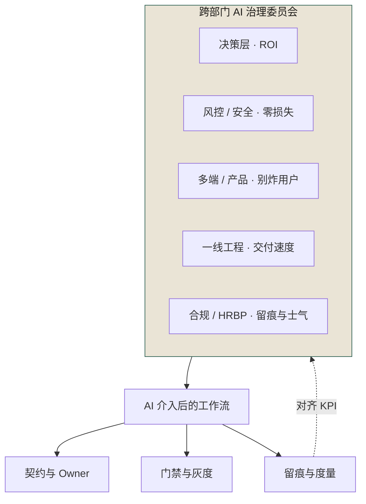
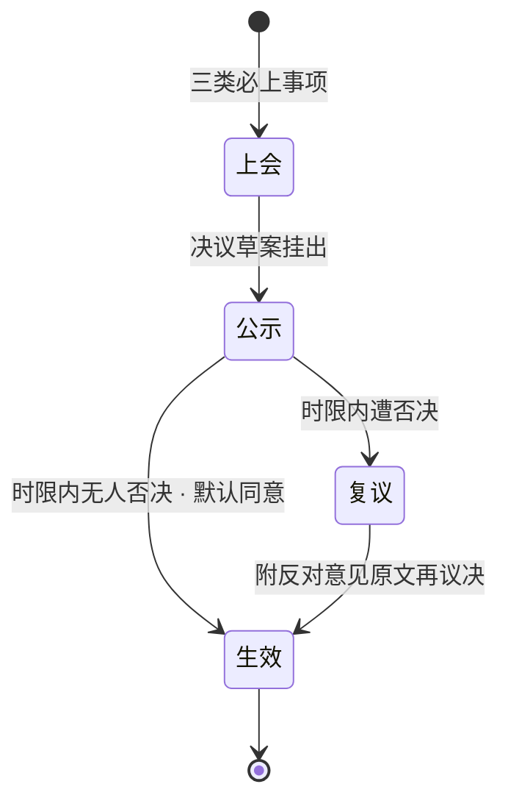

# 第 26 章 组织级 AI 治理：委员会、流程、KPI

> **本章定位**：治理篇的组织层。本章回答"治理责任谁来扛、权力从哪来、KPI 怎么设才不变成监控"三个组织级问题，提出"跨部门 AI 治理委员会"这一组织形态。
> **核心命题**：治理失败的根是"权力不对等"和"激励不对齐"；委员会不是多一层审批，是把散在各角色手里相互打架的决策权收拢到一个能对齐的地方。

---

## 26.1 问题：治理组一个人扛不动八个域的博弈

许多组织在推进 AI 治理时都会撞到同一堵墙：治理责任落在一个人或一个小团队身上，而他要面对的是八个各怀 KPI 的部门。每一次推进都要单独谈、单独让、单独扛。

这种结构天然不对等——**治理者一个人，没有合法的决策权去切别人的蛋糕**。风控的否决权是合法的（风控职责），多端的签字权是有据可查的让渡，而治理者的治理权如果只来自某位高层的一句话授权，**这授权不够硬，撑不住跨部门的博弈。**

一线的反弹往往是压垮骆驼的最后一根稻草——它证明了一件事：**治理如果只在工程线内部转，永远绕不开"被当成监控"这个坎，因为工程线没有解决人（士气、绩效、公平）的合法机构。** 那是 HRBP 的地盘。

所以治理的下一步必然是：**成立一个跨部门的 AI 治理委员会。** 不是因为治理者想要权力，是因为**没有这个机构，每一次博弈都得一个人去打，而有打不动的一天。**

---

## 26.2 根因：治理失败的根，是"权力不对等"和"激励不对齐"

复盘所有推不动的事，根因通常只有两条，但这两条几乎解释了一切。

**根因一：治理权与被治理对象的权力不对等。**
治理者有治理责任，没有治理权力。要让风控让出资金链路，风控有否决权，治理者没有反制。要一线接受留痕，一线的 KPI 在交付量上，留痕降低交付量，治理者没有任何机制补偿。**一个有责无权的治理者，必然被架空，必然变成事故后的替罪羊。**

**根因二：各角色的激励不对齐，且没有一个机构来对齐它们。**
决策层要 ROI，风控要零损失，多端要多端一致，一线要交付量，合规要留痕，HRBP 要士气。**这六个 KPI 天然冲突，没有任何一个角色能同时满足它们。** 于是每个角色都在局部最优解上使劲，全局必然次优——这就是为什么事故会重演：不是谁坏，是没人有动机去管全局。

**委员会的本质，就是给"全局最优"一个合法的、跨部门的决策机构。** 它不是多一层审批，是把原本散在各角色手里的、相互打架的决策权，收拢到一个能对齐的地方。

---

## 26.3 AI 用法：治理的对象是"工作流"，不是"AI 本身"

**图 26-1｜治理结构** — 治理对象是工作流；委员会用来对齐打架的 KPI，不是多盖一个章。

很多人以为 AI 治理是"管 AI"。**不是。AI 治理是管"AI 介入后的工作流"。** AI 只是工作流里的一个环节，真正要治理的是：契约、留痕、介入点、门禁、灰度、回滚。图 26-1 为此把"AI"这张卡彻底放在了委员会大框之外：框的唯一出向箭头落在"AI 介入后的工作流"上，再由它分岔到契约、门禁、留痕三张卡；框的左下方那条"对齐 KPI"虚线是全图唯一的回边——打架的 KPI 就是从这里被收拢进委员会的。

委员会对 AI 本身只管三件事：

- **工具准入**：全平台统一一个 AI 平台，不再多种并存（收敛掉人均多个工具的混乱）。
- **链路边界**：哪些链路禁 AI，由委员会签字定，不再由风探单方面说。
- **留痕标准**：留什么、留多细、匿名到什么程度，由委员会定，不再由治理者单方面推。

**剩下的，委员会管的都是人、流程、KPI，不是 AI。** 这一点要反复讲清楚——决策层一开始也以为治理者要"加一层 AI 审批"，实际上要的是"把已经在发生的博弈，搬到一个有结论的地方"。

---

## 26.4 角色博弈：谁出人，谁出权，谁出预算

成立委员会最难的不是章程，是**让所有利益相关方把自己的权力交一块进来**。这一节是全书最"政治"的部分，只能写实话。

**决策层出"合法性"。** 以 CTO 名义牵头，给委员会背书。代价：要承担"委员会决策失误"的政治风险，所以委员会的决议都要留签字。

**治理者出"治理设计"和原有的部分审批权。** 代价：把契约审批的部分权力让给多端负责人，把治理覆盖的最终签字权让给委员会。**治理者往往是委员会里让权最多的人——这很反直觉，但治理者必须先让权，别人才肯进委员会。**

**风控负责人出"否决权的约束"。** 保留资金链路否决权，但接受"否决必须在 X 天内行使、过期视为同意"的时限约束。代价：不能再无限期拖着不表态。

**多端负责人出"契约签字权的约束"。** 保留破坏性契约签字权，但接受"非破坏性变更不需要签字"的边界。代价：签字负担被框死在破坏性变更。

**合规负责人出"合规否决的标准化"。** 保留合规一票否决，但接受"否决必须给出可执行的补救路径，不能只说不行"。代价：要多干活，给出方案。

**SRE 负责人出"应急权"。** 拿到"事故时 SRE 可越过委员会一键回滚"的授权。代价：要为误回滚负责。

**HRBP 出"KPI 的边界"。** 保住"治理 KPI 不进个人绩效"的红线。代价：要帮委员会设计团队级 KPI，不能只挡不建。

**一线代表出"声音"。** 委员会必须有一个一线席位，否则治理永远是"上面定、下面扛"。代价：这个席位的人要承担"代表一线被问责"的压力。

> **关键认知：委员会不是"大家一起管"，是"每个人都交出一块权力，换来一个能对齐的地方"。** 没有人全额赢，每个人交一点。

---

## 26.5 产出物：AI 治理章程 + 委员会运作机制 + 三类 KPI

可落地的三件：

### 1. 《AI 治理章程 v1.0》（附录 H）

核心条款：
- 委员会 8 人，季度轮值主席，决策采用"默认同意 + 时限否决"。
- 三类事项必须上委员会：跨域契约破坏性变更、资金链路 AI 准入、合规否决。
- 违规处理：第一次约谈、第二次通报、第三次停 AI 权限。

### 2. 委员会运作机制

- **月会**：例行业务复盘 + KPI 评审。
- **应急会**：事故触发，2 小时内召集，SRE 有临时回滚权。
- **议事规则**：每项决议必须附"反对意见"原文（禁止写成"达成一致"）。

把"默认同意 + 时限否决"这条议事规则画成状态机，就是一项决议在委员会手里的完整流转：

**图 26-2｜委员会决议状态机** — 默认同意让治理不卡在等待上，时限否决让权力有期限、反对意见留原文——提速靠规则，不靠信任。

图 26-2 把分岔全押在"公示"这一站：时限内无人否决直达生效，遭否决进复议；而复议回到生效的唯一出口标注着"附反对意见原文再议决"——否决杀不死一项决议，只能逼它带着反对意见再走一遍。

### 3. 三类 KPI（团队级聚合，不进个人绩效）

| 类别 | 指标 | 目标 | 谁背 |
|------|------|------|------|
| 效率 | 评审积压、人均交付 | 积压 ≤ 1 天 | 治理组 |
| 质量 | 事故率、契约一致率、回滚率 | 事故率 -70%、一致率 ≥ 95% | 各域 TL |
| 治理 | 留痕率、边界清单覆盖率 | 留痕 ≥ 90% | 委员会 |

> **代价声明**：KPI 上线后，事故率真的降了，但一线反弹也真的大。HRBP 会再次介入，提醒"再往个人头上压，离职就不会是一个人了"。最后能守住"团队级聚合"这条线——**这是治理者用"治理力度"换来的"留人"。**

---

## 26.6 四案例映射

本章的委员会组织形态与三类 KPI，在四个案例中对应不同的博弈焦点：

| 案例 | 委员会成立的触发事件 | 核心博弈方 | 让权与对齐的关键条款 |
|------|-------------------|----------|-------------------|
| 案例一·电商平台 | 合规事故后治理推不动、一线反弹 | 决策层、工程效能负责人、一线工程师、HRBP、合规负责人 | 一线席位入会、治理 KPI 不进个人绩效、留痕按团队聚合 |
| 案例二·海星交易所 | X-0719 / Y-0820 后精度与合规责任不清 | 风控总监、CTO、合规总监、SRE 负责人 | 风控否决权加时限、SRE 临时回滚权、资金链路准入上会、四方等权签字 |
| 案例三·暗流资本 | Z-0612 / W-0703 后效率与风控反复冲突 | 首席风控、策略主管、审计工程师、CFO | 实盘通道冻结权、四道闸门会签、期望值预算把两边摁下来 |
| 案例四·守夜人科技 | V-0905 / U-0918 后威胁面在自己智能体 | CTO、安全负责人、创始合伙人、运维 | 权限矩阵写进代码、三类动作人审卡点、自动化覆盖率主动下调 |

---

## 26.7 检查清单

- [ ] 你的 AI 治理有没有一个跨部门的合法决策机构？还是只在工程线内部转？
- [ ] 治理者的"责"和"权"对不对等？有责无权 = 替罪羊。
- [ ] 委员会里，有没有一个一线席位？没有 = 治理永远脱离一线。
- [ ] 各角色交进委员会的权力，有没有写清楚边界和时限？没有 = 委员会变成清谈馆。
- [ ] 你的治理 KPI 是团队级还是个人级？个人级 = 监控，赶人。
- [ ] 委员会的决议，有没有强制记录"反对意见"原文？没有 = 假和谐。

---

## 26.8 反模式

| # | 反模式 | 后果 |
|---|--------|------|
| 1 | 治理只在工程线内部搞 | 绕不开士气/合规/风控，必然推不动 |
| 2 | 治理者有责无权 | 变成事故替罪羊 |
| 3 | 委员会变成清谈馆，只讨论不决议 | 浪费所有人时间 |
| 4 | 决议写成"达成一致" | 埋下下次冲突的雷 |
| 5 | KPI 进个人绩效 | 一线离职批量发生 |
| 6 | 委员会没有一线席位 | 治理脱离实际，被一线阳奉阴违 |
| 7 | 否决权无时限 | 风控式无限期拖延，治理瘫痪 |

---

## 26.9 遗留问题

- **委员会的决策权，到底从谁的权力里分出来？** 本章给的答案是——从每个成员手里各交一块。但这个"交"的过程，每个组织都不一样，没有标准模板，只有原则：**治理者先让权，别人才肯进。**
- **委员会会不会变成新的官僚层？** 决策层在成立会上通常会问这个问题。回答是：委员会的生命周期应该和"AI 失灵的频率"绑定——失灵少了，委员会就该瘦身。**治理是手段，不是目的。** 但这件事多数组织还没做到，留给全书末尾的复盘。
- **一线席位怎么选才不被同化？** 一旦一线代表离开，这个席位的人选就成了难题——选个听话的，等于没有；选个刺头，又怕他扛不住。这一问，没有标准答案。

---

> **本章的一句话**：AI 治理的本质，不是给 AI 加锁，是给组织里那些一直存在、但被"各自为政"掩盖的权力冲突，**找一个有结论的地方**。委员会不是多一层审批，是把原本打不赢的仗，搬到一个能打赢、也敢认输的桌子上。
