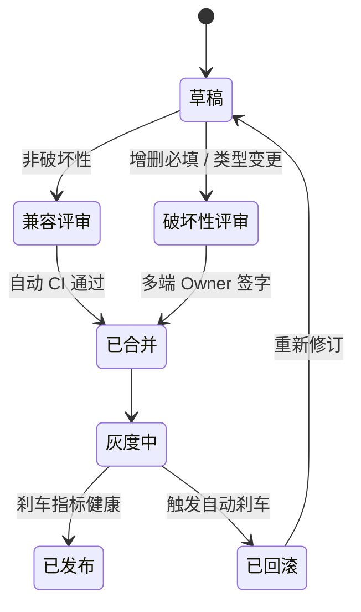
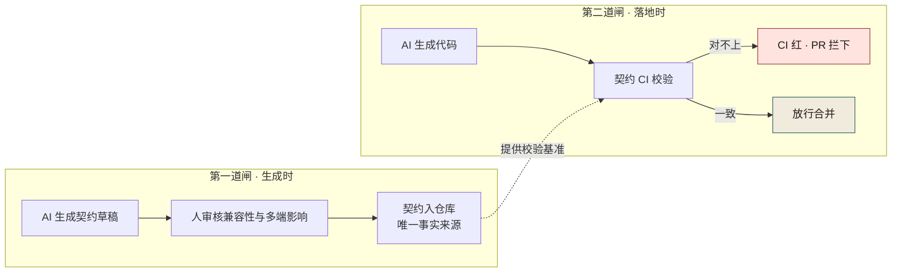
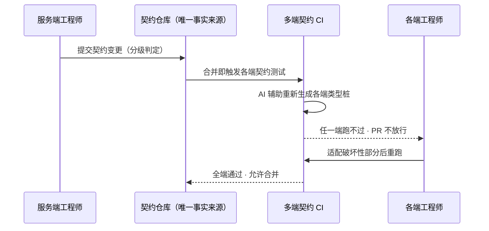
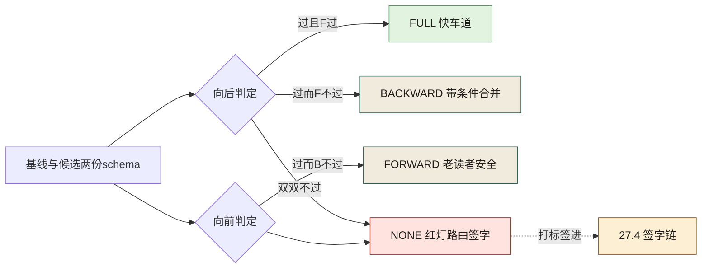
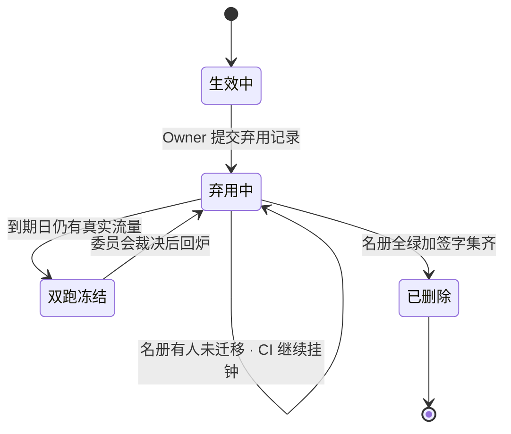

# 第 27 章 跨团队契约治理：变更、版本、多端同步

> **本章定位**：治理篇的契约层。本章回答"为什么改实现不改契约会反复闯祸"，并把契约从"代码的附属文档"升级为"全平台唯一事实来源"。
> **核心命题**：契约必须先于代码、契约变更必须有签字人、多端契约 CI 自动拦截；组织里所有反复发生的事故，根子都是"靠自觉"，解药都是"靠机制"。

---

## 27.1 问题：同一种事故，犯了两次

两次多端白屏事故，相隔十个月，**根因一模一样**：有人（或 AI）改了接口的实现，契约仓库没人更新，于是端上拿到的结构和实际不符，白屏。

第二次出事时，多端负责人在会上不留情面：

> "上次白屏是 47 分钟，这次是 2 小时，三个端。中间这十个月，治理组在干什么？"

当时治理组的回答很难站住脚——"在推契约先行"。多端负责人当场顶回来：

> "推了十个月，接口和契约还是对不上。**问题不是推不推，是没有人能拦住'改了实现不改契约'这件事。**"

他说得对。写了规范、做了培训、发了 ADR，但**没有任何一道强制手段，能让"改实现不改契约"这件事在上线前被拦下来**。规范是软的，事故是硬的。软的拦不住硬的。

这次会后必须下定的决心是：**契约治理不能再靠"希望大家遵守"，必须靠"想不遵守也做不到"。** 这就是本章全部内容的起点。

---

## 27.2 根因：契约不是"事实来源"，代码才是——这是组织级的默认设置



**图 27-1｜契约变更分级** — 破坏性变更必须走签字；实现追契约，不是契约追实现。

读图 27-1 的关键在草稿处的那一分岔：增删必填、类型变更被划进签字线，多端 Owner 不签就停在评审里；非破坏性一路只靠自动 CI 放行。第二次白屏那次"字段从对象改数组"，在图上正是撞在签字线这一侧的变更；另外留意"已回滚 → 草稿"那条回边——被刹车拦下的变更不是被扔掉，是回到草稿箱重走一遍分级。

为什么"改实现不改契约"会反复发生？因为在大多数公司，**默认的事实来源是代码，不是契约**。

具体表现是：

**① 契约是代码的附属品。** OpenAPI 文件躺在某个仓库的 `docs/` 目录里，是开发者"顺手"维护的，没人对它负责。代码一改，契约就成了过期的注释。

**② AI 改代码不会去碰契约。** AI 的上下文是当前文件，它不知道有个契约仓库需要同步——就算知道，它也不会主动去改，因为"让代码跑通"才是它的目标。

**③ 多端各自验证，没有中心契约。** 安卓、鸿蒙、iOS、Web、小程序，每端都有自己的 mock，没有一份"唯一对的"契约。于是同一个接口，五个人有五种理解。

**④ 没有"破坏性变更"的概念。** 加个字段、改个类型、删个返回值，都叫"小改动"，没人区分。**而第二次白屏事故恰恰是一次"小改动"——把一个字段从对象改成数组，三端全炸。**

四条根因，归结成一句：**契约没有"事实来源"的地位，所以它一定被代码甩在后面。** 治理要做的，就是把这句话反过来——让契约成为事实来源，让代码去追契约，而不是反过来。

---

## 27.3 AI 用法：AI 生成契约，人审核契约；AI 生成代码，契约卡住代码

契约治理里，AI 的位置很明确：

- **AI 可以生成契约草稿。** 给它一份接口描述，它能产出 OpenAPI / Protobuf 的初版，效率很高。试点期某些域 70% 的契约草稿是 AI 生成的。
- **AI 不可以"批准"契约。** 批准意味着对兼容性、对多端影响的判断，这是人的事。
- **AI 生成的代码，必须过契约校验。** 代码跑得再漂亮，和契约对不上，CI 直接红。

这套机制的核心是**两道闸**：

```
第一道闸（生成时）：AI 生成契约 → 人审核 → 契约入仓库
第二道闸（落地时）：AI 生成代码 → 契约 CI 校验 → 对不上就拦
```

把这两道闸画成一张图，就是契约先行的完整闭环：



**图 27-2｜两道闸** — 第一道闸管"契约怎么来"（AI 起草、人批准），第二道闸管"代码能不能走"（契约 CI 硬校验）——合规性从说服变成了编译错误。

图 27-2 最容易被略过的是两个子框之间的那条虚线：第一道闸里的"契约仓库"向第二道闸的 CI 节点"提供校验基准"。没有这条线，两道闸只是互不相干的两个流程；有了它，生成时人审核的结果才成为落地时机检的输入——闭环是这一条线画出来的。

**第二道闸是事故之后才补上的。** 在那之前，只有第一道（而且是软的）。补上之后，契约一致率从"未度量（估计 < 60%）"升到 97.4%。**这就是"想不遵守也做不到"的意思——合规性从说服变成了编译错误。**

---

## 27.4 角色博弈：破坏性契约变更，签字权归谁

这是治理者最不愿意让、最后也让了的一块权力。

**冲突 · 治理者 vs 多端负责人。** 第二次白屏事故之后第三天，多端负责人提要求：

> "破坏性契约变更，必须我签字。"

治理者一开始很抗拒。理由是：如果每个破坏性变更都要多端 TL 签字，治理节奏会被拖死，治理者自己管的核心链路也常被卡。

多端负责人不退：

> "你卡？你卡的是审批时间。我卡的是凌晨起来排查白屏。你那 30 分钟的审批，抵得过我 2 小时的线上事故吗？"

这笔账算下来治理者无话讲——**审批的成本和事故的成本不在一个量级，把签字权放在离端最近的人手里，总体成本最低。**

最后治理者让了：**破坏性契约变更必须多端 TL 签字；非破坏性变更不需要。** 作为交换，多端负责人接受"签字必须在 2 个工作日内完成，过期视为同意"——这是后来写进章程的时限否决机制。

**让出去的是权力，换回来的是"破坏性变更不再炸端"。** 这个交换值不值？从那次事故之后再没出过多端白屏这件事看，值。

---

## 27.5 产出物：契约治理规范 + 变更流程 + 多端同步机制

可落地的三件（详细模板见附录 I 和本书配套的 `21-契约治理规范模板.md`）：

### 1. 契约治理规范

- **双源契约**：OpenAPI（HTTP）+ Protobuf（RPC）并存，互相同步。
- **事实来源**：契约仓库唯一，代码必须追契约。
- **变更分级**：兼容性变更（加字段、加端点）/ 破坏性变更（删字段、改类型、改语义）。

### 2. 变更流程

```
提案（RFC）→ 契约草稿（AI 生成 + 人审）→ 分级判定
  ├─ 兼容性变更 → 入仓库 → 通知各端
  └─ 破坏性变更 → 多端 TL 签字（2 工作日时限）→ 入仓库 → 各端排期
```

### 3. 多端契约同步机制

- **契约变更触发多端 CI**：契约仓库一变，各端的契约测试自动跑。
- **跑不过 = 不让合**：任何一端契约测试失败，PR 不能合并。
- **端侧桩自动生成**：契约变了，各端的类型桩由 AI 辅助重新生成，人只审核破坏性部分。

这三条机制连起来，是一条不靠自觉、只靠触发的自动同步链：



**图 27-3｜多端契约同步时序** — 契约仓库一变、多端 CI 自动跑、跑不过就不让合——同步靠机制触发，不靠各端自觉。

图 27-3 里实线全是触发、虚线全是闸门："合并即触发各端契约测试""AI 辅助重新生成类型桩"都不必有人记得按下按钮；两条虚线一个发往端工程师（任一端跑不过 · PR 不放行）、一个回到契约仓库（全端通过 · 允许合并），人在整条链上只出现在"适配破坏性部分后重跑"那一格。

> **代价声明**：多端 CI 上线后，端侧 CI 时长增加约 18%，一线会抱怨“为了一个字段加了个类型，所有端全跑一遍”。**这个代价换来的，是之后再没有端上白屏。** 这笔账值得认，但要写进数字清单，不藏。

---

## 27.5b Schema 兼容性四模式：判定表先行，代码随后

第 9 章 9.5h 把兼容判定约减成三条机检（字段号、可选性、默认值），本节回答它的下一问：三条检查合成之后，产出的并不是“兼容 / 不兼容”一条双车道，而是**四种模式**。先想清楚为什么会有两个相反的方向：向后兼容保护的是**存量**——新 schema 的消费者要读得出旧生产者写下的历史数据；向前兼容保护的是**掉队者**——旧 schema 的消费者要读得出新生产者今天写下的数据。生产者与消费者从不同时升级：服务端当天上线，端上的老版本 App 还要活几个月（这条多端现实归第 17 章 ./ch22-第17章-多端BFF.md 管）。方向相反，是升级次序相反。

| 模式 | 判据（一句话） | 允许 | 禁止 | 典型场景 |
|------|----------------|------|------|----------|
| BACKWARD | 新读者能读旧数据 | 删字段；新增带默认值的字段 | 新增必填且无默认（旧数据给不出值） | 读者先于生产者升级，存量数据是包袱 |
| FORWARD | 旧读者能读新数据 | 新增字段（旧读者无视）；删带默认的字段 | 删旧读者非等不可的字段（必填无默认） | 生产者先动、端上动不了——老版本 App 场景 |
| FULL | 上面两条同时成立 | 只留双向都活的变更（如新增带默认） | 一切单向增删 | 两端各自发版、不保证先后 |
| NONE | 不做判定 | — | — | 开发实验仓；生产禁用 |

判定器四十行、纯标准库（`NO_DEFAULT` 哨兵区分“默认值是 null”与“根本没有默认值”——这一格不分家，FULL 就永远判不准）：

```python
NO_DEFAULT = object()

def backward_ok(older, newer):
    """向后：新 schema 读旧数据。旧数据缺新字段——必填又无默认就读不出来。"""
    for f in set(newer) - set(older):
        req, dflt, _ = newer[f]
        if req and dflt is NO_DEFAULT:
            return False
    return all(older[f][2] == newer[f][2] for f in set(older) & set(newer))  # 类型变更双向皆破

def forward_ok(older, newer):
    """向前：旧 schema 读新数据。新数据不再写被删字段——旧读者等一个不会再来的必填。"""
    for f in set(older) - set(newer):
        req, dflt, _ = older[f]
        if req and dflt is NO_DEFAULT:
            return False
    return all(older[f][2] == newer[f][2] for f in set(older) & set(newer))

def mode(older, newer):
    b, f = backward_ok(older, newer), forward_ok(older, newer)
    return "FULL" if b and f else "BACKWARD" if b else "FORWARD" if f else "NONE(拒)"
```

拿第 9 章 9.5c 的退款契约做底，构造四条变更各判一次（**本机实跑，纯标准库，Python 3；统计对象是四条构造的变更样例——契约字段为示意，不是任何案例的真实 schema**）：

```text
S1 删除必填 currency             backward=True  forward=False -> BACKWARD
S2 新增必填带默认 coupon_gap      backward=True  forward=True  -> FULL
S3 新增必填无默认 coupon_gap      backward=False forward=True  -> FORWARD
S4 currency 改 int64             backward=False forward=False -> NONE(拒)
```

S3 这条读数值得多看一眼，它和 9.5c 判定表第 1 条表面上打架：同样是“新增字段”，带默认走 FULL 快车道，不带默认只拿到 FORWARD——**它没有变破坏性，只是变单向了**。新必填字段砸不坏老读者（无视即可），砸坏的是新读者回头读存量。判红判绿从来不是变更的属性，是变更与升级次序的属性。判定器本身长这样：



**图 27-4｜兼容判定器的四出口** — 同一条变更、两次独立判定、四个出口；NONE 不是终点，是签字链的起点。

图 27-4 的四个出口与上面四条读数一一对应：S1 落 BACKWARD、S2 落 FULL、S3 落 FORWARD、S4 进 NONE 再被打标签路由去签字链。最后一格方言：模式名之外还有一维——只与上一版比，还是与全部历史版本比（Avro 生态的 `*_TRANSITIVE` 方言）。判定器代码感觉不到这一维，基线表能：只要注册表里还有一个消费者在读老版本，FULL 的实际含义就退化成“对全存量比较”——这是口径问题，不是代码问题，写进契约仓 README 而不是门禁注释。

---

## 27.5c 字段号回收为什么危险：一个可核对的反例

名字删得掉，号删不掉——线格式不记事，只记数。Protobuf 编码节（规范口径，B 档）：消息里每个字段前只有一个 tag，`tag = 字段号 << 3 | 线型`，**字段名与类型声明都不随字节旅行**。于是“删字段后把旧号发给新字段”等于把一个匿名插槽改姓。这一节把反例做成能跑的：一个按同样编码规则写的极简编解码器（**本机实跑，纯标准库自写玩具实现；它不是 protobuf 运行时——本机没有 protoc，这里只验证“字节面只认号与线型”这一机制本身**）：

```python
def varint(n):                                   # protobuf 的变长整型编码形状
    out = bytearray()
    while True:
        b = n & 0x7F; n >>= 7
        out.append(b | (0x80 if n else 0))
        if not n: return bytes(out)

def encode(fields):                              # fields = {字段号: (线型, bytes)}
    buf = bytearray()
    for num, (wire, payload) in sorted(fields.items()):
        buf += varint((num << 3) | wire)         # tag：线上唯一的身份字节
        if wire == 2: buf += varint(len(payload))
        buf += payload
    return bytes(buf)

def read_bytes(data):                            # 盲解：不看任何 schema，只按自带 tag 走
    i, out = 0, []
    def rv():
        nonlocal i; val = 0; shift = 0
        while True:
            b = data[i]; i += 1; val |= (b & 0x7F) << shift; shift += 7
            if not b & 0x80: return val
    while i < len(data):
        t = rv(); num, wire = t >> 3, t & 7
        if wire == 2:
            ln = rv(); val = data[i:i+ln]; i += ln
        else:
            val = rv()
        out.append((num, wire, val))
    return out

old_msg = encode({4: (2, "12.50".encode())})     # 号 4 曾经属于 coupon_gap（金额字符串）
print("老字节流 hex:", old_msg.hex())
print("盲解:", read_bytes(old_msg))
recycled = encode({4: (2, "APP".encode())})      # 号 4 被回收给 channel（渠道字符串）
print("回收后同 4 号同线型:", read_bytes(old_msg + recycled))
```

```text
老字节流 hex: 220531322e3530
盲解: [(4, 2, b'12.50')]
回收后同 4 号同线型: [(4, 2, b'12.50'), (4, 2, b'APP')]
```

三行读数的危险各不同。第一、二行：**存量老消息在线上只写着“4 号、长度前缀”，没有任何东西表明它是金额还是渠道**——回收之后，新消费者读到存量就把 `12.50` 当成 channel 的合法取值，不抛异常、不打日志，数据安静地烂掉。第三行更险：回收号上线后新消息正常写 4 号，此时任何还压在存量里的老 4 号与新 4 号在字节面上**不可区分**——没有哪行代码能事后把它们分开，能分开的只有从未发生过回收这一事实。同号换线型则看运气：可能报解码错误，也可能把后续字段整体错位吞掉，两种都不如静默错值可控。

所以防线只有一条能机检：**回收号绝不上线**。三件配套：proto 源文件的 `reserved` 留号留名（第 9 章 9.5e 已给形状，protoc 会拒绝复用）；契约仓维护一张“字段号占用表”，新 PR 复用了历史号就红灯——这张表必须只增不删；JSON 编码面按字段名认字段，所以 `reserved` 连名字一起留。

---

## 27.5d 弃用策略与到期执行：谁写、谁关、关不掉怎样

27.5b 判“现在能不能改”，弃用管“将来怎么删”。没有到期机制的弃用就是注释，有到期机制的弃用才是项目。弃用记录是一份带消费方名册的工件（yaml 形状，落契约仓 `deprecations/`，示意字段）：

```yaml
field: coupon_gap
since: "2.3"                  # 声明弃用的契约版本
sunset_after: "2027-03-31"    # 示意到期日：不得早于消费方最长老版本的生命周期
owner: 交易域TL
consumers:                    # 名册由消费方各自认领填写，空名册不受理
  app_android: migrated
  app_ios: pending
  web: migrated
signoff_required: [多端TL]     # 执行删除那天需要集齐的签字
```

三段权责，逐条回答“谁”：

- **谁写**：契约 Owner 写弃用声明，但 `consumers` 名册只能由每个消费方自己填——写别人“应该适配完了”是 27.5c 静默错值的组织版。CI 校验空名册与全 pending 名册：受理即红灯。
- **谁关**：删除字段是一个新 PR，绿灯条件是三条同时成立——名册全员 `migrated` 且各有代码证据（引用该字端的测试或调用点已消失）、`signoff_required` 集齐、`sunset_after` 已过。缺一条，PR 停在评审，不进签字链。
- **关不掉怎样**：`app_ios: pending` 挂到到期日，两种命运。名册说有人读、遥测说没流量——僵尸消费方，由“无流量证据 + 风险认领”裁决走快速删除；真有人读（老版本 App 还在架上）——**该字段永远双跑，契约演化被一个端的排期锁死**，这就不是契约问题了，上会，按第 26 章 ./ch31-第26章-组织治理.md 三类必上事项处理。

弃用有生命周期，画出来就是状态机——要紧的不是状态名，是每条出边的执行人：



**图 27-5｜弃用字段的到期生命周期** — “弃用中”是个会自己过钟的驻留态：到期不自动删，全绿才删；任何一个 pending 都能把它推进“双跑冻结”。

图 27-5 与图 27-1 的分工：前者管单个字段的退役行程，后者管整份契约的变更分级；字段在退役路上被冻结，回到的是弃用态而不是草稿态——契约演化是逐字段的，不是推倒重来。

---

## 27.5e 契约仓 CI 的拒绝行形状

这道门的职责不是说不行，是说是**哪条变更、哪个方向、缺谁签字**。拒绝行的形状 = 一条判定证据 + 一个非零退出码，27.5b 那四行输出就是证据，CI 的接法（示意）：

```yaml
# .github/workflows 形状：红灯判据是自研判定器的输出与退出码，不是人眼
- name: 兼容性判定与路由
  run: |
    python3 tools/schema_compat.py contracts/trade/refund-base.json /tmp/pr.json > compat.out
    grep -q 'NONE(拒)' compat.out && exit 1                      # 双向全破：红灯即拒绝
    grep -Eq '\-\> (BACKWARD|FORWARD)$' compat.out && exit 2     # 单向活：退出码 2 路由签字链
```

退出码的语义要事先声明：`1` 是拒绝合并，`2` 是“允许存在但必须带 `breaking` 标签进 27.4 签字链”——把单向兼容直接判死，团队就会学会把它报成兼容，这正是 9.5d 破坏性占比持续为零的成因。两个静默失效面：其一，这道门若只挂在契约文件的 path filter 上，**“改了实现没改契约”那类 PR 根本不触发它**——兼容判定必须进 merge queue 的 required checks，触发条件是“实现与契约同仓/成对”的映射表（第 9 章 9.5b 第 1 步那个家）；其二，门禁要定期活检——故意往影子分支合一条双向破坏的变更，看它红不红，从没红过的门等于没有门。

`buf`、`oasdiff` 这类专职比对器：**本机未安装，本书不贴它们任何一行输出或报错文本（R2 证据纪律）**。可核实的只有它们的通用形状：吃基线与候选两份文本，判据以非零退出码表达，具体字符串以你环境里 `--version` 对齐后实跑为准。它们在双源同闸里的接线见第 9 章 9.5c 与 9.5e（./ch14-第9章-契约先行.md）。

---

## 27.6 四案例映射

本章的契约事实来源、变更分级、多端同步机制，在四个案例中以不同形态落地：

| 案例 | 主要触发事故 | 核心博弈方 | 治理机制落地重点 |
|------|------------|----------|---------------|
| 案例一·电商平台 | 一次合规事故暴露契约与代码脱节 | 一线工程师（阿杰）、合规负责人（Lily）、决策层（老陈） | 契约仓库唯一事实来源、PR 附契约 diff、CI 强校验 |
| 案例二·加密交易所 | 一次对账事故（字段从对象改数组） | 风控负责人（林工）、一线工程师（小王）、决策层 | 破坏性变更签字权归离端最近的人、2 工作日时限否决 |
| 案例三·Web3 量化 | 一次策略事故（契约与策略代码漂移） | 一线工程师、SRE 负责人（老张）、决策层 | 双源契约（HTTP+RPC）互相同步、破坏性变更自动分级信号 |
| 案例四·安全初创 | 一次契约事故（AI 对的是旧版本契约） | 多端负责人（小王）、合规负责人、一线工程师 | 多端 CI 自动触发、端侧桩 AI 辅助生成、人只审破坏性部分 |

---

## 27.7 检查清单

- [ ] 你的契约仓库，是不是全平台唯一的事实来源？还是散在各仓库里？
- [ ] 代码和契约不一致的时候，谁说了算？如果答案是"代码"，你就还没开始治理。
- [ ] 你有没有"破坏性变更"的判定标准？还是所有变更都叫"小改动"？
- [ ] 破坏性契约变更，有没有一个签字人？这个人在不在离端最近的位置？
- [ ] 契约变了，多端的契约测试是不是自动触发？
- [ ] 契约测试失败，能不能拦住 PR 合并？拦不住 = 没有第二道闸。

---

## 27.8 反模式

| # | 反模式 | 后果 |
|---|--------|------|
| 1 | 契约当代码的附属文档 | 一定过期，一定和代码对不上 |
| 2 | 多端各自维护 mock | 同一个接口，多种理解 |
| 3 | 只靠规范要求"同步契约" | 两次同型白屏事故就是这么来的 |
| 4 | 所有变更都不分级 | 破坏性变更混在兼容性里溜过去 |
| 5 | 签字权放在离端最远的人手里 | 出了事签字的人不疼，疼的人没权 |
| 6 | 契约 CI 只跑服务端 | 端上白屏照炸 |
| 7 | 契约变更不通知各端 | 老版本 App 用着老契约，新契约一上就崩 |

---

## 27.9 遗留问题

- **老版本 App 怎么办？** 契约变了，线上还有用老版本的用户，破坏性变更会让他们直接挂掉。这件事涉及版本兼容策略和强制升级，留给多端 BFF 相关章节。
- **破坏性变更的"分级判定"谁来兜底？** 现在是各域 TL 自己判，难免有漏判。能不能让 AI 辅助判定"这次变更是不是破坏性的"？试过，准确率不够，最终还是人判。留给第 24 章。
- **契约仓库本身怎么治理？** 契约成了事实来源，那契约仓库的 owner、权限、版本就成了新的治理对象。**治理会无限套娃——这是治理的本质，不是缺陷。** 留给读者。

---

> **本章的一句话**：契约治理的全部意义，是把"希望大家改完代码记得更新契约"这种软希望，换成"不更新契约，CI 就红，PR 就合不了"这种硬约束。**组织里所有反复发生的事故，根子都是"靠自觉"，解药都是"靠机制"。AI 让代码改得更快了，于是契约这道闸，必须比以前硬十倍。**
