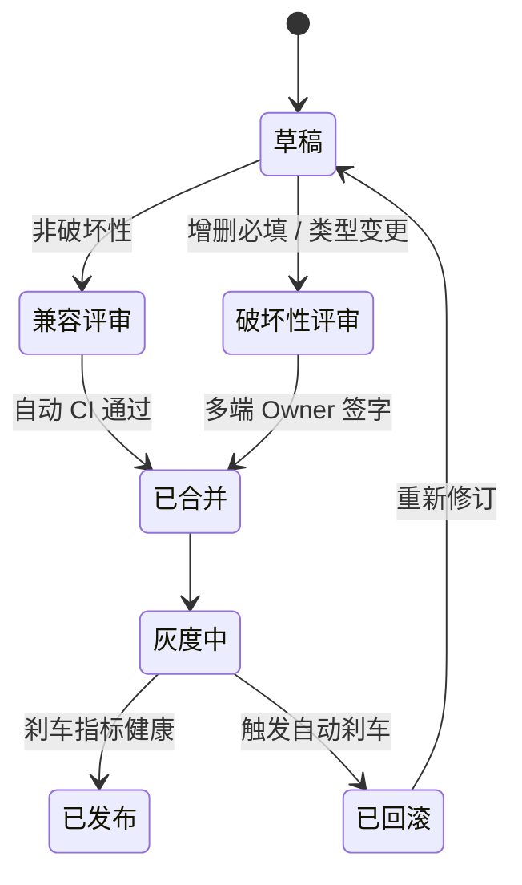
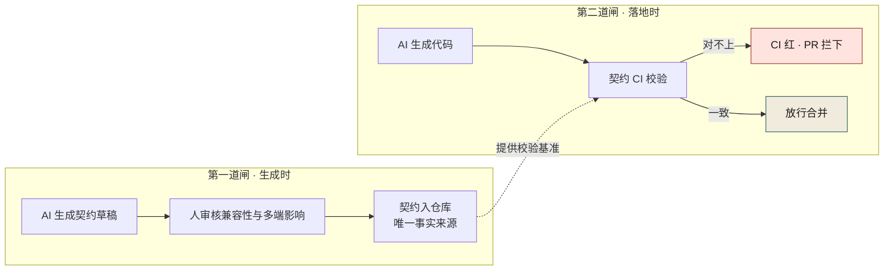
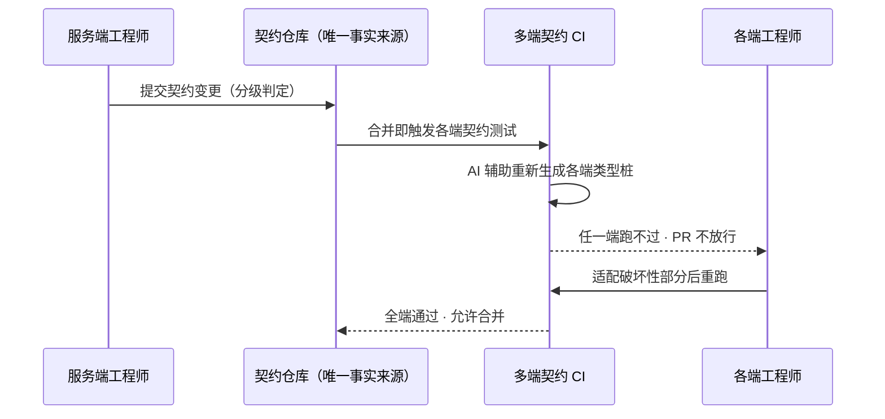
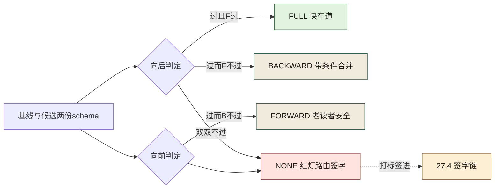
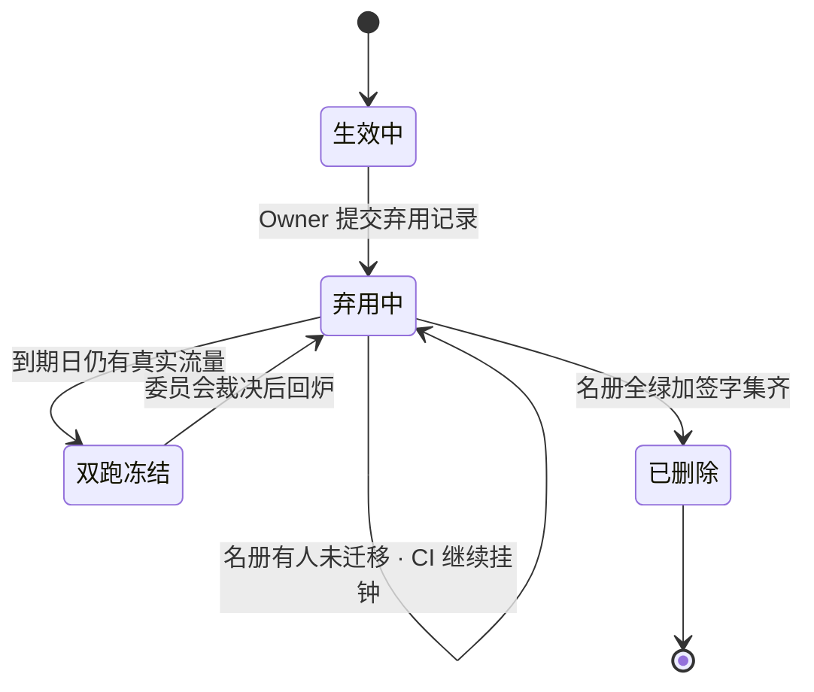

# 第 27 章 跨团队契约治理：变更、版本、多端同步

> **本章定位**：治理篇的契约层。本章回答"为什么改实现不改契约会反复闯祸"，并把契约从"代码的附属文档"升级为"全平台唯一事实来源"。
> **核心命题**：契约必须先于代码、契约变更必须有签字人、多端契约 CI 自动拦截；组织里所有反复发生的事故，根子都是"靠自觉"，解药都是"靠机制"。

---

## 27.1 问题：同一种事故，犯了两次

两次多端白屏事故，相隔十个月，**根因一模一样**：有人（或 AI）改了接口的实现，契约仓库没人更新，于是端上拿到的结构和实际不符，白屏。

第二次出事时，多端负责人在会上不留情面：

> "上次白屏是 47 分钟，这次是 2 小时，三个端。中间这十个月，治理组在干什么？"

当时治理组的回答很难站住脚——"在推契约先行"。多端负责人当场顶回来：

> "推了十个月，接口和契约还是对不上。**问题不是推不推，是没有人能拦住'改了实现不改契约'这件事。**"

他说得对。写了规范、做了培训、发了 ADR，但**没有任何一道强制手段，能让"改实现不改契约"这件事在上线前被拦下来**。规范是软的，事故是硬的。软的拦不住硬的。

这次会后必须下定的决心是：**契约治理不能再靠"希望大家遵守"，必须靠"想不遵守也做不到"。** 这就是本章全部内容的起点。

---

## 27.2 根因：契约不是"事实来源"，代码才是——这是组织级的默认设置



**图 27-1｜契约变更分级** — 破坏性变更必须走签字；实现追契约，不是契约追实现。

读图 27-1 的关键在草稿处的那一分岔：增删必填、类型变更被划进签字线，多端 Owner 不签就停在评审里；非破坏性一路只靠自动 CI 放行。第二次白屏那次"字段从对象改数组"，在图上正是撞在签字线这一侧的变更；另外留意"已回滚 → 草稿"那条回边——被刹车拦下的变更不是被扔掉，是回到草稿箱重走一遍分级。

为什么"改实现不改契约"会反复发生？因为在大多数公司，**默认的事实来源是代码，不是契约**。

具体表现是：

**① 契约是代码的附属品。** OpenAPI 文件躺在某个仓库的 `docs/` 目录里，是开发者"顺手"维护的，没人对它负责。代码一改，契约就成了过期的注释。

**② AI 改代码不会去碰契约。** AI 的上下文是当前文件，它不知道有个契约仓库需要同步——就算知道，它也不会主动去改，因为"让代码跑通"才是它的目标。

**③ 多端各自验证，没有中心契约。** 安卓、鸿蒙、iOS、Web、小程序，每端都有自己的 mock，没有一份"唯一对的"契约。于是同一个接口，五个人有五种理解。

**④ 没有"破坏性变更"的概念。** 加个字段、改个类型、删个返回值，都叫"小改动"，没人区分。**而第二次白屏事故恰恰是一次"小改动"——把一个字段从对象改成数组，三端全炸。**

四条根因，归结成一句：**契约没有"事实来源"的地位，所以它一定被代码甩在后面。** 治理要做的，就是把这句话反过来——让契约成为事实来源，让代码去追契约，而不是反过来。

---

## 27.3 AI 用法：AI 生成契约，人审核契约；AI 生成代码，契约卡住代码

契约治理里，AI 的位置很明确：

- **AI 可以生成契约草稿。** 给它一份接口描述，它能产出 OpenAPI / Protobuf 的初版，效率很高。试点期某些域 70% 的契约草稿是 AI 生成的。
- **AI 不可以"批准"契约。** 批准意味着对兼容性、对多端影响的判断，这是人的事。
- **AI 生成的代码，必须过契约校验。** 代码跑得再漂亮，和契约对不上，CI 直接红。

这套机制的核心是**两道闸**：

```
第一道闸（生成时）：AI 生成契约 → 人审核 → 契约入仓库
第二道闸（落地时）：AI 生成代码 → 契约 CI 校验 → 对不上就拦
```

把这两道闸画成一张图，就是契约先行的完整闭环：



**图 27-2｜两道闸** — 第一道闸管"契约怎么来"（AI 起草、人批准），第二道闸管"代码能不能走"（契约 CI 硬校验）——合规性从说服变成了编译错误。

图 27-2 最容易被略过的是两个子框之间的那条虚线：第一道闸里的"契约仓库"向第二道闸的 CI 节点"提供校验基准"。没有这条线，两道闸只是互不相干的两个流程；有了它，生成时人审核的结果才成为落地时机检的输入——闭环是这一条线画出来的。

**第二道闸是事故之后才补上的。** 在那之前，只有第一道（而且是软的）。补上之后，契约一致率从"未度量（估计 < 60%）"升到 97.4%。**这就是"想不遵守也做不到"的意思——合规性从说服变成了编译错误。**

---

## 27.4 角色博弈：破坏性契约变更，签字权归谁

这是治理者最不愿意让、最后也让了的一块权力。

**冲突 · 治理者 vs 多端负责人。** 第二次白屏事故之后第三天，多端负责人提要求：

> "破坏性契约变更，必须我签字。"

治理者一开始很抗拒。理由是：如果每个破坏性变更都要多端 TL 签字，治理节奏会被拖死，治理者自己管的核心链路也常被卡。

多端负责人不退：

> "你卡？你卡的是审批时间。我卡的是凌晨起来排查白屏。你那 30 分钟的审批，抵得过我 2 小时的线上事故吗？"

这笔账算下来治理者无话讲——**审批的成本和事故的成本不在一个量级，把签字权放在离端最近的人手里，总体成本最低。**

最后治理者让了：**破坏性契约变更必须多端 TL 签字；非破坏性变更不需要。** 作为交换，多端负责人接受"签字必须在 2 个工作日内完成，过期视为同意"——这是后来写进章程的时限否决机制。

**让出去的是权力，换回来的是"破坏性变更不再炸端"。** 这个交换值不值？从那次事故之后再没出过多端白屏这件事看，值。

---

## 27.5 产出物：契约治理规范 + 变更流程 + 多端同步机制

可落地的三件（详细模板见附录 I 和本书配套的 `21-契约治理规范模板.md`）：

### 1. 契约治理规范

- **双源契约**：OpenAPI（HTTP）+ Protobuf（RPC）并存，互相同步。
- **事实来源**：契约仓库唯一，代码必须追契约。
- **变更分级**：兼容性变更（加字段、加端点）/ 破坏性变更（删字段、改类型、改语义）。

### 2. 变更流程

```
提案（RFC）→ 契约草稿（AI 生成 + 人审）→ 分级判定
  ├─ 兼容性变更 → 入仓库 → 通知各端
  └─ 破坏性变更 → 多端 TL 签字（2 工作日时限）→ 入仓库 → 各端排期
```

### 3. 多端契约同步机制

- **契约变更触发多端 CI**：契约仓库一变，各端的契约测试自动跑。
- **跑不过 = 不让合**：任何一端契约测试失败，PR 不能合并。
- **端侧桩自动生成**：契约变了，各端的类型桩由 AI 辅助重新生成，人只审核破坏性部分。

这三条机制连起来，是一条不靠自觉、只靠触发的自动同步链：



**图 27-3｜多端契约同步时序** — 契约仓库一变、多端 CI 自动跑、跑不过就不让合——同步靠机制触发，不靠各端自觉。

图 27-3 里实线全是触发、虚线全是闸门："合并即触发各端契约测试""AI 辅助重新生成类型桩"都不必有人记得按下按钮；两条虚线一个发往端工程师（任一端跑不过 · PR 不放行）、一个回到契约仓库（全端通过 · 允许合并），人在整条链上只出现在"适配破坏性部分后重跑"那一格。

> **代价声明**：多端 CI 上线后，端侧 CI 时长增加约 18%，一线会抱怨“为了一个字段加了个类型，所有端全跑一遍”。**这个代价换来的，是之后再没有端上白屏。** 这笔账值得认，但要写进数字清单，不藏。

---

## 27.5b Schema 兼容性四模式：判定表先行，代码随后

第 9 章 9.5h 把兼容判定约减成三条机检（字段号、可选性、默认值），本节回答它的下一问：三条检查合成之后，产出的并不是“兼容 / 不兼容”一条双车道，而是**四种模式**。先想清楚为什么会有两个相反的方向：向后兼容保护的是**存量**——新 schema 的消费者要读得出旧生产者写下的历史数据；向前兼容保护的是**掉队者**——旧 schema 的消费者要读得出新生产者今天写下的数据。生产者与消费者从不同时升级：服务端当天上线，端上的老版本 App 还要活几个月（这条多端现实归[第 17 章](./ch22-第17章-多端BFF.md)管）。方向相反，是升级次序相反。

| 模式 | 判据（一句话） | 允许 | 禁止 | 典型场景 |
|------|----------------|------|------|----------|
| BACKWARD | 新读者能读旧数据 | 删字段；新增带默认值的字段 | 新增必填且无默认（旧数据给不出值） | 读者先于生产者升级，存量数据是包袱 |
| FORWARD | 旧读者能读新数据 | 新增字段（旧读者无视）；删带默认的字段 | 删旧读者非等不可的字段（必填无默认） | 生产者先动、端上动不了——老版本 App 场景 |
| FULL | 上面两条同时成立 | 只留双向都活的变更（如新增带默认） | 一切单向增删 | 两端各自发版、不保证先后 |
| NONE | 不做判定 | — | — | 开发实验仓；生产禁用 |

判定器四十行、纯标准库（`NO_DEFAULT` 哨兵区分“默认值是 null”与“根本没有默认值”——这一格不分家，FULL 就永远判不准）：

```python
NO_DEFAULT = object()

def backward_ok(older, newer):
    """向后：新 schema 读旧数据。旧数据缺新字段——必填又无默认就读不出来。"""
    for f in set(newer) - set(older):
        req, dflt, _ = newer[f]
        if req and dflt is NO_DEFAULT:
            return False
    return all(older[f][2] == newer[f][2] for f in set(older) & set(newer))  # 类型变更双向皆破

def forward_ok(older, newer):
    """向前：旧 schema 读新数据。新数据不再写被删字段——旧读者等一个不会再来的必填。"""
    for f in set(older) - set(newer):
        req, dflt, _ = older[f]
        if req and dflt is NO_DEFAULT:
            return False
    return all(older[f][2] == newer[f][2] for f in set(older) & set(newer))

def mode(older, newer):
    b, f = backward_ok(older, newer), forward_ok(older, newer)
    return "FULL" if b and f else "BACKWARD" if b else "FORWARD" if f else "NONE(拒)"
```

拿第 9 章 9.5c 的退款契约做底，构造四条变更各判一次（**本机实跑，纯标准库，Python 3；统计对象是四条构造的变更样例——契约字段为示意，不是任何案例的真实 schema**）：

```text
S1 删除必填 currency             backward=True  forward=False -> BACKWARD
S2 新增必填带默认 coupon_gap      backward=True  forward=True  -> FULL
S3 新增必填无默认 coupon_gap      backward=False forward=True  -> FORWARD
S4 currency 改 int64             backward=False forward=False -> NONE(拒)
```

S3 这条读数值得多看一眼，它和 9.5c 判定表第 1 条表面上打架：同样是“新增字段”，带默认走 FULL 快车道，不带默认只拿到 FORWARD——**它没有变破坏性，只是变单向了**。新必填字段砸不坏老读者（无视即可），砸坏的是新读者回头读存量。判红判绿从来不是变更的属性，是变更与升级次序的属性。判定器本身长这样：



**图 27-4｜兼容判定器的四出口** — 同一条变更、两次独立判定、四个出口；NONE 不是终点，是签字链的起点。

图 27-4 的四个出口与上面四条读数一一对应：S1 落 BACKWARD、S2 落 FULL、S3 落 FORWARD、S4 进 NONE 再被打标签路由去签字链。最后一格方言：模式名之外还有一维——只与上一版比，还是与全部历史版本比（Avro 生态的 `*_TRANSITIVE` 方言）。判定器代码感觉不到这一维，基线表能：只要注册表里还有一个消费者在读老版本，FULL 的实际含义就退化成“对全存量比较”——这是口径问题，不是代码问题，写进契约仓 README 而不是门禁注释。

---

## 27.5c 字段号回收为什么危险：一个可核对的反例

名字删得掉，号删不掉——线格式不记事，只记数。Protobuf 编码节（规范口径，B 档）：消息里每个字段前只有一个 tag，`tag = 字段号 << 3 | 线型`，**字段名与类型声明都不随字节旅行**。于是“删字段后把旧号发给新字段”等于把一个匿名插槽改姓。这一节把反例做成能跑的：一个按同样编码规则写的极简编解码器（**本机实跑，纯标准库自写玩具实现；它不是 protobuf 运行时——本机没有 protoc，这里只验证“字节面只认号与线型”这一机制本身**）：

```python
def varint(n):                                   # protobuf 的变长整型编码形状
    out = bytearray()
    while True:
        b = n & 0x7F; n >>= 7
        out.append(b | (0x80 if n else 0))
        if not n: return bytes(out)

def encode(fields):                              # fields = {字段号: (线型, bytes)}
    buf = bytearray()
    for num, (wire, payload) in sorted(fields.items()):
        buf += varint((num << 3) | wire)         # tag：线上唯一的身份字节
        if wire == 2: buf += varint(len(payload))
        buf += payload
    return bytes(buf)

def read_bytes(data):                            # 盲解：不看任何 schema，只按自带 tag 走
    i, out = 0, []
    def rv():
        nonlocal i; val = 0; shift = 0
        while True:
            b = data[i]; i += 1; val |= (b & 0x7F) << shift; shift += 7
            if not b & 0x80: return val
    while i < len(data):
        t = rv(); num, wire = t >> 3, t & 7
        if wire == 2:
            ln = rv(); val = data[i:i+ln]; i += ln
        else:
            val = rv()
        out.append((num, wire, val))
    return out

old_msg = encode({4: (2, "12.50".encode())})     # 号 4 曾经属于 coupon_gap（金额字符串）
print("老字节流 hex:", old_msg.hex())
print("盲解:", read_bytes(old_msg))
recycled = encode({4: (2, "APP".encode())})      # 号 4 被回收给 channel（渠道字符串）
print("回收后同 4 号同线型:", read_bytes(old_msg + recycled))
```

```text
老字节流 hex: 220531322e3530
盲解: [(4, 2, b'12.50')]
回收后同 4 号同线型: [(4, 2, b'12.50'), (4, 2, b'APP')]
```

三行读数的危险各不同。第一、二行：**存量老消息在线上只写着“4 号、长度前缀”，没有任何东西表明它是金额还是渠道**——回收之后，新消费者读到存量就把 `12.50` 当成 channel 的合法取值，不抛异常、不打日志，数据安静地烂掉。第三行更险：回收号上线后新消息正常写 4 号，此时任何还压在存量里的老 4 号与新 4 号在字节面上**不可区分**——没有哪行代码能事后把它们分开，能分开的只有从未发生过回收这一事实。同号换线型则看运气：可能报解码错误，也可能把后续字段整体错位吞掉，两种都不如静默错值可控。

所以防线只有一条能机检：**回收号绝不上线**。三件配套：proto 源文件的 `reserved` 留号留名（第 9 章 9.5e 已给形状，protoc 会拒绝复用）；契约仓维护一张“字段号占用表”，新 PR 复用了历史号就红灯——这张表必须只增不删；JSON 编码面按字段名认字段，所以 `reserved` 连名字一起留。

---

## 27.5d 弃用策略与到期执行：谁写、谁关、关不掉怎样

27.5b 判“现在能不能改”，弃用管“将来怎么删”。没有到期机制的弃用就是注释，有到期机制的弃用才是项目。弃用记录是一份带消费方名册的工件（yaml 形状，落契约仓 `deprecations/`，示意字段）：

```yaml
field: coupon_gap
since: "2.3"                  # 声明弃用的契约版本
sunset_after: "2027-03-31"    # 示意到期日：不得早于消费方最长老版本的生命周期
owner: 交易域TL
consumers:                    # 名册由消费方各自认领填写，空名册不受理
  app_android: migrated
  app_ios: pending
  web: migrated
signoff_required: [多端TL]     # 执行删除那天需要集齐的签字
```

三段权责，逐条回答“谁”：

- **谁写**：契约 Owner 写弃用声明，但 `consumers` 名册只能由每个消费方自己填——写别人“应该适配完了”是 27.5c 静默错值的组织版。CI 校验空名册与全 pending 名册：受理即红灯。
- **谁关**：删除字段是一个新 PR，绿灯条件是三条同时成立——名册全员 `migrated` 且各有代码证据（引用该字端的测试或调用点已消失）、`signoff_required` 集齐、`sunset_after` 已过。缺一条，PR 停在评审，不进签字链。
- **关不掉怎样**：`app_ios: pending` 挂到到期日，两种命运。名册说有人读、遥测说没流量——僵尸消费方，由“无流量证据 + 风险认领”裁决走快速删除；真有人读（老版本 App 还在架上）——**该字段永远双跑，契约演化被一个端的排期锁死**，这就不是契约问题了，上会，按[第 26 章](./ch31-第26章-组织治理.md)三类必上事项处理。

弃用有生命周期，画出来就是状态机——要紧的不是状态名，是每条出边的执行人：



**图 27-5｜弃用字段的到期生命周期** — “弃用中”是个会自己过钟的驻留态：到期不自动删，全绿才删；任何一个 pending 都能把它推进“双跑冻结”。

图 27-5 与图 27-1 的分工：前者管单个字段的退役行程，后者管整份契约的变更分级；字段在退役路上被冻结，回到的是弃用态而不是草稿态——契约演化是逐字段的，不是推倒重来。

---

## 27.5e 契约仓 CI 的拒绝行形状

这道门的职责不是说不行，是说是**哪条变更、哪个方向、缺谁签字**。拒绝行的形状 = 一条判定证据 + 一个非零退出码，27.5b 那四行输出就是证据，CI 的接法（示意）：

```yaml
# .github/workflows 形状：红灯判据是自研判定器的输出与退出码，不是人眼
- name: 兼容性判定与路由
  run: |
    python3 tools/schema_compat.py contracts/trade/refund-base.json /tmp/pr.json > compat.out
    grep -q 'NONE(拒)' compat.out && exit 1                      # 双向全破：红灯即拒绝
    grep -Eq '\-\> (BACKWARD|FORWARD)$' compat.out && exit 2     # 单向活：退出码 2 路由签字链
```

退出码的语义要事先声明：`1` 是拒绝合并，`2` 是“允许存在但必须带 `breaking` 标签进 27.4 签字链”——把单向兼容直接判死，团队就会学会把它报成兼容，这正是 9.5d 破坏性占比持续为零的成因。两个静默失效面：其一，这道门若只挂在契约文件的 path filter 上，**“改了实现没改契约”那类 PR 根本不触发它**——兼容判定必须进 merge queue 的 required checks，触发条件是“实现与契约同仓/成对”的映射表（第 9 章 9.5b 第 1 步那个家）；其二，门禁要定期活检——故意往影子分支合一条双向破坏的变更，看它红不红，从没红过的门等于没有门。

`buf`、`oasdiff` 这类专职比对器：**本机未安装，本书不贴它们任何一行输出或报错文本（R2 证据纪律）**。可核实的只有它们的通用形状：吃基线与候选两份文本，判据以非零退出码表达，具体字符串以你环境里 `--version` 对齐后实跑为准。它们在双源同闸里的接线见[第 9 章](./ch14-第9章-契约先行.md) 9.5c 与 9.5e。

---

## 27.5f 契约治理机制的生效证据清点：每条机制挂着哪份产物

27.2 立下「契约是唯一事实来源」这句话，27.3 造出两道闸，27.5 到 27.5e 把兼容判定、字段号防线、弃用生命周期、CI 拒绝行逐个做成了工件。这一节把这些机制逐条翻回证据面：每条机制在生产上该留下什么可翻的东西、这条证据怎么读、它落在三态里的哪一态——**有产物**（实物在、读数可取）、**产物可造假**（实物在，但它的绿灯可以在机制没生效的情况下照样亮）、**无产物**（机制的说法还在，载体已经不在）。表内读数全部引自本章前文并逐格标出处，不新增任何读数；这副三态量尺与第 25 章 25.6b 给文档产物用的是同一副，本节只换对象、不换尺。

| 机制（出处） | 生效产物 | 三态 | 这条证据怎么读 | 没有产物时退回什么样子 |
|---|---|---|---|---|
| 契约仓唯一事实来源（27.5 规范第 2 条） | 契约仓本体＋各端类型桩的生成来源标注 | 产物可造假 | 逐端问一句「这个桩从哪来」：27.2 根因③ 点过的那几端里，只要有一端还从自己仓里的 mock 出桩，「唯一」即为假；它的前身是 27.2 根因①——OpenAPI 躺在某个业务仓的 docs 目录里，是「顺手」维护的 | 退回 27.2 根因①：契约是代码的附属品，代码一改它就成了过期的注释 |
| 变更分级（图 27-1 草稿处的分岔＋27.5 规范第 3 条） | `breaking` 标签（27.5e：exit 2 进签字链的凭据） | 产物可造假 | 标签数对契约 PR 总数的占比长期为零，而同期的 diff 里出现过类型变更（27.5b：类型变更双向皆破）——两个读数互证，必有一个在撒谎；27.5e 已把这条形状钉死为「把单向兼容判死，团队就会学会把它报成兼容」 | 退回 27.2 根因④「没有破坏性变更的概念」，而 27.1 那次三端白屏恰恰就是这种被叫作「小改动」的变更 |
| 兼容性判定器（27.5b 那四十行＋S1 到 S4 四行输出） | `compat.out` 的模式名行＋退出码 1／2（27.5e） | 有产物（本章逐行贴过输出，并声明那是四条构造样例、不是任何案例的真实 schema） | 输出的模式必须与 PR 实际走的路径一致：判 FULL 却进了签字链、判 NONE(拒) 却合并了，都是门被绕开的形状；`NO_DEFAULT` 那一格（27.5b：「默认值是 null」与「根本没有默认值」不分家，FULL 就永远判不准）要有一条反例常驻覆盖 | 退回 27.5e 说的靠人眼判兼容——「判定表先行，代码随后」只剩表，先行没了 |
| diff 门（27.5e 的 required checks＋实现与契约成对映射表） | 门挂在 merge queue 上的配置＋一次真红过的活检记录（27.5e：影子分支合双向破坏变更） | 产物可造假——全表最险的一格 | 只挂在契约文件的 path filter 上时，「改了实现没改契约」那类 PR 根本不触发它（27.5e 静默失效面其一），于是门永远绿；分辨法只有活检那一条——从没红过的门等于没有门（27.5e 原话） | 退回 27.1 那一刻：写了规范、做了培训、发了 ADR，而没有任何一道强制手段拦得下这件事 |
| 字段号占用表与 `reserved`（27.5c 三件配套，protoc 拒复用的形状见第 9 章 9.5e） | 占用表本体（只增不删）＋ proto 源文件的保留行＋JSON 面的名字保留 | 有产物，但「只增不删」是纪律不是机检 | 表的写入增量要和契约仓的删字段动作同向；零增量而仓里删过字段，即写手停了；`reserved` 要号与名两处各查一遍——只留号不留名是半件防线，因为 JSON 编码面按字段名认字段（27.5c 末段） | 退回 27.5c 那三行盲解读数：一次号回收就把 `12.50` 当成 channel 的合法取值喂给新读者，不抛异常、不打日志，数据安静地烂掉 |
| 消费方名册（27.5d `consumers`，由各消费方自己填） | 名册条目＋每条 `migrated` 背后的代码证据（27.5d「谁关」第 1 条：引用该字段的测试或调用点已消失） | 产物可造假 | 全员 `migrated` 而「代码证据」那栏从没被翻过，就是 27.5d 点名的组织版静默错值；「空名册与全 pending 名册受理即红灯」这条 CI 自己有没有读者，要单独验一次 | 退回本节末点名的那个暗面：**一条从没被消费方真读过的契约**——名册全绿只是没人否认它 |
| 弃用到期钟（27.5d `sunset_after`＋图 27-5 那条「名册有人未迁移 · CI 继续挂钟」自环） | `deprecations/` 下的记录＋一次真走过「已删除」出边的删除 PR | 无产物（本章给的是一份示意字段清单，不是运行件） | 只问一句：哪一条弃用记录走完过图 27-5 的任一条出边？一条也没走过，`sunset_after` 就还是注释而不是项目（27.5d 首句） | 退回 27.5d 末段那种锁定：契约演化被一个端的排期锁死，而这件事按第 26 章三类必上事项上会，已不是契约问题 |
| 多端契约 CI（27.5 第 3 件第 1、2 条＋图 27-3 的实线段） | 每次契约合并触发的各端测试记录＋端侧 CI 时长读数（27.5 代价声明：约 18%） | 有产物，而且代价记了账 | 时长是「触发真的发生过」的外证：契约照合并、各端 CI 时长却一路回落到接近零增量，多半是触发链断了而不是变快了 | 退回 27.8 反模式第 6 条「契约 CI 只跑服务端」——端上白屏照炸 |
| 契约变更通知各端（27.5 变更流程第 1 支「入仓库 → 通知各端」） | 无产物——本章给了「通知」这个动作，没给它任何载体；同支末尾那格「各端排期」同样无载体 | 无产物 | 只能反查两件别的事：契约合并后有没有对应的端侧适配 PR（27.4 时限否决那一行用的是同一个外证），以及名册有没有新增认领（27.5d）；通知本身不留痕，今天它全靠各端自己盯仓 | 退回 27.8 反模式第 7 条「契约变更不通知各端」——老版本用着老契约、新契约一上就崩，这正是 27.1 那两次白屏的端侧形态 |
| 契约灰度态的自动刹车（图 27-1 那两条边：「灰度中 → 已发布 · 刹车指标健康」「灰度中 → 已回滚 · 触发自动刹车」） | 无产物——本章只把刹车写进了边名，三条口径全在第 28 章那边 | 无产物 | 读法是问一句：一条契约从灰度中跳到已发布，当时看的是哪三条读数？答得出编号（第 28 章 28.5 第 2 件）才算有闸；本节刻意不复述那三条，免得与 28.5g 的清点重复计账 | 退回把状态机上那条回滚边当装饰的常见读法：有一条「已回滚」态，不等于有人会在半夜执行它 |
| 端侧桩自动生成、人只审破坏性部分（27.5 第 3 件第 3 条） | 桩的 diff＋其中被人工审过的区间标注 | 产物可造假 | 「只审破坏性部分」的反面是非破坏性段落永久没人看，而 27.5b 的 S3 恰好是「没有变破坏性、只是变单向」那一类——它正落在没人看的那一段里 | 退回 27.2 根因③：多端各自验证、没有中心契约，同一个接口五个人五种理解 |
| 签字链与时限否决（27.4：破坏性必多端 TL 签字、2 工作日过期视为同意） | 带时间戳的签字件＋走过「过期视为同意」那一支的记录 | 产物可造假——签字件最硬，也最容易烂 | 签字时间戳必须早于变更生效（27.4 的因果是「签字权放在离端最近的人手里」）；若「过期视为同意」被反复用到，而该变更事后没有任何端侧适配 PR，那就是橡皮章形状 | 退回 27.4 那笔账：省下 30 分钟的审批，换回 27.1 那种 2 小时三端的线上事故 |
| AI 起草与人批准（27.3：试点期某些域 70% 草稿、AI 不可批准） | 草稿作者字段与批准人字段，以及两版之间的 diff | 产物可造假 | 两个字段都有名字而草稿与批准版本零差异——「我审过了」的秒审形状，图 27-2 的两道闸当场塌成一道 | 退回 27.3 那句职责：批准意味着对兼容性与多端影响的判断；没人判断时，契约只是 AI 从实现反推出来的化石 |
| 双源契约互相同步（27.5 规范第 1 条：OpenAPI 与 Protobuf 并存互同步） | 无产物——本章给了「互相同步」四个字，没给承载它的比对件 | 无产物 | 这一格只能登记「缺件」：哪一个 HTTP 字段对应哪一个 RPC 字段、两侧的版本锚（27.5d 那种 `since` 形状）是否同值，今天无人能答 | 退回 27.6 案例三那一行的原事故形状：契约与策略代码漂移 |
| 「兼容性靠人记」的口径（27.5b 末段：`*_TRANSITIVE` 写进契约仓 README 而不是门禁注释） | README 里的那一行文字 | 无产物（本章最典型的一格：规则在、读者不在） | README 没有 CI 读者，于是「只与上一版比还是与全部历史比」这个口径只在有人恰好读过那一行时才生效；反查动作免费：门禁注释里有没有同一句 | 退回 27.2 那句组织级默认设置：事实来源仍然是代码，契约只是它旁边的一段说明 |

三态各点名过之后要说破契约治理特有的两个暗面。第一个是**一条从没被消费方真读过的契约**：它的证据面与一份被每个消费方真读过的契约完全相同——名册全绿（27.5d）、各端 CI 全绿（27.5 第 3 件）、一致率照涨（27.3 的 97.4%），上表读不出「没被读过」这件事，只有「走过这一支的变更有没有对应端侧适配 PR」能读，所以那一格把读法押在 PR 存在性上而不是绿灯上。第二个是**一份「兼容性靠人记」的规则**：27.2 要反转的那句默认设置并没有被删掉，它只是从代码仓搬进了契约仓 README，从「代码是事实来源」变成「口径在文档里，请自取」。

这张清点自己的态分布也要读一次：本章的机制全部落进三态之后，**有产物**只有三格——判定器的输出（27.5b 那四行）、字段号占用表与 `reserved`（27.5c）、多端契约 CI 那笔记了账的时长（27.5 代价声明）；**产物可造假**占了七格，而且专挑本章最硬的那几件——唯一事实来源、分级、diff 门、名册、端侧桩、签字链、AI 批准；**无产物**五格，恰好都是 27.5 到 27.5e 新立的机制——到期钟、通知、排期与刹车挂接、双源同步、README 口径。这个分布不是坏消息，它是本章命题的另一半——27.1 说「没有任何一道强制手段」，而强制手段要一件件造，造的顺序就该按这张表的空行来排，不是按念起来顺不顺来排。

缺哪一列会复发本章写过的哪种病：没有三态列，清点就退化成一堆绿灯的清单，而 27.7 那六条勾选项正是全章最容易产出假绿的地方；没有「怎么读」列，27.5e 的活检记录会被拿去替「门一直有效」作证，而一次活检只证明被验那一刻门是活的；没有「退回什么样子」列，本节就是在建议读者删掉那些看不见的机制——而 27.8 七条反模式里有四条（第 1、3、4、6 条）在今天的表里都是「产物在、读法不在」的形态。这一节与 25.6b 的分工要说清：那一张量的是文档产物是闸还是纸，本节量的是契约工件会不会替一个从没发生过的同步作证。

---

## 27.5g 契约治理决策点表：哪条读数越线触发哪道闸、谁拍、多久复核

图 27-1 管一份契约的变更走哪条分级路径，图 27-4 管一条变更落哪个兼容出口，图 27-5 管单个字段的退役行程——三张图都是自动形状的图。这一节管自动形状之上必须有人拍板的那半：每行 = 读数（标出处）→ 上会判据（什么形状算越线，只写形状不写手感）→ 触发后的动作 → 签署方 → 时限锚。签署方全部沿用本章已经出场的人，不新增人物、不新增读数：治理者（27.1 与 27.4 的那位谈判方）、多端负责人（27.1 顶上来的那位、27.4 提签字要求的那位）、多端 TL（27.4 的签字方、27.5d 的 `signoff_required`）、契约 Owner（27.5d 弃用记录的 owner 格，示例落点为交易域 TL）、服务端工程师与各端工程师（图 27-3 的两个泳道）、消费方（27.5d 名册的自填方）、委员会（图 27-5「委员会裁决后回炉」那条边）、一线工程师与决策层、风控负责人与 SRE 负责人（27.6 四案例映射表里出场的这几位）。

| 读数（出处） | 上会判据（什么形状算越线） | 触发后的动作 | 签署方 | 时限锚 |
|---|---|---|---|---|
| 契约一致率（27.3：从「未度量（估计 < 60%）」到 97.4%） | 一致率不降而 27.5e 那个 exit 2 的路由计数长期为零——形状是「门在跑、从不路由」；或一致率上行而同期无门禁改动 | 抽期内变更逐条回 27.5b 判定器重裁，并把 27.5b 末段那条口径从 README 回填进门禁注释 | 治理者提请，多端 TL 裁边界（27.4 已把裁边界的权给到离端最近的人） | 契约合并那一刻（图 27-3「合并即触发各端契约测试」） |
| `breaking` 标签占比（27.5e 引第 9 章 9.5d 的「持续为零即怀疑全员报兼容」成因） | 占比持续为零，而同批 diff 里出现过类型变更或必填增删（27.5b 的判据词表） | 退出码 1／2 的语义在 CI 里重钉（27.5e：语义要事先声明），路由重新接回 27.4 签字链 | 契约 Owner 报数，治理者核这条红灯没有被绕开 | 下一次门禁活检之前（27.5e 的「定期活检」） |
| 判定器落 NONE(拒) 的次数（27.5b 的 S4 输出） | 全零而契约仓同期有字段增删记录——形状是「门与写路径脱钩」，不是「团队运气好」 | 把兼容判定推进 merge queue 的 required checks，补齐实现与契约成对映射表（27.5e 静默失效面其一，落点见第 9 章 9.5b 那个「家」） | 服务端工程师补映射表（图 27-3 的发起人），治理者验收 | PR 不放行那道闸（27.5 第 3 件第 2 条「跑不过 = 不让合」） |
| 字段号占用表的写入增量（27.5c 三件配套第 2 条：只增不删） | 表零新增而契约有删字段动作；或表被删过行——形状是「防线自己退化」，两种都不报红 | 补登记，并走一次影子分支活检：故意投一条回收号看它红不红（27.5e 的活检形状） | 契约 Owner 补表，多端 TL 认这次红灯不进豁免 | 每次契约合并即触发（图 27-3 的实线段） |
| 名册挂到 `sunset_after` 仍未清（27.5d 示例里的 `app_ios: pending`） | 到期日已过而名册未全员 `migrated`——图 27-5 那条自环走到了尽头 | 两命运分岔：遥测无流量则按「无流量证据 + 风险认领」裁决走快速删除；确有老版本在读则进双跑冻结并上会（第 26 章三类必上事项，27.5d 原文） | 消费方填名册、多端 TL 集齐 `signoff_required`、委员会裁决回炉（图 27-5 出边各自的执行人） | `sunset_after` 到期日（27.5d） |
| 「过期视为同意」的使用次数（27.4 章程的时限否决） | 走过这一支的变更事后没有任何端侧适配 PR——形状是「同意在、读者不在」 | 该次变更退回破坏性评审态（图 27-1 签字线那一侧），补名册认领后重签 | 多端负责人（27.4 提要求的那位）会同相关端工程师 | 2 个工作日（27.4 写进章程的那条时限） |
| 端侧 CI 时长增量（27.5 代价声明：约 18%） | 时长读数一路回落到接近零增量而契约合并照常发生——代价消失通常意味着触发断了，而不是变快了 | 恢复触发面，并把这笔代价重新登记（27.5 的原口径是「要写进数字清单，不藏」） | 各端工程师报异常，治理者记代价账 | 契约变更触发的那一次（图 27-3 的第一条实线） |
| AI 草稿与人批准之间的差异（27.3：某些域 70% 草稿、AI 不可批准） | 批准版本与草稿零差异，而该契约含必填或类型变更——秒审形状 | 重走人审，兼容性与多端影响两问要有书面答案（27.3 第一道闸的职责原文） | 契约 Owner 签人审结论，多端 TL 复核破坏性段落 | 契约入仓库之前（27.3 第一道闸的终点） |
| FORWARD 出口占比（27.5b 的 S3：没变破坏性、只是变单向） | 单向出口变多而端上排期未启动——形状是「把风险转给了不能动的端」 | 老版本 App 与强制升级的问题按 27.9 第一条移交多端 BFF 相关章节，本表不新增判据 | 多端负责人（27.4 那张谈判桌） | 各端排期启动之前（27.5 变更流程第 2 支的落点） |
| 契约合并后端侧适配 PR 的条数（27.5 流程第 1 支「入仓库 → 通知各端」＋27.8 反模式第 7 条） | 契约合并频繁而端侧适配 PR 长期为零——形状是「零反对被读成零问题」；反向形状是适配 PR 为零且名册也为零（27.5d：空名册受理即红灯） | 把通知落进名册认领：各端在 `consumers` 里登记自己的态，不登记即无资格在事故时主张不知情 | 消费方自填、契约 Owner 核空名册（27.5d「谁写」段那条 CI 判据） | 各端排期启动之前（27.5 流程第 2 支末格） |
| 一条契约从灰度中跳到已发布（图 27-1 那两条边） | 这一跳没有对应的刹车读数；或「灰度中」这一态被整段跳过（合并即发布）——形状是状态机上有一态从不留痕 | 契约灰度的刹车口径挂到第 28 章 28.5 第 2 件那三条上（交叉引用，本表不复述阈值），并把「灰度中」设为必经态 | SRE 负责人提请（27.6 案例三那位的表格落点），多端 TL 认这个必经态 | 「灰度中 → 已发布」那一跳之前（图 27-1 的边名） |
| 双源字段与版本锚是否同值（27.5 规范第 1 条＋27.5d 的 `since` 形状） | 两源出现任一不一致即上会——本行有意只登记「该上会」，因为它缺的是比对件而不是阈值（27.5f 已把这一格标为无产物） | 先补比对件，再谈判据；比对件补齐之前这一行按假设运行并写明 | 一线工程师与 SRE 负责人（27.6 案例三那一行的两位） | 本表不敢给它时限锚——本章无对应读数，这份欠账交回 27.9 第三条（契约仓库本身怎么治理） |

### 这条决策链的形状（逐岔口，不放图）

本章配图额度已满（图 27-1 到图 27-5 五张齐），这条链改用文字把岔口逐个走一遍：每个岔口只标它在图上本来会落在哪一张已经存在的图里，读者顺着旧图就能复核形状。

**岔口零，这条读数的分母是谁的。** 表里第一行共用这个前置判据：一致率的分母必须是「进了契约 CI 的那批 PR」，而校验基准由契约仓供给（图 27-2 那条被点破的虚线）。虚线断了，读数照样涨——这一岔不拦任何变更，它拦的是把「没人被量」当成「全都合格」。

**岔口一，读数越线还是没越线。** 没越线不上会，安静放行、随下次评审归档（图 27-3 那条「全端通过 · 允许合并」的虚线就是全链的默认状态）。这一支什么都不拦，而契约治理的速度全靠它：27.4 治理者担心的「治理节奏被拖死」，只在所有变更都往签字线挤的时候才成立。

**岔口二，NONE 还是单向。** 图 27-4 的四出口在这里分成两盏灯：exit 1 直接拒合并，exit 2 允许存在但必须带 `breaking` 标签进签字链（27.5e 把语义写死为两条不同的退出码）。这一岔防的是「用判死单向来省事」——27.5e 已经给出为什么不行：那样团队就学会把单向报成兼容，于是表里第二行那条「占比持续为零」会同时是腐烂读数和「一切正常」的读数。

**岔口三，改字段还是改号。** 27.5c 那句话是这条链上唯一的单向门：名字删得掉，号删不掉。五张图里没有这个岔口的容身处，因为「回收号」这一支没有出口、任何写法都直接判红；这是全链唯一一处「图上少一个菱形」的地方，理由恰恰是它不给选择。

**岔口四，改阈值还是改契约。** 改判定器的实现（27.5b 那四十行）是改工具，走正常 PR；改分级线本身——把某类必填增删从破坏性挪到兼容性、或改 27.5d 的三条绿灯中任何一条——是改契约，必须回 27.4 重签。这一岔最容易藏的动作是「用加字段的名义改语义」（27.5 规范第 3 条明确把「改语义」划进破坏性），而它恰好是改动字数最少的那一类 diff。

**岔口五，名册说有人读，还是遥测说没流量。** 图 27-5 在到期那天给出两条出边：`已删除` 与 `双跑冻结`。判据不在本章——是「无流量证据 + 风险认领」的裁决（27.5d），落点在第 26 章；本章只负责把两件事登记清楚：谁裁（委员会那条边）、裁完回哪一态（图 27-5 明写回到弃用态而不是草稿态）。

**岔口六，到点有没有人。** 27.4 那条「过期视为同意」是全链最反直觉的一支：它把「没人」从默认不动作改成默认放行。这与第 28 章 28.5h 那行「到点无人决策即按回滚处理」是同一支的相反极性——一边默认过、一边默认回，两处都不打架：契约停着不动时损失不随时间扩大（27.4 治理者的原虑正是节奏被拖死），而灰度停在半路时每一分钟都在扩大受损面。这条极性差要写进章程，否则下一位读者会把两章当成互相矛盾的规定，挑一条执行。

**岔口七，两份契约对不上时以谁为准。** 27.5 规范第 1 条写下双源「互相同步」，但当 OpenAPI 与 Protobuf 给出不同的字段声明时，本章没有裁决句——这一岔在五张图上都没有菱形，因为规则本身还没被写出来。它落在 27.9 第三条那个套娃问题里（契约成了事实来源，那契约仓本身怎么治理），表里双源那一行因此只登记「该上会」而不登记阈值：没有比对件的时候，任何阈值都是给一条测不到的线定的。

**回边，动作生效后还要再量一次。** 图 27-1 那条「已回滚 → 草稿」就是这条回边的技术形态（27.2 读图时点破过：被刹车拦下的变更不是被扔掉，是回草稿箱重走一遍分级）。链上没有终点站——一次签字不是这条链的终点，而是下一次被量的起点。

这条链上岔口不少，但只有两处在本章的图上没有容身处：改号那一条（岔口三）是因为它不给选择，双源裁决那一条（岔口七）是因为裁决规则还没被写出来。这两处「图上少一个菱形」的形状不一样，含义也不一样——前者是全链最硬的一格，后者是全链最虚的一格；把它们画成同一个菱形，就会把「还没做」冒充成「不需要做」，而 27.1 那次「推了十个月」的顶撞，说的正是这种冒充。

列序不可交换，咬合在闭环上：读数先给形状、判据再给动作、动作最后押名字与时限。

缺「上会判据」这一列，越线就成了临场手感，正是 27.1 那位多端负责人顶回来的东西——「问题不是推不推，是没有人能拦住」；缺「出处」这一列，97.4% 与那 18% 就成了无母体的常数，27.3 自己写过前者有一段「未度量」的时期，一个曾经没有生产者的数最容易被后人当通用阈值抄走。

缺「签署方」这一列，27.8 反模式第 5 条（签字权放在离端最远的人手里）原样复发，出了事签字的人不疼、疼的人没权；缺「时限锚」这一列最隐蔽，因为它看起来只影响速度不影响安全——可 27.4 那笔「30 分钟对 2 小时」的账，两侧都是带时限的数，一旦时限没了，审批成本会被重新估成无穷大，而签字权会在下一场会上被要回去。表里最后那一行的时限锚一格是空的（写明交回 27.9），因为双源比对件不存在时给它任何锚都是假装有产物——这张表宁可空一格，也不空口。

---

## 27.5h 腐烂判据：契约治理这套机制自己烂掉之前，先出现的是什么形状

工件造齐了，最后一问最不留情：这套机制自己会不会烂。契约治理的失败形态从来不是「没做过」，是「还在做，但做的事和桌上该拦的东西已经对不上」——评审照开、标签照打、名册照填，只是没有一样再为「改了实现不改契约」那件事服务。量尺就用 27.5 到 27.5e 造出来的那几件，一件一条信号，每条点名它依赖的本章产物；证据面全部是前文，不新增读数。

1. **事实来源层——某一端的桩不再出自契约仓。** 它依赖的产物是 27.5 第 3 件第 3 条的端侧桩与 27.2 根因③ 那张端侧图景。腐烂的形状不是桩过期，是**多出一份比契约仓更新的 mock**：端上会信新出的那一份，而契约仓全绿照旧。这条从不报红，它只在白屏时现身（27.1 的 47 分钟与 2 小时是它的两种现身速度）。
2. **分级层——`breaking` 标签长期为零，或路由计数涨而签字记录为零。** 依赖 27.5e 的退出码语义与 27.4 的签字件。前者是 27.5e 已经点名的成因（把单向判死，团队就报成兼容），后者是同一条链的另一半断口：exit 2 每跑一次就往签字链送一条变更，签字链却一条也没接——门在动、人不在。
3. **门层——一道从没红过的门。** 依赖 27.5e 的活检件与 merge queue 配置。这一条最能长成「很健康」，因为它的读数是零红灯；path filter 收窄甚至不需要谁动手，只要新加一个实现仓而那张「实现与契约同仓/成对」映射表没跟着长（27.5e 静默失效面其一）。27.5e 给过唯一的分辨法：故意合一条双向破坏的变更看它红不红。
4. **号层——字段号占用表停止增长，或被清理过一次。** 依赖 27.5c 的三件配套与那三行盲解读数。删一行不会报红，代价在几个月后新字段复用那个号时才付，付的形式正是 27.5c 的静默错值：`12.50` 被当成 channel 的合法取值，不抛异常、不打日志。同层第二个形状是 `reserved` 只留号不留名（27.5c 末段：JSON 面按字段名认字段），号守住了、名复活了。
5. **弃用层——`deprecations/` 里没有一条记录走完过任何一条出边。** 依赖 27.5d 那份 yaml 与三段权责。形状是「全在弃用中」：图 27-5 的自环走得越来越顺，`sunset_after` 却从没被任何一次删除 PR 读过——27.5d 首句那句「没有到期机制的弃用就是注释」不是预言，是这条信号的别名。
6. **名册层——全员 `migrated` 而代码证据那栏从没被翻过。** 依赖 27.5d「谁关」三条绿灯的第 1 条。契约治理特有的暗面在这里现形：**一条从没被消费方真读过的契约**，它的证据面与一份被精读过的契约完全相同（即 27.5f 末段点名的第一个暗面）；分辨只靠一件事——走过「过期视为同意」的变更有没有对应的端侧适配 PR。
7. **README 层——口径住在门禁注释读不到的地方。** 依赖 27.5b 末段那条安排（`*_TRANSITIVE` 写进契约仓 README 而不是门禁注释）。这就是**一份「兼容性靠人记」的规则**的标准形态：规则正确、有出处、有位置，只是没有会因它而拒绝执行的读者。27.2 要反转的那句默认设置没被删掉，它搬了家。
8. **签字层——时限否决一次也没被触发过，而破坏性评审平均停在时限以内。** 依赖 27.4 那笔「30 分钟对 2 小时」的账与 2 工作日时限。两种解释都得查：要么变更分级把该签的报成了兼容（信号 2 的同一形状），要么签字已经变成橡皮章——后者最难看，因为它会让 27.4 那个「之后再没出过多端白屏」的成绩读起来像闸的功劳。
9. **通知层——契约入仓频繁，而端侧适配 PR 一条也没有。** 依赖 27.5 流程第 1 支那格「入仓库 → 通知各端」（27.5f 里标为无产物的那一行）。它与信号 6 长得几乎一样，区别在方向：信号 6 是消费方在名册上声称已适配却拿不出证据，这一条是消费方连名册都没进。它的形状是「零反对加零认领」，而且会顺手给 27.4 那条时限否决喂一个假阳性——「过期视为同意」被反复用到，可能只是因为根本没人声明自己在读这份契约。

### 反事实的形状：如果这些判据当时在场，桌上会先看到什么

把本章写过的失效形状放回判据桌上，归因就从「人不够警觉」换成「缺了哪一格可对账」：

| 那次的形状（本章出处） | 若有判据，桌上先看到的 | 落在哪条信号 |
|---|---|---|
| 第一次白屏 47 分钟（27.1，彼时第二道闸尚未存在，27.3 明写它是事故之后才补的） | 「改了实现没改契约」的 PR 根本不触发任何门——这条在那一刻是唯一可翻的产物：零 | 信号 3 的原始形态 |
| 第二次白屏、三端 2 小时、字段从对象改数组（27.1＋27.2 根因④） | 图 27-4 的 NONE 出口（与 27.5b 的 S4 同形：类型变更双向皆破）本该在草稿分岔处把它送去签字线，桌上先看到 exit 1 的拒绝行 | 信号 2、信号 3 |
| 「推了十个月，接口和契约还是对不上」（27.1 多端负责人原话） | 一致率没有生产者时，「推了」与「没推」在数上一模一样——27.3 那句「未度量（估计 < 60%）」就是这段无分母时期的自供 | 信号 6 |
| 案例一·合规事故暴露契约与代码脱节（27.6） | 端侧 CI 时长与契约合并次数不同向：18% 那笔代价（27.5）没在涨，触发链就是断的 | 信号 1、信号 3 |
| 案例二·交易所：一次对账事故，同样是字段从对象改数组（27.6） | 与第二次白屏同形（27.2 根因④ 那种「小改动」），走的也是图 27-4 同一个 NONE 出口——判据不分事故落在屏上还是账上，它只问这条 diff 有没有被拦在合并之前 | 信号 2、信号 3 |
| 案例三·契约与策略代码漂移（27.6） | 双源「互相同步」没有比对件（27.5f 标为无产物的那一行），漂移只在策略出错时现身 | 信号 7（无读者的规则一族） |
| 案例四·AI 对的是旧版本契约（27.6） | 桩的生成来源不是唯一事实源（27.5f「契约仓唯一事实来源」那一行的读法），且批准版本与 AI 草稿零差异（27.3 那句「AI 不可以批准契约」的机检形状） | 信号 1 |
| 27.5c 的回收号反例（`12.50` 冒充 channel） | 占用表停增或曾被清过行，而新字段的号在历史里出现过 | 信号 4 |
| 27.5d 那个挂到期的 `app_ios: pending` | 到期日过了而删除 PR 一次也没被受理，也没人把它推上会 | 信号 5 |
| 27.4 那条「过期视为同意」被章程写死之后（27.4 的交换条件） | 走过这一支的变更事后没有端侧适配 PR——同意在、读者不在（27.5g 表里同名那一行的判据形状） | 信号 6、信号 9 |

复审的最小环可以直接跑：每次契约评审开桌先过这九条信号，命中任一条列入该场会议程第一项；改判定表、改名册口径、改 `sunset_after` 或分级线的唯一入场券，是一条对账过的产物——也就是 27.5f 表里对应那一格的三态。这个环有三个盯点。其一，九条信号里没有一条是事故本身，九条全是腐烂的形状——契约治理的坏状态从不以出事现身，它先以「红灯为零、名册全绿」现身（这与第 18 章 18.6g 那张把两个窗口的 p99 直接平均就贴进总表的报表是同一族病：读数干净得没有来路）。其二，「对账过的产物」是全环唯一认机器不认签名的关口：`compat.out` 与退出码可以原地复算（27.5b、27.5e），签字件不可以——所以凡以签字件为唯一证据的行，都必须像名册到期那一行那样配一个非签字的执行者（消费方自填、委员会裁决各一）。其三，环没有终点站：废止一条契约、关掉一个字段，要连同它的产物一起归档，而 27.5c 那张只增不删的占用表正是全章唯一天生带归档的产物——没人查它时，它就是那条最长命的假证据。

最后记一笔诚实账：这一节的九条信号自己就得先上 27.5f 那张证据清点。九条里能挂在真产物上的只有三条——门层有 27.5e 的退出码与活检件，号层有占用表与 `reserved` 行本体，弃用层有 `deprecations/` 那份 yaml；事实来源、分级、名册、README、签字、通知六层给的全是「怎么读现有产物」的姿势，而姿势本身没有产物。本节也不贴任何新的运行输出，这与 27.5e 末段处置 `buf`、`oasdiff` 用的是同一条纪律：本机没跑过的东西，不写它一行读数。所以在 27.5f 的三态里，「防腐烂」这一节此刻就落在「产物可造假」那一态——它能被抄进规范（附录 I 那份）、能被勾进 27.7 那六条清单、能在评审会上念得很响，而它拦住的东西要等下一次真的有人去翻那张占用表、那份名册时才算被拦住。27.9 第三条那句「治理会无限套娃——这是治理的本质，不是缺陷」在这一节的读法只能是：套娃的每一层都得有人给它配一只读者；配不上的那一层，就是本章开头那句「靠自觉」换了个更体面的名字。

---

## 27.6 四案例映射

本章的契约事实来源、变更分级、多端同步机制，在四个案例中以不同形态落地：

| 案例 | 主要触发事故 | 核心博弈方 | 治理机制落地重点 |
|------|------------|----------|---------------|
| 案例一·电商平台 | 一次合规事故暴露契约与代码脱节 | 一线工程师（阿杰）、合规负责人（Lily）、决策层（老陈） | 契约仓库唯一事实来源、PR 附契约 diff、CI 强校验 |
| 案例二·加密交易所 | 一次对账事故（字段从对象改数组） | 风控负责人（林工）、一线工程师（小王）、决策层 | 破坏性变更签字权归离端最近的人、2 工作日时限否决 |
| 案例三·Web3 量化 | 一次策略事故（契约与策略代码漂移） | 一线工程师、SRE 负责人（老张）、决策层 | 双源契约（HTTP+RPC）互相同步、破坏性变更自动分级信号 |
| 案例四·安全初创 | 一次契约事故（AI 对的是旧版本契约） | 多端负责人（小王）、合规负责人、一线工程师 | 多端 CI 自动触发、端侧桩 AI 辅助生成、人只审破坏性部分 |

---

## 27.7 检查清单

- [ ] 你的契约仓库，是不是全平台唯一的事实来源？还是散在各仓库里？
- [ ] 代码和契约不一致的时候，谁说了算？如果答案是"代码"，你就还没开始治理。
- [ ] 你有没有"破坏性变更"的判定标准？还是所有变更都叫"小改动"？
- [ ] 破坏性契约变更，有没有一个签字人？这个人在不在离端最近的位置？
- [ ] 契约变了，多端的契约测试是不是自动触发？
- [ ] 契约测试失败，能不能拦住 PR 合并？拦不住 = 没有第二道闸。

---

## 27.8 反模式

| # | 反模式 | 后果 |
|---|--------|------|
| 1 | 契约当代码的附属文档 | 一定过期，一定和代码对不上 |
| 2 | 多端各自维护 mock | 同一个接口，多种理解 |
| 3 | 只靠规范要求"同步契约" | 两次同型白屏事故就是这么来的 |
| 4 | 所有变更都不分级 | 破坏性变更混在兼容性里溜过去 |
| 5 | 签字权放在离端最远的人手里 | 出了事签字的人不疼，疼的人没权 |
| 6 | 契约 CI 只跑服务端 | 端上白屏照炸 |
| 7 | 契约变更不通知各端 | 老版本 App 用着老契约，新契约一上就崩 |

---

## 27.9 遗留问题

- **老版本 App 怎么办？** 契约变了，线上还有用老版本的用户，破坏性变更会让他们直接挂掉。这件事涉及版本兼容策略和强制升级，留给多端 BFF 相关章节。
- **破坏性变更的"分级判定"谁来兜底？** 现在是各域 TL 自己判，难免有漏判。能不能让 AI 辅助判定"这次变更是不是破坏性的"？试过，准确率不够，最终还是人判。留给第 24 章。
- **契约仓库本身怎么治理？** 契约成了事实来源，那契约仓库的 owner、权限、版本就成了新的治理对象。**治理会无限套娃——这是治理的本质，不是缺陷。** 留给读者。

---

> **本章的一句话**：契约治理的全部意义，是把"希望大家改完代码记得更新契约"这种软希望，换成"不更新契约，CI 就红，PR 就合不了"这种硬约束。**组织里所有反复发生的事故，根子都是"靠自觉"，解药都是"靠机制"。AI 让代码改得更快了，于是契约这道闸，必须比以前硬十倍。**
