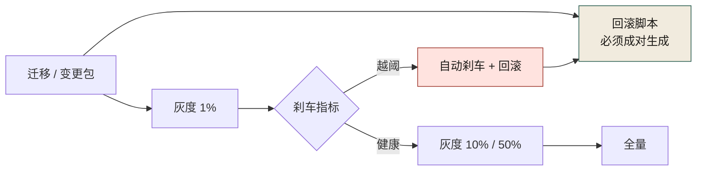
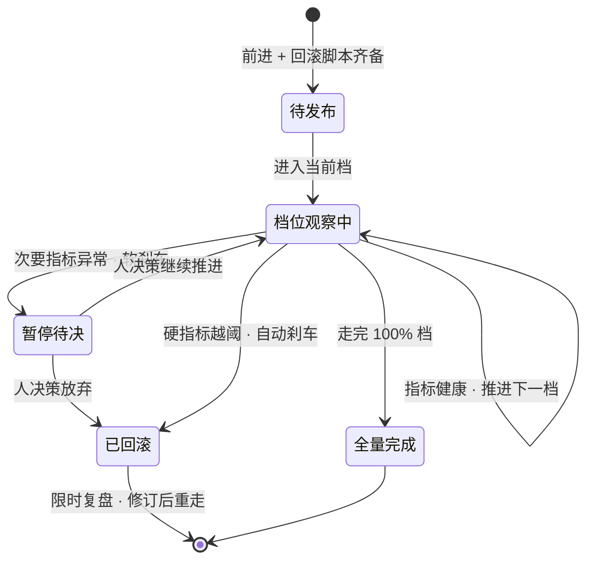
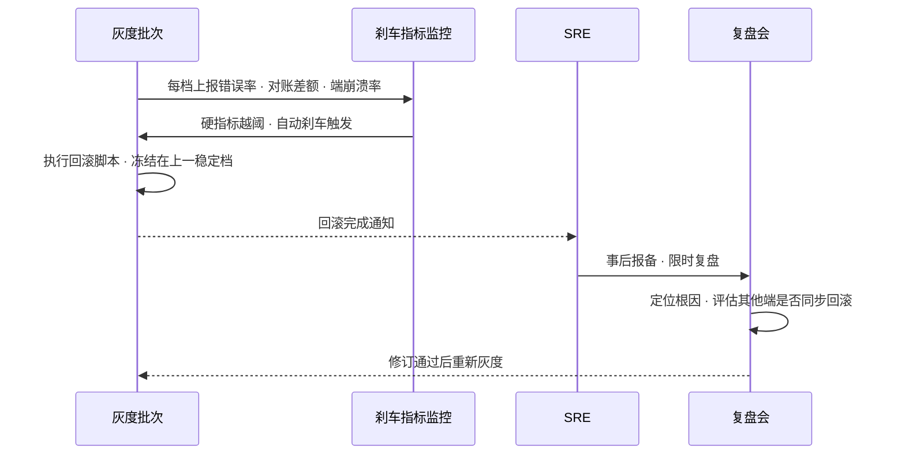
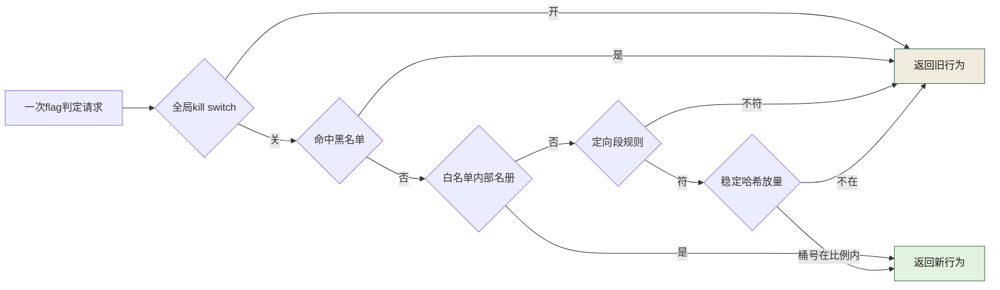
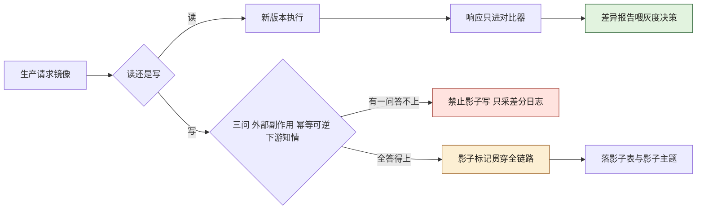

# 第 28 章 大规模灰度与回滚：百万用户级发布

> **本章定位**：发布治理锚点——灰度分层、自动刹车、回滚决策矩阵、多端同步。
> **核心命题**：在 AI 让"上线"变得几近免费之后，"能撤回"成了发布真正的成本中心。

<figure class="chapter-plate">
  
  <figcaption>题图 · 溢洪道：水位到了堰顶自己泄，不需要谁下令</figcaption>
</figure>

---

## 28.1 问题：回滚用了数小时，用户已经大量受损

在某电商平台的支付对账事故中（案例一），告警响起后，SRE 发现回滚脚本不存在——**AI 只生成了"前进"路径（迁移脚本），没有生成"后退"路径（回滚脚本）。** 从告警到完全回滚、差额停止增长，耗时数小时。在这段时间里，对账差额持续累计，影响了大量用户。

事后复盘时，一位 SRE 说了一句值得反复引用的话："**治理团队天天讲'人在回路'，回滚的时候，AI 能帮我回滚吗？它不能。它连一个回滚脚本都没给我。**"

这句话指向一个组织级的盲点：组织花了大量精力治理"生成"、治理"留缝"、治理"契约"——**唯独没有好好治理"出事之后怎么办"。** 而这次事故恰恰证明：在一个大规模平台上，**回滚的速度比生成的速度重要一万倍。** 生成慢一天，损失是延期；回滚慢一小时，损失是用户的钱。

这个教训在其他案例中以不同代价重演：交易所案例中，24/7 不可停机的约束让回滚变成了"降级到上一稳定版"而非传统意义上的停服回滚；量化基金案例中，链上合约部署不可逆，"回滚"意味着紧急撤出资金而非代码回退；安全初创案例中，智能体规则的"回滚"是恢复检测基准，而非代码级别的版本控制。

---

## 28.2 根因：组织治理了"怎么上线"，没治理"怎么撤回"

灰度/回滚失败有三条根因：

**① AI 只生成"前进路径"，不生成"后退路径"。** 它的目标函数是"让需求跑起来"，不是"让需求能撤掉"。于是 AI 生成的迁移、配置、灰度方案，默认都没有回滚位。**我们默认"上线"是终点，其实"能撤回"才是终点。**

**② 灰度没有"自动刹车"。** 灰度通常是"放出去一个比例，等人看"。看的人是谁？通常没人专门看。告警响了很久才被人注意到——因为灰度期间没有一个指标能"自动触发回滚"。**人盯监控是不可靠的，尤其在大促半夜。**

**③ 回滚决策权不清楚。** 出事的那一刻，谁能拍板回滚？SRE 能回滚但怕误回滚被追责；业务方能拍板但半夜找不到人；风控能叫停高风险链路但不熟悉发布链路。**于是最关键的最初几十分钟，常常耗在"谁有权回滚"上。**

三条归结成一句：**组织把发布当成了单向门（只能进），没当成双向门（能进能退）。** 而在 AI 介入后，"前进"变得太容易，"后退"的欠账就暴露得越狠。

---

## 28.3 AI 用法：AI 做配置，人定刹车，回滚脚本必须和迁移一起生成



**图 28-1｜灰度与自动刹车** — 没有后退路径的生成物不让上线；人盯监控不可靠，刹车要自动。

图 28-1 里"回滚脚本"这张绿卡收着两支入向箭头：一支从迁移卡直连，是"成对生成"的前进义务；一支从红色刹车卡折回，是"越阈"分支的落点。把绿卡从图上抹掉，越阈分支就悬在半空——"没有后退路径的生成物不让上线"说的就是这一格不能缺。

灰度/回滚里，AI 的位置：

- **AI 可以生成灰度配置。** 比例、分桶、白名单，AI 能快速产出初版。
- **AI 不可以定"刹车阈值"。** 什么指标到什么值就自动回滚，这是业务+风控的判断，不是 AI 的。
- **AI 生成的任何迁移/变更，必须同时生成回滚脚本。** 只有前进路径、没有后退路径的生成物，不让上线。

最终机制叫"**前进必带后退**"：

```
任何变更 = 前进脚本 + 回滚脚本 + 刹车指标 + 回滚演练记录
缺任何一项 → 灰度审批不通过
```

**治理的意义，有时候就是把某个人的通宵，变成一条不让别人再通宵的规则。**

---

## 28.4 组织冲突模式：回滚权归 SRE 还是归业务

这是全书里和"谁签字"并列的最难的权力问题。

冲突的核心：**回滚快的收益（少损失）和回滚错的成本（误伤正常流量），该由谁权衡、由谁承担？**

SRE 要求"事故时可一键回滚，不需要业务批准"，业务方反对"你们误回滚，损失算谁的"。

分场景处理是最有效的妥协：

| 场景 | 决策权 | 理由 |
|------|--------|------|
| 资金/对账类异常 | SRE 可一键回滚，事后报备 | 损失随时间扩大，必须快 |
| 资金/对账类正常流量波动 | 业务拍板 | 误回滚成本高 |
| 端上白屏/崩溃 | 多端负责人可一键回滚 | 离端最近的人判断最快 |
| 非资金功能异常 | 业务 + SRE 联合，限时决策 | 平衡速度和误伤 |

**关键认知：回滚权不能笼统地说"归 SRE"或"归业务"，必须按"损失是否随时间扩大"来切。** 随时间扩大的（资金对账），权力给快的人；不随时间扩大的（功能小问题），权力给判断准的人。

---

## 四案例映射

| 案例 | 回滚/降级的典型困境 | "前进必带后退"的具体形态 | 回滚权分配的核心原则 |
|------|---------------------|------------------------|---------------------|
| 案例一·电商平台 | 对账事故无回滚脚本，耗时数小时 | 迁移脚本+回滚脚本+刹车指标+演练 | 按损失是否随时间扩大分配 |
| 案例二·加密交易所 | 24/7不可停机，无维护窗口 | 降级到上一稳定版+冻结提币 | 风控有一键降级权（资金存亡级） |
| 案例三·Web3 量化 | 合约部署不可逆，无法代码回退 | Kill switch紧急平仓+仓位冻结 | 首席风控手动kill，时间优先 |
| 案例四·安全初创 | 智能体规则回滚≠代码回滚 | 规则版本快照+一键恢复基准 | CTO手动kill+规则回滚 |

---

## 28.5 产出物：分层灰度方案 + 自动刹车 + 回滚决策矩阵 + 多端同步发布

可落地的四件：

### 1. 分层灰度方案

```
内部 → 1% → 5% → 20% → 50% → 100%
每档观察窗口：高风险链路 30 分钟，一般链路 10 分钟
每档刹车指标：错误率、对账差额、端崩溃率、核心转化
```

这张档位表本质上是一台状态机——每一档都挂着同样的出口规则：



**图 28-2｜灰度批次推进状态机** — 灰度不是一把推到底的滑块，是一台状态机：每档过观察窗口才推进，软刹车停在当前档等人决策，硬刹车直接回滚并强制限时复盘。

图 28-2 的要紧处在"暂停待决"与"档位观察中"的分工：软刹车只把变更停进"暂停待决"，它的两条出边都写着人的决定——推进或放弃，权还给人；硬刹车那条"硬指标越阈"的转移则从观察状态直达"已回滚"，全图没有给它留任何等一等出口。"停一下等人"与"不等人"的差别，就是这两条边的差别。

### 2. 自动刹车

- **硬刹车（自动回滚）**：对账差额 > 阈值、端崩溃率 > 0.5%、核心接口错误率 > 1%。触发即回滚，不等人。
- **软刹车（告警 + 暂停灰度）**：次要指标异常，暂停在当前比例，等人决策。

硬刹车从触发到复盘，是一条不依赖任何人守夜的时序链：



**图 28-3｜自动刹车→回滚→复盘时序** — 硬指标越阈即自动回滚、不等人；回滚完成后人只做两件事：限时复盘、评估其他端是否同步回滚。

图 28-3 前三步没有 SRE 的位置：上报、越阈触发、执行回滚并冻结在上一稳定档，全部发生在灰度批次与监控两条泳道之间；SRE 露第一面已是那条"回滚完成通知"的虚线——人出场的时间点被画在刹车生效之后，这件事本身就是这张图的结论。

### 3. 回滚决策矩阵

28.4 给的是原则（按"损失是否随时间扩大"切权），这一张把它落成能贴进 runbook 的表：每一行自带触发、动作、拍板人、时限与多端联动，值班的人半夜不必重新推理。附录 A 的 `P-28-4-01` 提示词消费的就是这张表——没有它，那条提示词让 AI"基于回滚决策矩阵给建议"时指向一个空标题。

| 触发信号 | 立即动作 | 拍板人 | 决策时限 | 其他端是否联动 | 事后动作 |
|---|---|---|---|---|---|
| 硬刹车：对账差额越阈（资金/对账链路） | 执行回滚脚本，冻结在上一稳定档 | 值班 SRE 单人，事后报备 | 0，不等人 | 联动：契约未变则各端同批回滚 | 差额清零确认 + 限时复盘 |
| 硬刹车：端崩溃率 > 0.5% | 仅该端回滚上一版本，其余端保持 | 该端负责人（离端最近的人） | 0，不等人 | 不联动：端侧问题不外溢 | 崩溃栈归因 |
| 硬刹车：核心接口错误率 > 1% | 回滚该发布批次 | 值班 SRE，无需业务批准 | 0，不等人 | 联动：调用该接口的端一起评估 | 根因 + 门禁补一条 |
| 软刹车：核心转化等次要指标异常 | 暂停在当前档，先不回滚 | 业务方拍板 | 一个观察窗口（高风险 30 分钟 / 一般 10 分钟），到点无人决策即按回滚处理 | 评估：同契约的端一起停在当前档 | 记入复盘，无论最终走哪条 |
| 资金/对账链路的正常流量波动 | 不回滚，先查证 | 业务方 | 一个观察窗口 | 不联动 | 误报也要留痕 |
| 不可停机形态（案例二：24/7 交易） | 降级到上一稳定版 + 冻结提币 | 风控一键降级（资金存亡级） | 0，不等人 | 联动：交易主链路一起降 | 资金存亡级复审 |
| 不可逆形态（案例三：链上合约） | Kill switch 平仓 + 仓位冻结 | 首席风控手动 | 0，不等人 | 不联动：链上没有"端" | 撤资路径审计 |
| 规则型发布（案例四：智能体规则） | 恢复规则版本快照到基准 | CTO 手动 kill + 规则回滚 | 0，不等人 | 不联动：单端产品 | 规则基准修订 |

三处需要按你自己的链路改：软刹车那行的两个观察窗口是本书的默认值（沿用本节第 1 件那张档位表的窗口，不是通用常数），硬刹车的三个阈值取自上面「自动刹车」的口径，"到点无人决策即按回滚处理"是一条例外授权——它把"没人拍板"从默认不动作改成默认回滚，只在损失随时间扩大的链路上成立。最后一列不许省：**事后动作落不到 ADR 或门禁，同一场事故会在下一个灰度周期重演**，这正是 28.2 根因③ 的正面写法。

### 4. 多端同步发布

- **契约一致的变更**：多端同批灰度。
- **端差异变更**：按端排期，但必须同步更新契约。
- **回滚同步**：任何一个端回滚，触发评估"其他端是否需要同步回滚"。

> **代价声明**：这套方案上线后，灰度平均时长会显著增加（因为每档观察窗口变长、刹车指标变多）。业务方会抱怨“上线变慢了”——但用“上线变慢”换“回滚变快、事故变小”，在大规模平台上这笔账没人能质疑。

---

## 28.5b 渐进交付实现件：Argo Rollouts 的 steps 与 analysis 判据（形状档，本书未跑）

> **档位声明（Argo Rollouts 的 steps 与 analysis）**：**形状档 · 未运行，本节开头已写明本机既没有 kubectl 也没有 Argo Rollouts（两者 `command -v` 均无输出）——`Rollout` 与 `AnalysisTemplate` 两块 YAML 按公开 CRD 形状书写，全节一个字节的运行输出都不贴。**

28.5 第 1 件那张档位表和“自动刹车”四个字，写在 runbook 里就是半夜没人执行的散文。渐进交付工具做的机器化翻译，是把档位变成声明式工件、把刹车变成表达式。**本机没有 kubectl 也没有 Argo Rollouts，本节只给 YAML 形状、一个字节的运行输出都不贴（R2 证据纪律）**，字段按公开 CRD 形状书写：

```yaml
# 形状档（未跑）：档位=steps 的机器形态；刹车=analysis 的 failureCondition
apiVersion: argoproj.io/v1alpha1
kind: Rollout
metadata:
  name: checkout                 # 占位名
spec:
  strategy:
    canary:
      trafficRouting:
        istio:
          virtualService: { name: checkout-vs, routes: [primary] }
      steps:
        - setWeight: 5           # 第 1 档：5% 权重（注意：是权重不是流量，见 28.5c）
        - pause: { duration: 30m }   # 高风险链路观察窗口，取自 28.5 第 1 件默认值
        - analysis:
            templates:
              - templateName: checkout-brakes
        - setWeight: 20
        - pause: { duration: 10m }
---
apiVersion: argoproj.io/v1alpha1
kind: AnalysisTemplate
metadata:
  name: checkout-brakes
spec:
  metrics:
    - name: canary-error-rate
      interval: 5m
      failureCondition: result > 0.01     # 阈值人定（28.3：AI 不定刹车）
      failureLimit: 2                     # 容忍越阈次数——两窗语义的落点，见 28.5f
      provider:
        prometheus:
          address: http://prometheus.example.internal   # 占位符
          query: |
            sum(rate(http_requests_total{status=~"5..", version="canary"}[2m]))
            /
            sum(rate(http_requests_total{version="canary"}[2m]))
```

三个静默失效面：其一，观察窗口短于指标滞后——指标还没爬上来，analysis 判的是“健康”的假象；其二，`failureCondition` 用绝对计数而不是比率——晚高峰流量自然涨起，刹车自己被误踩；其三，`trafficRouting` 没真正挂上——steps 全走完，用户流量从没进过 canary。还有一个组织面的失效：**工具不会改变 28.4 的权力问题。自动刹车执行的是你预先授予的回滚权——授权是谁签的、误刹车谁担，仍然归那张决策矩阵管，不归 YAML 管。**

---

## 28.5c 权重不等于流量：连接粘滞的三处来源

`setWeight: 5` 声明的是**新请求的路由决策**，不是“线上 5% 的流量此刻正在新版本上”。三处把它拉偏的来源：

- **长连接**：WebSocket、gRPC streaming 这类连接建立那一刻就定终身，之后不再重新分流（聊天域的连接语义见第 16 章 ./ch21-第16章-聊天功能.md）；灰度开始后老实例上的旧连接会一直旧下去。
- **多路复用与连接池**：HTTP/2 一条连接跑很多请求，Envoy 按新连接决策的次数远少于请求数；上游池子保持住了，旧后端就还吃着真实流量。
- **客户端缓存**：端上的 DNS 缓存与 keepalive，让“已经回滚”在服务端生效、在客户端还要再活一会儿——这正是 28.5 第 4 件“回滚同步评估”要评估端的原因。

三条纪律：推进档位的依据是 canary 实例**实际收到的请求占比**（PromQL 形状见 28.5f，`version="canary"` 那一路的分母读数），永远不是配置里的权重数字；连接型服务给出连接最长寿命上限、到期强制重平衡（量级取“你的最长会话加观察窗口”，示意是小时级，不是通用常数）；低峰时段 canary 的样本本来就薄，**薄样本上的“健康”读数没有推进权**——这一格和第 24 章评测集最小样本量是同一个统计常识的两次出场。

---

## 28.5d Feature flag targeting 的决策链（图 28-4）

flag 是灰度之外的第二道独立闸：代码已经 100% 部署，flag 决定谁真的用得上。它和 28.5 第 1 件的版本灰度互不取消——版本管“哪台机器跑新代码”，flag 管“哪个人看到新行为”。决策链必须短、全、且每一步可审计，先给链再给图：

```python
def serve_flag(user, env, flag):
    if env.kill_switch.on(flag): return False        # ① 全局关：一票否决位
    if user.id in flag.blocklist: return False       # ② 黑名单先于白名单：拒绝权优先于豁免权
    if user.id in flag.allowlist: return True        # ③ 内部吃狗粮名册
    if not user.matches(flag.segment): return False  # ④ 定向段：地区 / 套餐 / 风控分层
    # ⑤ 按百分比推进的放量子集：盐按 flag 隔离，桶按用户稳定
    return bucket(user.id, salt=flag.salt) < flag.rollout_percent
```

两个细节各挡一类事故：**桶必须是账号 id 的稳定哈希**（随机数会让同一用户两次刷新劈里啪啦换体验，客服与复现全失效），**salt 必须一 flag 一换**（全平台共用一个盐，所有 flag 命中同一批用户——多个灰度绑成同一个风险源，一炸全炸）。先给链再给图，因为图上的落点顺序就是代码的 return 顺序：



**图 28-4｜flag targeting 决策链** — kill switch 与黑名单排在豁免名单之前：flag 系统里拒绝权必须永远比放行权多一个前置位；放量站最后，因为只有前面四关都过了，比例才有意义。

图 28-4 与 28.5b 的关系要说破：Rollout 的 steps 换的是**实例**，flag 换的是**人群**，刹车指标要能分辨这两层（按 version 切还是按 flag 曝光切），否则“canary 健康”与“flag 人群健康”会互相冒名。

---

## 28.5e 影子流量与“影子写”的危险边界（图 28-5）

影子流量是灰度家族里最激进的一种：生产请求复制一份打给新版本，**响应用户的一直是老版本**，新版本只参与对比。读路径上这是赚的——查询无副作用，复制品跑出的差异就是免费的正确性证据。写路径上它多半是债：影子请求触达的是有外部后果的函数——支付真的扣款、库存真的扣减、消息真的发出去，这些副作用**不跟着响应一起被丢弃**。新版本正常路径写一遍、影子路径又写一遍，用户看到的就是双份现实。先给边界图：



**图 28-5｜影子读放行、影子写三问** — 读可以影子是因为它没有外部后果；写的边界由三个问题把守：有没有外部副作用、副作用幂等可逆吗、下游知道自己参演彩排吗。

三问里任何一问答不上或答“不知道”，就进图 28-5 的红色出口。真要让写路径也参与彩排，只剩一条诚实的路：所有下游实现真正的 `dry_run` 语义，且影子标记一路贯穿——从入口到最外层的第三方调用都认识这个标记。**这是工程项目，不是配置开关**：标记漏传一环，彩排就有一环来真的。这也是 28.2 根因① 的镜像面：AI 生成“影子对比”这种读代码很快，但“标记全链路贯穿”里每一个下游系统的所有者点头，机器给不了。

---

## 28.5f 自动刹车的可抄表达式：从 PromQL 到两窗判定器

刹车指标的查询形状（B 档，PromQL 函数与匹配符语义按规范书写；标签名以你的埋点为准，本书未跑任何 Prometheus 实例）：

```promql
# 比率型刹车：分子分母都限定在 canary 那一路
sum(rate(http_requests_total{job="checkout", status=~"5..", version="canary"}[2m]))
/
sum(rate(http_requests_total{job="checkout", version="canary"}[2m]))

# 分布型刹车：延迟分位，窗口至少覆盖两个采集步长
histogram_quantile(0.99, sum by (le) (rate(http_request_duration_seconds_bucket{version="canary"}[5m])))
```

两条口径各自挡一类假刹车：分母也必须限 `version="canary"`，否则稳定版自己的错误会喂进 canary 的刹车读数；`rate` 的窗口短于采集加评估滞后时，读数永远比事故慢半拍——这就是 28.5b 静默失效面第一格的数学形态。

然后是判定本身。“越阈即回滚”其实是个坏规则：单窗尖刺太容易被噪声喂出来，误刹车多了，人会去拔刹车的线。28.5b 模板里那个 `failureLimit: 2` 背后是“连续两窗超阈”语义。这段判定器拿真数据形状跑给你看——**本机实跑，纯标准库；输入序列是示意数据，统计对象是判定逻辑本身，不是任何线上指标**：

```python
THRESHOLD = 0.01                                   # 示意阈值：对应 28.5 硬刹车口径
WINDOWS = [0.004, 0.016, 0.008, 0.012, 0.018, 0.006, 0.002]   # 示意输入：逐窗错误率
streak = 0
for i, v in enumerate(WINDOWS, 1):
    streak = streak + 1 if v > THRESHOLD else 0
    print(f"W{i} err={v:.3%} streak={streak} -> "
          + ("ROLLBACK" if streak >= 2 else "OBSERVE"))
```

```text
W1 err=0.400% streak=0 -> OBSERVE
W2 err=1.600% streak=1 -> OBSERVE
W3 err=0.800% streak=0 -> OBSERVE
W4 err=1.200% streak=1 -> OBSERVE
W5 err=1.800% streak=2 -> ROLLBACK
W6 err=0.600% streak=0 -> OBSERVE
W7 err=0.200% streak=0 -> OBSERVE
```

这段真实轨迹里有两个读数值得停一下：W2 与 W4 都是单窗越阈，判定器不动作——**尖刺与趋势的差别，就是让一窗与杀两窗的差别**；W5 触发 ROLLBACK 后 W6 归零，因为回滚已经执行，这是轨迹的结尾不是判定的仁慈。代价也要摊开说：两窗语义把最坏暴露时间放大成两个观察窗口，所以窗口长度与阈值按链路风险等级反着定——资金链路宁可窗短、两窗，一般功能宁可窗长、一窗即杀也可以。**判定状态必须按发布批次清零**：把上一批的 `streak` 带进新一批，等于允许上一批的越阈触发这一批的回滚——这是这段十行代码唯一真正的坑。

---

## 28.6 检查清单

- [ ] 你的每次发布，是不是都带着回滚脚本？还是只有前进路径？
- [ ] 你的灰度，有没有"自动刹车"指标？还是靠人盯监控？
- [ ] 自动刹车的阈值，是谁定的？业务还是风控？高风险相关的，风控有没有一票？
- [ ] 出事那一刻，谁有权回滚？这个权力是按"损失是否随时间扩大"切的吗？
- [ ] 回滚之后，有没有限时复盘的硬要求？
- [ ] 一个端回滚了，其他端要不要同步回滚，有没有评估机制？
- [ ] 你的灰度方案，有没有在大促前做过一次完整的回滚演练？

---

## 28.7 反模式

| # | 反模式 | 后果 |
|---|--------|------|
| 1 | 只生成前进脚本，不生成回滚脚本 | 数小时手写回滚 |
| 2 | 灰度靠人盯监控 | 半夜没人盯，告警响很久才发现 |
| 3 | 所有回滚都要业务批准 | 黄金时间耗在找人上 |
| 4 | 回滚权笼统归某一个角色 | 要么误回滚，要么回不动 |
| 5 | 一个端回滚不评估其他端 | 端上不一致，二次事故 |
| 6 | 灰度没有"档"的概念 | 要么不发，要么一把梭 100% |
| 7 | 没有回滚演练 | 真出事时才发现回滚脚本跑不通 |

---

## 28.8 遗留问题

- **自动刹车的阈值怎么定？** 定低了误回滚，定高了漏事故。通常用历史 P99 错误率的若干倍做硬刹车阈值，但这没有理论依据，是经验值。**这个领域缺乏工程化的方法论。**
- **多端回滚的同步评估，能不能自动化？** 现在是一个端回滚后人工评估其他端。能不能让系统自动判断？技术上可行，但尚未普及。
- **AI 能不能帮着回滚？** AI 能帮着定位、能帮着生成回滚脚本，但"该不该回滚"这个决策必须人拍。因为回滚是对业务的否定，否定这件事，AI 没有资格——它不为后果负责。

---

> **本章的一句话**：在 AI 让"上线"变得几近免费之后，**「能撤回」成了发布真正的成本中心**。一个成熟的平台，衡量它的标准不是"一天能发多少次"，而是"出事时多久能撤回来"。**生成得快是本事，回滚得快才是底气。前者 AI 给得了，后者，永远得人来兜。**
