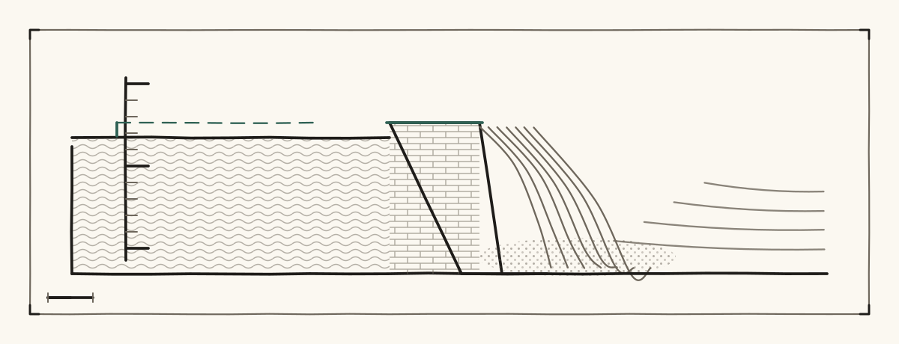
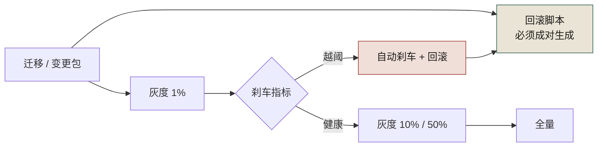
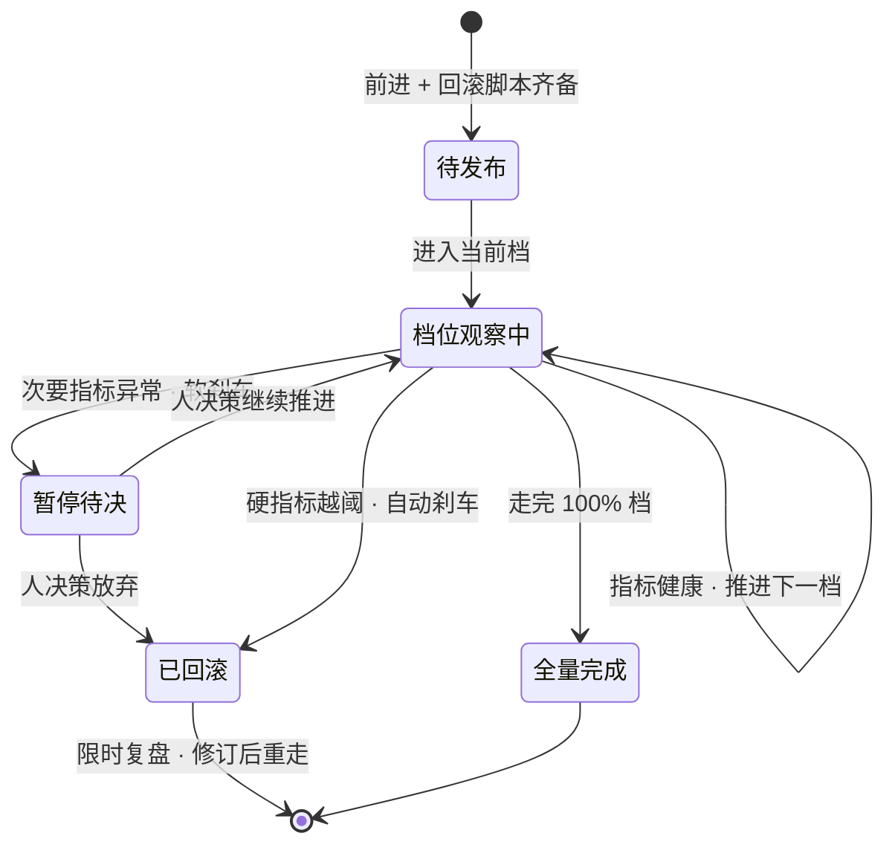
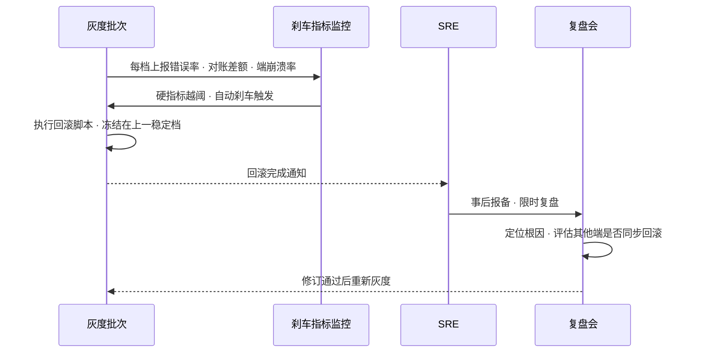

# 第 28 章 大规模灰度与回滚：百万用户级发布

> **本章定位**：发布治理锚点——灰度分层、自动刹车、回滚决策矩阵、多端同步。
> **核心命题**：在 AI 让"上线"变得几近免费之后，"能撤回"成了发布真正的成本中心。

<figure class="chapter-plate">
  
  <figcaption>题图 · 溢洪道：水位到了堰顶自己泄，不需要谁下令</figcaption>
</figure>

---

## 28.1 问题：回滚用了数小时，用户已经大量受损

在某电商平台的支付对账事故中（案例一），告警响起后，SRE 发现回滚脚本不存在——**AI 只生成了"前进"路径（迁移脚本），没有生成"后退"路径（回滚脚本）。** 从告警到完全回滚、差额停止增长，耗时数小时。在这段时间里，对账差额持续累计，影响了大量用户。

事后复盘时，一位 SRE 说了一句值得反复引用的话：**"治理团队天天讲'人在回路'，回滚的时候，AI 能帮我回滚吗？它不能。它连一个回滚脚本都没给我。"**

这句话指向一个组织级的盲点：组织花了大量精力治理"生成"、治理"留缝"、治理"契约"——**唯独没有好好治理"出事之后怎么办"。** 而这次事故恰恰证明：在一个大规模平台上，**回滚的速度比生成的速度重要一万倍。** 生成慢一天，损失是延期；回滚慢一小时，损失是用户的钱。

这个教训在其他案例中以不同代价重演：交易所案例中，24/7 不可停机的约束让回滚变成了"降级到上一稳定版"而非传统意义上的停服回滚；量化基金案例中，链上合约部署不可逆，"回滚"意味着紧急撤出资金而非代码回退；安全初创案例中，智能体规则的"回滚"是恢复检测基准，而非代码级别的版本控制。

---

## 28.2 根因：组织治理了"怎么上线"，没治理"怎么撤回"

灰度/回滚失败有三条根因：

**① AI 只生成"前进路径"，不生成"后退路径"。** 它的目标函数是"让需求跑起来"，不是"让需求能撤掉"。于是 AI 生成的迁移、配置、灰度方案，默认都没有回滚位。**我们默认"上线"是终点，其实"能撤回"才是终点。**

**② 灰度没有"自动刹车"。** 灰度通常是"放出去一个比例，等人看"。看的人是谁？通常没人专门看。告警响了很久才被人注意到——因为灰度期间没有一个指标能"自动触发回滚"。**人盯监控是不可靠的，尤其在大促半夜。**

**③ 回滚决策权不清楚。** 出事的那一刻，谁能拍板回滚？SRE 能回滚但怕误回滚被追责；业务方能拍板但半夜找不到人；风控能叫停高风险链路但不熟悉发布链路。**于是最关键的最初几十分钟，常常耗在"谁有权回滚"上。**

三条归结成一句：**组织把发布当成了单向门（只能进），没当成双向门（能进能退）。** 而在 AI 介入后，"前进"变得太容易，"后退"的欠账就暴露得越狠。

---

## 28.3 AI 用法：AI 做配置，人定刹车，回滚脚本必须和迁移一起生成



**图 28-1｜灰度与自动刹车** — 没有后退路径的生成物不让上线；人盯监控不可靠，刹车要自动。

图 28-1 里"回滚脚本"这张绿卡收着两支入向箭头：一支从迁移卡直连，是"成对生成"的前进义务；一支从红色刹车卡折回，是"越阈"分支的落点。把绿卡从图上抹掉，越阈分支就悬在半空——"没有后退路径的生成物不让上线"说的就是这一格不能缺。

灰度/回滚里，AI 的位置：

- **AI 可以生成灰度配置。** 比例、分桶、白名单，AI 能快速产出初版。
- **AI 不可以定"刹车阈值"。** 什么指标到什么值就自动回滚，这是业务+风控的判断，不是 AI 的。
- **AI 生成的任何迁移/变更，必须同时生成回滚脚本。** 只有前进路径、没有后退路径的生成物，不让上线。

最终机制叫**"前进必带后退"**：

```
任何变更 = 前进脚本 + 回滚脚本 + 刹车指标 + 回滚演练记录
缺任何一项 → 灰度审批不通过
```

**治理的意义，有时候就是把某个人的通宵，变成一条不让别人再通宵的规则。**

---

## 28.4 组织冲突模式：回滚权归 SRE 还是归业务

这是全书里和"谁签字"并列的最难的权力问题。

冲突的核心：**回滚快的收益（少损失）和回滚错的成本（误伤正常流量），该由谁权衡、由谁承担？**

SRE 要求"事故时可一键回滚，不需要业务批准"，业务方反对"你们误回滚，损失算谁的"。

分场景处理是最有效的妥协：

| 场景 | 决策权 | 理由 |
|------|--------|------|
| 资金/对账类异常 | SRE 可一键回滚，事后报备 | 损失随时间扩大，必须快 |
| 资金/对账类正常流量波动 | 业务拍板 | 误回滚成本高 |
| 端上白屏/崩溃 | 多端负责人可一键回滚 | 离端最近的人判断最快 |
| 非资金功能异常 | 业务 + SRE 联合，限时决策 | 平衡速度和误伤 |

**关键认知：回滚权不能笼统地说"归 SRE"或"归业务"，必须按"损失是否随时间扩大"来切。** 随时间扩大的（资金对账），权力给快的人；不随时间扩大的（功能小问题），权力给判断准的人。

---

## 四案例映射

| 案例 | 回滚/降级的典型困境 | "前进必带后退"的具体形态 | 回滚权分配的核心原则 |
|------|---------------------|------------------------|---------------------|
| 案例一·电商平台 | 对账事故无回滚脚本，耗时数小时 | 迁移脚本+回滚脚本+刹车指标+演练 | 按损失是否随时间扩大分配 |
| 案例二·加密交易所 | 24/7不可停机，无维护窗口 | 降级到上一稳定版+冻结提币 | 风控有一键降级权（资金存亡级） |
| 案例三·Web3 量化 | 合约部署不可逆，无法代码回退 | Kill switch紧急平仓+仓位冻结 | 首席风控手动kill，时间优先 |
| 案例四·安全初创 | 智能体规则回滚≠代码回滚 | 规则版本快照+一键恢复基准 | CTO手动kill+规则回滚 |

---

## 28.5 产出物：分层灰度方案 + 自动刹车 + 回滚决策矩阵 + 多端同步发布

可落地的四件：

### 1. 分层灰度方案

```
内部 → 1% → 5% → 20% → 50% → 100%
每档观察窗口：高风险链路 30 分钟，一般链路 10 分钟
每档刹车指标：错误率、对账差额、端崩溃率、核心转化
```

这张档位表本质上是一台状态机——每一档都挂着同样的出口规则：



**图 28-2｜灰度批次推进状态机** — 灰度不是一把推到底的滑块，是一台状态机：每档过观察窗口才推进，软刹车停在当前档等人决策，硬刹车直接回滚并强制限时复盘。

图 28-2 的要紧处在"暂停待决"与"档位观察中"的分工：软刹车只把变更停进"暂停待决"，它的两条出边都写着人的决定——推进或放弃，权还给人；硬刹车那条"硬指标越阈"的转移则从观察状态直达"已回滚"，全图没有给它留任何等一等出口。"停一下等人"与"不等人"的差别，就是这两条边的差别。

### 2. 自动刹车

- **硬刹车（自动回滚）**：对账差额 > 阈值、端崩溃率 > 0.5%、核心接口错误率 > 1%。触发即回滚，不等人。
- **软刹车（告警 + 暂停灰度）**：次要指标异常，暂停在当前比例，等人决策。

硬刹车从触发到复盘，是一条不依赖任何人守夜的时序链：



**图 28-3｜自动刹车→回滚→复盘时序** — 硬指标越阈即自动回滚、不等人；回滚完成后人只做两件事：限时复盘、评估其他端是否同步回滚。

图 28-3 前三步没有 SRE 的位置：上报、越阈触发、执行回滚并冻结在上一稳定档，全部发生在灰度批次与监控两条泳道之间；SRE 露第一面已是那条"回滚完成通知"的虚线——人出场的时间点被画在刹车生效之后，这件事本身就是这张图的结论。

### 3. 回滚决策矩阵（见 28.4）

### 4. 多端同步发布

- **契约一致的变更**：多端同批灰度。
- **端差异变更**：按端排期，但必须同步更新契约。
- **回滚同步**：任何一个端回滚，触发评估"其他端是否需要同步回滚"。

> **代价声明**：这套方案上线后，灰度平均时长会显著增加（因为每档观察窗口变长、刹车指标变多）。业务方会抱怨"上线变慢了"——但用"上线变慢"换"回滚变快、事故变小"，在大规模平台上这笔账没人能质疑。

---

## 28.6 检查清单

- [ ] 你的每次发布，是不是都带着回滚脚本？还是只有前进路径？
- [ ] 你的灰度，有没有"自动刹车"指标？还是靠人盯监控？
- [ ] 自动刹车的阈值，是谁定的？业务还是风控？高风险相关的，风控有没有一票？
- [ ] 出事那一刻，谁有权回滚？这个权力是按"损失是否随时间扩大"切的吗？
- [ ] 回滚之后，有没有限时复盘的硬要求？
- [ ] 一个端回滚了，其他端要不要同步回滚，有没有评估机制？
- [ ] 你的灰度方案，有没有在大促前做过一次完整的回滚演练？

---

## 28.7 反模式

| # | 反模式 | 后果 |
|---|--------|------|
| 1 | 只生成前进脚本，不生成回滚脚本 | 数小时手写回滚 |
| 2 | 灰度靠人盯监控 | 半夜没人盯，告警响很久才发现 |
| 3 | 所有回滚都要业务批准 | 黄金时间耗在找人上 |
| 4 | 回滚权笼统归某一个角色 | 要么误回滚，要么回不动 |
| 5 | 一个端回滚不评估其他端 | 端上不一致，二次事故 |
| 6 | 灰度没有"档"的概念 | 要么不发，要么一把梭 100% |
| 7 | 没有回滚演练 | 真出事时才发现回滚脚本跑不通 |

---

## 28.8 遗留问题

- **自动刹车的阈值怎么定？** 定低了误回滚，定高了漏事故。通常用历史 P99 错误率的若干倍做硬刹车阈值，但这没有理论依据，是经验值。**这个领域缺乏工程化的方法论。**
- **多端回滚的同步评估，能不能自动化？** 现在是一个端回滚后人工评估其他端。能不能让系统自动判断？技术上可行，但尚未普及。
- **AI 能不能帮着回滚？** AI 能帮着定位、能帮着生成回滚脚本，但"该不该回滚"这个决策必须人拍。因为回滚是对业务的否定，否定这件事，AI 没有资格——它不为后果负责。

---

> **本章的一句话**：在 AI 让"上线"变得几近免费之后，**"能撤回"成了发布真正的成本中心**。一个成熟的平台，衡量它的标准不是"一天能发多少次"，而是"出事时多久能撤回来"。**生成得快是本事，回滚得快才是底气。前者 AI 给得了，后者，永远得人来兜。**
