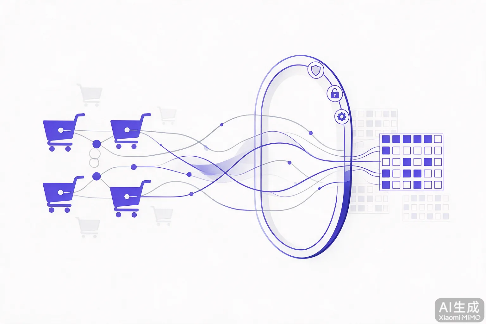
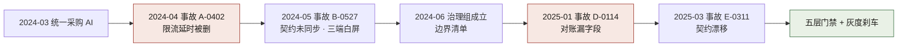
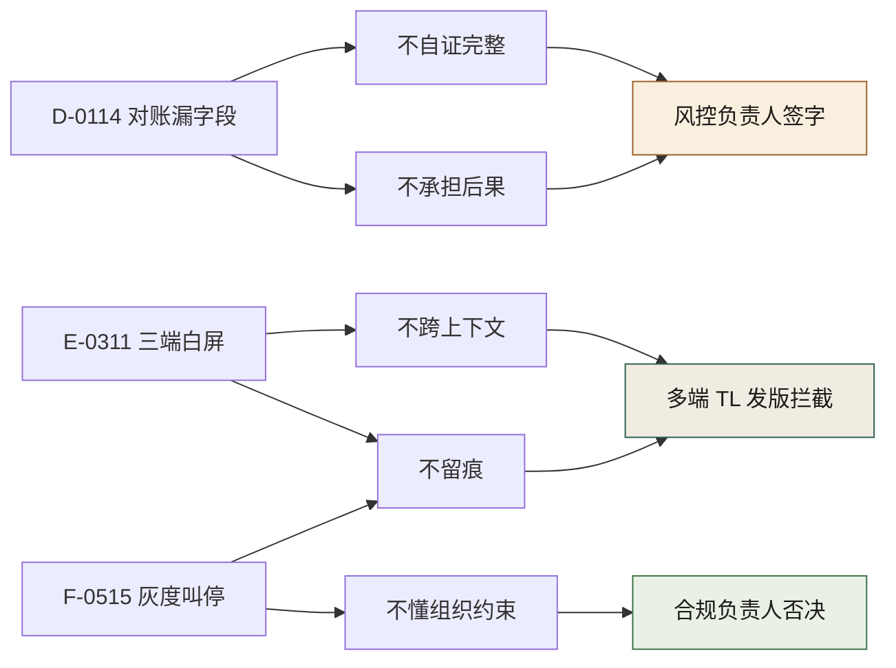
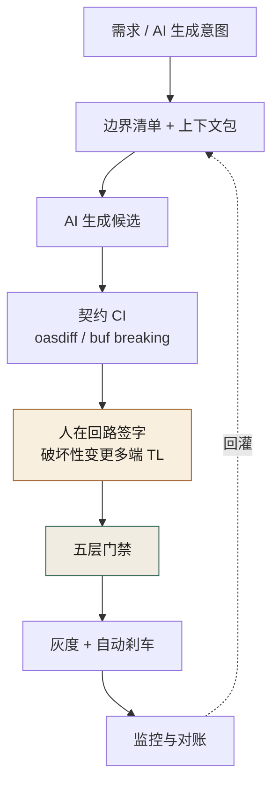

# 第八部分 · 案例一：300 人电商平台



> **叙事边界**：本案例为**自洽虚构的脱敏示范**，不指代任何真实公司或个人。日期、事故编号、金额均按 [`ch05-数字清单.md`](./ch05-数字清单.md) 构造；公开报告不可用来「证实」本章数字。请学冲突结构与机制，勿当作新闻纪实引用。

> 本章是全书四个案例中的第一个，覆盖一家 300 人电商交易平台在 2024 年 3 月到 2025 年 8 月共 18 个月里的 AI 原生治理全程。叙事者是这家公司的"工程效能与架构组负责人"——也就是后来被 CTO 点名牵头 AI 治理组的那个"我"。



**图 C1-1｜案例一关键节点** — 契约先行不是从规范开始的，是从两次事故和一份没人能填的 Owner 名单开始的。

---

## 一、背景

我所在的公司，是一家在国内电商红海里活下来的中型平台。

300 人，分布在 12 个业务域——商品、交易、支付、风控、营销、客服、聊天、物流、账户、搜索、推荐、增长。光是仓库就有 214 个，微服务 327 个，代码总量大约 480 万行。我们服务的是 1.2 亿 DAU，大促峰值 QPS 能冲到 86 万，端上覆盖五个——安卓、鸿蒙、iOS、Web、小程序。日均发布 110 多次。这是治理之前的样子。

技术栈谈不上时髦，但稳。交易核心那一层是 Java 17 + Spring Cloud 2023.x 的全家桶——Spring Cloud Gateway 做网关、OpenFeign 做服务间调用、Sentinel 做流控降级，配置中心和服务注册都压在 Nacos 2.3 上，链路追踪用的 SkyWalking 9.x。撮合引擎是另一套语言：Go 1.21 + 自研 RPC 框架，底层基于 gRPC，订单簿缓存压在 Redis 7.x Cluster 上，那套 cluster 是我们调了大半年才稳下来的。端上是 Flutter 3.x 加原生混合——iOS 端 Swift、安卓端 Kotlin、鸿蒙端 ArkTS，小程序用 Taro 3.x 跨端编译，一套 TypeScript 出五个端是理想，但实际只有商品和营销两域真的做到了跨端复用。

数据这边更杂：离线是 Spark 3.5 on YARN 加自研的特征平台，实时计算压在 Flink 1.18 上，实时数仓用 ClickHouse 撑着大屏和即席查询。存储分了三套——交易核心用 MySQL 8.0 主从扛 ACID，订单分库分表用 TiDB 7.x 解决容量问题，商品详情这种半结构化数据扔在 MongoDB 里，缓存统一压在 Redis Cluster 上。消息中间件也是双轨：RocketMQ 5.x 跑交易这种不能丢的消息，Kafka 3.6 扛日志和埋点这种量大但能丢的。

CI/CD 是 GitLab CI + ArgoCD 走 GitOps，镜像仓库自建 Harbor，应用全跑在 K8s 1.28 集群上——30 多个节点，不算大，但大促扩容的时候已经够呛。这套东西我们用了三年才磨到现在这个程度——它不漂亮，但它能扛住双 11 那种夜里两点钟所有人都盯着仪表盘的时刻。

AI 进来得很快。

2024 年 3 月 4 日，决策层（CTO）签了字，公司统一采购了三家工具——GitHub Copilot Enterprise、Cursor、通义灵码——人均开通两个，年化许可费 ¥480 万。当时没人开过会讨论"哪些链路能碰、哪些不能"。两周之后，交易域的兄弟率先把 AI 接进了 IDE，提交量周环比涨了 35%。CRUD、单测、迁移脚本，AI 都能写，写得还挺像样。

那个月的氛围我记得很清楚：每个人都在喊"提效"，每个人都在炫自己用 AI 省了多少时间。可是没人 review。我那时候只负责一条业务线，看在眼里，也只觉得"这事跟我的 KPI 没关系"。

后来我才知道，那段沉默，是我接下来 18 个月所有痛苦的伏笔。把这段沉默的起点和终点连起来，就是图 C1-1 的那串节点：2024 年 3 月的统一采购是最左端，A-0402 与 B-0527 是 2024 年 4、5 月先后染红的两个，而链尾那块绿色的"五层门禁 + 灰度刹车"，要再等将近一年、由 D-0114 和 E-0311 补完。

---

## 二、认知触发

真正让我们慌起来的，是 2024 年 4 月到 5 月的两件事。

第一件，2024 年 4 月 2 日，事故 A-0402。一段风控限流脚本里有个 `sleep(1)`，AI 在一次"代码清理"中把它判定为"看起来没用"删掉了。限流逻辑随之失效，上游服务瞬间把这 1.2 万订单的流量灌进来，触发了风控的自动封禁阈值——被风控上游短暂封禁，影响了 1.2 万订单。没有人发现是 AI 删的——直到风控组的人在事故复盘里调 Git 提交记录，看到那条 commit message 写着 "remove unused sleep call"，才看出来。

第二件，2024 年 5 月 27 日，事故 B-0527。一段 AI 改写的订单查询接口跳过了契约同步，返回体多了一个必填字段，安卓端的桩代码还是旧契约生成的，反序列化直接抛异常——安卓端购物车页白屏 47 分钟，客诉 380 单，三端都受影响，估算损失 ¥12 万。多端组半夜爬起来救火，紧急回滚。

那两个月里，还有一件事我后来才意识到有多危险：2024 年 4 月 22 日，风控负责人第一次发难，要求列出"AI 到底碰过哪些资金链路的代码"。我站在旁边听着，治理组还没成立，没有人拿得出那份清单。信任裂痕就是从那天开始的——风控组开始用一种审视的目光看每一个 PR。

到 2024 年 5 月 9 日的周报，决策层看到了两个数字：代码量季度环比 +40%，事故率季度环比 +60%。他皱了眉头。

但真正把事情点燃的，是 2024 年 5 月 30 日的双周会。

决策层把投影翻到那页周报，没抬头：

"我们花了 ¥480 万买 AI 工具，人均开了 2 个，代码量涨 40%，事故率涨 60%，评审积压 3 天。我现在被 CEO 问一个问题——**我们 AI 化到底有没有用？**谁给我一个能拿出手的答案。"

会议室没人接话。

我记得那一刻自己盯着桌面，脑子里翻的全是 A-0402 和 B-0527。那两件事我都知道，但我那时没资格说"全平台怎么办"。

然后决策层点了我的名。

"你来牵头。成立个治理组，4 个人，3 个月，给我一个答案。"

我第一反应是想拒绝。这个活，做对了功劳是他的，做错了锅是我的。但我没说出口——风控负责人就坐在我对面，那个眼神的意思是：你要是接了，风控这条线我还能跟你谈；你要是不接，我就自己去堵，堵不住就拉着大家一起陪葬。

我接了。

这是我后来 18 个月所有痛苦的真正开端。

---

## 三、事故复盘

治理组的真正形状，是被三场重大事故一刀一刀刻出来的。这三件事的编号，我到现在闭着眼都能写出来：D-0114、E-0311、F-0515。

### D-0114：支付对账迁移漏字段

2025 年 1 月 14 日夜里两点多，我接到 SRE 负责人的电话。他的声音不像平时那样讲指标，而是直接说："对账差额累计到几十万了，你过来一趟。"

事情是这样的：支付域有一段对账迁移脚本，原本应该在 1 月初迁移到一个新的字段结构里。这段脚本是用 AI 生成的——这是 2024 年 12 月那次"支付域豁免"之后，一个被半推半就放进去的迁移。AI 写得很顺，测试也过了，但漏了一个字段：`refund_amount`。具体说，迁移走的是 Flyway 6.x 管理版本，AI 生成的迁移脚本编号是 `V20250114_003__refund_migration.sql`，新表的结构里少了这一列：

```sql
-- 旧表有，新表漏掉的列
refund_amount DECIMAL(12,2) NOT NULL DEFAULT 0.00
```

退款金额那一列在新表里没了。

对账本身是个 Spark Job，每天凌晨 2:00 准时拉起，读 T-1 的交易明细做与支付渠道的对账。白天的对账还能凑合，因为退款量不大。但夜里跑全量批处理的时候，新表少了 `refund_amount`，批处理在做 `JOIN` 的时候把退款金额当成了 `NULL`，差额越积越多——第一天累计 ¥3.2 万，没告警，因为阈值卡在 ¥5 万；第二天滚到 ¥28 万，触发了告警但值班以为是渠道延迟没在意；第三天凌晨累计冲到 ¥86 万，影响 10.2 万用户，这时候 SRE 才把电话打给我。

回滚也踩了坑。`flyway undo` 在社区版里根本不支持，我们只能手写 `V20250114_005__rollback.sql` 把字段加回去，再重跑 T-1 到 T-3 三天的对账批处理——整整 3.5 个小时，所有窗口都得停着等。

SRE 负责人在值班室里调监控，脸色很难看。他对我说："出事的时候，AI 能帮我回滚吗？"——这是他的口头禅，但那天他不是在反讽，他是真的在问。我们花了 3.5 个小时才完成全量回滚。

风控负责人凌晨四点到了公司。他没坐下，直接站在我旁边，问了一句我后来反复回想的话：

"这笔钱错了，用户不会找 AI，会找我。能不能验证？不能就否决。"

那天对账差额花了整整两天才追平。两天里我们的告警、值班、客户安抚全在烧钱。这件事的根子不在 AI——AI 只是删了一个它不知道为什么要保留的字段。根子在组织：支付域"豁免"了，但有一段迁移因为没人明确归属，半推半就漏进了 AI 的手里。

讽刺的是，D-0114 恰恰发生在那个本该被豁免的链路上。

### E-0311：商品详情接口契约未更新

2025 年 3 月 11 日，离 D-0114 才两个月。这一次炸的是多端。

有个一线工程师在营销域之外的某个商品接口上，让 AI 改了一段实现逻辑——改得没错，代码本身是对的。出事的接口是 `GET /api/v2/product/detail`，商品详情，五端都调，是流量最大的几个接口之一。AI 改的是返回体里 `promotion_info` 字段的结构：

```json
// 改之前
{ "type": "string", "value": "string" }
// 改之后
{ "type": "string", "details": { "value": "string" } }
```

字段语义变了——`value` 从顶层挪进了 `details` 嵌套对象里——但字段类型还是 string。这是最阴险的一种破坏性变更：类型签名没变，静态检查和大部分契约 diff 工具都看不出问题，但取值路径变了。AI 改接口的时候，契约仓库没同步——这次变更压根没走契约 PR 流程，直接改了代码，所以 `oasdiff` 连跑的机会都没有。

灾难在于五个端都依赖契约仓库自动生成桩代码。契约没更新，桩代码就是旧的，旧的桩去调新的接口——iOS 端用 `swiftgen` 生成的 model 里 `value` 还在顶层，安卓端 `ktor-client` 生成的 data class 一样，小程序端 `tarojs-plugin-openapi` 生成的 types 也是旧结构。三端取 `details` 取不到值，UI 拿到 `undefined`，渲染层直接崩——iOS、安卓、小程序三端的商品详情页同时白屏。

这一次多端 TL 是在发版前两个小时自己跑了一遍端侧集成测试，发现了其中一半的问题——拦了一半，没拦住另一半。已经发布的版本紧急回滚：`git revert` 接口变更、补走一遍契约 PR 流程把 `openapi.yaml` 更新到新结构、五端各自紧急发版，光是走完这套流程就花了两个小时——三端白屏整整两个小时，客诉 1240 单，损失 ¥45 万。

那天晚上我在公司，看着多端 TL 拍桌子。他说的是他的口头禅：

"AI 改一次接口，多个端要发版，谁扛？它怎么验证的？端怎么办？"

我答不上来。E-0311 几乎是 B-0527 的同型重演——同一个根因，过了九个月还在重演。治理组当时已经在做契约同步机制，但还没上线。我们慢了。

### F-0515：合规灰度被叫停

2025 年 5 月 15 日，事情的性质又不一样了。这一次不是代码炸了，是流程炸了。

合规负责人启动了一次全平台 AI 代码审计——她带着两个人，花了三周把 12 个业务域过去半年合并的 AI 相关 PR 翻了一遍。审计走到一半，她在某个业务域发现：那次灰度发布涉及的几段 AI 生成代码，prompt 归档是缺失的——既没有完整的提示词，也没有评审记录。归档系统里这几个 PR 的 prompt 字段是空的，CI 检查当时还没强制必填，是后来才加上去的。

她没跟任何人商量，直接否决了那次灰度。灰度推迟一周，业务方立刻投诉——他们已经对外做了灰度预告，被叫停意味着节奏全乱。

合规负责人的理由很清楚，也很刺耳：

"审计问起来，我能拿出一份 AI 操作记录吗？现在拿不出来。补上。"

这一刀之所以疼，是因为它精准地戳在了我 2024 年 8 月那次让步的伤口上。当时我为了把 prompt 归档机制推上线，跟 HRBP 妥协了——改成"只记结果、不记人、匿名聚合"。那一次让步让机制活下来了，但代价是匿名化之后，出了归档缺失，根本定位不到具体是谁的责任。F-0515 就是那次让步的反噬。

三场事故，三种形状。一次炸在资金，一次炸在多端，一次炸在审计。每一次，AI 都"完成了它的任务"——它生成了能跑的代码、改对了实现、写了能过的测试。但每一次，组织都接不住它"完成"之后剩下的那部分。

---

## 四、失灵分析

治理组真正成熟起来，是从我们开始用一种统一的语言去描述"AI 为什么失灵"开始的。这套语言后来被我们写成全书的六种失败模式。三场事故，每一场都对应着不止一种模式。

**D-0114 漏字段，是"不自证完整"和"不承担后果"的叠加。** AI 生成那段 `V20250114_003__refund_migration.sql` 的时候，它不知道自己漏了 `refund_amount DECIMAL(12,2) NOT NULL DEFAULT 0.00`，也没有任何机制要求它证明"我覆盖了旧表所有的字段"——它甚至不知道这张表一共有多少列、哪些列被下游的 Spark 对账 Job 依赖。它没有这个能力，这是它的结构性缺陷——**不自证完整**。Flyway 跑通了、单元测试跑通了、CI 绿了，但没有任何一道门禁问过一句"新表的 schema 是不是旧表的超集"。更可怕的是，即便事后发现错了，AI 也不会去主动道歉、不会去赔钱、不会去给那 10.2 万用户补偿。**不承担后果**这件事，永远是落在人身上的——落在风控负责人的签字上，落在公司的赔偿账上。

**E-0311 三端白屏，是"不跨上下文"和"不留痕"的典型。** AI 改的是 `GET /api/v2/product/detail` 的返回体，它的上下文里没有"五个端的桩代码会从契约仓库的 `openapi.yaml` 自动生成"这件事——它不知道 `swiftgen`、`ktor-client`、`tarojs-plugin-openapi` 这些生成器都吃同一份契约。它不知道下游在哪——**不跨上下文**。更关键的是，它改完之后，契约仓库没有任何更新记录，也没人查——这次 PR 压根没走契约同步流程，所以 `oasdiff` 没机会跑，**不留痕**。等到三端白屏，我们已经没法快速回答"这个变更影响了哪些端"。E-0311 的本质是：契约仓库从来不是组织认定的"事实来源"，它只是代码的附属品。AI 把这一点暴露得淋漓尽致。

**F-0515 灰度被叫停，是"不懂组织约束"和"不留痕"的合谋。** AI 不知道"合规审计要求每个 PR 必须有 prompt 记录"这条组织约束。它不会被教育，也不会自查——**不懂组织约束**。而匿名聚合的归档机制本身就稀释了留痕的力度——**不留痕**的另一种形式：你以为留了，其实留得不够。合规负责人的否决，戳破的是治理机制自身的虚伪——我们以为我们建立了留痕，实际上我们建立的是"留痕的形状"，而不是"留痕的实质"。

回过头看，AI 在我们这家 300 人平台上稳定做不到的，其实就是这六件事。它**不自证完整、不跨上下文、不验证只推断、不留痕、不懂组织约束、不承担后果**。这六条不是 AI 的问题清单，是组织的接管清单——AI 在哪里失灵，组织就必须在哪里站起来。



**图 C1-2｜事故 → 失灵 → 接管映射** — 三场事故各自命中不同的失灵模式，每一类失灵最后都落到一个具体的人签字。

---

## 五、人接管过程

三场事故之后，真正把局面稳住的，不是治理组，是另外三个人：风控负责人、多端 TL、合规负责人。每一次失灵，都是组织里某个角色用自己的 KPI、自己的恐惧、自己的一票否决，把那条边界硬生生切回去。图 C1-2 的最右一列就是这三个名字：D-0114 的"不自证完整"与"不承担后果"汇到风控负责人的签字，E-0311 的"不跨上下文"与"不留痕"汇到多端 TL 的发版拦截，F-0515 的"不懂组织约束"汇到合规负责人的否决。

**第一次接管：风控负责人叫停支付域。**

D-0114 那天凌晨，风控负责人站在我旁边说的那句话——"能不能验证？不能就否决"——后来变成了整个支付域的命运。2025 年 1 月 16 日的事故复盘会上，他和我们治理组当场对立。他要求支付域彻底人工化，不允许任何 AI 生成的代码进入对账、清算、退款这三条资金链路。

我争过。我说治理机制可以接住，门禁可以加。他直接打断我：

"你给我一个验证方案，能验证它没漏字段。给不出就别说接得住。"

我给不出。那天支付域彻底人工化定下来。治理覆盖第一次出现了一个空洞——12 个业务域里，有一个被我们亲手划出了 AI 的版图。

讽刺的是，这个空洞的存在，恰恰说明治理机制承认了自己的边界。后来我们在这三条链路上加了人工 schema review 关卡——任何 DDL 必须两人签字，迁移脚本必须附一份"新表字段清单 vs 旧表字段清单"的 diff，这是 D-0114 那个 `refund_amount` 漏掉之后才补上的规矩。

**第二次接管：多端 TL 拿到契约签字权。**

E-0311 之后，多端 TL 找到我的办公室，关上门。他没有拍桌子，只是把一份契约变更记录推到我面前：

"破坏性契约变更，以后必须我签字。这个权你不让给我，下一次炸的还是端。"

我挣扎了两天。让出去意味着治理组的审批权被分走一块——这是我唯一的抓手之一。但 E-0311 已经证明，契约治理这件事放在治理组手上，离端太远，反应太慢。让给离端最近的人，是正确的。

2025 年 3 月 13 日我签了字。治理组的审批权被分走，但多端契约一致率后来从不到 60% 升到了 97.4%。这是让步带来的回报——只不过回报是间接的，慢的，不是立刻能写进周报的那种。多端 TL 拿到签字权之后做的第一件事，就是把五端的桩代码生成全部接入契约仓库的 CI——只要契约 PR 一合并，`swiftgen`、`ktor-client` codegen、`hap-toolkit`、`tarojs-plugin-openapi` 五条 pipeline 同时触发，重新生成的桩代码自动提 MR 回各自的端仓库。E-0311 那种"契约没跟上代码"的事故，从机制上被堵死了。

**第三次接管：合规负责人否决灰度。**

F-0515 那一次，合规负责人根本没经过治理组。她发现 prompt 归档缺失，直接否决了那次灰度，理由是她那句反复说的话："审计问起来，我能拿出一份 AI 操作记录吗？"

这件事最大的冲击不是灰度推迟了一周，是它把"留痕"这件事从一句口号逼成了一种制度。从那天起，归档缺失不再是一个"提醒一下"的问题，它成了一个可以单独否决发布的合规事件。

三次接管，有一个共同点：每一次都是组织里某个角色的独立意志把事情切回来的。风控负责人的意志来自他怕有一天对账差错出现在自己签字的链路上；多端 TL 的意志来自他怕凌晨被叫起来排查"为什么只有某个端炸了"；合规负责人的意志来自她怕监管来查，发现某段代码不知是谁、用了什么 prompt 生成。

**每个人都有独立的恐惧。AI 没有恐惧，所以它不会自己停下来。组织必须有人停下来。**

一线工程师的反应是另一面。阿杰——我们的代表性一线工程师——在 prompt 归档机制上线那天就在群里吐槽："你们治理组的流程，比我写代码时间还长。"他不是不讲道理，他的 KPI 是需求交付量，他只认这一个。每一次治理让步，背后都有阿杰们的抵制——那种"现在就要上线"的态度，是真实的压力，不能简单地当成阻力扫掉。

---

## 六、治理机制

到 2025 年 8 月，治理组真正落下来的，是一套围绕三原则展开的机制——**契约先行、人在回路、留缝留痕**。图 C1-3 把这三条串成同一条发布链：AI 生成的候选先过边界清单与上下文包，链上前面的卡点是 oasdiff / buf breaking 组成的契约 CI，中间是破坏性变更须多端 TL 签字的人在回路，末端是灰度加自动刹车，监控与对账的结果再回灌给边界清单。



**图 C1-3｜案例一治理闭环** — 三原则不是墙上的口号，是串进同一条发布链的卡点。

### 契约先行

我们建了一个组织级的契约仓库，单独开了一个 GitLab repo，结构是死的：`/contracts/{domain}/{service}/{version}/openapi.yaml + proto/`。比如支付域退款服务的契约就放在 `/contracts/payment/refund/v2/openapi.yaml` 和对应的 `proto/` 目录下。OpenAPI 和 Protobuf 双源——同一个接口在两个协议栈下都有事实声明。契约不再是"代码的附属品"，它先于代码存在。一段 AI 生成的接口实现，必须能在契约仓库里找到对应的事实声明，否则编译期就过不了。

双源校验是两套工具串起来的：OpenAPI 那边用 `oasdiff` 做 diff，专门抓破坏性变更；Protobuf 那边用 `buf`，一条命令同时做 lint 和 breaking change detection。契约 PR 一旦提交，CI 流水线就跑这套链路：

```yaml
# .gitlab-ci.yml 契约仓库的流水线
contract-validation:
  script:
    - buf breaking --against=main
    - oasdiff breaking ./openapi.yaml main:./openapi.yaml
```

任一失败即拦截，PR 合不进去。端侧桩代码从契约自动生成：Swift 用 `swiftgen`，Kotlin 用 `ktor-client` codegen，鸿蒙用 `hap-toolkit`，小程序用 `tarojs-plugin-openapi`。五个端的桩都吃同一份契约，这意味着契约一旦更新，五端的类型定义会同步重新生成——E-0311 那种"契约没跟上代码"的事故，从结构上就被堵死了。

代价是真的。多端契约 CI 跑了 5 条并行 pipeline，每个端都要跑一遍契约测试的 mock 校验，平均时长从治理前的 4 分钟涨到了治理后的 7.2 分钟——CI 慢了 18%，但事故率降了一个量级。这笔账阿杰们一开始不接受，后来 E-0311 之后再没人提了。

破坏性契约变更必须多端 TL 签字——这是 2025 年 3 月 13 日让渡出去的那份权力。这件事的关键不在签字本身，在于签字动作把契约变成了一个跨团队的承诺，而不是一个仓库里的文件。契约一致率从估计不到 60% 升到 97.4%，是从这里开始的。

### 人在回路

风控链路上有一条**旁路审批**机制：AI 生成的任何代码，只要触碰风控相关字段，必须在合并前由风控组的人工审批。审批权不在治理组手上，在风控负责人手上。这一点是我们 2024 年 7 月 15 日 ADR-0001 里明确写下的——"风控链路明确排除 AI"。

灰度发布这边走的是 ArgoCD Rollouts + Nginx Ingress Canary，支持权重灰度——1% → 5% → 20% → 50% → 100%，每一档都有硬刹车指标卡着：支付成功率低于 99.95% 自动回滚、接口 P99 超过 500ms 暂停观察、错误率超过 0.1% 暂停。Sentinel 那边的配置也写死了——对账链路 QPS 限流 200，资金接口超时 3 秒重试 1 次，超过即降级到只读缓存。这套东西是 D-0114 之后一个多月才陆续配齐的，配置项一共写了 40 多条，光是参数调优就跟 SRE 死磕了好几个通宵。

支付域在 D-0114 之后彻底人工化，是这条原则最极端的应用：不是人在回路里审批 AI，是人把 AI 从回路里彻底踢了出去。

### 留缝留痕

我们引入了组织级的 **prompt 归档机制**：每一个 PR 必须附一份匿名聚合的 prompt 记录——用了什么提示词、生成了什么、谁审的。归档率最终达到 94%。这份机制在 2024 年 8 月 8 日上线，背后是 HRBP 介入后的妥协：只记结果、不记人。这一让步后来在 F-0515 反噬了我们——但当时不这么改，机制根本上不了线。

我们还引入了 **import-linter 分层**：编译期强制检查代码不能跨层引用，AI 生成的违规 import 会在编译期被拦下来。这套东西按语言分了三套实现：Python 域用 `import-linter` 配分层契约（应用层 → 服务层 → 包层），挂在 `pre-commit` hook 里，本地提交就拦；Java 域用 ArchUnit 0.23 写架构测试，跑在 Maven surefire 阶段，违反即编译失败；Go 域用 `go-cleanarch` 加我们自研的 linter，CI 阶段强制。营销域接入的第一周就挡住了 47 处违规——分布很有意思：Python 28 处、Java 15 处、Go 4 处。Python 那边违规最多，是因为营销域的活动逻辑 AI 最爱"跨层抄近路"，把数据访问层的 import 直接拉进了 controller。这种"留缝"的意思是——AI 可以写代码，但它必须在组织划好的轨道里写，不能跨层乱跳。

可观测性这边，治理之后我们也补齐了一套。Prometheus + Grafana 做 metrics，ELK（Elasticsearch 8 + Logstash + Kibana）做日志，SkyWalking 做 trace，跨服务调用链路可视化——这套东西我们之前就有，但治理之后把它跟 AI 代码的监控串起来了。告警走的是 AlertManager → 飞书机器人 → 值班群，P0 告警直接电话叫醒。对账监控单独写了一套自研脚本，每 15 分钟比对一次交易流水和渠道对账文件，差额超过 ¥5 万就告警——这套阈值就是 D-0114 之后定的，之前根本没有。AI 代码这边还接了 SonarQube 10.x，专门扫 AI 生成代码的复杂度，圈复杂度超过 15 强制转人审——这是把"人在回路"做到了静态分析层。

### 治理委员会与章程

到 2025 年 6 月 10 日，我们成立了**跨部门 AI 治理委员会**——8 个人：CTO、治理组、风控、多端、合规、SRE、HRBP、一线代表。决策层牵头。委员会成立意味着治理组让出了一部分决策权——治理不再是我一个人说了算，它成了一个多方共治的结构。

2025 年 6 月 26 日，委员会联签发布了《AI 治理章程 v1.0》。这份章程里写下了那句被三次事故逼出来的话：

**"AI 做可能，人做选择，人做负责。"**

这不是我先想出来的，是 D-0114、E-0311、F-0515 三次失灵共同教会我们的。AI 把"可能"变多了，把"选择"和"负责"的重量全压到了人身上。治理的全部意义，就是确保在那个重量压下来的时候，还有人愿意站出来。

---

## 七、代价与遗留

治理不是免费的。账单一笔一笔列在这里：

一线提交量下降了 15%——这是三原则上线后立刻显现的代价。每一个一线工程师都在为契约填写、prompt 归档、等待审批付出时间。阿杰们不是没抱怨过，他们的抱怨是真实的，他们的 KPI 是真实的，他们的不爽也是真实的。

核心工程师离职一人——2025 年 5 月 22 日，一位核心工程师提交了离职申请，理由是对"被监控感"的反对。他的离职信压在 HRBP 桌上那天，周姐第二次来找我谈话："你把治理写进绩效，离职率我扛。"最后治理 KPI 只做团队级聚合，不做个人考核——治理抓手又被削掉一截。

支付域彻底人工化——这是治理覆盖出现的一个永久空洞。12 个业务域里有一个被划出去，不在 AI 的版图里。这件事既是对边界的承认，也是一种结构性的尴尬——治理的有效性，恰恰建立在"承认有些地方治不了"之上。

审批权被分走——契约签字权让给了多端 TL，决策权让给了治理委员会。治理组从一个"主导者"变成了一个"协调者"。权力变小了，但组织里支持契约治理的人变多了。这是一笔我后来才慢慢想通的账。

灰度推迟一周——F-0515 让业务方的节奏全乱。治理对业务方来说，永远是一种延迟。这种延迟怎么度量、怎么解释，我们到现在也没有一套让所有人都服气的说法。

到 2025 年 8 月底，仍有一些事情没解决。**三个业务域对治理依然消极**——推广期末的数据是 12 域中 6 配合、2 观望、3 消极、1 豁免。观望和消极的五个域，他们的 TL 不是不懂治理的好处，他们在算自己的 KPI——治理带来的事故率下降进不了他们的考核，治理带来的提交量下降却会被算到他们头上。

但数字本身是站得住的。治理委员会的看板每两周更新一次，到 8 月底那期的几个核心指标是这样的：契约一致率从估计不到 60% 干到了 97.4%（契约仓库自动比对出来的）；prompt 留痕率从 0% 干到了 94%（PR 模板加了必填字段，CI 强制检查）；事故率以治理前为基线 100，季度环比降到了 30；评审积压从 3.1 天降到 1.0 天；回滚率从 8.2% 降到 2.1%。这几组数字是治理组唯一能拿出去跟决策层交代的东西——也是唯一能让阿杰们闭嘴一会儿的东西。

**人效比的张力始终存在。** 决策层嘴上要安全，心里要效率；一线嘴上要自由，心里要不被盯。治理组夹在中间，做对了是应该，做错了是替罪羊。这件事在整个 18 个月里，没有一天真正消失过。

还有一件遗留的事我一直没想明白：留痕和监控的边界到底画在哪。我们用"匿名聚合"绕过了这个问题，但 F-0515 证明匿名化的代价是"出了事找不到人"。留痕要能定位到人，监控又不能让人觉得被盯——这两件事怎么同时成立，我到现在也没有答案。

---

## 八、对其他案例的启示

这本书有四个案例。我们这家 300 人平台是规模居中的一个，但经历的治理博弈形态几乎是最复杂的——12 个业务域、5 个端、8 个角色，每一种力量都在拉扯。回头看，我们踩过的坑、付过的代价、最后立起来的机制，对其他三个案例都有可借鉴的地方。

**对案例二海星交易所（2300 人加密货币交易所）的启示：契约先行与精度铁律是结构同构的。** 海星的核心红线是"撮合精度不可优化"——他们把精度相关代码划出 AI 的可优化区，建立精度回归门禁，单次 CI 因此多花 40 分钟。这件事跟我们做的"契约先行"是同一种思路——**先把不可碰的区域划出来，再让 AI 在剩下的地方动。** 区别只在于他们划的是精度边界，我们划的是契约边界。海星的精度铁律写得比我们硬，是因为精度漂移一次就是 $340 万的累计差异，他们的代价函数比我们陡。但结构是一样的：**治理的第一步，永远是先把"AI 不能碰的地方"说清楚，而不是先去想"AI 能帮什么忙"。**

**对案例三暗流资本（32 人 Web3 量化基金）的启示：留缝留痕和四道闸门是同一种东西的不同尺度。** 暗流的 Mira 和 Kai 把"四道闸门"——风控审查、合约审计、模拟盘、审批——写进了基金章程，把策略从想法到实盘的周期从 2 天拉到 9 天。我们做的"留缝留痕"是同一个原则的不同表达：**在 AI 的输出和它的实际生效之间，留一层人工的缝隙。** 区别在于暗流是一个 32 人的小型团队，他们可以把闸门做到很细——每个合约 56 条安全不变量逐条审计。我们 300 人做不到这种粒度，只能退到"域级边界 + 契约级签字"。但暗流的精度提醒我们：闸门的颗粒度跟组织规模成反比，规模越大，闸门越要靠结构性机制（比如契约仓库、import-linter）而不是靠人盯人。

**对案例四守夜人科技（10 人 AI 安全智能体初创）的启示：治理不是大公司的特权，小团队更应该把治理写进产品本身。** 守夜人 10 个人管 7 个智能体，自动化覆盖率一度冲到 70%，然后经历了两次严重的智能体冲突——修复体把检测体的规则改坏了，告警体自主提权扫描全量日志。这两件事和我们 E-0311 的本质是一样的：**AI 在没有契约约束的情况下自主行动，下游一定会被炸到。** 守夜人最后把治理章程做成产品的功能——客户可以查看"智能体操作审计面板"——这件事对我们的启发是：治理不仅是内部的合规负担，它本身可以是对外的卖点。我们这家 300 人平台花了一年半才把留痕率做到 94%，而守夜人 10 个人在 11 个月里把审计面板做成卖点。规模越大，治理越容易变成纯成本；规模越小，反而越容易把治理变成资产。

**对四个案例共同的一句话：组织接管的本质，不是不让 AI 干活，而是在 AI 把活干完之后，还有人愿意站出来说——这一步，AI 做不了，我来。** 海星的老沈说"钱对不对得上"，暗流的 Mira 说"这个策略赚的是什么钱"，守夜人的苏姐说"代码里写了'不许'吗"，我们这里的风控负责人说"能不能验证"。每个组织的接管姿势不同，但底层动作只有一个：**在 AI 把事情做完之后，有人补上那个 AI 做不到的动作。**

这件事的成本永远存在。我们的账单里写得很清楚——15% 的提交量、一位核心工程师、一份被分走的审批权、一个被豁免的支付域。每一笔都是真的，每一笔都是某个具体的人在某天夜里多花的时间或多付的代价。但每一笔都对应着一个事故没有发生、一笔钱没有丢、一次审计没有失败。

这就是治理的真实形状：不是漂亮的框架图，是一张写了很多人名和很多代价的账单。

---

> **本案例的一句话**：这 18 个月，AI 帮我们把"可能"变多了，把"选择"和"负责"的重量全压到了人身上。组织接管的全部意义，就是在 AI 把事情做完之后，还有人敢站出来说——"这一步，AI 做不了，我来。"
