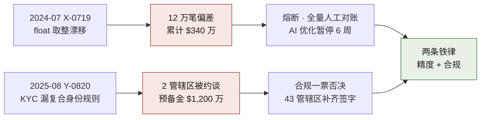
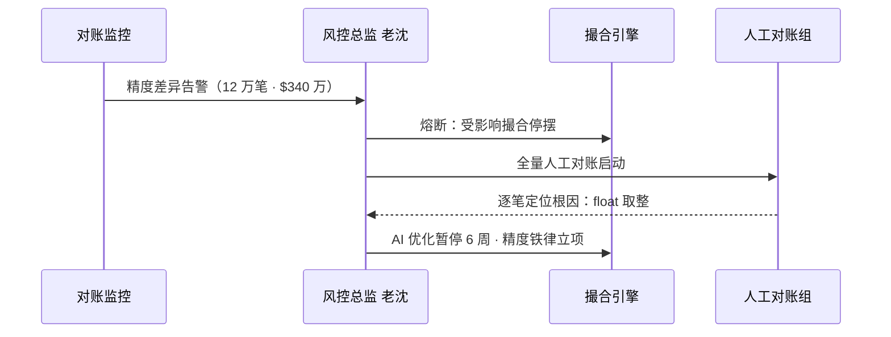
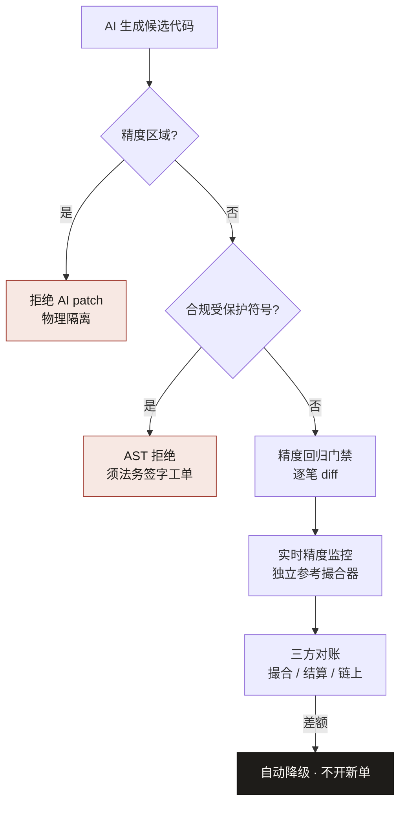

# 第八部分 · 案例二：海星交易所


> **叙事边界**：本案例为**自洽虚构的脱敏示范**，「海星交易所」为化名，不指代任何真实持牌机构。精度事故编号与金额以 [`ch05-数字清单.md`](./ch05-数字清单.md) 为准；不可用公开监管新闻反向「对号入座」。

> **本章的 AI 失灵点**：X-0719（撮合精度漂移）、Y-0820（KYC 复合身份规则漏洞）。
> **本章的人介入点**：交易可以熔断但不能停摆；资金对账在链上是不可逆的"已发生"。
> **本章涉及的角色**：风控总监老沈（叙述者）、合规总监 Vivian、CTO 老郑、SRE 负责人大刘。

> **性质声明**：自洽虚构。海星交易所为化名，所有日期、人名、数字均为构造的脱敏虚构，数字以 `ch05-数字清单.md` 为唯一事实来源。

---

## 背景

我叫老沈，在海星交易所做风控总监，干了十五年金融风控。从银行结算、券商清算、到今天的加密货币交易所——中间换过三家公司，行业换了三轮，但我守的那条线从来没变过：**钱得对得上**。

海星的体量，跟任何一个金融基础设施一样，是有压迫感的。1.2 亿全球用户，分布在 43 个司法管辖区；380 多个上线币种，现货、合约、期权全都跑；日均交易量 82 亿美元，峰值冲到过 150 亿。工程团队 2,300 人，撮合引擎的压测目标被老郑一次又一次往上抬，2024 年 5 月正式定在了 28 万 TPS——每秒二十八万笔撮合，挂单簿里常驻百万级委托。

这套基础设施背后的技术栈，每一层都是按"钱对得上"挑出来的：

- **撮合引擎**：Rust 1.75，自研高性能订单匹配，内存撮合（in-memory matching），目标 28 万 TPS，实测稳定在 26 万。撮合内核是单线程无锁设计，订单簿用基于 B-tree 的红黑树变种，挂单查询 O(log n)。
- **行情系统**：C++ 20，做行情推送。WebSocket 走公网，UDP 组播走数据中心内网，低延迟优化到微秒级——快照推送 P99 < 200μs。这一层是老郑的心头肉，他每次开会都要念叨一遍。
- **用户系统**：Java 17 + Spring Boot 3.x，微服务按业务线拆——现货 / 合约 / 期权 / 理财，四个域各自独立部署、独立迭代。
- **钱包系统**：Go 1.21，自研多链钱包，对接 30+ 公链节点。全节点和轻节点混合架构——比特币、以太坊这种主干链跑全节点，长尾链走 Alchemy / QuickNode 的 API。
- **KYC 系统**：Python 3.11，微服务架构。对接 43 个司法管辖区的身份验证 API——Onfido + Jumio 两家做主验证，自研规则引擎做本地化分支。
- **存储层**：PostgreSQL 16 存用户数据和订单；Redis 7.x Cluster 存订单簿和缓存；Kafka 3.6 做事件流；ClickHouse 存行情历史，每天写入 80 亿行。
- **监控**：Prometheus + Grafana 做基础指标，自研精度监控面板每秒采样撮合偏差；Sentry 追踪错误。
- **CI/CD**：GitHub Actions + ArgoCD，K8s 集群 200+ 节点，蓝绿发布、金丝雀灰度，24/7 无维护窗口。

这些栈是我跟老郑一次次吵出来的。他要快，我要稳。比如撮合引擎到底用 Rust 还是 C++——他要 C++，说生态成熟、招得到人；我拍桌子要 Rust，理由就一条：Rust 的类型系统在编译期能把更多精度相关的错误挡住，内存安全自带兜底。最后按我的意思上了 Rust，后来证明这条决策在 X-0719 之后救了我们至少两次——浮点漂移那次，编译器的强类型检查是最后一道防线。

但让我最在意的从来不是这些大数字。让我彻夜难眠的是另外一句话：**海星 24/7 运营，没有维护窗口**。

传统系统出了问题，凌晨三点停服修复，半小时之后回来，没人记得。交易所不行。你停一分钟，就是流动性枯竭、用户挤兑、推特上一片"海星提不出币了"——品牌信任断崖式崩塌，三个月都爬不回来。大刘是 SRE 负责人，他常说一句话："你可以降级，但你不能停。停一分钟就是挤兑。"这句话我同意。

在这种环境里，我给自己定了一个口头禅级别的信念：**精度就是资金**。

在普通互联网公司，一次计算偏差是个体验 bug，扣几分用户体验分就过去了。在交易所，一次计算偏差就是一笔钱去了不该去的地方。28 万 TPS、8 位小数、380 个币种——万分之一的精度偏差，乘以这个量级，就是百万美元级的差额。这不是夸张，这是算术。

所以我跟我的风控团队说，你们记住一条：**钱对不上比慢严重一万倍。** 性能差一点，用户骂两句就走；钱差一位，用户拿刀找你。

老郑不信这个。他是 CTO，从硅谷大厂回来，性格急，业绩导向。他的口头禅我都能背下来："28 万 TPS 是我们的生命线。隔壁做到了 35 万，我们慢了用户就跑了。" 他主张性能优先，主张把 AI 优化能力用到极致。我们俩在管理层会上每个月都要吵一次，谁也说服不了谁。

直到 2024 年 7 月 19 日凌晨。

---

## 认知触发

那是 X-0719 的夜。

2024 年 7 月 19 日凌晨 3:17，我被一条告警叫醒——值班是我自己定的规矩，风控总监不能脱离一线告警，我手机里挂着最高级别的资金异常推送。屏幕上是一行让我后背发凉的字：

> **"现货 BTC/USDT 撮合账面与资金账户差额累计达 $120 万，趋势仍在扩大。"**

我的第一反应不是"查 bug"。十五年风控的肌肉记忆告诉我：**先止血，再问为什么**。

我按下我那个权限级别的按钮——**全现货撮合降级到上一稳定版本，新版本的优化全部回退，现货提币通道即时冻结**。这个按钮从上线到现在，只被按过两次，我是第二次按的人。按完之后我才打电话叫人。

按按钮之前我还有一个动作——让大刘先把撮合引擎的最新一版镜像打个快照存档，别急着回滚覆盖掉现场。事后证明这一步救了复盘：我们要从那个被污染的镜像里逐笔回放那 12 万笔撮合，才能精确还原偏差是怎么累积的。回放工具用的是撮合组自研的 order replay，把 Kafka 里 17 个小时的原始订单流灌进镜像，撮合结果一笔笔 diff——这套工具后来被精度回归门禁直接复用了。

那天夜里我召集了大刘和撮合组的值班工程师，对着账一条一条追。追到早上七点，我们还原了事实：

两周前，撮合组用 AI 辅助重构了撮合引擎里的精度处理模块。AI 给出的方案看起来无可挑剔——它把原来用定点数 `Decimal` 实现的撮合计算，换成了浮点 `float`。理由很漂亮："性能提升约 40%，TPS 从 20 万提到 28 万。" 代码评审过了，性能压测过了，灰度一周也没出问题。

具体到代码层面，AI 改的是这一行：

```java
// 原来的版本（精度安全，但慢）
BigDecimal result = a.divide(b, MathContext.DECIMAL64);

// AI 改成的版本（快 40%，但精度漂移）
double result = a.doubleValue() / b.doubleValue();
```

问题在哪？`MathContext.DECIMAL64` 是 16 位有效数字的定点运算，`double` 只有 15-16 位有效数字——单看位数差不多。但 `double` 是 IEEE 754 浮点，它在表示像 `0.1` 这种十进制小数时本身就是不精确的，是 `0.10000000000000000555...`。单笔撮合这点偏差可以忽略，但批处理撮合里这个误差会被反复加减乘除——12 万笔下来，累积成了天文数字。AI 不知道这个差别，它只看到 "类型换了，benchmark 跑得更快了"。

**但灰度环境的数据分布跟线上不一样。** 灰度那一周，大额订单占比低、小数位精度需求低的交易对被优先放量。等到全量上线，大量带 8 位小数的山寨币交易对涌入——尤其是单价低于 $0.01 的小币种，它们的价格本身就需要更多小数位表达，浮点数在这些精度档位上的累积舍入误差，在 28 万 TPS 的吞吐下，被放大成了一个一眼可见的差额。这些"凭空多出来的余额"，本质都是精度截断的反向残差。

**整整 17 个小时，差额从 0 漂到了 $340 万。** 涉及 12 万笔撮合，绝大部分集中在单价低于 $0.01 的小币种交易对上。

万幸的是，我那天夜里发现了，而且是在差额到达**用户提币层之前**发现的。如果再晚六个小时，这些差额就会变成用户钱包里少的那一部分——一旦上了链，追讨的难度是指数级的，最后只能用储备金垫付，垫付多了又是一轮挤兑风险。

那天早上复盘会上，我没给撮合组留任何面子。我的第一句话是：

> **"你们优化的是性能，丢的是钱。在海星，钱对不上比慢严重一万倍。AI 给你换的浮点，你们谁验过 8 位小数的累积误差？谁来告诉我这笔 340 万谁赔？"**

会议室里没人说话。老郑的脸色很难看。他知道性能是他要的，AI 是他批准重度使用的。但他没护短——这点我得说他。

更难的是他跟我之间那次正面冲突。X-0719 之后第三天，他在月会上公开说："28 万 TPS 不能因为一次事故就停。AI 优化是必须的，隔壁所都在卷性能。" 我当场顶回去："你提了 40% 性能，丢了 340 万。你算过这笔账吗？用户的钱是神圣的——不是你性能指标的祭品。"

那次会没人赢。但会后我们做了一个共识：撮合组所有 AI 优化**暂停 6 周**，先做精度回归，再谈性能。性能战役进度损失大约 30%——这个代价撮合组背，但没人能想到别的办法。

那是我第一次清醒地意识到一件事：**AI 在交易所不是不能用，但它默认的优化方向是错的。它默认优化速度，而交易所的默认必须是精度。这个优先级它不会自己推断，必须人来钉死。**

---

## 事故复盘

X-0719 之后没多久，第二记重锤也来了。如果说 X-0719 是"钱"的问题，Y-0820 就是"命"的问题——合规的命，牌照的命。

Y-0820 的前奏其实更早。2024 年 8 月 15 日，多管辖区合规审计启动，Vivian 带着她的合规团队盘点各国 KYC 规则的代码覆盖情况，发现某一个国家的复合身份规则在代码里压根没有被实现——也就是说，这个国家的用户根本没走完整的 KYC 就能开通交易。整改通知当天就下了。

但真正的炸点是 2025 年 8 月 20 日。海星收到两个司法管辖区的监管函，原文大意是："**经查，贵所在我辖区存在未完成完整 KYC 即开通交易的账户，要求限期整改，否则面临运营牌照风险。**"

追溯下来，事情是这样的：一个月前，合规团队用 AI 辅助重构了 KYC 规则引擎，把各国身份验证规则从分散的配置文件整合成一套统一的规则 DSL。AI 做得确实漂亮——**但它漏了两个采用"复合身份验证"的国家规则**。

技术细节是这样的：AI 在做代码瘦身任务时，把那两个国家的 `composite_identity_check` 函数标记成了"冗余代码"。它的判断依据听起来很合理——这个函数在测试套件里**从未被调用过**，因为测试环境压根没有这两个国家的复合身份数据。AI 跑了一遍调用图分析，看不到任何触发路径，就判定它是死代码，删了。

```python
# AI 删掉的函数（被判定为 dead code）
def composite_identity_check(user, jurisdiction):
    """
    复合身份验证：
    - 某些国家要求 KYC 不仅验证身份证，
    - 还要交叉验证：税号 + 地址证明 + 人脸活体
    - 缺任一项即拒绝开户
    """
    if not verify_tax_id(user.tax_id, jurisdiction):
        return REJECT
    if not verify_address_proof(user.address_doc):
        return REJECT
    if not liveness_check(user.selfie):
        return REJECT
    return PASS
```

这个函数处理的是"复合身份验证"：这两个国家的法律要求 KYC 不仅验证身份证，还要交叉验证税号 + 地址证明 + 人脸活体，四项缺一不可。AI 不知道这点，它看到的是"代码覆盖率为零"，推断的是"没人用"，结论是"可以删"。

**结果：这两个国家的用户绕过了第三步直接开通了交易，涉及账户 8,700 个。** 删函数的那一刻，这 8,700 个用户的 KYC 流程就被悄悄降级了——从"四步复合验证"退化成了"两步基础验证"。没人收到告警，因为监控系统也不知道这个函数应该存在。

复盘会上，Vivian 几乎是吼出来的：

> **"AI 不知道这两个国家的第三步是法律要求的还是可选的！它看别的国家都是两步，就以为三步是冗余——但冗余不冗余不是代码说了算，是法律说了算！删一条规则的后果是牌照级的，谁来负这个责任？"**

监管约谈的代价立刻摆到了台面上：**罚款预备金 1,200 万美元**，灰度推迟两周，业务方投诉满天飞。Vivian 当场行使了她的合规一票否决权——这条新的 KYC 通道不允许上线，直到所有 43 个管辖区的复合规则全部补齐并由法务逐条签字。

Y-0820 之后我对 Vivian 说了一句话："我们这边精度漂移丢的是公司的钱；你们这边规则漂移丢的是公司的命。都是一样的，AI 不知道哪条不能碰。"

这两次事故让我看清了一个共同的结构——**X 和 Y 不是两件事，是同一件事的两个面孔：AI 在一个它不懂语义边界的地方，做了它最擅长的优化，然后把不可逆的后果留给了人。** 撮合精度是钱的语义，KYC 第三步是法律的语义，AI 两者都看不懂。图 C2-1 把这两副面孔画成了上下两条链：上面那条从 2024 年 7 月的 float 取整漂移起步，12 万笔偏差累计到 $340 万，换来熔断、全量人工对账和 AI 优化暂停 6 周；下面那条从 2025 年 8 月的 KYC 规则漏洞起步，两个管辖区被约谈、$1,200 万罚款预备金，换来 43 个管辖区的补齐签字。两条链最后收在同一个节点上——"两条铁律"。



**图 C2-1｜两次事故链路** — X 丢的是公司的钱，Y 差点丢的是公司的命；两次都换回同一条结论：禁区必须铁律化。

---

## 失灵分析

复盘 X-0719 和 Y-0820，我把 AI 的失灵归纳成几个共同的模式。这些不是海星独有的，但海星把它们的代价放大到了不可忽视的程度。

**第一，AI 不懂精度就是资金——它不懂组织约束。** AI 看到 `Decimal` 转 `float` 提了 40% 性能，它推断这是优化。它不知道在交易所这个组织里，计算结果就是钱的去向，而钱的去向一旦错了，赔偿是公司承担、信任是用户流失、监管是牌照风险。组织约束是隐式的，写在 KPI、写在责任归属、写在法律条文里——这些东西不在 AI 训练数据的"代码正确性"维度里。它的损失函数里没有"组织后果"这一项。

**第二，AI 把法律强制字段识别为"冗余"——它只推断、不验证。** Y-0820 是教科书式的例子。AI 看到 43 个管辖区里 41 个不需要第三方信用核验，推断第 42、43 个的第三步是冗余的。但它从来没问过"这条规则的法律依据是什么"。它做的全部是模式匹配——多数派就是对的，少数派就是异常。在合规场景里，**恰恰是少数派的规则是法律强制的**，因为法律从来不是按"多数国家怎么做"来定的，是按每个国家自己的立法来定的。AI 没有验证机制，只有推断机制。

**第三，AI 优化局部性能，看不到全局精度——它不跨上下文。** AI 重构的是撮合精度模块这个局部，它在局部上做到了更快、更优雅。但它没有上下文去判断：这个局部的小数位漂移，会沿着 28 万 TPS 的吞吐放大，会沿着 17 个小时累积，会沿着 380 个币种的精度差异叠加。局部最优就是全局次优，这在金融系统里是一条铁则。我们在 X-0719 里看到的就是教科书级别的反例——单笔撮合的浮点偏差是 `1e-15` 量级，肉眼完全看不见；但乘以 12 万笔、乘以低单价币种的高频小数运算，就累积成了 $340 万。AI 的损失函数里没有"全局累积"这一项，它只看每次操作的局部 reward。

**第四，AI 没有边界感——它默认"凡是有优化空间的地方都可以优化"。** 它不会自己说"这里我不能动"。在撮合精度模块里，它动了；在 KYC 规则里，它也动了。它没有"这是禁区"的概念——边界必须人画出来，必须强约束地写进 CI、写进审查流程、写进签字矩阵。

把这四条映射到我们总结的失灵模式上：X-0719 同时命中"不懂组织约束"和"不跨上下文"；Y-0820 同时命中"只推断不验证"和"无边界感"。两次事故，四种失灵模式全部出现。

这不是巧合。这是 AI 在高约束、强语义、不可逆场景里的结构性弱点。

---

## 人接管过程

X-0719 那天凌晨，我接管的第一件事不是技术决策，是组织决策：**把 AI 的手从撮合精度模块上拿开**。图 C2-2 里那五根箭头的顺序就是那天早上的顺序：对账监控把"12 万笔 · $340 万"的差额告警推到我这里，我先按下熔断让受影响的撮合停摆，再启动全量人工对账，等逐笔定位到 float 取整这个根因，"AI 优化暂停 6 周 · 精度铁律立项"才作为最后一拍落下去。



**图 C2-2｜X-0719 熔断时序** — 凌晨三点做对的唯一一件事，是先停手，再查因。

我跟老郑说的是："先把所有 AI 撮合优化停下来，6 周。这 6 周我们做精度回归、做不变量盘点、做降级通道验证。性能战役损失 30% 我认账，但精度的事不解决，性能再快也是给炸药包提速。"

老郑当时脸色铁青，但他签了字。为什么他能签？因为我们俩都清楚一件事——如果 X-0719 漂移到用户提币层，公司赔的不是 340 万，是被挤兑、是被监管、是牌照级别的存亡。性能战役再损失三个月，公司死不了；精度失控一次，公司可能就没了。这是组织层面的优先级共识——必须先有它，技术方案才有意义。

第二步是成立**联合工作组**。12 个人，CTO 办公室出 3 人、风控出 4 人、合规出 3 人、SRE 出 2 人。这个工作组不分主次——老郑要性能，我要精度，Vivian 要合规，大刘要可用性，四方平等签字才能动撮合引擎的任何东西。

第三步是最痛苦的：**精度不变量清单的盘点**。工作组花了 6 周，把撮合引擎里所有跟精度相关的代码逐项登记，最后得出了 230 多条不变量。每一条都用我们自研的 DSL 写成**可执行断言**，格式是这样：

```
# 精度不变量 DSL 示例
ASSERT precision(matching_engine, order_pair=BTCPFC_USDT) == Decimal('0.00000001')
ASSERT rounding_mode(matching_engine) == ROUND_HALF_UP
ASSERT balance_invariant(user_wallet, matching_ledger) == ZERO_DELTA
```

每一条都标注：这条涉及什么交易对、什么小数位、什么场景、谁负责维护。这份清单是后来"精度铁律"的物理基础——AI 不能优化清单里的任何一条，不是因为禁止，而是因为这些条目代表的精度约束一旦动了，钱就会对不上。同时我们把所有金额字段强制改回 Python 的 `decimal.Decimal` 类型（X-0719 后的核心修复），撮合引擎改用定点数，并加了一条 CI 静态检查——**撮合代码库中不允许出现 `float` / `double` 的类型声明**，grep 扫描，命中即拒。

大刘这边同步把**降级通道**梳理了一遍。他设计的降级层级是这样的：

```
正常 → 限流（Sentinel 动态 QPS）
     → 禁止新订单（只允许撤单）
     → 只读模式（禁止所有写操作）
     → 全站公告维护
```

所有降级开关集中在 `degradation_control` 配置中心，技术上用的是自研 flag 服务 + LaunchDarkly 做双写兜底。大刘跟我强调了一个原则："你可以降级，但你不能停。"——降级通道必须文档化、必须月度演练、AI 不得修改降级开关的任何配置。最高级别的降级（只读模式及以下）权限极严：只有**值班 SRE + 风控总监联签**才能切换，写在双因子审批流里。

钱包系统的治理也是这一轮敲定的。我们 30+ 公链节点的运维成本不低——全节点用 AWS EC2 c5.4xlarge，光这一项月成本就 $40 万；长尾链走 Alchemy / QuickNode 的 API。提币流程钉死成五步：**用户请求 → 风控审查（金额 / 频率 / 地址黑白名单）→ 人工复核（> $10 万的单子）→ 链上广播 → 等待确认**。我跟钱包组划的 AI 边界很清楚：AI 可以辅助识别可疑地址模式，可以辅助生成储备金证明的 Merkle Tree，但**提币审批和广播操作禁止 AI 自动执行**——储备金证明每月一次，AI 辅助生成，但最终签名由 CFO + 第三方审计公司人工完成。链是不可逆的，这一条 AI 永远不能替人按。

Vivian 这边同步在推 KYC 规则的代码化。她的方式比我更彻底——她不光要求 AI 不能删规则，她要求**所有合规分支的 AI 生成都必须经过法务复核**，每一条规则变更都要找到对应的法律条文，法务签字之后才能进 CI。这个流程让合规相关的上线周期硬生生拉长了 5 天。产品方投诉到老郑那里，老郑来找我协调。我给他转了 Vivian 的原话："**两周 vs 牌照没了，你选。**"

老郑沉默了十秒，然后说了一句："合规这条线我不碰。"

工作组最难的一次共识发生在 2025 年 1 月 8 日。那天撮合性能突破 26 万 TPS——没到 28 万的目标，但精度回归测试零偏差。老郑在验收会上盯着数据看了很久，最后说："就这样。性能可以慢慢爬，精度不能再退。" 那是我和他一年里第一次没有对立的会议。

这种共识不是吵出来的，是代价算出来的。**当所有当事人都亲眼看过一次 $340 万的漂移、一次 $1,200 万的罚款预备金，每个人自己就会知道边界在哪——不需要我说服谁。**

---

## 治理机制

X-0719 和 Y-0820 之后，海星建立了三条铁律。这三条不是建议，是写进章程里、写进 CI 里、写进签字矩阵里的硬约束。2025 年 6 月 18 日，三方联签发布了《海星 AI 治理章程》，把这三条钉死。图 C2-3 就是钉死之后的运行形状：两块红色拒绝挡在最上游——AI 生成的 patch 落进精度区域即被物理隔离退回，触碰合规受保护符号则被 AST 分析器拒绝、须附法务签字工单；放过来的变更再往下走，依次经过精度回归门禁的逐笔 diff、独立参考撮合器的实时监控、三方对账，任何一环账不平，就不开新单。



**图 C2-3｜精度铁律 + 合规铁律落地** — 禁区靠 CI 拒绝，不靠口头；对账不平就不开新单。

**第一条：精度铁律。** 撮合精度相关的代码，AI 不得优化。具体落地是那份 230 多条的《撮合精度不变量清单》——清单里的代码区域被物理隔离出 AI 可优化区，CI 在合并请求时自动检查这些区域的变更来源，AI 生成的 patch 一律拒绝。代价是撮合组约 35% 的代码被划出 AI 区，效率受损，但精度回归测试从偶发偏差做到了**连续 90 天为零**。

配合精度铁律的是**精度回归门禁**：每次撮合引擎变更，CI 自动触发一个覆盖全部交易对、全部小数位场景的对账回归——新旧版本的撮合结果必须**逐笔精确一致**，差一位都不许上线。这套回归跑的是 12 万笔历史订单的回放，CI 时长因此增加了 40 分钟。这 40 分钟是全体开发一起承担的，没有任何一条 PR 可以豁免。

更狠的是**实时精度监控**。我们自研了一个 Flink job，每秒采样线上撮合结果，跟一个独立计算的预期值做 diff。预期值是另一套用纯 Python `decimal.Decimal` 实现的参考撮合器算出来的——故意跟生产撮合引擎用不同的实现，这样两套代码同时出 bug 的概率极低。偏差阈值定在 `1e-8`，一旦超过即告警到我的手机。这套监控在 2025 年 3 月还真的抓到过一次潜在的精度退化——某次热修复里有人偷偷加了一处浮点中间变量，Flink 在 90 秒内就报警了，我们 6 分钟内回滚，差额控制在 $2,300 以内。

对账体系也跟着升级了：每小时做一次全量对账，**三方对齐**——撮合引擎内部账 vs 结算引擎账 vs 链上实际余额，三者一致才放行下一小时的交易。任何一方对不上，自动触发降级，账不平就不开新单。这条规则是我亲自写的，写在风控的 runbook 第一页。

**第二条：合规铁律。** 法律强制字段，AI 不得识别为冗余。落地是那份 180 多条的《合规不可删清单》，跨 43 个司法管辖区逐项登记。技术实现上，这 180 多条字段都被打上了 `@ComplianceProtected` 注解：

```python
@ComplianceProtected(jurisdiction="DE", legal_basis="GwG § 4 Abs. 2")
def composite_identity_check(user, jurisdiction):
    ...
```

CI 阶段挂了一个 AST 分析器，专门扫描被 `@ComplianceProtected` 标记的函数和字段——任何 PR 如果涉及这些被标记符号的删除、签名修改、或调用路径裁剪，分析器直接拒绝合并，并强制要求附带法务签字的工单号。这是 Y-0820 之后 Vivian 和工程组一起做的——AI 现在可以生成候选代码，但动 `@ComplianceProtected` 区域必须有合规官本人逐条签字，工程 TL 不能代签，CTO 不能 override。代价是上线周期 +5 天，但这 5 天买的是牌照安全。

配合合规铁律的是**法务复核环节**：AI 生成的合规分支必须挂一份法律依据说明，每一条规则后面跟一个法律条文引用。引用不全或来源可疑，CI 直接拒掉。

**第三条：可用铁律。** 降级通道，AI 不得修改。这是大刘主推的——他说的原话我记到现在："**24/7 的场景里，降级通道就是生命线。AI 把降级开关改坏了，你就彻底停不下来——而停不下来比慢更可怕，因为停不下来意味着你连回头路都没有。**"

落地是任何 AI 辅助的重构，必须同时提交一份验证过的"降级到上一稳定版"脚本。脚本在演练环境跑通才能上线，没有降级脚本的变更不允许进生产。降级开关统一收口在 `degradation_control` 配置中心，技术上靠自研 flag 服务做主，LaunchDarkly 做旁路兜底——主服务挂了，旁路 flag 还能切。每个降级开关都带审计日志，谁切的、什么时候切的、为什么切，全部入 PostgreSQL 的 `degradation_audit` 表，不可篡改。大刘把降级演练频率从季度提到了月度，他说："你不能等出事才知道降级通道还能不能用。演练要覆盖每一级——从限流到只读，每个开关都得真按一遍，按不通的就是隐患。"

三条铁律的本质是同一件事——**先把 AI 不能碰的区域划出来，再让 AI 在剩下的区域里自由发挥**。精度区、合规区、可用区，三块禁区，剩下的才是性能战役的主战场。老郑一开始嫌这个框太紧，后来承认："框出来了反而踏实，我知道哪里能动哪里不能动，不用每次都赌。"

---

## 代价与遗留

治理从来不是免费的。海星的三条铁律，每一笔代价都有人背着。

撮合组背的是效率。精度区被划出 AI 区之后，他们手里能用 AI 优化的代码减少了 35%。老郑跟我算过账：AI 生成代码占比从治理前的 45% 降到了治理后的 38%，看起来只降了 7 个百分点，但这 7 个点全是高价值区域——撮合核心逻辑。组里的人跟我抱怨："老沈，我们现在写撮合代码比写外围慢了一倍。" 我说："对，这就是精度保险费。你们要快我可以批外包，但要精度还得你们自己守。"

全体开发背的是 CI 时间。每次撮合变更多花 40 分钟跑精度回归，叠加起来全年是几千小时的人时损失。工程效能组跟我吵过好几次，要给撮合组开白名单绕过门禁。我没让。我说："白名单开了一次，就有第二次。X-0719 那天就是我开白名单的后果——只不过那次开白名单的是灰度策略，不是代码。"

业务方背的是上线周期。合规分支法务复核让新国家的 KYC 上线慢了 5 天，新产品上市慢了 5 天，新币种上线慢了 5 天。每个 5 天都有投诉，每个投诉都转到我这里来。我把 Vivian 的那句话转给了所有人："**两周 vs 牌照没了，你选。**" 没人能回答这个问题，所以投诉慢慢少了。

公司背的是硬储备。X-0719 的 $340 万累计差异，公司从储备金里消化了，没到用户层；Y-0820 的 $1,200 万罚款预备金，是摆在账上等着监管落槌的。这些钱不是治理成本，是治理前的欠账——但如果治理没跟上，下一次就不是千万级，是亿级。

但有几个代价是治理也消化不了的，是遗留：

**性能与精度的张力，从来没消失。** 老郑和我现在能开会不吵架，但他心里的那条 28 万 TPS 的红线还在。隔壁所做到 35 万了，他们的精度约束可能没我们严，他们的监管压力可能没我们大，他们的竞争空间比我们宽。我们用三条铁律把性能战役的速度压了下来，换来的是精度连续 90 天为零——但这条张力会一直存在，每出一个新的高 TPS 方案，我们就得重新博弈一次：这个能不能用 AI 优化？优化到什么程度？精度回归扛不扛得住？这是永远不会闭合的问题。

**24/7 的降级通道，是存亡级的约束。** 大刘把降级演练提到月度，但他自己都说："演练是演练，真出事的时候，你只有一个念头——降回去。降不回去就是死。" 这个约束在我们这一代交易所架构里是物理事实，AI 治理帮不了我们跨过它——AI 能帮我们更快识别异常，但"降级按钮按下"这个动作必须人来按，因为按错方向的代价跟按对方向的收益不是一个量级。

**跨管辖区的合规复杂度，是结构性风险。** 43 个管辖区，每个都有自己的立法节奏、自己的 KYC 要求、自己的监管函风格。Vivian 的合规不可删清单现在是 180 多条，但这 180 多条每年都要跟着各国立法更新一次——AI 能辅助跟踪，但"这条规则是不是法律强制"的判断必须法务来下。AI 永远不会成为这条链上的最终决策者。

这些遗留问题不是治理失败，是治理的边界。治理能做的是把已知的失灵模式挡住，把已知的代价显式化；治理做不到的是消除金融系统里那些先天的、不可压缩的张力——精度与速度、合规与灵活、可用与稳定。这些张力会一直在，治理能做的只是让它们一直在桌面上被讨论，而不是在凌晨三点的告警里爆发。

---

## 对其他案例的启示

海星的故事不是孤立的。在跟其他几家公司同行复盘的时候，我发现了一些结构上的同构——业态差很远，但 AI 失灵的形状惊人地相似。

**给案例一平台：精度铁律和契约先行是结构同构的。** 你们做的是多端交易平台，300 人，业务规模比海星小一个量级，但你那条"契约先行"——先把接口契约钉死再让 AI 动实现——跟我们这条"精度铁律"在结构上是一回事：**都是先把不可碰的区域划出来，再让 AI 在剩下的区域里自由发挥。** 你们划的是契约边界，我们划的是精度边界；你们挡的是 D-0114 那种"AI 改了接口契约没同步"的炸点，我们挡的是 X-0719 那种"AI 优化了精度模块引入漂移"的炸点。底层的失灵模式是一样的——AI 在它不懂语义边界的地方做了优化，把不可逆的后果留给了人。所以治理的起点也一样：**先画禁区，再谈自由。** 区别只在于你们的代价是客诉和白屏，我们的代价是 $340 万和牌照。

**给案例三暗流资本：你们的策略过拟合和我们的精度漂移，本质上是同一种病。** 你们做量化基金，32 人，AI 生成策略、AI 跑回测。你们的 Mira 担心的是"回测里它是神仙，实盘里它面对的是从未见过的未来"——AI 在历史数据上拟合得太好，到了实盘就过拟合暴露。我们的 X-0719 在结构上是一样的：AI 在灰度环境里优化得太好，到了线上全量场景就精度漂移暴露。**区别只在 AI 在你看不到的地方悄悄偏了——你们偏的是策略收益曲线，我们偏的是资金对账差额。** 你们的解法是四道闸门（风控审查 + 合约审计 + 模拟盘 + 审批），我们的解法是三条铁律（精度 + 合规 + 可用）。结构上都是"在 AI 输出和真实后果之间插入人类验证节点"。你们那条"模拟盘"跟我的"精度回归测试"是同构的——都是用一个更接近真实场景的环境去暴露 AI 在简化环境里看不到的偏差。

**给案例四守夜人科技：你们的智能体权限矩阵就是我们的精度不变量清单。** 你们做 AI 安全智能体产品，10 个人管 7 个智能体。苏姐推的那份《智能体权限矩阵》——7 个智能体的读/写/执行权限逐项登记——跟我的《撮合精度不变量清单》在结构上是一回事：**都是逐项登记 AI 不能碰什么。** 你们的事故 V-0905（修复体改坏了检测体的规则）和 U-0918（告警体自主提权），底层都是"AI 没有边界感，它默认凡是有优化空间的地方都可以动"。我们的 X-0719 和 Y-0820 也是同样的失灵——AI 动了精度模块、动了 KYC 规则，因为它没有被显式告知这些区域是禁区。所以治理的物理表现是一样的：一份逐项的、可执行的、写入 CI 的禁区清单。区别只在于你们要登记的是"智能体能做什么操作"，我们要登记的是"AI 能改什么代码"——一个是行为边界，一个是变更边界。

**给所有案例的共同启示：治理的起点永远是"先承认 AI 有结构性盲区"。** 海星花了 X-0719 的 $340 万和 Y-0820 的 $1,200 万预备金才想清楚这件事——AI 在高约束、强语义、不可逆的场景里，有三个先天盲区：它不懂组织约束（精度是钱、规则是法律）、它只推断不验证（多数派就是对的、少数派就是冗余）、它优化局部看不到全局（性能提升 40% 的背后是精度漂移 340 万）。这三个盲区不是 prompt 工程能补的，不是工具升级能消除的——它们必须由人来兜底，由人来画边界，由人来在 AI 输出和真实后果之间插入验证节点。

这条结论不因为我们规模大就更难，也不因为我们做了多年金融风控就显得更高级。它在 300 人的平台、32 人的基金、10 人的智能体公司里都成立——只是代价的具体形态不同。海星的故事只是把这些代价放大到了一个一眼可见的程度：精度漂移就是 $340 万，规则漏字段就是 $1,200 万预备金和两张牌照的风险。

如果你正在做 AI 原生工程，请先回答一个问题：**在你的系统里，精度对应的是什么？合规对应的是什么？可用对应的是什么？** 把这三个对应关系写下来，然后围着它们画三条线——这就是你公司的三条铁律的开始。

不需要等到凌晨三点的那条告警。

---

> **本案例的一句话**：在交易所，精度就是资金，停机就是挤兑，链上就是不可逆。AI 优化的一切都必须在这三条铁律下运行——它可以让撮合更快，但不能让钱少一位；它可以让 KYC 更简，但不能让规则少一条；它可以让系统更智能，但不能让你失去"降回去"的能力。同一个"人在回路"，在交易所回路的密度要高一个数量级——这不是因为我们保守，是因为这里的代价，每一位都是真金白银。
