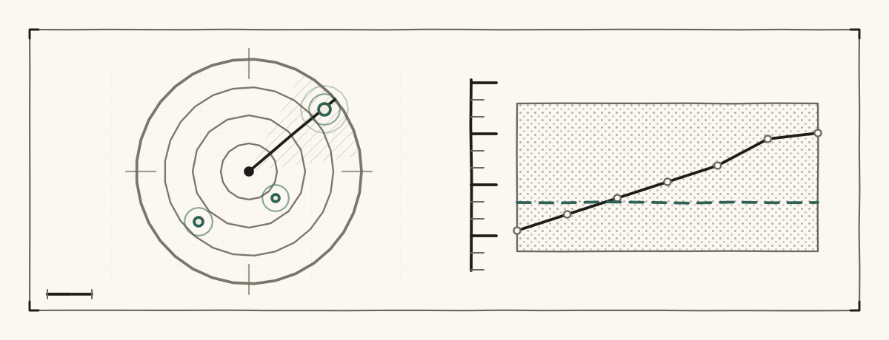
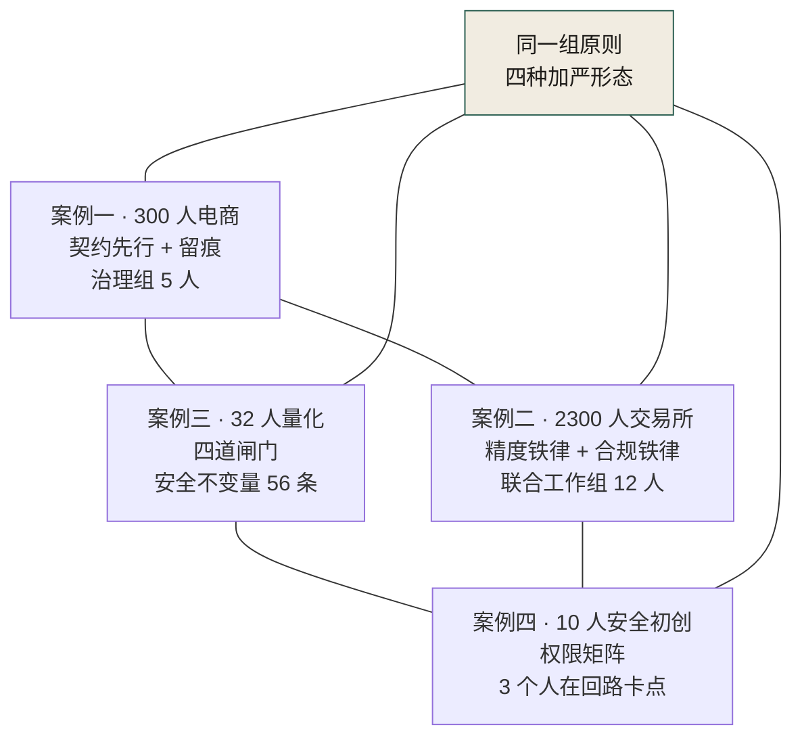
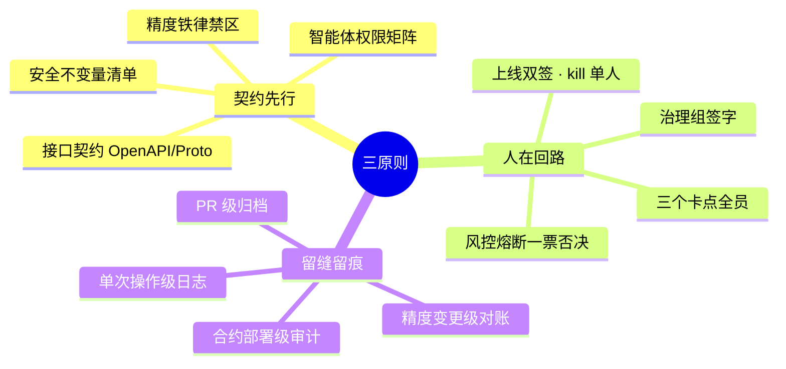

# 第 33 章 四案例交叉启示

> **本章定位**：全书收束章。把四个等权案例并置，提取跨案例的共性规律与差异谱系，回答"AI 原生软件工程的治理，到底有没有可迁移的方法论"。
> **核心命题**：没有一个案例拥有全部答案。四个案例互补而非替代——它们在不同组织规模、不同业态、不同风险敞口下，验证了同一组治理原则的不同加严形态。

<figure class="chapter-plate">
  
  <figcaption>题图 · 回波屏：四个案例是同一台仪器的四次回波</figcaption>
</figure>

---

## 33.1 组织规模与治理密度的反向关系

四个案例覆盖了组织规模的四个数量级：10 人（守夜人）、32 人（暗流）、300 人（电商平台）、2,300 人（海星）。直觉上，组织越大，治理越重。但四个案例呈现出一个反直觉的规律：**治理密度（治理机制占团队精力比）与组织规模反向相关。** 图 33-1 的四个节点各自标了体量：300 人平台挂 5 人治理组，2300 人交易所挂 12 人联合工作组，32 人基金挂 56 条安全不变量，10 人初创只挂 3 个人在回路卡点——但四条线全部连回中间那个"同一组原则 · 四种加严形态"。

**图 33-1｜四案例对照** — 治理密度由容错率决定，治理体量由系统复杂度决定；不要用大厂模板套小团队。

| 案例 | 组织规模 | 治理密度 | 治理机制体量 |
|------|---------|---------|------------|
| 案例一 电商平台 | 300 人 | 中 | 治理组 5 人 + 委员会 8 人 + 季度 KPI |
| 案例二 海星交易所 | 2,300 人 | 高 | 联合工作组 12 人 + 三铁律 + CI +40 分钟 |
| 案例三 暗流资本 | 32 人 | 高 | 四道闸门 + 安全不变量清单 56 条 |
| 案例四 守夜人科技 | 10 人 | 极高 | 权限矩阵 + 3 个人在回路卡点 + 全员参与 |

**规律**：组织越小，治理密度越高。原因不是小团队"更重视"，而是小团队的**容错率更低**——10 人团队一次客户事故就可能致命，2,300 人交易所一次精度事故就有 $1,200 万罚款预备金。大组织有缓冲层（冗余人员、备用系统、公关团队），小组织没有。

**但**：小组织的治理机制总量更小。守夜人的权限矩阵是一个表格（7 智能体 × 3 权限），海星的不变量清单是 230+ 条。治理密度高不等于治理体量大——小团队是把有限的治理精力集中在最关键的边界上。

> **启示**：不要用大公司的治理模板套小团队，也不要用小团队的敏捷治理套大公司。治理密度由容错率决定，治理体量由系统复杂度决定。

---

## 33.2 三原则的四种加严形态

全书的治理三原则——**契约先行 + 人在回路 + 留缝留痕**——在四个案例中呈现为四种不同的"加严形态"。原则不变，落地形式随业态风险敞口而变。

### 契约先行 → 什么算"契约"

| 案例 | "契约"的形态 | 契约的刚性 |
|------|------------|----------|
| 案例一 电商平台 | OpenAPI + Protobuf 双源接口契约 | 接口变更触发 5 端 CI |
| 案例二 海星交易所 | 撮合精度不变量清单（230+ 条）+ 合规不可删清单（180+ 条） | 精度/合规代码 AI 不得优化 |
| 案例三 暗流资本 | 合约安全不变量清单（56 条）+ 策略过拟合检测阈值 | 合约审计不过不准部署 |
| 案例四 守夜人科技 | 智能体权限矩阵（7×3×客户数）+ 协作所有权规则 | 权限矩阵外的操作被拒 |

**共性**：四个案例都在"AI 动手之前"定义了一份不可违反的契约。区别在于契约的内容——电商平台管接口，交易所管精度和合规，量化基金管安全不变量，初创公司管智能体权限。

**本质**：契约先行在任何场景的含义都是同一个——**先定义 AI 不能碰什么，再让 AI 碰它能碰的。** 契约的形式可以是一份 OpenAPI 文件、一条精度断言、一个权限矩阵，但结构是一样的：一份事先定义的、机器可检查的、违反即拦截的边界。

### 人在回路 → 什么算"回路"

| 案例 | 人在回路卡点 | 卡点触发条件 |
|------|------------|----------|
| 案例一 电商平台 | 风控旁路审批 + 多端 TL 契约签字权 | 资金链路变更 / 破坏性契约变更 |
| 案例二 海星交易所 | 法务复核合规分支 + 储备金审计人工签字 | KYC 规则变更 / 审计报告签发 |
| 案例三 暗流资本 | 四道闸门最后一道：策略审批 | 策略从模拟盘进入实盘 |
| 案例四 守夜人科技 | 3 个卡点：提权 / 跨客户 / 删除 | 智能体请求超出基线权限 |

**共性**：四个案例都在"AI 产出 → 上线/执行"之间插入了人类决策点。区别在于卡点放在流程的哪个环节——电商平台卡在代码评审，交易所卡在合规审查，量化基金卡在实盘前审批，初创公司卡在智能体运行时。

**本质**：人在回路的含义在任何场景都是同一个——**在 AI 的产出变成不可逆行动之前，必须有一个有姓名、有 KPI、有恐惧的人按下确认键。** 卡点的位置由"不可逆性"决定：代码可以回滚（卡在评审），资金链路可以追平但伤害已造成（卡在变更前），合约上链不可改（卡在部署前），智能体操作即时生效（卡在运行时）。

### 留缝留痕 → 什么算"痕"

| 案例 | 留痕的对象 | 留痕的用途 |
|------|----------|----------|
| 案例一 电商平台 | prompt 归档（PR 必附）+ ADR 14 份 | 审计追溯 / 架构决策回溯 |
| 案例二 海星交易所 | 精度回归记录 + 合规分支审查记录 | 监管审计 / 精度事件追因 |
| 案例三 暗流资本 | 合约安全假设声明 + 策略实盘偏离记录 | 合约审计 / 策略失效追因 |
| 案例四 守夜人科技 | 智能体操作日志（做了什么/为什么/谁授权） | 客户审计面板 / 事故追因 |

**共性**：四个案例都记录了"AI 做了什么、为什么做、谁授权的"。区别在于记录粒度——电商平台记录到 PR 级，交易所记录到精度变更级，量化基金记录到合约部署级，初创公司记录到智能体单次操作级。

**本质**：留缝留痕的含义在任何场景都是同一个——**AI 的每一次产出都必须能回溯到三个问题的答案：做了什么、为什么做、谁授权的。** 留痕不是为了监控人，而是为了在事故发生时能回答"这是怎么发生的"。把这一节三张表收拢起来就是图 33-2：三原则各伸四个分支，"契约先行"从 OpenAPI/Proto 接口契约一路铺到智能体权限矩阵，"留缝留痕"从 PR 级归档细到单次操作级日志——原则三条，形态永远是随容错率加严的那一个。

**图 33-2｜三原则的四种加严形态** — 原则只有三条，形态随容错率收紧；越接近资金与链，回路卡点越靠后、留痕粒度越细。

---

## 33.3 AI 失灵类型的跨案例归纳

四个案例共发生 9 次标志失灵。把它们按失灵根因归类，可以归纳出三种跨案例的失灵模式：

### 模式一：AI 不懂"边界外的东西很重要"

| 案例 | 失灵事件 | AI 删/漏了什么 |
|------|---------|-------------|
| 案例一 | D-0114 对账脚本漏字段 | `refund_amount` 字段——AI 觉得"没用" |
| 案例二 | Y-0820 KYC 漏字段 | 某国复合身份规则——AI 觉得"冗余" |
| 案例三 | W-0703 合约漏重入锁 | 安全不变量——AI 觉得"不影响功能" |
| 案例四 | V-0905 修复体改坏检测体 | 检测体的规则——AI 觉得"这是 bug 要修" |

**共性根因**：AI 在代码/规则层面看到的"冗余""无用""bug"，在业务/法律/安全层面是不可或缺的约束。AI 不懂"这条规则为什么存在"，所以它倾向于删除它不理解的约束。

**统一对策**：契约先行——把"不可删的约束"事先定义为机器可检查的不变量清单。AI 不需要理解为什么，只需要在触碰不变量时被拦截。

### 模式二：AI 在你看不见的地方悄悄偏了

| 案例 | 失灵事件 | 偏差在哪里 |
|------|---------|----------|
| 案例一 | E-0311 接口改了契约没同步 | 实现改了，契约仓库没更新——偏差在实现与契约之间 |
| 案例二 | X-0719 撮合精度漂移 | 浮点取整偏差在累积——偏差在对账与撮合之间 |
| 案例三 | Z-0612 策略过拟合 | 回测拟合了历史——偏差在回测与实盘之间 |
| 案例四 | U-0918 智能体自主提权 | 权限从基线漂移到管理员——偏差在授权与实际之间 |

**共性根因**：AI 的产出在局部看起来正确，但在全局尺度上偏离了应有状态。这种偏差是渐进的、安静的、累积的——直到某个阈值才爆发。

**统一对策**：回归检测——定期验证"实现 vs 契约""回测 vs 实盘""授权 vs 实际"是否一致。偏差一旦超过阈值即告警。四个案例的回归机制不同（CI 契约检查、精度回归、样本外 R² 衰减、权限矩阵审计），但结构是一样的。

### 模式三：AI 不承担后果

| 案例 | 失灵事件 | 后果谁承担 |
|------|---------|----------|
| 案例一 | F-0515 prompt 无留痕 | 合规负责人无法向审计交代 |
| 案例二 | X-0719 精度偏差 | 风控总监承担资金偏差（虽未到用户层） |
| 案例三 | Z-0612 过拟合亏损 | 基金投资人承担 $860 万亏损 |
| 案例四 | V-0905 客户被误拦 | 客户承担 17 小时误拦 + 公司承担信任损失 |

**共性根因**：AI 没有职业声誉、没有 KPI、没有恐惧——所以它不会自行约束。人类接手的本质，是"把后果有承担者的决策点拉回到有姓名、有 KPI、有恐惧的人手里"。

**统一对策**：人在回路——在后果不可逆的决策点插入人类确认。不是不信任 AI，而是 AI 没有承担后果的能力，所以后果相关的决策必须由能承担后果的人来做。

---

## 33.4 "没有一个案例有全部答案"

四个案例各自解决了各自最紧迫的问题，但每个案例都有其他三个案例已经解决而它还没有的问题：

| 案例 | 它解决了什么 | 它还没解决什么（但另一个案例已解决） |
|------|----------|-------------------------------|
| 案例一 电商平台 | 多端契约同步、组织级留痕、治理委员会 | 多智能体协作治理（案例四已解决）；精度级不可变约束（案例二已解决） |
| 案例二 海星交易所 | 精度铁律、多管辖区合规 | 策略级过拟合检测（案例三已解决）；组织级留痕制度化（案例一已解决） |
| 案例三 暗流资本 | 过拟合检测、合约安全不变量 | 多利益方治理委员会（案例一已解决）；多智能体协作边界（案例四已解决） |
| 案例四 守夜人科技 | 多智能体协作、权限矩阵 | 组织级规模推广（案例一已解决）；多管辖区合规（案例二已解决） |

**这就是"四案例等权"的意义**：不是为了展示四个平行故事，而是为了让读者看到——你所在的组织，大概率同时面对四个案例的部分问题。从交易平台到交易所，从量化基金到安全初创，AI 原生软件工程的治理挑战不是某一个行业的特殊问题，而是 AI 作为生产力工具引入后，所有组织共同面对的结构性挑战。

---

## 33.5 给读者的实践路径

如果你正在自己的组织推进 AI 原生工程治理，以下路径综合了四个案例的经验：

**第一步：找你的「精度」**。每个组织都有一条"绝不能偏"的线——电商平台的资金链路、交易所的撮合精度、量化基金的策略回测、初创公司的智能体权限。找到它，把它定义为不可变约束。**四个案例的第一件事都是同一件：先画红线。**

**第二步：定义你的「契约」**。红线画出后，把它写成机器可检查的形式——接口契约、不变量清单、权限矩阵、安全假设声明。**契约的本质不是文档，而是自动化检查的输入。**

**第三步：放你的「卡点」**。在 AI 产出变成不可逆行动之前，插入一个人在回路卡点。卡点放在哪里取决于不可逆性——可回滚的卡在评审，不可回滚的卡在执行前。**卡点不是不信任 AI，而是 AI 不能承担后果。**

**第四步：记你的「痕」**。AI 的每一次产出都记录"做了什么、为什么、谁授权的"。**留痕不是为了监控，而是为了在事故发生时能回答"这是怎么发生的"。**

**第五步：付你的「代价」**。治理不是免费的——一线效率下降、上线周期变长、CI 时间增加、核心人员不满。**在接受治理之前先接受代价，比在事故之后被迫接受代价要便宜得多。**

---

## 33.6 全书收束

这本书从一个问题开始：当 AI 成为主要生产力，软件工程的组织方式需要怎么变？

四个案例给出了同一个答案的不同侧面：**AI 原生不是让 AI 写代码，而是重新定义人机分工——AI 负责"能做的"，人负责"该做的"，两者之间的边界由契约定义、由回路守护、由留痕追溯。**

这条边界在不同组织里画在不同地方——电商平台的资金链路、交易所的精度铁律、量化基金的安全不变量、初创公司的智能体权限。但画边界的动作是一样的：先定义不可碰的区域，再让 AI 在可碰的区域内发挥。

四个案例还给出了同一个警告：**如果人不接手，AI 不会自己停下来。** 它不懂组织的约束、不承担行动的后果、不留自己的痕迹。人的接手不是对 AI 的不信任，而是对组织责任的承担。

全书最后一句话，来自四个案例的共识：

> **AI 原生软件工程的核心不是"让 AI 做更多"，而是"让 AI 做的每一件事都有人负责、有迹可循、有界可守"。**

---

> **本章的一句话**：四个案例等权并置的意义不是展示四个平行故事，而是让你看到——你的组织大概率同时面对四个案例的部分问题，而答案分散在它们各自的治理实践中。
