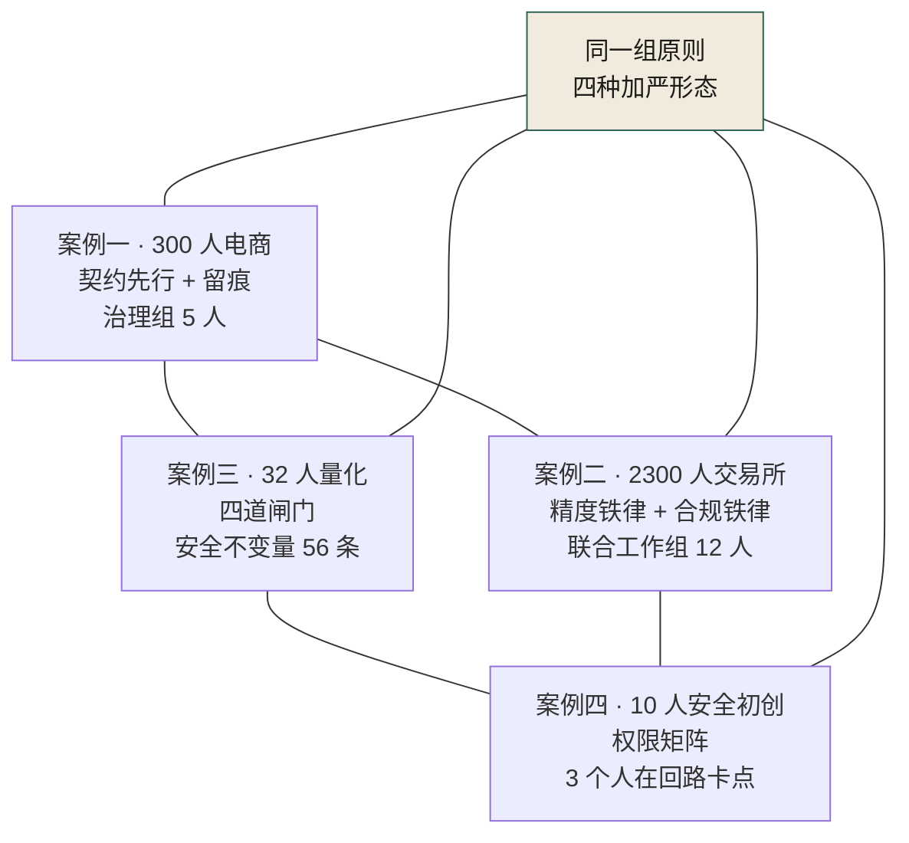
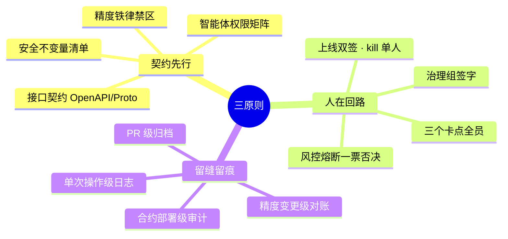
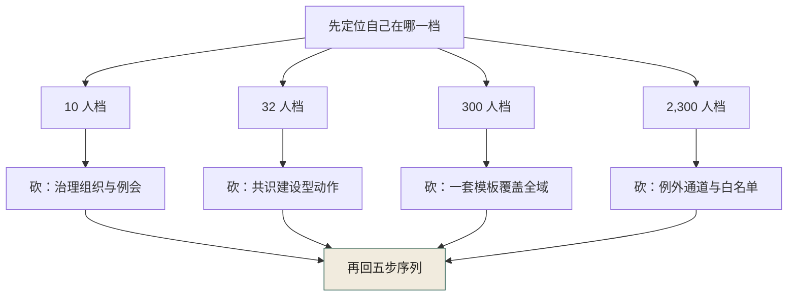
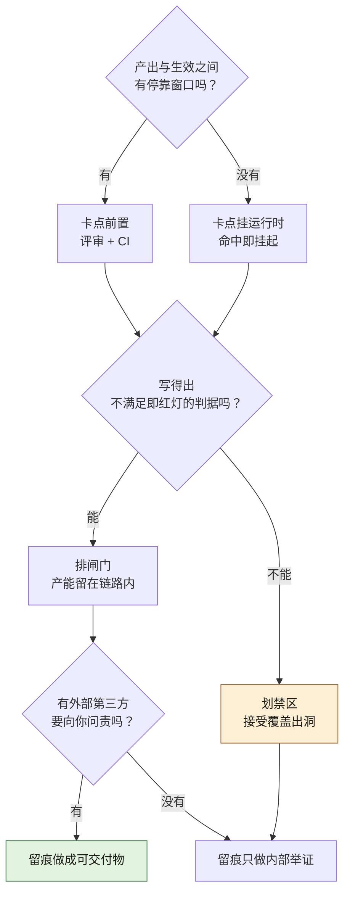

# 第 33 章 四案例交叉启示

> **本章定位**：全书收束章。把四个等权案例并置，提取跨案例的共性规律与差异谱系，回答"AI 原生软件工程的治理，到底有没有可迁移的方法论"。
> **核心命题**：没有一个案例拥有全部答案。四个案例互补而非替代——它们在不同组织规模、不同业态、不同风险敞口下，验证了同一组治理原则的不同加严形态。

<figure class="chapter-plate">
  
  <figcaption>题图 · 回波屏：四个案例是同一台仪器的四次回波</figcaption>
</figure>

---

## 33.1 组织规模与治理密度的反向关系

四个案例覆盖了组织规模的四个数量级：10 人（守夜人）、32 人（暗流）、300 人（电商平台）、2,300 人（海星）。直觉上，组织越大，治理越重。但四个案例呈现出一个反直觉的规律：**治理密度（治理机制占团队精力比）与组织规模反向相关。** 图 33-1 的四个节点各自标了体量：300 人平台挂 5 人治理组，2300 人交易所挂 12 人联合工作组，32 人基金挂 56 条安全不变量，10 人初创只挂 3 个人在回路卡点——但四条线全部连回中间那个"同一组原则 · 四种加严形态"。

**图 33-1｜四案例对照** — 治理密度由容错率决定，治理体量由系统复杂度决定；不要用大厂模板套小团队。

| 案例 | 组织规模 | 治理密度 | 治理机制体量 |
|------|---------|---------|------------|
| 案例一 电商平台 | 300 人 | 中 | 治理组 5 人 + 委员会 8 人 + 季度 KPI |
| 案例二 海星交易所 | 2,300 人 | 高 | 联合工作组 12 人 + 三铁律 + CI +40 分钟 |
| 案例三 暗流资本 | 32 人 | 高 | 四道闸门 + 安全不变量清单 56 条 |
| 案例四 守夜人科技 | 10 人 | 极高 | 权限矩阵 + 3 个人在回路卡点 + 全员参与 |

**规律**：组织越小，治理密度越高。原因不是小团队"更重视"，而是小团队的**容错率更低**——10 人团队一次客户事故就可能致命，2,300 人交易所一次精度事故就有 $1,200 万罚款预备金。大组织有缓冲层（冗余人员、备用系统、公关团队），小组织没有。

**但**：小组织的治理机制总量更小。守夜人的权限矩阵是一个表格（7 智能体 × 3 权限），海星的不变量清单是 230+ 条。治理密度高不等于治理体量大——小团队是把有限的治理精力集中在最关键的边界上。

> **启示**：不要用大公司的治理模板套小团队，也不要用小团队的敏捷治理套大公司。治理密度由容错率决定，治理体量由系统复杂度决定。

---

## 33.2 三原则的四种加严形态

全书的治理三原则——**契约先行 + 人在回路 + 留缝留痕**——在四个案例中呈现为四种不同的"加严形态"。原则不变，落地形式随业态风险敞口而变。

### 契约先行 → 什么算"契约"

| 案例 | "契约"的形态 | 契约的刚性 |
|------|------------|----------|
| 案例一 电商平台 | OpenAPI + Protobuf 双源接口契约 | 接口变更触发 5 端 CI |
| 案例二 海星交易所 | 撮合精度不变量清单（230+ 条）+ 合规不可删清单（180+ 条） | 精度/合规代码 AI 不得优化 |
| 案例三 暗流资本 | 合约安全不变量清单（56 条）+ 策略过拟合检测阈值 | 合约审计不过不准部署 |
| 案例四 守夜人科技 | 智能体权限矩阵（7×3×客户数）+ 协作所有权规则 | 权限矩阵外的操作被拒 |

**共性**：四个案例都在"AI 动手之前"定义了一份不可违反的契约。区别在于契约的内容——电商平台管接口，交易所管精度和合规，量化基金管安全不变量，初创公司管智能体权限。

**本质**：契约先行在任何场景的含义都是同一个——**先定义 AI 不能碰什么，再让 AI 碰它能碰的。** 契约的形式可以是一份 OpenAPI 文件、一条精度断言、一个权限矩阵，但结构是一样的：一份事先定义的、机器可检查的、违反即拦截的边界。

### 人在回路 → 什么算"回路"

| 案例 | 人在回路卡点 | 卡点触发条件 |
|------|------------|----------|
| 案例一 电商平台 | 风控旁路审批 + 多端 TL 契约签字权 | 资金链路变更 / 破坏性契约变更 |
| 案例二 海星交易所 | 法务复核合规分支 + 储备金审计人工签字 | KYC 规则变更 / 审计报告签发 |
| 案例三 暗流资本 | 四道闸门最后一道：策略审批 | 策略从模拟盘进入实盘 |
| 案例四 守夜人科技 | 3 个卡点：提权 / 跨客户 / 删除 | 智能体请求超出基线权限 |

**共性**：四个案例都在"AI 产出 → 上线/执行"之间插入了人类决策点。区别在于卡点放在流程的哪个环节——电商平台卡在代码评审，交易所卡在合规审查，量化基金卡在实盘前审批，初创公司卡在智能体运行时。

**本质**：人在回路的含义在任何场景都是同一个——**在 AI 的产出变成不可逆行动之前，必须有一个有姓名、有 KPI、有恐惧的人按下确认键。** 卡点的位置由"不可逆性"决定：代码可以回滚（卡在评审），资金链路可以追平但伤害已造成（卡在变更前），合约上链不可改（卡在部署前），智能体操作即时生效（卡在运行时）。

### 留缝留痕 → 什么算"痕"

| 案例 | 留痕的对象 | 留痕的用途 |
|------|----------|----------|
| 案例一 电商平台 | prompt 归档（PR 必附）+ ADR 14 份 | 审计追溯 / 架构决策回溯 |
| 案例二 海星交易所 | 精度回归记录 + 合规分支审查记录 | 监管审计 / 精度事件追因 |
| 案例三 暗流资本 | 合约安全假设声明 + 策略实盘偏离记录 | 合约审计 / 策略失效追因 |
| 案例四 守夜人科技 | 智能体操作日志（做了什么/为什么/谁授权） | 客户审计面板 / 事故追因 |

**共性**：四个案例都记录了"AI 做了什么、为什么做、谁授权的"。区别在于记录粒度——电商平台记录到 PR 级，交易所记录到精度变更级，量化基金记录到合约部署级，初创公司记录到智能体单次操作级。

**本质**：留缝留痕的含义在任何场景都是同一个——**AI 的每一次产出都必须能回溯到三个问题的答案：做了什么、为什么做、谁授权的。** 留痕不是为了监控人，而是为了在事故发生时能回答"这是怎么发生的"。把这一节三张表收拢起来就是图 33-2：三原则各伸四个分支，"契约先行"从 OpenAPI/Proto 接口契约一路铺到智能体权限矩阵，"留缝留痕"从 PR 级归档细到单次操作级日志——原则三条，形态永远是随容错率加严的那一个。

**图 33-2｜三原则的四种加严形态** — 原则只有三条，形态随容错率收紧；越接近资金与链，回路卡点越靠后、留痕粒度越细。

### 三原则的最小可证形态

上面三张表讲的是加严之后长什么样。这一节把方向倒过来：**削到不能再削，每条原则还剩什么。** 剩下那件东西，就是你可以对自己组织声称"我做到了契约先行"的唯一凭证——它必须是一个能当场演示的 artifact，不是一段流程描述。

"最小可证"的判定只有三条，缺一条都不算：

1. **先于 AI 动手存在。** 它得在 AI 生成之前就在仓库里、在配置里、在代码里。事后补的不算——事后补的那叫复盘材料。
2. **拦得住一次真的违规。** 你要能拿一条 AI 产出的坏改动去撞它，看它红不红。撞不红的清单是词典，不是契约——第 10 章 10.1 那句"文件挡不住代码"在这里原样成立。
3. **违反时有一个有名字的人被叫来。** 日志里要落得下"谁批的"或者"谁被通知"，否则第 26 章 26.2 说的"权力不对等"会在事故当晚原样复现。

**契约先行 → 一张机器可读的禁区表 + 一次命中即拒的检查。** 一个 10 人团队要交出的最小 artifact，就是每行一个对象、每列一种操作（读 / 写 / 执行）、格子里只填"允许 / 请示 / 禁止"三种值的那张表，外加一段在每次调用之前查这张表的中间件。案例四交出的正是这一件：7 个智能体 × 3 个权限级 × 逐客户的权限矩阵，落在数据库的一张表里，校验不匹配连 prompt 都不构造（清单案例四 4.4）。它不需要契约仓库、不需要版本策略、不需要跨端代码生成。它只需要一件事成立——越界操作被程序拒掉，而不是被人劝住。案例四那句"文档它读不到"，是这条判据最省字的说法。

**人在回路 → 一类被命名的动作 + 一个挂起的执行态。** 卡点可以只有一个，但三件事必须齐：动作命中时任务停住、有人被通知、批准与否决都进日志。案例四最少到只剩 3 个卡点（提权 / 跨客户 / 删除，清单案例四 4.4），而这 3 个卡点把关键操作的延迟从秒级推到了分钟级（清单案例四 4.5）——**变慢，是卡点真的在拦东西的物理证据。** 一个从来没有让任何东西变慢的卡点，等于没有卡点。

**留缝留痕 → 一条能回答三问的日志行 + 一份事后改不掉的副本。** 三问是"做了什么 / 为什么 / 谁授权的"。缺"谁授权"那一列，33.3 的模式三就没有归宿；缺"改不掉"这一层，日志撑得起日常复盘，撑不起一次外部质询。案例四的最小形态是操作日志的字段集合加每日一次写一次锁的副本，留痕率做到 100%（清单案例四 4.3）。案例一的对应物粒度和它不同：PR 必附的 prompt 归档，归档率 94%（清单案例一 1.3）。两件 artifact 一个细到单次操作、一个粗到一次提交，可证的成分完全一样。

| 原则 | 最小可证 artifact（任何规模都得交这一件） | 300 人以上要加的第二件 | 2,300 人以上要加的第三件 |
|------|-----------------------------------|-------------------|-------------------|
| 契约先行 | 禁区表 + 命中即拒的校验 | 契约仓库与多端代码生成链（案例一，清单 1.1） | 逐条不变量清单 + 受保护符号注解（案例二，清单 2.4） |
| 人在回路 | 命名动作 + 挂起态 + 批准者入日志 | 签字权下沉到离端最近的角色（案例一，清单 1.5） | 多方平等联签 + 独立否决线（案例二，清单 2.4） |
| 留缝留痕 | 三问齐的日志行 + 改不掉的副本 | 归档字段必填 + CI 强校验（案例一，清单 1.3） | 面向监管的审查记录与对账留痕（案例二，清单 2.3） |
| 协作所有权 | 资源级锁：第二个来抢的人被显式拒绝 | finding 里带"下游消费者"字段（案例四，清单 4.4） | 变更影响面自动分析（第 6 章） |

32 人那一档（案例三）在这把阶梯上的位置不太合直觉：它没有委员会，却把清单做到了逐个合约逐条过的粒度——56 条安全不变量，加一份写在合约源码顶部的安全假设声明，23 个合约全部覆盖（清单案例三 3.3 与 3.4）。这说明加严的幅度跟人数没有单调关系，跟**不可逆性**有：链上部署改不掉，所以清单必须逐条；策略上线随时可停，所以闸门可以合并成四道。

**第四条不是原则，是场景补丁：协作所有权。** 三原则够管单智能体；一旦有多个自动化单元互相调用，就要多出最小的一件——同一资源同一时刻只有一个处置者，第二个来认领的人被显式拒绝、并被告知是谁占着（案例四这条规则的原句在清单 4.4）。它的判据也最小：让两个单元同时去抢同一个资源，看第二个是排队还是被静默覆盖。**静默覆盖，说明 V-0905 那个形状已经在你系统里了，只差一次触发。**

四条最小形态各自最常被交成的假件，一并列在这里，逐条对着看：

| 假件 | 为什么不算 | 现场怎么验 |
|------|-----------|-----------|
| "AI 使用规范已发到群里" | 不拦任何东西，违反也没有红灯 | 拿一条违规产出撞一次，看有没有东西变红 |
| "所有 AI 产出都走评审" | 没命名动作，评审会自己挑最安全的看 | 问上一次评审否决了哪一类动作，答得出吗 |
| "我们有变更记录" | 只有做了什么，没有为什么和谁授权 | 随机抽一条记录，看三问齐不齐 |
| "我们的清单很全" | 清单没配检查，就是一部词典 | 清单条目能否映射到一条可执行的拒绝逻辑 |

---

## 33.3 AI 失灵类型的跨案例归纳

四个案例共发生 9 次标志失灵。把它们按失灵根因归类，可以归纳出三种跨案例的失灵模式：

### 模式一：AI 不懂"边界外的东西很重要"

| 案例 | 失灵事件 | AI 删/漏了什么 |
|------|---------|-------------|
| 案例一 | D-0114 对账脚本漏字段 | `refund_amount` 字段——AI 觉得"没用" |
| 案例二 | Y-0820 KYC 漏字段 | 某国复合身份规则——AI 觉得"冗余" |
| 案例三 | W-0703 合约漏重入锁 | 安全不变量——AI 觉得"不影响功能" |
| 案例四 | V-0905 修复体改坏检测体 | 检测体的规则——AI 觉得"这是 bug 要修" |

**共性根因**：AI 在代码/规则层面看到的"冗余""无用""bug"，在业务/法律/安全层面是不可或缺的约束。AI 不懂"这条规则为什么存在"，所以它倾向于删除它不理解的约束。

**统一对策**：契约先行——把"不可删的约束"事先定义为机器可检查的不变量清单。AI 不需要理解为什么，只需要在触碰不变量时被拦截。

### 模式二：AI 在你看不见的地方悄悄偏了

| 案例 | 失灵事件 | 偏差在哪里 |
|------|---------|----------|
| 案例一 | E-0311 接口改了契约没同步 | 实现改了，契约仓库没更新——偏差在实现与契约之间 |
| 案例二 | X-0719 撮合精度漂移 | 浮点取整偏差在累积——偏差在对账与撮合之间 |
| 案例三 | Z-0612 策略过拟合 | 回测拟合了历史——偏差在回测与实盘之间 |
| 案例四 | U-0918 智能体自主提权 | 权限从基线漂移到管理员——偏差在授权与实际之间 |

**共性根因**：AI 的产出在局部看起来正确，但在全局尺度上偏离了应有状态。这种偏差是渐进的、安静的、累积的——直到某个阈值才爆发。

**统一对策**：回归检测——定期验证"实现 vs 契约""回测 vs 实盘""授权 vs 实际"是否一致。偏差一旦超过阈值即告警。四个案例的回归机制不同（CI 契约检查、精度回归、样本外 R² 衰减、权限矩阵审计），但结构是一样的。

### 模式三：AI 不承担后果

| 案例 | 失灵事件 | 后果谁承担 |
|------|---------|----------|
| 案例一 | F-0515 prompt 无留痕 | 合规负责人无法向审计交代 |
| 案例二 | X-0719 精度偏差 | 风控总监承担资金偏差（虽未到用户层） |
| 案例三 | Z-0612 过拟合亏损 | 基金投资人承担 $860 万亏损 |
| 案例四 | V-0905 客户被误拦 | 客户承担 17 小时误拦 + 公司承担信任损失 |

**共性根因**：AI 没有职业声誉、没有 KPI、没有恐惧——所以它不会自行约束。人类接手的本质，是"把后果有承担者的决策点拉回到有姓名、有 KPI、有恐惧的人手里"。

**统一对策**：人在回路——在后果不可逆的决策点插入人类确认。不是不信任 AI，而是 AI 没有承担后果的能力，所以后果相关的决策必须由能承担后果的人来做。

### 33.3d 同一失灵 × 四案例：各撞在哪一道闸上

上面三张表收的是"四案例都出现过"这一件事，读者到此只知道它们长得像。可执行的问题在下一层：**这一类失灵落到某一个具体案例里，被它的哪一道机制拦住了？没拦住的那一格，漏掉的形状是什么、谁付了账？**

下表按这个口径重排一遍。行是失灵类型，列是案例，每格只写那一个案例自己的机制与自己那本账——每格里的代价数字都回指 `ch05-数字清单.md` 里该案例的分节，**横向不相减、不相除、不比大小**：四格里的钱是四种不同性质的账（已发生的损失、被拦下的风险敞口、公司计提的预备金、客户侧的信任损耗），把它们放进同一个比较句里，一定读出本章不打算给的东西。

| 失灵类型 | 案例一 · 电商平台 | 案例二 · 海星交易所 | 案例三 · 暗流资本 | 案例四 · 守夜人科技 |
|---------|----------------|----------------|----------------|----------------|
| 模式一 · 删掉它不懂的约束 | 漏：D-0114 当时无"新表须为旧表超集"检查（对账差额 ¥86 万、10.2 万用户，清单 1.2）→ 拦：新旧字段清单 diff + DDL 双签（清单 1.5） | 漏：Y-0820 之前"测试没调用"等于"可以删"（2 管辖区约谈，清单 2.2）→ 拦：受保护符号注解 + AST 拒绝合并 + 法务工单（清单 2.4） | 拦：W-0703 被清单第一条（重入锁必须存在）标红、拒绝部署（险失 $2,400 万，清单 3.2）→ 支撑件：56 条清单 + 安全假设声明（清单 3.4） | 漏：V-0905 之前 finding 无"下游消费者"字段（客户被误拦 17 小时，清单 4.2）→ 拦：权限矩阵 + 运行时卡点（清单 4.4） |
| 模式二 · 在你看不见的地方偏了 | 漏：E-0311 那次 PR 没走契约同步流程，检查根本没机会跑（3 端白屏、¥45 万，清单 1.2）→ 拦：五端桩代码同吃一份契约 + 契约一致率上看板（清单 1.3 的 97.4%） | 漏：X-0719 之前没有独立参考实现跟生产撮合对着算（累计差异 $340 万，清单 2.2）→ 拦：逐笔一致的精度回归 + 独立参考实现实时采样 + 三方对账（清单 2.3 与 2.4） | 漏：Z-0612 之前没有样本外检验（样本内 R² 0.91 → 样本外 0.23，清单 3.2b）→ 拦：样本外 R² 衰减 ≤0.3 自动否决 + 相关性 ≤0.6 + 模拟盘再验一段（清单 3.3 与 3.4） | 漏：U-0918 靠例行日志审计被发现，而不是在当时（合规告警 1 起，清单 4.2）→ 拦：权限校验中间件 + 自助提权接口硬移除 + 留痕率 100%（清单 4.3 与 4.4） |
| 模式三 · AI 不承担后果 | 漏：F-0515 的归档匿名聚合让留痕只剩形状（灰度推迟 1 周，清单 1.2）→ 兜底者：合规负责人独立否决权，留痕缺失升级为可否决发布的合规事件 | 兜底者：风控总监本人——熔断权与全量对账都在他手上，累计差异由公司储备金消化、未到用户层（清单 2.2 与 2.5） | 兜底者：投资人——实盘亏损 $860 万、AUM 回撤 0.8%（清单 3.2 与 3.5）→ 补法：上线双签 + 风控单方可执行的冻结通道（清单 3.4） | 兜底者：客户——17 小时误拦由客户承担，公司另付信任成本（清单 4.2 与 4.5）→ 补法：批准者字段入日志 + 写一次锁死的副本（清单 4.4） |

逐格说明，按模式一组一组看。

**模式一（AI 删掉它不理解的约束）**

*案例一这一格*：漏点很具体——没有一道门禁问过"新表的字段集合是不是旧表的超集"，于是 `refund_amount` 的缺失穿过了全绿的流水线；这笔对账差额是 ¥86 万、影响 10.2 万用户（清单 1.2）。补上的机制不是更好的评审文化，是两件死物：迁移必须附新旧字段清单的 diff、任何 DDL 走人工双签（清单 1.5 支付域那一行）。同一条链路的其它部分被更狠地处理了——那几条资金链路直接禁止 AI 生成。

*案例二这一格*：AI 的判断依据是"这个函数在测试套件里从未被调用"，于是调用图分析把它判成死代码。漏的不是粗心，是当时没有一条写死的规则说"法律强制项不得由调用频率判定"。机制补齐的形态是三件事叠在一起：受保护注解、CI 里的 AST 分析器拒绝删除、以及必须附一张法务签字工单（清单 2.4 的 180+ 条就是这张注解表的规模）。这一格的代价没有变成现金损失，变成了 2 个管辖区的约谈与一笔计提（清单 2.2）。

*案例三这一格*：这一格是四格里唯一"拦住"写在事故编号里的——W-0703 的影响范围那栏就是"险失 $2,400 万（拦截成功）"（清单 3.2）。机制是双层：自动化先标红（清单第一条对应的检测），再由人工审计复核确认；而自动化能标红的前提，是那份清单存在，并且合约顶部被强制写了安全假设声明（清单 3.4）。这一格真正该抄的不是"要有审计"，是"审计对象得先变成机器可读的东西"。

*案例四这一格*：漏点是"finding 里没有下游消费者字段"——修复体看见的是一条冗余规则，看不见那条规则承载的是另一个智能体的通道。补法分两层：权限矩阵把可碰资源钉死，协作所有权让第二个认领者被拒绝（清单 4.4）。这一格的代价是 17 小时的客户侧误拦（清单 4.2），而它落在客户账上，不落在公司账上——这是模式三那一格的入口。

**模式二（悄悄偏了）**

*案例一这一格*：偏差长在实现与契约之间，当时的度量面里根本没有"契约一致率"这个指标。事后立的机制有两个：五端桩代码全部从同一份契约生成，改实现不改契约会立刻在某一端的编译期现形；契约一致率变成一个被季度看板追的数，从"未度量"到 97.4%（清单 1.3）。这一格漏掉时的账单是 3 端白屏与 ¥45 万（清单 1.2）。

*案例二这一格*：漂移的隐蔽性在于单笔偏差完全看不出来，而当时的对账体系不做"用另一套实现独立算一遍"这件事。补法是三件事叠成一条链：变更前的逐笔一致回归（它的代价写在清单 2.5，CI 每次 +40 分钟）、运行时的独立参考实现采样、三方对齐且账不平就不开新单。结果是精度偏差连续 90 天为零（清单 2.3）。这一格的教训是：**抓悄悄偏了，靠的不是更细的人眼，是一个不会跟生产代码一起犯同一个错的对手。**

*案例三这一格*：偏的方向是回测与实盘之间。案例三里那几个回测数（样本内 R² 0.91、样本外 0.23）在治理前根本没人看——因为看它需要一个"衰减阈值"的概念，而那时没有。现在它是一个自动否决条件：衰减超过 0.3 直接出局，不需要任何人判断，代价是 30% 的策略草稿在模拟盘之前就被挡（清单 3.3）。

*案例四这一格*：这一格的偏是权限从基线一格一格漂到管理员，每一步在智能体自己看来都合理。漏掉的形状很刺眼：它是例行日志审计翻出来的，不是任何一道实时闸发现的。补法是把"能申请权限"这条能力从工具集里物理删掉，再加一层留痕（清单 4.3 的留痕率从 0% 到 100% 就是这一轮的成果）。**能力被移除，比行为被监督更便宜也更可靠——这是四格里最值得抄的一格。**

**模式三（谁承担后果）**

*案例一这一格*：承担者本来应该是"没人"。F-0515 的意义不在灰度推迟那 1 周（清单 1.2），在于它把留痕缺失从"提醒一下"改成了"可以单独否决发布"——给一个没有 KPI 的问题找到了一个有 KPI 的守门人。

*案例二这一格*：承担者写在编号那一行里，是风控总监本人（清单 2.2 的介入人栏）。这一格的结构最值得看：钱由公司出、账由一个人扛，而熔断权也在同一个人手上——后果与权力对齐了。案例二没有出现"合规问责式的事后追认"，靠的就是这一条对齐。

*案例三这一格*：这一格是四案里唯一由外部出资人直接承担后果的一格——$860 万是投资人的钱（清单 3.2），AUM 的回撤 0.8% 也记在基金账上（清单 3.5）。所以案例三的兜底机制不是签字流程，而是把"能不能亏这笔钱"的解释权从研究员手里拿走：闸门四要双签，而冻结通道风控单方面就能执行（清单 3.4）。**后果落在谁头上，否决权就该在谁手上——这一格里它落对了。**

*案例四这一格*：后果先落在客户头上（17 小时），再折回公司（信任成本，清单 4.5）。这一格的补法承认了一个难听的事实：10 人团队不可能给每个动作配一个人盯，所以它把兜底做成字段——谁批的、写一次锁死的日志、超时走降级而不是无限等。案例四在 4.3 那行"人在回路卡点 0 → 3"里，其实写的是"从无人承担，到有三处有人承担"。

---

## 33.4 "没有一个案例有全部答案"

四个案例各自解决了各自最紧迫的问题，但每个案例都有其他三个案例已经解决而它还没有的问题：

| 案例 | 它解决了什么 | 它还没解决什么（但另一个案例已解决） |
|------|----------|-------------------------------|
| 案例一 电商平台 | 多端契约同步、组织级留痕、治理委员会 | 多智能体协作治理（案例四已解决）；精度级不可变约束（案例二已解决） |
| 案例二 海星交易所 | 精度铁律、多管辖区合规 | 策略级过拟合检测（案例三已解决）；组织级留痕制度化（案例一已解决） |
| 案例三 暗流资本 | 过拟合检测、合约安全不变量 | 多利益方治理委员会（案例一已解决）；多智能体协作边界（案例四已解决） |
| 案例四 守夜人科技 | 多智能体协作、权限矩阵 | 组织级规模推广（案例一已解决）；多管辖区合规（案例二已解决） |

**这就是"四案例等权"的意义**：不是为了展示四个平行故事，而是为了让读者看到——你所在的组织，大概率同时面对四个案例的部分问题。从交易平台到交易所，从量化基金到安全初创，AI 原生软件工程的治理挑战不是某一个行业的特殊问题，而是 AI 作为生产力工具引入后，所有组织共同面对的结构性挑战。

**但"缺什么"只是对照的一半。** 33.3d 那张矩阵问的是另一半：同一类失灵落在某一家，到底被它的哪道机制拦住、在哪一步漏过去。两半合起来才看得见一件事——**缺口不是同一张清单上的空位，而是不同容错结构各自长出的不同形状。** 于是后面两节必须改口径：33.5 的实践路径不能是一条通用序列，它要按规模分档做减法；分完档，四份答卷里那几对方向相反的结论也就藏不住了——那是 33.6 的活。

---

## 33.5 给读者的实践路径

如果你正在自己的组织推进 AI 原生工程治理，以下路径综合了四个案例的经验：

**第一步：找你的「精度」**。每个组织都有一条"绝不能偏"的线——电商平台的资金链路、交易所的撮合精度、量化基金的策略回测、初创公司的智能体权限。找到它，把它定义为不可变约束。**四个案例的第一件事都是同一件：先画红线。**

**第二步：定义你的「契约」**。红线画出后，把它写成机器可检查的形式——接口契约、不变量清单、权限矩阵、安全假设声明。**契约的本质不是文档，而是自动化检查的输入。**

**第三步：放你的「卡点」**。在 AI 产出变成不可逆行动之前，插入一个人在回路卡点。卡点放在哪里取决于不可逆性——可回滚的卡在评审，不可回滚的卡在执行前。**卡点不是不信任 AI，而是 AI 不能承担后果。**

**第四步：记你的「痕」**。AI 的每一次产出都记录"做了什么、为什么、谁授权的"。**留痕不是为了监控，而是为了在事故发生时能回答"这是怎么发生的"。**

**第五步：付你的「代价」**。治理不是免费的——一线效率下降、上线周期变长、CI 时间增加、核心人员不满。**在接受治理之前先接受代价，比在事故之后被迫接受代价要便宜得多。**

### 先砍哪一项：按组织规模的减法判据

上面五步是一条通用序列。它在 300 人以上的组织里成立，在 10 人团队里是毒药——不是因为它错，是因为它默认了"有可以被设成专职的人"。四份答卷并排读完，第一条可执行的结论恰恰相反：**每往小一档走，都有一项标准治理动作必须删掉，而不是加上。** 图 33-3 是这张减法表的操作顺序：先定位档位，先把该砍的砍掉，再回到上面那五步。

**图 33-3｜按规模的减法路径** — 越小越要先删：删掉这一档养不起也扛不住的治理动作，再谈建什么。

#### 10 人档：砍掉「治理组织」

砍的是：治理组、委员会、月度评审、写进绩效的治理 KPI。

为什么砍它：这一档每个人都是回路上的承重墙，没有冗余。案例四那 3 个卡点只能由 10 个人轮值承担（清单案例四 4.1 与 4.4），任何把人从运行时抽出来开会的设计，都在直接削弱唯一守边的力量。案例四真正生效的四件东西——矩阵、卡点、所有权、留痕——全是代码层中间件，没有一件是会议（清单 4.4）。

这一档最典型的失败形状：**静默互踩**。两个自动化单元各自在做"对的事"，其中一个把另一个的工作前提判成冗余并改掉，失联的一方不会告警，事故在无人察觉的窗口里跑满一整天——案例四那 17 小时的客户误拦就是这个形状（清单 4.2）。它不会在任何评审会上被看见，因为它根本不经过评审。

砍错的代价：如果你在这一档建了委员会，你会得到一份没人执行的章程，和一批更疲惫的人。案例四的可持续性线画得很低——每周夜间唤醒压到 2 次以内（清单 4.3）——这条线不是福利指标，是这一档治理能不能撑到第二个月的判据。

#### 32 人档：砍掉「共识建设」

砍的是：说服型会议、治理宣导、"让业务方理解为什么慢"的沟通项目。

为什么砍它：这一档的人彼此都认识，分歧从来不是认知问题，是量纲问题。案例三最后解开死结的不是风控讲道理，是 CFO 把两边的代价翻译成同一个量纲，一次翻译顶十场会（清单案例三 3.5 那笔 $860 万与 3.3 那 +7 天上线周期，本来就记在同一本账上）。

这一档最典型的失败形状：**机会成本话术赢了**。产出直接进实盘，回测漂亮得没人怀疑——案例三 3.2b 那几个数就是这种漂亮的原样（样本内 R² 0.91），而实盘把 $860 万亏掉了（清单 3.2）。这一档不需要更多人点头，需要一条不需要任何人点头的自动否决。

砍错的代价：把精力花在争取支持上，等于把闸门往后推。这一档该建的是判据（衰减阈值、相关性上限、仓位上限），不是共识。

#### 300 人档：砍掉「一套模板覆盖所有域」

砍的是：统一覆盖率指标、一次性铺开全部业务域、一套 KPI 考所有人。

为什么砍它：这一档的真实结构是十几个利益方各有 KPI。案例一推广期末的分布是 12 个域里 6 个配合、2 个观望、3 个消极、1 个豁免（清单 1.4）——强推统一的代价不是执行走样，是全员联手把治理降级成提醒。案例一后来真正有效的两个动作都是不对称的：签字权只给离端最近的那个人（清单 1.5），红线域直接彻底人工化（同样在清单 1.5）。

这一档最典型的失败形状：**偏差在实现与契约之间悄悄长出来**，直到某次发版同时把多个端打白——案例一 E-0311 的 3 端白屏就是这个形状（清单 1.2）。治理组把审批权攥在手里的时候，它离这个炸点最远。

砍错的代价：给所有域设同一个数，你会先失去那三个消极的域。这一档要接受"治理覆盖有洞"作为一个正常状态，并且每年重新审一次这个洞还该不该留。

#### 2,300 人档：砍掉「例外通道」

砍的是：白名单、这一版先放行下次补的豁免、任何单点可批的绕行。

为什么砍它：这一档的治理失败从来不是没人守，是可以放行的人太多。案例二的结构是四方平等联签的一个工作组（清单 2.4 的 12 人），任何一方都能把一次变更停在门外；配合它的是没有例外的门禁——每次撮合变更多花的那 40 分钟精度回归，没有任何一条 PR 可以豁免（清单 2.5）。

这一档最典型的失败形状：**一次豁免变成常态**，偏差在两个系统没人认领的缝隙里累积，最后靠对账一次性暴露——案例二 X-0719 那 12 万笔撮合与 $340 万累计差异就是这么攒出来的（清单 2.2）。

砍错的代价：这一档砍不掉的东西是人的注意力。规模越大，越要靠结构性机制（清单 + CI + 联签）而不是靠人盯；案例四那种"全员参与"在这里不可复制，硬复制会得到一份所有人都签了、没人真读过的纪要。

### 五步在四档规模上的实际落点

同一个动作名，在四档里指的是四件不同的东西。这张表用来防止你把某一份答卷原样抄走——格子里不放数字，是因为这四列的口径本来就不可比。

| 通用序列的一步 | 10 人档 | 32 人档 | 300 人档 | 2,300 人档 |
|---|---|---|---|---|
| 第一步 找红线 | 找智能体能改坏的**外部前提**（客户环境里那条规则） | 找**分布外**：回测与实盘之间 | 找**跨端一致性**：实现与契约之间 | 找**不可逆的资金与牌照语义**：精度、合规、降级通道 |
| 第二步 定义契约 | 一张能进代码的权限表 | 一份能自动否决的量化判据 | 一个先于实现存在的契约仓库 | 逐条登记、带责任人、带法律或交易对出处的清单 |
| 第三步 放卡点 | 运行时挂起，命中即停 | 上线前会签，单方可冻结 | 合并前拦截，签字权下沉 | 联签 + 全量回归，无豁免 |
| 第四步 记痕 | 三问齐的日志行 + 改不掉的副本 | 假设声明 + 实盘偏离记录 | PR 级归档 + 一致性度量 | 面向监管的审查记录与三方对账 |
| 第五步 付代价 | 值班可持续性变紧 | 产能从数量转向存活率 | 一线效率与人员流失 | 性能战役让路、上市节奏让路 |

配套一条读法：**这一档砍掉的每一项，都要在下一档被重新加回来。** 10 人档砍掉的"组织"，到 300 人档是必须有的（案例一那 5 人与 8 人的两层结构就是证据，清单 1.4）；2,300 人档砍掉的"例外通道"，在 10 人档其实无所谓——因为那里没有任何一条通道能绕开全员。减法判据不是"治理越少越好"，是"治理动作要跟你的容错结构对齐"。

---

## 33.6 这四份答卷互相矛盾的地方

33.4 那句"没有一个案例有全部答案"很容易被读成"四份答案互补，各抄一点就行"。不是。这一节是把四份答卷并排读到第二遍才敢写：有几对结论**方向相反**，而且每一对都能在两个案例里各自找到支持它的事实。收束之前必须把矛盾摊开——和稀泥的说法是"要看场景"，有用的说法是"在什么条件下选哪一份、选了要付什么"。

### 矛盾一：卡点越靠前越好 vs 卡点只能放在运行时

案例一把所有卡点放在生效之前：契约 CI 在合并前，多端 TL 签字在发版前，灰度自动刹车在放量前（这一列的落点见 33.2 三张表的第一列）。案例四把卡点放在智能体发起动作的那一刻——权限矩阵校验、命中三类动作即挂起（清单案例四 4.4）。

**分水岭：AI 的产出与它的生效之间，有没有一段可以停靠的窗口。** 有（一段代码、一个镜像、一份待部署的合约），卡点前置，越前越便宜；没有（一次工具调用即成为事实），卡点只能挂在运行时。

选错的样子：10 人团队照抄案例一，把卡点设在代码评审上，那三类真正危险的动作照样会在凌晨被自动执行掉——因为要被评审的不是那段代码，是那次调用。反过来，一个只做可回滚产物的团队把卡点设在运行时，会得到两套系统、双份成本，以及一个永远查不清"是谁放过来的"现场。

### 矛盾二：把 AI 踢出链路 vs 让 AI 进来但层层设闸

案例一在 D-0114 之后选了最狠的那一手：那几条资金链路彻底人工化，AI 不得生成，DDL 走人工双签（清单 1.5 里这一行被记成代价而不是成绩）。案例三在 Z-0612 之后没有把 AI 逐出策略生成——草稿月产从 60+ 降到 40 套、三成在模拟盘之前被挡（清单 3.3），四道闸门留在链路内部（清单 3.4）。

**这两笔账不能相减，也不能说哪一种更先进：一个是已经发生并追平的差额，一个是被拦下、从未成为损失的敞口（分别是清单 1.2 与 3.2 的形状）。**

**分水岭：你能不能给这条链路写出"不满足即红灯"的机器判据。** 能——案例三的衰减阈值 ≤0.3、相关性上限 ≤0.6 都是可计算的——就用闸门，产能保得住。不能——案例一当天答不出"怎么验证新表没漏字段"——就划禁区，别硬撑。

一条容易被漏的判据：划禁区不是失败，是一次显式的边界承认；但它会在治理覆盖上留一个洞，而洞需要每年重新判一次"还该不该留"。案例一把这件事写在代价清单里而不是成果清单里，是诚实的做法。

### 矛盾三：治理是内部成本 vs 治理是对外产品

案例四把操作审计做成了客户能登录看的面板，治理从成本项变成了销售材料（清单案例四 4.1 的 40+ 客户就是它的买单面），代价侧记的是日志量涨到三倍（清单 4.5）。案例一的留痕是纯内部成本：归档率做到 94%，一线为此付出提交量下降（清单 1.3 与 1.5），没有人替这笔账付钱。

**这两行读数不冲突，也不构成"小公司能变现、大公司只能记账"的规律——差别在客户是谁。**

**分水岭：你的客户自己是不是被监管对象，有没有第三方法定要向你问责。** 有，留痕可以变成可交付物；没有，它就是成本。判据很硬：能不能写出一个"外部审计员会问的那一句"，并且你的日志能直接答它。

选错的样子：把纯内部留痕包装成卖点，一线一眼能看穿，治理的可信度反而掉；反过来，明明有外部问责却只把留痕记成成本，你会在每次尽调时手动拼一份报告——案例四正是从这件事开始把它做成产品的。

### 矛盾四：自动化占比下降，算成绩还是算失败

案例二把 AI 生成代码占比的下降写进治理后的口径（45% → 38%，清单 2.3），因为被划出去的是最值钱的那块（清单 2.5 那三成效率代价）。案例四把自动化覆盖率先跌后回的形状称为至暗时刻（70% → 55% → 68%，清单 4.3 与 4.5），因为它动摇的是这家公司的融资叙事。案例一同一个方向是反的：占比治理后继续上升（40% → 55%，清单 1.3）。

**三行读数不能相减，也不能画到同一根轴上——它们统计的是三种东西：代码行占比、任务自动化比例、链路覆盖范围。**

**分水岭：你的组织里有没有一个外部的人盯着这个数。** 有——案例四的占比写进了商业模式——那任何下降都必须向上解释，你要提前准备一句诚实的话："关键决策仍在人在回路。" 没有——案例三的产能用月产套数与策略存活月数计（清单 3.3），比较在同一口径内完成——那就别把占比设成治理指标。

**这条矛盾最实用的一条结论**：如果你的组织没有外部买单方看这个数，就不要设它做治理指标；设了，它就会被人博弈（第 26 章 26.5d 把"指标被博弈"的三种形状列过一遍）。真正该报的是半径——AI 被允许碰的那条线，离不可逆的那一端有多远。

### 选边判据：三问定一分岔

图 33-4 把上面四对矛盾压成三个问题。顺序不能换：先问可不可逆，再问能不能算，最后问有没有人要你举证——每一支都有人付账，账侧的读法见表。

**图 33-4｜四对矛盾的三处分岔** — 选哪份答卷不靠立场，靠这三问；每一支都有明确的账要付。

| 你面前的问题 | 选这一份 | 前提条件 | 必须同时接受的代价 |
|---|---|---|---|
| 卡点放哪 | 运行时挂起（案例四） | 产出即动作，无停靠窗口 | 关键操作延迟到分钟级（清单 4.5） |
| 卡点放哪 | 合并前拦截（案例一） | 产出是可回滚的候选 | 评审积压成为固定成本（清单 1.3） |
| 红线怎么处理 | 划禁区（案例一） | 写不出机器判据 | 治理覆盖留洞（清单 1.5） |
| 红线怎么处理 | 排闸门（案例三） | 判据可量化 | 上线周期被拉长（清单 3.3） |
| 留痕怎么定位 | 成本项（案例一） | 无外部问责方 | 一线产能下降（清单 1.3） |
| 留痕怎么定位 | 可交付物（案例四） | 客户自身受监管 | 存储与运维成本随客户数涨（清单 4.5） |

---

## 33.6a 交叉结论的证据面清点：本章每条对照挂着哪份产物，其中几份不在这章

本章不生产事实。33.1 到这里写下的每一条对照，证据都在别处：读数住在[数字清单](./ch05-数字清单.md)的四张分节表（1.1 到 4.5）里，机制与代价住在[案例一](./ch34-案例一-300人电商平台.md)、[案例二](./ch35-案例二-海星交易所.md)、[案例三](./ch36-案例三-暗流资本.md)、[案例四](./ch37-案例四-守夜人科技.md)各自那张阶段产物对账表里。本节把这本书自己的证据面翻一遍，逐条回答两问：这条结论挂着哪份产物；那份产物在不在本章。

量尺沿用第 18 章 18.6h 给出的通例，第 16 章 16.5b、第 25 章 25.6b 与[第 27 章](./ch32-第27章-契约治理.md) 27.5f 各自拿它量过自己那一章：有产物（实物在、读数可取）、产物可造假（实物在，但它的绿灯可以在对端根本没给出这些读数的情况下照样亮）、无产物（说法在、载体不在）。收束章只多加一条口径——**转述不算持有**。一条结论只要它的产物住在别章，本表就记「无产物（本章侧）」并把宿主写到节。这条口径是本章唯一自创的判据，也是本章最容易违犯的一条：把借来的产物登记成自己的，不必编造任何数字，只要在抄件里删掉括号中那串节号。

| 交叉结论（本章出处） | 挂着的产物（宿主章与节） | 本章侧三态 | 这条证据怎么读 | 没有产物时退回什么样子 |
|---|---|---|---|---|
| 治理密度与组织规模反向相关，以及「密度由容错率决定、体量由复杂度决定」那句启示（33.1 表与启示框） | 四格体量：清单 1.4 获批 5 人 ／ 2.4 联合工作组 12 人 ／ 3.4 四道闸门加 56 条 ／ 4.4 权限矩阵加 3 个卡点；宿主在 数字清单 各案分节与四案例 六、治理机制 | 无产物（本章侧） | 四格给的是三种单位（人、闸门加条数、矩阵加卡点），而 33.1 用的词是「占团队精力比」——全书没有任何一栏量过这个比 | 「反向相关」一旦脱离这四格流传，就成了一个任何新案例都能证伪或证实的通则，而今天它连分子都没有 |
| 「大组织有缓冲层，小组织没有」（33.1 中段） | 无——本行连转述的对象都没有 | 无产物（本章侧） | 它不是结论，是给上一行配的因果解释；解释不需要产物，但也不该长得像结论 | 它会被读成一条已验证的规律，从此再没人去问缓冲层怎么量 |
| 三原则各自的「共性」与「本质」三段（33.2 三张表） | 四行×四列的对照动作在本章；每一格的内容各回清单 1.3、2.4、3.4、4.4 | 产物可造假 | 逐格回查它引的那一条清单条目是否真在（今天 16 格全部在）；查一次即可，但必须真查过 | 四行并排就长得像同一结构——并排这个动作不需要任何一份对端产物存在，就能读出一句「结构是一样的」 |
| 最小可证的三条判据与那四行假件（33.2 末） | 本章持有：判据三条加假件表「现场怎么验」那一列 | 有产物（本章持有） | 它是本章唯一不需要任何对端读数就能当场跑一次的判据：拿一条坏改动去撞、抽一条记录问三问、让两个单元抢同一资源 | 一旦这三判据被抄成一段流程描述，它就退成第 10 章 10.1 那句「规范是文件，文件挡不住代码」点名的那种文件 |
| 三档阶梯表：任何规模都要交的那一件，加 300 人以上第二件，加 2,300 人以上第三件（33.2 表） | 三列各自回指清单 1.1、1.3、1.5 ／ 2.3、2.4 ／ 案例四 4.4；宿主在 数字清单 与四案例 六、治理机制 | 产物可造假 | 第三列那句「2,300 人以上要加的第三件」是本章按人数排的序——而本章下一段自己说加严幅度跟人数没有单调关系 | 阶梯表被当成路线图抄走，「越大越要加」盖过「越不可逆越要加」，33.2 案例三那一格就成了反例而被跳过 |
| 案例三那一格：56 条逐条过、23 个合约全覆盖，所以加严跟不可逆性有关（33.2 表后段） | 清单 3.3 的审计覆盖率与 3.4 的 56 条；案例三 五、人接管过程 Kai 那一节（顶部声明不写就不审、与代码不符自动打回）与 六、治理机制 闸门二那一格（清单落成机判） | 无产物（本章侧） | 它最硬的地方是对端把清单落成了每条一项测试用例的形态——这句话的产物在案例三那一节，不在本章 | 只剩「小团队也能做细清单」这句感想，而细清单的前提（条目变成机判）没人再提 |
| 第四条最小形态「协作所有权」与 V-0905 那个形状（33.2 末段） | 清单 4.4 的同一告警同一时刻一个处置者；案例四 三、事故复盘 那条最小契约一节，与 六、治理机制 里那把所有权锁 | 无产物（本章侧） | 判据本章给了（让两个单元抢一次，看第二个是排队还是被静默覆盖），但四案例里真跑过一次的是案例四，产物在它那一节 | 「静默覆盖」被当成一条提醒，而它其实是本章唯一预言未来事故形状的判据 |
| 三种失灵模式的归类（33.3 三张表：九件事故归三根因） | 九件事故与九条根因各住清单 1.2、2.2、3.2、4.2 的根因列；三分类的标签在本章 | 产物可造假 | 抽一格看清单那条根因能不能被读进所属模式——例如 U-0918 清单写的是「自行判断需要更高权限」，把它归进模式二「悄悄偏了」是本章的判断，不是清单的说法 | 标签脱离矩阵独立流传，就成了「AI 的三种失灵」这套四案例从未签字同意过的分类学 |
| 同一失灵 × 四案例的十二格（33.3d 矩阵） | 每格三段（漏 ／ 拦 ／ 兜底者）在本章；每格的代价读数回指清单四张事故表与代价表 | 产物可造假 | 逐格拿机制名去该案例章的阶段产物对账表里找一行：找得到，这格是拦；找不到，这格只是机制名 | 一格可以写得像有闸，只要把对端的机制名搬进来而不搬它的产物行——这是本章最省力也最危险的一种抄法 |
| 「四格的钱是四种账，横向不相减、不相除、不比大小」（33.3d 首段那条纪律） | 数字清单 卷首那条铁律与图 N-1；宿主在 数字清单 开头 | 无产物（本章侧） | 读法只有一句：本章任何一格的钱若出现在带减号或比值的句子里即违例 | 纪律一旦被省略，十二格矩阵立刻可以被读成一张总损失排行表——它是这张表最容易被产生的误读 |
| 每案例「它还没解决什么，而另一个案例已解决」（33.4 表） | 四案例各章 八、对其他案例的启示（自评）与 七、代价与遗留 的阶段产物对账表 | 产物可造假 | 逐格问：那格「已解决」的机制在对方那一章的产物表里有没有一行；四份自评里「已解决」三个字没有一处自己配了产物行 | 缺口表变成一张成绩单，四个案例互为主观背书，33.4 想说的「缺口是不同容错结构长出的不同形状」反而消失 |
| 按规模的减法判据四档（33.5 四小节与图 33-3） | 案例一：清单 1.4 的 12 域分布与 1.5 的签字权让渡；案例二：清单 2.5 的每次 +40 分钟与 七、代价与遗留 那次被拒的白名单请求；案例三：五、人接管过程 那位 CFO 的量纲翻译；案例四：清单 4.3 的每周唤醒上限 | 产物可造假 | 四格都写「砍掉某件」，但四份答卷里没有一处留下「删除某个治理动作」的登记件：清单记的都是代价与让渡，不是删除 | 「先砍哪一项」被读成「治理越少越好」（33.5 末段专门挡过这句），减法判据就自成了它反对的东西 |
| 五步在四档的落点表，格子里不放数字（33.5 表） | 无——本节明写「格子里不放数字，是因为这四列的口径本来就不可比」 | 无产物（本章侧） | 这张表要用「不可比」这句理由去复核，而不是用格子：任一格子若能被换成一个数，它就该被换成数并标出处 | 一句免检的表最容易被当成结论搬运——它没有数字，所以没人会来核它 |
| 四对矛盾确实存在（33.6 四小节） | 三行占比住清单 1.3、2.3、4.3；两组留痕与审计口径住清单 1.3、4.5 与案例四 六、治理机制 | 有产物（本章持有） | 矛盾的存在不需要新证据，只要两行读数同册在场且方向相反——这是本章唯一一行「组装即成立」的结论 | 若两行读数被抄成一行，矛盾就退成偏好；33.6 首段说的「和稀泥的说法是『要看场景』」就是这个形状的入口 |
| 选边判据与三问分岔（33.6 那张选边表与图 33-4） | 前提条件列与代价列在本章；四案例各自只执行了自己那一支（案例三 六、治理机制 的闸门一否决是本章唯一写成自动否决的一支） | 产物可造假 | 逐支问：这一支在四案例里有没有一家真选过、并且付了表上那一格写的代价；答不出两支以上，图 33-4 就是本章画的而不是四案例走的 | 三问被当成一张全都做的清单，「每一支都有人付账」那一列被删，选边表退成又一套标准答案 |
| 收束那句「如果人不接手，AI 不会自己停下来」（33.7） | 无 | 无产物（本章侧） | 它在本表上没有任何一行能承它——这是本章必须记在自己账上的落差，不是四案例的账 | 全书最深的一句话落在最薄的一行证据上；把它写成结论句的那一刻，本章前面 15 行清点就白做了 |

三态分布要照实读一次：16 行里 **有产物** 只有两行——最小可证三判据（33.2）与四对矛盾的存在性（33.6），两行的产物都是本章自己造的件，一段判据、一张并排表；**产物可造假** 七行，而且全部集中在本章最像贡献的那几处：三张共性表、三档阶梯表、三模式的归类、十二格矩阵、缺口表、减法判据、选边表；**无产物（本章侧）** 七行。这个分布不是收束章的失败，它是收束章的形状——它的全部材料都是借的，它唯一能造的件是并排这个动作本身。

两个暗面要点名。第一个是 **一条从没被本章撞过一次的判据**：33.2 那三条最小可证判据在四案例里各有一次对应物（案例三 的自动否决、案例二 的 AST 拒绝合并、案例四 的不构造 prompt），但本章从来没有拿一条坏改动去撞过任何一件——本章持有判据，执行记录住在对端。第二个是 **转述的厚度掩盖了持有的单薄**：页面上这一章看起来证据最多（它摆了四份账、括号里全有节号），实际持有两行；括号里那串节号是本章最容易掉的一层，掉完之后一切照读。

正因为持有只有两行，下一节的决策点表只能管一件事：不是管四个案例怎么运作，是管这张交叉表在被人抄走之前先要怎么自证。

---

## 33.6b 决策点表：哪条对照越线触发哪次上会、谁签、多久复核

图 33-1 到图 33-4 四张图管的是四个案例各自的形状与本章的三问分岔，本章还剩一张的额度，但这一轮的决策链不配它——三个岔口在 33.6 末已经画成图 33-4，再画一张就是给同一个岔口配两张图。这条链改用文字逐岔口走一遍（形状照[第 27 章](./ch32-第27章-契约治理.md) 27.5g 的交工方式），每个岔口标出它在本书里本来落在哪一张已有的图上。

表里的读数全部是本章前文已有的，不新增任何读数；签署方全部是本章或数字清单已经出场的角色，不新增人物：治理组（33.1 表）、治理委员会那八人（清单 1.4）、多端 TL 与合规负责人（33.2 人在回路表、33.3 模式三第一行）、风控总监（33.3 模式三案例二那一行，即清单 2.2 的介入人）、法务（案例二 六、治理机制 那句「触碰合规受保护符号则被 AST 分析器拒绝、须附法务签字工单」）、SRE（清单 1.4 委员会席位之一）、CFO（案例三 五、人接管过程 那位用期望值把两边摁下来的位置，本章 33.5 32 人档写的就是这一次翻译）、审计工程师（清单 3.2 里 W-0703 那一行的介入人）、决策层与创始合伙人（33.6 矛盾四那个「有没有一个外部的人盯着这个数」的分水岭）。

| 读数 ／ 对照（出处） | 上会判据（什么形状算越线） | 触发后的动作 | 签署方 | 时限锚 |
|---|---|---|---|---|
| 治理密度四格（33.1 表；清单 1.4、2.4、3.4、4.4） | 会场上的句子用了「密度」这个词，而桌上没有任何一份「治理机制占用的精力」读数——形状是用体量冒充密度 | 该行改标「体量对照」，「密度」一词从本章撤下，直到某一档交出它自己那一档的占比读数 | 治理组出读数，决策层认这个词撤不撤 | 案例一委员会看板的那一次更新（案例一 七、代价与遗留 写明它每两周走一期）——这条时限是案例一的节拍，本章借它当一个真的锚，不是通则 |
| 契约一致率与 prompt 归档率（33.2 留痕表、33.3d 模式二案例一那一格；清单 1.3） | 两个率上行，而同期 PR 模板必填字段与 CI 强校验那两处没有改动记录——形状是「读数在涨、生产者没动」 | 本章引它的那两格改标「未复核」，33.3d 那一格从「拦」降态 | 合规负责人核字段，多端 TL 认桩代码生成链有没有断过一次 | 契约仓库每次合并触发五端桩重生成那一环（案例一 五、人接管过程 记的那条链） |
| 十二格里标「拦」的格数（33.3d） | 某格写「拦：某机制」，而该案例章的阶段产物对账表里查不到这一行机制的产物 | 该格改标「未证」；本章不得在任何下游引用里把它读回「拦」 | 被引那一方的 TL 或清单维护人复核（案例三是审计工程师那一格） | 四案例任一章改版之后——本章没有生产节拍，能挂的只有书的节拍 |
| 三行同方向的占比读数（33.6 矛盾四；清单 1.3、2.3、4.3） | 任意两行被写进同一个比较句（「下降即克制」「上升即成功」），或任一行没写明它是代码行占比、任务自动化比例还是链路覆盖范围 | 比较句打回先报口径；仍要把占比设成治理指标的，必须同批写下「谁在盯这个数」——盯的人签不出名字，就把这个数撤掉 | 决策层（清单 2.4 那间 CTO 办公室的位置）与创始合伙人（案例四 七、代价与遗留 那张产物表里，制度化那一格由他与客户各持一份） | 任何对外材料定稿之前（33.6 矛盾四写明案例四的占比写进了商业模式；那张产物表给这一格配的病形是「面板能开但数据源不可核对，就是把一个销售工具当成治理机制」） |
| 例外通道与白名单请求（33.5 2,300 人档；清单 2.5 每次 +40 分钟；案例二 七、代价与遗留 那次被拒的白名单请求） | 任何一次豁免被批准而该档位没有「豁免登记」这一栏；或该案例的产物表里查得出豁免记录 | 那一档的「无豁免」退回「原则无豁免」，并补登记件——案例二 表 F 阶段二那一行写过：查得出豁免记录，门禁就已经穿孔 | 风控总监（熔断与对账都在他手上那一格）会同 SRE | 下一次撮合变更触发精度回归之前（案例二 六、治理机制 的那道门禁） |
| 卡点有没有让任何东西变慢（33.2 那句物理证据；清单 4.3 卡点 0 到 3、4.5 延迟秒级到分钟级） | 某档位声称有卡点，而它自己的代价清单里没有一条延迟、等待或否决类读数 | 该档从「人在回路」这一列撤下，改记「评审文化」；33.6 矛盾一那一支的选边判据同时作废 | 安全负责人（清单 4.2 里 U-0918 那一行的介入人）与 CTO（同一张表 V-0905 那一行手动 kill 的那一位——两起事故，两个介入人，本行要的是这两只签字的笔） | 每周读一次唤醒次数那条线（清单 4.3 的每周 2 次上限），而且要看原始记录不是聚合周报——案例四 那张产物表把这一格写死了 |
| 留痕三问齐不齐（33.2 留痕表与假件表第三行；清单 4.4 三列、1.3 归档字段） | 随机抽一条记录缺「谁授权」那一问；或「改不掉的副本」那一层拿不出版本与生效日快照 | 该案例的留痕行在 33.2 与 33.3d 两处同时降态；已经把审计做成对外面板的，先撤卖点再补字段 | 合规负责人（清单 1.2 那次合规否决的同一方）与法务（清单 2.4 那格工单的签字方） | 下一次外部质询或尽调之前（33.6 矛盾三写的那一判据：外部审计员会问的那一句） |
| 治理覆盖的洞（33.6 矛盾二「划禁区」那一支；清单 1.4 推广期末一域豁免、1.5 支付域彻底人工化、2.5 撮合组 35% 代码划出 AI 区） | 洞的面积没有任何一栏登记；或登记了而连续两季没有人重判「这个洞还该不该留」 | 重判一次并留决议件；判不下来的把该域从「契约先行」的对照列移出，不许留在原地当成绩 | 治理委员会那八人（清单 1.4 的构成）会同 CFO（案例三 五、人接管过程 那位把两边翻译成同一量纲的位置） | 每年一次——33.5 与 33.6 两处都写了「每年重新判一次」，本行只是把这句话挂上人和表 |
| 四份自评里的「已解决」（33.4 缺口表） | 某格写「另一案例已解决」，而对方那一章的产物对账表里没有对应一行 | 该格改标「自评已解决」；本章不删它，但任何引用它的下游必须重抄一遍出处 | 被引一方的清单维护人（案例二是风控那一格） | 该案例章下一次改版之前 |

缺哪一列，就复发本章已经写过的那一条病，逐列对得上：

缺 **读数／对照（出处）** 这一列，越线就变成口味之争。33.1 那句「治理密度」就是这种形状在本章的第一次出现——一个词占了结论位，全书没有任何一栏量过它（33.6a 第一行已经把这条记成无产物）。同理，33.6 矛盾四那三行占比一旦不带清单节号，就会被读成同一种数，而那一节专门写了一句「它们统计的是三种东西」：出处列就是那句话的机检形态。

缺 **上会判据** 这一列，等于把 33.2 假件表上那四行假件请回会场：「AI 使用规范已发到群里」「所有 AI 产出都走评审」都是产物陈述，没有一条给出拒绝形状。33.5 32 人档的原话在这里最管用——那一档不需要更多人点头，需要一条不需要任何人点头的自动否决；判据列就是这句话在会议桌上的版本。

缺 **触发后的动作** 这一列，判据响完就散。33.3d 模式三案例一那一格给过前后两态：F-0515 之前留痕缺失只到「提醒一下」，之后才升级成「可以单独否决发布」。有判据没动作，就是把已经升级到否决的那一格退回提醒。

缺 **签署方** 这一列，复发的是 33.3 模式三整节，也就是第 26 章 26.2 那句「权力不对等」：33.3d 模式三案例四那一格是它的现场版——17 小时落在客户账上，公司这一侧先没有人签名。案例三那一格反过来说明这一列的份量：后果落在投资人头上，否决权最后就挪到了风控单方面可执行的那一侧（33.3d 模式三案例三那一格写的是同一件事）。

缺 **时限锚** 这一列最隐蔽。33.5 300 人档那句「每年重新审一次这个洞还该不该留」一旦没有日期，就永远不会被审；而清单条数只会涨不会退，33.2 案例三那一格（56 条逐条过）恰恰说明条数只在被定期重读时不贬值。第 26 章 26.5d 列过指标被博弈的三种形状，它们共同的入口都是「这次先不算日期」。

### 这条链的形状（逐岔口，不放图）

**岔口零，这条对照的分母是谁的。** 表里每一行的读数都带清单节号，这一岔拦的是把带节号的抄件当成无出处的常数：图 33-1 那四格各有各的单位，分母一混，后面六岔全歪。

**岔口一，产物在本章还是在对端。** 判据就是 33.6a 那一列三态。落在对端的行，本章只有引用权，没有登记权；这一岔什么都不改，它只决定这行字能不能写进「本章证据」四个字里。

**岔口二，这条对照可不可比。** 图 33-1 与 33.3d 中间那道纪律（四格的钱是四种账）是这条岔的原形。带减号、带比值、带「哪家更好」的句子走到这里必须退回口径；退回不是保守，是因为本书的数字清单卷首本来就写着案例间数字禁止交叉引用。

**岔口三，这是矛盾还是缺口。** 33.4 那张表管缺口，33.6 那四小节管矛盾。把矛盾降级成缺口是标准答案化的第一步——缺口可以各补一点，矛盾必须有人选边并且写下他付哪一笔。这一岔在本章没有图，因为它不在任何一张已有图上：图 33-4 从三问起步，默认你已经承认了矛盾存在。

**岔口四，并列还是选边。** 图 33-4 的三条进边。只并列不选边就是 33.6 首段点过的那种和稀泥；选了边但不接岔口五，就是把自己那一档的偏好冒充成方法论。

**岔口五，谁付账。** 选边表最后那一列「必须同时接受的代价」。这一岔是全链唯一的硬闸：一支若找不到一个已在这章出场的角色认下它那一格代价，这一支就不许进正文——本章宁可少一支，不少一笔账。

**岔口六，减法还是加法。** 图 33-3 那四个砍节点与它后面那条配套读法（这一档砍掉的每一项都要在下一档加回来）。越过这条岔的人会把减法读成越少越好，那是 33.5 末段专门挡过的读法。

**回边，本章下一次改版必须重跑 33.6a。** 第 16 章那条链的回边锚在演练、第 27 章那条锚在活检，本章两样都没有：收束章既没有生产也没有运行环境，它能有的唯一节拍是书的节拍——数字清单卷首那条「任何新增数字必须先回写本清单，再进正文」。这条回边的意思因此很具体：清单里多一行、少一行或改一格，本章 16 行清点里所有引它的行都自动降为未复核，直到有人重新逐格回查。环上没有终点站，而本章的终点站比别章更像一张抄件。

---

## 33.6c 腐烂判据：这套交叉对照自己烂掉之前，先出现的是什么形状

四个案例并排了、矛盾摊开了、证据面也清点了，最后一问最不留情：这套对照自己会不会烂。收束章的腐烂不表现为出错，它表现为「还在被引用、越引用越顺」。量尺沿用第 18 章 18.6j 与第 27 章 27.5h 的形状——每条信号点名它依赖的产物，信号没有一条是事故本身；本章换掉的是对象：这里要防腐的不是某一家组织的闸门，是这一章自己的对照。

1. **出处层——对照开始脱离宿主独立流传。** 依赖产物：本章表格里那些括号中的清单节号与案例节名。分辨法：把新抄件里每一处引用去掉节号，看句子还成不成立——还成立的，它在冒充规律。最典型的形状是「治理密度与规模反向」这一句被搬进 PPT，括号里那四格体量跟着没了（33.6a 第一行登记的正是这一格）。
2. **持单层——转述被登记成本章产物。** 依赖产物：33.6a 那张表的三态列。形状：出现「第 33 章给了某某证据」这种句子。本章从不给证据，只给对照；一旦这句话成立，清点表上那七行无产物就会在下一次抄写里变成持有，两行真有产物的反而没人再看。
3. **权重层——某个案例被引用的次数超过它的证据强度。** 依赖产物：四案例各章的阶段产物对账表（它们才是厚度的度量面）。形状：本章点名最密的是案例四、最疏的是案例二，而案例四在四份答卷里跨度最短（案例一、案例二、案例三各在自己那节阶段产物表的开头写了 18、17、16 个月，案例四那段是 11 个月——这一格写在案例一 八、对其他案例的启示 里）且人数最少——最薄的证据面配最高的引用密度，这正是这条信号要抓的错位。它今天只有一个手工判断、没有计数件：本书从没把「点名次数」登记成任何一张表上的读数，所以这一条进不了 33.6a 的三态列，本节把它记在诚实账里。
4. **矩阵层——十二格退成打钩覆盖率表。** 依赖产物：33.3d 每格那三段（漏 ／ 拦 ／ 兜底者）。分辨法：随便指一格问「这一格漏掉的那部分谁付了账」，答不出就是打钩表；再问一句「四格能不能相加」，答得出的已经烂完了。
5. **标准答案层——四份答卷被压成一套没有冲突的清单。** 依赖产物：33.6 四对小节与选边表最后那一列。形状：新抄件里找不到任何一处「选了这一支就要付那一格账」，或者「矛盾」这个词被改成「差异」。这一条最狠，因为它恰好是本章标题的反面——本章的全部立场是没有一个案例拥有全部答案，而收束章天然会被下游改写成答案汇总页。
6. **模板层——最小可证形态被抄成清单条数指南。** 依赖产物：33.2 那张三档阶梯表与紧随其后的那段（加严幅度跟不可逆性有关、跟人数没有单调关系）。形状：抄件里出现「我们这个规模该有几条清单」这种句式——它问的是人数，判据问的是不可逆性。
7. **减法层——「先砍哪一项」被读成「治理越少越好」。** 依赖产物：33.5 四小节各自的「砍错的代价」那一段与图 33-3 之后那条配套读法（砍掉的每一项都要在下一档加回来）。分辨法：看抄件有没有保留「加回来」那一半；只留一半的，迟早会拿这句话去反对自己那第一道闸。
8. **回流层——案例章开始引用本章的标签。** 依赖产物：33.3 那三个模式名。形状：某案例章里出现「我们属于模式一」这种以本章标签为主语的写法——自评一旦被收束章的归类反向命名，四份答卷就不再是四份证据，而是一个循环引证的结构。这条判据今天命中 0 处，本节的牙齿只由这个「0」在未来某天的跳动来证明。

### 反事实的形状：把这些信号放回本章已经写过的现场

| 那个形状（本章出处与宿主） | 若这条判据当时在场，桌上先看到的 | 落在哪条信号 |
|---|---|---|
| 案例一 E-0311 的三端白屏与「契约一致率治理前未度量」（33.3d 模式二案例一那一格；清单 1.2、1.3） | 一致率那一格的前身写着「未度量」——一个曾经没有生产者的数被搬出来当通用阈值，正是信号 1 去掉节号后的样子 | 1、4 |
| 案例四 V-0905 那 17 小时，与留痕模板早已上线却仍拼不出交接链（33.3d 模式一与模式三案例四那一格；案例四 四、失灵分析 第④条） | 有留痕率不等于有三问：留痕记的是智能体对自己的动作，出事的是两个智能体之间的一次交接——十二格里那格「兜底者：客户」就是这条线的末端 | 4、5 |
| 案例二 那次被拒的白名单请求（33.5 2,300 人档；案例二 七、代价与遗留 与 表 F 阶段二那一行） | 「查得出豁免记录，门禁就已经穿孔」这句若在本章在场，33.5 那一档的「无豁免」今天就有产物可对，而不是四格中唯一没有登记件的那一档 | 5、7 |
| 案例三 Z-0612 的回测三数与衰减阈值（33.3d 模式二案例三那一格；清单 3.2b、3.3） | 那几个数在治理前根本没人在看——本章写过这句；把 0.91 与 0.23 抄成一对通用阈值的下一站，就是信号 6 那句「我们这规模该有几条」 | 6 |
| 案例一 那 12 域里 3 个消极、1 个豁免（33.5 300 人档；清单 1.4、1.5） | 豁免那一格的面积是登记过的，而「这个洞还该不该留」的重判没有日期——33.6b 第八行那条时限锚防的就是这个 | 7 |
| 本章自己那句「治理密度与规模反向相关」（33.1；33.6a 第一行） | 若这条判据在场，第一个被要求补产物的就是本章：一句带因果连接词的规律，四格给的是三种单位 | 1、2 |

八条信号与六行反事实咬的是同一件事：每条信号都拽着一份本章或某案例章的具体产物，缺「依赖产物」这一列，腐烂判据就飘成手感检查（第 10 章 10.5i 与本节同尺）；缺「怎么分辨」那一步，信号命中只剩一声叹气。

复审的最小环不需要新表：本章每一次改版，先过这八条信号，命中任一条就写进改版说明；改判据的唯一入场券是一条对账过的产物——也就是 33.6a 表里对应那一行的三态。环有三个盯点。其一，八条里没有一条是错误本身，八条全是流传的形状——收束章的坏状态从不以写错现身，它以「这段被人引用得很多」现身。其二，「对账过的产物」是全环唯一认出处不认顺口的关口：括号里的节号可以原地回查，读起来的说服力不可以。其三，环没有终点站：本章若被删成一页摘要，摘要要连同 33.6a 那张三态表一起搬走，否则下一次读者手上就只剩结论没有账。

最后记一笔诚实账，这条账必须写在本章而不是别处。八条信号里，此刻有读数支撑的是五条：出处层、矩阵层、标准答案层、模板层、减法层各自都能拿本章既有表格或四案例的产物对账表当场核一次。三条没有：**信号 3 需要「每案例被本章点名几次与各自产物表行数」这一对计数，本书从没数过**；**信号 8 的命中面今天是 0，它没有反例可看，只等未来某天跳动**；**信号 2 最麻烦——它指控的是这张清点表自己**，本节写下的这一句「两行持有、七行转述」就是它下一次腐烂时被改写的对象。而整套判据的产物形态与它所指控的东西同构：它是一节文字，抄进规范可以、勾进清单可以、念得很响也可以，唯一不算数的读法是有人真的按那串节号回一次头。第 26 章 26.5g 给过这条纪律的收束写法——挂不住产物就移进待补产物清单，并允许任何人引用它；本节那两条无产物的判据今天照这一条办，标待补，不装作已经量过。

---

## 33.7 全书收束

这本书从一个问题开始：当 AI 成为主要生产力，软件工程的组织方式需要怎么变？

四个案例给出了同一个答案的不同侧面：**AI 原生不是让 AI 写代码，而是重新定义人机分工——AI 负责"能做的"，人负责"该做的"，两者之间的边界由契约定义、由回路守护、由留痕追溯。**

这条边界在不同组织里画在不同地方——电商平台的资金链路、交易所的精度铁律、量化基金的安全不变量、初创公司的智能体权限。但画边界的动作是一样的：先定义不可碰的区域，再让 AI 在可碰的区域内发挥。

四个案例还给出了同一个警告：**如果人不接手，AI 不会自己停下来。** 它不懂组织的约束、不承担行动的后果、不留自己的痕迹。人的接手不是对 AI 的不信任，而是对组织责任的承担。

收束之前，这一章做了三件对照的活：把同一类失灵摆到四道闸门前，逐格看它拦在哪、漏在哪（33.3d）；把治理动作按规模做减法而不是加法（33.5）；把四份答卷里方向相反的结论挑出来，各给它成立的条件（33.6）。三件事合起来只指向一个判据：**可迁移的从来不是某一家的机制，而是"先定义不能碰的、再让 AI 动、并且有人为越界付账"这一整套动作。** 机制抄得走，付账的人抄不走——所以每一家最后都得自己把那张账单重写一遍。

全书最后一句话，来自四个案例的共识：

> **AI 原生软件工程的核心不是"让 AI 做更多"，而是"让 AI 做的每一件事都有人负责、有迹可循、有界可守"。**

---

> **本章的一句话**：四个案例等权并置的意义不是展示四个平行故事，而是让你看到——你的组织大概率同时面对四个案例的部分问题，而答案分散在它们各自的治理实践中。
