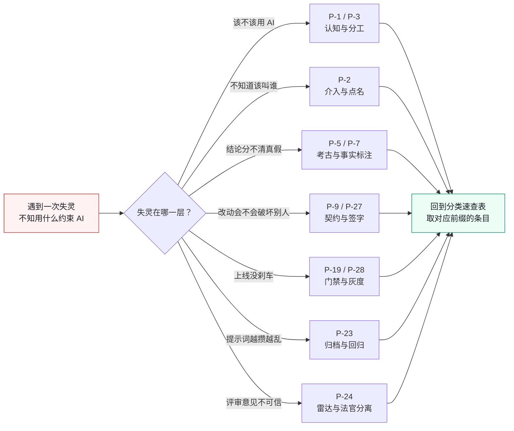
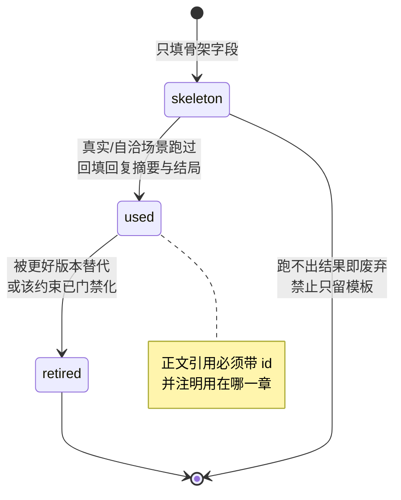

# 组织级 AI 提示词库骨架（50 条）

> **性质声明**：本骨架为"提示词工程的脚手架"。每条提示词的字段结构、场景、角色冲突、预期失灵点均为按全书四案例自洽构造；`prompt` 正文给出可直接填写的模板框架，标注 `<...>` 处为待真实使用时填充的变量。四案例（电商平台 / 加密交易所 / Web3 量化 / 安全初创）均可使用同一套提示词——区别仅在 `<业务域>` `<约束类型>` 等变量取值不同。
>
> **使用规则**（写正文时遵守）：
> 1. 正文引用提示词，必须带 `id`，并注明在哪一章哪一节用过、AI 真实回复摘要、最终结局。
> 2. 任何提示词进正文前，必须先用真实（或自洽虚构）场景跑过一次，把 `ai_response_summary` 和 `outcome` 填实——禁止只留模板。
> 3. 提示词按全书章节索引（`P-章-节-序号`）。角色冲突字段中，案例一用化名角色描述（风控负责人/多端TL等），案例二/三/四可用各自案例角色名。

## 分类速查

| 前缀 | 场景族 | 典型 must_intervene |
|---|---|---|
| P-1-* | 认知与边界清单 | 是否禁入某链路 |
| P-2-* | 介入与叫人 | 资金 / 权限 / 删除 |
| P-5/P-7-* | 考古与祖传代码 | 猜测 vs 事实标注 |
| P-9/P-27-* | 契约与破坏性变更 | Owner 签字 |
| P-19/P-28-* | 门禁与灰度 | 刹车阈值、回滚包 |
| P-23-* | 提示词归档与复用 | 版本与回归 |
| P-24-* | 评审与幻觉 | 雷达不可当法官 |



**图 A-1｜按失灵模式反查提示词** — 库不是按章号翻，是按「这次 AI 在哪失灵的」反查；组织接管从选对约束开始。

---

---

## 字段约定

```yaml
id:           P-<章>-<节>-<序号>
chapter:      <章节号>
scene:        <使用场景一句话>
objective:    <人想用 AI 达到什么>
prompt: |
  <可直接用的提示词正文，<变量> 处待填>
must_intervene:   <人在哪一步必须接手>
ai_failure_mode:  <这一类提示词 AI 典型失灵点>
role_conflict:    <涉及的角色冲突及妥协>
used_in:      <日期, 场景>      # 待真实/虚构案例填充
ai_response_summary: <AI 回复摘要>   # 待填充
outcome:      <最终结果>             # 待填充
status:       skeleton | used | retired
```



**图 A-2｜提示词条目生命周期** — `status` 三态里只有「跑过并回填」才算进库；未验证的模板是库的负债，不是资产。

---

## 第一部分 · 认知（P-1 / P-2 / P-3 / P-4）

### P-1-1-01 让 AI 自评"这段该不该用 AI"
```yaml
id: P-1-1-01
chapter: 1.1
scene: 治理组评估某业务域是否适合接入 AI 生成
objective: 让 AI 给出"该域 AI 介入的风险分级"
prompt: |
  我要评估 <业务域> 是否适合让 AI 生成代码。
  已知约束：<资金相关 Y/N>、<是否有契约仓库 Y/N>、<回滚成本 高/中/低>、<变更频率>。
  请按"高/中/低风险"给出分级，并分别说明：AI 可承担什么、不可承担什么、
  人必须在哪一步介入。不要给"视情况而定"这种万能句，每个结论挂一个具体风险点。
must_intervene: 风险分级结论必须由治理组人审
ai_failure_mode: 倾向一律回答"中风险"以回避判断
role_conflict: 一线工程师希望评低风险以加快交付，风控负责人希望资金相关域评高风险
status: skeleton
```

### P-2-1-01 AI 失灵场景自查
```yaml
id: P-2-1-01
chapter: 2.1
scene: 复盘一次 AI 相关事故，定位失灵类型
objective: 把事故归入"六种失灵"之一，并指出组织介入点
prompt: |
  这是最近一次事故的脱敏描述：<事故经过>。
  请判断它属于以下哪种 AI 失灵：①不自证完整 ②不跨上下文 ③不验证只推断
  ④不留痕 ⑤不懂组织约束 ⑥不承担后果。给出判断依据，并指出"当时谁本应介入、怎么介入"。
must_intervene: 失灵归类后，介入点写入介入点矩阵
ai_failure_mode: 把事故笼统归为"AI 不够智能"
status: skeleton
```

### P-2-4-01 生成跨角色介入点矩阵草稿
```yaml
id: P-2-4-01
chapter: 2.4
scene: 为某业务域初始化介入点矩阵
objective: AI 出矩阵草稿，人定责任人
prompt: |
  为 <业务域> 生成"跨角色介入点矩阵"草稿，覆盖：契约设计、代码生成、数据迁移、
  接口变更、上线灰度、事故应急六个节点。每个节点给出：AI 做、失灵风险、建议介入人、留痕物。
  介入人从以下角色选：<契约Owner/TL/风控/SRE/合规>。
must_intervene: 责任人（Accountable）必须人定，AI 仅为建议
ai_failure_mode: 把所有介入人都填"TL"，回避跨角色分工
status: skeleton
```

### P-3-1-01 人机分工表
```yaml
id: P-3-1-01
chapter: 3.1
scene: 输出某域的"AI 做 / 人做"分工
objective: 明确三类角色：AI 做可能、人做选择、人做负责
prompt: |
  针对 <业务域> 的日常开发流，列出每一步属于"AI 做可能 / 人做选择 / 人做负责"中的哪一类，
  并说明判断理由。重点标出"现在归 AI、但出过事应收回给人"的步骤。
must_intervene: "应收回给人"的清单须委员会签字
status: skeleton
```

### P-4-2-01 工程栈自检
```yaml
id: P-4-2-01
chapter: 4.2
scene: 评估某域契约/测试/可观测/文档四支柱完备度
objective: 给出四支柱打分与缺口
prompt: |
  对 <业务域> 按"契约先行 / 一切可验证 / 一切可回溯 / 文档即代码"四支柱打分（0-3），
  每个支柱给出：现状、缺口、建议补齐项、责任人建议。
must_intervene: 打分结果需域 TL 确认，避免乐观偏差
status: skeleton
```

---

## 第二部分 · 考古（P-5 / P-6 / P-7）

### P-5-3-01 生成模块图草稿
```yaml
id: P-5-3-01
chapter: 5.3
scene: 200+ 仓库规模下，先让 AI 出模块清单草稿
objective: AI 出按业务域分组的模块草稿，人校验
prompt: |
  以下是 <N> 个仓库的清单与一句话描述：<仓库清单>。
  请按业务域（<12 个域>）分组，输出模块图草稿（域 → 仓库 → 职责）。
  不要按仓库分组，要按业务域分组。对归属不确定的，单列"待定"并说明原因。
must_intervene: "待定"项必须人裁定，AI 不许擅自归并
ai_failure_mode: 把不确定的仓库硬塞进某个域以求"看起来整齐"
status: skeleton
```

### P-6-1-01 循环依赖检测
```yaml
id: P-6-1-01
chapter: 6.1
scene: 在依赖图里识别循环依赖
objective: AI 辅助识别，人判定是否真实循环
prompt: |
  这是服务间调用关系（脱敏）：<调用矩阵>。
  请找出所有循环依赖路径，按"环长度"排序，并对每个环标注：涉及的业务域、
  环上是否有资金/交易链路、建议的拆解方向（抽象公共层 / 反转依赖 / 合并）。
must_intervene: 拆解方向涉及架构决策，必须架构组人定
status: skeleton
```

### P-6-2-01 反向依赖分析
```yaml
id: P-6-2-01
chapter: 6.2
scene: 改动某个服务前，先看谁依赖它
objective: 列出反向依赖，评估变更影响面
prompt: |
  我要改动 <服务X> 的 <接口>。请列出所有反向依赖（谁调用了它），
  按"调用频次 × 是否在核心链路"排序，并标出哪些调用方在 5 端中各自属于哪一端。
must_intervene: 影响面判定须人确认，AI 常漏跨仓库调用
status: skeleton
```

### P-6-4-01 WIRED / NOT WIRED 识别
```yaml
id: P-6-4-01
chapter: 6.4
scene: 区分"真正在跑"与"只是部署了"的服务
objective: 标出 NOT WIRED 服务，作为下线候选
prompt: |
  基于以下流量与调用数据：<数据>，将 <N> 个服务分为 WIRED（有真实流量）/ NOT WIRED（无流量但有部署）。
  对 NOT WIRED 的，给出"是否敢下线"的建议及需要的验证证据。
must_intervene: 下线决策须服务 Owner 签字，AI 建议仅供参考
ai_failure_mode: 把低频但关键的服务误判为 NOT WIRED
status: skeleton
```

### P-7-2-01 祖传代码考古笔记
```yaml
id: P-7-2-01
chapter: 7.2
scene: 让 AI 给一段没人看得懂的代码写"考古笔记"
objective: 输出隐性知识显性化的笔记，供 ADR 补写
prompt: |
  这是一段祖传代码：<代码>。git blame 显示最后修改是 <日期>，作者已离职。
  请写一份"考古笔记"：这段代码看起来在解决什么问题、有哪些隐式约束（如顺序依赖、特殊值）、
  改它最可能踩的坑。不要假装确定，不确定的地方明确标"推测"。
must_intervene: "推测"项必须找人（前作者/相关域 TL）核实后才能入 ADR
ai_failure_mode: 把推测写成确定结论
status: skeleton
```

### P-7-3-01 ADR 补写
```yaml
id: P-7-3-01
chapter: 7.3
scene: 为历史决策补写 ADR
objective: AI 出 ADR 草稿，人补决策者与反对意见
prompt: |
  基于这段代码和考古笔记，补写一份 ADR：状态/背景/决策/备选/后果/反对意见。
  决策者和反对意见留空，标注"待 <角色> 补"。
must_intervene: 决策者与反对意见必须真人补，AI 不得杜撰人名
status: skeleton
```

---

## 第三部分 · 立界（P-8 / P-9 / P-10 / P-11）

### P-9-4-01 生成契约草稿（人审核）
```yaml
id: P-9-4-01
chapter: 9.4
scene: 用 AI 生成 OpenAPI / Protobuf 契约
objective: AI 出契约初版，人审错误码与兼容性
prompt: |
  为 <接口> 生成 OpenAPI 契约。要求：列出全部成功与错误响应码（含 <业务错误清单>），
  每个字段标注是否可空、是否破坏性变更。明确标出"我不确定但猜测"的字段。
must_intervene: 契约须契约 Owner 签字方可入仓库
ai_failure_mode: 漏列错误码、把破坏性字段标成兼容
role_conflict: 多端负责人要求破坏性变更须他签字
status: skeleton
```

### P-9-4-02 契约兼容性判定
```yaml
id: P-9-4-02
chapter: 9.4
scene: 判定一次变更是否破坏性
objective: 给出兼容/破坏性结论与影响端
prompt: |
  旧契约：<旧>。新契约：<新>。判定本次变更是兼容性还是破坏性，
  逐字段说明理由，并列出受影响的端（安卓/鸿蒙/iOS/Web/小程序）。拿不准的标"需人审"。
must_intervene: 破坏性结论须多端负责人复核
status: skeleton
```

### P-10-2-01 import-linter 规则生成
```yaml
id: P-10-2-01
chapter: 10.2
scene: 为分层架构生成 import 违规检测规则
objective: AI 出规则草稿，编译期拦截违规 import
prompt: |
  目标分层：<应用/服务/包>，依赖只允许单向（应用→服务→包）。
  请生成 import-linter 配置，覆盖上述规则。对历史已存在的违规，给出"白名单 or 强制修复"的建议。
must_intervene: 白名单须架构组签字，避免违规被永久豁免
status: skeleton
```

### P-11-3-01 扩展点建议
```yaml
id: P-11-3-01
chapter: 11.3
scene: 生成新模块前，先让人定"该留哪些缝"
objective: AI 给扩展点建议，人定取舍
prompt: |
  我要让 AI 生成一个 <模块>，它将接入 <现有边界>。基于未来可能的变更（<变更预测>），
  建议应预留哪些扩展点、哪些人工接管位（尤其风控钩子）。按"必要 / 推荐 / 可选"分级。
must_intervene: "必要"项须人确认；资金链路的风控钩子为强制
role_conflict: 一线工程师想最小化留缝，风控负责人要求资金链路强制留
status: skeleton
```

### P-11-4-01 服务接入检查
```yaml
id: P-11-4-01
chapter: 11.4
scene: AI 生成的新服务接入平台前的自检
objective: 校验是否自带契约/扩展点/灰度开关/回滚位
prompt: |
  这是 AI 生成的新服务：<描述>。对照《服务接入标准》逐项检查：
  契约 / 扩展点 / 风控钩子位（资金相关）/ 灰度开关 / 回滚位 / 留痕。缺哪项就明确说缺。
must_intervene: 缺项必须人补齐方可接入；AI 不得自动放行
status: skeleton
```

---

## 第四部分 · 重构（P-12 / P-13 / P-14 / P-15）

### P-12-2-01 数据/日志/事件分类
```yaml
id: P-12-2-01
chapter: 12.2
scene: 拆解混杂的 state.db
objective: 把库里的东西分成数据/日志/事件三类
prompt: |
  这是 <state.db> 的表清单与样例：<清单>。请把每张表归入"业务数据 / 操作日志 / 领域事件"，
  并给出迁移建议（保留 / 迁出到日志库 / 迁出到事件总线）。不确定的标"需人审"。
must_intervene: 分类须数据 Owner 确认，误分类会丢数据
status: skeleton
```

### P-13-1-01 大文件拆分方案
```yaml
id: P-13-1-01
chapter: 13.1
scene: 拆解单文件 8237 行的 app.py
objective: 给出 router/service/repository 拆分草案
prompt: |
  这是 <app.py> 的结构概览：<函数清单与行数>。请按 router/service/repository 三层给出拆分草案，
  标出跨层调用、循环调用、副作用函数。拆分顺序按"风险从低到高"排。
must_intervene: 拆分顺序与边界须架构组定，AI 建议为草稿
status: skeleton
```

### P-14-2-01 立包顺序
```yaml
id: P-14-2-01
chapter: 14.2
scene: 决定哪些模块先抽成独立包
objective: 按"稳定度 × 复用度"排序
prompt: |
  给出 <候选模块> 的稳定度（变更频率倒数）与被依赖数，按"先稳定后抽取"原则排出立包顺序。
  对每个包，标注：兼容层方案、双跑验证方式、回滚方式。
must_intervene: 回滚方式必须可行，否则不许立包
status: skeleton
```

### P-15-2-01 设计令牌提取
```yaml
id: P-15-2-01
chapter: 15.2
scene: 从现有 UI 提取设计令牌
objective: 抽出颜色/间距/字号令牌，统一五端
prompt: |
  这是五端各自的样式散值：<清单>。请提取设计令牌（color/spacing/radius/typography），
  标出五端不一致项，给出统一值建议与"统一后哪一端视觉变化最大"的风险提示。
must_intervene: 视觉变化大的端须设计审核
status: skeleton
```

---

## 第五部分 · 新功能（P-16 / P-17 / P-18）

### P-16-1-01 聊天域拆分 RFC 草稿
```yaml
id: P-16-1-01
chapter: 16.1
scene: 起草聊天域独立成域的 RFC
objective: AI 出 RFC 框架，各角色填意见
prompt: |
  起草 RFC-聊天域拆分：背景/方案/影响面/风控评估/合规评估/回滚方案。
  风控与合规评估段留空，标注"待风控负责人/合规负责人 填"。
must_intervene: 风控与合规评估必须真人填
status: skeleton
```

### P-17-2-01 BFF 边界设计
```yaml
id: P-17-2-01
chapter: 17.2
scene: 为每端设计 BFF，但不重复业务
objective: 输出每端 BFF 的职责边界
prompt: |
  为五端设计 BFF。要求：业务逻辑只在服务层，BFF 只做聚合/裁剪/协议适配。
  标出"哪些逻辑容易在 BFF 里重复实现"的陷阱。
must_intervene: BFF 不得承载业务规则，须多端 TL 把关
status: skeleton
```

### P-18-1-01 容量估算
```yaml
id: P-18-1-01
chapter: 18.1
scene: 把"亿级"翻译成具体 QPS 与资源
objective: 输出容量规划
prompt: |
  基于 DAU 1.2 亿、峰值 QPS 86 万，估算大促各层（CDN/网关/缓存/应用/DB）的容量需求，
  给出"削峰后每层实际承载"与"不削峰会怎样"的对比。
must_intervene: 资源采购须决策层批预算
status: skeleton
```

---

## 第六部分 · 上线（P-19 / P-20 / P-21 / P-22）

### P-19-2-01 五层门禁通过标准
```yaml
id: P-19-2-01
chapter: 19.2
scene: 为一次发布生成门禁检查单
objective: 列出五层门禁各自通过标准
prompt: |
  为 <发布> 生成五层门禁检查单：软件/数据/策略/交易/风控。
  每层给出：通过标准、负责人、不通过的处理（拦截 or 例外审批）。
must_intervene: 风控门禁不得走例外审批
status: skeleton
```

### P-20-1-01 风控接入检查
```yaml
id: P-20-1-01
chapter: 20.1
scene: 校验新功能是否接了事前/事中/事后风控
objective: 输出风控缺口
prompt: |
  这是 <功能> 的流程：<流程>。检查它是否覆盖：事前（限额/白名单/双人复核）、
  事中（熔断/限流/告警）、事后（对账/审计/回溯）。列出缺口与补救。
must_intervene: 资金相关缺口不补不让上；风控负责人签字
status: skeleton
```

### P-21-3-01 回滚脚本与演练
```yaml
id: P-21-3-01
chapter: 21.3
scene: 为一次变更生成回滚脚本与演练步骤
objective: 前进必带后退
prompt: |
  这是变更的前进脚本：<脚本>。请生成对应的回滚脚本，并列出回滚演练步骤
  （含验证回滚成功的指标）。若该变更不可回滚，明确说明原因与替代方案。
must_intervene: 不可回滚变更须委员会审批
status: skeleton
```

### P-22-5-01 AI 留痕补全
```yaml
id: P-22-5-01
chapter: 22.5
scene: 检查 PR 是否附 prompt 记录
objective: 输出留痕缺口
prompt: |
  这是本次发布的 PR 列表：<PR>。检查每个 PR 是否附：使用的 prompt（匿名聚合）、
  审批人、AI 生成占比。列出缺失项。注意：只记结果不记人。
must_intervene: 留痕缺失须补齐方可灰度（对应 F-0515）
status: skeleton
```

---

## 第七部分 · 治理（P-23 / P-24 / P-25 / P-26 / P-27 / P-28）

### P-23-2-01 组织级提示词归档
```yaml
id: P-23-2-01
chapter: 23.2
scene: 把一次性 prompt 沉淀成可复用的组织资产
objective: 规范化、版本化
prompt: |
  这是一次性使用的 prompt：<原始>。请把它改写成组织级可复用版本：抽象出变量、
  补充失败模式说明、标注典型失灵点、给出"何时不该用本提示词"的边界。
must_intervene: 入库须经治理组评审
status: skeleton
```

### P-24-2-01 幻觉识别
```yaml
id: P-24-2-01
chapter: 24.2
scene: 识别 AI 回复里的幻觉
objective: 给出三类幻觉标记
prompt: |
  这是 AI 的一段回复：<回复>。请标出其中可能的：①编造的 API/字段 ②过度自信的兼容性结论
  ③与上下文矛盾的陈述。对每处给出"如何验证"的方法。
must_intervene: 幻觉项必须人验证后才能采信
status: skeleton
```

### P-25-2-01 ADR 模板填充
```yaml
id: P-25-2-01
chapter: 25.2
scene: 为一次决策起草 ADR
objective: AI 出框架，人填决策者与反对意见
prompt: |
  为 <决策> 起草 ADR：状态/日期/决策者/背景/决策/备选/后果/反对意见/关联章节。
  决策者与反对意见留空待填。
must_intervene: 反对意见必须如实记录原文
status: skeleton
```

### P-26-3-01 治理 KPI 草案
```yaml
id: P-26-3-01
chapter: 26.3
scene: 起草团队级治理 KPI
objective: 输出效率/质量/治理三类指标
prompt: |
  起草治理 KPI，分效率/质量/治理三类，每类 2-3 个指标，给出目标值与数据来源。
  约束：所有指标必须团队级聚合，不得落到个人。
must_intervene: 个人级指标一律剔除；HRBP 把关
status: skeleton
```

### P-27-1-01 契约变更流程
```yaml
id: P-27-1-01
chapter: 27.1
scene: 把一次契约变更走完流程
objective: 判定分级并触发签字
prompt: |
  这是契约的新旧差异：<diff>。判定兼容/破坏性，若破坏性，生成"需多端 TL 签字"的审批请求，
  并列出受影响端与建议排期。
must_intervene: 破坏性须多端负责人签字（2 工作日时限）
status: skeleton
```

### P-28-2-01 灰度刹车阈值
```yaml
id: P-28-2-01
chapter: 28.2
scene: 为一次灰度定自动刹车阈值
objective: 区分硬刹车/软刹车
prompt: |
  为 <发布> 定刹车阈值：硬刹车（自动回滚）指标与阈值、软刹车（暂停观察）指标与阈值。
  资金相关指标须风控确认。
must_intervene: 阈值须风控签字；阈值不得由 AI 单方面定
status: skeleton
```

### P-28-4-01 回滚决策辅助
```yaml
id: P-28-4-01
chapter: 28.4
scene: 事故时辅助判断"该不该回滚"
objective: AI 给建议，人拍板
prompt: |
  当前异常：<指标>。基于回滚决策矩阵，建议是否回滚、由谁决策、回滚后需同步评估哪些端。
  注意：这是建议，最终决策由人做出。
must_intervene: 决策权按矩阵归属人；AI 仅为建议
status: skeleton
```

---

## 第八部分 · 四案例（P-案例一~四 / P-33）

### P-案例-01 四案例失灵复盘归因
```yaml
id: P-案例-01
chapter: 案例一~四
scene: 各案例复盘会，把标志失灵归因
objective: 输出"失灵—接手"对照
prompt: |
  把本案例的标志失灵事件（案例一 D/E/F、案例二 X/Y、案例三 Z/W、案例四 V/U）
  整理成"AI 失灵点 → 组织谁接手 → 接手方式 → 代价"的对照表。
must_intervene: 代价必须如实，不得美化
status: skeleton
```

### P-案例-02 治理前后数据对比
```yaml
id: P-案例-02
chapter: 案例一~四
scene: 生成治理前后对比表
objective: 输出可发布的对比数字
prompt: |
  基于 <数字清单>，生成本案例治理前后对比表，标注每个数字的数据来源与置信度。
  凡未度量的指标，标"未度量"，不得臆造基线。
must_intervene: 数字须与 ch05-数字清单.md 完全一致
status: skeleton
```

### P-33-01 四案例交叉对照
```yaml
id: P-33-01
chapter: 33
scene: 第33章四案例交叉启示
objective: 输出跨案例共性规律与差异谱系
prompt: |
  把四个案例（电商平台/加密交易所/Web3量化/安全初创）的治理三原则落地形式
  并置成对照表，提取共性结构与差异原因。输出"组织规模 vs 治理密度"的关系判断。
must_intervene: 交叉对照须四案例数字各自独立，禁止交叉引用
status: skeleton
```

---

## 补充：组织流程类提示词（P-Org）

### P-Org-01 会议纪要脱敏
```yaml
id: P-Org-01
scene: 把内部会议纪要脱敏成可入书的对话
prompt: |
  这是会议纪要：<原文>。脱敏成对话体：去掉真实人名（用化名）、去掉项目代号、
  保留冲突与妥协原文，不得改成"达成一致"。
must_intervene: 脱敏后须当事人确认未失真
status: skeleton
```

### P-Org-02 委员会议事记录
```yaml
id: P-Org-02
scene: 记录委员会决议
prompt: |
  把本次委员会讨论整理为：议题/各方立场/决议/反对意见原文/生效时间。
  反对意见必须保留原话。
must_intervene: 反对意见原文须经反对者确认
status: skeleton
```

### P-Org-03 边界清单逐域生成
```yaml
id: P-Org-03
scene: 为 12 个业务域逐域生成 AI 边界清单草稿
prompt: |
  为 <业务域> 起草 AI 使用边界：可碰/不可碰/需审批三类，资金相关默认不可碰。
must_intervene: 草稿须该域 TL + 风控会签
status: skeleton
```

### P-Org-04 留痕匿名化
```yaml
id: P-Org-04
scene: 把 prompt 记录做匿名聚合
prompt: |
  把以下 prompt 记录做匿名聚合：去掉用户标识，保留结构化字段（章节/场景/失败模式/结果）。
  不得保留可定位到个人的信息。
must_intervene: 匿名规则须 HRBP 确认不构成监控
status: skeleton
```

---

## 其余编号（骨架占位，待正文触发后展开）

> 以下提示词已预留编号与场景，正文用到时再展开 `prompt` 正文与失灵点。这保证全书"至少 50 条"的骨架完整，且每条都能追溯到一个具体章节。

| id | 章节 | 场景一句话 |
|----|------|-----------|
| P-1-4-01 | 1.4 | 识别一次技术决策里的支持者/反对者/妥协点 |
| P-2-2-01 | 2.2 | 六种失灵的场景化示例生成 |
| P-3-3-01 | 3.3 | 根据信任积累调整人机分工 |
| P-4-3-01 | 4.3 | 生成可验证性检查清单 |
| P-5-4-01 | 5.4 | 用 AI 加速考古但图必须人画——分工说明 |
| P-6-5-01 | 6.5 | 静态分析结果的人工判断辅助 |
| P-7-4-01 | 7.4 | 跨团队知识传递的笔记模板 |
| P-8-3-01 | 8.3 | 边界是测出来的——生成边界测试用例 |
| P-9-3-01 | 9.3 | 契约版本与兼容策略草案 |
| P-10-4-01 | 10.4 | 跨仓库边界测试方案 |
| P-12-3-01 | 12.3 | 双写/对账/切换迁移方案 |
| P-12-4-01 | 12.4 | 跨团队数据治理分工 |
| P-13-3-01 | 13.3 | nginx 限流/超时/灰度配置生成 |
| P-13-4-01 | 13.4 | 微服务拆分与网关治理方案 |
| P-14-4-01 | 14.4 | 跨团队包治理规范草稿 |
| P-15-3-01 | 15.3 | 五端统一设计系统的令牌映射 |
| P-16-2-01 | 16.2 | WebSocket 接入与降级方案 |
| P-16-4-01 | 16.4 | 敏感词/风控/审计接入检查 |
| P-17-3-01 | 17.3 | 一份 OpenAPI 五端用的契约共享校验 |
| P-17-4-01 | 17.4 | 老版本 App 的版本兼容策略 |
| P-18-3-01 | 18.3 | 缓存一致性方案与风险点 |
| P-18-4-01 | 18.4 | 多活方案与切换演练 |
| P-19-4-01 | 19.4 | 组织级门禁不可绕过的技术手段 |
| P-20-5-01 | 20.5 | 风控组织级接入流程 |
| P-21-1-01 | 21.1 | 对账体系设计 |
| P-22-2-01 | 22.2 | 公开仓库红线扫描 |
| P-22-4-01 | 22.4 | AI 生成代码的许可证风险检查 |
| P-23-4-01 | 23.4 | 一线觉得被监控时的沟通话术（非技术） |
| P-24-4-01 | 24.4 | 跨团队 AI 评审机制设计 |
| P-25-5-01 | 25.5 | 组织级文档治理规范草稿 |
| P-26-2-01 | 26.2 | 跨角色协作机制设计 |
| P-26-4-01 | 26.4 | 谁出人/出权/出预算的博弈梳理 |

> **填充纪律**：以上 32 条 + 前 18 条 = 50。任何一条进入正文前，必须把 `prompt`、`must_intervene`、`ai_failure_mode` 三项填实，并把 `status` 从 `skeleton` 改为 `used`。
