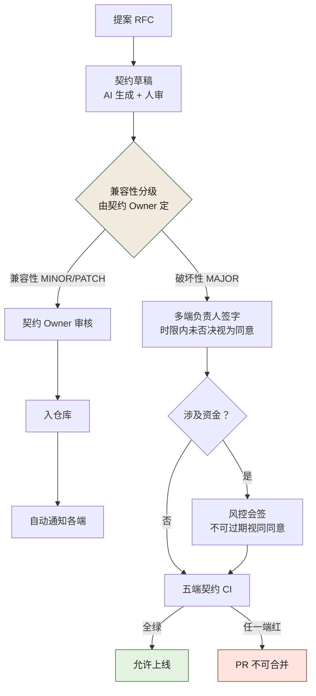
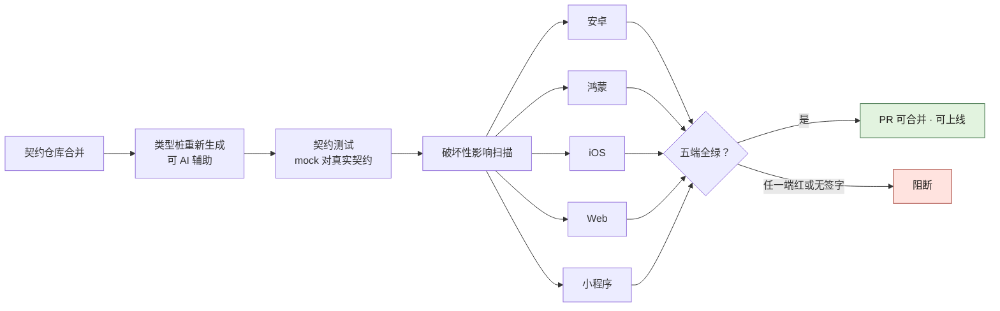

# 契约治理规范模板（附录 I）

> **用法**：本模板是第 9 章（契约先行）与第 27 章（跨团队契约治理）的落地物。组织可直接 fork 后填入自己的业务域、角色名、阈值，即可成文。本书四个案例均可使用本模板——区别仅在"契约"的具体形态（电商平台=接口契约、交易所=精度/合规不变量清单、量化基金=合约安全不变量、初创公司=智能体权限矩阵）。
>
> **填写纪律**：所有 `<...>` 为待填变量；凡标"必须人定"的字段，不得由 AI 自动填值。

---

## 0. 文档头

```markdown
# <平台名> 契约治理规范 v<X.Y>

- 状态：草案 / 已通过 / 已废止
- 生效日期：YYYY-MM-DD
- Owner：<契约治理责任人（多端 TL）>
- 会签：<风控> <合规> <架构组> <各业务域 TL>
- 关联 ADR：ADR-XXXX
- 关联章节：本书第 9、27 章
- 审议机构：<AI 治理委员会>
```

---

## 1. 目的与适用范围

### 1.1 目的
把契约确立为全平台唯一的事实来源，使"代码追契约"成为默认，消灭"改实现不改契约"导致的端上不一致与线上事故。

### 1.2 适用范围
- 适用：<全部 5 端（安卓/鸿蒙/iOS/Web/小程序）> × <全部 12 业务域> 的接口契约（HTTP / RPC）。
- 不适用（豁免）：<资金链路内部模块——按风控要求人工化>，豁免清单须委员会签字，逐项列名，不接受"一类"豁免。

---

## 2. 契约的事实来源

### 2.1 双源契约
- HTTP 接口：OpenAPI 3.x
- RPC 接口：Protobuf 3.x
- 两源必须保持一致，由契约同步工具校验，不一致即 CI 失败。

### 2.2 唯一事实来源
- 契约仓库（mono-repo of contracts）为唯一事实来源。
- 代码实现必须追契约；契约与代码冲突时，**以契约为准**，代码改，不是契约改。

### 2.3 仓库权限
- 契约仓库的写入权限仅授予：契约 Owner（多端 TL）+ 各域契约维护者。
- 写入需 PR + 审核；破坏性变更需额外签字（见第 5 节）。

---

## 3. 契约的三种类型

| 类型 | 内容 | 示例 | Owner |
|------|------|------|-------|
| 接口契约 | 请求/响应、错误码、字段语义 | OpenAPI / Protobuf | 契约 Owner（多端 TL） |
| 数据契约 | 表结构、字段含义、迁移规则 | DDL / schema 文件 | 数据 Owner（DBA） |
| 设计契约 | 设计令牌、组件 API、视觉规范 | design tokens | 设计系统 Owner |

> 三类契约共用同一套变更流程（第 5 节），但签字人不同——**签字人必须是离该类契约"端"最近的人**。

---

## 4. 契约的版本与兼容策略

### 4.1 版本号
- 语义化版本：`MAJOR.MINOR.PATCH`
- MAJOR：破坏性变更（删字段、改类型、改语义）
- MINOR：兼容性新增（加字段、加端点）
- PATCH：文档/说明修正，不影响行为

### 4.2 兼容性判定规则（必须人定阈值）
| 操作 | 判定 |
|------|------|
| 新增可选字段 | 兼容（MINOR） |
| 新增必填字段 | **破坏性（MAJOR）**——老调用方会失败 |
| 删除字段 | 破坏性（MAJOR） |
| 字段类型变更 | 破坏性（MAJOR） |
| 字段语义变更（类型不变但含义变） | **破坏性（MAJOR）**——最易漏判，须人审 |
| 新增错误码 | 兼容（MINOR） |
| 删除/重命名错误码 | 破坏性（MAJOR） |

### 4.3 老版本兼容窗口
- 移动端（App）：破坏性变更须保留 <N> 个版本的兼容窗口，配合强制升级策略。
- Web/小程序：兼容窗口 <M>，可短于 App。
- 具体数值必须人定，写在本节。

---

## 5. 变更流程

### 5.1 流程图
```
提案（RFC）→ 契约草稿（AI 生成 + 人审）→ 兼容性分级判定
  ├─ 兼容性变更（MINOR/PATCH）
  │     → 契约 Owner 审核 → 入仓库 → 自动通知各端
  └─ 破坏性变更（MAJOR）
        → 多端负责人签字【2 工作日时限，过期视为同意】
        → 风控会签（资金相关必签）
        → 入仓库 → 各端排期 → 五端契约 CI 跑通方可上线
```

上面文字版只画主干，图 I-1 把它展开成两个人工关口和一条不可豁免的分支：GRADE 菱形由契约 Owner 定级、SIGN 卡由多端负责人签字，这两格是全程仅有的机器不代劳处；RISK 菱形「涉及资金」分支上的风控会签，是全图唯一不适用「过期视为同意」的边，未签字或未全绿的路径统一收在红色 BLOCK 格。



**图 I-1｜契约变更分级流程** — 分级与签字权在人，CI 只负责把「没签字」变成机器可拒绝的事实。

### 5.2 各步责任人（必须人定，AI 不得代填）
| 步骤 | 责任人 | 备选（缺席时） |
|------|--------|----------------|
| 提案 | 变更发起人 | — |
| 契约草稿审核 | 契约 Owner | 副_owner |
| 兼容性分级 | 契约 Owner | 架构组复核 |
| 破坏性签字 | 多端负责人 | 委员会代表 |
| 风控会签 | 风控负责人 | 风控副手 |
| 五端 CI | 各端 TL | — |

### 5.3 时限否决机制
- 破坏性签字时限：<2 个工作日>，过期视为同意。
- 风控会签时限：<1 个工作日>，资金相关不得过期视同同意。
- 时限由治理委员会设定，委员会可调整。

---

## 6. 五端契约同步机制

### 6.1 触发
契约仓库任何合并，自动触发五端契约 CI：安卓 / 鸿蒙 / iOS / Web / 小程序。

### 6.2 CI 内容
- 类型桩重新生成（可 AI 辅助）
- 契约测试运行（mock 对真实契约）
- 破坏性影响扫描

### 6.3 拦截规则
- 任意一端契约测试失败 → PR 不可合并。
- 破坏性扫描命中且无签字 → PR 不可合并。

### 6.4 代价记录
端侧 CI 时长增加 <18>%；该代价计入数字清单，不藏。

图 I-2 把 §6.1–§6.4 串成一条线：三项检查按类型桩、契约测试、破坏性扫描的顺序串行，之后才扇出五个端并行跑；右侧 GATE 菱形没有「部分通过」这条边，「任一端红或无签字」都汇进同一个阻断格——§6.3 的两条拦截规则在流水线里就是这一格。



**图 I-2｜五端契约同步与拦截** — 契约的一致性不靠通知与自觉，靠五端 CI 的一次全绿判定。

---

## 7. AI 在契约治理中的位置

| 环节 | AI 做 | 人做 | 不可越界 |
|------|-------|------|---------|
| 契约草稿 | 生成初版 | 审核、补错误码 | AI 不得"批准"契约 |
| 兼容性判定 | 辅助识别破坏性点 | 最终分级由契约 Owner | 语义变更必须人审 |
| 端侧桩 | 生成类型桩 | 审核破坏性部分 | AI 不得跳过人审直接合 |
| 留痕 | 记录 prompt | 审批记录由人签 | 留痕不得记录到个人 |

---

## 8. 度量指标（团队级聚合）

| 指标 | 目标 | 数据来源 | 责任人 |
|------|------|---------|--------|
| 契约一致率（接口 vs 契约仓库） | ≥ 95% | 契约 CI | 契约 Owner |
| 破坏性变更平均签字时长 | ≤ 1.5 工作日 | 签字系统 | 委员会 |
| 端上白屏/崩溃中"契约不一致"占比 | 趋零 | 事故库 | SRE |
| 契约 PR 附 prompt 记录率 | ≥ 90% | PR 系统 | 治理组 |

> 个人级指标一律不设——遵循"治理不变成监控"红线。

---

## 9. 反模式（本规范明令禁止）

1. 把契约当代码的附属文档（散在各仓库 `docs/`）。
2. 五端各自维护 mock，无中心契约。
3. 所有变更不分级，破坏性混在兼容性里。
4. 破坏性签字权放在离端最远的人手里。
5. 契约 CI 只跑服务端不跑端侧。
6. 契约变更不通知各端，老版本 App 用老契约直接崩。
7. 语义变更（类型不变含义变）不经人审。

---

## 10. 例外与豁免

- 资金链路内部模块：豁免 AI 生成，人工契约；须委员会逐项签字。
- 紧急修复（hotfix）：可先改代码后补契约，但须在 <24 小时> 内补齐并补 ADR，否则记违规。

---

## 11. 违规处理

- 第一次：约谈责任人 + 补培训。
- 第二次：委员会通报 + 当域 AI 生成权限降级。
- 第三次：暂停当域 AI 生成权限 <N> 周。

---

## 12. 修订机制

- 本规范由治理委员会每 <季度> 复审一次。
- 修订需委员会过半同意，风控/合规对各自条款有否决权。
- 每次修订保留"反对意见"原文。

---

## 13. 落地时间线：从 fork 到第一次真签字

fork 只是复制了一份文档，**规范是在第一次有人被叫去签字那天才生效的**。按周排下来是这样：

| 周 | 动作 | 谁 | 会卡在哪 | 完成判据 |
|---|---|---|---|---|
| W1 | fork 本模板，逐节填空 | 治理组 | 十个人填出十种 Owner 写法（人名/组名/岗位名混用） | 每个 `<...>` 要么有值，要么显式写"本组织不适用" |
| W2 | 定 §1.2 适用范围与豁免清单 | 各域 TL + 合规 | 有人想按"一类系统"整批豁免 | 豁免逐条列名，一条一个签字日期 |
| W3 | 填 §4.2 判定表 + §4.3 兼容窗口 | 契约 Owner + 多端 TL | "语义变更"没人认得出 | 每条判定挂一个本组织的字段级例子 |
| W4 | 收敛 §2.3 写入权限 | 平台运维 | 图省事，把写入权限一次发给了整个组 | 写入名单 = Owner + 域维护者，其余一律走 PR |
| W5–W6 | 打通端侧契约 CI（先通一端） | 各端 TL | 端侧要占排期，"先只跑服务端"被说出口 | 至少一端真红过一次并留记录 |
| W7–W8 | 第一次破坏性变更走完整流程 | 多端负责人 + 风控 | 签字人说"口头同意就行" | 签字留痕 + 时限记录在案 |
| W9–W12 | 用 §8 度量回看并修订 | 委员会 | 一致率算出来没人看 | 第一次复审记录，含反对意见原文 |

**第六周之前必须出现第一次红**（这条线是经验阈值，用于起手）。一次都没红过的契约 CI 不是门禁，是装饰——它只证明还没有人造访过。

W5–W6 是最容易滑坡的一段。端侧 CI 要占端上的排期，"先只跑服务端"听起来像务实的中间态。它不是：**§9 反模式第 5 条正是从这个"临时方案"里长出来的。** 范围可以收窄（先一条接口、先一个域），端侧整段砍掉不行——砍掉的不是工作量，是破坏性变更唯一的暴露面。

---

## 14. 填空示例：关键页填完长什么样

空槽模板不配一份填好的样例，就会在各组织里长成十种样子。下面以案例一（电商平台）为原型给一份参考答案；未取自《数字清单》的值一律标"示意"。

```markdown
# <平台名> 契约治理规范 v1.0
- 状态：已通过
- 生效日期：2025-03-13（示意：契约治理专项立项当日）
- Owner：多端 TL <姓名>
- 会签：风控 <姓名>  合规 <姓名>  架构组 <姓名>  商品域 TL <姓名>  交易域 TL <姓名>
- 关联 ADR：ADR-0001（为什么选择契约先行）
- 关联章节：本书第 9、27 章
- 审议机构：AI 治理委员会（8 人）
```

- **§1.2 适用范围**：5 端 × 12 业务域的全部 HTTP/RPC 接口契约。豁免：支付域资金核心链路——2024-12-19 风控公开反对后逐项列名豁免、委员会签字，**不接受"支付类"这种按类豁免**。
- **§4.3 兼容窗口**：`<N>` = 3 个发布版本（示意值，必须与强制升级策略一起定，单独看没有意义）；`<M>` = 0，Web 与小程序跟随当次发版。
- **§5.3 时限**：破坏性签字 2 工作日、过期视为同意；风控会签 1 工作日、资金相关不适用"过期视同同意"。
- **§6.4 代价**：端侧契约 CI 时长 +18%（2025-02-20 多端契约同步上线后的记录）。
- **§8 度量**：契约一致率目标 ≥95%（该组织治理后实测 97.4%）；契约 PR 附 prompt 记录率 ≥90%（治理后 94%）。

填 §4.2 时应做到这个颗粒度：

| 变更 | 判定 | 为什么 | 签字人 |
|---|---|---|---|
| 订单详情新增可选字段 `refund_channel` | MINOR | 老客户端不读它也不报错 | 契约 Owner |
| 把 `orderStatus` 由 string 改 enum，同时新增必填 `refund_channel` | **MAJOR** | 新增必填字段会让老调用方直接失败；两条混在一个 diff 里，最易被当成"只是整理了一下"混过去 | 多端 TL + 风控会签（涉退款） |

**判定的颗粒度是"字段 × 端"，不是"接口级"。** 停在接口级，MAJOR 就永远藏在看起来无害的 diff 里——E-0311 那次的形状正是这样。

---

## 15. 逐条验收：这一节算不算填完了

规范填没填完，不看篇幅，看每一行能不能查。**验收只有一条通用判据：随机抽一行，能不能在十分钟内叫出一个具名的人**（这条线是拍的，用于起手）。

| 条款 | 填完的判据（可查） | 谁来判 | 没填完的现场表现 |
|---|---|---|---|
| §0 文档头 | 每行有值；Owner 是人名不是组名 | 委员会秘书 | "Owner：架构组"——出事那天没有人名可叫 |
| §1.2 | 豁免逐条列名并带签字日期 | 合规 | "支付类系统整体豁免" |
| §2.3 | 写入名单能对上账号，含离职清理 | 平台运维 | 名单里还留着已离职的人 |
| §4.2 | 每条判定有一个本组织的字段级例子 | 契约 Owner | 整表照抄本书示例，一个自己的例子都没有 |
| §4.3 | 有具体数值且能对到发版策略文件 | 多端 TL | 写"视情况而定" |
| §5.2 | 每一步一个具名责任人 + 一个具名备选 | 委员会 | 备选栏全空，Owner 一出差就停摆 |
| §5.3 | 时限由审批系统强制执行（到期自动提醒或放行） | 治理组 | 时限只活在文档里，没人被系统催过 |
| §6 | 至少一端 CI 真红过一次并留下记录 | 各端 TL | CI 建好了，从没红过 |
| §8 | 四个指标各有取数处（看板链接或查询语句） | 委员会 | 有目标值，没有数据来源 |
| §10 | hotfix 的 24 小时补契约有人盯 | 治理组 | 补契约全靠当事人自觉 |
| §11 | 三档处理的第一档写明约谈人 | HRBP | 有处罚条款，从没执行过一次 |
| §12 | 复审日历落到某个具体日子并有人订 | 委员会秘书 | "每季度"没进任何人的日历 |

> **一致率的反证**：契约一致率突然变得很难失败时，先查分母——**没登记进契约仓库的接口永远不会「不一致」**。这条指标必须与"未登记接口数"同屏看，否则它奖励的是不登记。这是本模板 §8 第一行的唯一可信读法。

---

## 附：契约变更 RFC 模板（供 5.1 提案用）

```markdown
# 契约变更 RFC-<编号>

- 发起人：
- 涉及契约：<接口/表/令牌>
- 分级（草案）：兼容性 / 破坏性
- 背景：
- 变更内容（diff 摘要）：
- 逐字段判定（一行一个字段，格式见 §4.2 / §14；结论只写到接口级的退回）：
- 受影响端：安卓 / 鸿蒙 / iOS / Web / 小程序
- 受影响业务域：
- 端侧 CI 计划（哪一端先跑、何时打通）：
- 兼容窗口策略（若破坏性）：
- 回滚方案（含线上老版本 App 继续拿哪份契约）：
- 风控意见（资金相关必填）：
- 合规意见：
- 多端负责人签字（破坏性必填）：________ 日期：
- 反对意见原文：
```

---

> **模板的一句话**：契约治理规范的可复制性，不在条款多漂亮，在于每个"必须人定"的字段都真的有人填了、每个签字人都离"端"足够近。**一份没有具体签字人姓名的契约规范，等于没有契约规范。**
