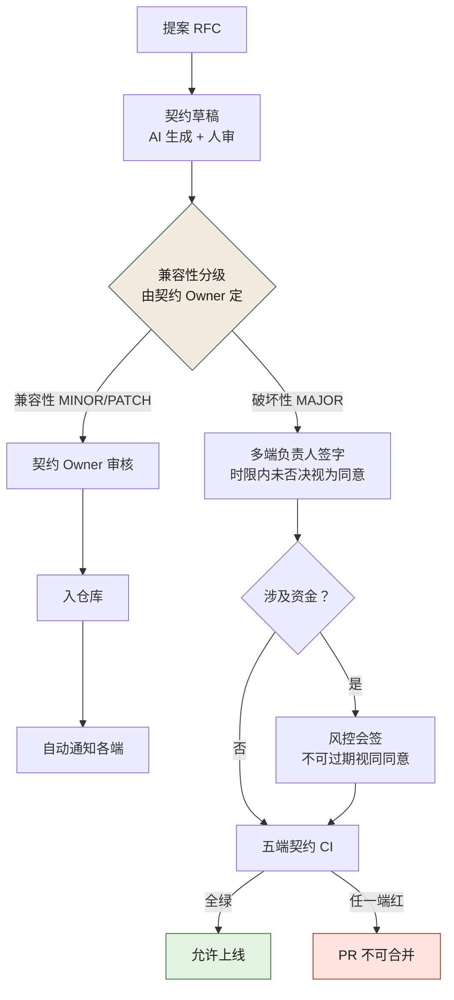
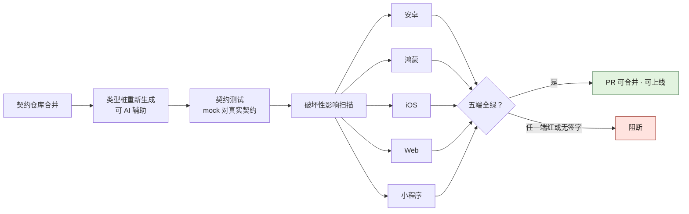
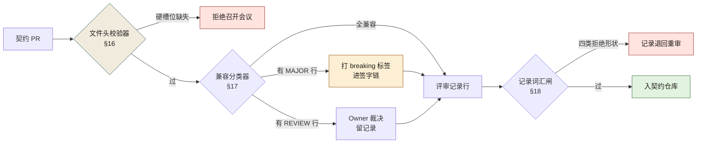
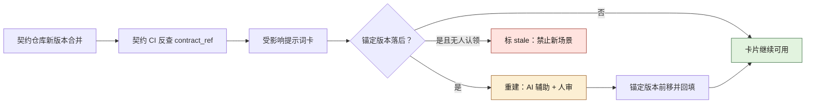

# 契约治理规范模板（附录 I）

> **用法**：本模板是第 9 章（契约先行）与第 27 章（跨团队契约治理）的落地物。组织可直接 fork 后填入自己的业务域、角色名、阈值，即可成文。本书四个案例均可使用本模板——区别仅在"契约"的具体形态（电商平台=接口契约、交易所=精度/合规不变量清单、量化基金=合约安全不变量、初创公司=智能体权限矩阵）。
>
> **填写纪律**：所有 `<...>` 为待填变量；凡标"必须人定"的字段，不得由 AI 自动填值。

---

## 0. 文档头

```markdown
# <平台名> 契约治理规范 v<X.Y>

- 状态：草案 / 已通过 / 已废止
- 生效日期：YYYY-MM-DD
- Owner：<契约治理责任人（多端 TL）>
- 会签：<风控> <合规> <架构组> <各业务域 TL>
- 关联 ADR：ADR-XXXX
- 关联章节：本书第 9、27 章
- 审议机构：<AI 治理委员会>
```

---

## 1. 目的与适用范围

### 1.1 目的
把契约确立为全平台唯一的事实来源，使"代码追契约"成为默认，消灭"改实现不改契约"导致的端上不一致与线上事故。

### 1.2 适用范围
- 适用：<全部 5 端（安卓/鸿蒙/iOS/Web/小程序）> × <全部 12 业务域> 的接口契约（HTTP / RPC）。
- 不适用（豁免）：<资金链路内部模块——按风控要求人工化>，豁免清单须委员会签字，逐项列名，不接受"一类"豁免。

---

## 2. 契约的事实来源

### 2.1 双源契约
- HTTP 接口：OpenAPI 3.x
- RPC 接口：Protobuf 3.x
- 两源必须保持一致，由契约同步工具校验，不一致即 CI 失败。

### 2.2 唯一事实来源
- 契约仓库（mono-repo of contracts）为唯一事实来源。
- 代码实现必须追契约；契约与代码冲突时，**以契约为准**，代码改，不是契约改。

### 2.3 仓库权限
- 契约仓库的写入权限仅授予：契约 Owner（多端 TL）+ 各域契约维护者。
- 写入需 PR + 审核；破坏性变更需额外签字（见第 5 节）。

---

## 3. 契约的三种类型

| 类型 | 内容 | 示例 | Owner |
|------|------|------|-------|
| 接口契约 | 请求/响应、错误码、字段语义 | OpenAPI / Protobuf | 契约 Owner（多端 TL） |
| 数据契约 | 表结构、字段含义、迁移规则 | DDL / schema 文件 | 数据 Owner（DBA） |
| 设计契约 | 设计令牌、组件 API、视觉规范 | design tokens | 设计系统 Owner |

> 三类契约共用同一套变更流程（第 5 节），但签字人不同——**签字人必须是离该类契约"端"最近的人**。

---

## 4. 契约的版本与兼容策略

### 4.1 版本号
- 语义化版本：`MAJOR.MINOR.PATCH`
- MAJOR：破坏性变更（删字段、改类型、改语义）
- MINOR：兼容性新增（加字段、加端点）
- PATCH：文档/说明修正，不影响行为

### 4.2 兼容性判定规则（必须人定阈值）
| 操作 | 判定 |
|------|------|
| 新增可选字段 | 兼容（MINOR） |
| 新增必填字段 | **破坏性（MAJOR）**——老调用方会失败 |
| 删除字段 | 破坏性（MAJOR） |
| 字段类型变更 | 破坏性（MAJOR） |
| 字段语义变更（类型不变但含义变） | **破坏性（MAJOR）**——最易漏判，须人审 |
| 新增错误码 | 兼容（MINOR） |
| 删除/重命名错误码 | 破坏性（MAJOR） |

### 4.3 老版本兼容窗口
- 移动端（App）：破坏性变更须保留 <N> 个版本的兼容窗口，配合强制升级策略。
- Web/小程序：兼容窗口 <M>，可短于 App。
- 具体数值必须人定，写在本节。

---

## 5. 变更流程

### 5.1 流程图
```
提案（RFC）→ 契约草稿（AI 生成 + 人审）→ 兼容性分级判定
  ├─ 兼容性变更（MINOR/PATCH）
  │     → 契约 Owner 审核 → 入仓库 → 自动通知各端
  └─ 破坏性变更（MAJOR）
        → 多端负责人签字【2 工作日时限，过期视为同意】
        → 风控会签（资金相关必签）
        → 入仓库 → 各端排期 → 五端契约 CI 跑通方可上线
```

上面文字版只画主干，图 I-1 把它展开成两个人工关口和一条不可豁免的分支：GRADE 菱形由契约 Owner 定级、SIGN 卡由多端负责人签字，这两格是全程仅有的机器不代劳处；RISK 菱形「涉及资金」分支上的风控会签，是全图唯一不适用「过期视为同意」的边，未签字或未全绿的路径统一收在红色 BLOCK 格。



**图 I-1｜契约变更分级流程** — 分级与签字权在人，CI 只负责把「没签字」变成机器可拒绝的事实。

### 5.2 各步责任人（必须人定，AI 不得代填）
| 步骤 | 责任人 | 备选（缺席时） |
|------|--------|----------------|
| 提案 | 变更发起人 | — |
| 契约草稿审核 | 契约 Owner | 副_owner |
| 兼容性分级 | 契约 Owner | 架构组复核 |
| 破坏性签字 | 多端负责人 | 委员会代表 |
| 风控会签 | 风控负责人 | 风控副手 |
| 五端 CI | 各端 TL | — |

### 5.3 时限否决机制
- 破坏性签字时限：<2 个工作日>，过期视为同意。
- 风控会签时限：<1 个工作日>，资金相关不得过期视同同意。
- 时限由治理委员会设定，委员会可调整。

---

## 6. 五端契约同步机制

### 6.1 触发
契约仓库任何合并，自动触发五端契约 CI：安卓 / 鸿蒙 / iOS / Web / 小程序。

### 6.2 CI 内容
- 类型桩重新生成（可 AI 辅助）
- 契约测试运行（mock 对真实契约）
- 破坏性影响扫描

### 6.3 拦截规则
- 任意一端契约测试失败 → PR 不可合并。
- 破坏性扫描命中且无签字 → PR 不可合并。

### 6.4 代价记录
端侧 CI 时长增加 <18>%；该代价计入数字清单，不藏。

图 I-2 把 §6.1–§6.4 串成一条线：三项检查按类型桩、契约测试、破坏性扫描的顺序串行，之后才扇出五个端并行跑；右侧 GATE 菱形没有「部分通过」这条边，「任一端红或无签字」都汇进同一个阻断格——§6.3 的两条拦截规则在流水线里就是这一格。



**图 I-2｜五端契约同步与拦截** — 契约的一致性不靠通知与自觉，靠五端 CI 的一次全绿判定。

---

## 7. AI 在契约治理中的位置

| 环节 | AI 做 | 人做 | 不可越界 |
|------|-------|------|---------|
| 契约草稿 | 生成初版 | 审核、补错误码 | AI 不得"批准"契约 |
| 兼容性判定 | 辅助识别破坏性点 | 最终分级由契约 Owner | 语义变更必须人审 |
| 端侧桩 | 生成类型桩 | 审核破坏性部分 | AI 不得跳过人审直接合 |
| 留痕 | 记录 prompt | 审批记录由人签 | 留痕不得记录到个人 |

---

## 8. 度量指标（团队级聚合）

| 指标 | 目标 | 数据来源 | 责任人 |
|------|------|---------|--------|
| 契约一致率（接口 vs 契约仓库） | ≥ 95% | 契约 CI | 契约 Owner |
| 破坏性变更平均签字时长 | ≤ 1.5 工作日 | 签字系统 | 委员会 |
| 端上白屏/崩溃中"契约不一致"占比 | 趋零 | 事故库 | SRE |
| 契约 PR 附 prompt 记录率 | ≥ 90% | PR 系统 | 治理组 |

> 个人级指标一律不设——遵循"治理不变成监控"红线。

---

## 9. 反模式（本规范明令禁止）

1. 把契约当代码的附属文档（散在各仓库 `docs/`）。
2. 五端各自维护 mock，无中心契约。
3. 所有变更不分级，破坏性混在兼容性里。
4. 破坏性签字权放在离端最远的人手里。
5. 契约 CI 只跑服务端不跑端侧。
6. 契约变更不通知各端，老版本 App 用老契约直接崩。
7. 语义变更（类型不变含义变）不经人审。

---

## 10. 例外与豁免

- 资金链路内部模块：豁免 AI 生成，人工契约；须委员会逐项签字。
- 紧急修复（hotfix）：可先改代码后补契约，但须在 <24 小时> 内补齐并补 ADR，否则记违规。

---

## 11. 违规处理

- 第一次：约谈责任人 + 补培训。
- 第二次：委员会通报 + 当域 AI 生成权限降级。
- 第三次：暂停当域 AI 生成权限 <N> 周。

---

## 12. 修订机制

- 本规范由治理委员会每 <季度> 复审一次。
- 修订需委员会过半同意，风控/合规对各自条款有否决权。
- 每次修订保留"反对意见"原文。

---

## 13. 落地时间线：从 fork 到第一次真签字

fork 只是复制了一份文档，**规范是在第一次有人被叫去签字那天才生效的**。按周排下来是这样：

| 周 | 动作 | 谁 | 会卡在哪 | 完成判据 |
|---|---|---|---|---|
| W1 | fork 本模板，逐节填空 | 治理组 | 十个人填出十种 Owner 写法（人名/组名/岗位名混用） | 每个 `<...>` 要么有值，要么显式写"本组织不适用" |
| W2 | 定 §1.2 适用范围与豁免清单 | 各域 TL + 合规 | 有人想按"一类系统"整批豁免 | 豁免逐条列名，一条一个签字日期 |
| W3 | 填 §4.2 判定表 + §4.3 兼容窗口 | 契约 Owner + 多端 TL | "语义变更"没人认得出 | 每条判定挂一个本组织的字段级例子 |
| W4 | 收敛 §2.3 写入权限 | 平台运维 | 图省事，把写入权限一次发给了整个组 | 写入名单 = Owner + 域维护者，其余一律走 PR |
| W5–W6 | 打通端侧契约 CI（先通一端） | 各端 TL | 端侧要占排期，"先只跑服务端"被说出口 | 至少一端真红过一次并留记录 |
| W7–W8 | 第一次破坏性变更走完整流程 | 多端负责人 + 风控 | 签字人说"口头同意就行" | 签字留痕 + 时限记录在案 |
| W9–W12 | 用 §8 度量回看并修订 | 委员会 | 一致率算出来没人看 | 第一次复审记录，含反对意见原文 |

**第六周之前必须出现第一次红**（这条线是经验阈值，用于起手）。一次都没红过的契约 CI 不是门禁，是装饰——它只证明还没有人造访过。

W5–W6 是最容易滑坡的一段。端侧 CI 要占端上的排期，"先只跑服务端"听起来像务实的中间态。它不是：**§9 反模式第 5 条正是从这个"临时方案"里长出来的。** 范围可以收窄（先一条接口、先一个域），端侧整段砍掉不行——砍掉的不是工作量，是破坏性变更唯一的暴露面。

---

## 14. 填空示例：关键页填完长什么样

空槽模板不配一份填好的样例，就会在各组织里长成十种样子。下面以案例一（电商平台）为原型给一份参考答案；未取自《数字清单》的值一律标"示意"。

```markdown
# <平台名> 契约治理规范 v1.0
- 状态：已通过
- 生效日期：2025-03-13（示意：契约治理专项立项当日）
- Owner：多端 TL <姓名>
- 会签：风控 <姓名>  合规 <姓名>  架构组 <姓名>  商品域 TL <姓名>  交易域 TL <姓名>
- 关联 ADR：ADR-0001（为什么选择契约先行）
- 关联章节：本书第 9、27 章
- 审议机构：AI 治理委员会（8 人）
```

- **§1.2 适用范围**：5 端 × 12 业务域的全部 HTTP/RPC 接口契约。豁免：支付域资金核心链路——2024-12-19 风控公开反对后逐项列名豁免、委员会签字，**不接受"支付类"这种按类豁免**。
- **§4.3 兼容窗口**：`<N>` = 3 个发布版本（示意值，必须与强制升级策略一起定，单独看没有意义）；`<M>` = 0，Web 与小程序跟随当次发版。
- **§5.3 时限**：破坏性签字 2 工作日、过期视为同意；风控会签 1 工作日、资金相关不适用"过期视同同意"。
- **§6.4 代价**：端侧契约 CI 时长 +18%（2025-02-20 多端契约同步上线后的记录）。
- **§8 度量**：契约一致率目标 ≥95%（该组织治理后实测 97.4%）；契约 PR 附 prompt 记录率 ≥90%（治理后 94%）。

填 §4.2 时应做到这个颗粒度：

| 变更 | 判定 | 为什么 | 签字人 |
|---|---|---|---|
| 订单详情新增可选字段 `refund_channel` | MINOR | 老客户端不读它也不报错 | 契约 Owner |
| 把 `orderStatus` 由 string 改 enum，同时新增必填 `refund_channel` | **MAJOR** | 新增必填字段会让老调用方直接失败；两条混在一个 diff 里，最易被当成"只是整理了一下"混过去 | 多端 TL + 风控会签（涉退款） |

**判定的颗粒度是"字段 × 端"，不是"接口级"。** 停在接口级，MAJOR 就永远藏在看起来无害的 diff 里——E-0311 那次的形状正是这样。

---

## 15. 逐条验收：这一节算不算填完了

规范填没填完，不看篇幅，看每一行能不能查。**验收只有一条通用判据：随机抽一行，能不能在十分钟内叫出一个具名的人**（这条线是拍的，用于起手）。

| 条款 | 填完的判据（可查） | 谁来判 | 没填完的现场表现 |
|---|---|---|---|
| §0 文档头 | 每行有值；Owner 是人名不是组名 | 委员会秘书 | "Owner：架构组"——出事那天没有人名可叫 |
| §1.2 | 豁免逐条列名并带签字日期 | 合规 | "支付类系统整体豁免" |
| §2.3 | 写入名单能对上账号，含离职清理 | 平台运维 | 名单里还留着已离职的人 |
| §4.2 | 每条判定有一个本组织的字段级例子 | 契约 Owner | 整表照抄本书示例，一个自己的例子都没有 |
| §4.3 | 有具体数值且能对到发版策略文件 | 多端 TL | 写"视情况而定" |
| §5.2 | 每一步一个具名责任人 + 一个具名备选 | 委员会 | 备选栏全空，Owner 一出差就停摆 |
| §5.3 | 时限由审批系统强制执行（到期自动提醒或放行） | 治理组 | 时限只活在文档里，没人被系统催过 |
| §6 | 至少一端 CI 真红过一次并留下记录 | 各端 TL | CI 建好了，从没红过 |
| §8 | 四个指标各有取数处（看板链接或查询语句） | 委员会 | 有目标值，没有数据来源 |
| §10 | hotfix 的 24 小时补契约有人盯 | 治理组 | 补契约全靠当事人自觉 |
| §11 | 三档处理的第一档写明约谈人 | HRBP | 有处罚条款，从没执行过一次 |
| §12 | 复审日历落到某个具体日子并有人订 | 委员会秘书 | "每季度"没进任何人的日历 |

> **一致率的反证**：契约一致率突然变得很难失败时，先查分母——**没登记进契约仓库的接口永远不会「不一致」**。这条指标必须与"未登记接口数"同屏看，否则它奖励的是不登记。这是本模板 §8 第一行的唯一可信读法。

---

## 16. 契约文件头：字段级空槽与会拒绝执行的校验器

前面各节讲的是"契约该是什么"，这一节讲"评审会得先凑齐什么才开得起来"。契约文件头是机器和人共读的第一屏，每个槽位的值不是装饰——**它是后面某道机器判定的输入**，空了，那道判定就退回人嘴。

### 16.1 文件头字段表：必填可空、空了断什么

| 文件头字段 | 必填 / 可空 | 空了会断什么 | 校验器动作 |
|---|---|---|---|
| `owner` | 必填，人名 + 可解析账号（§0 的 Owner 口径从文档头下移到契约文件） | 出事那天没有人名可叫，契约落进孤儿队列（第 9 章 §9.4 冲突三） | 空或填团队名 = 拒绝召开评审 |
| `version` | 必填，语义版本 | §17 分类器没有基线，消费方锁不住 | 缺 = 拒绝 |
| `consumers` | 必填，非空名册，逐消费方自己认领（第 27 章 §27.5d 名册纪律） | 破坏性通知没有投递对象，弃用名册到那天只能靠编 | 空名册 = 拒绝 |
| `risk` | 必填，封闭取值 `normal` / `fund` | §5.1 的风控会签分支就挂在这一格；缺了，资金相关变更直通快车道 | 缺 = 拒绝 |
| `prompt_ref` | 可空，有则必须指向真实存在的提示词条目 | §8 第四行的留痕率出不了机器可查的数 | 只挂黄灯不阻断——留痕字段要靠爬坡普及，**第一天就硬阻断只会逼出全员填假值** |

硬软分界只有一条判据：四个硬字段硬，不是因为重要，而是**缺了它，后续任何机器判定都不成立**；prompt_ref 软，不是因为它不要紧，而是它的作用是事后追溯，不是当场裁决。填表时组织要给每一行配一个自己的字段级反例，形如"少了 `risk` 的那份契约差点炸在哪"，验收纪律同 §15。

### 16.2 字段内的属性：每一格各撑着哪道机检

文件头管"会不会开会"，字段内属性管"开了会判不判得动"。这张表给第 9 章 §9.5b 的"标三个属性"与 §9.5c 的字段形状补上"空了会怎样"那一列：

| 字段属性 | 不填时断掉哪道机检 | 判定住处在 |
|---|---|---|
| `required` | 可选性收紧无法机检；§17 分类器对这个字段只能给 REVIEW | 第 9 章 §9.5h 检查② |
| `nullable` | "可以为 null"与"可以缺席"分不开；新字段不敢给默认 | 第 9 章 §9.5b 第 2 步 |
| `enum` 值域 | 收窄与加值都判不动——最易漏的"静默删值"从这一格逃掉 | §17 分类器 |
| 错误码表 | 消费方出错分支随缘，契约测试拿不到失败用例 | 第 9 章 §9.5b 第 4 步 |
| `x-added-in` | 端上排查答不出"这字段哪版来的"，§4.3 兼容窗口的账全额烧成人肉 | 第 9 章 §9.5c 契约片段 |

### 16.3 校验器真会拒绝执行：它不是来提醒的

下面的脚本把 §16.1 的表变成代码：四份契约文件头，两份缺硬槽位，一份留痕为空。**读数本机实跑、逐字粘回**（纯标准库；人名、账号、域一律占位符）：

```python
#!/usr/bin/env python3
# -*- coding: utf-8 -*-
"""契约文件头字段校验器（附录 I §16）：硬槽位缺一即拒绝召开契约评审。"""
import sys

# (字段, 级别, 空了会怎样（同时是拒绝行的 reason）, 合法判据)
SPEC = [
    ("owner", "hard", "Owner 为空或填的是团队名：出事那天没有人名可叫",
     lambda v: "@" in v),
    ("version", "hard", "版本为空：兼容判定没有基线，消费方锁不住",
     lambda v: v.startswith("v") and "." in v),
    ("consumers", "hard", "消费方名册为空：破坏性通知没有投递对象",
     lambda v: v != "-"),
    ("risk", "hard", "risk 缺失：涉资金变更会绕过风控会签分支",
     lambda v: v in ("normal", "fund")),
    ("prompt_ref", "soft", "留痕为空：生成过程不可复核，只挂黄灯不阻断",
     lambda v: v.startswith("P-")),
]
# 四份契约文件头（教学样例；人名、账号、域一律占位符）
FILES = [
    ("contracts/trade/order-refund.v2.yaml",
     {"owner": "交易域 张三 <zs@placeholder.example>", "version": "v2.2",
      "consumers": "安卓,鸿蒙,iOS,Web,小程序,BFF", "risk": "fund",
      "prompt_ref": "P-9-4-01"}),
    ("contracts/product/detail.v3.yaml",
     {"owner": "多端 TL", "version": "v3.0", "consumers": "安卓,iOS,Web",
      "risk": "normal", "prompt_ref": "P-9-4-01"}),
    ("contracts/kyc/verify.v1.yaml",
     {"owner": "风控组 李四 <ls@placeholder.example>", "version": "v1.4",
      "consumers": "-", "risk": "fund", "prompt_ref": "P-2-4-01"}),
    ("contracts/search/query.v4.yaml",
     {"owner": "搜索域 王五 <ww@placeholder.example>", "version": "v4.1",
      "consumers": "Web,小程序", "risk": "normal", "prompt_ref": ""}),
]

rejected = 0
for path, hdr in FILES:
    hit_hard = False
    for key, level, why, ok in SPEC:
        v = str(hdr.get(key, "")).strip()
        if ok(v):
            continue
        # 拒绝行形状：标签开场，后接「哪个文件、哪个字段、空了会怎样」
        print(f"HEADER-{'REJECT' if level == 'hard' else 'WARN'} {path} field={key} reason={why}")
        hit_hard = hit_hard or level == "hard"
    if not hit_hard:
        print(f"HEADER-OK {path}")
    else:
        rejected += 1

print(f"GATE 硬槽位不过 {rejected} 份：契约评审拒绝召开，改完再排会")
sys.exit(1 if rejected else 0)
```

```text
$ python3 /tmp/ch40_header_gate.py ; echo "EXIT=$?"
HEADER-OK contracts/trade/order-refund.v2.yaml
HEADER-REJECT contracts/product/detail.v3.yaml field=owner reason=Owner 为空或填的是团队名：出事那天没有人名可叫
HEADER-REJECT contracts/kyc/verify.v1.yaml field=consumers reason=消费方名册为空：破坏性通知没有投递对象
HEADER-WARN contracts/search/query.v4.yaml field=prompt_ref reason=留痕为空：生成过程不可复核，只挂黄灯不阻断
HEADER-OK contracts/search/query.v4.yaml
GATE 硬槽位不过 2 份：契约评审拒绝召开，改完再排会
EXIT=1
```

读数三处讲究。其一，拒绝行的形状沿用《90 天总路线图》§0.5c 的通则：标签开场，后接"哪个文件、哪个字段、空了会怎样"，一行之内够指认现场。其二，search/query 挂了 WARN 之后照样 HEADER-OK——**黄灯行不进拒绝集**，这就是 prompt_ref 软硬的机器化。其三，末行 GATE 数的是拒绝数而不是通过数：硬槽位只要有一处不过，这一批契约就不排评审会，CI 挂的就是这条可 grep 的行。

---

## 17. 兼容性分类器：输入两份契约，输出破坏类别与动作

§4.2 写了"什么算破坏"，§5.1 的 GRADE 节点写了"契约 Owner 定级"。中间缺一半台阶：**Owner 开口之前，机器应先把 diff 拆成"一行一个操作、一行一个方向、一行一个动作"的清单。** 拆不出来，定级就是对着整个 diff 的印象——E-0311 那回"看起来只是整理了一下"的形状就是这一格长出来的。与第 27 章 §27.5b 的四模式判定器分工说清：那边回答"这条变更在哪个模式下活得下去"，本分类器回答**这个 PR 的每一行各属哪类破坏、叫谁、过哪个窗口**——后者才是评审会的输入与签字的分级依据。

### 17.1 判定总表：破坏方向与允许窗口

方向口径沿用 §27.5b：backward 护存量（新读者读旧数据），forward 护掉队者（旧读者读新数据）。"允许窗口"一列**改的是流程，不是 §4.3 的数值**——数值仍归必须人定栏。

| 操作 | 分级 | 破坏方向 | 允许窗口（判定到能干） | 签字位 |
|---|---|---|---|---|
| 新增可选字段（可空或带默认） | MINOR | 无，双向都活 | 即时，兼容快车道 | 契约 Owner |
| 新增必填字段且无默认 | **MAJOR** | backward：老构造器与老数据都给不出 | 等 §4.3 窗口走完且强制升级收口，或由多端 BFF 先吸收内部消化（第 17 章 §17.4） | 多端 TL，涉资金加风控会签 |
| 删除字段 | **MAJOR** | forward：老读者等一个不再来的值 | 弃用流程（名册全绿 + 到期日已过，第 27 章 §27.5d）走完才许删 | 多端 TL + 逐消费方认领 |
| 字段类型变更 | **MAJOR** | 双向皆破 | 没有"原地改"的窗口：只有新字段 + 双跑 + 旧字段弃用三步（口径同第 9 章 §9.5c 第 5 条） | 上委员会 |
| 枚举删值（收窄） | **MAJOR** | backward：存量里躺着被删的值 | 同"删除字段"，按弃用流程走 | 多端 TL |
| 枚举加值 | 条件 MINOR | forward：全枚举、无兜底的消费者会迷 | 消费方兜底改造自证后才放；窗口颗粒沿用"双跑一个发版周期" | 契约 Owner + 逐端自证 |
| 可选转必填（收紧） | **MAJOR** | backward | 无静默窗口——等价于新增必填，只有新字段一条路 | 多端 TL |
| 必填转可选（放宽） | MINOR | 无 | 即时 | 契约 Owner |
| 默认值改值（有无不变） | REVIEW | 机检盲区，语义事故 | 机器只负责让它现形；Owner 裁决并留记录，散会前必须有结论 | 契约 Owner 裁决 |
| 默认值改有无 | **MAJOR** | forward：老数据到新读者当场变非法 | 同"新增必填且无默认" | 多端 TL |

### 17.2 分类器真跑：一个 PR 混进五类操作

基线取 §14 的退款契约，候选 PR 里混着加可选、加必填、枚举收窄、必填收紧、默认值改五类操作。**读数本机实跑、逐字粘回**（纯标准库）：

```python
#!/usr/bin/env python3
# -*- coding: utf-8 -*-
"""契约兼容性分类器（附录 I §17）：吃基线与候选两份字段表，逐行输出破坏类别与动作。
方向口径沿用第 27 章 27.5b：backward=新读者读旧数据，forward=旧读者读新数据。"""
import sys

NO_DEFAULT = object()   # 区分「默认值是 null」与「根本没有默认值」

# 字段 = (是否必填, 默认值, 类型, 枚举值域或 None)。样例为教学数据。
BASE = {
    "refund_amount": (True, NO_DEFAULT, "string", None),
    "currency":      (True, NO_DEFAULT, "string", frozenset({"CNY"})),
    "status":        (True, NO_DEFAULT, "string",
                      frozenset({"SUCCEEDED", "PROCESSING", "REJECTED"})),
    "risk_note":     (False, None, "string", None),
    "min_remaining": (False, "0.00", "string", None),
    "invoice_tag":   (False, "-", "string", None),
}
CAND = {   # 一个 PR 混着五类操作：加可选、加必填、枚举收窄、必填收紧、默认值改
    "refund_amount": (True, NO_DEFAULT, "string", None),
    "currency":      (True, NO_DEFAULT, "string", frozenset({"CNY"})),
    "status":        (True, NO_DEFAULT, "string",
                      frozenset({"SUCCEEDED", "PROCESSING"})),
    "risk_note":     (True, None, "string", None),
    "min_remaining": (False, "1.00", "string", None),
    "split_seq":     (True, NO_DEFAULT, "int", None),
    "channel":       (False, None, "string", frozenset({"APP", "WEB", "MINI"})),
}


def classify(base, cand):
    lines = []
    for f in sorted(set(base) | set(cand)):
        b, c = base.get(f), cand.get(f)
        if b is None:
            req, d = c[0], c[1]
            if req and d is NO_DEFAULT:
                lines.append(("MAJOR", f, "新增必填且无默认", "backward",
                              "老调用方构造不出合法报文——签字位=多端TL，涉资金加风控"))
            else:
                lines.append(("MINOR", f, "新增可选或带默认", "none",
                              "老读者无视即可——进兼容快车道"))
        elif c is None:
            req, d = b[0], b[1]
            if req and d is NO_DEFAULT:
                lines.append(("MAJOR", f, "删除必填且无默认", "forward",
                              "存量读者等一个不再来的赋值——只能按弃用流程删"))
            else:
                lines.append(("MINOR", f, "删除带默认值的字段", "conditional",
                              "名册全绿加到期日之后才允许（第 27 章 27.5d）"))
        else:
            b_req, b_d, b_t, b_e = b
            c_req, c_d, c_t, c_e = c
            if b_t != c_t:
                lines.append(("MAJOR", f, "类型变更", "both",
                              "新字段+双跑+旧字段走弃用，没有直接改的窗口"))
                continue
            if b_e is not None and c_e is not None and b_e != c_e:
                if b_e - c_e:
                    lines.append(("MAJOR", f, "枚举收窄", "backward",
                                  "存量数据里仍有被删掉的值——按删字段处理"))
                if c_e - b_e:
                    lines.append(("MINOR", f, "枚举新增值", "conditional",
                                  "未知值走兜底分支的读者兼容；全枚举端先核名册"))
                continue
            if c_req and not b_req:
                lines.append(("MAJOR", f, "可选转必填", "backward",
                              "老数据与老构造器都给不出——按新增必填处理"))
            if b_req and not c_req:
                lines.append(("MINOR", f, "必填转可选", "none",
                              "放宽方向，双向都活，进快车道"))
            if (b_d is NO_DEFAULT) != (c_d is NO_DEFAULT):
                lines.append(("MAJOR", f, "默认值有无翻转", "forward",
                              "老数据到新读者当场变非法——按新增必填处理"))
            elif b_d is not NO_DEFAULT and c_d is not NO_DEFAULT and b_d != c_d:
                lines.append(("REVIEW", f, "默认值变更（值变、有无不变）", "machine-blind",
                              "机检看不见、语义看得见——路由契约 Owner 裁决并留记录"))
    return lines


major = 0
for level, f, op, dirn, act in classify(BASE, CAND):
    if level == "MAJOR":
        major += 1
    print(f"{level:<7} | {f:<14} | {op:<11} | 方向={dirn:<14} | {act}")

print(f"GRADE=MAJOR 破坏行 {major} 条：整个 PR 打 breaking 标签进签字链（图 I-1）；REVIEW 行散会前必须有 Owner 裁决记录")
sys.exit(1 if major else 0)
```

```text
$ python3 /tmp/ch40_compat_classify.py ; echo "EXIT=$?"
MINOR   | channel        | 新增可选或带默认    | 方向=none           | 老读者无视即可——进兼容快车道
MINOR   | invoice_tag    | 删除带默认值的字段   | 方向=conditional    | 名册全绿加到期日之后才允许（第 27 章 27.5d）
REVIEW  | min_remaining  | 默认值变更（值变、有无不变） | 方向=machine-blind  | 机检看不见、语义看得见——路由契约 Owner 裁决并留记录
MAJOR   | risk_note      | 可选转必填       | 方向=backward       | 老数据与老构造器都给不出——按新增必填处理
MAJOR   | split_seq      | 新增必填且无默认    | 方向=backward       | 老调用方构造不出合法报文——签字位=多端TL，涉资金加风控
MAJOR   | status         | 枚举收窄        | 方向=backward       | 存量数据里仍有被删掉的值——按删字段处理
GRADE=MAJOR 破坏行 3 条：整个 PR 打 breaking 标签进签字链（图 I-1）；REVIEW 行散会前必须有 Owner 裁决记录
EXIT=1
```

读数三处要念。其一，按字段名排序把 MINOR 行顶在最前——**破坏混在无害行里是 diff 的问题，不是工具的问题**；清单的本职就是逼混装包逐行自首，split_seq 行与 status 行各自单独成立，叠进同一个 PR 就是当年 E-0311 那两条的现行形状。其二，min_remaining 的 REVIEW 行方向写着 machine-blind——这不是第四种方向，**是分类器自认看不见**，动作列点名了路由给谁。其三，GRADE 行：只要有一行 MAJOR，整个 PR 分级抬升，其余行不能各自走快车道——判定颗粒是字段 × 操作，定级颗粒是 PR。**允许把一个 PR 拆成两个，不允许拆成两个各自看起来像纯 MINOR。**

---

## 18. 契约评审记录：一行一次评审、封闭词表、退出判据

附里的 RFC 模板记的是"这次变更要提什么"；评审记录回答另一个问题：**哪一行被谁判成了什么、什么时候算关闭。** 没有行级记录，§5.3 的时限没有主体——到期作废的到底是哪件事；§8 第二行的"平均签字时长"也没有分子。

### 18.1 记录形状：一行一桩，只增不改

```yaml
# 契约仓库 reviews/log.yaml —— 只追加；PR diff 只接受新行出现
- contract: contracts/trade/order-refund.v2.yaml
  change: "新增可选字段 channel"
  decision: COMPAT-MINOR       # 封闭词表，见 §18.2
  fields_reviewed: 3           # 0 = 结论停在接口级，词汇闸直接拒绝
  proposer: zs@placeholder.example
  reviewer: ww@placeholder.example
  signer: ""                   # MAJOR-* 与 NEEDS-REVIEW 必填具名
  raised_at: YYYY-MM-DDThh:mm  # 机器时间戳，§5.3 的时限才有主体
```

两条格式纪律：记录文件只追加，任何改写与删除历史行在 PR diff 里直接可见；raised_at 不收手填日期——**要拿去算账的时间戳，只能由机器生成。**

### 18.2 封闭词表：词义与关闭判据

| decision | 含义 | 谁给得这个值 | 这一行的退出判据 |
|---|---|---|---|
| `COMPAT-MINOR` / `COMPAT-PATCH` | 分类器逐行判兼容 | 评审人 | §6.2 契约测试全绿即关闭，无需人签 |
| `MAJOR-PENDING-SIGN` | 判破坏、签字在途 | 契约 Owner（定级不等于签字，Owner 不能替自己的提议签） | 签字集齐且五端 CI 全绿；到期未否决按 §5.3 视为同意——**资金相关不走这条出口** |
| `MAJOR-REJECTED` | 判破坏且不许发生 | 多端 TL 或风控 | 关闭必须附反对理由原文（与 §12 保留反对意见同一条纪律） |
| `NEEDS-REVIEW` | 机检定不了语义（默认值改值一类），分类器自动产出 | 分类器（Owner 不能预设它） | Owner 把它转成上面三词之一；"挂起"不算关闭状态，催办时限沿用 §5.3 口径 |

词表配一句话：**闸不认这五个词的同义词。**"基本兼容""问题不大"不是判定行，是判定这个动作的伪装——机器判过的结果，只有可被机器再引用才有意义。

### 18.3 评审记录会被怎么糊弄：四种形状与一道词汇闸

四种常见糊弄，各配一条能被机器兜住的反向检查。下面的脚本把四种形状全部写成代码——五条样例记录，四行被拒：

1. **自审**：提议与评审同账号，Owner 秒审自己契约的记录版（第 9 章 §9.5d 第三信号）。反向检查：两账号相等即拒绝。
2. **词表演化**：decision 填口语，一年后查不出"今年发生过几次破坏"。反向检查：不在 §18.2 五词之内即拒绝。
3. **接口级结论**：fields_reviewed 为 0。§14 那句"结论停在接口级的退回"，这是它的机检版。
4. **事后补记**：契约都合完了才补记录。反向检查：逐行比对记录时间与合并时间（《90 天总路线图》§0.5c 第 7 周口径），**记录晚于合并即作废，不进 §8 的分子**。

删旧行是第五种，闸下手最重——diff 长这样：

```diff
# reviews/log.yaml 的 PR diff 里，这一形本身就是红灯：
-  contract: contracts/kyc/verify.v1.yaml
-  decision: MAJOR-REJECTED
```

删一条 MAJOR-REJECTED 的代价不是"少了一条记录"，是"有人不必再解释他反对过什么"。**拒绝记录是资产，删它等于毁现场。**

```python
#!/usr/bin/env python3
# -*- coding: utf-8 -*-
"""评审记录词汇闸（附录 I §18）：一行一次评审，四类造假形状当场拒绝。"""
import sys

VOCAB = ("COMPAT-MINOR", "COMPAT-PATCH", "MAJOR-PENDING-SIGN",
         "MAJOR-REJECTED", "NEEDS-REVIEW")

# (行号, 契约@锚定版本, 变更, decision, 逐字段核对数, 提议账号, 评审账号, 签字位)
RECORDS = [
    (1, "order-refund@v2.2", "新增可选字段 channel", "看起来没问题",
     3, "zs@placeholder.example", "ww@placeholder.example", ""),
    (2, "order-refund@v2.2", "新增必填 split_seq", "MAJOR-PENDING-SIGN",
     5, "ww@placeholder.example", "ls@placeholder.example", ""),
    (3, "product-detail@v3.0", "status 枚举收窄", "COMPAT-MINOR",
     0, "zs@placeholder.example", "ls@placeholder.example", ""),
    (4, "kyc-verify@v1.4", "risk_note 可选转必填", "COMPAT-MINOR",
     2, "zs@placeholder.example", "zs@placeholder.example", ""),
    (5, "order-refund@v2.2", "min_remaining 默认值变更", "NEEDS-REVIEW",
     1, "ww@placeholder.example", "ls@placeholder.example",
     "多端TL ls@placeholder.example"),
]


def gate(decision, nfields, proposer, reviewer, signer):
    if decision not in VOCAB:
        return f"decision 值「{decision}」不在封闭词表里"
    if nfields == 0:
        return "逐字段核对数 = 0，结论停在接口级，退回重审"
    if proposer == reviewer:
        return "提议与评审同一账号，自审无效（CI 按账号相等拒绝）"
    if decision.startswith(("MAJOR", "NEEDS")) and not signer:
        return f"{decision} 必须有具名签字位"
    return ""


rejects = 0
for no, contract, change, decision, nfields, proposer, reviewer, signer in RECORDS:
    why = gate(decision, nfields, proposer, reviewer, signer)
    if why:
        print(f"LOG-REJECT line={no} contract={contract} decision={decision} reason={why}")
        rejects += 1
    else:
        print(f"LOG-OK line={no} contract={contract} decision={decision} signer={signer}")

print(f"REVIEW-GATE 拒绝 {rejects} 行 / 共 {len(RECORDS)} 行：拒绝行不数进「已完成评审」")
sys.exit(1 if rejects else 0)
```

```text
$ python3 /tmp/ch40_reviewlog_gate.py ; echo "EXIT=$?"
LOG-REJECT line=1 contract=order-refund@v2.2 decision=看起来没问题 reason=decision 值「看起来没问题」不在封闭词表里
LOG-REJECT line=2 contract=order-refund@v2.2 decision=MAJOR-PENDING-SIGN reason=MAJOR-PENDING-SIGN 必须有具名签字位
LOG-REJECT line=3 contract=product-detail@v3.0 decision=COMPAT-MINOR reason=逐字段核对数 = 0，结论停在接口级，退回重审
LOG-REJECT line=4 contract=kyc-verify@v1.4 decision=COMPAT-MINOR reason=提议与评审同一账号，自审无效（CI 按账号相等拒绝）
LOG-OK line=5 contract=order-refund@v2.2 decision=NEEDS-REVIEW signer=多端TL ls@placeholder.example
REVIEW-GATE 拒绝 4 行 / 共 5 行：拒绝行不数进「已完成评审」
EXIT=1
```

四行被拒有一个共同点：**糊弄记录不需要任何聪明——四种形状全是最日常的做法，建闸之后你才会看见仓库里原本躺着多少。** 幸存的 LOG-OK 那行就是 NEEDS-REVIEW 的正确姿势：核对数、评审人、具名签字位三样齐。

图 I-3 把 §16、§17、§18 三道闸串成一条线：文件头闸拒"会"，分类器拒"级"，词汇闸拒"记录"；三种红各说各的，人只出现在裁决与签字两类节点上。



**图 I-3｜评审会前的三道机器闸** — 每道闸各出一条自己的拒绝行；人只站在 Owner 裁决与签字两类出口上，其余位置机器直接拒。

---

## 19. 同一份契约，各端的落点

§6 定的是"在哪儿拦"，本节定的是**每个消费方把这份契约落成什么东西、它最怕哪个方向的破坏**。一行只装三件事：落点工件、最脆方向、归哪个专章管——填表时组织给每行补一个 CI 任务名。

| 消费方 | 落点工件 | 最脆的破坏方向 | 专章去处（指向，不复述） |
|---|---|---|---|
| 服务端实现 | 契约测试：mock 对真实实现（§6.2） | 实现跑在契约前面——B-0527 与 E-0311 走的都是这条路 | 第 9 章 §9.5b 七步 |
| 安卓 / 鸿蒙 / iOS | 契约仓生成的类型桩 + 请求侧契约测试，禁手抄字段 | forward：老版本 App 长期在架，存量读者读不到新响应 | 第 17 章 §17.4（老版本 App 怎么办） |
| Web / 小程序 | 同上，兼容窗口可极短（§4.3 的 `<M>`） | 缓存与中间层吃掉新版本：部署完了，名册却说"还在读" | 第 17 章 §17.6 |
| 多端 BFF | 逐端裁剪与聚合层；被它吸收的破坏**必须回填进 BFF 层自己的契约** | 吸收层变成隐瞒层——破坏在 BFF 消化掉，契约仓永远不知道 | 第 17 章 §17.6 契约共享实现方式 |
| 设计令牌（视觉端） | 令牌文件与逐端映射，不走 OpenAPI 那条流水线 | 令牌漂移不白屏，只让同一个按钮在不同端长得不一样——拦法完全不同 | 第 15 章 §15.6、§15.7f |
| 数据契约消费方（DBA / 对账 / BI） | 迁移脚本 + 独立对账第一层（字段完整性） | D-0114 的形状：迁移漏字段，接口 CI 根本管不到它 | 第 21 章 |
| 智能体与内部工具 | 工具 schema 固化进权限矩阵：智能体不需要"去读契约"，它读不到契约以外 | U-0918 的形状：智能体自行推断"需要更高权限"；V-0905 的形状：两个智能体无同源各自行动 | 第 3 章、附录 J §J.4 |

两条使用规则。其一，§6.1 的"五端"只占这张表前三行——**每一行新增都是端契约 CI 的合法扩编**，模板不替组织冻结端的清单。其二，每行都该红过一次（§13 那条"第六周之前必须出现第一次红"的经验线同样适用于本表每一行）；从没红过的行，先回答"这个端真的在跑这条测试吗"。

---

## 20. 契约与提示词的挂钩：提示词卡要带版本锚

GLOSSARY 对提示词腐化（prompt rot）的定义是"提示词与真实契约脱节之后，输出持续劣化且无人察觉"。**治它的第一步不是多看一眼，是把契约依赖写成可机检的样子。** 附录 A 的字段约定里还没有这个槽位，本节补一个字段、三条规则、一条新度判据。

### 20.1 对接规则：三条

1. **卡片带 `contract_ref`，颗粒到"路径@版本#operationId"。** 三段缺一不可：缺版本，新度无从检查；缺 operationId，引用面膨胀成整份文件，刷新通知沦为噪声。
2. **刷新责任在契约侧，不在提示词侧。** 契约仓库合并新版本时，契约 CI 反查所有 `contract_ref` 指向该路径的卡片，生成受影响清单（图 I-4）。让提示词 Owner"记得看契约变更日志"，是 §27 反模式第 3 条的又一个变体。
3. **定级不外包给 AI。** 第 9 章 §9.3 把"把破坏性字段标成兼容"列为 AI 起草契约的头号失灵；§17 分类器上线后，P-9-4-02 的提示词输入换成它的逐行读数——**AI 做影响面整理与表述，分级由机器出、裁决与签字归人**。卡片的 must_intervene 用 §18.2 的词表写，"哪张卡挂着哪条未关闭行"才 grep 得出来。

对照附录 A 的 P-9-4-02 骨架，挂上契约片段之后长这样（新字段只有 `contract_ref`，指令段同步改口径）：

```yaml
id: P-9-4-02
chapter: 9.4
contract_ref: contracts/trade/order-refund.v2.yaml@v2.2#POST /orders/{id}/refund
scene: 分类器已出逐行读数，让 AI 做影响面整理
objective: 拿 §17 分类器的判定行，整理受影响消费方与签字缺口
prompt: |
  下面是兼容性分类器对本次变更的逐行判定（一行一操作一方向）：
  <分类器读数原样粘贴>
  请只做三件事：① 按端列出受影响消费方；② 指出签字位缺谁的具名；
  ③ 标出你认为"分类行与契约文本对不上"的条目，标"需人审"。
  分级已由机器判定，不要重新输出兼容或破坏的结论。
must_intervene: MAJOR-PENDING-SIGN 与 NEEDS-REVIEW 行由人裁决并签字
ai_failure_mode: 把 MAJOR 行软化成"风险较低"的表述
status: skeleton
```

### 20.2 新度判据：谁会被自动标 stale

机检一条：**卡片锚定版本低于契约仓库里该路径的最新版、且跨过一个发版周期没重建，就标 stale、禁止新场景使用**（周期颗粒沿用第 9 章 §9.5c"双跑一个发版周期"那条口径，不是新数）。复活动作 = 锚定版本前移 + 重建（AI 辅助 + 人审，与 §6.2 端侧桩刷新同形）。判据挂在契约侧 CI 上而不是提示词库里——**漂移源的闸，放在事实源旁边才可靠**。案例四 V-0905 在智能体侧留过同型教训：修法不是叮嘱每个智能体"去看最新契约"，是把它的工具 schema 写成版本化引用——不动，不执行。

图 I-4 画出这张卡跟着契约走的联动：



**图 I-4｜契约推进与提示词刷新** — 新版本合并后由契约侧反查引用面生成受影响卡片清单；不前移锚定的卡自动进"禁止新场景"，没有人需要记得去看变更日志。

---

## 21. §8 四项度量：取数口径、刷坏形状与反向检查

§15 的验收表判的是"每个指标有没有取数处"，本节往前半步：每行给一条当场能执行的取数口径、一种刷坏姿势、一个必须同屏的反向检查。§15 那条"一致率的反证"是本表第一行的总证伪，这里只补它的具体查询口径。

| 指标（§8 行） | 取数口径（当场查什么） | 这一条会被怎么刷坏 | 反向检查（同屏或动作） |
|---|---|---|---|
| 契约一致率 | 从 §6.2 契约 CI 的运行记录取通过率；分母限定为同一个 job 打印的"已纳管端点数" | 收缩纳管清单——§15 的反证落到操作层就是这一种；job 降级成警告但报表照旧绿 | 与已纳管端点绝对数同屏，每周看 scope 文件的 **diff 而不是现值**——现值藏得住缩水 |
| 破坏性变更平均签字时长 | 合并时间戳减 `MAJOR-PENDING-SIGN` 行首次出现的时间戳（§18 的记录文件就是数据源）；中位与长尾分开报 | 起点偷成"发出催办的时刻"，等待清零；只报均值藏长尾 | 逐行核签字时间戳早于合并时间戳（《90 天总路线图》§0.5c 第 7 周口径）；长尾才是多端负责人的真实痛感 |
| 端上白屏崩溃中契约不一致占比 | 事故库打契约相关标签，分母固定为全部事故，绝对数并报 | 归因裁量：复盘时标成"代码缺陷"就离开分母 | 季度由非治理组角色盲归因一遍当季事故，**两套标签的差值就是这条指标的误差带**——是指标的错，不是人的错 |
| 契约 PR 附 prompt 记录率 | `prompt_ref` 非空且指向的卡片打得开、能追溯到生成任务（§16 的软槽位 + 点开动作） | 全员填同一张卡或同一个群链接，格式合法、内容假 | 周抽样真点开追到生成任务才算留痕；黄灯行数与"点开成功率"同屏报 |

两条使用规则随 §8 一起进模板：四项指标一律团队级聚合，不设个人条目——这与 §8 末行"治理不变成监控"的红线同源；任一指标连续两周没因为它改过一次决定（放量、拒绝、加闸、排人），要么补一道闸让它咬得住，要么承认是壁纸、从 §8 挪走。

---

## 附：契约变更 RFC 模板（供 5.1 提案用）

```markdown
# 契约变更 RFC-<编号>

- 发起人：
- 涉及契约：<接口/表/令牌>
- 分级（草案）：兼容性 / 破坏性
- 背景：
- 变更内容（diff 摘要）：
- 逐字段判定（一行一个字段，格式见 §4.2 / §14；结论只写到接口级的退回）：
- 受影响端：安卓 / 鸿蒙 / iOS / Web / 小程序
- 受影响业务域：
- 端侧 CI 计划（哪一端先跑、何时打通）：
- 兼容窗口策略（若破坏性）：
- 回滚方案（含线上老版本 App 继续拿哪份契约）：
- 风控意见（资金相关必填）：
- 合规意见：
- 多端负责人签字（破坏性必填）：________ 日期：
- 反对意见原文：
```

---

> **模板的一句话**：契约治理规范的可复制性，不在条款多漂亮，在于每个"必须人定"的字段都真的有人填了、每个签字人都离"端"足够近。**一份没有具体签字人姓名的契约规范，等于没有契约规范。**
