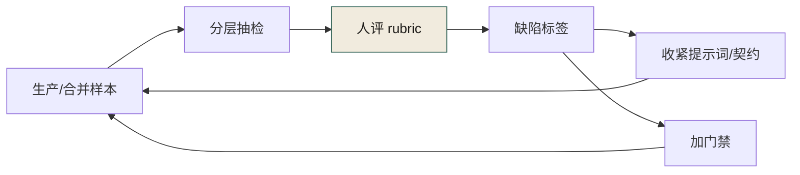
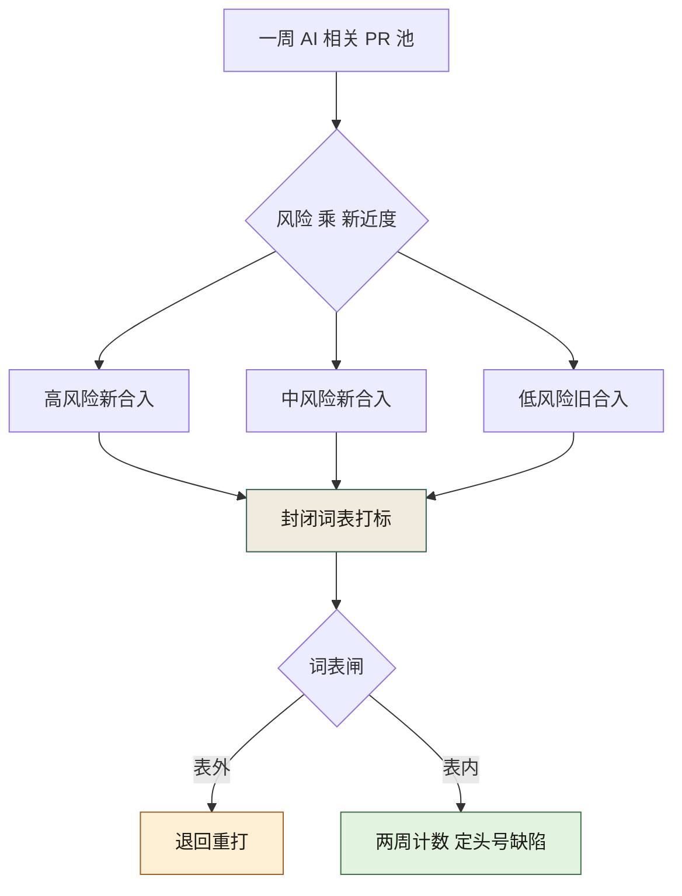
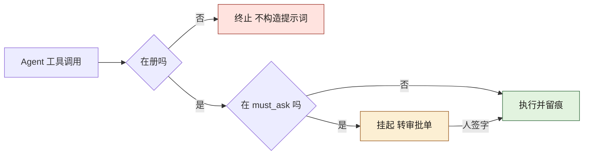
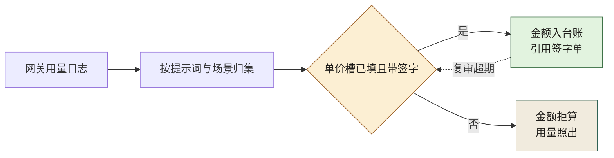

# 附录 J · AI 系统工程最小面（Eval / 上下文 / 权限 / 成本）

> **性质声明**：本书主线是组织治理。本附录补上**AI 系统本身**的最小工程面，避免书名被读成「只会开会」。阈值均为起步值，须按业务调参。
> **与正文关系**：门禁与签字在第 19–21、26–27 章；这里补「系统怎么被做出来并持续被度量」。

---

## J.1 四块拼图


**图 J-1｜AI 系统最小面** — 没有 eval 与权限，生成越多越像埋雷。

实线是构建顺序：上下文喂生成、生成喂评估、评估划权限、权限的运行产生成本与观测；唯一的虚线（成本与观测回灌上下文）才是这四块算「系统」而不算流水线的理由——观测不回灌，前三块各自空转。J.2b、J.3b、J.3c、J.4b、J.5b 给四块各补一层机制：谁拦、怎么抽、按什么口径进级、两条判定路径、账从哪里取数；J.6 至 J.8 把 图 J-1 逐块落成可抄的东西：三件填好的骨架、第一个月的排程表、判断四块转没转的读数。

---

## J.2 上下文工程（给模型「该知道的」）

### 最小上下文包（单次任务）

| 块 | 内容 | 谁维护 |
|---|---|---|
| 目标 | 一句话成功标准 | 需求方 |
| 边界 | 不可碰链路 / 禁止模式 | 治理 + 域 TL |
| 契约 | 相关 OpenAPI / proto 片段 | 契约仓 |
| 依赖 | 上下游调用与 Owner | 架构图/服务目录 |
| 事故记忆 | 同类历史事故 1–3 条 | 复盘 ADR |
| 输出格式 | 必须声明：事实/推测/假设；缺省字段列表 | 提示词模板 |

**反模式**：把整个 monorepo 塞进上下文「以防万一」——噪声会稀释约束，幻觉型「齐全」会变多。

### 提示词字段（与附录 A 对齐）

```yaml
id: P-...
objective: ...
constraints:   # 业务与红线，不是礼貌用语
must_intervene:
ai_failure_mode:
output_schema:
```

---

## J.2b 上下文包的预算与截断顺序

J.6 定了上下文包的七格字段，J.8 给了使用率的取数口径。两者中间还缺一环：**派发那一刻，谁拦下字段不全的包；预算超了，又先削谁**。这两个问题都得机器回答，因为空手包、超预算包与正常包在模型眼里长得一模一样，长得不一样的只有你的退出码。

### 校验器：硬字段为空就拒绝下发

拒绝的形状是退出码，不是评审会上举手。校验器只认顶层 `key: value` 与 `key: [v1, v2]` 两种行，五十来行纯标准库，刻意不做通用 YAML 解析——这一节卖的是判据形状，不是解析器。它支持两种模式：`observe` 只警告不拦截、出读数，`enforce` 硬字段为空即拒绝下发；开关走命令行，不放在任何人的记性里。硬字段就是 J.6 点过的那两格，本节不复述它们的判据，只补上执行器：

```yaml
# pack_hollow.yaml —— 反例：格式合法，两格空着
objective: 修复支付回调重试的重复扣款窗口
boundary_no_touch:
contracts: [contracts/pay/callback.yaml@v2]
upstream_owner: 支付域 TL <姓名>
incident_memory: 未沉淀
output_schema: 事实/推测/假设 + 变更清单 + 回滚步骤
missing_fields: TBD
```

```python
# ctx_pack_check.py —— 上下文包填法校验器：硬字段为空 = 拒绝派发任务
# 只认顶层 `key: value` 与 `key: [v1, v2]` 两种行，不是通用 YAML 解析器（这是形状，不是库）
import pathlib
import sys

KEYS = ["objective", "boundary_no_touch", "contracts", "upstream_owner",
        "incident_memory", "output_schema", "missing_fields"]
HARD = {  # 这两格空着，任务就是在赌——判据与 J.6 同一口径，本节把它变成退出码
    "boundary_no_touch": "边界为空则任务是在赌",
    "missing_fields": "缺信息留空则是逼模型去编",
}


def parse_pack(path):
    pack = {}
    for line in pathlib.Path(path).read_text(encoding="utf-8").splitlines():
        line = line.strip()
        if not line or line.startswith("#") or ":" not in line:
            continue
        key, _, val = line.partition(":")
        pack[key.strip()] = val.strip().strip("[]")
    return pack


def verdict(path, mode):
    pack = parse_pack(path)
    hard = []
    for key, why in HARD.items():
        v = pack.get(key, "").strip()
        if not v or v in ("TBD", "待定", "注意安全"):
            hard.append((key, why))  # "注意安全"也在列：J.7 里 D1-D3 的不可判定填法
    soft = [k for k in KEYS if not pack.get(k, "").strip()]
    for key, why in hard:
        print(f"CTX-PACK-{'REJECT' if mode == 'enforce' else 'WARN'} field={key} reason={why}")
    if soft:
        print(f"CTX-PACK-SOFT empty={','.join(soft)}")
    if hard and mode == "enforce":
        print("CTX-PACK-VERDICT mode=enforce result=拒绝下发")
        return 1
    print(f"CTX-PACK-VERDICT mode={mode} result=通过（带警告）" if (hard or soft)
          else f"CTX-PACK-VERDICT mode={mode} result=通过")
    return 0


if __name__ == "__main__":
    sys.exit(verdict(sys.argv[1], sys.argv[2]))
```

把 J.6 填好的那份样例存成 pack_recon.yaml，反例存成 pack_hollow.yaml，本机实跑（Python 3，标准库；下面每行都是这台机器打印后逐字粘回的）：

```text
$ python3 ctx_pack_check.py pack_recon.yaml enforce
CTX-PACK-VERDICT mode=enforce result=通过
EXIT=0
$ python3 ctx_pack_check.py pack_hollow.yaml enforce
CTX-PACK-REJECT field=boundary_no_touch reason=边界为空则任务是在赌
CTX-PACK-REJECT field=missing_fields reason=缺信息留空则是逼模型去编
CTX-PACK-SOFT empty=boundary_no_touch
CTX-PACK-VERDICT mode=enforce result=拒绝下发
EXIT=1
$ python3 ctx_pack_check.py pack_hollow.yaml observe
CTX-PACK-WARN field=boundary_no_touch reason=边界为空则任务是在赌
CTX-PACK-WARN field=missing_fields reason=缺信息留空则是逼模型去编
CTX-PACK-SOFT empty=boundary_no_touch
CTX-PACK-VERDICT mode=observe result=通过（带警告）
EXIT=0
```

读数里注意 `EXIT` 的三档差：**判据落得进退出码，才是校验器，落不进就只是提醒**。反例包在 observe 下同一批 REJECT 行降级成 WARN 行、退出为零——这就是上下文包版的"先只记录不拦截"；转 enforce 的日期跟 J.7 一样必须写在表上，本节不给新判据。

- **这条会被怎么糊弄**：往硬字段里灌不可判定的散文——"注意安全"就在拉黑名单里，格式合法地空着；另一种是边界格填"无"，机器分不出"真查过、确实没有"和"懒得查"。
- **反向检查**：拉黑名单（`TBD`、`待定`、"注意安全"）把三种套话当空处理，判据行在代码里看得见；边界填"无"的包放行派发，但进每周抽检清单、由填包人之外的第二人核对"无"的可信度——退款与对账路径附近的任务填"无"，基本不可信。`CTX-PACK-SOFT` 行进周报，与 J.8 第一行的使用率共用分母，"软字段空着"从此不免费。

### 截断顺序：先削谁，为什么

预算总量各家自给（模型窗口减去生成留白与检索余量，量 token 的口径第 1 章已给，不复述）。**需要全书共识的只有截断顺序**：包超预算时先削哪块，要一次定死写进派发脚本，不能每次由捧刀的人现场裁量。起手顺序如下（表的每一行都是拍的，用于起手，不是标准；第一次调整前，先看两周抽检缺陷落在哪块上）：

| 次序 | 块 | 为什么可削 | 削的时候要保留什么 |
|---|---|---|---|
| 先削 | 事故记忆 | 它是线索不是约束，缺了任务照跑，只是守卫变钝 | 记下被削掉的条数，下次派发回补 |
| 次削 | 依赖摘要 | 服务目录查得到、Owner 叫得动 | 压到"服务名 + Owner 一行"，不归零 |
| 三削 | 契约块 | 可缩到"与本次任务相关的字段清单" | 指针不削，路径与版本原样保留 |
| 永不削 | 目标、边界、缺省字段、输出格式 | 这四块是任务约束本身，削掉任何一块，任务就退化成赌 | 全文派发，不进截断队列 |

两件事关于这把削刀，都是机械事实：

- **削发生在散文层，不该发生在指针层。**契约块按 J.6 的形状只填路径与版本，指针本身几乎不占预算；真把契约全文塞进包的组织，预算必超，超了就轮到"永不削"那四格挨刀——塞全文的代价最终由边界格付。
- **每次削都要留痕。**派发脚本给每个被削的包写一行 `CTX-PACK-TRIMMED field=<被削块>`（这一行由派发步骤产生，不在上面校验器的职责里），周报统计它的条数。**经常超预算是边界清单和任务切分定价错了的信号，解法是改那两处，不是把削刀磨得更快。**

校验器管空手、预算表管过载，两道闸各拦一头，合起来就是派发任务前的全部机器动作——第一道闸改一个字节就非零退出，第二道闸每削一块就留一行痕。剩下的部分（谁来填包、缺了谁来补）是组织问题，J.7 那张表已经排好了人。

---

## J.3 评估飞轮（不是「看一眼」）

### 三层 eval

| 层 | 问什么 | 例子 | 频率 |
|---|---|---|---|
| L1 可运行 | 能不能跑、编译、单测 | CI、覆盖率 | 每次 PR |
| L2 契约/不变量 | 是否违反事实声明 | oasdiff、import-linter、对账 | 每次合并 |
| L3 任务质量 | 是否达成「人定的成功标准」 | 抽检 rubric、样本外、红队 | 按风险周/月 |

### 抽检 Rubric（示例维度）

- 完整性：是否遗漏必填字段 / 必须分支  
- 一致性：是否与最新契约一致  
- 安全：是否触碰不可碰符号  
- 可演化：是否留下扩展点（呼应第 11 章）  
- 可解释：是否给出「为什么这样改」且可验证  

**起步**：每周人工抽检 N=10～20 个 AI 相关 PR，记缺陷类型，两周出 Pareto。不要一上来做「全自动裁判」。



**图 J-2｜评估飞轮** — 评的是产物类型与缺陷，不是羞辱个人。

图 J-2 的环上只有 RUB 一个人工节点，其余全是机械动作；真正的分叉在 TAG 之后：缺陷标签一条回灌提示词与契约，另一条直接变成门禁。任一条回灌边断掉——抽检不出标签，或标签从不回头改 rubric 与门禁——这个环就退化成 J.3 标题里被否定掉的那个动作：看一眼。

---

## J.3b 评估落地形状：分层抽样与封闭词表

J.3 定了"每周人工抽检、两周出 Pareto"的节奏，J.7 第 3 周写了"样本由脚本抽，不由人挑"——两句承诺中间差的正是这一个脚本。下面是能跑的版本：从合成池里分层抽样、封闭词表过闸、打印 Pareto 头号项。池子与配额都是演示造的数据，与四个案例无关、不进数字清单。四个设计决定，每一个对着一种糊弄法：

1. **按"风险 × 新近度"分层，而不是随机抽**。高风险新合入的样本与低风险旧样本分在不同层，才答得出"这个缺陷是提示词改出来的新东西，还是旧坑没填完"——分不开，抽检记录的 followup 字段就无处可指。风险等级的取数口径来自边界清单，与 J.2 的边界块同源：一本账，两处用。
2. **固定随机种子加池快照归档**。同一份池任何人重跑都得到同一组样本，"换种子重跑直到抽出好看的样本集"被复跑口径直接排除；要换样本集只能换池，而池本来就该随周累积。池快照与种子号一起存成 job artifact，J.8"有标签率 100%"那行的读数从此有了锚。
3. **某一层的池浅于配额时整层全抽**。读数里的"分层=高x新 池=4 抽=4"就是这个形状——全抽不是运气，是信号：这一层池太浅，要么风险分层没打全，要么边界清单漏了层。
4. **词表闸在脚本里**。表外标签打出一行 `VOCAB-REJECT` 并退回重打。J.6 说过词表一开放会拿到什么后果，那是讲道理；这里给执法者——闸不进周报的坏标签只有一条出路：回去。

```python
# eval_sample.py —— 分层抽检：样本由脚本抽、不由人挑（J.7 第 3 周那一行的落地形状）
# 演示池为合成数据，与四个案例无关、不进数字清单；真实池来自你的 PR 标注与边界清单
import random
from collections import Counter

VOCAB = ("幻觉字段", "契约漏字段", "不变量违规", "越权调用", "无回滚", "不可解释")
NEW_DAYS = 14  # 「新近度」界：合入不满两周算新——拍的，用于起手，不是标准
QUOTA = {"高x新": 4, "高x旧": 3, "中x新": 3, "中x旧": 2, "低x新": 2, "低x旧": 2}
# 配额表合计 16 份，落进 J.7 的 N=10~20 区间；分法也是拍的，先跑两周再按各层池深调

TAG_DEMO = [["契约漏字段"], ["不可解释"], ["幻觉字段", "不可解释"], ["无回滚"],
            ["契约漏字段", "不变量违规"], ["越权调用"], ["不可解释"], ["契约漏字段"],
            ["越权调用"], ["无回滚"], ["幻觉字段"], ["契约漏字段", "无回滚"], ["不变量违规"]]
# 演示打标结果按池序轮转挂靠；真实记录里这一栏来自人评 rubric，不来自脚本

POOL = []
for i in range(40):
    risk = ("高", "中", "低")[i % 3]                # 风险等级本应由边界清单给，此处打散造样本
    days = 1 + (i * 37) % 60                        # 距合入的天数，与风险刻意不相关
    stratum = f"{risk}x{'新' if days <= NEW_DAYS else '旧'}"
    POOL.append((f"PR-{2100 + i}", stratum, days, TAG_DEMO[i % len(TAG_DEMO)]))

random.seed(7)  # 固定种子：同一池任何人重跑都得到同一组样本——这叫可复核，不叫省事
print(f"池规模={len(POOL)} seed=7 新近度界={NEW_DAYS}天")
picked = []
for stratum, q in QUOTA.items():
    layer = [r for r in POOL if r[1] == stratum]
    take = random.sample(layer, min(q, len(layer)))
    print(f"分层={stratum} 池={len(layer)} 抽={len(take)}")
    picked += take
for pr, stratum, days, tags in sorted(picked):
    print(f"样本={pr} 层={stratum} 距合入={days}天 标签={'|'.join(tags) if tags else '待评'}")

counts = Counter(t for _, _, _, tags in picked for t in tags)
for tag, n in counts.most_common():
    print(f"标签计数={tag}:{n}")
bad = "感觉不对"
if bad not in VOCAB:
    print(f"VOCAB-REJECT sample={picked[0][0]} tag={bad} → 封闭词表外，退回重打")
top = counts.most_common(1)[0]
print(f"PARETO-TOP={top[0]}:{top[1]} 下一步=收紧提示词必填项并加对应 L2 门禁")
```

本机实跑（Python 3，只用标准库，输出逐字粘回）：

```text
$ python3 eval_sample.py
池规模=40 seed=7 新近度界=14天
分层=高x新 池=4 抽=4
分层=高x旧 池=10 抽=3
分层=中x新 池=3 抽=3
分层=中x旧 池=10 抽=2
分层=低x新 池=3 抽=2
分层=低x旧 池=10 抽=2
样本=PR-2100 层=高x新 距合入=1天 标签=契约漏字段
样本=PR-2101 层=中x旧 距合入=38天 标签=不可解释
样本=PR-2104 层=中x旧 距合入=29天 标签=契约漏字段|不变量违规
样本=PR-2106 层=高x旧 距合入=43天 标签=不可解释
样本=PR-2108 层=低x旧 距合入=57天 标签=越权调用
样本=PR-2110 层=中x新 距合入=11天 标签=幻觉字段
样本=PR-2113 层=中x新 距合入=2天 标签=契约漏字段
样本=PR-2114 层=低x旧 距合入=39天 标签=不可解释
样本=PR-2118 层=高x新 距合入=7天 标签=越权调用
样本=PR-2123 层=低x新 距合入=12天 标签=幻觉字段
样本=PR-2126 层=低x新 距合入=3天 标签=契约漏字段
样本=PR-2130 层=高x旧 距合入=31天 标签=契约漏字段|不变量违规
样本=PR-2131 层=中x新 距合入=8天 标签=越权调用
样本=PR-2133 层=高x旧 距合入=22天 标签=契约漏字段
样本=PR-2136 层=高x新 距合入=13天 标签=幻觉字段
样本=PR-2139 层=高x新 距合入=4天 标签=契约漏字段
标签计数=契约漏字段:7
标签计数=幻觉字段:3
标签计数=越权调用:3
标签计数=不可解释:3
标签计数=不变量违规:2
VOCAB-REJECT sample=PR-2136 tag=感觉不对 → 封闭词表外，退回重打
PARETO-TOP=契约漏字段:7 下一步=收紧提示词必填项并加对应 L2 门禁
```

唯一值得抄进周报的是末行的形状：**标签计数直接给出下一步动作**。演示数据里的"16 份""头号标签"都不要抄成标准——配额的唯一权威是脚本里的 QUOTA 表，调配额改那张表，本节散文不随任何演示数。真实运行里也不该拿一次周跑改提示词：同一脚本连跑两周、标签计数叠加之后再切 Pareto，那才是 J.3 承诺过的东西。

图 J-3 是这个脚本的骨架：池进、分层、配额抽、打标、过词表闸，"退回重打"那一格是表外标签的唯一出路。



**图 J-3｜抽检漏斗与词表闸** — 配额表是纸上定的，各层抽谁交给随机数，谁被退回交给词表闸。

- **这条会被怎么糊弄**：打标由被评 PR 的作者本人完成，一次全绿；风险等级整列空着，分层退化成均匀抽；或者词表在脚本外悄悄开放，每周都冒新标签、孤例互不重复。
- **反向检查**：打标轮值且排除 PR 作者（轮值宿主 J.7 已给，这里给的是机器口径）；周报把"风险等级空缺行数 ÷ 总行数"与 Pareto 头号项并排上屏；`VOCAB-REJECT` 的出现不是事故是闸在咬——真要怕的是它连续两周为零、而标签分布平得没有头部。

---

## J.3c 版本化与回归集：什么进级、什么只进一次性

抽检消费的是动池，门禁消费的是静池——静池就是回归集。同一条抽检记录（J.6 的行格式）走两条路，进级判据必须硬，否则回归集变成坏例子坟场：它红得与契约无关，人们很快学会绕着它走。

### 进级四条全满足，缺一条留在一次性层

| 进级条件 | 为什么必须有 | 这一条会被怎么糊弄 | 反向检查 |
|---|---|---|---|
| 两次抽检周期内复现 | 一次孤例可能是模型当周状态差 | 同一 PR 记两条充数 | 记录按任务 ID 去重，第二次复现必须在不同任务上 |
| 写得出机器可判的期望 | 回归集是给机器跑的，不是每周人评重审 | 期望写成"结构合理" | 挂期望必须附契约路径或可执行断言，不可判者拒收 |
| 记录指向契约或边界清单的具体块 | 用例没有事实源，契约一改用例就凭空失效 | 随手附一个不存在的文件路径 | 进级时跑路径存在性检查——与 J.2b 的校验器同源 |
| 该缺陷的修复已合入 | 先修再防回归，顺序不能反 | followup 只写承诺不交 PR | followup 字段必须落 PR 号，口头承诺视同未进级 |

回归集此后**只进不删**：删除一条用例须引用一次已合入的契约变更、由非请求人复核——与分层门禁那个"只减不增"的白名单同方向的棘轮，那一头锁豁免的增长，这一头锁测试的缩水。

### 提示词版本化的计量单位是行为差异

提示词本体另有归档口径（第 23 章），本节只补版本化里最容易被漏的一层：**要版本化的不只是提示词文本，还有回归集在该版本上的运行结果**。文本 diff 对提示词几乎没有信息量——模型对一行改动的响应不线性，"diff 很小"不能作为"行为不变"的证据。版本提升的计量单位因此是行为差异：新旧两版在同一份回归集上各跑一遍，对照行进 PR。下面这段是示意形状，数字是造的、不进数字清单，只用来钉"PR 里最少要有哪几件"：

```diff
# prompts/pay/recon-fields.md —— 版本提升 PR 的最小四件（示意）
- prompt_version: v7
- regression_run: 未挂
+ prompt_version: v8
+ change_reason: 抽检两周头号缺陷=契约漏字段，收紧必填项声明
+ regression_run: 回归集=契约漏字段集 v7 挂 3 条 v8 挂 0 条
```

合并口径一条：新版还挂着任何一条，该提示词改动要么不合并，要么附具名豁免、并同时进抽检记录的 followup 池。

- **这条会被怎么糊弄**：回归用例转红的那天，顺手把用例期望改成与新行为一致——测试从此失去当测试的资格。
- **反向检查**：回归用例的期望侧只允许在对应契约文件先变更后跟着变；用例的契约路径引用（上表第三条）就是这条判据的机械锚点——期望动了而契约没动，PR 直接红。

---

## J.4 权限与护栏（Agent 必读）

| 级别 | 允许 | 必须人审 | 禁止 |
|---|---|---|---|
| L0 只读 | 读代码、读契约、生成草稿 | — | 写生产、提权 |
| L1 可提案 | PR 草稿、迁移脚本草案 | 合并 | 直接部署 |
| L2 可执行受限 | 灰度配置（在白名单命令集） | 阈值与放量 | 资金路径改写、密钥、跨租户 |
| L3 全权 | **默认不给 Agent** | — | — |

呼应案例四：**能做 ≠ 被授权**。工具集里没有的 API 就不要挂；挂了就会被「逻辑自洽地」调用。

[NIST AI RMF](https://www.nist.gov/itl/ai-risk-management-framework) 的 Govern/Map 可作外部语言；工程落地是：**权限表进代码，调用前中间件拒绝**。

[DORA 2025-06-30](https://dora.dev/insights/concerns-beyond-accuracy-of-ai-output/) 建议对 AI 生成代码考虑**沙箱**再进生产路径——与 L1/L2 分层一致。

---

## J.4b 中间件那一层：挂起与摘除的两条判定路径

J.4 定了 L0 到 L3 的权限矩阵，J.6 把 `must_ask` 与 `deny_hard` 的作用点分了家：一个由中间件拦，一个由工具注册表拒。这一节把两句承诺变成两个判定函数：建注册表的函数让 `deny_hard` 的拦截发生在进注册表之前；中间件函数让每次调用过三问——在册吗、在挂起名单里吗、现在是什么模式。能力清单与调用序列都是演示数据，不进数字清单：

```python
# perm_gate.py —— 权限表进代码后，中间件层的两条判定路径（演示数据，不进数字清单）
ALL_CAPS = ["read_code", "read_contract", "draft_pr", "run_tests",
            "apply_grayscale", "delete_branch", "escalate_privilege", "cross_tenant_scan"]
DENY_HARD = {"escalate_privilege", "cross_tenant_scan"}  # 永不授予：根本不做进表这一步
MUST_ASK = {"apply_grayscale", "delete_branch"}          # 可以有能力，但每一次都要人签字


def build_registry(all_caps, deny_hard):
    # deny_hard 的实现不是"调用时拒绝"，是"注册时缺席"——Agent 构造不出这个工具的调用形状
    return [c for c in all_caps if c not in deny_hard]


def middleware(cap, registry, mode):
    if cap not in registry:
        return "注册表外：任务终止，不构造 prompt"
    if cap in MUST_ASK:
        # 模式开关只作用于这一支：观察期把"挂起"降级为"放行并记录"；
        # deny_hard 的缺席在注册表建成时就已发生，任何模式都救不回那条能力
        return "挂起：转审批单，等人签字" if mode == "enforce" else "放行并记录：留痕入观察账"
    return "执行：结果写留痕"


REG = build_registry(ALL_CAPS, DENY_HARD)
print(f"注册表构建 全量={len(ALL_CAPS)} 摘除={len(DENY_HARD)} 在册={len(REG)}")
print(f"在册能力={','.join(REG)}")

CALLS = [("draft_pr", "enforce"), ("apply_grayscale", "enforce"),
         ("escalate_privilege", "enforce"), ("delete_branch", "observe"),
         ("cross_tenant_scan", "observe"), ("apply_grayscale", "enforce")]
tally = {}
for i, (cap, mode) in enumerate(CALLS, 1):
    verdict = middleware(cap, REG, mode)
    head = verdict.split("：")[0]
    tally[head] = tally.get(head, 0) + 1
    print(f"call={i} cap={cap} mode={mode} → {verdict}")
print("读数：" + " ".join(f"{k}={v}" for k, v in sorted(tally.items())))
miss = tally.get("注册表外", 0)
print(f"REGISTRY-MISS 计数={miss} → 非零即报警：有工具挂早于权限表")
```

本机实跑（Python 3，标准库，输出逐字粘回）：

```text
$ python3 perm_gate.py
注册表构建 全量=8 摘除=2 在册=6
在册能力=read_code,read_contract,draft_pr,run_tests,apply_grayscale,delete_branch
call=1 cap=draft_pr mode=enforce → 执行：结果写留痕
call=2 cap=apply_grayscale mode=enforce → 挂起：转审批单，等人签字
call=3 cap=escalate_privilege mode=enforce → 注册表外：任务终止，不构造 prompt
call=4 cap=delete_branch mode=observe → 放行并记录：留痕入观察账
call=5 cap=cross_tenant_scan mode=observe → 注册表外：任务终止，不构造 prompt
call=6 cap=apply_grayscale mode=enforce → 挂起：转审批单，等人签字
读数：执行=1 挂起=2 放行并记录=1 注册表外=2
REGISTRY-MISS 计数=2 → 非零即报警：有工具挂早于权限表
```

读数里三件事，逐条对着 call 行读。**第一条：call=3 与 call=5 同判词**——提权与跨租户扫描在两种模式下打出的都是"注册表外"；模式开关在这两行上无权，因为这两条能力从注册表建成起就不存在。**不构造 prompt 不是修辞**：工具不在表里，Agent 连调用形状都看不见，"逻辑自洽地提权"无从起手——案例四的 U-0918 走的正是"能力挂着、提案被接受"那条路（它的处置在 J.6 已点名，这里只配对应的判定函数）。**第二条：模式开关唯一碰得着的分支是挂起**。call=4 的删除能力在观察期是"放行并记录"，转拦截日之后同一调用变回"挂起等签"（对照 call=2 与 call=6）——J.7 那句"先只记录不拦截"只作用于这支；一个把观察模式写成"所有判定一律降格为记录"的组织，等于把注册表那半边做透明了，那是权限层最贵的一次配置错误。**第三条：REGISTRY-MISS 行是 J.8"deny_hard 命中数"那一格的取数源**。J.8 把它的起手线定为零，这里补运行口径：非零不是 Agent 造反，是部署顺序或缓存——工具有些挂早于权限表，或权限表改了而注册表缓存没重建。每一行非零配一张平台工单，"已阅"不算闭环。

- **这条会被怎么糊弄**：Agent 绕开中间件直连工具端点，三问全部沦为摆设；或者有人把"挂起"实现成"边执行边等签"，人在回路事后追认。
- **反向检查**：工具端点只认中间件签发的调用令牌，未签直连本身记红线事件并告警——这是"中间件不放业务 SDK、放平台层"的唯一落点；挂起任务的状态机在人工写入前只允许停在待签态，审计只看队列表这几行状态，不听值班的口头汇报。

图 J-4 把两条拦截路径并排：上路裁掉能力本身，下路只拦这一次调用。



**图 J-4｜两条拦截路径** — 注册表那一路拦掉的是能力，中间件那一路只拦一次调用；模式开关挪得动的只有后者。

---

## J.5 成本与可观测（决策者要的 ROI 骨）

### 要记的账

| 成本项 | 例子 |
|---|---|
| 许可 | Copilot / Cursor / 企业席位 |
| 推理 | token、Agent 多轮、嵌入与检索 |
| 返工 | AI 引入缺陷的修复人天 |
| 门禁 | CI 变长、评审时长 |
| 事故 | 回滚、对账、合规 |

### 最小 ROI 叙事（勿编造）

```
净值 ≈ (节省的生成时间 × 人力成本)
      − (返工 + 门禁 + 事故期望损失)
```

**没有返工与事故项的 ROI 表格，直接扔掉。**  
[DORA ROI of AI-assisted development](https://dora.dev/ai/roi/report/) 提供公开讨论框架，不替代你的账。

### 观测最小集

- 每日：AI 相关 PR 数、留痕率、门禁失败率  
- 每周：抽检缺陷 Pareto、刹车触发、MTTR  
- 每月：事故与 AI 相关占比、成本分摊  

---

## J.5b 成本账的取数口径：单价槽必须一直空着

J.5 列了五类成本项、给了 ROI 骨架和"没有返工与事故项就扔掉"的判据。这一节回答口径前的一步：**账表里每个数字从哪个系统来，以及这本书为什么不替你填任何一个单价。**

不填单价是决定，不是偷懒。推理单价是合同价：厂商、区域、承诺量、汇率、财季都在动，印在纸上的单价在读者手里第一天就是错的；更糟的是**书上的单价会被当成报价源**——三个部门第一次对账就会各自掏出"书里写的价"吵一个季度。所以本节给的账本工具，单价槽全部留空，而且脚本因为空而拒绝产出金额：

```python
# cost_meter.py —— token 计量器：只产用量读数，单价一律空槽（本机实跑，纯标准库）
# 为什么本书不印单价：单价是合同价，随厂商、区域、承诺量、汇率、财季浮动，
# 任何写在纸面上的单价，在读者手里第一天就是错的。机制如下：槽不填，金额不出。
import json

USAGE = [  # 三条用量记录，形状取自网关日志；token 数是演示造的样本，不进数字清单
    {"task_id": "T-91", "prompt_id": "P-23-1-07", "scene": "补全",
     "model": "<厂商-型号>", "prompt_tokens": 1840, "completion_tokens": 322},
    {"task_id": "T-92", "prompt_id": "P-23-1-07", "scene": "补全",
     "model": "<厂商-型号>", "prompt_tokens": 2110, "completion_tokens": 58},
    {"task_id": "T-93", "prompt_id": "P-19-2-03", "scene": "评审草稿",
     "model": "<另一型号>", "prompt_tokens": 15980, "completion_tokens": 2104},
]
PRICE_SLOTS = {  # 单价空槽：本书一格不填；填槽是采购与财务的具名动作，不是工程师的默认值
    "补全": {"in_per_unit": None, "out_per_unit": None, "currency": "待填"},
    "评审草稿": {"in_per_unit": None, "out_per_unit": None, "currency": "待填"},
}


def rollup(rows, slots):
    agg = {}
    for r in rows:
        a = agg.setdefault(r["scene"], {"calls": 0, "in": 0, "out": 0, "by_prompt": {}})
        a["calls"] += 1
        a["in"] += r["prompt_tokens"]
        a["out"] += r["completion_tokens"]
        p = a["by_prompt"].setdefault(r["prompt_id"], {"calls": 0, "in": 0, "out": 0})
        p["calls"] += 1
        p["in"] += r["prompt_tokens"]
        p["out"] += r["completion_tokens"]
    for scene in sorted(agg):
        a = agg[scene]
        s = slots.get(scene, {})
        priced = s.get("in_per_unit") is not None and s.get("out_per_unit") is not None
        print(f"场景={scene} 调用={a['calls']} 输入token={a['in']} 输出token={a['out']}")
        for k in sorted(a["by_prompt"]):
            p = a["by_prompt"][k]
            print(f"  按提示词={k} 调用={p['calls']} 输入token={p['in']} 输出token={p['out']}")
        if priced:
            cost = a["in"] * s["in_per_unit"] + a["out"] * s["out_per_unit"]
            print(f"  金额={cost:.2f} {s['currency']}（单价来自你的合同，本书不背书这个数）")
        else:
            print("  金额=拒算：单价槽未填，填槽须走采购签字，不许从演示里抄")
    return 0


if __name__ == "__main__":
    print(json.dumps({"usage_rows": len(USAGE), "price_slots_filled": 0}, ensure_ascii=False))
    raise SystemExit(rollup(USAGE, PRICE_SLOTS))
```

本机实跑（Python 3，标准库，输出逐字粘回）：

```text
$ python3 cost_meter.py
{"usage_rows": 3, "price_slots_filled": 0}
场景=补全 调用=2 输入token=3950 输出token=380
  按提示词=P-23-1-07 调用=2 输入token=3950 输出token=380
  金额=拒算：单价槽未填，填槽须走采购签字，不许从演示里抄
场景=评审草稿 调用=1 输入token=15980 输出token=2104
  按提示词=P-19-2-03 调用=1 输入token=15980 输出token=2104
  金额=拒算：单价槽未填，填槽须走采购签字，不许从演示里抄
```

读数停在哪，本节的主张就在哪：**跑通了、用量全有数、金额一栏拒算**。J.5 的 ROI 骨架里成本侧那个括号，从此不会因为"先拿个大概单价填上"而提前闭合。"按提示词"那一行下钻是钉死的维度——tokens 只能归到 prompt 与场景一级才摊得动；只记模型总量的账，返工一方永远不认某个提示词烧钱。图 J-5 把这一节收进一个菱形：用量读数由日志自己保证，金额读数由签字那一格保证，缺哪样，出哪种数。



**图 J-5｜金额闸的两条出路** — 用量是日志自己就算得出的数，金额是签过字才算得出的数；拒算那条出路同样是正常读数，不是故障。

### 每格账的取数表：谁出数、从哪取、会被怎么糊弄

| 成本项 | 数从哪来 | 谁出数 | 这一条会被怎么糊弄 | 反向检查 |
|---|---|---|---|---|
| 许可与席位 | 采购合同、账单、活跃用户清单 | 财务加平台工程 | 全公司的席位额记在 AI 项目头上 | 席位账与活跃用户数对账，差额进报表、不进结转 |
| 推理与检索 | 网关用量日志（token），不是月底账单 | 平台工程 | 只按模型记总量，追不到场景与提示词 | 计量脚本按 `prompt_id` 归集（与上面读数同源）；账单数只做对账，不做分摊 |
| 返工 | 任务系统里打了返工标签的工作项 | 域 TL | 标签由产出方自报，没人认 AI 引入的账 | 事故复盘时逐条回看：复盘点了 AI 的，返工账上必有对应行 |
| 门禁与评审 | CI 任务时长分布、评审等待时长 | SRE | 只报均值，长尾藏进平均 | P50 与 P99 并排报；分位数为什么不能平均，第 18 章给了算术 |
| 事故 | 值班台账、对账记录、复盘 ADR | 治理组 | 只记抢修工时，不记业务冻结期的机会成本 | 正文写了"建立了某流程"的章节，其代价须能在本表找到一行与之配对 |

填槽动作只剩一条附加规则：**每个被填进去的单价必须带具名签字（采购或财务）与复审日期**，槽与签字记录同仓保存——价格一变、槽一改、账重算一遍。J.6 权限表那行 `reviewed_at` 的超期降级口径，同样适用于价格槽。第一版成本表的验收口径就一句：**每行的数都指得出来源系统**。金额可以少，金额列甚至可以全空，但不能有一行"没人知道从哪来"。

- **这一节会被怎么糊弄**：单价槽被"行业公开价"代填，脚本一跑，账上就有了以真乱假的费用数——下一季的预算就拿它当基线。
- **反向检查**：脚本只守"空即拒算"这一关；"填了的值谁签的"在流程与台账——`待填` 字样与签字单同仓保存，槽的每次改动能查到改数的人，查到为止。

---

## J.6 可抄三件（填空即用）

> J.1 的四块拼图落到仓库里，就是下面这三件东西。**每件都留了空槽，抄走当天就能填。**

### 上下文包（贴进任务描述的第一屏）

```yaml
# context_pack v1   任务：<任务ID>   填写人：<具名>   日期：<YYYY-MM-DD>
objective:          # 一句话成功标准，动词开头；禁止写「优化一下」
boundary_no_touch:  # 不可碰链路/符号，逐条列名；确实没有也要写「无」
contracts:          # 相关契约文件路径 + 版本，禁止贴整仓
upstream_owner:     # 上下游服务名 + 具名 Owner（组名不算 Owner）
incident_memory:    # 同类历史事故编号 1–3 条；没有写「未沉淀」
output_schema:      # 必须声明：事实 / 推测 / 假设 三段 + 变更清单 + 回滚步骤
missing_fields:     # 你缺哪些信息——AI 必须先问，不许猜
```

填过一次的样例（支付对账周边的一次字段补齐任务；符号名为示意，换成你自己的包名）：

```yaml
objective: 给订单详情接口补 refund_channel，五端返回值与对账口径一致
boundary_no_touch: [pay.recon.*, refund_amount]   # refund_amount 是 D-0114 漏掉的字段
contracts: [contracts/order/detail.yaml@v3]
upstream_owner: 支付域 TL <姓名> / 对账服务 SRE <姓名>
incident_memory: [D-0114, E-0311]
output_schema: 事实/推测/假设 + 变更清单 + 回滚步骤
missing_fields: [老版本 App 的最小支持版本号]
```

**`boundary_no_touch` 与 `missing_fields` 是这张包唯一不能省的两格**：前者决定它会不会越界，后者决定它会不会编。其余五格填得糙一点，任务还能跑；这两格空着，任务就是在赌。

### 权限表一行（进代码，不进文档）

```yaml
- agent: <智能体名>
  read: <资源表达式>
  write: <资源表达式>
  execute: NONE                    # NONE 是默认值，不是降级值
  must_ask: [privilege_escalation, cross_tenant, deletion]
  deny_hard: [<永不授予的能力>]     # 从工具注册表摘掉，不靠 prompt 劝
  owner: <具名>
  reviewed_at: <YYYY-MM-DD>        # 超期未复审 → 自动降回只读
```

两个字段的作用点不同，别混：`must_ask` 由**中间件**拦（挂起任务、推送审批）；`deny_hard` 由**工具注册表**拒，连 prompt 都不构造。只写前者，Agent 仍会"逻辑自洽地"提出越权请求——案例四 U-0918 之后被拿掉的正是那条路径（见 J.4）。

### 抽检记录（一行一样本，两周出 Pareto）

```csv
date,sample,prompt_id,eval_level,tags,evidence,followup
2025-06-03,PR-1180,P-9-4-01,L2,契约漏字段|错误码缺,contracts/order/detail.yaml,提示词补必填项
```

（示例行的编号与日期均为示意。）`tags` 必须走**封闭词表**：幻觉字段 / 契约漏字段 / 不变量违规 / 越权调用 / 无回滚 / 不可解释。词表一开放，两周后你拿到的是一堆孤例，不是 Pareto；`followup` 一栏必须落到"改了哪个提示词字段或加了哪条门禁"，只写"已通知本人"的记录等于没记。

---

## J.7 第一个月：谁在哪一天被叫来

制度不是"发布"出来的，是"某几天有人被叫来"出来的。第一个月的动作排布如下（角色按本书通用称谓，换成你自己的岗位名）：

| 时点 | 动作 | 谁 | 会真实发生的摩擦 | 退出条件 |
|---|---|---|---|---|
| D0 | 只挑**一类** AI 任务做范围 | 域 TL | 有人要求一次覆盖全部任务类型——不要，一类就够你踩坑 | 范围写进一页纸并签字 |
| D1–D3 | 填出上下文包 v1 | 需求方 + 治理组 | 边界栏写成"注意安全"，不可判定，退回重写 | `boundary_no_touch` 逐条列名 |
| D4–D7 | 权限表进代码，**先只记录不拦截**（观察模式） | 平台工程 | 观察模式一开就没人记得关 | 表上写明转拦截的日期 |
| 第 2 周 | L1/L2 自动 eval 挂进 PR 流水线 | SRE + 治理组 | 门禁第一次红的时候值班群炸一次 | 事先约定"红由谁响应、多久修" |
| 第 3 周 | 首次人工抽检（J.3 的 N=10～20） | 治理组 + 域 TL 轮值 | 轮值人专挑简单样本看 | 按"风险 × 新近度"分层抽样，样本由脚本抽，不由人挑 |
| 第 4 周 | 用记录回改提示词与权限表，出第一版成本账 | 治理组 | 成本表里只有许可费 | 返工与事故两栏有取数口径（见 J.5） |

**最容易跳过的是第 4 行的退出条件：观察模式必须有转拦截的日期。** 权限表停在"只记录"两周以上，它就会永久停在那里——因为你已经习惯了看日志而不是挡动作。

第 2 周的红，和第 3 周的抽检，是这一个月的全部目的。没有一次红、没有一批带标签的缺陷记录，第 4 周没有任何东西可以回灌，J.3 的飞轮就转不起来。

---

## J.8 度量：怎么知道这四块拼图在转

| 信号 | 怎么取数 | 起手的线 | 谁看 | 这条线怎么来的 |
|---|---|---|---|---|
| 上下文包使用率 | 任务字段 `boundary_no_touch` 非空占比 | 新任务八成以上 | 治理组 | 拍的，用于起手，不是标准 |
| 抽检记录有标签率 | `tags` 非空且落在封闭词表内 | 100% | 治理组 | 定义，不是阈值：无标签即无 Pareto |
| `deny_hard` 命中数 | 工具注册表拒绝计数 | 应为 0；不为 0 = 有工具挂早于权限表 | 安全负责人 | 这条由机制定义，不用拍 |
| rubric 改动次数 | 提示词/门禁的 PR 数 | 每月至少 1 次 | 治理组 | 经验阈值：一次不改 = 抽检已死 |
| 返工人天占比 | AI 相关 PR 的修复人天 ÷ 总人天 | 不设目标值，只要求"有数" | 决策层 | 早期分母不稳，设目标只会逼出造假 |
| prompt 版本回滚次数 | 版本系统 | 只看趋势 | 治理组 | 判断题 |

**这套东西最常见的三种死法**：

1. **eval 收敛成一个分数。** 每次跑完只留一个总分，没人拆到缺陷类型——总分不能改提示词，只能拿去汇报。
2. **权限表进文档没进代码。** 于是 J.4 那张矩阵的真实作用，是让新人知道"公司想过这件事"。
3. **成本只摊许可费。** 返工与事故没有归属人，季末 ROI 表比谁都漂亮，现场还在烧钱（对应 J.11 反模式第 4 条）。

---

## J.9 与治理章的映射

| 系统面 | 组织面 |
|---|---|
| 上下文包边界 | 边界清单（第 1 章） |
| eval L2 | 五层门禁（第 19 章） |
| 权限矩阵 | 案例四 / 第 20 章 |
| prompt 版本 | 第 23 章 |
| 成本与事故 | 第 26 章 KPI |
| 上下文包 / 权限表（J.6） | 附录 A 的 `constraints` 与 `must_intervene` 字段 |
| 抽检记录（J.6） | 第 24 章 AI 评审与幻觉处理 |
| 第一个月时间线（J.7） | 90 天总路线图（前置章）的压缩版 |
| 上下文预算的分词器口径（J.2b） | 第 1 章 1.5c 的 tiktoken 卡 |
| 评测执行器与红队探针（J.3b、J.3c） | 第 24 章 24.5c 的 promptfoo 与 garak 两张卡 |
| 提示词与数据集的同仓版本化（J.3c） | 第 23 章 23.4b 的 Langfuse 卡 |

**这三行为什么只给指路不给用法**：本附录写的是机制应当做什么，工具卡住在各自主讲章，档位一律是 B（文档逐字、本书没跑过）。**抄进流水线之前先在本机跑一次**——B 档的意思是这些命令在这台机器上一行都没执行过，它们能省的是搭骨架的时间，省不掉的是你亲手让它红一次。

---

## J.10 检查清单

- [ ] 单次 AI 任务是否带上「不可碰」与契约片段？  
- [ ] 是否有 L1/L2/L3 中至少 L1+L2 的自动 eval？  
- [ ] Agent 是否能调用「未在矩阵内」的工具？能 = 必须堵。  
- [ ] 成本表是否含返工与事故期望，而不只许可费？  
- [ ] 抽检 rubric 是否两周更新一次？  
- [ ] 权限表进代码了吗？文档里那份只是给新人看的。  
- [ ] 观察模式有没有写明"转拦截"的日期？没有日期 = 永久只记录。  
- [ ] 抽检缺陷标签是否走封闭词表？词表一开，Pareto 就没了。
- [ ] 上下文包派发前有没有校验器？它的拒绝落不落退出码？落不进就还是提醒。
- [ ] 抽检样本是不是由固定种子的脚本抽出来的？换种子重跑挑样本，等于人挑。
- [ ] 回归用例的期望改动，是否只在对应契约先变更后发生？
- [ ] 成本表的单价槽是谁填的？没有具名签字的单价，视同未填。

---

## J.11 反模式

| # | 反模式 | 后果 |
|---|---|---|
| 1 | 只有 vibe 检查没有 rubric | 缺陷不可复盘 |
| 2 | 用模型自己当唯一裁判 | 一致性幻觉 |
| 3 | Agent 挂过宽工具集 | 越权与数据外泄 |
| 4 | ROI 只算席位费 | 董事会数字好看、现场在烧钱 |
| 5 | 上下文越大越好 | 约束被稀释 |
| 6 | 权限表"观察模式"无退出日期 | 拦截永远没上线，日志越攒越厚 |
| 7 | 抽检样本由人挑 | 挑简单的看，两周后 Pareto 上一片绿 |

---

> **本章的一句话**：组织治理决定**谁负责**；AI 系统工程决定**怎么发现还没人负责的坑**。两面都要，书名才站得住。
