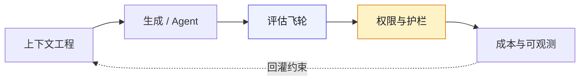
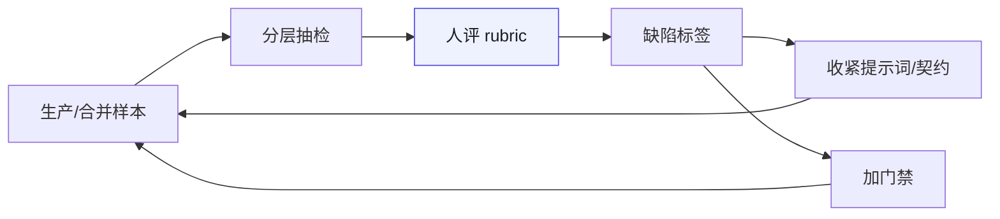

# 附录 J · AI 系统工程最小面（Eval / 上下文 / 权限 / 成本）

> **性质声明**：本书主线是组织治理。本附录补上**AI 系统本身**的最小工程面，避免书名被读成「只会开会」。阈值均为起步值，须按业务调参。
> **与正文关系**：门禁与签字在第 19–21、26–27 章；这里补「系统怎么被做出来并持续被度量」。

---

## J.1 四块拼图



**图 J-1｜AI 系统最小面** — 没有 eval 与权限，生成越多越像埋雷。

---

## J.2 上下文工程（给模型「该知道的」）

### 最小上下文包（单次任务）

| 块 | 内容 | 谁维护 |
|---|---|---|
| 目标 | 一句话成功标准 | 需求方 |
| 边界 | 不可碰链路 / 禁止模式 | 治理 + 域 TL |
| 契约 | 相关 OpenAPI / proto 片段 | 契约仓 |
| 依赖 | 上下游调用与 Owner | 架构图/服务目录 |
| 事故记忆 | 同类历史事故 1–3 条 | 复盘 ADR |
| 输出格式 | 必须声明：事实/推测/假设；缺省字段列表 | 提示词模板 |

**反模式**：把整个 monorepo 塞进上下文「以防万一」——噪声会稀释约束，幻觉型「齐全」会变多。

### 提示词字段（与附录 A 对齐）

```yaml
id: P-...
objective: ...
constraints:   # 业务与红线，不是礼貌用语
must_intervene:
ai_failure_mode:
output_schema:
```

---

## J.3 评估飞轮（不是「看一眼」）

### 三层 eval

| 层 | 问什么 | 例子 | 频率 |
|---|---|---|---|
| L1 可运行 | 能不能跑、编译、单测 | CI、覆盖率 | 每次 PR |
| L2 契约/不变量 | 是否违反事实声明 | oasdiff、import-linter、对账 | 每次合并 |
| L3 任务质量 | 是否达成「人定的成功标准」 | 抽检 rubric、样本外、红队 | 按风险周/月 |

### 抽检 Rubric（示例维度）

- 完整性：是否遗漏必填字段 / 必须分支  
- 一致性：是否与最新契约一致  
- 安全：是否触碰不可碰符号  
- 可演化：是否留下扩展点（呼应第 11 章）  
- 可解释：是否给出「为什么这样改」且可验证  

**起步**：每周人工抽检 N=10～20 个 AI 相关 PR，记缺陷类型，两周出 Pareto。不要一上来做「全自动裁判」。



**图 J-2｜评估飞轮** — 评的是产物类型与缺陷，不是羞辱个人。

---

## J.4 权限与护栏（Agent 必读）

| 级别 | 允许 | 必须人审 | 禁止 |
|---|---|---|---|
| L0 只读 | 读代码、读契约、生成草稿 | — | 写生产、提权 |
| L1 可提案 | PR 草稿、迁移脚本草案 | 合并 | 直接部署 |
| L2 可执行受限 | 灰度配置（在白名单命令集） | 阈值与放量 | 资金路径改写、密钥、跨租户 |
| L3 全权 | **默认不给 Agent** | — | — |

呼应案例四：**能做 ≠ 被授权**。工具集里没有的 API 就不要挂；挂了就会被「逻辑自洽地」调用。

[NIST AI RMF](https://www.nist.gov/itl/ai-risk-management-framework) 的 Govern/Map 可作外部语言；工程落地是：**权限表进代码，调用前中间件拒绝**。

[DORA 2025-06-30](https://dora.dev/insights/concerns-beyond-accuracy-of-ai-output/) 建议对 AI 生成代码考虑**沙箱**再进生产路径——与 L1/L2 分层一致。

---

## J.5 成本与可观测（决策者要的 ROI 骨）

### 要记的账

| 成本项 | 例子 |
|---|---|
| 许可 | Copilot / Cursor / 企业席位 |
| 推理 | token、Agent 多轮、嵌入与检索 |
| 返工 | AI 引入缺陷的修复人天 |
| 门禁 | CI 变长、评审时长 |
| 事故 | 回滚、对账、合规 |

### 最小 ROI 叙事（勿编造）

```
净值 ≈ (节省的生成时间 × 人力成本)
      − (返工 + 门禁 + 事故期望损失)
```

**没有返工与事故项的 ROI 表格，直接扔掉。**  
[DORA ROI of AI-assisted development](https://dora.dev/ai/roi/report/) 提供公开讨论框架，不替代你的账。

### 观测最小集

- 每日：AI 相关 PR 数、留痕率、门禁失败率  
- 每周：抽检缺陷 Pareto、刹车触发、MTTR  
- 每月：事故与 AI 相关占比、成本分摊  

---

## J.6 与治理章的映射

| 系统面 | 组织面 |
|---|---|
| 上下文包边界 | 边界清单（第 1 章） |
| eval L2 | 五层门禁（第 19 章） |
| 权限矩阵 | 案例四 / 第 20 章 |
| prompt 版本 | 第 23 章 |
| 成本与事故 | 第 26 章 KPI |

---

## J.7 检查清单

- [ ] 单次 AI 任务是否带上「不可碰」与契约片段？  
- [ ] 是否有 L1/L2/L3 中至少 L1+L2 的自动 eval？  
- [ ] Agent 是否能调用「未在矩阵内」的工具？能 = 必须堵。  
- [ ] 成本表是否含返工与事故期望，而不只许可费？  
- [ ] 抽检 rubric 是否两周更新一次？

---

## J.8 反模式

| # | 反模式 | 后果 |
|---|---|---|
| 1 | 只有 vibe 检查没有 rubric | 缺陷不可复盘 |
| 2 | 用模型自己当唯一裁判 | 一致性幻觉 |
| 3 | Agent 挂过宽工具集 | 越权与数据外泄 |
| 4 | ROI 只算席位费 | 董事会数字好看、现场在烧钱 |
| 5 | 上下文越大越好 | 约束被稀释 |

---

> **本章的一句话**：组织治理决定**谁负责**；AI 系统工程决定**怎么发现还没人负责的坑**。两面都要，书名才站得住。
