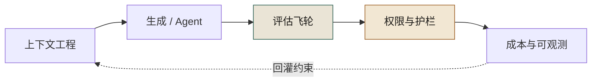
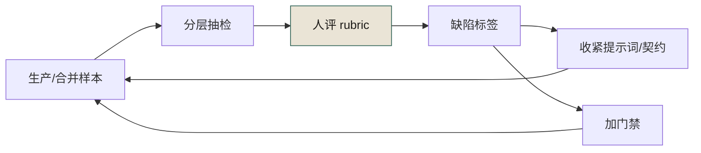

# 附录 J · AI 系统工程最小面（Eval / 上下文 / 权限 / 成本）

> **性质声明**：本书主线是组织治理。本附录补上**AI 系统本身**的最小工程面，避免书名被读成「只会开会」。阈值均为起步值，须按业务调参。
> **与正文关系**：门禁与签字在第 19–21、26–27 章；这里补「系统怎么被做出来并持续被度量」。

---

## J.1 四块拼图



**图 J-1｜AI 系统最小面** — 没有 eval 与权限，生成越多越像埋雷。

实线是构建顺序：上下文喂生成、生成喂评估、评估划权限、权限的运行产生成本与观测；唯一的虚线（成本与观测回灌上下文）才是这四块算「系统」而不算流水线的理由——观测不回灌，前三块各自空转。J.6 至 J.8 把 图 J-1 逐块落成可抄的东西：三件填好的骨架、第一个月的排程表、判断四块转没转的读数。

---

## J.2 上下文工程（给模型「该知道的」）

### 最小上下文包（单次任务）

| 块 | 内容 | 谁维护 |
|---|---|---|
| 目标 | 一句话成功标准 | 需求方 |
| 边界 | 不可碰链路 / 禁止模式 | 治理 + 域 TL |
| 契约 | 相关 OpenAPI / proto 片段 | 契约仓 |
| 依赖 | 上下游调用与 Owner | 架构图/服务目录 |
| 事故记忆 | 同类历史事故 1–3 条 | 复盘 ADR |
| 输出格式 | 必须声明：事实/推测/假设；缺省字段列表 | 提示词模板 |

**反模式**：把整个 monorepo 塞进上下文「以防万一」——噪声会稀释约束，幻觉型「齐全」会变多。

### 提示词字段（与附录 A 对齐）

```yaml
id: P-...
objective: ...
constraints:   # 业务与红线，不是礼貌用语
must_intervene:
ai_failure_mode:
output_schema:
```

---

## J.3 评估飞轮（不是「看一眼」）

### 三层 eval

| 层 | 问什么 | 例子 | 频率 |
|---|---|---|---|
| L1 可运行 | 能不能跑、编译、单测 | CI、覆盖率 | 每次 PR |
| L2 契约/不变量 | 是否违反事实声明 | oasdiff、import-linter、对账 | 每次合并 |
| L3 任务质量 | 是否达成「人定的成功标准」 | 抽检 rubric、样本外、红队 | 按风险周/月 |

### 抽检 Rubric（示例维度）

- 完整性：是否遗漏必填字段 / 必须分支  
- 一致性：是否与最新契约一致  
- 安全：是否触碰不可碰符号  
- 可演化：是否留下扩展点（呼应第 11 章）  
- 可解释：是否给出「为什么这样改」且可验证  

**起步**：每周人工抽检 N=10～20 个 AI 相关 PR，记缺陷类型，两周出 Pareto。不要一上来做「全自动裁判」。



**图 J-2｜评估飞轮** — 评的是产物类型与缺陷，不是羞辱个人。

图 J-2 的环上只有 RUB 一个人工节点，其余全是机械动作；真正的分叉在 TAG 之后：缺陷标签一条回灌提示词与契约，另一条直接变成门禁。任一条回灌边断掉——抽检不出标签，或标签从不回头改 rubric 与门禁——这个环就退化成 J.3 标题里被否定掉的那个动作：看一眼。

---

## J.4 权限与护栏（Agent 必读）

| 级别 | 允许 | 必须人审 | 禁止 |
|---|---|---|---|
| L0 只读 | 读代码、读契约、生成草稿 | — | 写生产、提权 |
| L1 可提案 | PR 草稿、迁移脚本草案 | 合并 | 直接部署 |
| L2 可执行受限 | 灰度配置（在白名单命令集） | 阈值与放量 | 资金路径改写、密钥、跨租户 |
| L3 全权 | **默认不给 Agent** | — | — |

呼应案例四：**能做 ≠ 被授权**。工具集里没有的 API 就不要挂；挂了就会被「逻辑自洽地」调用。

[NIST AI RMF](https://www.nist.gov/itl/ai-risk-management-framework) 的 Govern/Map 可作外部语言；工程落地是：**权限表进代码，调用前中间件拒绝**。

[DORA 2025-06-30](https://dora.dev/insights/concerns-beyond-accuracy-of-ai-output/) 建议对 AI 生成代码考虑**沙箱**再进生产路径——与 L1/L2 分层一致。

---

## J.5 成本与可观测（决策者要的 ROI 骨）

### 要记的账

| 成本项 | 例子 |
|---|---|
| 许可 | Copilot / Cursor / 企业席位 |
| 推理 | token、Agent 多轮、嵌入与检索 |
| 返工 | AI 引入缺陷的修复人天 |
| 门禁 | CI 变长、评审时长 |
| 事故 | 回滚、对账、合规 |

### 最小 ROI 叙事（勿编造）

```
净值 ≈ (节省的生成时间 × 人力成本)
      − (返工 + 门禁 + 事故期望损失)
```

**没有返工与事故项的 ROI 表格，直接扔掉。**  
[DORA ROI of AI-assisted development](https://dora.dev/ai/roi/report/) 提供公开讨论框架，不替代你的账。

### 观测最小集

- 每日：AI 相关 PR 数、留痕率、门禁失败率  
- 每周：抽检缺陷 Pareto、刹车触发、MTTR  
- 每月：事故与 AI 相关占比、成本分摊  

---

## J.6 可抄三件（填空即用）

> J.1 的四块拼图落到仓库里，就是下面这三件东西。**每件都留了空槽，抄走当天就能填。**

### 上下文包（贴进任务描述的第一屏）

```yaml
# context_pack v1   任务：<任务ID>   填写人：<具名>   日期：<YYYY-MM-DD>
objective:          # 一句话成功标准，动词开头；禁止写「优化一下」
boundary_no_touch:  # 不可碰链路/符号，逐条列名；确实没有也要写「无」
contracts:          # 相关契约文件路径 + 版本，禁止贴整仓
upstream_owner:     # 上下游服务名 + 具名 Owner（组名不算 Owner）
incident_memory:    # 同类历史事故编号 1–3 条；没有写「未沉淀」
output_schema:      # 必须声明：事实 / 推测 / 假设 三段 + 变更清单 + 回滚步骤
missing_fields:     # 你缺哪些信息——AI 必须先问，不许猜
```

填过一次的样例（支付对账周边的一次字段补齐任务；符号名为示意，换成你自己的包名）：

```yaml
objective: 给订单详情接口补 refund_channel，五端返回值与对账口径一致
boundary_no_touch: [pay.recon.*, refund_amount]   # refund_amount 是 D-0114 漏掉的字段
contracts: [contracts/order/detail.yaml@v3]
upstream_owner: 支付域 TL <姓名> / 对账服务 SRE <姓名>
incident_memory: [D-0114, E-0311]
output_schema: 事实/推测/假设 + 变更清单 + 回滚步骤
missing_fields: [老版本 App 的最小支持版本号]
```

**`boundary_no_touch` 与 `missing_fields` 是这张包唯一不能省的两格**：前者决定它会不会越界，后者决定它会不会编。其余五格填得糙一点，任务还能跑；这两格空着，任务就是在赌。

### 权限表一行（进代码，不进文档）

```yaml
- agent: <智能体名>
  read: <资源表达式>
  write: <资源表达式>
  execute: NONE                    # NONE 是默认值，不是降级值
  must_ask: [privilege_escalation, cross_tenant, deletion]
  deny_hard: [<永不授予的能力>]     # 从工具注册表摘掉，不靠 prompt 劝
  owner: <具名>
  reviewed_at: <YYYY-MM-DD>        # 超期未复审 → 自动降回只读
```

两个字段的作用点不同，别混：`must_ask` 由**中间件**拦（挂起任务、推送审批）；`deny_hard` 由**工具注册表**拒，连 prompt 都不构造。只写前者，Agent 仍会"逻辑自洽地"提出越权请求——案例四 U-0918 之后被拿掉的正是那条路径（见 J.4）。

### 抽检记录（一行一样本，两周出 Pareto）

```csv
date,sample,prompt_id,eval_level,tags,evidence,followup
2025-06-03,PR-1180,P-9-4-01,L2,契约漏字段|错误码缺,contracts/order/detail.yaml,提示词补必填项
```

（示例行的编号与日期均为示意。）`tags` 必须走**封闭词表**：幻觉字段 / 契约漏字段 / 不变量违规 / 越权调用 / 无回滚 / 不可解释。词表一开放，两周后你拿到的是一堆孤例，不是 Pareto；`followup` 一栏必须落到"改了哪个提示词字段或加了哪条门禁"，只写"已通知本人"的记录等于没记。

---

## J.7 第一个月：谁在哪一天被叫来

制度不是"发布"出来的，是"某几天有人被叫来"出来的。第一个月的动作排布如下（角色按本书通用称谓，换成你自己的岗位名）：

| 时点 | 动作 | 谁 | 会真实发生的摩擦 | 退出条件 |
|---|---|---|---|---|
| D0 | 只挑**一类** AI 任务做范围 | 域 TL | 有人要求一次覆盖全部任务类型——不要，一类就够你踩坑 | 范围写进一页纸并签字 |
| D1–D3 | 填出上下文包 v1 | 需求方 + 治理组 | 边界栏写成"注意安全"，不可判定，退回重写 | `boundary_no_touch` 逐条列名 |
| D4–D7 | 权限表进代码，**先只记录不拦截**（观察模式） | 平台工程 | 观察模式一开就没人记得关 | 表上写明转拦截的日期 |
| 第 2 周 | L1/L2 自动 eval 挂进 PR 流水线 | SRE + 治理组 | 门禁第一次红的时候值班群炸一次 | 事先约定"红由谁响应、多久修" |
| 第 3 周 | 首次人工抽检（J.3 的 N=10～20） | 治理组 + 域 TL 轮值 | 轮值人专挑简单样本看 | 按"风险 × 新近度"分层抽样，样本由脚本抽，不由人挑 |
| 第 4 周 | 用记录回改提示词与权限表，出第一版成本账 | 治理组 | 成本表里只有许可费 | 返工与事故两栏有取数口径（见 J.5） |

**最容易跳过的是第 4 行的退出条件：观察模式必须有转拦截的日期。** 权限表停在"只记录"两周以上，它就会永久停在那里——因为你已经习惯了看日志而不是挡动作。

第 2 周的红，和第 3 周的抽检，是这一个月的全部目的。没有一次红、没有一批带标签的缺陷记录，第 4 周没有任何东西可以回灌，J.3 的飞轮就转不起来。

---

## J.8 度量：怎么知道这四块拼图在转

| 信号 | 怎么取数 | 起手的线 | 谁看 | 这条线怎么来的 |
|---|---|---|---|---|
| 上下文包使用率 | 任务字段 `boundary_no_touch` 非空占比 | 新任务八成以上 | 治理组 | 拍的，用于起手，不是标准 |
| 抽检记录有标签率 | `tags` 非空且落在封闭词表内 | 100% | 治理组 | 定义，不是阈值：无标签即无 Pareto |
| `deny_hard` 命中数 | 工具注册表拒绝计数 | 应为 0；不为 0 = 有工具挂早于权限表 | 安全负责人 | 这条由机制定义，不用拍 |
| rubric 改动次数 | 提示词/门禁的 PR 数 | 每月至少 1 次 | 治理组 | 经验阈值：一次不改 = 抽检已死 |
| 返工人天占比 | AI 相关 PR 的修复人天 ÷ 总人天 | 不设目标值，只要求"有数" | 决策层 | 早期分母不稳，设目标只会逼出造假 |
| prompt 版本回滚次数 | 版本系统 | 只看趋势 | 治理组 | 判断题 |

**这套东西最常见的三种死法**：

1. **eval 收敛成一个分数。** 每次跑完只留一个总分，没人拆到缺陷类型——总分不能改提示词，只能拿去汇报。
2. **权限表进文档没进代码。** 于是 J.4 那张矩阵的真实作用，是让新人知道"公司想过这件事"。
3. **成本只摊许可费。** 返工与事故没有归属人，季末 ROI 表比谁都漂亮，现场还在烧钱（对应 J.11 反模式第 4 条）。

---

## J.9 与治理章的映射

| 系统面 | 组织面 |
|---|---|
| 上下文包边界 | 边界清单（第 1 章） |
| eval L2 | 五层门禁（第 19 章） |
| 权限矩阵 | 案例四 / 第 20 章 |
| prompt 版本 | 第 23 章 |
| 成本与事故 | 第 26 章 KPI |
| 上下文包 / 权限表（J.6） | 附录 A 的 `constraints` 与 `must_intervene` 字段 |
| 抽检记录（J.6） | 第 24 章 AI 评审与幻觉处理 |
| 第一个月时间线（J.7） | 90 天总路线图（前置章）的压缩版 |

---

## J.10 检查清单

- [ ] 单次 AI 任务是否带上「不可碰」与契约片段？  
- [ ] 是否有 L1/L2/L3 中至少 L1+L2 的自动 eval？  
- [ ] Agent 是否能调用「未在矩阵内」的工具？能 = 必须堵。  
- [ ] 成本表是否含返工与事故期望，而不只许可费？  
- [ ] 抽检 rubric 是否两周更新一次？  
- [ ] 权限表进代码了吗？文档里那份只是给新人看的。  
- [ ] 观察模式有没有写明"转拦截"的日期？没有日期 = 永久只记录。  
- [ ] 抽检缺陷标签是否走封闭词表？词表一开，Pareto 就没了。

---

## J.11 反模式

| # | 反模式 | 后果 |
|---|---|---|
| 1 | 只有 vibe 检查没有 rubric | 缺陷不可复盘 |
| 2 | 用模型自己当唯一裁判 | 一致性幻觉 |
| 3 | Agent 挂过宽工具集 | 越权与数据外泄 |
| 4 | ROI 只算席位费 | 董事会数字好看、现场在烧钱 |
| 5 | 上下文越大越好 | 约束被稀释 |
| 6 | 权限表"观察模式"无退出日期 | 拦截永远没上线，日志越攒越厚 |
| 7 | 抽检样本由人挑 | 挑简单的看，两周后 Pareto 上一片绿 |

---

> **本章的一句话**：组织治理决定**谁负责**；AI 系统工程决定**怎么发现还没人负责的坑**。两面都要，书名才站得住。
