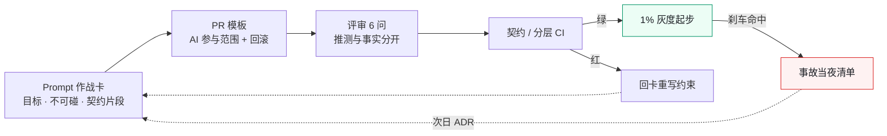
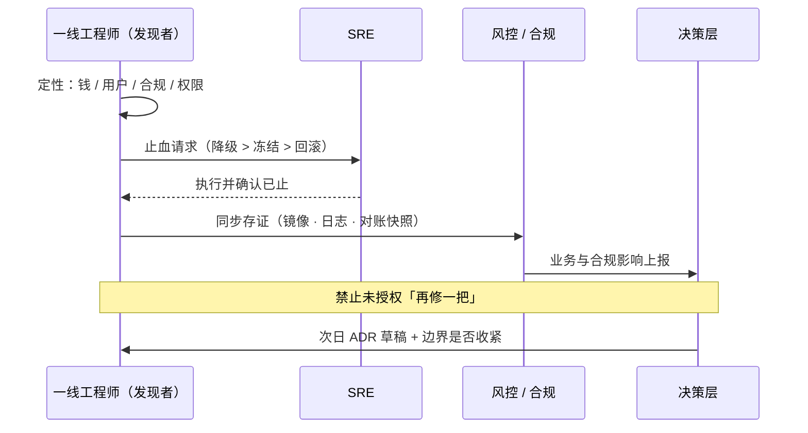

# 附录 K · 一线最小实践包（一页可抄）

> **性质声明**：给一线工程师与 Tech Lead 的作战页。不替代制度，只保证你在制度到位前**先不埋大雷**。
> **用法**：打印或贴 wiki；每条默认执行，例外必须进 ADR。

---

## K.1 本周就能做完的 7 件事

1. **列出你域的不可碰清单**（哪怕只有 3 条：支付、权限、删除）  
2. **给每个对外接口找一个具名 Owner**（人名，不是「后端组」）  
3. **AI PR 必须带**：任务目标一句 + 使用的 prompt/会话链接或任务 ID  
4. **资金/权限变更**：人写回滚步骤，不接受「上线后再补」  
5. **架构分层**：能跑 import-linter 或等价检查就先挂上  
6. **灰度**：没有 1% 档就不要直接 100%  
7. **出事第一动作**：止血（降级/冻结/回滚），禁止顺手再改一段  



**图 K-1｜一线日常最小闭环** — 作战卡 → PR → 评审 → CI → 灰度 → 事故回灌，一张纸画得下，也一天做得完。

---

## K.2 Prompt 作战卡

```text
【目标】
【不可碰】
【相关契约片段】
【必须输出】
  - 变更列表
  - 影响的接口/端
  - 事实 vs 推测
  - 回滚步骤
【必须人介入的条件】
```

- 不把「请你认真一点」当约束。  
- 约束要**可判定**（能写进 CI 或检查表）。  
- 与附录 A 的 `must_intervene` 字段对齐。

---

## K.3 PR 模板（AI 相关）

```markdown
## 目标
## AI 参与范围
- [ ] 生成实现 / [ ] 生成测试 / [ ] 生成迁移 / [ ] 仅解释
Prompt 或任务 ID：
## 契约
- 契约文件路径：
- 是否破坏性：是 / 否（是则列出签字人）
## 风险
- 不可碰链路：是 / 否
- 回滚：命令或步骤
## 验证
- [ ] 本地测试
- [ ] 契约/分层 CI
- [ ] 人工复核点说明
```

---

## K.4 代码上的「留缝」最小清单

- 策略/规则用可替换对象，不写死大 if-else 巨石  
- 资金路径预留独立开关  
- 外部调用可 mock、可超时、可降级  
- 迁移与回滚成对进仓  
- 关键分支有测试名能读出业务语义  

（详见第 11 章）

---

## K.5 评审时只问这 6 个问题

1. 漏了什么契约字段？  
2. 下游谁在用？有没有跨仓库？  
3. 哪些是 AI 推测而不是验证过的？  
4. 出事怎么在 5 分钟内停？  
5. 有没有不可碰符号被改到？  
6. 三个月后要改扩展点，改哪里？  

---

## K.6 事故当夜清单

```text
1. 定性：钱 / 用户 / 合规 / 权限
2. 止血：降级 > 冻结 > 回滚
3. 存证：镜像、日志、对账快照
4. 通知：SRE → 风控/合规 → 业务 → 决策层
5. 禁止：未授权「再修一把」
6. 次日：ADR 草稿 + 是否收紧边界
```



**图 K-2｜事故当夜的动作顺序** — 先止血再存证再通知；改代码的冲动排在最后，且需要授权。

---

## K.7 不该由一线单独决定的事

| 事 | 谁 |
|---|---|
| 放开资金链路 AI | 委员会/风控 |
| 跳过门禁 | ADR + 有时限的书面豁免 |
| 降低灰度刹车阈值 | SRE + 业务 |
| 删除合规保护符号 | 合规签字 |

---

## K.8 与全书互链

| 你卡在哪 | 看 |
|---|---|
| 不知道边界怎么写 | 第 1 章、附录 K.1 |
| 契约 Owner 吵不清 | 第 9、26 章 |
| 架构违规 | 第 8、10 章 |
| 生成完没法改 | 第 11 章 |
| 上线怕回滚不了 | 第 21、28 章 |
| 提示词乱 | 第 23 章、附录 A |
| Agent 越权 | 案例四、附录 J |

---

> **本章的一句话**：一线不需要先建成完整治理体系，也能先做到**不埋大雷**——边界写清、留痕可追、回滚有路、不可碰不碰。
