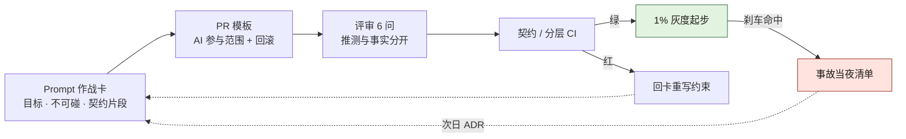
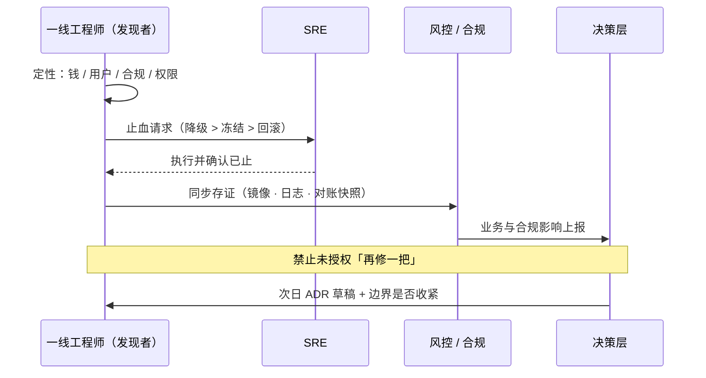

# 附录 K · 一线最小实践包（一页可抄）

> **性质声明**：给一线工程师与 Tech Lead 的作战页。不替代制度，只保证你在制度到位前**先不埋大雷**。
> **用法**：打印或贴 wiki；每条默认执行，例外必须进 ADR。

---

## K.1 本周就能做完的 7 件事

1. **列出你域的不可碰清单**（哪怕只有 3 条：支付、权限、删除）  
2. **给每个对外接口找一个具名 Owner**（人名，不是「后端组」）  
3. **AI PR 必须带**：任务目标一句 + 使用的 prompt/会话链接或任务 ID  
4. **资金/权限变更**：人写回滚步骤，不接受「上线后再补」  
5. **架构分层**：能跑 import-linter 或等价检查就先挂上  
6. **灰度**：没有 1% 档就不要直接 100%  
7. **出事第一动作**：止血（降级/冻结/回滚），禁止顺手再改一段  



**图 K-1｜一线日常最小闭环** — 作战卡 → PR → 评审 → CI → 灰度 → 事故回灌，一张纸画得下，也一天做得完。

图 K-1 是上面七件事的连法：CARD、PR、REV、INC 四格就是 K.2、K.3、K.5、K.6 四页实物，按箭头先后贴起来即可；两条往回的边容易看漏——CI 红了不就地修复，沿 FIX 退回 CARD 重写约束，灰度刹车命中后走「次日 ADR」这条虚线从 INC 回到 CARD。当晚只止血、次日才改卡，闭环这样才算合上。

---

## K.1b 明天上午的 90 分钟

上面 7 件事不需要一周准备，**一个上午能起步**。照下面这张表排（时段是示意，按你的会议文化改；关键是每一格都有产出物和一个人名）：

| 时段 | 动作 | 在场 | 产出物 | 卡住时怎么办 |
|---|---|---|---|---|
| 09:30–09:45 | 各自静默写「我域不可碰」草稿，不讨论 | 每域一线 1–2 人 | 每人 3–5 行 | 写不出来就翻最近三次事故/回滚单，事故里出现过的模块名就是候选 |
| 09:45–10:15 | 逐条合并去重，每条逼出一个签字人 | 域 TL + 一线 | 一版不可碰清单（带人名） | TL 推脱 → 先把清单贴进 K.3 的 PR 模板，让他改这份，而不是批那份 |
| 10:15–10:45 | 对外接口找 Owner，只允许填人名 | 域 TL + 契约 Owner | 接口 → 人名 对照表 | 只肯给组名 → 该接口记为「无 Owner」，这一条本身进清单 |
| 10:45–11:00 | 定 AI PR 的留痕字段与回滚字段先卡哪个 | 域 TL + SRE 值班 | PR 模板一版（K.3） | SRE 缺席 → 回滚字段先只要求「命令或链接」，演练另排 |

一定会撞上的三句阻力，提前把接法想好：

- **「签了这个，我的需求就排不进去了。」** 是的，这就是签字的含义。**接法**：清单只圈资金、权限、删除三类，其余一律不圈；被挡的需求走 K.7 的书面豁免（必须带时限），而不是把清单删薄。
- **「这个接口我们组都在改。」** 等于没人负责。**接法**：当场指定一名 Owner，其余人写「备份 Owner」——备份也得是人名。
- **「还要贴 prompt？我根本没存。」** 第一周不追历史，只改增量：从今天起 AI 相关 PR 必须带链接或任务 ID，历史 PR 不回填。**留痕率从 0 爬到非零，比一步喊到 90% 真。**

> **代价声明**：这个上午不会立刻产出任何新功能，而且从今天起每个 AI PR 要多写两行、被挡的需求要多走一张豁免单。这笔摩擦由一线先付——换来的是出事那一晚你能在五分钟内说清「改了哪里、谁签的、怎么退」。

---

## K.2 Prompt 作战卡

```text
【目标】
【不可碰】
【相关契约片段】
【必须输出】
  - 变更列表
  - 影响的接口/端
  - 事实 vs 推测
  - 回滚步骤
【必须人介入的条件】
```

- 不把「请你认真一点」当约束。  
- 约束要**可判定**（能写进 CI 或检查表）。  
- 与附录 A 的 `must_intervene` 字段对齐。

---

## K.2b 作战卡：填好的样子与填坏的样子

可以直接抄的一版（把符号名与路径换成你自己的）：

```text
【目标】给退款回调补 refund_amount 的字段映射；不改金额计算、不改状态机
【不可碰】payment/refund/state_machine/**、billing/ledger/**（对应不可碰清单第 2、第 5 条）
【相关契约片段】contract/refund-callback.openapi.yaml § schema.RefundPayload
【必须输出】
  - 变更列表
  - 影响的接口/端
  - 事实 vs 推测（推测必须写「未验证，验证方式是…」）
  - 回滚步骤
【必须人介入的条件】
  - 需要改契约文件本身
  - 需要新增跨域调用
  - 需要改金额或权限判定分支
  - 任何实现依赖上面标为「推测」的结论
```

同一张卡，填坏了三种，一眼可辨：

| 填法 | 为什么等于没填 |
|---|---|
| 不可碰写「别改坏支付」 | 无法判定：改一行也算违反，也算不违反 |
| 契约片段贴整个仓库地址 | 约束被噪声稀释；模型会「看起来很完整地」绕过它（同附录 J 的反模式） |
| 人介入条件写「复杂逻辑需人工确认」 | 「复杂」由谁定？评审时一定吵架，吵完就放行 |

**这一段代码要不要走人审**，按顺序问三问，第一个命中就停：

| 顺序 | 问 | 命中后怎么做 |
|---|---|---|
| 1 | 改了资金 / 权限 / 删除的语义？ | 走 K.7：具名签字，不许「先合后审」 |
| 2 | 改了契约文件本身或跨端字段？ | 拉契约 Owner 与下游端 TL 会签 |
| 3 | 正确性只存在于隐性知识（延时、重试窗口、对账口径）？ | 人写验证步骤，AI 只出草稿 |
| — | 三问全否 | 可放行，但 prompt 或任务 ID 照留 |

> **可判定是唯一标准**：一条约束如果写不成 CI 检查、也写不成检查表里的一行，它就不是约束，是愿望。

---

## K.3 PR 模板（AI 相关）

```markdown
## 目标
## AI 参与范围
- [ ] 生成实现 / [ ] 生成测试 / [ ] 生成迁移 / [ ] 仅解释
Prompt 或任务 ID：
## 契约
- 契约文件路径：
- 是否破坏性：是 / 否（是则列出签字人）
## 风险
- 不可碰链路：是 / 否
- 回滚：命令或步骤
## 验证
- [ ] 本地测试
- [ ] 契约/分层 CI
- [ ] 人工复核点说明
```

---

## K.4 代码上的「留缝」最小清单

- 策略/规则用可替换对象，不写死大 if-else 巨石  
- 资金路径预留独立开关  
- 外部调用可 mock、可超时、可降级  
- 迁移与回滚成对进仓  
- 关键分支有测试名能读出业务语义  

（详见第 11 章）

---

## K.5 评审时只问这 6 个问题

1. 漏了什么契约字段？  
2. 下游谁在用？有没有跨仓库？  
3. 哪些是 AI 推测而不是验证过的？  
4. 出事怎么在 5 分钟内停？  
5. 有没有不可碰符号被改到？  
6. 三个月后要改扩展点，改哪里？  

---

## K.6 事故当夜清单

```text
1. 定性：钱 / 用户 / 合规 / 权限
2. 止血：降级 > 冻结 > 回滚
3. 存证：镜像、日志、对账快照
4. 通知：SRE → 风控/合规 → 业务 → 决策层
5. 禁止：未授权「再修一把」
6. 次日：ADR 草稿 + 是否收紧边界
```



**图 K-2｜事故当夜的动作顺序** — 先止血再存证再通知；改代码的冲动排在最后，且需要授权。

图 K-2 在文字清单之上多给了两条硬约定：止血必须带回执，SRE 回给一线的那条「执行并确认已止」没落地，第 2 步就不算完成；通知是接力制，一线只对接风控/合规，影响上报由其转给决策层，最后带「次日」字样的回路就是清单第 6 步的 ADR 回灌。

---

## K.7 不该由一线单独决定的事

| 事 | 谁 |
|---|---|
| 放开资金链路 AI | 委员会/风控 |
| 跳过门禁 | ADR + 有时限的书面豁免 |
| 降低灰度刹车阈值 | SRE + 业务 |
| 删除合规保护符号 | 合规签字 |

---

## K.7b 这一页有没有生效：三个读数 + 四种走形

不用等季度评审，**自己就能数**。三个读数（阈值是经验判断，用于起手，不是标准）：

| 读数 | 怎么数 | 判读 |
|---|---|---|
| AI PR 留痕 | 拉最近 10 个 AI 相关 PR，数带链接或任务 ID 的个数；**口径：字段非空且链接打得开** | 少于 5 个 → K.1 第 3 条只活在口头上。案例一的留痕率是从 0% 走到 94%（见数字清单），说明这条能走通，也说明 94% 是结果不是起手目标 |
| 回滚可操作性 | 随便挑上周上线的一笔资金/权限变更，掐表看能否在 5 分钟内说出回滚命令或开关位置 | 说不出完整命令 → K.1 第 4 条是空转，当场记一条待办给 Owner，不要改代码 |
| 清单是否活着 | 在 CI 配置里搜你的不可碰清单文件名；再数清单最近一次新增条目的日期 | 搜不到引用 = 壁纸；三个月没新增 = 大概率不是「没发现」，是没人再看过 |

四种走形，头两周就会见到：

| 走形 | 症状 | 纠正 |
|---|---|---|
| 组名当 Owner | 出事时那个组说「不是我改的」 | 退回：只接受人名，备份也要人名 |
| 模板全勾、字段留空 | 留痕率虚高，复盘时一个 prompt 都找不到 | 判定改成「链接可打开」，并在抽查里点名 |
| 清单只减不增 | 每次有需求撞墙就把条目删掉 | 删条目要写 ADR，说明「为什么这条不再需要」 |
| 当夜清单事后补记 | 存证时间戳全挤在同一分钟，顺序对不上日志 | 清单挂进值班工具的第一屏；补记必须标注补记时间 |

> **一句判据**：这一页生效的标志不是大家都知道了这七条，而是**某个具体 PR 因为缺一项被挡住过**。一次都没挡过 = 它没在跑。

---

## K.8 与全书互链

| 你卡在哪 | 看 |
|---|---|
| 不知道从哪一步开始 | 附录 K.1b（90 分钟排程）、K.2b（卡片填法） |
| 不知道边界怎么写 | 第 1 章、附录 K.1 |
| 契约 Owner 吵不清 | 第 9、26 章 |
| 架构违规 | 第 8、10 章 |
| 生成完没法改 | 第 11 章 |
| 上线怕回滚不了 | 第 21、28 章 |
| 提示词乱 | 第 23 章、附录 A |
| Agent 越权 | 案例四、附录 J |

---

> **本章的一句话**：一线不需要先建成完整治理体系，也能先做到**不埋大雷**——边界写清、留痕可追、回滚有路、不可碰不碰。
