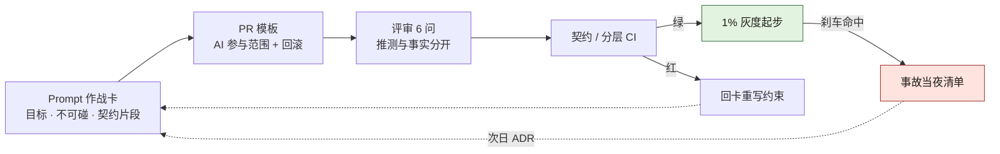
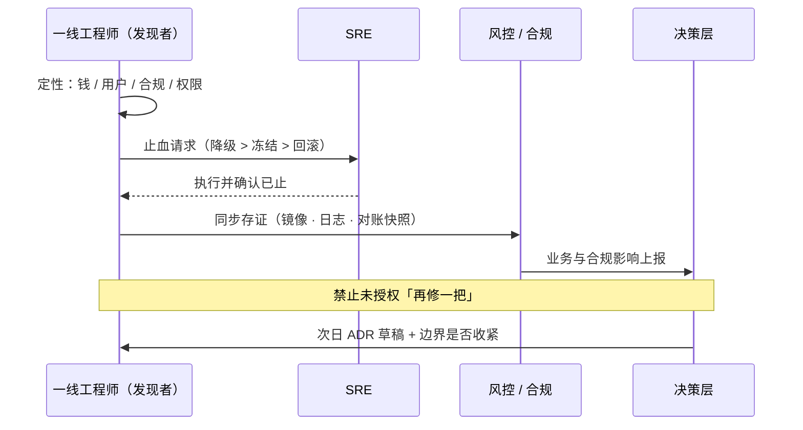
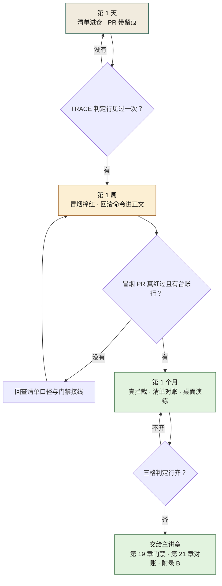
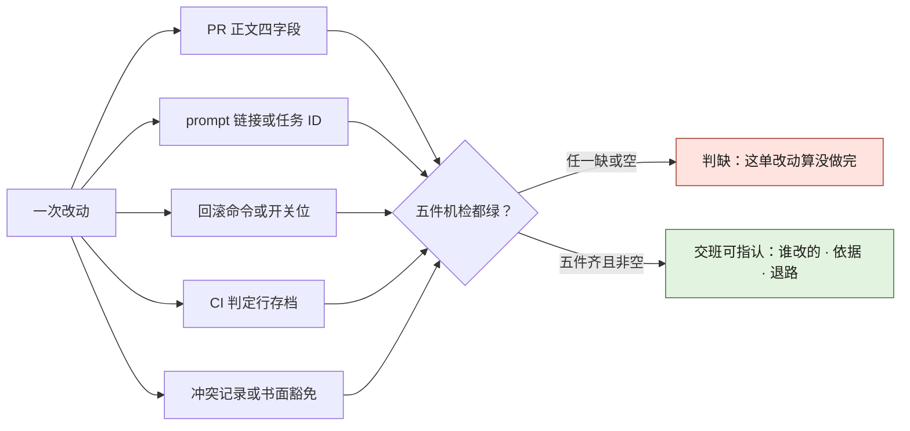

# 附录 K · 一线最小实践包（一页可抄）

> **性质声明**：给一线工程师与 Tech Lead 的作战页。不替代制度，只保证你在制度到位前**先不埋大雷**。
> **用法**：打印或贴 wiki；每条默认执行，例外必须进 ADR。

---

## K.1 本周就能做完的 7 件事

1. **列出你域的不可碰清单**（哪怕只有 3 条：支付、权限、删除）  
2. **给每个对外接口找一个具名 Owner**（人名，不是「后端组」）  
3. **AI PR 必须带**：任务目标一句 + 使用的 prompt/会话链接或任务 ID  
4. **资金/权限变更**：人写回滚步骤，不接受「上线后再补」  
5. **架构分层**：能跑 import-linter 或等价检查就先挂上  
6. **灰度**：没有 1% 档就不要直接 100%  
7. **出事第一动作**：止血（降级/冻结/回滚），禁止顺手再改一段  



**图 K-1｜一线日常最小闭环** — 作战卡 → PR → 评审 → CI → 灰度 → 事故回灌，一张纸画得下，也一天做得完。

图 K-1 是上面七件事的连法：CARD、PR、REV、INC 四格就是 K.2、K.3、K.5、K.6 四页实物，按箭头先后贴起来即可；两条往回的边容易看漏——CI 红了不就地修复，沿 FIX 退回 CARD 重写约束，灰度刹车命中后走「次日 ADR」这条虚线从 INC 回到 CARD。当晚只止血、次日才改卡，闭环这样才算合上。

---

## K.1b 明天上午的 90 分钟

上面 7 件事不需要一周准备，**一个上午能起步**。照下面这张表排（时段是示意，按你的会议文化改；关键是每一格都有产出物和一个人名）：

| 时段 | 动作 | 在场 | 产出物 | 卡住时怎么办 |
|---|---|---|---|---|
| 09:30–09:45 | 各自静默写「我域不可碰」草稿，不讨论 | 每域一线 1–2 人 | 每人 3–5 行 | 写不出来就翻最近三次事故/回滚单，事故里出现过的模块名就是候选 |
| 09:45–10:15 | 逐条合并去重，每条逼出一个签字人 | 域 TL + 一线 | 一版不可碰清单（带人名） | TL 推脱 → 先把清单贴进 K.3 的 PR 模板，让他改这份，而不是批那份 |
| 10:15–10:45 | 对外接口找 Owner，只允许填人名 | 域 TL + 契约 Owner | 接口 → 人名 对照表 | 只肯给组名 → 该接口记为「无 Owner」，这一条本身进清单 |
| 10:45–11:00 | 定 AI PR 的留痕字段与回滚字段先卡哪个 | 域 TL + SRE 值班 | PR 模板一版（K.3） | SRE 缺席 → 回滚字段先只要求「命令或链接」，演练另排 |

一定会撞上的三句阻力，提前把接法想好：

- **「签了这个，我的需求就排不进去了。」** 是的，这就是签字的含义。**接法**：清单只圈资金、权限、删除三类，其余一律不圈；被挡的需求走 K.7 的书面豁免（必须带时限），而不是把清单删薄。
- **「这个接口我们组都在改。」** 等于没人负责。**接法**：当场指定一名 Owner，其余人写「备份 Owner」——备份也得是人名。
- **「还要贴 prompt？我根本没存。」** 第一周不追历史，只改增量：从今天起 AI 相关 PR 必须带链接或任务 ID，历史 PR 不回填。**留痕率从 0 爬到非零，比一步喊到 90% 真。**

> **代价声明**：这个上午不会立刻产出任何新功能，而且从今天起每个 AI PR 要多写两行、被挡的需求要多走一张豁免单。这笔摩擦由一线先付——换来的是出事那一晚你能在五分钟内说清「改了哪里、谁签的、怎么退」。

---

## K.2 Prompt 作战卡

```text
【目标】
【不可碰】
【相关契约片段】
【必须输出】
  - 变更列表
  - 影响的接口/端
  - 事实 vs 推测
  - 回滚步骤
【必须人介入的条件】
```

- 不把「请你认真一点」当约束。  
- 约束要**可判定**（能写进 CI 或检查表）。  
- 与附录 A 的 `must_intervene` 字段对齐。

---

## K.2b 作战卡：填好的样子与填坏的样子

可以直接抄的一版（把符号名与路径换成你自己的）：

```text
【目标】给退款回调补 refund_amount 的字段映射；不改金额计算、不改状态机
【不可碰】payment/refund/state_machine/**、billing/ledger/**（对应不可碰清单第 2、第 5 条）
【相关契约片段】contract/refund-callback.openapi.yaml § schema.RefundPayload
【必须输出】
  - 变更列表
  - 影响的接口/端
  - 事实 vs 推测（推测必须写「未验证，验证方式是…」）
  - 回滚步骤
【必须人介入的条件】
  - 需要改契约文件本身
  - 需要新增跨域调用
  - 需要改金额或权限判定分支
  - 任何实现依赖上面标为「推测」的结论
```

同一张卡，填坏了三种，一眼可辨：

| 填法 | 为什么等于没填 |
|---|---|
| 不可碰写「别改坏支付」 | 无法判定：改一行也算违反，也算不违反 |
| 契约片段贴整个仓库地址 | 约束被噪声稀释；模型会「看起来很完整地」绕过它（同附录 J 的反模式） |
| 人介入条件写「复杂逻辑需人工确认」 | 「复杂」由谁定？评审时一定吵架，吵完就放行 |

**这一段代码要不要走人审**，按顺序问三问，第一个命中就停：

| 顺序 | 问 | 命中后怎么做 |
|---|---|---|
| 1 | 改了资金 / 权限 / 删除的语义？ | 走 K.7：具名签字，不许「先合后审」 |
| 2 | 改了契约文件本身或跨端字段？ | 拉契约 Owner 与下游端 TL 会签 |
| 3 | 正确性只存在于隐性知识（延时、重试窗口、对账口径）？ | 人写验证步骤，AI 只出草稿 |
| — | 三问全否 | 可放行，但 prompt 或任务 ID 照留 |

> **可判定是唯一标准**：一条约束如果写不成 CI 检查、也写不成检查表里的一行，它就不是约束，是愿望。

---

## K.3 PR 模板（AI 相关）

```markdown
## 目标
## AI 参与范围
- [ ] 生成实现 / [ ] 生成测试 / [ ] 生成迁移 / [ ] 仅解释
Prompt 或任务 ID：
## 契约
- 契约文件路径：
- 是否破坏性：是 / 否（是则列出签字人）
## 风险
- 不可碰链路：是 / 否
- 回滚：命令或步骤
## 验证
- [ ] 本地测试
- [ ] 契约/分层 CI
- [ ] 人工复核点说明
```

---

## K.4 代码上的「留缝」最小清单

- 策略/规则用可替换对象，不写死大 if-else 巨石  
- 资金路径预留独立开关  
- 外部调用可 mock、可超时、可降级  
- 迁移与回滚成对进仓  
- 关键分支有测试名能读出业务语义  

（详见第 11 章）

---

## K.5 评审时只问这 6 个问题

1. 漏了什么契约字段？  
2. 下游谁在用？有没有跨仓库？  
3. 哪些是 AI 推测而不是验证过的？  
4. 出事怎么在 5 分钟内停？  
5. 有没有不可碰符号被改到？  
6. 三个月后要改扩展点，改哪里？  

---

## K.6 事故当夜清单

```text
1. 定性：钱 / 用户 / 合规 / 权限
2. 止血：降级 > 冻结 > 回滚
3. 存证：镜像、日志、对账快照
4. 通知：SRE → 风控/合规 → 业务 → 决策层
5. 禁止：未授权「再修一把」
6. 次日：ADR 草稿 + 是否收紧边界
```



**图 K-2｜事故当夜的动作顺序** — 先止血再存证再通知；改代码的冲动排在最后，且需要授权。

图 K-2 在文字清单之上多给了两条硬约定：止血必须带回执，SRE 回给一线的那条「执行并确认已止」没落地，第 2 步就不算完成；通知是接力制，一线只对接风控/合规，影响上报由其转给决策层，最后带「次日」字样的回路就是清单第 6 步的 ADR 回灌。

---

## K.7 不该由一线单独决定的事

| 事 | 谁 |
|---|---|
| 放开资金链路 AI | 委员会/风控 |
| 跳过门禁 | ADR + 有时限的书面豁免 |
| 降低灰度刹车阈值 | SRE + 业务 |
| 删除合规保护符号 | 合规签字 |

---

## K.7b 这一页有没有生效：三个读数 + 四种走形

不用等季度评审，**自己就能数**。三个读数（阈值是经验判断，用于起手，不是标准）：

| 读数 | 怎么数 | 判读 |
|---|---|---|
| AI PR 留痕 | 拉最近 10 个 AI 相关 PR，数带链接或任务 ID 的个数；**口径：字段非空且链接打得开** | 少于 5 个 → K.1 第 3 条只活在口头上。案例一的留痕率是从 0% 走到 94%（见数字清单），说明这条能走通，也说明 94% 是结果不是起手目标 |
| 回滚可操作性 | 随便挑上周上线的一笔资金/权限变更，掐表看能否在 5 分钟内说出回滚命令或开关位置 | 说不出完整命令 → K.1 第 4 条是空转，当场记一条待办给 Owner，不要改代码 |
| 清单是否活着 | 在 CI 配置里搜你的不可碰清单文件名；再数清单最近一次新增条目的日期 | 搜不到引用 = 壁纸；三个月没新增 = 大概率不是「没发现」，是没人再看过 |

四种走形，头两周就会见到：

| 走形 | 症状 | 纠正 |
|---|---|---|
| 组名当 Owner | 出事时那个组说「不是我改的」 | 退回：只接受人名，备份也要人名 |
| 模板全勾、字段留空 | 留痕率虚高，复盘时一个 prompt 都找不到 | 判定改成「链接可打开」，并在抽查里点名 |
| 清单只减不增 | 每次有需求撞墙就把条目删掉 | 删条目要写 ADR，说明「为什么这条不再需要」 |
| 当夜清单事后补记 | 存证时间戳全挤在同一分钟，顺序对不上日志 | 清单挂进值班工具的第一屏；补记必须标注补记时间 |

> **一句判据**：这一页生效的标志不是大家都知道了这七条，而是**某个具体 PR 因为缺一项被挡住过**。一次都没挡过 = 它没在跑。

---

## K.9 第 1 天 / 第 1 周 / 第 1 个月：三档动作表与判定行

K.1b 把起步压到「一个上午」；本节把颗粒度再拧两档——天、周、月。每格四件事：动作、可抄的命令形状、grep 得到才算过的判定行、这一格最容易被糊弄成什么样。先定三条口径：

- 判定行必须可 grep。落不进日志行或命令输出行的，是会议，不是动作——与路线图 0.5c 同一口径，那节写组织侧的门禁，这一节写一线侧的手。
- 本节所有命令都是**形状**不是读数：路径、分支、服务名一律占位，本书没有在任何机器上跑过它们。全书在本页唯一的例外是 K.11 的取数脚本，本机实跑、读数逐字粘回。
- 凡是写了「起手值」的数，都是拍的，用于起手，不是标准；调的依据只有你自己域上第一条判定行的出现时间。

### 第 1 天：先让「改了哪里」与「哪里不可碰」各落进一次仓

| 格 | 动作 | 命令形状 | 判定行（grep 得到才算过） | 最容易被糊弄成 |
|---|---|---|---|---|
| D1a | 不可碰清单从本域近两周的变更足迹里长出来，而不凭印象抄 | 见 D1a bash | 清单文件存在且非空非注释行 3 行以上（3 是起手值） | 写成三句口号，没有一个路径 glob，机器吃不下 |
| D1b | 下一个 AI 相关 PR 在送评审前先过一遍留痕自查 | 见 D1b bash | 草稿里 grep 得到一行以 `http` 开场、前缀是 Prompt 或任务 ID 的字段 | 把模板占位文本原样留下——字段非空，K.11 会把它判成 PLACEHOLDER |

```bash
# D1a —— 用变更足迹起草本域不可碰清单（占位路径，换你自己的仓）
git -C <你的仓目录> log --since=2.weeks --name-only --pretty=format: \
  | sort | uniq -c | sort -rn | head          # 最常被改的路径 = 候选锚，不是清单本身
printf '%s\n' '<你的资金路径>/**' '<你的权限路径>/**' '<删除入口>/**' \
  > docs/do_not_touch.md                      # 每行都要是 CI 能消费的路径 glob
grep -cEv '^[[:space:]]*(#|$)' docs/do_not_touch.md   # 判定行：输出 >= 3（起手值，拍的）
```

```bash
# D1b —— 送审前的本地自查（对 PR 描述草稿文件跑；组织侧的 CI 形状在路线图 0.5c 的 trace job）
grep -E '^Prompt 或任务 ID：https?://' <你的 PR 描述草稿> \
  || echo 'TRACE-MISSING field=prompt_ref reason=送审前自查'
```

D1a 的反向检查：翻本域最近一张回滚单，单上的模块名必须已被清单覆盖——回滚发生过而清单没圈，说明清单是想象力的抄件。D1b 的反向检查：这一行判定跑不出来没关系，一周后用 K.11 看它被 TRACE 判掉几条；判不掉的才是真留痕。

### 第 1 周：把「形状」跑成第一条真实读数

| 格 | 动作 | 命令形状 / 落点 | 判定行 | 最容易被糊弄成 |
|---|---|---|---|---|
| W1a | 用 K.11 脚本出你这一周的第一份留痕读数 | `python3 wave_selfcheck.py <你的 PR 导出.jsonl>` | 输出至少一行 `TRACE-` 或「有效留痕」行 | 只跑内置夹具并截图——夹具恒绿，不算你的数 |
| W1b | 故意撞红一次：提一个专碰清单路径的冒烟 PR | 见 W1b bash | 流水线日志首行 `MONEY-PATH-FREEZE deny file=<命中路径>` | 「清单反正没人碰」所以不冒烟；或撞红之后把门禁从阻断降成警告 |
| W1c | 抽一笔上周上线的资金/权限变更，把回滚命令填进 K.3 字段并当场掐表 | K.3「回滚」字段 | 字段里是一行可整条复制执行的命令或开关位置，不是「可回滚」三个字 | 写「找发布平台回滚」——事故当晚没人知道指哪个页面哪个按钮 |

```bash
# W1b —— 冒烟 PR：故意碰一次清单圈住的路径（占位分支名，冒烟完即删）
git switch -c smoke/do-not-touch-probe <你的基线分支>
: > <清单内路径>/probe-only-delete-me.md && git add -A \
  && git commit -m 'smoke: 本 PR 用来被拦，冒烟后即删'
git push -u origin smoke/do-not-touch-probe
# 判定行（流水线日志里必须出现的那一行，形状与路线图 0.5c 第 1–2 周一致）：
#   MONEY-PATH-FREEZE deny file=<命中路径> ledger_row=<清单行定位>
```

W1a 的反向检查：把脚本判为「有效留痕」的 PR 人工点开若干条，链接必须真能追到生成任务；点不开一条，这一周的读数整体作废。W1b 的反向检查：冒烟红了要立刻删分支并在值班台账记一行「何时撞的、谁看着红的」——撞红不留痕，和没撞一样。W1c 的反向检查：换一名非作者的值班人读你填的回滚字段并照做，中途问出任何一句「在哪里」，就说明那字段写的是位置知识不是命令。

### 第 1 个月：判定行落到「挡过一次真 PR」为止

| 格 | 动作 | 判定行 | 最容易被糊弄成 |
|---|---|---|---|
| M1a | 让一个非冒烟的真 PR 被判定行拦下过一次，并留下复核放行记录 | 该 PR 的 CI 日志链接 + 放行记录两条都在 | 私下把门禁调黄放行——豁免要走 K.7 的书面时限，不是半夜改配置 |
| M1b | 对一次账：清单条目对照本月全部事故/回滚单 | 对照记录里要么有新增条目，要么有「本月无新增，<具名的人>翻过」一行 | 「没出事所以清单不用动」——没出事只证明需要翻过，不证明清单活着 |
| M1c | 用 K.12 动作卡做一次桌面演练：模拟一笔钱在漏，从头计时到默认拍板 | 值班台账一行 `ONCALL drill=tabletop action=<默认止血> timer=<命中时刻>` | 演练开成讨论会，结论是「真出事时我们会及时拍」——没有任何一行被记下的都不算演练过 |

M 档三格的共同反向检查：执行者与记录人不能是同一人，跨周换着来。K.7b 已把「抽样由非牵头人执行」写进了读数纪律，一线侧只是把它提前到第一个月。

三档之间怎么升级，看图 K-3：判据不是日历走完，而是上一档的判定行真出现过至少一次。



**图 K-3｜三档动作包的升级判据** — 升级看判定行不看日历：上一档的判定行没有真出现过，下一档的动作就是空转。

图 K-3 里三个菱形问的全是「出现过没有」，不是「做没做」——脚本你跑了、冒烟 PR 也开了，但红的行没落进日志，在图上就还停在原档。回炉节点 W1R 只有一条边回到 W1：冒烟不红的第一嫌疑人永远是清单口径或门禁接线，不是「运气不好没碰上」。「交给主讲章」那一格刻意不展开——留痕率爬到案例一那个 94% 是治理后的结果，一线在这张图上要做的只是让菱形一路走「有」这支。

> **「字段填了」不是动作，「grep 得到那一行」才是。** 这句话是整节的判据来源，路线图 0.5c 用它组织侧施工，附录 K 用它规定一线的手。

---

## K.10 一次改动的自证产物链：缺哪件算没做

0.5d 从组织侧数「哪周缺哪个 artifact 没收口」；一线侧对应的问题是——**你这一单改动，能不能在交班前五件齐**。五件产物与机判口径（判定行前缀供你的检查脚本对齐用，本书未发布实现）：

| 产物 | 存在判据（机判） | 非空/真实判据（防「填着玩」） | 缺了算什么 |
|---|---|---|---|
| PR 正文四字段（目标 / AI 参与范围 / 回滚 / 验证） | `ART-MISSING pr=<n> field=<名>` | 字段后非空且不是模板占位：`ART-PLACEHOLDER pr=<n> field=<名> reason=<命中的占位样式>` | 这单改动没有任务目标，评审无从判起 |
| prompt 链接或任务 ID | `TRACE-MISSING`（形状见 K.11） | 链接点开能追到生成任务——**抽查人回填，脚本不联网** | 事后复盘时无源可考；F-0515 那单被合规叫停，缺的就是这一件 |
| 回滚命令或开关位置 | 字段存在 | 可整条复制执行；成对迁移另跑 21.5b 的配对检查（判定行 `ROLLBACK-PAIR-ORPHAN`） | 出事那一晚的止血延迟从分钟涨到「等人」 |
| CI 判定行存档 | 日志链接存进台账 | 那一行同时含 job 名与文件/端点定位——**只有 PASS 一律不算**（没撞红的门禁等于没建） | 你说不清这道门到底咬过没有 |
| 不可碰冲突记录或书面豁免 | 台账一行 | 豁免必须带具名与失效期（K.7 口径） | 清单退化成「谁嗓门大谁绕过」 |

「产物存在但内容空」的机判不要靠肉眼，三板斧全在标准库里：

```bash
# ① 存在且非零字节 —— test -s
for f in <你的产物目录>/pr_body.md <产物目录>/rollback.md; do
  test -s "$f" || echo "ART-MISSING file=$f reason=不存在或零字节"
done
# ② 非空判定要剥掉空行与占位 —— 全角中括号 + ASCII 双下划线是两种模板残留形状
grep -RnE '【.*】|__[A-Za-z ]+__' <你的产物目录> && echo 'ART-PLACEHOLDER 见上列行号'
# ③ 字段级非空 —— PR 正文按小节解析，小节标题后第一行为空的列出来
awk '/^## /{sec=$0; getline; if ($0=="") print "ART-EMPTY section="sec}' <你的 PR 正文文件>
```

三板斧各有一个糊弄面，要写进抽查口径：`test -s` 防不住「只写了一行空白说明」，所以配 ②；② 的占位样式表会过时，模板改版后要同步；③ 只认「标题后第一行」，把占位写在第二行就漏——所以机检之外保留周抽点（K.11 末尾那条）。



**图 K-4｜一线产物的五件套与判缺** — 五件齐且过非空机检才算一单改动做完；任何一件缺或空，交班时这单就停在「没做完」那一支。

读图 K-4 只要盯菱形那一个问：五个产物各有独立的存在判据与非空判据（上表两列），菱形是它们的合取——**任何一票「缺或空」，整单判缺**；没有加权通过，一线侧不需要再发明一个分数。

---

## K.11 自查取数：「这周我有没有真用 AI 干活」成立吗

K.7b 的第一行读数要拉最近若干 AI 相关 PR 人工数。这一节把它变成一条命令：下面这个脚本只依赖标准库，**本书在本机实跑**，不带参数跑内置演示夹具（合成数据），带参数逐行读你自己的 PR 导出（每行一条 JSON，字段形状 `pr` / `ai` / `prompt_ref` / `reachable` / `subject`；`reachable` 由抽查人点开链接后回填，脚本本身不发任何网络请求）。

```python
#!/usr/bin/env python3
"""wave_selfcheck.py —— 每周自查：「这周我有没有真用 AI 干活」，以及留痕缺哪一腿。
口径：留痕要三样齐才算有效——字段非空、不是模板占位文本、链接可打开。
reachable 字段由抽查人手工点开回填，本脚本不发任何网络请求。
用法：不带参数 = 跑内置演示夹具（合成数据）；带参数 = 逐行读取你的 PR 导出 JSONL。
只依赖标准库。判定行以 TRACE- 开场，可逐条 grep。"""
import json
import re
import sys

PLACEHOLDER = re.compile(r"粘贴|占位|TODO|待补")


def load():
    if len(sys.argv) > 1:
        with open(sys.argv[1], encoding="utf-8") as fh:
            return [json.loads(line) for line in fh if line.strip()]
    return [  # 演示夹具：字段形状照 PR 平台导出，内容全是合成数据
        {"pr": 101, "ai": True, "prompt_ref": "https://prompt.example.invalid/s/7f3a",
         "reachable": True, "subject": "退款回调补 refund_amount 映射"},
        {"pr": 102, "ai": False, "prompt_ref": "", "reachable": False, "subject": "依赖版本号升级"},
        {"pr": 103, "ai": True, "prompt_ref": "【模板】此处粘贴 prompt 链接",
         "reachable": False, "subject": "订单查询补重试"},
        {"pr": 104, "ai": True, "prompt_ref": "", "reachable": False, "subject": "清理过期开关"},
        {"pr": 105, "ai": True, "prompt_ref": "https://prompt.example.invalid/s/9c2d",
         "reachable": True, "subject": "三端契约测试补齐"},
        {"pr": 106, "ai": False, "prompt_ref": "", "reachable": False, "subject": "日志文案修正"},
        {"pr": 107, "ai": True, "prompt_ref": "https://prompt.example.invalid/s/4e8b",
         "reachable": False, "subject": "风控规则参数调整"},
    ]


def main():
    records = load()
    ai = [r for r in records if r.get("ai")]
    valid = 0
    source = "不带参数＝演示夹具；带参数＝你的导出" if len(sys.argv) < 2 else "你的导出"
    print(f"=== 样本：{len(records)} 条 PR 记录（{source}）===")
    print(f"AI 相关：{len(ai)} 条")
    for r in ai:
        ref = (r.get("prompt_ref") or "").strip()
        if not ref:
            print(f"TRACE-MISSING pr={r['pr']} field=prompt_ref reason=字段为空")
        elif PLACEHOLDER.search(ref):
            print(f"TRACE-PLACEHOLDER pr={r['pr']} field=prompt_ref reason=模板占位文本未替换")
        elif not r.get("reachable"):
            print(f"TRACE-UNREACHABLE pr={r['pr']} field=prompt_ref reason=链接打不开")
        else:
            valid += 1
    print(f"有效留痕：{valid} 条")
    if valid * 2 < len(ai):
        print("判定：有效留痕不足一半 → 先逐条修掉 TRACE 判定的那几条，再谈留痕率")
    else:
        print("判定：留痕到起手线 → 把这三条 TRACE 判定搬进 CI，挂成警告模式（第 5–8 周切阻断）")


main()
```

```text
$ python3 wave_selfcheck.py
=== 样本：7 条 PR 记录（不带参数＝演示夹具；带参数＝你的导出）===
AI 相关：5 条
TRACE-PLACEHOLDER pr=103 field=prompt_ref reason=模板占位文本未替换
TRACE-MISSING pr=104 field=prompt_ref reason=字段为空
TRACE-UNREACHABLE pr=107 field=prompt_ref reason=链接打不开
有效留痕：2 条
判定：有效留痕不足一半 → 先逐条修掉 TRACE 判定的那几条，再谈留痕率
rc=0
```

读数口径三条（夹具里那五条记录全是演示数据，不是任何仓库的实测）：

- **三种 TRACE 判定各治一种糊弄**：字段为空是无留痕；占位文本是「模板全勾、字段留空」那一形（K.7b 走过形表点过名）；链接打不开是留痕率虚高的主要来源。**「填了」和「有效」差的就是后两判。**
- 判定的对半线是起手值——拍的，用于起手，不是标准；跑顺之后这一档该由 CI 出数，脚本退成抽查工具（路线图 0.5c 的 trace job 是它的组织侧形状）。
- 这份读数**会被怎么糊弄**：把 `ai` 字段全标 false——脚本数不到「AI 参与」就等于没发生。所以反向检查不在脚本里，在你的导出管道上：`ai` 字段必须由生成平台回写或由 PR 模板勾选项推导，不许提交人手填；谁手填，谁的读数作废。

留痕这件事，本书在案例侧有两次现成的对照：案例一治理后 prompt 留痕率从 0% 爬到 94%（数字清单），证明这条链能从零走通；而 F-0515 一单（案例一，归档缺失被合规叫停、灰度推迟一周）证明反方向——**留痕率在涨，不等于每一单都有源可查**，涨的是分母，缺的往往是那一条链接。案例四给的是第三种形状，也是这一页最该抄走的一种：U-0918 里告警体自主提权，当时**没有**任何一行留痕能说明是谁授权的，这件事三天后才被审计翻出来。之后补上的那张 `agent_action_log` 把留痕拆成四件事——做了什么、为什么、谁授权的、什么时候——其中"谁授权"用 `approved_by` 区分自主动作与人工审批。本表第一列要的产物，就是那四个字段在你自己仓库里的本地版：**留痕的价值不在写了，而在出事那天它能替你回答哪一问。**

---

## K.12 值班最小动作卡：谁拍板、多快拍、到点无人怎么默认

K.6 管事故当晚的动作顺序（图 K-2 那四棒接力）；这张卡管更早也更容易悬空的一问：**决策本身要不要人等**。四个起手场景，等待上限全是一线排班经验拍的，用于起手，不是标准：

| 情形 | 一线先斩后奏（不需授权即可做） | 拍板人 | 等待上限（起手值） | 到点无人的默认动作 | 事后回执（值班台账一行） |
|---|---|---|---|---|---|
| 钱在漏（对账差额非零、重复出款） | 关增量入口的降级开关——只进不出，先于一切 | 资金域 TL + SRE 值班 | 5 分钟 | 直接降级，同时电话拉双方——**降级可逆，漏出去的钱不可逆** | `ONCALL action=degrade-scoped decided_by=<人名或default> ack=<是或否>` |
| 端上白屏 / 错误率陡增 | 回滚上一稳定版本（第 21 章灰度口径） | SRE 值班可独立拍 | 5 分钟 | 回滚本身归 SRE 独立决策；只有回滚会动到资金状态表时，才升给下一行 | `ONCALL action=rollback release=<版本定位> decided_by=<人名>` |
| 破坏性契约变更已扩散下游 | 摘掉新接口的流量或关特性开关 | 契约 Owner + 各消费端 TL | 15 分钟 | 先摘流量再补会签——会签可以迟到，扩散不能续跑；案例一 E-0311 里多端 TL 在发版前拦掉的那一半，靠的就是「拦」这一步不需要任何授权 | `ONCALL action=unwire-endpoint endpoint=<方法+路径> waiting_on=<未签名单>` |
| 智能体越权动作（U-0918 型） | kill + 撤销凭据，两个都做 | 安全值班 | 5 分钟 | 无人可等就直接 kill——撤销凭据排第一动作，改代码排最后（K.6 第 5 步的机器版） | `ONCALL action=kill+revoke agent=<智能体名> scope=<客户范围>` |

三条通则压在表下面：

- **默认动作只有止血，没有修复。** 到点无人，值班人有权也有义务执行的只有降级/冻结/回滚/kill 这一族；「顺手再修一段」在有人拍板时都不许（K.1 第 6 条），没人拍板时更不许。
- 每条等待上限要能机判：值班工具起 timer，到点没等到回复就自动执行默认动作并打 `decided_by=default`——**人没拍、钟拍了**，这一行比会议纪要诚实。A-0402（案例一，限流脚本里一行 sleep 被删、无人拦截就上了线）是这类计时器该拦住却没拦住的原型：那种量级的变更，等不到第二分钟就该默认回滚。
- 回执行缺 `ack` 半截，视同演练未过（K.9 的 M1c）：止血动作发出去而没人确认「已止」，图 K-2 那条「执行并确认已止」的回执边就断在值班人手里。

---

## K.13 与五层门禁的对接：哪一层你能自己开，哪一层必须找人

第 19 章把上线门禁切成五层（软件 / 数据 / 策略 / 交易 / 风控）并逐层定了责任人。本页不重讲标准，只回答一线的那一问：**哪些门自己就能开、哪些门必须找人**。逐层对照（责任人列以第 19 章 19.3 的表为准）：

| 门禁层 | 一线自己就能开的部分 | 必须找人的部分 | 找不到的替法 |
|---|---|---|---|
| 软件层 | 补测试、挂进 CI——开发本就是这层责任人，全层自助 | 无 | —— |
| 数据层 | 迁移与回滚脚本成对进仓（21.5b 的配对机检你自己就能跑） | 独立部署的逐日对账 job——发布流水线里的对账不算数 | 先跑 K.10 第三件产物的最小版：回滚命令进 PR 正文 |
| 策略层 | 给已有业务约束**补**对应测试 | 新增或修改约束判定式——域 TL 会签 | 约束测试先以警告模式出数，会签后再挂阻断 |
| 交易层 | 写一致性用例进测试目录 | 把用例接进发布流水线的执行位——交易域 TL 的地盘 | 本地定时跑，出读数进值班台账，接线的账另找 TL 谈 |
| 风控层 | **没有一线可自开的代码**：最多验证接口存在性 | 限额、白名单、审计接入全部要风控负责人；例外走 19.5 的审批 | 想「先上了再补风控」的，回 K.7 第二行：书面豁免带时限 |

一条壁要划清：**软件层的门你可以自己从建议焊成阻断；数据层往上，你能自己造判据，但判据的口径归别人。** 自己定口径挂上门的后果，第 19 章 19.6 的代价声明已经替全体开发付过一次账。案例三「四道闸门」对这一壁写得最硬——实盘上线周期多花整整一周，代价由策略组自己认（数字清单 3.5），一线侧对应的动作就是把「先警告后阻断」的切换节奏（K.11 读数那条）走成有 ADR 的切换，而不是哪天顺手把 required 一勾。

---

## K.14 本附录取数口径：三类命令形状，为什么一张工具卡都不发

附录 K 全页出现的命令形状分三个族：本地脚本族（K.10 三板斧、K.11 取数）、git 取证族（D1a 的变更足迹、冒烟 PR 的撞红）、CI 片段族（判定行与 required check 接线）。本书刻意**不给这三族发任何档位声明卡**——台账住在第 4 章 §4.5c，附录不发卡、不改账，卡由主书统一落。由此产生两条对本页读者的义务：

- 本节所有判定行（`MONEY-PATH-FREEZE`、`ART-*`、`TRACE-*`、`ONCALL`）都是**形状约定**，由你自己的脚本第一次打印；本书跑过的只有 K.11 那一块，其余一律标注了「形状不是读数」。
- 抄进流水线之前先在本机跑一次并贴出第一条判定行——这是 import-linter 那张卡在路线图 0.5c 里受到的同款提醒：抄前先跑一遍。你的第一行读数，就是你自己的档位声明。

---

## K.8 与全书互链

| 你卡在哪 | 看 |
|---|---|
| 不知道从哪一步开始 | 附录 K.1b（90 分钟排程）、K.2b（卡片填法） |
| 不知道边界怎么写 | 第 1 章、附录 K.1 |
| 契约 Owner 吵不清 | 第 9、26 章 |
| 架构违规 | 第 8、10 章 |
| 生成完没法改 | 第 11 章 |
| 上线怕回滚不了 | 第 21、28 章 |
| 第一周每天做什么、做到什么程度算数 | 附录 K.9（三档动作表）、K.3 与 K.10（产物链） |
| 改动交付前想自证没埋雷 | 附录 K.10（五件套）、K.11（留痕取数） |
| 出事那一晚没人拍板 | 附录 K.6（当夜清单）、K.12（值班动作卡）、第 28 章 |
| 门禁该由谁挂、挂了找不到人 | 第 19 章五层门禁、附录 K.13（一线侧对接表） |
| 提示词乱 | 第 23 章、附录 A |
| Agent 越权 | 案例四、附录 J |

---

> **本章的一句话**：一线不需要先建成完整治理体系，也能先做到**不埋大雷**——边界写清、留痕可追、回滚有路、不可碰不碰。
