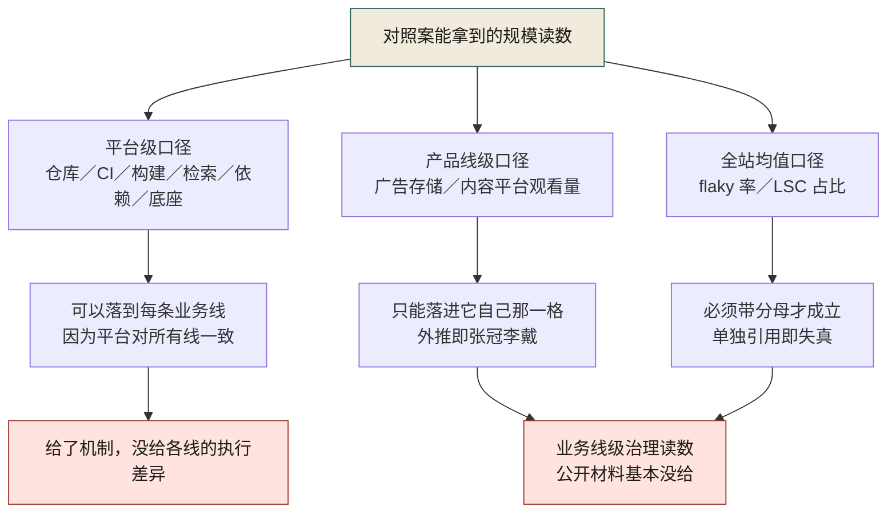
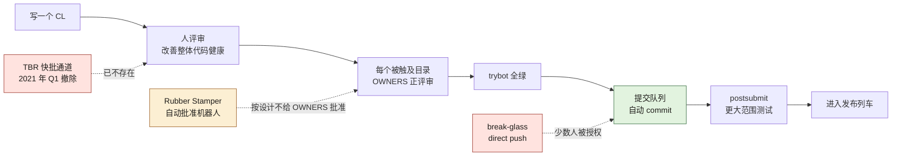
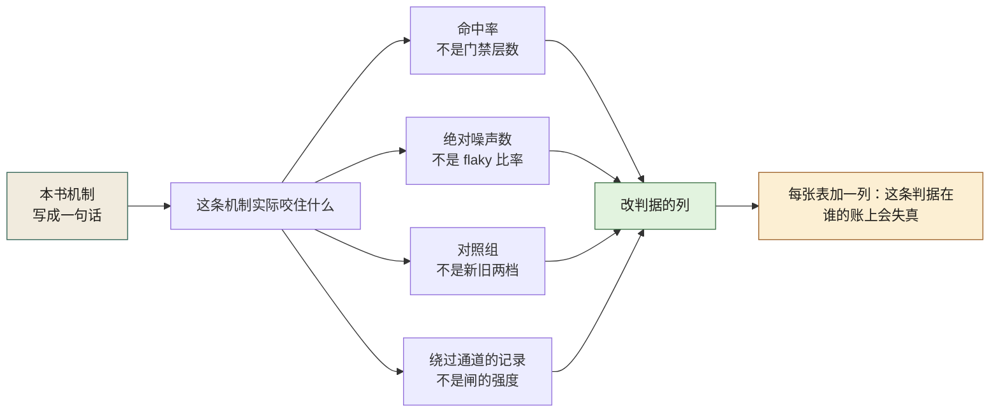

# 第八部分 · 案例五：Google（公开文献对照案）

> 本案例不进叙事，它进对照。四个虚构案回答"AI 兜不住的时候组织怎么接管"；本案例回答另一个问题——**当一家公司的工程治理规模大到有公开文献可查时，那些机制实际长成什么样，以及公开文献查不到的到底是哪几格。**
>
> 写法与四个虚构案分属两类证据口径：这里的公司是真名，材料全部来自公开出版物，本书没有访谈过任何人、没有接触过任何内部材料、没有叙述者。每条陈述都能顺着[公开证据档案](../public-evidence.md)点开核对。

---

## 一、口径声明

这份对照案的价值完全取决于一件事：**读者能不能把每一句话送回它的出处**。所以本节先把三类证据的差别摆平，再交代本机取证时撞到的可达面——因为这一格决定了后面那张逐业务线表为什么有那么多空白。

### 1.1 三类证据，三种生死

| 类别 | 谁在说话 | 数字从哪来 | 读者能否点开核对 | 归谁管 |
|------|----------|------------|----------------|--------|
| 四个虚构案（案例一至案例四） | 第一人称叙述者（我） | 本书自己构造，唯一事实来源是数字清单 | 不能——它是脱敏示范，不是事实 | 第十条守卫逐条对账（编号↔日期↔时间线↔登记） |
| 对照案（案例五） | 没有叙述者；说话的是公开出版物的作者 | 公开文献原文，逐字落盘后本地检索 | 能——档案里有链接与逐字原文 | 不进数字清单、不进时间线；引用必须挂条目号 |
| 理论章的公开参照（E1–E7） | 报告发布方（DORA、NIST、GitHub 等） | 报告自述口径 | 能 | 只作参照，不给虚构案的任何金额背书 |

三行里最容易出事的是第二行。它和第一行都住在"第八部分"，读者会自然地把它们当成同一种东西读，而它们的证据种类正好相反：第一行的数字是**编的但自洽**，第二行的数字是**别人写的且不保证自洽**。所以本书给对照案立的三条禁令是：

1. **不用第一人称**。这一篇里没有"我"，没有"我们当时赌的是"，最多写"书里写他们当时"。
2. **不发明事故编号**。四个虚构案的 `字母-四位数字` 编号体系是本书的叙事装置；对照案里没有一件事故是本书命名的，凡是原文只称"那次发布拦下了一整个渠道的构建"这种说法，就照这么写。
3. **不进时间线、角色卡与数字清单**。它没有角色，没有构造日期，也没有和别的案例可通约的金额。

### 1.2 可达面：这一篇能写什么，是被网络决定的

写作这台机器对外的可见面是有限且随时变的。2026-09-27 本机实测（详见档案的可达性台账），本案例材料来源分两种命运：

- **可用**：《Software Engineering at Google》免费在线章节（本机实际取到的是第 10、11、15、16、17、18、19、20、21、22、23、24、25 章）、Google Engineering Practices 的三页评审规范、Chromium 官方文档（`chromium.googlesource.com` 本机不可达，改用官方 GitHub 镜像的 raw 文件逐份落盘）、www.chromium.org 的 ChromeOS 发布页、F1 与 Megastore 两篇论文的出版方 PDF（vldb.org 与 cidrdb.org）、Gemini 技术报告的官方存储桶、YouTube 官方博客两篇（该域前两次 TLS 握手失败，第三次重试才成功——这一格也记进档案，因为"重试后拿到"与"直接拿到"对读者是两种可复现性）。
- **本机不可达**：Google SRE 站、Google Research 论文站、developers.google.com、support.google、about.google、source.android.com、cloud.google 全站、workspaceupdates 博客、chromium.googlesource.com（改用镜像）、美国证监会文件（自动化请求被拒）、维基百科、Alphabet 投资者站的财报 PDF。

这条账要写在正文而不是脚注里，因为它直接影响结论的形状：**SRE 站不可达意味着"发布与可靠性"这一节缺了 Google 自己的 SLO 与错误预算口径**，而那一格本书不打算用记忆里的说法填。凡是这种位置，本节后面的每张表都留了"没给的那一格"这一列。

顺带一条方法论：**同一来源的不同章节不能当成互相印证**。E8 到 E28 里有十四条出自同一本书（E28 与 E10 甚至同一页，只是不同段落），它们共享作者的口径、时点与视野（多为 2019–2020 年写作时点）。本书仍然全引，理由只有一个：可核。但不许写"多处独立材料都这么说"——那不是独立，是一次引述抄了十四遍。

本节引：档案条目总表 E8–E28（分类与可达性）；第十条守卫的适用边界见其自述。

---

## 二、规模的公开读数

对照案里能立得住的读数只有一种：**页面上写着、并且当场能逐字检索到的那一种**。下面这张表把本案例会用的读数一次摊开，最后一列是这条读数量不到的东西——它是这张表存在的理由，因为后面每个论证都会踩在这一列上。

| 读数 | 出处 | 口径 | 这条读数量不到的东西 |
|------|------|------|----------------------|
| 约 50,000 名工程师共用一座仓库 | E8 | 2019 年写作时点，"vast majority"未给百分比 | 量不到"哪些代码不在里面"——同一页明写 Chromium 与 Android 这类大型开源项目除外 |
| 每工作日 60,000 到 70,000 次提交 | E8 | 人与半自动流程合计（原文 "Between humans and semiautomated processes"） | 量不到其中多少由机器起草；2019 年的书里没有 AI 生成占比这一栏 |
| 仓库内容与元数据超过 80 TB；建客户端、加一个文件、提交一个未经评审的变更约 15 秒 | E8 | Piper 侧操作延迟 | 量不到一次**带评审与 trybot** 的完整周期有多长——这一格公开页上没数 |
| 每天超过 50,000 个独立变更、超过 40 亿个测试用例 | E10 | 持续集成口径 | 量不到单个团队的重跑预算；它是全站总量，除以谁都可以，除了当成 KPI |
| 预提交通过后再挂掉的概率低于 5%（原文 95%+ 通过后续测试） | E10 | 条件概率 | 不是"CI 通过率"；把它读成绿灯率就是把分母换掉了 |
| flaky 率约 0.15%，"意味着每天数千个 flake" | E12 | 全站均值 | 单个团队拿它当目标就是误用；0.15% 在大分母下不是"很低"，是噪声常驻 |
| LSC 每天生成、测试并提交 700 多个独立变更、每天触及 15,000 个以上文件；某次三天从仓库删掉超过 10 亿行 | E9 | 全站工程平台读数 | "10%–20% 的变更来自 LSC"是**某个项目内**的经验区间，不是全公司统计 |
| 每天数百万次构建、PB 级构建产物；"简单二进制常常依赖上万个构建 target" | E11 | 构建系统口径 | 同页的 83% 满意度是**公司内部调查**，样本与问卷不公开——本书把它归到"自评读数"这一类 |
| Code Search 每天处理远超 100 万条开发者查询；交叉引用索引一天更新一次 | E21 | 全站开发者工具口径 | "一秒延迟约等于每天 35 名空闲工程师"是书为量化延迟做的**换算示例**，不是编制数字 |
| Megastore 每天超过 30 亿次写、200 亿次读，主数据接近 1 PB | E16 | CIDR 2011 论文 | 全文 0 次出现 AdWords/AdMob（本机逐字检索实测）；把这台存储写成"广告系统的故事"就是张冠李戴 |
| F1：库超过 100 TB、每秒服务数十万请求、每天扫描数十万亿行、可用性达五个九、schema 变更全部非阻塞 | E15 | VLDB 2013 论文，仅 AdWords | 不外推到任何其它业务线；论文自己写的就是这一条产品线 |
| YouTube 每天 10 亿小时观看（2017-02）；过去 12 个月向音乐产业支付超过 40 亿美元、其中三成以上来自 UGC（2021-06） | E17 | 官方博客，日期决定读数 | 量不到 YouTube 的发布节奏（那一格来自 E20，两个来源不可合并成一句"YouTube 每天发布…"） |
| Borg 集群里超过一半的资源用量改由 rightsizing 自动化决定 | E25 | 内部计算底座 | 不等于对外售卖的 Google Cloud；两者在公开材料里是两件东西 |
| Gemini 训练用 TPUv4/v5e，TPUv4 以 4096 颗为一个 SuperPod；单一 Python 进程编排整场训练 | E18 | 官方技术报告 | 参数量、训练失败率与恢复口径**官方从未披露**；任何"参数量"说法无一手来源 |

这张表读下来的第一条结论不在任何一行里，在表的**分布**里：14 行读数中有 9 行是平台口径（仓库、CI、构建、代码检索、依赖、废弃、计算底座），2 行是单条产品线口径（F1 之于广告、E17 之于 YouTube），3 行是全站均值（flaky 率、LSC 比例、50,000 变更）。也就是说，公开材料给的规模读数**本来就没打算按业务线切**。这直接决定了第五节那张表的形状——不是作者偷懒，是读数的种类不允许。图 C5-1 把这三类口径各自的落点画出来：只有平台级那一支能铺到每条业务线上，另外两支一支只能留在自己那一格，一支离开分母就不成立。

**图 C5-1｜公开读数的三种口径，只有一种能落到业务线** — 平台级读数能推机制，推不出各条线的执行差异；把全站均值或单线读数当成全公司口径，是本案例最常见的两种误读。

本节引：E8、E9、E10、E11、E12、E15、E16、E17、E18、E21、E25。

---

## 三、门禁的公开形状

"门禁"在这份公开材料里不是一个抽象词，它是一组有名字的东西：OWNERS 文件、提交队列、trybot、直推权限、分支点、修复时限表。本节把可核的那几件摆开，重点放在**每道闸的绕过路径上写了什么**——因为一道没有绕过记录的闸，读者无从判断它到底有多硬。

### 3.1 权限即文本，执行在提交时

E8 给出的形状是：仓库里每个目录层级都可以放一份 OWNERS，列出允许批准该子树提交的人名；而因为版本控制系统本身是自研的，这份名单是**由 VCS 在提交动作上执行**的，不是靠钩子或仓库物理隔离。同一页还给出这条设计的真正卖点："ownership is just a text file"——团队转岗、组织重构时它跟着改，成本是一次编辑。

对照本书第 3 章"权限边界"的写法，这里有一处值得注意的顺序差别：本书习惯先问"策略怎么表达"，这份材料先问"谁在什么时候拒你"。E8 的原文把这件事说得很白——版本控制不只是版本控制，"version control is also about policy"。

### 3.2 Chromium 侧：同族文化里唯一可逐字核的那一份

E14 是本案例里最硬的一格，因为它是**开源项目的公开流程文档**，每一条都能点开。它给的判据形状大致是这样：

| 闸门 | 公开声明的判据 | 谁批准 | 绕过路径，与它在公开文档里的下场 |
|------|----------------|--------|----------------------------------|
| 评审本身 | "All change lists (CLs) must be reviewed." | 任一 reviewer | TBR（"too blessed by"式快批）"were removed in Q1 2021"——绕过通道是被**撤掉**的，不是被记日志的 |
| 目录所有权 | 改动触及的每个目录都要该目录 owner 的正评审 | 各目录 OWNERS | 自 2021-03-24 起，committers 不能再绕过评审与 OWNERS 批准；owner 本身必须是任满至少 3 个月的 committer |
| 机器人代批 | — | Rubber Stamper（自动批准机器人） | 原文写它"never provides OWNERS approval, by design"——代批机器人**按设计拿不到**所有权批准 |
| 提交队列 | 所有 trybot 全绿即自动提交 | 有 try job 权限的人打标签 | "the CQ will not process the patch unless the person setting the label has try job access"——权限判在人身上，不在标签身上 |
| 直推 | — | 少数人被授予 direct push | 原文限定在 break-glass 场景；有具名名单，不是"谁都能紧急一次" |
| 依赖入册 | 三方包必须至少两名工程师登记为 OWNERS 才可进 third_party | 两名维护人 | E23 明写 "Our third_party policies don't work for these unfortunately common scenarios."——政策管得住入库，管不住维护人散场 |
| 尺寸口径 | 100 行通常合理、1000 行通常过大；单文件 200 行可以，摊到 50 个文件通常过大 | reviewer | E22 的脚注承认同一套工具也用于审查触及成百上千文件的 LSC——尺寸口径**不适用于**必须原子执行的大规模变更 |
| 时限锚 | 评审请求应在一个工作日内被响应 | reviewer | 无绕过条款；文档给的是响应时限，不是批准时限——这两件事在本书第 21 章里也常被混用 |
| 变更可见性 | 变更在全公司范围内开放查看与评审 | 组织默认 | 无绕过条款；E22 把它写成信任的实现方式而非例外 |
| 测试边界 | small 测试必须单进程；medium 可跨进程、可访问 localhost | 变更作者 | E10 补一条方向相反的判据：待评审代码在预提交阶段**不应**连真实生产后端（安全与配额原因），到 staging 才可 |

这张表里最该抄的不是任何一条判据，是**最后两列的形状**：每道闸旁边都记着"谁能绕、绕了会怎样、哪条通道已经被撤了"。本书第 19 章的五层门禁只写了层名与判据，没写每层的绕过通道与撤除记录，因此读者无法判断这本书设计的闸比它声称的强还是弱。这是第五节反证里最先的一条。图 C5-2 把这张表画成一条链，三条旁路各自标在它接入的位置上——看主链看不出强度，看旁路的下落才看得出来。

**图 C5-2｜一条公开可核的提交链，和三条写在文档里的旁路** — 主链四道判据都有名字；三条旁路一条被撤、一条按设计拿不到权限、一条要求具名授权——绕过路径本身是被文档管理的对象。

### 3.3 机器批与人批：闸门每天被用多少次，公开页上有两个日读数

上面两张表全部是"人对着变更做判断"的判据。同一批公开材料里还有一组判据由机器执行，而且它给出了本书各章都没给的东西：**这道机器闸每天被使用多少次**。

E27 的原文是 "Reviewers click "Please Fix" thousands of times per day, and authors apply the automated fixes approximately 3,000 times per day."。两个数各自有主语：前者是评审者把机器建议转成一条修复请求的次数，后者是变更作者采纳自动修复的次数。这一格对本书第 24 章重要，因为那一章讨论"AI 提的建议由谁负责"时只有立场、没有统计量；这里给的是一个可分账的形状——建议的点击量与修复的采纳量**分开数**。一旦合并成一个"采纳率"，就再也看不出瓶颈在人身上还是在工具身上。

同一页还写着这套东西的入场券："We only deploy analysis tools with low false-positive rates"，理由紧随其后："User trust is extremely important for the success of static analysis tools."。先测假阳率再上线，这不是效率规则，是信任预算规则；它前面还有一句更适合抄进第 19 章："If you don't measure this, you can't fix problems."

然后是这一节最要紧的一条：机器闸也有绕过通道，而且豁免条件写在变更描述里。E27 的原文是 "Team-specific presubmits can make the large-scale change (LSC) process (see Large-Scale Changes) more difficult, so some are skipped for changes with "CLEANUP=" in the change description."。团队级预提交会为大规模变更流程让路，开关是一个字符串标记。它和 §3.2 表里那三条旁路是同一种形状：被文档承认、有触发条件、有适用范围，而不是"大家心里都知道可以跳"。

另一侧的判据来自 E28：预提交为什么不穷举——"The main reason is that it's too expensive."；以及测试可以怎么选——"selected based on a model that predicts their likelihood of detecting a failure."。后一句给本书第 13 章补了一个此前没写过的选项：按预测命中率选测试，而不是只按层数和快慢分层。它同时带来一个必须诚实记账的空白——公开页上没给这个模型的准确率，所以"按预测选"在这份材料里是形状可抄、效果不可核。

本节引：E8、E10、E11、E12、E13、E14、E22、E23、E27、E28。

---

## 四、发布与可靠性

这一节是全书"上线"部分最缺的一层的公开替身：**同一个组织里同时跑着好几套发布列车，而且它们的判据互不相容**。四案例只有一条线（上线就要灰度、要回滚、要刹车），本案例给出四种发法。

### 4.1 五班列车，各自的"迟到怎么办"

| 列车 | 公开节奏 | 谁把关 | 迟到怎么办 | 出处 |
|------|----------|--------|-----------|------|
| Search 二进制 | 书中自述从"一周一次还常靠运气"改到"稳定隔天一班" | 发布工程一组人 | 原文："if you're late for the release train, it will leave without you"；且"no amount of pleading or begging will get a feature into today's release after the deadline has passed" | E20 |
| Chrome 浏览器 | 每两周一版（major milestone）进稳定通道；原文另有一句 "which is then stabilized for three weeks before being shipped to stable"，本书只照抄这一句而不替它补主语；每第四个 milestone 额外维护六周 | 发布经理与其代表（原文点名安全团队） | 功能未 code complete 就在分支点 punt 到下一版；"all flag changes must land before the branch cut date" | E14 |
| Chrome 发布分支 | 越接近稳定发布日，合并标准越严 | 发布经理审所有对发布分支的合并 | 例外是"cherry-pick"这一动作本身被管理，而不是靠个人判断；书里那件 M59 的事是反过来——一个缺陷导致 Android 构建**整批**不发 beta 也不发 stable | E14 |
| ChromeOS | 4 周一循环、5 条渠道；Extended Stable 只对 enrolled 设备开放 | 渠道机制 | 靠渠道分层吸收：设备是否 enrolled 决定它能不能停 longer | E19 |
| YouTube | 书中自述每次发布都要 Build Cops、发布经理与其他志愿者；几乎每次都有多个 cherry-pick 与 respin；每次发布跑一轮 50 小时的远程 QA 人工回归 | 人（志愿者轮值） | 迟到就挤下一次 respin；书里把这一格当**反面教材**用：操作成本高到会诱发"再等等、再多测一点"的循环 | E20 |
| Google Maps | 未给固定间隔，给出取舍口径 | 发布责任人 | 原文："features are very important, but only very seldom is any feature so important that a release should be held for it"；并补一句职责定义——"One release responsibility is to protect the product from the developers." | E20 |
| 数据面（广告存储 F1） | 表结构变更随时发生 | 系统的非阻塞设计 | 不是"迟到"问题而是"停机不可接受"：原文写"Downtime or table locking during schema changes (e.g. adding indexes) is not acceptable"，并据此"We have designed F1 to make all schema changes fully non-blocking." | E15 |
| 端上应用（Android 生态） | 由设备多样性决定，不由团队决定 | 指标 | 承认"the sheer diversity of the more than two billion Android devices can make the prospect of qualifying a release overwhelming"，处理方式是把它当事实："not a problem, but a fact" | E20 |

表里最后两行值得单独说一句，因为它们把"发布"这个词拆成了两件事：**能发多快**与**多久让用户拿到一次**。E20 的原话是"how often a viable release is created can be separated from how often a user receives it"，并且更进一步——**具备发布能力本身就是收益**："Simply having the structures in place that enable continuous deployment generates the majority of the value, even if you don't actually push those releases out to users."，紧接的举例点名了 Search、Maps、YouTube 三条线。

这句对本书第 28 章（灰度发布）是一个方向的修正：那一章把灰度写成"把变更安全地铺给用户的手段"，而这里说真正买的的东西是**决策能力**——你能不能在不改代码的前提下，今天让某个特性上线或撤走。E20 给出的实现是 flag guard 全变更（"A key to reliable continuous releases is to make sure engineers "flag guard" all changes."），并要求在无法做对照实验时退到"change-neutral releases"——**所有新功能都关在 flag 后面，一次 rollout 唯一被测的东西是部署本身稳不稳**。这一格本书没有写。

### 4.2 两个公开故事，讲的是同一件事：谁有权说"不发"

E20 记了两件具体事，正好是决策点表的两端：

- 一个菲律宾小方言的搜索返回空白页。书中写他们跑遍办公室去数到底有多少人讲这种语言、是否每次都触发、这些人是否用 Google，最后把问题交给 Search 的资深副总裁；结论是延迟一次重要发布、先修这个 bug。
- 周五晚六点，六个工程师带着一份和 NBA 的合同冲进发布经理的工位，说必须赶上明天的比赛、否则违约；发布工程师的答复是：切一个新二进制并测它要四小时。书中紧接的解释是——规律发布的世界里错过这班，几小时后就赶上下一班。

两个故事合起来给的是本书第 21 章那句"对账、灰度、回滚、监控"里缺的一格：**判据的形状**。第一个故事的判据是"能不能拿到受影响人数"，拿到之后 SVP 签字；第二个故事的判据是"绕过列车的时间成本是多少"，算出来是四小时。两处都不是靠原则说服人，是靠一个当场可算的数。公开材料里同样给出时限锚的是另一处：E14 的优先级表 P0 一周内修、P1 四周内修、发布阻塞问题的 Urgent 修复标"2 days*"——带星号的那一格原文另有条件，本书不把它写成"两天"。

### 4.3 这一案能核到的可靠性读数只有五个，其中一个是内部自评

"发布与可靠性"最容易写坏的地方，是把三种不同生死的东西排成一行、当成同一件事。把本案例可核的读数逐个分类，正好是"缺口怎么写"的示范：

| 读数 | 种类 | 读者能复核到哪一层 | 出处 |
|------|------|--------------------|------|
| 可用性达五个九 | 论文自述的系统指标，且仅广告存储这一条线 | 只能信论文，原始监控不可见 | E15 |
| 预提交过了后续测试 95%+ 通过 | 全站条件概率 | 只在书中口径下成立；读成"CI 绿灯率"就换了分母 | E10 |
| flaky 率约 0.15%，等于每天数千个 flake | 全站均值 | 单团队不可核；当团队目标即误用 | E12 |
| 每次发布跑一轮 50 小时远程 QA 人工回归 | 单产品线自述的操作成本 | 只有 YouTube 这一格，不可当成 Google 的发布成本 | E20 |
| 83% 的工程师对构建系统满意（19 个工具里第 4 令人满意） | 公司内部调查 | 样本、问卷、口径均不公开，外部永远复核不了 | E11 |

最后一行是这一节的用处所在。本书第 24 章把度量按"能否外部复核"分类，但正文里从没给过一个纯自评读数的例子——对照案里有：83% 就是。这也是为什么第五节那张全业务线表宁肯留四行"没给"，也不拿内部满意度去凑一条产品线的治理强度。

本节引：E10、E11、E12、E14、E15、E19、E20。

---

## 五、逐业务线治理对照

用户的诉求其实是一句话：**把所有业务线都摆上**。这件事在本案例里能做，但做完的形状和预期不同：能做的是列出线、给出每线在公开材料里的那一格，而大部分格是空的。空的原因不藏在这里，藏在上一节的口径分布里——公开材料是按工程层写的。

### 5.1 全业务线对照表

图例：**有格** = 公开材料给了这一线自己的治理或可靠性读数；**门口** = 只给了"它在哪套机制里"这一句，没给执行；**没给** = 本机可核的公开材料里查不到这一格。

| 业务线 | 公开材料给的读数（逐字可核） | 条目 | 状态 | 没给的那一格 |
|--------|------------------------------|------|------|--------------|
| 搜索 | 书中自述 Search 的二进制发布从一周一次压到隔天一次；"火车不等人"对它成立的前提是下一班只在几小时之后 | E20 | 有格 | 搜索质量指标与发布判据的具体阈值 |
| 广告业务（论文里的系统名是 AdWords） | F1 作为 AdWords 的新存储系统，自 2012 年初起承载全部广告活动数据；库超 100 TB、五个九、schema 变更全非阻塞；"Any downtime has a significant revenue impact." | E15 | 有格 | 广告系统自己的评审与发布门禁 |
| YouTube | 单体 Python 大应用；Build Cops 与轮值发布经理；几乎每次发布都有 cherry-pick 与 respin；每次发布 50 小时远程人工回归；每天 10 亿小时观看（2017）；12 个月向音乐产业付超 40 亿美元（2021） | E20、E17 | 有格 | 这一线现在的发布间隔（书中写的是当时的痛，不是现行 SLA） |
| Gmail 与 Workspace | 只有一句："public-facing products like Search, Gmail, our advertising products, our Google Cloud Platform offerings" 与内部基础设施同在一座仓库 | E8 | 门口 | 协作套件的发布与回滚治理，公开材料没给这一格 |
| Google Cloud（对外售卖） | GCP offerings 在同一座仓库；AppEngine 因付费客户的业务理由，把运行时与编译器强制切换推迟"almost three years"，连带 AppEngine 依赖闭包里所有 C++ 代码都要跨版本兼容 | E8、E23 | 有格 | 对外 SLA 与内部 rightsizing 自动化之间的换算关系 |
| Android | 明确在 monorepo **之外**（"except large open source projects like Chromium and Android"）；二十亿以上 Android 设备的多样性被当成事实处理；部分大型应用对**部署本身**做 A/B，对照组是旧版本重发 | E8、E20 | 有格 | AOSP 侧的评审门禁细节（source.android.com 本机不可达） |
| Chrome 浏览器 | 每两周一版；分支后稳定三周；每第四个 milestone 多维护六周；分支点前未 code complete 即 punt；flag 改动须在 branch cut 前落地；RM 审所有发布分支合并；发布后观察 canary 24 小时 | E14 | 有格 | 这些判据在 Google 其它产品线是否同样适用——文档自己只说 Chromium |
| ChromeOS | 4 周一循环、5 条渠道；Extended Stable 只对 enrolled 设备 | E19 | 有格 | 与 Chrome 浏览器同一支代码的合并规则 |
| Maps | 未给节奏，给出取舍口径：极少有功能值得压住一次发布；发布职责之一是替产品挡住开发者 | E20 | 有格 | 地图数据面（底图更新）的治理，公开材料没给这一格 |
| Devices／Pixel 硬件 | — | — | 没给 | 硬件节拍与软件发布列车的耦合，本机可核材料里没有 |
| Wear OS／Fitbit／健康 | — | — | 没给 | 同上；这一格还额外缺合规口径（不可达名单里有对外支持站） |
| DeepMind／Gemini | 训练用 TPUv4/v5e；TPUv4 以 4096 颗为一个 SuperPod、各接专用光交换；"allows a single Python process to orchestrate the entire training run" | E18 | 有格 | 模型变更的评审门禁、训练失败率、恢复口径、参数量——官方未披露 |
| Waymo | — | — | 没给 | 自动驾驶的安全放行判据，本机不可达；本书不用二手报道填这一格 |
| Other Bets（生命科学、无人机等） | — | — | 没给 | 分部口径的公开材料只有财务披露，而投资者站 PDF 本机取不到 |
| 内部工程平台（仓库、CI、构建、代码检索、依赖、废弃） | 一整套：OWNERS 即文本并由 VCS 执行、One Version、每天 40 亿测试用例、95%+ 预提交命中、0.15% flaky 与全站 flake 分类器、LSC 每天 700 变更、废弃要有执行机制 | E8、E9、E10、E11、E12、E21、E23、E24 | 有格 | 这一层的成本账（多少工程师养这套）只给了数量级：E9 是"few dozen engineers supporting tens of thousands of others" |
| 数据面底座（Megastore／F1／Spanner 一族） | Megastore 每天 30 亿写／200 亿读、近 1 PB 主数据；F1 全非阻塞 schema 变更 | E16、E15 | 有格 | 交互服务存储这一族的选型判据（两篇论文各写各的系统，没写怎么选） |

**逐格统计（本表自己的读数，16 行）**：有格 11 行／门口 1 行／没给 4 行。而 11 行"有格"里，只有 6 行给的是这一线**自己的**治理机制（搜索、广告、YouTube、Cloud、Chrome、ChromeOS），其余 5 行给的是平台层读数被借到这一行上——借得最狠的是 Android 那一行，它唯一硬的一句其实是"它在仓库之外"。

门口那一行（Gmail 与 Workspace）值得停一下。它的全部证据是 E8 里那句点名，而那句点是用来划**仓库边界**的，不是用来说 Workspace 治理的。这类"被同一句话顺带点名"的格子最容易在扩写时升格成事实——正文一旦写成"Gmail 也走同一套评审门禁"，读者就会把它当成有据可依的陈述，而它其实是读者自己的推论。本书的处理是让它停在"门口"这一档，不硬分到有格。

### 5.2 空白格怎么读

四行"没给"里有三行是硬件或实体世界（Devices、Wearables、Waymo），一行是财务披露口径拿不到的 Other Bets。它们共同指向一件事：**公开材料的分布不是按业务线切的，而是按"有没有一份值得公开写的工程文档"切的**。有论文（F1、Megastore）、有免费在线书（第 15 到 25 章）、有开源流程文档（Chromium）、有技术报告（Gemini）的地方就有格；只有产品发布和用户条款的地方就没格。

### 5.3 六条有自己治理读数的线，竖着排一次

上一节的表按业务线横切，最后一列是"缺什么"。这里把其中六条**给了自己那一线治理机制**的线（搜索、广告、YouTube、Cloud、Chrome、ChromeOS）竖着排一次，四列都取自本节上面已经引用过的读数，不引入新数：

| 线 | 发布单元 | 延后一次的代价 | 谁能说"这班不带你的功能" | 这一线的治理读数停在哪一步 |
|----|----------|----------------|--------------------------|------------------------------|
| 搜索 | 一个二进制，隔天一班 | 错过分支点，功能整班 punt 到下一次 | 发布工程（判据是分支点，不是人） | 到"发得出去"，没到"发到多少用户" |
| 广告（F1） | 一次表结构在线变更 | 不可延后——停机直接进营收账 | 存储系统的设计本身（非阻塞是判据） | 到"不停机"，没到"谁批准这次变更" |
| YouTube | 一轮 50 小时人工回归加 respin | 极高，高到诱发"再等等"的循环 | 轮值的 Build Cops 与发布经理（人） | 到"谁在扛"，没到"自动化替代到什么程度" |
| Cloud | 一次运行时/编译器切换 | 三年（AppEngine 一例） | 付费客户所在的业务线 | 到"能被商业理由推迟"，没到"推迟的账怎么算" |
| Chrome | 一个 milestone，双周；分支后三周稳定 | 未 code complete 即 punt；flag 改动必须在分支点前落地 | 发布经理，安全团队代表可拦 | 到"谁能拦合并"，没到"拦下的判据阈值" |
| ChromeOS | 4 周一循环、5 条渠道 | 靠渠道分层吸收；设备未 enrolled 就停不住 | 渠道机制 | 到"分层存在"，没到"谁决定某设备进哪一层" |

这张竖表的用处不在六行本身，在最后一列：**六条线全部停在"机制存在"这一步，没有一条给出阈值**。也就是说公开材料能证明 Google 有分支点、有渠道、有非阻塞变更，但证明不了"达到什么数值才放行"。这正好和第三节的形状相反——Chromium 那份文档给出的几乎都是阈值（几天修、多少行、几个月资格）。同一个组织，开源侧的门槛写得比自营产品侧清楚得多，这不是治理强弱的证据，是**公开口径的选择**：流程文档写给贡献者看，必须可执行；书稿写给工程师看，只需可理解。

本书读者要抄的是这个差别本身：如果你要给自家门禁写文档，**写给"外人也能照做"的那一份才会长出阈值列**。本书第 19 章的闸门清单是写给作者自己看的，所以它有理据没有数。

这一条对读者的用法有个具体要求：拿这张表去和四个虚构案对照时，**不许把「没给」读成「没有」**。它只说明本书在本机的可达面上取不到，不说明那一格在现实中是空的。BOOK_SPEC 对这一条的写法是：缺口要写成缺口，不许用邻近业务线的数字凑，也不许挂一个 `[待核实]` 把推测留在句子里——所以这一节的四行空白没有编号、没有"业内通常"，只有"没给"。

本节引：E8、E9、E10、E11、E12、E14、E15、E16、E17、E18、E19、E20、E21、E23、E24。

---

## 六、各业务线的差异

第五节的表按线横切；本节竖着切，问的是**差异从哪来**。公开材料给出的差别可以归到三条轴上，每条轴都能改动本书某一章的默认假设。

### 6.1 三条轴

**轴一：交付物的形态，决定门禁能自动到什么程度。** 同样是"变更"，服务端二进制的变更单元是一个 CL，评审与 trybot 都能作用在它身上；广告数据的变更单元是一次表结构调整，F1 的判据是它必须在线做完（E15）；模型的变更单元是一场训练——E18 给出的公开描述里最贴治理的一句是"allows a single Python process to orchestrate the entire training run, dramatically simplifying the development workflow"，它说的是**编排简便**，不是评审简便：一场训练跑完才是一个可评审的对象，中间态无法逐行 diff。而 Pixel 与 Wearables 那一族，交付物是硬件节拍，公开材料根本没给治理格。**这条轴的推论是：门禁层数不是设计变量，交付形态才是。** 本书第 19 章把五层门禁写成一个组织可以自行加严的层级，却从未说清"你交付的是哪一种变更"。

**轴二：停机的钱在谁的账上，决定谁能说"不发"。** E15 那句"Any downtime has a significant revenue impact."把决策权指向很清楚的一边；E23 的 AppEngine 段是同一件事的另一面——付费客户可以（并且确实）把全站级别的运行时切换推迟近三年，代价是"every piece of C++ code in the transitive closure of dependencies from AppEngine had to be compatible with the older compiler and standard library versions"。同一条链上还有第三个证据：E21 的换算示例说明**开发者等待时间**也是一笔可折算的钱。**这条轴的推论是：一张发布判据表必须同时给出三方的账——用户、上游平台、等待的工程师**；本书第 26 章的组织治理写了"谁签字"，没写"签字方能不能用商业理由否决技术路线，以及否决的成本落在哪一层"。

**轴三：一次回归的成本，决定列车能开多密。** Search 的隔天一班（E20）、Chrome 的双周加三周稳定期（E14）、YouTube 的 50 小时人工回归（E20）是三种完全不同的成本结构，而它们出自同一家公司、同一本书、同一章。E20 对 YouTube 那一格的诊断尤其直白：操作成本高到诱发"再等等"的循环，而循环一旦形成，上次做发布的人已经烧尽离职，"now nobody even knows how to troubleshoot those strange crashes"。**这条轴的推论最硬：发布间隔不是团队选择，是回归成本的函数；想加密列车必须先降回归成本，光改流程不改架构没用。** E20 明说了要"resist the obvious operational fixes and invest in long-term architectural changes"。

### 6.2 差异的另一半是口径差异

上面三条轴讲的都能落到机制。剩下这一半是元层的，但必须写：**有些线之间的"治理差异"，实际是公开口径的差异。** Wearables、Waymo、Devices 与 Maps 数据面之间的差别，本案例无从判断——因为公开材料没给那一格。把"这一线查不到"写成"这一线治理不同"，是本案例最容易犯也最难被发现的一种错。本书的选择是把这一类单列出来，并在每张表的最后一列留着它。

本节引：E15、E18、E20、E21、E23。

---

## 七、对本书机制的反证

这一节是本案例唯一对本书行使否决权的地方，也是它值得存在的原因。规则：**每条反证必须指明它打中哪一章的哪个写法，并给出公开读数作为反例。** 只说"值得借鉴"不叫反证。

| 本书的写法 | 反例读数 | 打中的位置 | 这条指认的性质 |
|------------|----------|-----------|----------------|
| 第 19 章：五层门禁，层数越多越稳 | 预提交通过后 95%+ 不在后续挂掉（E10）；同页承认工程师不该被 flaky 的失败挡在预提交上 | 第 19 章的门禁分层表 | 度量口径缺位：真正被治理的是**命中率**，不是层数；表里没有这一列 |
| 第 19 章：每层门禁写明判据 | Chromium 每道闸都另记"谁能绕、哪条通道已撤除"（E14：TBR 2021 Q1 撤、committers 自 2021-03-24 不能再绕、Rubber Stamper 按设计不给 OWNERS 批准、break-glass 需具名授权） | 第 19 章的闸门清单 | 结构缺位：本书的闸门清单没有"绕过通道"这一列 |
| 第 27 章：变更分类决定版本号位（破坏性→主位） | "The idea that SemVer patch versions, which in theory are only changing implementation details, are “safe” changes absolutely runs afoul of Google’s experience with Hyrum’s Law"（E23）；给出的替代是跑下游测试 | 第 27 章的版本位判据表 | 判据本身被否定：分类是估计，估计会被 Hyrum 依赖击穿 |
| 第 13 章：flaky 率低就是健康 | 0.15% 且"implies thousands of flakes every day"（E12）；同族还有 mid-air collision"happens most days at our scale"（E10） | 第 13 章的重试预算段 | 比率与分母混用：本书用比率下结论，公开读数用绝对数下结论 |
| 第 28 章：灰度到小流量即可判断质量 | "we could expect a statistically significant change in user metrics simply from pushing an update"，因此需要 placebo 对照（E20） | 第 28 章的灰度判据 | 缺一个对照组：本书的灰度只比新旧配置，没比"重发旧版本" |
| 第 3 章：权限即代码 | "ownership is just a text file"，强度来自 VCS 在提交时执行它（E8） | 第 3 章的权限边界小节 | 表达形式不是保障，执行点才是；本书只写了表达 |
| 第 25 章：文档与令牌治理靠 owner | "without explicit owners, a deprecation process is unlikely to make meaningful progress"，且强制排期必须有执行机制、被充分警告后可以打断不合规使用者（E24） | 第 25 章的退役段 | 缺执行机制：本书写了 owner 与截止日，没写谁有权打断不合规依赖方 |
| 第 26 章：治理靠具名签字方 | AppEngine 以付费客户为由推迟全站运行时切换近三年（E23） | 第 26 章的签字方名单 | 否决权缺失：本书的签字表只有"谁能批"，没有"谁能用商业理由推迟" |
| 第 24 章：AI 评审只讨论"建议由谁负责" | 评审者一天点击"Please Fix"数千次、作者一天采纳自动修复约 3,000 次；分析器只上线低假阳率的那一种（E27） | 第 24 章的 AI 评审段 | 缺统计量：建议的点击量与修复的采纳量要分开数，本书两个都没数 |
| 第 19 章：预提交层的判据是"这一层该跑完什么" | 预提交不穷举的理由是经济性（"it's too expensive"），层内测试可按预测发现失败的可能性来选（E28） | 第 19 章门禁分层表的判据列 | 缺一种选择口径：跑哪些测试可以是预测命中率排序，本书只按快慢与层级排 |

十条反证里有四条打在度量口径上（命中率、噪声的绝对数、对照组、机器闸的日读数），三条打在结构设计上（绕过通道列、执行点、否决权），两条打在判据本身（版本位分类、灰度判据），一条打在层内选择口径上（预提交跑哪些测试）。**没有一条反证是「人家做得好我们做得差」**——本案例没有资格说这句，因为公开材料拿不到内部执行数据。反证能做的只有一件事：让本书某一句从"看起来完整"变成"缺了一列"。图 C5-3 是这张表的形状而不是内容——四列统计量并排指向同一个动作：改列，不改章。

**图 C5-3｜反证的形状：不是比较强弱，是补上缺失的那一列** — 四条被打中的机制各自指向一个统计量的名字；补列的动作比批评更有用，因为它可以当场落到某一张表上。

本节引：E8、E10、E12、E14、E20、E23、E24、E27、E28。

---

## 八、可抄与不可抄

最后把这份材料折成两种东西：能抄的形状，和抄了会失效的形状。判据只有一条——**抄它的前提，你的组织里在不在**。

### 8.1 能抄（形状，不含规模）

| 可抄的形状 | 抄的前提 | 落到本书哪一节 |
|------------|----------|----------------|
| OWNERS 即文本文件，随组织调整而改，由版本控制或提交动作在执行点拒 | 你的提交路径上必须真有一个执行点 | 第 3 章权限边界、第 11 章留缝 |
| 自动批准机器人按设计拿不到所有权批准（把"谁给的批准是什么性质"写进工具） | 你的审批链要区分批准的类型 | 第 2 章人在回路、第 19 章门禁 |
| 绕过通道本身进文档管理：具名授权、有撤除记录 | 愿意承认"闸有旁路"并把它写下来 | 第 19 章闸门清单加一列 |
| 一个工作日内响应评审请求；100 行通常合理、摊到 50 个文件通常过大 | 时限与尺寸口径只写形状，不写成 KPI | 第 21 章时限锚、第 24 章评审 |
| flag guard 全变更 + change-neutral release（唯一被测的是部署本身） | 配置能在不发版的情况下改，且有安全的配置下发 | 第 28 章灰度、第 21 章回滚 |
| 发布列车的"迟到即下一班"，并把下一班的时间压到小时级 | 必须先降回归成本，否则这条等于违约 | 第 28 章发布节奏 |
| 对部署本身做 A/B，对照组是旧版本重发 | 流量足够切两组且有统计管线 | 第 28 章灰度判据 |
| 强制废弃要有执行机制：充分警告后，有权打断不合规的依赖方 | 授权要写在件上，不是写在会上 | 第 25 章退役治理 |
| 优先级修复时限表（P0／P1／发布阻塞各一档，星号条件照抄其存在） | 时限锚要挂在会过期的东西上 | 第 19 章、第 20 章风控不可绕过 |
| 评审与文档同流程：把重要文档挪进与代码同样的版本控制、文档有自己的 owner、文档改动走既有评审流程（E26） | 愿意把文档当代码而不是附录 | 第 25 章文档与 ADR 治理 |

### 8.2 不可抄（抄了会在你的组织里失效）

| 看起来像一件事 | 它的隐含前提 | 在你这里为什么失效 |
|----------------|--------------|--------------------|
| 一座 monorepo | 版本控制系统是自研的，因为自研，原文写 "By virtue of Piper being an in-house product, we have the ability to customize it and enforce whatever source control policies we choose."（E8） | 用现成 VCS 的组织要把政策实现在钩子或仓库权限上，表达与执行分离；把 monorepo 当成治理来源是把载体当成了机制 |
| One Version（每个依赖在稳态下只有一个版本可选） | 有能力在提交前跑全站下游测试来证明变更安全（E23 的替代判据） | 没有那个测试预算时，唯一版本就是一条单点故障；本书第 14 章立包时的可行做法是锁版本加迁移窗口 |
| 全站 flake 分类器 | 统计分类器覆盖全站、由平台组维护（E10） | 十几个团队规模下，重跑一次的成本低于养一个分类器；这条在本书第 13 章是明写的取舍 |
| rightsizing 自动化接管过半用量 | 有一整个内部计算底座（Borg）与多年演进（E25） | 抄"自动化配资源"之前先问资源申请由谁拒；没有拒绝权时，自动化只会把参数漂移得更快——E25 讲的正是在没有它之前"配置参数自己长成事故源" |
| LSC 平台（几十人养几万人） | 提交队列、代码检索、构建图三者都在（E9、E21、E11） | 缺任何一件，大规模变更就退化成一次性人肉脚本，且没有回滚位；本书第 16 章的重构批次是按季度做的，原因就在这 |
| "火车不等人"当作口号 | 下一班在几小时内（E20 自己给的前提） | 交付物是端上包体或硬件节拍时，错过分支点等于违约——第二节的 NBA 故事里发布工程师拒的底气正是"隔天一班" |
| 把 95%+ 预提交命中率当目标去追 | 命中率是每天数十万变更规模下的统计结果（E10） | 小分母下它是噪声；把它写成 KPI 会让团队去减少预提交覆盖，命中率反而升高——这是一条本书第 24 章写过的古德哈特形状 |

### 8.3 怎么核验这一篇（给读者的三步，含失败的样子）

1. **对条目**。文中任意一句关于该公司的陈述，顺着节末的"本节引"到[公开证据档案](../public-evidence.md)，逐字原文必须能对上；对不上就是本案例的缺陷，请当作错处报告。
2. **对可达面**。档案里每条都写了取回通道与日期；若你所在网络能通 sre.google 或 research.google，你会读到比这一篇更宽的材料——那不是本篇的结论错，是本篇的**可达面**与你的不同。缺的那些格（错误预算、SLO、内部事故复盘）在正文里全以"没给"的形式留位。
3. **对边界**。检查这一篇有没有出现第一人称、有没有 `字母-四位数字` 编号、有没有和四个虚构案共用任何数字。三项有一个不成立，就是本书违约。

### 8.4 这一篇读不出来的东西

诚实账最后一笔。以下四件是本案例结构上读不出、也不许推测的：

- **各业务线的事故数与损失金额**。公开材料不披露，财务披露按分部而非按事故；本书不为任何一条线构造金额。
- **AI 生成代码在评审与门禁里的当前位置**。E8 到 E28 里那十四条书稿全部写于 2019–2020 年（论文与官方博客另有各自年份），没有一条读数含 AI 起草占比。第二节的 60,000–70,000 提交/日那条尤其容易被误当成"含 AI"——原文只说"人与半自动流程"。这一格只能由 E1 那一类 2025 年的报告去讨论，而那是理论章的公开参照，不进对照案。
- **门禁的实际强度**。公开文档写的是判据与撤除记录，写不出"这条闸上个月拦下多少次、被绕过多少次"——那是内部数据。所以第七节的十条反证全部指向**表的列缺失**，没有一条断言对方执行得好或坏。
- **这套机制的组织成本**。E9 只给到"few dozen engineers supporting tens of thousands of others"这一个数量级；本书第 21 章要的那份成本账，公开材料没有给。

本节引：E8、E9、E10、E11、E13、E14、E18、E20、E21、E23、E24、E25。

---

### 8.5 给同行的清单（对照案版）

案例章在这个位置本来都有一张给同行的清单。对照案的这张只放**能当场做完的动作**，不做判断——因为判断已经交给第七节的反证表了。

1. 在你的闸门清单上加一列"绕过通道"：这一层谁能绕、绕了要谁签、有没有一条已经撤掉。空着的那一格就是你还没想清楚的那道闸。
2. 把"评审通过率／CI 通过率"这类层数指标，换成"预提交通过后再挂掉的概率"这一条，并写出你的分母（每天变更数）。分母小于四位数的团队，不必养 flake 分类器。
3. 检查你的版本位判据：有没有把"只是实现细节的补丁版本"当成安全变更。若下游有人依赖未承诺的可观察行为，分类判据要换成"跑过受影响下游的测试"。
4. 在下一次端上发布里，把对照组设成"旧版本重发一次"，量一次"仅仅推了一次更新"带来的指标偏移。这一步不需要新工具，需要一个愿意重发的窗口。
5. 给每一次强制退役写出执行机制：警告期多久、谁有权在期满后打断不合规依赖方、打断后谁负责迁移。写不出打断动作的退役，就是永远不结束的提醒。
6. 把"错过发布窗口"的代价算成一个具体小时数（像那四小时切新二进制那样），公开它。这个数是团队能不能守住"迟到即下一班"的唯一凭据。
7. 在你的签字表上加一栏"谁能以商业理由推迟技术路线"，并写出推迟的成本落在哪一层的哪个闭包里。AppEngine 那一格的代价是三年的跨版本兼容，落在整个依赖闭包上。
