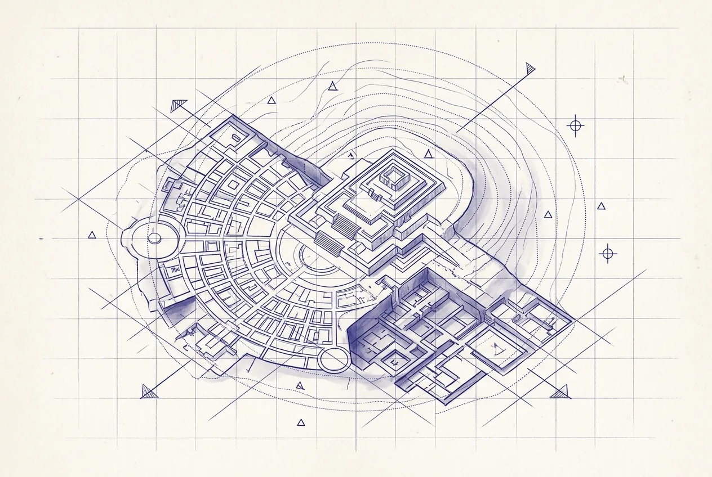

  

    
  

  

    
02

    
第二部分

    <h1>考古</h1>
    
治理一个你看不见的系统，和蒙着眼睛开车没有区别。接手大型遗留系统的第一步——不写代码，先画图。

  

  
本部分处理大规模遗留系统的考古方法：盘点数百个仓库、画四张图，用 WIRED/NOT WIRED 剖开依赖真相，再让 AI 辅助读懂祖传代码。一条红线贯穿始终：AI 加速的是数据收集，判断永远归人。

  

    <a class="part-chapter-card" href="#/manuscript/22-第5章-大规模考古画图.md">
      第 5 章
      大规模考古画图
      大规模仓库盘点；四张图
    </a>
    <a class="part-chapter-card" href="#/manuscript/23-第6章-跨团队依赖分析.md">
      第 6 章
      跨团队依赖分析
      循环依赖、反向依赖、孤儿模块、WIRED/NOT WIRED
    </a>
    <a class="part-chapter-card" href="#/manuscript/24-第7章-AI读懂祖传代码.md">
      第 7 章
      AI 读懂祖传代码
      三种考古法；AI 把推测写成确定
    </a>
  

