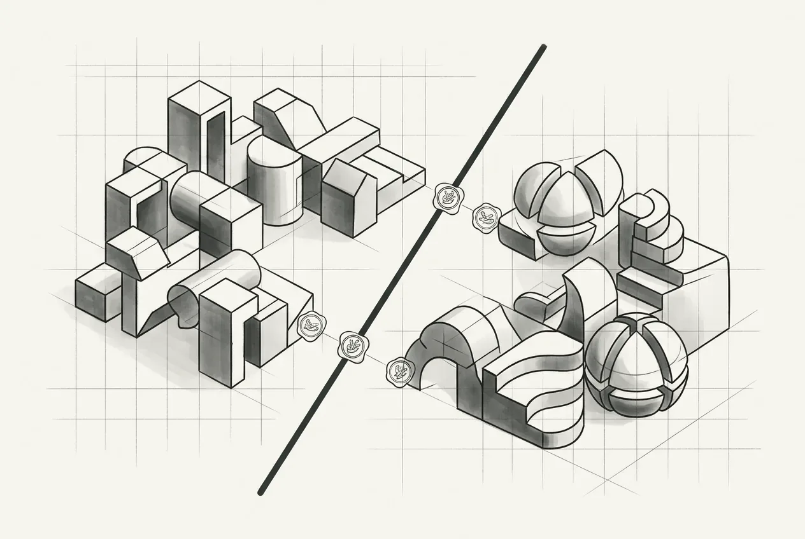

  

    
  

  

    
03

    
第三部分

    <h1>立界</h1>
    
边界不写进代码，就只是会议纪要。先立界，再谈重构。

  

  
目标架构的三层划分与依赖单向原则，落到三种契约与 import-linter 的自动检查，最终沉淀为"留缝"——生成便宜、演化昂贵，这是 AI 时代最重要的架构判断。

  

    <a class="part-chapter-card" href="#/manuscript/ch13-第8章-目标架构.md">
      第 8 章
      目标架构
      三层划分；依赖单向；边界测出来不是画出来
    </a>
    <a class="part-chapter-card" href="#/manuscript/ch14-第9章-契约先行.md">
      第 9 章
      契约先行
      三种契约；用 AI 生成、人审核
    </a>
    <a class="part-chapter-card" href="#/manuscript/ch15-第10章-边界变测试.md">
      第 10 章
      边界变测试
      import-linter；不变量；扩展点自动检查
    </a>
    <a class="part-chapter-card" href="#/manuscript/ch16-第11章-留缝.md">
      第 11 章
      留缝
      核心命题锚点；生成便宜、演化昂贵；留缝五步法
    </a>
  

