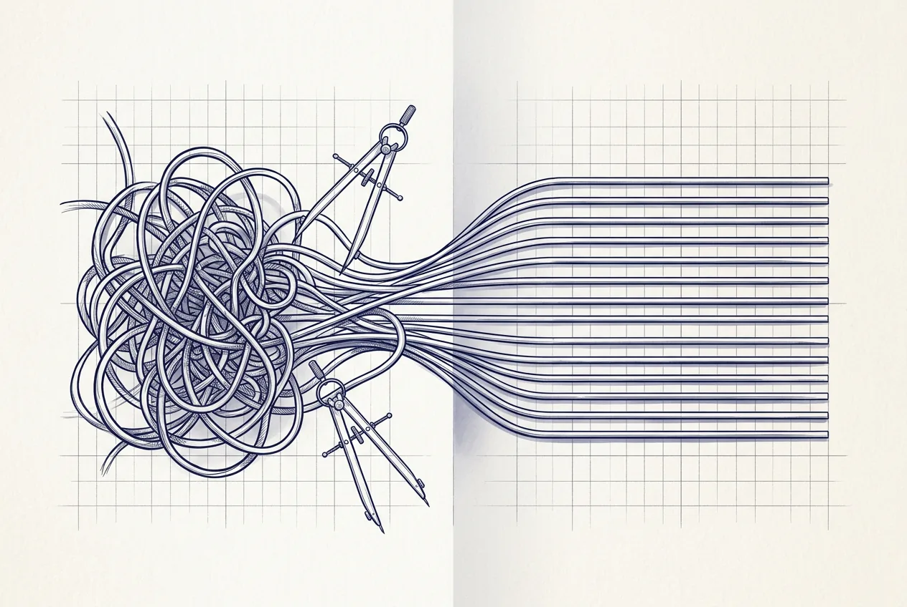

  

    
  

  

    
04

    
第四部分

    <h1>重构</h1>
    
重构不是把旧代码重写一遍，是在不停车的前提下换引擎。

  

  
本部分给出四条可复用的重构路径：数据与日志分家、单文件 API 的 router 拆分、Python 立包与兼容层双跑、前端解耦与多端设计系统。共同前提是先稳定、再抽取、每步可回滚。

  

    <a class="part-chapter-card" href="#/manuscript/ch17-第12章-数据与日志分家.md">
      第 12 章
      数据与日志分家
      数据 / 日志 / 事件三分家
    </a>
    <a class="part-chapter-card" href="#/manuscript/ch18-第13章-单文件API到router+nginx.md">
      第 13 章
      单文件 API 到 router+nginx
      单文件拆分；router / service / repository
    </a>
    <a class="part-chapter-card" href="#/manuscript/ch19-第14章-Python立包与迁移.md">
      第 14 章
      Python 立包与迁移
      先稳定再抽取；兼容层双跑
    </a>
    <a class="part-chapter-card" href="#/manuscript/ch20-第15章-前端解耦多端设计系统.md">
      第 15 章
      前端解耦多端设计系统
      设计令牌即契约；多端统一
    </a>
  

