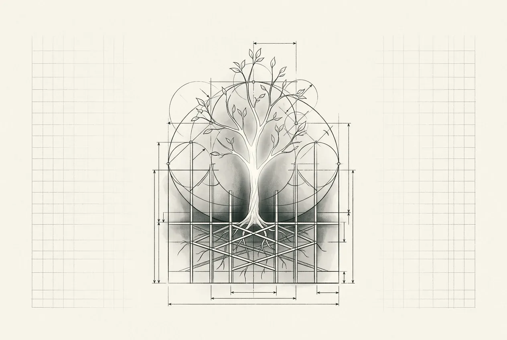

  

    
  

  

    
05

    
第五部分

    <h1>新功能</h1>
    
新功能长在新界上，不长在旧疤上——新域要立得住，契约要共享一份。

  

  
从聊天功能独立成域开始，到多端 BFF 的契约共享，再到亿级流量下的大促削峰与多活。本部分示范：在已被 AI 改写过的代码库上，新功能如何带着边界和风控钩子位长出来。

  

    <a class="part-chapter-card" href="#/manuscript/29-第16章-聊天功能.md">
      第 16 章
      聊天功能
      聊天独立成域；风控钩子位
    </a>
    <a class="part-chapter-card" href="#/manuscript/30-第17章-多端BFF.md">
      第 17 章
      多端 BFF
      多端 BFF；契约共享一份
    </a>
    <a class="part-chapter-card" href="#/manuscript/31-第18章-亿级流量.md">
      第 18 章
      亿级流量
      大促削峰；多活
    </a>
  

