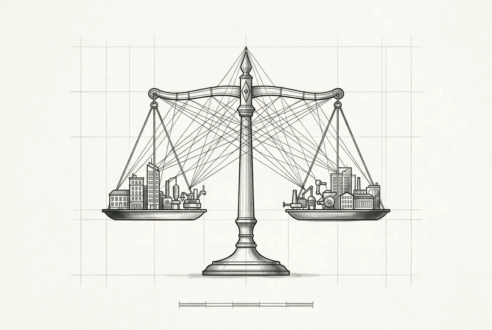

  

    
  

  

    
07

    
第七部分

    <h1>治理</h1>
    
治理不是流程，是让正确的做法成为最省事的做法。

  

  
提示词成为被管理的接口资产；AI 评审与幻觉的三类型处置；ADR / RFC / 设计令牌三种文档即代码；最后落到组织与契约两级治理——委员会、章程、KPI、变更分级与跨团队签字。

  

    <a class="part-chapter-card" href="#/manuscript/ch28-第23章-提示词工程与归档.md">
      第 23 章
      提示词工程与归档
      提示词即接口；归档机制；留痕监控边界
    </a>
    <a class="part-chapter-card" href="#/manuscript/ch29-第24章-AI评审与幻觉处理.md">
      第 24 章
      AI 评审与幻觉处理
      幻觉三类型；回答第 2/11/27 章三处遗留
    </a>
    <a class="part-chapter-card" href="#/manuscript/ch30-第25章-文档ADR-RFC-设计令牌治理.md">
      第 25 章
      文档 ADR/RFC/设计令牌治理
      ADR / RFC / 设计令牌
    </a>
    <a class="part-chapter-card" href="#/manuscript/ch31-第26章-组织治理.md">
      第 26 章
      组织治理
      组织治理锚点；委员会、章程、KPI
    </a>
    <a class="part-chapter-card" href="#/manuscript/ch32-第27章-契约治理.md">
      第 27 章
      契约治理
      契约治理锚点；变更分级、跨团队签字
    </a>
  

