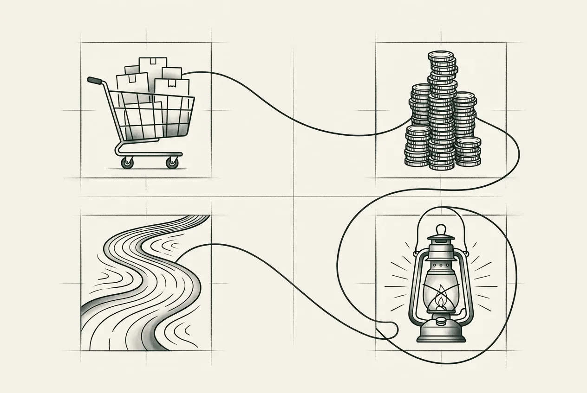

  

    
  

  

    
08

    
第八部分

    <h1>四案例</h1>
    
四个规模迥异的组织，同一套治理三原则的四种加严形态。

  

  
从 300 人电商平台的契约先行，到 2300 人交易所的精度铁律，到 32 人量化基金的四道闸门，再到 10 人安全初创的权限矩阵——四个等权的第一人称案例研究，统一八节模板，交叉启示留给第九部分。

  

    <a class="part-chapter-card" href="#/manuscript/15-第28章-灰度发布.md">
      第 28 章
      灰度发布
      灰度发布锚点；分层灰度、自动刹车、回滚矩阵
    </a>
    <a class="part-chapter-card" href="#/manuscript/44-案例一-300人电商平台.md">
      案例一
      300 人电商平台
      契约先行落地
    </a>
    <a class="part-chapter-card" href="#/manuscript/45-案例二-海星交易所.md">
      案例二
      海星交易所
      2300 人加密交易所；精度铁律 + 合规铁律
    </a>
    <a class="part-chapter-card" href="#/manuscript/46-案例三-暗流资本.md">
      案例三
      暗流资本
      32 人 Web3 量化基金；四道闸门 + 安全不变量
    </a>
    <a class="part-chapter-card" href="#/manuscript/47-案例四-守夜人科技.md">
      案例四
      守夜人科技
      10 人 AI 安全智能体初创；权限矩阵 + 协作所有权
    </a>
  

